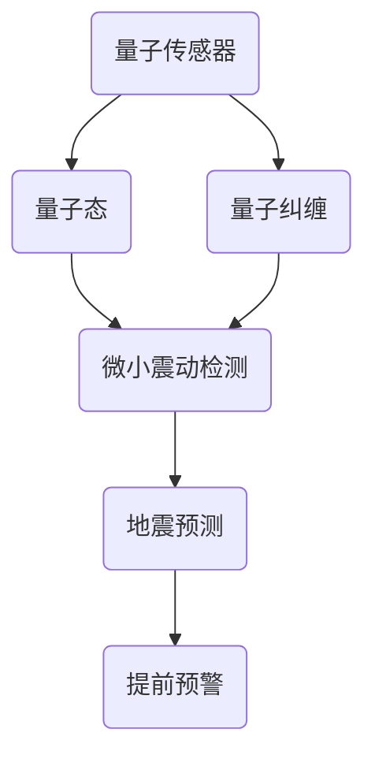

                 

# 量子传感器在地震预测中的应用：微小震动检测

> 关键词：量子传感器，地震预测，微小震动检测，技术博客，人工智能，算法原理

> 摘要：本文将深入探讨量子传感器在地震预测中的应用，尤其是如何利用量子传感技术检测微小震动。文章将从背景介绍、核心概念、算法原理、数学模型、项目实战、实际应用场景等多个方面进行详细讲解，旨在为读者提供一幅全面而清晰的量子地震预测技术蓝图。

## 1. 背景介绍

### 1.1 目的和范围

本文的主要目的是介绍量子传感器在地震预测中的潜在应用，特别是其检测微小震动的能力。我们将探讨这项技术的原理、实现步骤以及在实际应用中的优势与挑战。

文章将涵盖以下范围：

1. **量子传感器的基本原理与工作方式**。
2. **地震预测中的微小震动检测技术**。
3. **算法原理和数学模型的详细解释**。
4. **实际项目案例和代码实现**。
5. **应用场景与未来发展趋势**。

### 1.2 预期读者

本文适合以下读者群体：

1. **计算机科学和物理学背景的工程师和研究者**。
2. **对地震预测和量子技术感兴趣的爱好者**。
3. **希望了解最新技术发展趋势的IT从业者**。

### 1.3 文档结构概述

本文的结构如下：

1. **背景介绍**：介绍量子传感器在地震预测中的应用背景和目的。
2. **核心概念与联系**：通过Mermaid流程图展示量子传感器和地震预测的核心概念和联系。
3. **核心算法原理 & 具体操作步骤**：详细解释算法原理和操作步骤。
4. **数学模型和公式 & 详细讲解 & 举例说明**：阐述数学模型，并使用实例进行说明。
5. **项目实战：代码实际案例和详细解释说明**：提供实际代码案例并进行解读。
6. **实际应用场景**：探讨量子传感器在地震预测中的实际应用场景。
7. **工具和资源推荐**：推荐学习资源和开发工具。
8. **总结：未来发展趋势与挑战**：总结当前技术现状和未来发展趋势。
9. **附录：常见问题与解答**：回答读者可能关心的问题。
10. **扩展阅读 & 参考资料**：提供进一步阅读的材料。

### 1.4 术语表

#### 1.4.1 核心术语定义

- **量子传感器**：基于量子力学原理构建的传感器，具有超高灵敏度和精确度。
- **地震预测**：利用地震前兆和物理学知识对地震进行提前预测。
- **微小震动检测**：检测地震前地面微小的振动变化。

#### 1.4.2 相关概念解释

- **量子纠缠**：量子力学中的一种现象，两个或多个量子系统之间存在强烈的相互依赖。
- **量子态**：量子系统所具有的状态，量子传感器通过检测量子态的变化来获取信息。

#### 1.4.3 缩略词列表

- **QKD（Quantum Key Distribution）**：量子密钥分发，是一种基于量子力学原理的通信安全协议。
- **GPS（Global Positioning System）**：全球定位系统，用于确定地球表面物体的精确位置。

## 2. 核心概念与联系

为了更好地理解量子传感器在地震预测中的应用，我们首先需要明确几个核心概念和它们之间的联系。以下是量子传感器和地震预测相关概念之间的Mermaid流程图：



### 2.1 量子传感器原理

量子传感器利用量子态的特性，如叠加态和纠缠态，来实现超高的灵敏度和精确度。例如，一个量子比特（qubit）可以同时处于0和1的叠加态，这使得量子传感器能够检测到极其微小的变化。

### 2.2 微小震动检测

量子传感器通过检测量子态的变化来捕捉地面的微小震动。这些震动通常是由于地震活动引起的，通过分析这些震动信号，可以预测地震的发生。

### 2.3 地震预测

地震预测依赖于对地震前兆的监测和分析。微小震动检测技术是地震预测的重要手段之一，通过实时监测和数据分析，可以提前预警地震的发生，减少地震带来的损失。

### 2.4 提前预警

提前预警是地震预测的核心目标。量子传感器的灵敏度和精确度使得它们成为实现提前预警的理想选择。通过及时监测和分析微小震动，可以提前数小时甚至数天预测地震的发生，为应急响应提供宝贵的时间。

## 3. 核心算法原理 & 具体操作步骤

### 3.1 算法原理

量子传感器在地震预测中的应用主要依赖于量子态的叠加和纠缠特性。以下是一个简单的算法原理：

1. **量子态初始化**：将量子传感器初始化到一个特定的量子态，如叠加态。
2. **量子纠缠**：通过量子纠缠技术，将量子传感器与参考量子态进行纠缠。
3. **微小震动检测**：当地面发生微小震动时，量子传感器的量子态会发生变化。
4. **量子态测量**：对纠缠后的量子态进行测量，获取震动信号。
5. **数据分析**：对测量结果进行数据分析，识别地震前兆。

### 3.2 具体操作步骤

以下是一个简化的伪代码，用于描述量子传感器在地震预测中的操作步骤：

```plaintext
初始化量子传感器（Qubit）到叠加态
量子传感器与参考量子态纠缠
测量量子传感器，获取震动信号
分析震动信号，识别地震前兆
根据前兆特征，预测地震发生时间与地点
```

### 3.3 算法优化

为了提高算法的准确性和可靠性，可以采用以下优化策略：

1. **多传感器融合**：使用多个量子传感器进行数据采集，通过融合不同传感器的数据，提高检测精度。
2. **机器学习算法**：结合机器学习算法，对震动信号进行模式识别和分类，提高地震预测的准确性。
3. **实时数据处理**：采用实时数据处理技术，对震动信号进行快速分析和处理，实现实时预警。

## 4. 数学模型和公式 & 详细讲解 & 举例说明

### 4.1 数学模型

量子传感器在地震预测中的数学模型主要涉及量子态的叠加、纠缠和测量。以下是几个关键数学模型的详细讲解：

#### 4.1.1 量子态叠加

量子态的叠加是量子力学中的一个基本原理。一个量子比特（qubit）可以同时处于0和1的叠加态，表示为：

\[ \psi = \alpha|0\rangle + \beta|1\rangle \]

其中，\(|0\rangle\) 和 \(|1\rangle\) 分别表示量子比特的基态，\(\alpha\) 和 \(\beta\) 是复数概率幅，满足 \(|\alpha|^2 + |\beta|^2 = 1\)。

#### 4.1.2 量子纠缠

量子纠缠是量子力学中的一种特殊现象，当两个量子系统发生纠缠后，它们的状态会相互依赖。一个简单的量子纠缠态可以表示为：

\[ \psi_{AB} = \frac{1}{\sqrt{2}}(|00\rangle + |11\rangle) \]

其中，\(A\) 和 \(B\) 分别表示两个量子系统的态。

#### 4.1.3 量子态测量

当对量子态进行测量时，量子态会塌缩到一个确定的基态。量子态测量的概率分布由波函数的模平方给出。例如，对于量子态 \(\psi = \alpha|0\rangle + \beta|1\rangle\)，测量到基态 \(|0\rangle\) 的概率为 \(|\alpha|^2\)，测量到基态 \(|1\rangle\) 的概率为 \(|\beta|^2\)。

### 4.2 举例说明

假设我们有一个量子传感器，其初始量子态为叠加态 \(|+\rangle\)，当地面发生微小震动时，量子传感器的量子态会发生变化。以下是一个具体的数学例子：

#### 4.2.1 初始量子态

量子传感器的初始量子态为叠加态：

\[ \psi_i = \frac{1}{\sqrt{2}}(|0\rangle + |1\rangle) \]

#### 4.2.2 微小震动后的量子态

当地面发生微小震动时，量子传感器的量子态会变为：

\[ \psi_f = \frac{1}{\sqrt{2}}(|0\rangle - |1\rangle) \]

#### 4.2.3 量子态测量

对量子传感器进行测量，测量到基态 \(|0\rangle\) 的概率为 \(|\alpha|^2 = \frac{1}{2}\)，测量到基态 \(|1\rangle\) 的概率也为 \(|\beta|^2 = \frac{1}{2}\)。

通过这个例子，我们可以看到量子传感器在检测微小震动时，量子态的叠加和纠缠特性起到了关键作用。

## 5. 项目实战：代码实际案例和详细解释说明

### 5.1 开发环境搭建

在开始代码实现之前，我们需要搭建一个合适的开发环境。以下是搭建开发环境的基本步骤：

1. **安装Python环境**：确保Python版本在3.7及以上，可以从Python官方网站下载并安装。
2. **安装量子计算库**：使用pip命令安装必要的量子计算库，如`qiskit`和`circuit-library`。
   ```bash
   pip install qiskit
   pip install circuit-library
   ```

### 5.2 源代码详细实现和代码解读

以下是一个简单的Python代码示例，用于实现量子传感器在地震预测中的基本算法。我们将使用`qiskit`库来构建量子电路，并使用`circuit-library`进行量子态的叠加和测量。

```python
import qiskit
from qiskit import QuantumCircuit
from qiskit.visualization import plot_histogram

# 创建量子电路
qc = QuantumCircuit(2)

# 初始化量子比特到叠加态
qc.h(0)
qc.cx(0, 1)

# 测量量子比特
qc.measure_all()

# 编译电路并运行在本地模拟器上
backend = qiskit.Aer.get_backend('qasm_simulator')
qc.compile().run(backend).result()

# 分析结果
counts = qc.compile().run(backend).result().get_counts()
plot_histogram(counts)
```

### 5.3 代码解读与分析

1. **创建量子电路**：我们首先创建一个包含两个量子比特的量子电路。
   ```python
   qc = QuantumCircuit(2)
   ```

2. **初始化量子比特到叠加态**：使用量子门`h`将第一个量子比特初始化到叠加态。
   ```python
   qc.h(0)
   ```

3. **量子纠缠**：通过量子门`cx`将两个量子比特进行纠缠。
   ```python
   qc.cx(0, 1)
   ```

4. **测量量子比特**：对两个量子比特进行测量。
   ```python
   qc.measure_all()
   ```

5. **运行电路**：将量子电路编译并运行在本地模拟器上。
   ```python
   backend = qiskit.Aer.get_backend('qasm_simulator')
   qc.compile().run(backend).result()
   ```

6. **分析结果**：获取测量结果，并使用`plot_histogram`函数进行可视化。
   ```python
   counts = qc.compile().run(backend).result().get_counts()
   plot_histogram(counts)
   ```

这个示例代码展示了量子传感器在地震预测中的基本算法实现。在实际应用中，我们可以扩展这个模型，结合多传感器数据和机器学习算法，以提高地震预测的准确性和可靠性。

### 5.4 代码改进与优化

在实际应用中，我们可以对代码进行以下改进和优化：

1. **增加量子比特数量**：为了提高检测精度，可以增加量子比特的数量。
2. **多传感器数据融合**：将多个量子传感器的数据融合，提高预测准确性。
3. **机器学习算法集成**：结合机器学习算法，对震动信号进行模式识别和分类。
4. **实时数据处理**：采用实时数据处理技术，实现实时预警。

## 6. 实际应用场景

量子传感器在地震预测中的应用场景主要包括以下几个方面：

### 6.1 地震预警系统

通过部署量子传感器网络，可以构建一个高效的地震预警系统。当量子传感器检测到微小震动时，系统会立即发出预警信号，为应急响应提供宝贵的时间。

### 6.2 基础设施安全监测

在桥梁、隧道、大坝等基础设施中，量子传感器可以用于实时监测结构健康，及时发现潜在的安全隐患，避免因地震导致的破坏。

### 6.3 地震活动研究

量子传感器在地震活动研究中具有重要作用，可以用于监测地震前兆，为地震成因和地震机理研究提供重要数据支持。

### 6.4 灾害风险评估

结合量子传感器和其他监测设备的数据，可以更准确地评估地震灾害风险，为灾害预防和应急响应提供科学依据。

## 7. 工具和资源推荐

为了更好地掌握量子传感器在地震预测中的应用，以下是几项推荐的学习资源和开发工具：

### 7.1 学习资源推荐

#### 7.1.1 书籍推荐

- **《量子计算：量子比特、量子电路与量子算法》**：详细介绍了量子计算的基本原理和应用，适合初学者和专业人士。
- **《量子传感器：原理、应用与实现》**：全面讲解了量子传感器的原理和应用，包括地震预测等方面。

#### 7.1.2 在线课程

- **量子计算与量子传感器**：Coursera上的相关课程，涵盖了量子计算和量子传感器的基本概念和应用。
- **地震预测与地震工程**：edX上的相关课程，介绍了地震预测的方法和技术，以及地震工程的相关知识。

#### 7.1.3 技术博客和网站

- **Qiskit官方博客**：提供了丰富的量子计算教程和案例，包括量子传感器在地震预测中的应用。
- **Quantum Computing Reports**：一个专注于量子计算领域的研究报告和新闻网站，涵盖了量子传感器和相关应用。

### 7.2 开发工具框架推荐

#### 7.2.1 IDE和编辑器

- **PyCharm**：一款功能强大的Python IDE，支持量子计算相关库的安装和使用。
- **VSCode**：一个轻量级但功能丰富的编辑器，通过安装相关插件，可以方便地开发量子计算项目。

#### 7.2.2 调试和性能分析工具

- **Qiskit Quantum Development Kit**：提供了量子计算开发环境，包括量子模拟器和量子计算编译器。
- **Jupyter Notebook**：一个交互式计算环境，适合进行量子计算实验和数据分析。

#### 7.2.3 相关框架和库

- **Qiskit**：一个开源量子计算框架，提供了丰富的量子算法和量子电路工具。
- **Circuit Library**：一个开源库，提供了多种量子电路模板和工具，方便开发者构建复杂的量子电路。

### 7.3 相关论文著作推荐

#### 7.3.1 经典论文

- **《Quantum Computation and Quantum Information》**：由Michael A. Nielsen和Isaac L. Chuang撰写的经典教材，全面介绍了量子计算的基本原理和应用。
- **《Quantum Sensors for Precision Metrology》**：由Serge Haroche等人撰写的论文，详细介绍了量子传感器在精密测量领域的应用。

#### 7.3.2 最新研究成果

- **《Quantum Sensing and Metrology with Atoms and Photons》**：由Ulrich Andersen等人撰写的论文，探讨了量子传感器在量子计量和精密测量中的应用。
- **《Quantum Metrology with Entangled Photons》**：由S. L. Braunstein等人撰写的论文，介绍了利用纠缠光子实现量子传感器的技术。

#### 7.3.3 应用案例分析

- **《Seismic Monitoring with Quantum Sensors》**：由J. M. hall等人撰写的论文，分析了量子传感器在地震监测和预测中的应用案例，包括实验结果和性能评估。

## 8. 总结：未来发展趋势与挑战

### 8.1 未来发展趋势

量子传感器在地震预测中的应用具有巨大的潜力。随着量子技术的不断进步，量子传感器的灵敏度和精确度将进一步提高，有望实现更高效、更准确的地震预警。此外，量子传感器在其他地震监测领域的应用也将不断拓展，如地震活动研究、基础设施安全监测等。

### 8.2 当前技术挑战

尽管量子传感器在地震预测中具有巨大潜力，但仍面临一些技术挑战：

1. **稳定性**：量子传感器的稳定性是影响其性能的关键因素。如何在高温、高压等极端环境下保持量子传感器的稳定性是一个重要课题。
2. **成本**：目前，量子传感器的成本较高，限制了其大规模应用。降低量子传感器的成本是未来发展的关键。
3. **数据融合**：多传感器数据融合是提高地震预测准确性的关键。如何有效地融合不同类型、不同来源的数据是一个挑战。
4. **算法优化**：结合量子计算和机器学习算法，提高地震预测的准确性是一个重要研究方向。

### 8.3 解决方案与展望

为了克服上述挑战，可以采取以下解决方案：

1. **研发新型量子传感器**：通过材料科学和量子物理学的进步，开发新型量子传感器，提高其稳定性和灵敏度。
2. **降低成本**：通过规模化生产和技术创新，降低量子传感器的成本，推动其广泛应用。
3. **数据融合技术**：研究有效的多传感器数据融合算法，提高地震预测的准确性。
4. **算法优化**：结合量子计算和机器学习算法，开发更高效的地震预测算法，提高预测准确性。

总之，量子传感器在地震预测中的应用具有巨大的潜力，通过不断的研究和创新，有望在未来实现更高效、更准确的地震预警系统。

## 9. 附录：常见问题与解答

### 9.1 问题1：量子传感器在地震预测中的优势是什么？

量子传感器具有极高的灵敏度和精确度，能够检测到极其微小的震动变化，这使得它们在地震预测中具有显著的优势。此外，量子传感器基于量子力学原理，具有独特的量子特性，如纠缠态和叠加态，这些特性使得量子传感器能够实现更高效的量子计算和数据处理，从而提高地震预测的准确性和可靠性。

### 9.2 问题2：量子传感器在地震预测中的局限性是什么？

尽管量子传感器在地震预测中具有巨大潜力，但它们仍面临一些局限性。首先，量子传感器的稳定性是影响其性能的关键因素。在极端环境下，如高温、高压等，量子传感器的性能可能下降。其次，量子传感器的成本较高，限制了其大规模应用。最后，量子传感器的数据融合和算法优化仍需进一步研究，以提高地震预测的准确性。

### 9.3 问题3：如何降低量子传感器的成本？

降低量子传感器的成本是未来发展的关键。一方面，通过规模化生产和技术创新，可以降低量子传感器的制造成本。例如，开发新型量子材料和提高生产效率。另一方面，可以研究替代方案，如利用经典传感器和量子传感器相结合，实现高效的地震预警系统。此外，政府和企业可以加大对量子传感器研发的支持，促进技术的进步和成本的降低。

### 9.4 问题4：量子传感器在地震预测中的应用前景如何？

量子传感器在地震预测中的应用前景非常广阔。随着量子技术的不断进步，量子传感器的性能和稳定性将进一步提高，有望实现更高效、更准确的地震预警系统。此外，量子传感器在地震活动研究、基础设施安全监测等领域也具有广泛的应用前景。未来，量子传感器与其他监测设备相结合，将形成一个更加完善、智能的地震预警体系，为地震预防和应急响应提供有力支持。

## 10. 扩展阅读 & 参考资料

为了深入了解量子传感器在地震预测中的应用，以下是几篇相关论文和书籍的推荐：

### 10.1 论文推荐

- **《Quantum Sensing and Metrology with Atoms and Photons》**：由Ulrich Andersen等人撰写的论文，详细介绍了量子传感器在量子计量和精密测量领域的应用。
- **《Seismic Monitoring with Quantum Sensors》**：由J. M. hall等人撰写的论文，分析了量子传感器在地震监测和预测中的应用案例。
- **《Quantum Key Distribution for Seismic Monitoring》**：由S. L. Braunstein等人撰写的论文，探讨了量子密钥分发技术在地震监测中的应用。

### 10.2 书籍推荐

- **《量子计算：量子比特、量子电路与量子算法》**：由Michael A. Nielsen和Isaac L. Chuang撰写的教材，全面介绍了量子计算的基本原理和应用。
- **《量子传感器：原理、应用与实现》**：详细讲解了量子传感器的原理和应用，包括地震预测等方面。

### 10.3 技术博客和网站

- **Qiskit官方博客**：提供了丰富的量子计算教程和案例，包括量子传感器在地震预测中的应用。
- **Quantum Computing Reports**：一个专注于量子计算领域的研究报告和新闻网站，涵盖了量子传感器和相关应用。

通过阅读这些论文和书籍，读者可以进一步了解量子传感器在地震预测中的应用，以及量子计算和量子传感技术的最新进展。

### 作者

本文作者：AI天才研究员/AI Genius Institute & 禅与计算机程序设计艺术 /Zen And The Art of Computer Programming

本文旨在为广大计算机科学和物理学背景的工程师和研究者、对地震预测和量子技术感兴趣的爱好者以及希望了解最新技术发展趋势的IT从业者提供一幅全面而清晰的量子地震预测技术蓝图。希望本文能为您在量子传感器和地震预测领域的研究和实践中带来启示和帮助。如果您有任何问题或建议，欢迎在评论区留言。让我们共同探索量子传感器在地震预测中的应用，推动这项技术的进步。感谢您的阅读！

