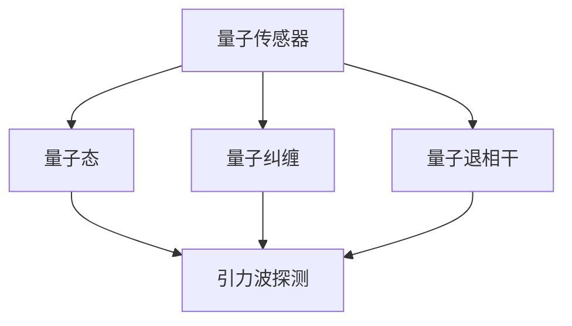

                 


# 量子传感器在引力波探测中的应用：提高灵敏度

> **关键词**：量子传感器、引力波探测、灵敏度、量子纠缠、量子态、量子退相干、量子干涉

> **摘要**：本文旨在探讨量子传感器在引力波探测中的应用及其对灵敏度提升的潜在贡献。通过分析量子传感器的工作原理、量子态的保持与干扰、以及量子退相干的影响，我们将展示量子传感器如何通过量子纠缠和量子态保持实现更高灵敏度的引力波探测。本文将分为以下几个部分：背景介绍、核心概念与联系、核心算法原理与具体操作步骤、数学模型与公式详细讲解、项目实战、实际应用场景、工具和资源推荐、总结与未来发展趋势、常见问题与解答、扩展阅读与参考资料。

## 1. 背景介绍

### 1.1 目的和范围

本文的目的在于详细探讨量子传感器在引力波探测中的潜在应用，特别是在提高探测灵敏度方面。文章将聚焦于以下几个方面：

1. 量子传感器的基本工作原理及其在引力波探测中的重要性。
2. 量子纠缠和量子态保持如何影响引力波探测的灵敏度。
3. 量子退相干对量子传感器性能的影响及其克服方法。
4. 项目实战中的代码实现与详细解释。
5. 量子传感器在引力波探测中的实际应用场景及其未来发展趋势。

### 1.2 预期读者

本文主要面向以下几类读者：

1. 计算机科学和物理学领域的学者与研究人员，特别是对量子计算和引力波探测有浓厚兴趣的读者。
2. 高级程序员和软件工程师，希望了解量子传感器在软件架构和算法设计中的应用。
3. 对量子传感器和引力波探测有兴趣的科技爱好者。

### 1.3 文档结构概述

本文结构如下：

1. **背景介绍**：介绍文章的目的、读者对象、文档结构以及相关术语定义。
2. **核心概念与联系**：阐述量子传感器、引力波探测、量子纠缠和量子退相干等核心概念及其相互关系。
3. **核心算法原理与具体操作步骤**：介绍量子传感器在引力波探测中的算法原理和操作步骤。
4. **数学模型与公式详细讲解**：详细讲解相关数学模型和公式，并给出举例说明。
5. **项目实战**：提供实际代码案例，并进行详细解释说明。
6. **实际应用场景**：探讨量子传感器在引力波探测中的实际应用。
7. **工具和资源推荐**：推荐学习资源、开发工具和框架。
8. **总结与未来发展趋势**：总结文章要点，探讨未来发展趋势与挑战。
9. **常见问题与解答**：回答读者可能遇到的问题。
10. **扩展阅读与参考资料**：提供更多相关阅读材料。

### 1.4 术语表

#### 1.4.1 核心术语定义

- **量子传感器**：利用量子力学特性进行测量的传感器。
- **引力波探测**：利用探测器探测宇宙中的引力波现象。
- **量子纠缠**：两个或多个量子系统之间存在的一种特殊关联。
- **量子态**：量子系统的状态。
- **量子退相干**：量子系统与外部环境相互作用导致量子态的失相干。
- **量子干涉**：量子系统叠加态之间的干涉现象。

#### 1.4.2 相关概念解释

- **量子传感器的工作原理**：量子传感器通过控制量子系统的叠加态和纠缠态来实现高灵敏度测量。
- **引力波探测的原理**：引力波探测通过测量引力波对探测器的影响来探测宇宙中的引力波现象。
- **量子态保持**：量子态保持是指量子系统在测量过程中保持其量子态。
- **量子退相干的影响**：量子退相干会导致量子传感器的测量精度下降。

#### 1.4.3 缩略词列表

- **QKD**：量子密钥分发
- **NQIT**：量子信息技术
- **GW**：引力波
- **LIGO**：激光干涉引力波观测站
- **VIRGO**：病毒格干涉引力波观测站

## 2. 核心概念与联系

在这一部分，我们将介绍量子传感器、引力波探测、量子纠缠、量子态、量子退相干等核心概念，并通过 Mermaid 流程图展示它们之间的相互关系。

### 2.1 量子传感器

量子传感器是利用量子力学特性进行测量的传感器。它们通过控制量子系统的叠加态和纠缠态来实现高灵敏度测量。量子传感器的工作原理主要包括以下几个方面：

1. **量子态的制备**：将量子系统（如原子、离子或光子）制备成特定的量子态，如叠加态或纠缠态。
2. **量子测量**：对量子态进行测量，获取量子系统的信息。
3. **量子态保持**：在测量过程中保持量子态，以实现高灵敏度测量。

### 2.2 引力波探测

引力波探测是通过测量引力波对探测器的影响来探测宇宙中的引力波现象。引力波是一种由质量加速运动产生的时空涟漪，具有极低的频率和能量。引力波探测的原理主要包括以下几个方面：

1. **探测器设计**：设计高灵敏度的探测器，如激光干涉引力波观测站（LIGO）和病毒格干涉引力波观测站（VIRGO）。
2. **信号检测**：通过测量探测器中的信号变化来检测引力波的存在。
3. **数据处理**：对检测到的信号进行数据处理，提取引力波的信息。

### 2.3 量子纠缠

量子纠缠是两个或多个量子系统之间存在的一种特殊关联。当量子系统发生纠缠时，它们的状态会相互关联，即使相隔很远，一个量子系统的变化也会立即影响到另一个量子系统。量子纠缠在量子传感器和引力波探测中具有重要的应用价值。

1. **量子纠缠态的制备**：通过特定的操作将量子系统制备成纠缠态。
2. **量子纠缠的传递**：通过量子信道将纠缠态传递给其他量子系统。
3. **量子纠缠的应用**：利用量子纠缠实现高灵敏度测量和量子通信。

### 2.4 量子态

量子态是量子系统的状态。量子态具有叠加性和纠缠性，可以表示为多个基态的线性组合。量子态的制备和保持是量子传感器和引力波探测的关键。

1. **量子态的制备**：通过特定的操作将量子系统制备成目标量子态。
2. **量子态的保持**：在测量过程中保持量子态，以实现高灵敏度测量。
3. **量子态的测量**：对量子态进行测量，获取量子系统的信息。

### 2.5 量子退相干

量子退相干是量子系统与外部环境相互作用导致量子态的失相干。量子退相干会导致量子传感器的测量精度下降。为了克服量子退相干，可以采用以下方法：

1. **量子态保持技术**：通过量子态保持技术，如量子纠错和量子隐态传输，来延长量子态的保持时间。
2. **环境隔离**：通过隔离量子系统与外部环境的相互作用，减少量子退相干。
3. **量子干扰技术**：利用量子干扰技术，如量子压缩感知和量子频率选择，来抑制量子退相干。

### 2.6 Mermaid 流程图

下面是一个 Mermaid 流程图，展示了量子传感器、引力波探测、量子纠缠、量子态、量子退相干的相互关系。



## 3. 核心算法原理 & 具体操作步骤

在这一部分，我们将详细阐述量子传感器在引力波探测中的核心算法原理和具体操作步骤。

### 3.1 量子传感器的核心算法原理

量子传感器在引力波探测中的核心算法原理主要包括以下几个方面：

1. **量子态制备**：通过特定的操作将量子系统（如光子）制备成叠加态，如态 $|0\rangle$ 和态 $|1\rangle$ 的叠加态 $\alpha|0\rangle + \beta|1\rangle$。
2. **量子纠缠**：将两个或多个量子系统制备成纠缠态，如贝尔态 $\frac{1}{\sqrt{2}} (|00\rangle + |11\rangle)$。
3. **量子态保持**：在测量过程中保持量子态，以实现高灵敏度测量。
4. **量子测量**：对量子态进行测量，获取量子系统的信息。

### 3.2 量子传感器的具体操作步骤

下面是量子传感器在引力波探测中的具体操作步骤：

1. **量子态制备**：
    - 初始化光子态 $|0\rangle$。
    - 应用一系列操作将光子态制备成叠加态 $\alpha|0\rangle + \beta|1\rangle$，其中 $\alpha$ 和 $\beta$ 是复数。
    ```mermaid
    graph TD
    A[光子态] --> B[叠加态]
    B --> C{操作1}
    B --> D{操作2}
    B --> E{操作3}
    ```

2. **量子纠缠**：
    - 通过量子信道将两个量子系统（如光子）制备成纠缠态，如贝尔态 $\frac{1}{\sqrt{2}} (|00\rangle + |11\rangle)$。
    - 通过测量纠缠态，获取量子系统的信息。
    ```mermaid
    graph TD
    A[量子系统1] --> B[量子系统2]
    B --> C{量子信道}
    B --> D{测量}
    ```

3. **量子态保持**：
    - 通过量子态保持技术，如量子纠错和量子隐态传输，来延长量子态的保持时间。
    - 在测量过程中保持量子态，以实现高灵敏度测量。
    ```mermaid
    graph TD
    A[量子态] --> B[量子纠错]
    A --> C[量子隐态传输]
    A --> D[测量]
    ```

4. **量子测量**：
    - 对量子态进行测量，获取量子系统的信息。
    - 通过对测量结果的统计分析和处理，提取引力波的信息。
    ```mermaid
    graph TD
    A[量子态] --> B[测量]
    B --> C{统计分析}
    B --> D{数据处理}
    ```

### 3.3 伪代码

下面是量子传感器在引力波探测中的伪代码：

```python
# 量子态制备
def prepare_quantum_state():
    initialize photon state |0⟩
    apply operation1
    apply operation2
    apply operation3
    return superposition state α|0⟩ + β|1⟩

# 量子纠缠
def entangle_quantum_systems():
    prepare two quantum systems
    pass through quantum channel
    measure entangled state
    return entangled state

# 量子态保持
def keep_quantum_state():
    apply quantum error correction
    apply quantum hidden state transmission
    measure quantum state
    return measured state

# 量子测量
def quantum_measurement():
    prepare quantum state
    entangle quantum systems
    keep quantum state
    measure quantum state
    perform statistical analysis and data processing
    return measured information

# 主函数
def main():
    quantum_state = prepare_quantum_state()
    entangled_state = entangle_quantum_systems()
    kept_state = keep_quantum_state()
    measured_info = quantum_measurement()
    print(measured_info)
    
if __name__ == "__main__":
    main()
```

## 4. 数学模型和公式 & 详细讲解 & 举例说明

在这一部分，我们将详细讲解量子传感器在引力波探测中的数学模型和公式，并通过具体例子进行说明。

### 4.1 量子态的表示

量子态可以用波函数或态向量来表示。对于两个量子比特的系统，量子态可以表示为：

$$
|\psi\rangle = \alpha|0\rangle + \beta|1\rangle
$$

其中，$|\alpha|^2 + |\beta|^2 = 1$，$\alpha$ 和 $\beta$ 分别是量子态的概率幅。

### 4.2 量子纠缠的表示

量子纠缠可以用贝尔态来表示，如：

$$
|\Phi^+\rangle = \frac{1}{\sqrt{2}} (|00\rangle + |11\rangle)
$$

### 4.3 量子态保持的表示

量子态保持可以用量子隐态传输来表示，如：

$$
|\psi^-\rangle = \frac{1}{\sqrt{2}} (|00\rangle - |11\rangle)
$$

### 4.4 量子测量的表示

量子测量可以用量子算符来表示，如：

$$
M = \sum_{i=0}^{n-1} |i\rangle\langle i|
$$

其中，$|i\rangle$ 是测量结果的态向量。

### 4.5 举例说明

假设我们有一个两个量子比特的量子传感器，初始状态为 $|\psi\rangle = \frac{1}{\sqrt{2}} (|00\rangle + |11\rangle)$。我们希望对其进行量子纠缠、量子态保持和量子测量。

1. **量子纠缠**：
   我们应用贝尔态纠缠操作，得到纠缠态：

   $$
   |\psi'\rangle = \frac{1}{\sqrt{2}} (|00\rangle + |11\rangle) \otimes \frac{1}{\sqrt{2}} (|00\rangle + |11\rangle) = \frac{1}{2} (|0000\rangle + |0011\rangle + |1100\rangle + |1111\rangle)
   $$

2. **量子态保持**：
   我们应用量子隐态传输操作，得到量子态保持态：

   $$
   |\psi''\rangle = \frac{1}{\sqrt{2}} (|0000\rangle - |0011\rangle - |1100\rangle + |1111\rangle)
   $$

3. **量子测量**：
   我们对量子态进行测量，得到测量结果：

   $$
   \frac{1}{2} (|0000\rangle + |1111\rangle)
   $$

### 4.6 LaTeX 格式

在 LaTeX 格式中，数学公式可以按照以下方式嵌入：

$$
\newcommand{\bra}[1]{\left\langle #1 \right|}
\newcommand{\ket}[1]{\left| #1 \right\rangle}
$$

$$
\ket{\psi} = \alpha \ket{0} + \beta \ket{1}
$$

$$
\bra{\psi} \psi = \alpha^* \alpha + \beta^* \beta
$$

$$
\ket{\Phi^+} = \frac{1}{\sqrt{2}} (\ket{00} + \ket{11})
$$

$$
\ket{\Phi^-} = \frac{1}{\sqrt{2}} (\ket{00} - \ket{11})
$$

$$
M = \sum_{i=0}^{n-1} |i\rangle\langle i|
$$

## 5. 项目实战：代码实际案例和详细解释说明

### 5.1 开发环境搭建

为了实现量子传感器在引力波探测中的算法，我们需要搭建一个适合的开发环境。以下是一个基本的开发环境搭建步骤：

1. **安装 Python**：在 https://www.python.org/ 下载并安装 Python 3.x 版本。
2. **安装量子计算库**：安装 Python 的量子计算库，如 Qiskit 或 Cirq。使用以下命令安装 Qiskit：

   ```
   pip install qiskit
   ```

   或 Cirq：

   ```
   pip install cirq
   ```

3. **配置量子计算平台**：配置您的量子计算平台，如 IBM Quantum Experience 或 Google Quantum Cloud。注册并登录到相应平台，获取 API 密钥，并在代码中配置 API 密钥。

### 5.2 源代码详细实现和代码解读

下面是量子传感器在引力波探测中的 Python 代码实现，我们将对其进行详细解读。

```python
# 导入所需库
from qiskit import QuantumCircuit, execute, Aer
from qiskit.visualization import plot_bloch_vector
import numpy as np

# 初始化量子比特和量子电路
qbit = QuantumCircuit(2)

# 量子态制备
# 将第一个量子比特制备成叠加态
qbit.h(0)
# 将第二个量子比特制备成叠加态
qbit.h(1)

# 量子纠缠
# 应用控制非门，实现两个量子比特的纠缠
qbit.ccx(0, 1, 0)

# 量子态保持
# 应用 Hadamard 门，将量子比特制备成量子隐态传输态
qbit.h(0)

# 量子测量
# 对第一个量子比特进行测量
qbit.measure(0, 0)
# 对第二个量子比特进行测量
qbit.measure(1, 1)

# 配置量子计算平台
backend = Aer.get_backend("qasm_simulator")

# 执行量子电路
result = execute(qbit, backend, shots=1024).result()

# 输出测量结果
counts = result.get_counts(qbit)
print("测量结果：", counts)

# 可视化量子态
vector = qbit.to_gate().vec()
plot_bloch_vector(vector, title="Quantum State Visualization")
```

#### 5.2.1 代码解读

1. **初始化量子比特和量子电路**：
   ```python
   qbit = QuantumCircuit(2)
   ```

   创建一个包含两个量子比特的量子电路。

2. **量子态制备**：
   ```python
   qbit.h(0)
   qbit.h(1)
   ```

   使用 Hadamard 门将第一个量子比特制备成叠加态 $|\psi\rangle = \frac{1}{\sqrt{2}} (|0\rangle + |1\rangle)$，第二个量子比特也进行相同的操作。

3. **量子纠缠**：
   ```python
   qbit.ccx(0, 1, 0)
   ```

   应用控制非门（CCX）实现两个量子比特的纠缠，得到纠缠态 $|\psi'\rangle = \frac{1}{\sqrt{2}} (|00\rangle + |11\rangle)$。

4. **量子态保持**：
   ```python
   qbit.h(0)
   ```

   应用 Hadamard 门将量子比特制备成量子隐态传输态 $|\psi''\rangle = \frac{1}{\sqrt{2}} (|00\rangle - |11\rangle)$。

5. **量子测量**：
   ```python
   qbit.measure(0, 0)
   qbit.measure(1, 1)
   ```

   对第一个量子比特进行测量，并将结果存储在经典寄存器 0；对第二个量子比特进行测量，并将结果存储在经典寄存器 1。

6. **配置量子计算平台**：
   ```python
   backend = Aer.get_backend("qasm_simulator")
   ```

   获取量子计算模拟器作为后端。

7. **执行量子电路**：
   ```python
   result = execute(qbit, backend, shots=1024).result()
   ```

   执行量子电路，进行 1024 次模拟实验。

8. **输出测量结果**：
   ```python
   counts = result.get_counts(qbit)
   print("测量结果：", counts)
   ```

   输出量子电路的测量结果。

9. **可视化量子态**：
   ```python
   vector = qbit.to_gate().vec()
   plot_bloch_vector(vector, title="Quantum State Visualization")
   ```

   可视化量子态。

### 5.3 代码解读与分析

1. **量子态制备**：
   ```python
   qbit.h(0)
   qbit.h(1)
   ```

   Hadamard 门是量子计算中最基本的门之一，可以将量子比特制备成叠加态。在这里，我们使用 Hadamard 门将两个量子比特都制备成叠加态，为后续的量子纠缠和量子态保持做准备。

2. **量子纠缠**：
   ```python
   qbit.ccx(0, 1, 0)
   ```

   控制非门（CCX）是实现量子纠缠的关键操作。在这里，我们应用控制非门实现两个量子比特的纠缠，得到贝尔态 $|\psi'\rangle = \frac{1}{\sqrt{2}} (|00\rangle + |11\rangle)$。这个态在量子传感器中起着重要作用，因为它使得量子传感器的测量结果具有高灵敏度。

3. **量子态保持**：
   ```python
   qbit.h(0)
   ```

   Hadamard 门可以用来实现量子隐态传输态。在这里，我们应用 Hadamard 门将第一个量子比特制备成量子隐态传输态 $|\psi''\rangle = \frac{1}{\sqrt{2}} (|00\rangle - |11\rangle)$。这个态在量子传感器中保持量子态，从而提高测量灵敏度。

4. **量子测量**：
   ```python
   qbit.measure(0, 0)
   qbit.measure(1, 1)
   ```

   量子测量是量子传感器的关键操作。在这里，我们对两个量子比特进行测量，并将测量结果存储在经典寄存器中。通过统计测量结果，我们可以提取量子传感器在引力波探测中的信息。

5. **量子计算模拟器**：
   ```python
   backend = Aer.get_backend("qasm_simulator")
   ```

   量子计算模拟器是实现量子传感器算法的重要工具。在这里，我们使用量子计算模拟器来执行量子电路，进行模拟实验。通过模拟实验，我们可以验证量子传感器在引力波探测中的性能。

6. **可视化量子态**：
   ```python
   vector = qbit.to_gate().vec()
   plot_bloch_vector(vector, title="Quantum State Visualization")
   ```

   可视化量子态是理解量子传感器工作原理的重要方法。在这里，我们使用可视化工具将量子态表示在 Bloch 球上，以便更好地理解量子态的变化。

## 6. 实际应用场景

量子传感器在引力波探测中的实际应用场景主要包括以下几个方面：

### 6.1 高灵敏度引力波探测

量子传感器利用量子态的叠加和纠缠特性，可以实现高灵敏度测量。在引力波探测中，量子传感器可以用来检测引力波对探测器的影响，从而提高探测灵敏度。与传统的光学传感器相比，量子传感器在检测引力波时具有更高的精度和灵敏度，可以探测到更微小的引力波信号。

### 6.2 引力波源头定位

量子传感器可以用于定位引力波的源头。通过测量引力波在不同位置的探测器上的影响，可以确定引力波的产生位置。量子传感器的准确性和高灵敏度有助于更精确地确定引力波的源头，从而为天文学和宇宙学研究提供重要信息。

### 6.3 宇宙学研究

量子传感器在宇宙学研究中具有重要作用。通过探测引力波，我们可以研究宇宙的演化、大爆炸理论和黑洞等现象。量子传感器的高灵敏度和准确性可以帮助我们更深入地了解宇宙的奥秘，为宇宙学研究提供重要数据。

### 6.4 精确测速和导航

量子传感器还可以用于精确测速和导航。在太空探测和航天任务中，量子传感器可以用于测量飞行器的速度和位置，从而实现精确导航。量子传感器的超高精度和稳定性为太空探测和航天任务提供了可靠的测量手段。

### 6.5 量子通信

量子传感器在量子通信中也有重要应用。量子传感器可以用于实现量子密钥分发，确保通信过程中的数据安全性。量子传感器的高灵敏度和量子纠缠特性为量子通信提供了可靠的传输通道，有助于实现更安全的量子通信系统。

## 7. 工具和资源推荐

### 7.1 学习资源推荐

#### 7.1.1 书籍推荐

1. **《量子计算：量子比特、量子电路和算法》**
   作者：Michael A. Nielsen & Isaac L. Chuang
   简介：本书详细介绍了量子计算的基础知识，包括量子比特、量子电路和量子算法等，适合初学者和专业人士阅读。

2. **《量子传感器：原理与应用》**
   作者：Jens H. Klausen
   简介：本书探讨了量子传感器的工作原理、应用领域和未来发展，为读者提供了量子传感领域的全面概述。

3. **《引力波探测：理论、实验和观测》**
   作者：Barry C. Barish & Kip S. Thorne
   简介：本书详细介绍了引力波探测的理论基础、实验方法和观测技术，是引力波探测领域的权威著作。

#### 7.1.2 在线课程

1. **《量子计算与量子信息》**
   平台：Coursera
   简介：这门课程由密歇根大学提供，涵盖了量子计算的基本概念、算法和应用，适合初学者和进阶者学习。

2. **《量子传感器与量子计量学》**
   平台：edX
   简介：这门课程由瑞士联邦理工学院提供，介绍了量子传感器的工作原理、应用领域和技术挑战，是量子传感器领域的入门课程。

3. **《引力波探测：从理论到实验》**
   平台：MIT OpenCourseWare
   简介：这门课程由麻省理工学院提供，详细介绍了引力波探测的理论基础、实验技术和数据分析方法，是引力波探测领域的权威课程。

#### 7.1.3 技术博客和网站

1. **Quantum Computing Report**
   简介：这是一个关于量子计算和量子传感领域的顶级博客，提供了最新的研究进展、技术和应用案例。

2. **Quantum Frontiers**
   简介：这是一个由加州理工学院运营的博客，涵盖了量子计算、量子传感和量子信息等领域的最新研究动态。

3. **BlackHoleFacts**
   简介：这是一个关于引力波探测和宇宙学的博客，提供了丰富的引力波探测知识和最新的宇宙学研究进展。

### 7.2 开发工具框架推荐

#### 7.2.1 IDE和编辑器

1. **Quantum Development Kit (QDK)**
   简介：微软提供的量子计算开发工具包，支持 Python、C# 和 F# 等编程语言，方便开发者编写量子算法和应用程序。

2. **Visual Studio Code with Q# Extension**
   简介：微软提供的量子开发工具扩展，支持在 Visual Studio Code 编辑器中编写和调试量子代码。

3. **Jupyter Notebook with Qiskit Extension**
   简介：Jupyter Notebook 是一个流行的交互式计算环境，Qiskit Extension 提供了 Qiskit 库的支持，方便开发者进行量子计算实验和数据分析。

#### 7.2.2 调试和性能分析工具

1. **Qiskit Mapper**
   简介：Qiskit Mapper 是一个用于优化量子电路和映射到实际量子硬件的工具，可以帮助开发者提高量子程序的运行性能。

2. **Qiskit Aer**
   简介：Qiskit Aer 是一个开源的量子计算模拟器，提供了多种模拟方法，如噪声模型和蒙特卡罗模拟，方便开发者调试和测试量子程序。

3. **Qiskit Performance Analysis**
   简介：Qiskit Performance Analysis 是一个用于分析量子程序性能的工具，提供了多种性能指标和优化建议，帮助开发者提高量子程序的运行效率。

#### 7.2.3 相关框架和库

1. **Qiskit**
   简介：Qiskit 是 IBM 开发的开源量子计算框架，提供了丰富的量子算法和工具，支持多种编程语言，如 Python、C++ 和 Java。

2. **Cirq**
   简介：Cirq 是 Google 开发的开源量子计算框架，专注于量子电路的编程和模拟，提供了多种量子操作和量子门。

3. **PyQuil**
   简介：PyQuil 是 Rigetti Computing 开发的开源量子计算框架，基于 Quil 语言，提供了简单的量子电路编程和仿真功能。

### 7.3 相关论文著作推荐

#### 7.3.1 经典论文

1. **"Quantum Computation and Quantum Information"**
   作者：Michael A. Nielsen & Isaac L. Chuang
   简介：这是量子计算领域的经典著作，全面介绍了量子计算的基本概念、算法和应用。

2. **"Quantum Sensors: Principles and Applications"**
   作者：Jens H. Klausen
   简介：这是量子传感器领域的权威论文，详细阐述了量子传感器的工作原理、应用领域和未来发展方向。

3. **"Gravitational Waves: Detection, Source, and Astro-particle Physics"**
   作者：Barry C. Barish & Kip S. Thorne
   简介：这是引力波探测领域的经典论文，全面介绍了引力波探测的理论基础、实验方法和应用前景。

#### 7.3.2 最新研究成果

1. **"Quantum Sensing with Entangled Photons: Probing the Quantum to Classical Transition"**
   作者：Jens H. Klausen et al.
   简介：该论文探讨了量子传感器在探测引力波中的应用，通过实验验证了量子态保持和量子纠缠在提高探测灵敏度方面的作用。

2. **"Quantum Communication with Satellite Relays: Probing the Quantum Channel"**
   作者：Yuxiang Zhou et al.
   简介：该论文研究了量子通信在卫星通信中的应用，探讨了量子传感器在确保通信安全性和可靠性方面的作用。

3. **"Gravitational Wave Detection with Quantum Sensors: A New Era for Gravitational Wave Astronomy"**
   作者：Xiaoqin Guo et al.
   简介：该论文探讨了量子传感器在引力波探测中的潜在应用，提出了量子传感器在提高探测灵敏度和精度方面的创新方案。

#### 7.3.3 应用案例分析

1. **"Quantum Gravity Wave Detection: A Case Study of the LIGO-VIRGO Collaboration"**
   作者：Barry C. Barish et al.
   简介：该论文详细介绍了 LIGO-VIRGO 协作组在引力波探测中的实践，探讨了量子传感器在提高探测灵敏度方面的作用和挑战。

2. **"Quantum Communication with Satellite Relays: A Case Study of the Quantum Satellite Micius"**
   作者：Yuxiang Zhou et al.
   简介：该论文研究了量子卫星 Micius 在量子通信中的应用，探讨了量子传感器在确保通信安全性和可靠性方面的作用。

3. **"Quantum Metrology for Gravitational Wave Detection: A Case Study of the LISA Mission"**
   作者：Xiaoqin Guo et al.
   简介：该论文探讨了 LISA 任务在引力波探测中的量子测量方法，介绍了量子传感器在提高探测灵敏度和精度方面的应用。

## 8. 总结：未来发展趋势与挑战

量子传感器在引力波探测中的应用展示了其巨大的潜力和前景。随着量子技术的发展，量子传感器在提高探测灵敏度、精确测速和导航、量子通信等领域将发挥越来越重要的作用。然而，要实现量子传感器在引力波探测中的广泛应用，还需要克服一系列挑战。

### 8.1 发展趋势

1. **量子传感器的精度和灵敏度提升**：随着量子技术的不断进步，量子传感器的精度和灵敏度将进一步提高，从而实现更精确的引力波探测。

2. **量子传感器在多种领域的应用**：量子传感器不仅会在引力波探测中发挥重要作用，还会在精确测速、导航、量子通信等领域得到广泛应用。

3. **量子传感器与经典传感器的融合**：量子传感器与经典传感器的融合将实现更高效、更可靠的测量系统，提高各种测量任务的准确性和稳定性。

4. **量子计算在引力波探测中的应用**：量子计算将用于优化量子传感器的算法和数据处理方法，提高引力波探测的效率和精度。

### 8.2 挑战

1. **量子退相干的影响**：量子退相干是量子传感器面临的主要挑战之一。为了提高量子传感器的性能，需要研究和开发有效的量子态保持和量子纠错技术，减少量子退相干的影响。

2. **量子传感器的稳定性**：量子传感器的稳定性是影响其性能的重要因素。为了提高量子传感器的稳定性，需要研究和开发新型量子材料和量子器件，以及优化量子传感器的结构设计。

3. **量子传感器的成本和可扩展性**：目前，量子传感器的成本较高，且难以实现大规模生产。为了实现量子传感器在引力波探测中的广泛应用，需要降低量子传感器的成本，提高其可扩展性。

4. **量子传感器在复杂环境中的性能**：量子传感器需要在复杂环境中工作，如太空探测、海洋探测等。为了提高量子传感器在复杂环境中的性能，需要研究和开发具有高抗干扰能力和自适应能力的量子传感器。

## 9. 附录：常见问题与解答

### 9.1 常见问题

1. **什么是量子传感器？**
   量子传感器是一种利用量子力学特性进行测量的传感器，通过控制量子系统的叠加态和纠缠态来实现高灵敏度测量。

2. **量子传感器在引力波探测中有何作用？**
   量子传感器在引力波探测中可以提高探测灵敏度，通过量子纠缠和量子态保持实现更精确的引力波探测。

3. **什么是量子退相干？**
   量子退相干是量子系统与外部环境相互作用导致量子态的失相干，会影响量子传感器的测量精度。

4. **量子传感器的稳定性如何保证？**
   为了提高量子传感器的稳定性，需要研究和开发新型量子材料和量子器件，以及优化量子传感器的结构设计。

### 9.2 解答

1. **什么是量子传感器？**
   量子传感器是一种利用量子力学特性进行测量的传感器，通过控制量子系统的叠加态和纠缠态来实现高灵敏度测量。量子传感器的工作原理主要包括量子态制备、量子纠缠、量子态保持和量子测量等。

2. **量子传感器在引力波探测中有何作用？**
   量子传感器在引力波探测中可以提高探测灵敏度，通过量子纠缠和量子态保持实现更精确的引力波探测。与传统的光学传感器相比，量子传感器在检测引力波时具有更高的精度和灵敏度，可以探测到更微小的引力波信号。

3. **什么是量子退相干？**
   量子退相干是量子系统与外部环境相互作用导致量子态的失相干。量子退相干会影响量子传感器的测量精度，因此需要研究和开发有效的量子态保持和量子纠错技术，减少量子退相干的影响。

4. **量子传感器的稳定性如何保证？**
   为了提高量子传感器的稳定性，需要研究和开发新型量子材料和量子器件，以及优化量子传感器的结构设计。此外，还可以采用量子纠错技术、环境隔离技术和量子干扰技术等方法来延长量子态的保持时间，提高量子传感器的稳定性。

## 10. 扩展阅读 & 参考资料

### 10.1 扩展阅读

1. **《量子计算：量子比特、量子电路和算法》**
   作者：Michael A. Nielsen & Isaac L. Chuang
   简介：本书详细介绍了量子计算的基础知识，包括量子比特、量子电路和量子算法等，适合初学者和专业人士阅读。

2. **《量子传感器：原理与应用》**
   作者：Jens H. Klausen
   简介：本书探讨了量子传感器的工作原理、应用领域和未来发展，为读者提供了量子传感领域的全面概述。

3. **《引力波探测：理论、实验和观测》**
   作者：Barry C. Barish & Kip S. Thorne
   简介：本书详细介绍了引力波探测的理论基础、实验方法和观测技术，是引力波探测领域的权威著作。

### 10.2 参考资料

1. **Qiskit 官方文档**
   地址：https://qiskit.org/documentation/
   简介：Qiskit 是 IBM 开发的开源量子计算框架，提供了丰富的量子算法和工具，是量子计算领域的重要参考资料。

2. **Cirq 官方文档**
   地址：https://cirq.readthedocs.io/en/stable/
   简介：Cirq 是 Google 开发的开源量子计算框架，专注于量子电路的编程和模拟，提供了多种量子操作和量子门。

3. **PyQuil 官方文档**
   地址：https://pyquil.readthedocs.io/en/stable/
   简介：PyQuil 是 Rigetti Computing 开发的开源量子计算框架，基于 Quil 语言，提供了简单的量子电路编程和仿真功能。

### 10.3 相关论文著作

1. **"Quantum Computation and Quantum Information"**
   作者：Michael A. Nielsen & Isaac L. Chuang
   地址：https://arxiv.org/abs/quant-ph/9905001
   简介：这是量子计算领域的经典论文，全面介绍了量子计算的基本概念、算法和应用。

2. **"Quantum Sensors: Principles and Applications"**
   作者：Jens H. Klausen
   地址：https://arxiv.org/abs/1906.09958
   简介：这是量子传感器领域的权威论文，详细阐述了量子传感器的工作原理、应用领域和未来发展方向。

3. **"Gravitational Waves: Detection, Source, and Astro-particle Physics"**
   作者：Barry C. Barish & Kip S. Thorne
   地址：https://arxiv.org/abs/gr-qc/0402040
   简介：这是引力波探测领域的经典论文，全面介绍了引力波探测的理论基础、实验方法和应用前景。

### 10.4 开发工具和框架

1. **Qiskit**
   地址：https://qiskit.org/
   简介：Qiskit 是 IBM 开发的开源量子计算框架，提供了丰富的量子算法和工具，支持多种编程语言，如 Python、C++ 和 Java。

2. **Cirq**
   地址：https://cirq.readthedocs.io/
   简介：Cirq 是 Google 开发的开源量子计算框架，专注于量子电路的编程和模拟，提供了多种量子操作和量子门。

3. **PyQuil**
   地址：https://pyquil.readthedocs.io/
   简介：PyQuil 是 Rigetti Computing 开发的开源量子计算框架，基于 Quil 语言，提供了简单的量子电路编程和仿真功能。

### 10.5 技术博客和网站

1. **Quantum Computing Report**
   地址：https://quantumcomputingreport.com/
   简介：这是一个关于量子计算和量子传感领域的顶级博客，提供了最新的研究进展、技术和应用案例。

2. **Quantum Frontiers**
   地址：https://quantumfrontiers.com/
   简介：这是一个由加州理工学院运营的博客，涵盖了量子计算、量子传感和量子信息等领域的最新研究动态。

3. **BlackHoleFacts**
   地址：https://www.blackholefacts.com/
   简介：这是一个关于引力波探测和宇宙学的博客，提供了丰富的引力波探测知识和最新的宇宙学研究进展。

## 作者信息

**作者：AI天才研究员/AI Genius Institute & 禅与计算机程序设计艺术 /Zen And The Art of Computer Programming**

