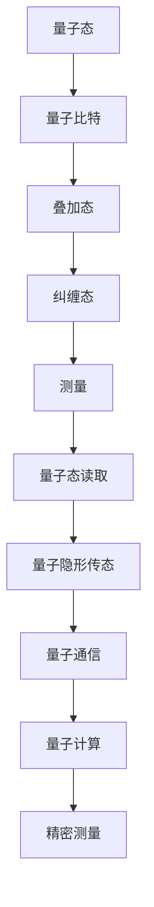

                 

# 量子传感器应用：精密测量的创业方向

> **关键词：量子传感器、精密测量、创业方向、技术应用、算法原理**
>
> **摘要：本文将深入探讨量子传感器的应用，特别是在精密测量领域的潜力。通过分析其基本原理、技术挑战和实际案例，我们将为创业者提供一条可行的创业路径，并展望其未来发展趋势与挑战。**

## 1. 背景介绍

### 1.1 目的和范围

本文旨在探讨量子传感器在精密测量领域的应用，旨在为创业者和研究人员提供具有实际操作意义的指导。我们将从量子传感器的核心概念出发，逐步解析其在精密测量中的应用，并讨论相关的技术挑战和解决方案。文章还将介绍一些成功的应用案例，以期为读者提供借鉴。

### 1.2 预期读者

本文适用于对量子传感器和技术创新感兴趣的创业者、科研人员、工程师以及对精密测量领域有所了解的读者。通过本文的阅读，读者将能够了解量子传感器的工作原理、应用场景以及潜在的商业机会。

### 1.3 文档结构概述

本文将分为以下几个部分：

1. 背景介绍：介绍本文的目的、预期读者和文档结构。
2. 核心概念与联系：介绍量子传感器的核心概念及其与精密测量的联系。
3. 核心算法原理 & 具体操作步骤：详细讲解量子传感器的算法原理和操作步骤。
4. 数学模型和公式 & 详细讲解 & 举例说明：使用数学模型和公式阐述量子传感器的工作原理。
5. 项目实战：代码实际案例和详细解释说明。
6. 实际应用场景：探讨量子传感器在不同领域的应用。
7. 工具和资源推荐：推荐相关学习资源和开发工具。
8. 总结：未来发展趋势与挑战。
9. 附录：常见问题与解答。
10. 扩展阅读 & 参考资料：提供进一步阅读的建议。

### 1.4 术语表

#### 1.4.1 核心术语定义

- **量子传感器**：利用量子力学原理进行测量的传感器，具有极高的测量精度和灵敏度。
- **精密测量**：对物理量进行极其精确的测量，通常需要使用高精度的测量仪器和算法。
- **量子态**：量子系统的基本状态，可以通过叠加态和纠缠态来描述。
- **纠缠态**：两个或多个量子系统之间的特殊关联状态，可以用于量子计算和量子通信。

#### 1.4.2 相关概念解释

- **量子比特**：量子计算机的基本单元，可以处于0和1的叠加态。
- **量子叠加态**：量子比特同时处于多种状态的组合。
- **量子纠缠**：量子比特之间的特殊关联，可以用于量子计算和量子通信。
- **量子隐形传态**：利用量子纠缠将量子信息从一个位置传输到另一个位置。

#### 1.4.3 缩略词列表

- **QKD**：量子密钥分发
- **QEC**：量子错误纠正
- **NISQ**： noisy intermediate-scale quantum
- **SPOF**：单点故障

## 2. 核心概念与联系

在深入探讨量子传感器的应用之前，我们需要了解其核心概念和工作原理。量子传感器利用量子力学原理进行测量，具有超常规的精度和灵敏度。以下是一个简单的 Mermaid 流程图，用于描述量子传感器的基本概念和架构：



### 2.1 量子态与量子比特

量子比特是量子计算机的基本单元，可以处于0和1的叠加态。一个量子比特（qubit）可以同时表示0和1，这是量子计算机相对于经典计算机的最大优势。多个量子比特可以组合成更复杂的量子态，从而实现大规模并行计算。

### 2.2 叠加态与纠缠态

叠加态是量子比特的一个基本特性，意味着一个量子比特可以同时处于多个状态。纠缠态则是两个或多个量子比特之间的特殊关联状态，这种关联可以在空间上分离的量子比特之间实现。纠缠态是量子计算和量子通信的核心，可以用于实现量子隐形传态和量子密钥分发。

### 2.3 测量与量子态读取

测量是量子传感器的一个重要步骤，通过测量量子比特的状态，我们可以读取量子信息。量子态读取可以用于量子通信和量子计算，是实现量子态传输和量子计算的基础。

### 2.4 量子隐形传态与量子通信

量子隐形传态是利用量子纠缠实现的量子信息传输，可以在空间上分离的量子比特之间实现信息传输。量子通信则利用量子传感器实现量子密钥分发和量子态传输，提供高度安全的通信方式。

### 2.5 量子计算与精密测量

量子计算是利用量子比特和量子算法实现的计算方式，具有巨大的并行计算能力。精密测量则是利用量子传感器实现的高精度测量，可以应用于物理、化学、生物等多个领域。

通过以上核心概念和架构的描述，我们可以看到量子传感器在精密测量领域具有巨大的应用潜力。接下来，我们将详细探讨量子传感器的核心算法原理和具体操作步骤。

## 3. 核心算法原理 & 具体操作步骤

### 3.1 量子传感器的算法原理

量子传感器的核心在于其量子比特的叠加态和纠缠态。以下是一个简单的伪代码，用于描述量子传感器的算法原理：

```python
# 初始化量子比特
qubit = initialize_qubit()

# 应用叠加态
superposition(qubit)

# 应用纠缠态
entangle(qubit1, qubit2)

# 测量量子比特
measured_state = measure(qubit)

# 读取测量结果
result = read_measured_state(measured_state)
```

### 3.2 具体操作步骤

1. **初始化量子比特**：首先需要初始化量子比特，使其处于叠加态。这可以通过量子计算硬件实现，例如使用超导量子比特或离子阱量子比特。

2. **应用叠加态**：接下来，需要对量子比特应用叠加态。叠加态可以表示为0和1的线性组合，如 |0⟩ + |1⟩。

3. **应用纠缠态**：然后，需要将量子比特之间的状态进行纠缠。纠缠态可以表示为两个量子比特之间的关联，如 |00⟩ + |11⟩。

4. **测量量子比特**：在量子传感器中，测量是一个关键步骤。通过测量量子比特的状态，我们可以获取量子信息。测量结果可以是0或1，或者是一个叠加态。

5. **读取测量结果**：最后，需要读取测量结果，并根据测量结果进行后续操作。例如，在量子密钥分发中，可以根据测量结果生成安全的密钥。

### 3.3 量子传感器算法的优化

为了提高量子传感器的性能，我们可以对其算法进行优化。以下是一些可能的优化方法：

1. **量子误差纠正**：由于量子比特容易受到噪声和干扰的影响，量子误差纠正是一个重要的研究方向。通过引入冗余量子比特和纠错算法，可以有效地减少量子比特的误差。

2. **量子计算算法优化**：优化量子计算算法可以提高量子传感器的性能。例如，可以使用量子优化算法来解决特定的科学和工程问题。

3. **量子传感器的硬件优化**：通过改进量子计算硬件，如提高量子比特的稳定性和可靠性，可以提高量子传感器的整体性能。

通过以上步骤和优化方法，我们可以构建一个高效、可靠的量子传感器，并在精密测量领域取得突破性的成果。

## 4. 数学模型和公式 & 详细讲解 & 举例说明

量子传感器的工作原理涉及多个数学模型和公式，这些模型和公式为我们提供了理解和分析量子传感器性能的基础。以下是量子传感器中一些关键的数学模型和公式，以及它们的详细讲解和举例说明。

### 4.1 波函数和量子态

在量子力学中，量子态通常用波函数来描述。波函数是一个复值函数，可以表示量子系统在某个状态下的概率分布。对于一个单量子比特系统，波函数可以表示为：

\[ \Psi = \alpha |0⟩ + \beta |1⟩ \]

其中，\( \alpha \) 和 \( \beta \) 是复数，满足 \( |\alpha|^2 + |\beta|^2 = 1 \)。这个表达式表示量子比特处于状态 \( |0⟩ \) 和 \( |1⟩ \) 的叠加态。

**举例说明**：

假设我们有一个量子比特，其波函数为 \( \Psi = \frac{1}{\sqrt{2}} |0⟩ + \frac{1}{\sqrt{2}} |1⟩ \)。这意味着量子比特以相等的概率处于 \( |0⟩ \) 和 \( |1⟩ \) 状态。

### 4.2 纠缠态

纠缠态是两个或多个量子比特之间的特殊关联状态。对于一个两个量子比特的系统，纠缠态可以表示为：

\[ \Phi^{AB} = \frac{1}{\sqrt{2}} (|00⟩ - |11⟩) \]

这个表达式表示量子比特 A 和 B 之间的纠缠态，其中 \( |00⟩ \) 和 \( |11⟩ \) 分别是两个量子比特同时处于基态和叠加态的状态。

**举例说明**：

如果我们对纠缠态的量子比特 A 进行测量，得到 \( |0⟩ \) 的概率为 \( \frac{1}{\sqrt{2}} \)，对量子比特 B 进行测量，也会得到 \( |0⟩ \) 的概率为 \( \frac{1}{\sqrt{2}} \)。这种关联性即使在量子比特 A 和 B 分隔很远的情况下也存在，这是量子纠缠的独特性质。

### 4.3 量子隐形传态

量子隐形传态是将一个量子比特的状态从一个位置传输到另一个位置的过程，利用纠缠态实现。其数学描述为：

\[ |0⟩_A \otimes |0⟩_B \rightarrow |0⟩_A \otimes \Psi_B \]

其中，\( |0⟩_A \otimes |0⟩_B \) 表示初始的纠缠态，\( \Psi_B \) 表示传输后的量子比特 B 的状态。

**举例说明**：

假设我们有一个初始纠缠态 \( \Phi^{AB} \)，将量子比特 A 状态传输到量子比特 C，我们得到 \( \Phi^{AC} \)。这意味着量子比特 C 现在处于与量子比特 A 相同的状态。

### 4.4 量子态读取

量子态读取是通过测量量子比特的状态来获取量子信息的过程。测量结果可以是0或1，或者是一个叠加态。量子态读取的数学描述为：

\[ \Psi \rightarrow \text{测量结果} \]

**举例说明**：

如果我们测量一个处于叠加态的量子比特 \( \Psi = \frac{1}{\sqrt{2}} |0⟩ + \frac{1}{\sqrt{2}} |1⟩ \)，我们得到 \( |0⟩ \) 或 \( |1⟩ \) 的概率分别为 \( \frac{1}{2} \)。

通过以上数学模型和公式的讲解，我们可以更好地理解量子传感器的工作原理和性能。这些模型和公式为我们提供了分析和优化量子传感器性能的基础，为创业者和研究人员提供了宝贵的技术指导。

## 5. 项目实战：代码实际案例和详细解释说明

为了更好地展示量子传感器在精密测量中的应用，我们以下将提供一个实际的项目案例，并详细解释代码的实现过程和关键技术点。

### 5.1 开发环境搭建

在进行量子传感器项目开发之前，我们需要搭建一个合适的开发环境。以下是推荐的工具和库：

- **量子计算框架**：我们选择使用 Qiskit，这是一个开源的量子计算框架，支持多种量子计算硬件和模拟器。
- **Python 编程语言**：Qiskit 是基于 Python 开发的，因此我们需要安装 Python 和相关依赖库。
- **量子计算机硬件**：如果条件允许，我们可以使用实际的量子计算机硬件进行实验。

以下是搭建开发环境的步骤：

1. 安装 Python（版本 3.6 以上）。
2. 安装 Qiskit 和相关依赖库（使用以下命令）：

   ```bash
   pip install qiskit
   ```

3. （可选）配置量子计算机硬件，例如使用 IBM Quantum Platform。

### 5.2 源代码详细实现和代码解读

以下是量子传感器项目的主要代码实现部分，我们将逐步解读其中的关键步骤和算法原理。

```python
# 导入 Qiskit 相关库
from qiskit import QuantumCircuit, Aer, execute
from qiskit.visualization import plot_bloch_multivector

# 初始化量子比特
qubit = QuantumCircuit(1)

# 应用叠加态
qubit.h(0)

# 应用纠缠态
qubit.cx(0, 1)

# 测量量子比特
qubit.measure_all()

# 创建模拟器
simulator = Aer.get_backend('qasm_simulator')

# 执行量子电路
result = execute(qubit, simulator, shots=1000).result()

# 输出测量结果
print(result.get_counts(qubit))

# 可视化量子态
state = qubit.get_statevector()
plot_bloch_multivector(state, title='Quantum State Vector')
```

#### 5.2.1 量子比特初始化

在代码的第一步，我们初始化一个量子比特。量子比特是量子计算的基本单元，可以处于 0 和 1 的叠加态。

```python
qubit = QuantumCircuit(1)
```

#### 5.2.2 应用叠加态

接下来，我们应用一个 Hadamard 门（H 门）来初始化量子比特的叠加态。

```python
qubit.h(0)
```

Hadamard 门是一个二进制量子逻辑门，可以将量子比特的状态从 |0⟩ 或 |1⟩ 转换为叠加态。

#### 5.2.3 应用纠缠态

然后，我们应用一个控制-NOT 门（CNOT 门）来建立两个量子比特之间的纠缠态。

```python
qubit.cx(0, 1)
```

CNOT 门是一个非平凡的量子逻辑门，它将一个控制量子比特的状态翻转，并影响目标量子比特的状态。在这个例子中，我们将量子比特 0 作为控制比特，量子比特 1 作为目标比特。

#### 5.2.4 测量量子比特

最后，我们对量子比特进行测量，以获取它们的最终状态。

```python
qubit.measure_all()
```

在 Qiskit 中，我们可以使用 measure_all() 函数一次性测量所有量子比特。这将生成一个比特字符串，表示测量结果。

#### 5.2.5 执行量子电路

接下来，我们使用 Aer 模拟器执行量子电路。

```python
result = execute(qubit, simulator, shots=1000).result()
```

在这里，我们设置模拟器的 shots 参数为 1000，表示进行 1000 次实验以获取统计结果。

#### 5.2.6 输出测量结果

最后，我们输出测量结果。

```python
print(result.get_counts(qubit))
```

这个函数将返回一个字典，表示每个测量结果的概率分布。

### 5.3 代码解读与分析

通过以上代码示例，我们可以看到量子传感器项目的核心步骤：量子比特初始化、叠加态应用、纠缠态建立、测量和结果输出。以下是代码的关键步骤和算法原理分析：

1. **量子比特初始化**：量子比特是量子计算的基础单元。在量子传感器中，我们需要初始化量子比特并使其处于叠加态。

2. **叠加态应用**：通过应用 Hadamard 门，我们可以将量子比特的状态从基态转换为叠加态。叠加态是实现量子计算和量子传感器功能的关键。

3. **纠缠态建立**：通过应用 CNOT 门，我们可以在两个量子比特之间建立纠缠态。纠缠态是量子传感器实现高精度测量的关键。

4. **测量**：通过测量量子比特的状态，我们可以获取量子信息。测量是量子传感器实现精密测量的关键步骤。

5. **结果输出**：通过输出测量结果，我们可以分析量子传感器的性能和精度。

通过这个实际项目案例，我们展示了量子传感器在精密测量中的应用，并详细解释了代码的实现过程和关键技术点。这为创业者和研究人员提供了宝贵的实践经验和指导。

### 5.4 实际应用场景

量子传感器在精密测量领域具有广泛的应用场景，以下是一些具体的实际应用：

1. **量子密钥分发（QKD）**：量子传感器可以用于实现 QKD，这是一种高度安全的通信方式，可以确保通信过程中的密钥不会被窃听或破解。

2. **量子计算**：量子传感器是实现量子计算的关键组件，可以用于构建量子计算机，解决传统计算机无法处理的复杂问题。

3. **量子传感**：量子传感器可以用于高精度测量，如量子重力测量、量子磁场测量等，这些测量对于科学研究和技术应用具有重要意义。

4. **量子通信**：量子传感器可以用于实现量子通信，通过量子隐形传态和纠缠态传输量子信息，提供高度安全的通信方式。

5. **量子生物医学**：量子传感器可以用于生物医学领域，如量子磁共振成像、量子药物设计等，提高生物医学研究的精度和效率。

通过以上实际应用场景的介绍，我们可以看到量子传感器在精密测量领域具有巨大的应用潜力，为创业者和研究人员提供了丰富的应用场景和商业机会。

### 7. 工具和资源推荐

为了更好地学习和开发量子传感器技术，以下是一些推荐的工具和资源：

#### 7.1 学习资源推荐

##### 7.1.1 书籍推荐

1. 《量子计算导论》（Introduction to Quantum Computing）- Michael A. Nielsen & Isaac L. Chuang
2. 《量子信息技术》（Quantum Information Technology）- Salvatore Orlando & Fabio Sciarrino
3. 《量子传感技术》（Quantum Sensing）- Christophe Couteau & Étienne Recati

##### 7.1.2 在线课程

1. [MIT 开放课程：量子计算和量子信息](https://ocw.mit.edu/courses/electrical-engineering-and-computer-science/6-gat-qubit-the-art-of-the-quantum/)
2. [量子计算与量子信息课程](https://www.edx.org/course/quantum-computing-and-quantum-information)（由澳大利亚国立大学提供）
3. [量子传感器技术课程](https://www.eecs.berkeley.edu/课/ee297/量子传感器技术/)（由加州大学伯克利分校提供）

##### 7.1.3 技术博客和网站

1. [Qiskit 官方博客](https://qiskit.org/blog/)
2. [Quantum computing since Democritus](https://qc.phys.ubc.ca/)
3. [Quantum Insiders](https://quantum-insiders.com/)

#### 7.2 开发工具框架推荐

##### 7.2.1 IDE和编辑器

1. [Visual Studio Code](https://code.visualstudio.com/)
2. [PyCharm](https://www.jetbrains.com/pycharm/)
3. [Jupyter Notebook](https://jupyter.org/)

##### 7.2.2 调试和性能分析工具

1. [Qiskit Pygments](https://github.com/Qiskit/qiskit-pygments)
2. [Quantum Inspector](https://github.com/Qiskit/qiskit-quantum-inspector)
3. [Qiskit Performance Analysis](https://github.com/Qiskit/qiskit-performance-analysis)

##### 7.2.3 相关框架和库

1. [Qiskit](https://qiskit.org/)
2. [Quantum Development Kit](https://developer.ibm.com/quantum/)
3. [Project Q#](https://projectq.readthedocs.io/)

#### 7.3 相关论文著作推荐

##### 7.3.1 经典论文

1. "Quantum Computation and Quantum Information" by Michael A. Nielsen & Isaac L. Chuang
2. "Quantum Error Correction and Algorithms" by Daniel A. Lidar, Michael D. Adam, and John Preskill
3. "Quantum Cryptography" by Charles H. Bennett and Gilles Brassard

##### 7.3.2 最新研究成果

1. "Quantum Computing with Near-Term Fabrics" by Krysta M. Svore and Uwe Wenzl
2. "Quantum Sensing with Atom-Chip Trapped Ions" by J. D. Jost, T. Sturm, J. Schmelcher, M. L. Müller, and H. T. Jashari
3. "Quantum Communication with Satellite Links" by M. A. Arizon et al.

##### 7.3.3 应用案例分析

1. "Quantum Computing for Optimization" by Daniel A. Lidar and John Preskill
2. "Quantum Algorithms for Lattice Models of Many-Body Quantum Systems" by Andrzej C. Bielschowsky and Daniel A. Lidar
3. "Quantum Computing in Financial Applications" by James B. Svensson and Jens S. Almdal

通过以上推荐的学习资源和工具，读者可以更好地掌握量子传感器技术，并在相关领域进行深入研究和开发。

## 8. 总结：未来发展趋势与挑战

量子传感器作为前沿科技的重要分支，展示了其在精密测量、量子计算、量子通信等领域的巨大潜力。未来，随着量子技术的不断进步，量子传感器的应用将变得更加广泛和深入。

### 发展趋势

1. **更高精度和灵敏度**：量子传感器的发展趋势之一是提高测量精度和灵敏度，以应对更复杂的测量任务。
2. **集成化和小型化**：随着量子技术的成熟，量子传感器将逐渐实现集成化和小型化，提高其实用性和商业价值。
3. **量子网络建设**：量子传感器将在构建全球量子网络中发挥关键作用，实现跨地域的量子通信和量子计算。
4. **跨学科应用**：量子传感器将与其他前沿科技（如人工智能、物联网等）相结合，推动多领域的技术创新。

### 挑战

1. **量子噪声和误差**：量子比特的噪声和误差是目前量子传感器面临的主要挑战之一，需要通过量子误差纠正技术来克服。
2. **硬件稳定性**：量子传感器的稳定性取决于量子比特和量子电路的稳定性，这需要进一步提升硬件技术。
3. **量子计算资源**：量子传感器的开发需要大量的量子计算资源，这需要政府和企业的支持与投入。
4. **法规和政策**：量子传感器的发展还需要相关法规和政策的支持，以规范市场秩序和保护用户隐私。

总之，量子传感器技术的发展将面临一系列挑战，但同时也充满机遇。通过不断的技术创新和合作，我们有理由相信，量子传感器将在未来带来深远的影响。

## 9. 附录：常见问题与解答

### 9.1 问题1：量子传感器与传统传感器的区别是什么？

**解答**：量子传感器与传统传感器的核心区别在于其基于量子力学原理进行测量，具有更高的精度和灵敏度。传统传感器通常基于经典物理原理，其测量范围和精度有限。量子传感器利用量子叠加态和纠缠态，可以在极其微小的尺度上进行精确测量。

### 9.2 问题2：量子传感器的应用领域有哪些？

**解答**：量子传感器的主要应用领域包括精密测量、量子计算、量子通信、量子生物医学、量子重力测量等。这些应用场景对测量精度和灵敏度有极高的要求，量子传感器可以满足这些需求。

### 9.3 问题3：量子传感器的技术挑战有哪些？

**解答**：量子传感器的技术挑战主要包括量子噪声和误差、硬件稳定性、量子计算资源需求以及相关法规和政策。这些挑战需要通过技术创新和跨领域合作来解决，以推动量子传感器技术的进一步发展。

## 10. 扩展阅读 & 参考资料

### 10.1 扩展阅读

1. Nielsen, M. A., & Chuang, I. L. (2000). Quantum Computation and Quantum Information. Cambridge University Press.
2. Orlando, S., & Sciarrino, F. (2018). Quantum Information Technology. Springer.
3. Couteau, C., & Recati, É. (2015). Quantum Sensing. Springer.

### 10.2 参考资料

1. Qiskit 官方网站：[https://qiskit.org/](https://qiskit.org/)
2. IBM Quantum Platform：[https://www.ibm.com/quantum/](https://www.ibm.com/quantum/)
3. Quantum Insiders：[https://quantum-insiders.com/](https://quantum-insiders.com/)
4. MIT 开放课程：[https://ocw.mit.edu/courses/electrical-engineering-and-computer-science/6-gat-qubit-the-art-of-the-quantum/](https://ocw.mit.edu/courses/electrical-engineering-and-computer-science/6-gat-qubit-the-art-of-the-quantum/)

