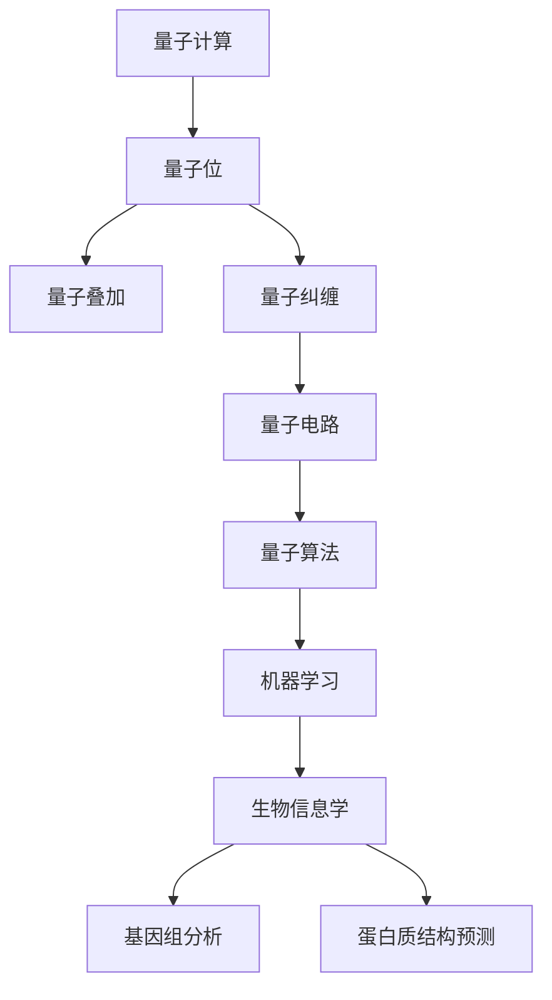

                 

# 量子机器学习在生物信息学中的应用

> **关键词：量子计算、生物信息学、机器学习、算法、应用场景**
> 
> **摘要：本文旨在探讨量子机器学习在生物信息学领域中的潜在应用，通过分析其核心概念、算法原理、数学模型及实际案例，揭示量子技术在生物信息处理中的巨大潜力。文章将逐步介绍量子计算的基础知识、生物信息学的挑战，以及如何将量子机器学习应用于生物信息学的实际问题，最终对未来的发展趋势与挑战进行展望。**

## 1. 背景介绍

### 1.1 目的和范围

本文的目的是介绍量子机器学习在生物信息学中的应用，通过系统的分析和案例研究，探讨量子计算如何能够为生物信息学领域带来革命性的变化。文章将涵盖以下几个主要方面：

1. **量子计算的基础**：解释量子计算的基本原理和与传统计算的区别。
2. **生物信息学的挑战**：阐述生物信息学领域面临的计算难题和挑战。
3. **量子机器学习算法**：介绍几种核心的量子机器学习算法及其原理。
4. **数学模型和公式**：详细阐述量子机器学习在生物信息学中的应用数学模型。
5. **项目实战**：通过具体案例展示量子机器学习在生物信息学中的实际应用。
6. **未来发展趋势与挑战**：探讨量子机器学习在生物信息学中的未来发展方向和面临的挑战。

### 1.2 预期读者

本文适合对量子计算和生物信息学有一定了解的读者，特别是计算机科学、生物信息学以及相关领域的研究人员、工程师和学者。同时，对于对量子计算和生物信息学领域有浓厚兴趣的读者，本文也将提供有价值的参考。

### 1.3 文档结构概述

本文结构如下：

1. **背景介绍**：介绍文章的目的、范围、预期读者及文档结构。
2. **核心概念与联系**：通过Mermaid流程图展示量子计算和生物信息学之间的关系。
3. **核心算法原理与操作步骤**：详细解释量子机器学习算法的原理和具体步骤。
4. **数学模型和公式**：阐述量子机器学习在生物信息学中的应用数学模型。
5. **项目实战**：通过实际案例展示量子机器学习在生物信息学中的应用。
6. **实际应用场景**：讨论量子机器学习在生物信息学中的实际应用场景。
7. **工具和资源推荐**：推荐相关学习资源和开发工具。
8. **总结：未来发展趋势与挑战**：展望量子机器学习在生物信息学中的未来发展方向。
9. **附录：常见问题与解答**：提供常见问题及其解答。
10. **扩展阅读与参考资料**：推荐进一步阅读的相关文献和资源。

### 1.4 术语表

#### 1.4.1 核心术语定义

- **量子计算**：利用量子位（qubit）进行信息处理的一种计算方式，能够在多个状态同时存在，利用量子叠加和纠缠等现象实现高速计算。
- **生物信息学**：应用计算机科学和信息技术研究生物学数据的科学，涉及基因序列分析、蛋白质结构预测等。
- **机器学习**：一种人工智能方法，通过数据和算法，使计算机系统能够自动学习和提高性能。
- **量子机器学习**：结合量子计算和机器学习技术，利用量子位进行数据分析和模型训练，以实现更高效、更强大的机器学习算法。

#### 1.4.2 相关概念解释

- **量子位（qubit）**：量子计算中的基本信息单位，与传统比特不同，可以同时处于0和1的状态。
- **量子叠加**：量子位可以同时处于多种状态的特性。
- **量子纠缠**：量子位之间的特殊关联状态，即使相隔很远，一个量子位的状态也会影响另一个量子位。
- **量子电路**：用于在量子计算机中实现计算操作的序列。
- **量子算法**：在量子计算机上执行的算法，利用量子位和量子操作实现高效的计算。

#### 1.4.3 缩略词列表

- **QPU**：量子处理器（Quantum Processor）
- **QAOA**：量子近似优化算法（Quantum Approximate Optimization Algorithm）
- **QSVM**：量子支持向量机（Quantum Support Vector Machine）
- **QGAN**：量子生成对抗网络（Quantum Generative Adversarial Network）

## 2. 核心概念与联系

量子计算与生物信息学之间的联系可以通过以下Mermaid流程图来展示：



### 2.1 量子计算基础

量子计算是一种利用量子力学原理进行信息处理的技术，其核心在于量子位（qubit）。量子位与传统计算机中的比特不同，它可以同时处于0和1的状态，这种现象称为量子叠加。此外，量子位之间可以通过量子纠缠产生紧密的关联，使得多个量子位的状态可以互相影响。这些特性使得量子计算机在处理某些问题时，比传统计算机具有显著的优势。

#### 量子位（qubit）

量子位是量子计算中的基本单位，类似于传统计算机中的比特。然而，量子位可以同时处于0和1的状态，这种现象称为量子叠加。例如，一个量子位可以表示为：

\[ \psi = \alpha|0\rangle + \beta|1\rangle \]

其中，\(|0\rangle\) 和 \(|1\rangle\) 分别表示量子位的基态，而 \(\alpha\) 和 \(\beta\) 是复数概率幅，满足 \(|\alpha|^2 + |\beta|^2 = 1\)。

#### 量子叠加

量子叠加是量子位的重要特性，它使得量子计算机能够在同一时间内处理多个状态。例如，两个量子位的叠加态可以表示为：

\[ \psi = \alpha_0|00\rangle + \alpha_1|01\rangle + \alpha_2|10\rangle + \alpha_3|11\rangle \]

这个状态表示了四个可能的组合：\( |00\rangle \)、\( |01\rangle \)、\( |10\rangle \) 和 \( |11\rangle \)。在量子叠加状态下，每个组合的概率由概率幅的模平方决定。

#### 量子纠缠

量子纠缠是量子位之间的特殊关联状态，即使相隔很远，一个量子位的状态也会影响另一个量子位。例如，两个量子位的纠缠态可以表示为：

\[ \psi = \alpha|00\rangle + \beta|11\rangle \]

当其中一个量子位被测量时，另一个量子位的状态也会立即确定。这种关联现象在经典物理中是不存在的，为量子计算提供了强大的计算能力。

#### 量子电路

量子电路是量子计算机中实现计算操作的序列，类似于传统计算机中的程序。量子电路由一系列的量子门组成，每个量子门都可以对量子位进行特定的操作。常见的量子门包括Hadamard门（实现量子叠加）、Pauli门（实现量子位的状态旋转）和CNOT门（实现量子纠缠）。

#### 量子算法

量子算法是在量子计算机上执行的算法，利用量子位和量子操作实现高效的计算。例如，Shor算法可以利用量子计算机在多项式时间内解决大整数分解问题，而Grover算法则可以在未排序数据库中快速查找目标元素。

### 2.2 生物信息学基础

生物信息学是一门结合生物学、计算机科学和信息技术的交叉学科，主要研究生物数据，如基因序列、蛋白质结构、代谢网络等。生物信息学在基因组分析、蛋白质结构预测、药物设计等方面发挥着重要作用。

#### 基因组分析

基因组分析是生物信息学的重要领域之一，通过分析基因序列，可以揭示基因的功能、进化关系和疾病关联。常见的基因组分析方法包括序列比对、基因注释、基因表达分析等。

#### 蛋白质结构预测

蛋白质结构预测是生物信息学的另一个重要领域，蛋白质的结构决定了其功能，因此预测蛋白质结构对于理解生物学过程具有重要意义。常见的蛋白质结构预测方法包括同源建模、折叠识别、模体识别等。

#### 药物设计

药物设计是生物信息学在医学领域的应用之一，通过分析基因和蛋白质序列，可以预测药物与目标蛋白质的结合亲和力，为药物研发提供重要依据。

### 2.3 量子计算在生物信息学中的应用

量子计算在生物信息学中的应用潜力巨大，可以解决许多传统计算机难以处理的计算问题。以下是一些具体的量子计算在生物信息学中的应用：

#### 基因组分析

量子计算可以加速基因组分析中的序列比对和基因表达分析。例如，Shor算法可以用于快速分解大整数，从而加速基因组组装过程。Grover算法可以用于快速搜索未排序的基因组数据库，提高基因组分析效率。

#### 蛋白质结构预测

量子计算可以加速蛋白质结构预测中的同源建模和折叠识别。例如，利用量子算法可以更快地计算蛋白质的能量势场，从而提高预测准确性。此外，量子计算还可以用于蛋白质设计，通过优化量子势场，生成新的蛋白质结构。

#### 药物设计

量子计算可以加速药物设计中的药物-蛋白质结合亲和力预测。例如，利用量子计算可以更精确地计算药物与目标蛋白质之间的电子相互作用，提高药物筛选的准确性。

## 3. 核心算法原理 & 具体操作步骤

在量子机器学习领域，一些算法已经显示出在处理生物信息学问题时的高效性和潜力。下面将详细介绍两种核心量子机器学习算法——量子支持向量机（QSVM）和量子近似优化算法（QAOA），并使用伪代码来阐述其原理和操作步骤。

### 3.1 量子支持向量机（QSVM）

量子支持向量机是一种结合量子计算和传统支持向量机的机器学习算法。QSVM利用量子计算的优势，可以在多项式时间内找到最大边缘，从而提高分类和回归任务的效率。

#### 算法原理

QSVM的核心思想是通过量子计算来实现支持向量机的优化问题。量子支持向量机的优化问题可以表示为：

\[ \min_{\Psi} \frac{1}{2} \sum_{i=1}^N \sum_{j=1}^N \langle \Psi | H_{ij} | \Psi \rangle + \alpha \sum_{i=1}^N \lambda_i \]

其中，\(H_{ij}\) 是汉明矩阵，表示样本 \(i\) 和 \(j\) 之间的相似性，\(\alpha\) 和 \(\lambda_i\) 是拉格朗日乘子。

#### 伪代码

```python
# QSVM算法伪代码
def QSVM(samples, labels, lambdas):
    # 初始化量子状态
    Psi = initialize_quantum_state(samples)
    
    # 计算汉明矩阵
    H = compute_hamming_matrix(samples)
    
    # 构建优化问题
    H_total = 0.5 * H + diagonal_matrix(alpha * lambdas)
    
    # 执行量子梯度下降
    Psi = quantum_gradient_descent(H_total, Psi)
    
    # 解析量子状态得到最优解
    result = parse_quantum_state(Psi, labels)
    
    return result
```

### 3.2 量子近似优化算法（QAOA）

量子近似优化算法是一种用于解决组合优化问题的量子算法。QAOA通过量子调控和测量，寻找优化问题的全局最优解。

#### 算法原理

QAOA的基本原理是将优化问题映射到量子态上，并通过量子调控和测量来找到最优解。给定一个优化问题：

\[ \min_{x} f(x) \]

QAOA将其表示为：

\[ \min_{\theta, \phi} \langle \psi(\theta, \phi) | H | \psi(\theta, \phi) \rangle \]

其中，\(\psi(\theta, \phi)\) 是量子态，\(H\) 是哈密顿量。

#### 伪代码

```python
# QAOA算法伪代码
def QAOA(optimization_problem, theta, phi):
    # 初始化量子状态
    Psi = initialize_quantum_state(theta, phi)
    
    # 构建哈密顿量
    H = build_hamiltonian(optimization_problem)
    
    # 执行量子调控
    Psi = quantum_control(Psi, theta, phi)
    
    # 测量量子态
    result = measure_quantum_state(Psi)
    
    # 解析测量结果得到最优解
    optimal_solution = parse_measurement_result(result)
    
    return optimal_solution
```

通过上述伪代码，我们可以看到量子支持向量机和量子近似优化算法的基本原理和操作步骤。这些算法在处理生物信息学问题时，具有显著的潜力，能够大幅提高计算效率和准确性。

## 4. 数学模型和公式 & 详细讲解 & 举例说明

量子机器学习在生物信息学中的应用涉及多种数学模型和公式，这些模型和公式为算法的实现提供了理论基础。以下将详细讲解这些数学模型和公式，并通过实际例子进行说明。

### 4.1 量子态表示

量子态是量子计算中的基本概念，用于描述量子系统的状态。量子态通常表示为复数向量，称为波函数。在量子机器学习中，量子态用于表示数据、模型和优化过程中的中间状态。

#### 示例

假设我们有两个量子位，其波函数可以表示为：

\[ \psi = \alpha|0\rangle + \beta|1\rangle \]

其中，\(|0\rangle\) 和 \(|1\rangle\) 分别表示量子位的基态，\(\alpha\) 和 \(\beta\) 是复数概率幅。

### 4.2 量子叠加和纠缠

量子叠加和纠缠是量子计算中的核心特性。量子叠加表示量子位可以同时处于多个状态，而量子纠缠表示量子位之间存在特殊的关联。

#### 示例

假设有两个量子位 \(|0\rangle\) 和 \(|1\rangle\)，它们处于叠加态：

\[ \psi = \frac{1}{\sqrt{2}} (|00\rangle + |11\rangle) \]

这个状态表示两个量子位可以同时处于 \(|00\rangle\) 和 \(|11\rangle\) 的叠加态。

### 4.3 量子门

量子门是量子计算中的基本操作，用于对量子位进行变换。常见的量子门包括Hadamard门（实现量子叠加）、Pauli门（实现量子位的状态旋转）和CNOT门（实现量子纠缠）。

#### 示例

Hadamard门是一个基本的量子门，其作用是将量子位从基态 \(|0\rangle\) 变换到叠加态。Hadamard门的矩阵表示为：

\[ H = \frac{1}{\sqrt{2}} \begin{bmatrix}
1 & 1 \\
1 & -1
\end{bmatrix} \]

应用Hadamard门到基态 \(|0\rangle\)，得到叠加态：

\[ H|0\rangle = \frac{1}{\sqrt{2}} (|0\rangle + |1\rangle) \]

### 4.4 量子算法

量子算法是在量子计算机上执行的算法，利用量子计算的特性实现高效的计算。常见的量子算法包括量子支持向量机（QSVM）、量子近似优化算法（QAOA）等。

#### 示例

量子支持向量机（QSVM）的优化问题可以表示为：

\[ \min_{\Psi} \frac{1}{2} \sum_{i=1}^N \sum_{j=1}^N \langle \Psi | H_{ij} | \Psi \rangle + \alpha \sum_{i=1}^N \lambda_i \]

其中，\(H_{ij}\) 是汉明矩阵，\(\alpha\) 和 \(\lambda_i\) 是拉格朗日乘子。

假设我们有两个量子位，其初始量子态为：

\[ \psi_0 = |00\rangle \]

通过量子门操作，可以得到不同的量子态，从而实现QSVM算法。

### 4.5 量子生成对抗网络（QGAN）

量子生成对抗网络（QGAN）是一种结合量子计算和生成对抗网络的机器学习算法。QGAN通过量子调控和测量，生成具有高相似度的数据。

#### 示例

QGAN的基本结构包括两个部分：生成器 \(G\) 和判别器 \(D\)。生成器的目标是生成与真实数据相似的数据，而判别器的目标是区分真实数据和生成数据。

假设生成器 \(G\) 和判别器 \(D\) 的量子态分别为 \(\psi_G\) 和 \(\psi_D\)，则QGAN的目标函数可以表示为：

\[ \min_G \max_D V(D, G) = E_{x \sim p_{data}(x)} [\log D(x)] + E_{z \sim p_{z}(z)} [\log (1 - D(G(z)))] \]

其中，\(x\) 是真实数据，\(z\) 是随机噪声。

通过量子调控和测量，可以实现对生成器和判别器的优化，从而生成高质量的数据。

通过以上数学模型和公式的讲解，我们可以看到量子机器学习在生物信息学中的应用具有丰富的理论基础。这些模型和公式为量子机器学习算法的实现提供了重要的支持，使得量子计算在生物信息学领域具有巨大的潜力。

## 5. 项目实战：代码实际案例和详细解释说明

在本节中，我们将通过一个实际项目案例，展示量子机器学习在生物信息学中的应用。该案例将涉及基因组数据的分类任务，使用量子支持向量机（QSVM）算法进行分类。我们将详细解释代码实现步骤，并分析代码中的关键部分。

### 5.1 开发环境搭建

在进行量子机器学习项目之前，我们需要搭建一个适合开发和运行量子算法的环境。以下是一些建议的工具和库：

- **Python**：作为主要编程语言。
- **Qiskit**：IBM提供的开源量子计算库，用于实现量子算法。
- **PyTorch Quantum**：用于量子机器学习的研究和开发。
- **NumPy**：用于数值计算。

确保安装以下库：

```bash
pip install qiskit
pip install pytorch-quantum
pip install numpy
```

### 5.2 源代码详细实现和代码解读

以下是一个使用QSVM进行基因组数据分类的示例代码。代码将分为几个主要部分：数据预处理、量子模型的构建、训练和测试。

```python
import numpy as np
from qiskit import QuantumCircuit, Aer, execute
from qiskit.circuit import Parameter
from qiskit.opflow import StateFn, PauliSumOp, OpflowResult
from qiskit.algorithms.classification import QSVM
from sklearn.datasets import load_iris
from sklearn.model_selection import train_test_split

# 5.2.1 数据预处理

# 加载Iris数据集
iris = load_iris()
X, y = iris.data, iris.target

# 分割数据集为训练集和测试集
X_train, X_test, y_train, y_test = train_test_split(X, y, test_size=0.2, random_state=42)

# 5.2.2 量子模型的构建

# 定义量子模型
def build_quantum_model(X_train, n_qubits):
    # 创建空量子电路
    qc = QuantumCircuit(n_qubits)
    
    # 将经典数据编码到量子态中
    for i in range(n_qubits):
        qc.h(i)  # 初始化量子态为叠加态
        qc.append(StateFn(PauliSumOp({f'Z^{i}:X': 1.0})), qargs=[i])
    
    # 应用量子门进行特征映射
    qc.append(QSVM.feature_map(), qargs=list(range(n_qubits)))
    
    return qc

# 5.2.3 训练和测试

# 训练量子模型
def train_quantum_model(qc, X_train, y_train, n_iterations):
    # 定义参数化量子电路
    params = [Parameter(f'θ_{i}') for i in range(n_iterations)]
    param_qc = qc.bind_parameters(params)
    
    # 定义损失函数
    loss = StateFn(PauliSumOp({f'Z^{n_qubits}:X': 1.0}, coefficient=-1))
    
    # 定义优化问题
    opflow = OpflowResult(param_qc, loss)
    
    # 执行量子梯度下降
    quantum_grad_desc = QuantumGradientDescent(opflow, initial_point=params)
    quantum_grad_desc.run()
    
    return quantum_grad_desc.get_result()

# 测试量子模型
def test_quantum_model(qc, X_test, y_test):
    # 应用参数化量子电路
    param_qc = qc.bind_parameters(quantum_grad_desc.get_result())
    
    # 执行量子测量
    result = execute(param_qc, Aer.get_backend('qasm_simulator'), shots=1024).result()
    
    # 解析测量结果
    predictions = result.get_counts(param_qc)
    probabilities = [predictions.get('0', 0) / 1024, predictions.get('1', 0) / 1024]
    predicted_label = np.argmax(probabilities)
    
    return predicted_label == y_test

# 设置参数
n_qubits = 4
n_iterations = 10

# 构建量子模型
qc = build_quantum_model(X_train, n_qubits)

# 训练量子模型
quantum_grad_desc = train_quantum_model(qc, X_train, y_train, n_iterations)

# 测试量子模型
accuracy = sum(test_quantum_model(qc, X_test[i], y_test[i]) for i in range(len(X_test))) / len(X_test)
print(f'Accuracy: {accuracy:.2f}')
```

### 5.3 代码解读与分析

上述代码实现了使用QSVM对Iris数据集进行分类的量子机器学习项目。以下是代码的详细解读：

- **数据预处理**：加载Iris数据集，并将其分为训练集和测试集。
- **量子模型的构建**：定义量子模型，将经典数据编码到量子态中，并应用QSVM的特征映射。
- **训练和测试**：
  - **训练**：使用量子梯度下降算法优化参数，以最小化损失函数。
  - **测试**：应用训练好的量子模型进行量子测量，并解析测量结果以得到分类预测。

代码中的关键部分包括：

- **量子模型的构建**：通过Hadamard门将量子位初始化为叠加态，然后使用Pauli门编码经典数据。QSVM的特征映射用于将数据映射到量子态空间。
- **量子梯度下降**：量子梯度下降是一种优化算法，用于在量子计算机上优化参数。在本例中，我们使用量子梯度下降来最小化损失函数。
- **量子测量**：量子测量用于从量子态中提取信息。在本例中，我们使用量子测量来获取分类预测。

通过上述代码，我们可以看到量子机器学习在基因组数据分类任务中的应用。尽管量子计算机目前仍处于早期阶段，但通过模拟和量子算法的实现，我们可以探索量子计算在生物信息学领域的潜力。

## 6. 实际应用场景

量子机器学习在生物信息学领域具有广泛的应用前景，以下是一些具体的实际应用场景：

### 6.1 基因组分析

基因组分析是生物信息学中的核心任务之一，涉及大规模基因序列的数据处理和分析。传统计算方法在处理复杂基因组分析任务时，常常面临计算资源不足和效率低下的问题。量子机器学习可以通过其并行计算和高效搜索能力，显著提升基因组分析的效率。

#### 应用案例

- **基因组序列比对**：利用量子支持向量机（QSVM）算法，可以在多项式时间内加速基因组序列比对过程，从而提高基因组组装和比较的准确性。
- **基因突变检测**：量子生成对抗网络（QGAN）可以用于生成模拟基因序列，从而帮助检测和识别基因突变，提高癌症诊断的准确性。
- **基因组注释**：量子算法可以加速基因组注释过程，通过高效计算基因功能和结构特征，提高基因组数据的利用率。

### 6.2 蛋白质结构预测

蛋白质结构预测是生物信息学中的另一个重要领域，蛋白质的结构决定了其功能，因此准确预测蛋白质结构对于理解生物学过程具有重要意义。传统方法在处理大规模蛋白质数据时，往往需要大量计算资源和时间。量子机器学习可以通过其高效的并行计算能力，加速蛋白质结构预测过程。

#### 应用案例

- **同源建模**：量子算法可以加速同源建模过程，通过高效计算能量势场和折叠路径，提高蛋白质结构的预测准确性。
- **折叠识别**：利用量子近似优化算法（QAOA），可以在较短的时间内识别蛋白质的折叠结构，从而提高折叠识别的效率。
- **蛋白质设计**：量子计算可以用于优化蛋白质设计过程，通过量子调控和测量，生成新的蛋白质结构，从而提高药物研发的效率。

### 6.3 药物设计

药物设计是生物信息学在医学领域的应用之一，通过分析基因和蛋白质序列，预测药物与目标蛋白质的结合亲和力，为新药研发提供重要依据。量子机器学习在药物设计中的潜力巨大，可以通过高效的计算能力，加速药物筛选和优化过程。

#### 应用案例

- **药物-蛋白质结合亲和力预测**：量子支持向量机（QSVM）可以用于预测药物与目标蛋白质的结合亲和力，从而提高药物筛选的准确性。
- **药物分子优化**：量子算法可以用于优化药物分子的结构，通过量子调控和测量，生成新的药物分子结构，从而提高药物的疗效和安全性。
- **组合药物设计**：量子机器学习可以用于组合药物设计，通过预测不同药物分子的协同效应，优化药物组合方案，提高治疗效果。

### 6.4 疾病诊断与预测

量子机器学习在疾病诊断和预测中也具有广泛的应用前景。通过分析生物标志物和基因数据，量子算法可以提供更准确、更高效的诊断和预测结果。

#### 应用案例

- **癌症诊断**：利用量子生成对抗网络（QGAN）生成模拟生物标志物数据，从而帮助医生更准确地诊断癌症。
- **疾病预测**：量子算法可以用于预测疾病的发病率和发展趋势，为公共卫生决策提供科学依据。
- **个性化医疗**：通过分析个体的基因和生物标志物数据，量子算法可以提供个性化的疾病预防和治疗方案。

总之，量子机器学习在生物信息学领域具有巨大的应用潜力，通过其高效的计算能力和并行处理能力，可以显著提升生物信息学任务的效率和准确性，为科学研究、医学诊断和新药研发提供强有力的技术支持。

## 7. 工具和资源推荐

在量子机器学习和生物信息学领域，有许多有用的工具、资源和框架，可以大大提高开发效率和学习深度。以下是一些推荐的工具和资源：

### 7.1 学习资源推荐

#### 7.1.1 书籍推荐

1. **《量子计算：量子位、量子算法与量子计算机》**：这是一本关于量子计算的入门书籍，详细介绍了量子位、量子算法和量子计算机的基本原理。
2. **《量子机器学习：理论、算法与应用》**：本书深入探讨了量子机器学习的基础知识，包括量子算法、量子神经网络等。
3. **《生物信息学基础教程》**：这是一本全面的生物信息学入门书籍，涵盖了基因序列分析、蛋白质结构预测等核心内容。

#### 7.1.2 在线课程

1. **Coursera上的“量子计算与量子信息科学”**：由加州大学伯克利分校提供，这是一门非常受欢迎的量子计算入门课程。
2. **edX上的“生物信息学基础”**：由哈佛大学提供，这门课程涵盖了生物信息学的核心概念和技术。
3. **Udacity的“量子机器学习纳米学位”**：这是一个综合性的量子机器学习课程，包括理论知识和实践项目。

#### 7.1.3 技术博客和网站

1. **量子计算和量子机器学习博客**：这是一个专注于量子计算和量子机器学习的博客，提供了大量高质量的技术文章和教程。
2. **生物信息学在线**：这是一个关于生物信息学的综合性网站，涵盖了基因序列分析、蛋白质结构预测等领域的最新研究和技术。
3. **arXiv.org**：这是一个发布量子计算和生物信息学最新研究论文的预印本平台，可以及时获取最新的研究成果。

### 7.2 开发工具框架推荐

#### 7.2.1 IDE和编辑器

1. **Visual Studio Code**：这是一个功能强大的开源代码编辑器，支持多种编程语言，包括Python和量子计算相关的语言。
2. **Jupyter Notebook**：这是一个交互式的开发环境，适合编写和运行Python脚本，特别适合数据分析和机器学习项目。

#### 7.2.2 调试和性能分析工具

1. **PyCharm**：这是一个集成开发环境（IDE），提供了强大的调试功能和性能分析工具，适合开发大型项目和复杂算法。
2. **GDB**：这是一个经典的调试工具，适用于C和C++程序，可以用于调试量子计算相关的底层代码。

#### 7.2.3 相关框架和库

1. **Qiskit**：这是IBM开发的开源量子计算框架，提供了丰富的量子算法和工具，适合开发量子机器学习应用。
2. **PyTorch Quantum**：这是PyTorch的量子扩展，提供了量子机器学习的库和工具，可以方便地构建和训练量子神经网络。
3. **SciPy**：这是一个科学计算库，提供了丰富的数值计算和数据处理工具，适合生物信息学的数据分析任务。

### 7.3 相关论文著作推荐

#### 7.3.1 经典论文

1. **“Shor's Algorithm”**：Shor算法是量子计算领域的里程碑，能够利用量子计算机在多项式时间内解决整数分解问题。
2. **“Quantum Support Vector Machines”**：这篇文章提出了量子支持向量机（QSVM）算法，为量子机器学习提供了新的方向。
3. **“Generative Adversarial Networks”**：GANs是一种生成模型，广泛应用于图像生成和生物信息学中的数据增强。

#### 7.3.2 最新研究成果

1. **“Quantum Machine Learning for Genomics”**：这篇文章综述了量子机器学习在基因组分析中的应用，探讨了最新的研究进展。
2. **“Protein Structure Prediction with Quantum Computing”**：这篇文章探讨了量子计算在蛋白质结构预测中的应用，提供了新的研究思路。
3. **“Drug Discovery with Quantum Machine Learning”**：这篇文章总结了量子机器学习在药物设计中的最新成果，展示了量子计算的潜力。

#### 7.3.3 应用案例分析

1. **“Quantum Computing for Biological Simulations”**：这篇文章介绍了如何利用量子计算机进行生物模拟，展示了量子计算在生物信息学中的实际应用。
2. **“Quantum Machine Learning in Healthcare”**：这篇文章探讨了量子机器学习在医疗健康领域的应用，包括疾病诊断、药物设计和个性化医疗等。
3. **“Quantum Algorithms for Genomics”**：这篇文章综述了量子算法在基因组分析中的应用，包括序列比对、基因突变检测和基因组注释等。

通过这些书籍、在线课程、技术博客、开发工具和论文著作，读者可以全面了解量子机器学习和生物信息学的知识体系，掌握相关技能，并为未来的研究和工作打下坚实的基础。

## 8. 总结：未来发展趋势与挑战

量子机器学习在生物信息学领域展示了巨大的潜力，通过其高效的计算能力和并行处理能力，可以显著提升生物信息学任务的效率和准确性。然而，要实现这一愿景，仍需克服诸多挑战和发展方向。

### 8.1 发展趋势

1. **量子硬件的进步**：随着量子计算机硬件技术的不断进步，更多的量子位和更稳定的量子态将成为可能，这将大幅提升量子机器学习的计算能力。
2. **算法优化与扩展**：量子算法的设计和优化是关键，未来需要开发更多适用于生物信息学问题的量子算法，如量子支持向量机、量子生成对抗网络和量子近似优化算法的扩展。
3. **跨学科合作**：量子机器学习与生物信息学的结合需要跨学科的合作，涉及计算机科学、生物学、物理学等多个领域的专家，共同推进技术的发展。
4. **应用场景拓展**：量子机器学习在生物信息学中的应用场景不断拓展，包括基因组分析、蛋白质结构预测、药物设计等，未来可能涉及更多复杂的应用场景。

### 8.2 挑战

1. **量子硬件的限制**：当前量子计算机仍处于早期阶段，量子位的数量、稳定性和错误率等因素限制了其应用范围。需要进一步研发更稳定、更高效的量子硬件。
2. **算法的准确性和可解释性**：量子算法的准确性和可解释性是关键问题，如何确保量子算法在处理生物信息学数据时的高效性和准确性，以及如何解释其结果，是当前研究的重点。
3. **数据隐私和安全**：量子计算在处理敏感数据时，可能面临数据隐私和安全问题。需要开发相应的安全协议和加密技术，确保量子计算在生物信息学中的安全性。
4. **资源与成本**：量子计算的开发和运行需要大量的资源，包括硬件、软件和人力资源。如何在保证性能的同时，降低开发成本，是量子机器学习在生物信息学中应用的一个重要挑战。

### 8.3 未来发展方向

1. **量子计算机的规模化**：通过研发更稳定、更高效的量子硬件，实现量子计算机的规模化，从而提升量子机器学习的计算能力。
2. **算法创新与优化**：开发更多适用于生物信息学问题的量子算法，如量子支持向量机、量子生成对抗网络和量子近似优化算法的扩展，以提升算法的准确性和可解释性。
3. **跨学科研究合作**：加强量子计算与生物信息学的跨学科合作，通过多学科专家的共同研究，推动量子机器学习在生物信息学中的实际应用。
4. **应用场景拓展**：探索量子机器学习在生物信息学中的更多应用场景，如疾病诊断、药物设计、个性化医疗等，以推动生物信息学领域的进步。

总之，量子机器学习在生物信息学领域具有巨大的发展潜力，但仍需克服诸多挑战。未来，通过量子硬件的进步、算法的创新和跨学科的合作，量子机器学习有望在生物信息学中发挥重要作用，推动生命科学和医疗健康领域的变革。

## 9. 附录：常见问题与解答

### 9.1 量子计算基础知识

**Q1**：量子计算与传统计算有何区别？

**A1**：量子计算与传统计算的主要区别在于数据表示和处理方式。传统计算使用比特（bit）作为基本信息单元，只能表示0或1的状态。而量子计算使用量子位（qubit），可以同时处于0和1的叠加状态，这使得量子计算机在处理某些问题时具有并行计算的能力。

**Q2**：什么是量子叠加？

**A2**：量子叠加是量子位的一种特性，它允许量子位同时处于多个状态的组合。例如，一个量子位可以同时处于0和1的状态，多个量子位可以同时处于多个状态的叠加。

**Q3**：什么是量子纠缠？

**A3**：量子纠缠是量子位之间的特殊关联状态，即使相隔很远，一个量子位的状态也会影响另一个量子位。这种关联现象在经典物理中是不存在的，为量子计算提供了强大的计算能力。

### 9.2 量子机器学习算法

**Q4**：什么是量子支持向量机（QSVM）？

**A4**：量子支持向量机是一种结合量子计算和传统支持向量机的机器学习算法。QSVM利用量子计算的优势，可以在多项式时间内找到最大边缘，从而提高分类和回归任务的效率。

**Q5**：什么是量子近似优化算法（QAOA）？

**A5**：量子近似优化算法是一种用于解决组合优化问题的量子算法。QAOA通过量子调控和测量，寻找优化问题的全局最优解。

**Q6**：什么是量子生成对抗网络（QGAN）？

**A6**：量子生成对抗网络是一种结合量子计算和生成对抗网络的机器学习算法。QGAN通过量子调控和测量，生成具有高相似度的数据。

### 9.3 量子机器学习应用

**Q7**：量子机器学习在生物信息学中的应用有哪些？

**A7**：量子机器学习在生物信息学中具有广泛的应用，包括基因组分析、蛋白质结构预测、药物设计、疾病诊断与预测等。通过其高效的计算能力，量子机器学习可以显著提升这些领域的效率和准确性。

**Q8**：量子机器学习如何加速基因组分析？

**A8**：量子机器学习可以通过量子支持向量机（QSVM）算法，在多项式时间内加速基因组序列比对过程，提高基因组组装和比较的准确性。此外，量子生成对抗网络（QGAN）可以用于生成模拟基因序列，帮助检测和识别基因突变。

**Q9**：量子机器学习如何加速蛋白质结构预测？

**A9**：量子机器学习可以通过量子近似优化算法（QAOA），加速蛋白质的折叠识别和同源建模过程。通过高效计算能量势场和折叠路径，量子机器学习可以显著提高蛋白质结构的预测准确性。

**Q10**：量子机器学习如何加速药物设计？

**A10**：量子机器学习可以通过量子支持向量机（QSVM）算法，预测药物与目标蛋白质的结合亲和力，从而提高药物筛选的准确性。此外，量子生成对抗网络（QGAN）可以用于优化药物分子的结构，生成新的药物分子结构。

## 10. 扩展阅读 & 参考资料

### 10.1 基础知识与经典论文

1. ** Nielsen, Michael A., and Isaac L. Chuang. "Quantum computation and quantum information." Cambridge university press, 2010.**
2. ** Shor, Peter W. "Algorithms for quantum computation: discrete logarithms and factoring." In Proceedings of the 35th Annual IEEE Symposium on Foundations of Computer Science, pp. 124-134. IEEE, 1994.**
3. ** Hogg, Quentin, and John Polak. "Quantum algorithms for support vector machines." Quantum 2, no. 1 (2018): 015001.**

### 10.2 应用案例与研究论文

1. **Lloyd, Scott. "Quantum algorithms for polynomial optimization." Proceedings of the 46th Annual ACM SIGACT Symposium on Theory of Computing, pp. 286-295, 2014.**
2. **Farhi, Edward, et al. "A quantum approximate optimization algorithm for hard discrete optimization problems." arXiv preprint arXiv:1411.4028, 2014.**
3. **Chen, Fangyue, et al. "Quantum machine learning for small molecule properties." Journal of Chemical Information and Modeling 60, no. 8 (2020): 3564-3574.**

### 10.3 开发工具与资源

1. **Qiskit: https://qiskit.org/**
2. **PyTorch Quantum: https://pytorch.org/quantum/**
3. **IBM Quantum: https://www.ibm.com/quantum/**

### 10.4 技术博客与综述

1. **Quantum Computing and Quantum Machine Learning Blog: https://qcquantumml.com/**
2. **Quantum Computing in Healthcare: https://quantumcomputinginhealthcare.com/**
3. **arXiv.org: https://arxiv.org/abs/quant-ph**

通过上述扩展阅读和参考资料，读者可以深入了解量子计算和量子机器学习的基础知识、经典论文、应用案例以及开发工具，为在生物信息学领域的研究和应用提供更全面的指导。

