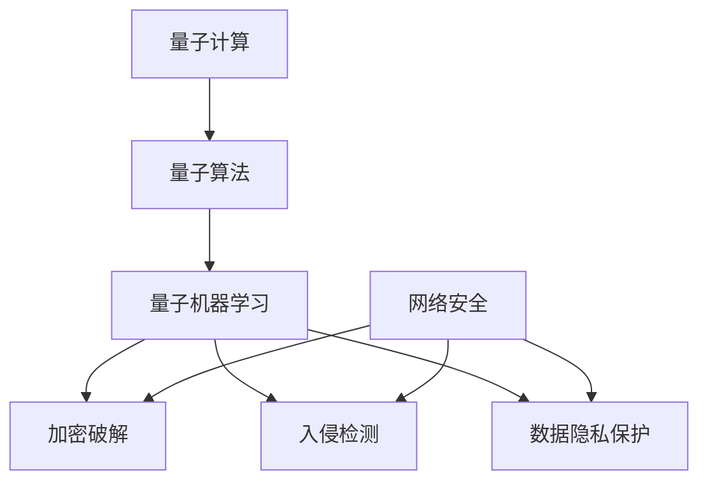

                 

# 量子机器学习在网络安全中的应用前景

## 关键词
量子计算、机器学习、网络安全、加密技术、攻击防御、隐私保护。

## 摘要
本文将探讨量子机器学习在网络安全领域的应用前景。首先，我们将介绍量子计算和机器学习的基本概念及其在网络安全中的应用潜力。接着，本文将详细分析量子机器学习在加密破解、入侵检测、数据隐私保护等方面的具体应用，并通过实例展示其优势。此外，我们将探讨量子机器学习在网络安全中面临的挑战和未来发展，为相关研究者和从业者提供有益的参考。

## 1. 背景介绍

### 1.1 目的和范围

本文旨在探讨量子机器学习在网络安全领域的应用，分析其在加密破解、入侵检测、数据隐私保护等方面的潜力与挑战。随着量子计算的迅速发展，量子机器学习成为了一个备受关注的研究方向。将其应用于网络安全，有望提高现有安全技术的效能，为应对未来网络攻击提供新的思路和方法。

### 1.2 预期读者

本文适合对量子计算、机器学习和网络安全有一定了解的读者，包括计算机科学、信息安全、密码学等领域的研究者、工程师和爱好者。

### 1.3 文档结构概述

本文分为八个部分：

1. 背景介绍
2. 核心概念与联系
3. 核心算法原理 & 具体操作步骤
4. 数学模型和公式 & 详细讲解 & 举例说明
5. 项目实战：代码实际案例和详细解释说明
6. 实际应用场景
7. 工具和资源推荐
8. 总结：未来发展趋势与挑战

### 1.4 术语表

#### 1.4.1 核心术语定义

- **量子计算**：利用量子位（qubits）进行信息处理和计算的技术。
- **量子机器学习**：结合量子计算和机器学习的方法，通过量子算法对大规模数据进行高效处理和分析。
- **网络安全**：保护网络系统、网络设备、数据和通信不受恶意攻击、未授权访问和破坏的安全措施。
- **加密技术**：通过将明文转换为密文，保护数据传输和存储的安全技术。
- **入侵检测**：检测和阻止未授权访问和攻击的安全技术。

#### 1.4.2 相关概念解释

- **量子位（qubits）**：量子计算机的基本单位，可以同时表示0和1两种状态。
- **量子纠缠（entanglement）**：量子位之间的一种特殊关联状态，即使相隔很远，一个量子位的测量结果也会影响另一个量子位。
- **机器学习模型**：通过学习数据集的特征，自动进行预测或分类的算法。

#### 1.4.3 缩略词列表

- **QML**：量子机器学习
- **AI**：人工智能
- **NLP**：自然语言处理
- **PKC**：公钥密码学
- **NIDS**：网络入侵检测系统

## 2. 核心概念与联系

量子计算和机器学习是当前信息技术领域的前沿研究方向。量子计算利用量子位和量子算法进行高效计算，而机器学习则通过学习数据集的特征，实现对未知数据的预测和分类。二者的结合，即量子机器学习，为解决大规模数据处理和复杂问题提供了新的思路。

### 2.1 量子计算与机器学习的联系

量子计算与机器学习之间存在紧密的联系。量子计算机具有超强的并行计算能力，使得机器学习算法在处理大规模数据时能够大幅降低时间复杂度。同时，量子计算独特的量子纠缠特性，为机器学习模型提供了新的表示方法，有助于提高模型的预测性能。

#### 2.1.1 量子计算机的工作原理

量子计算机的基本单位是量子位（qubits），与经典计算机中的位（bits）不同，量子位可以同时处于0和1两种状态，即量子叠加态。量子计算机通过量子门的操作，对量子位进行变换和处理。量子门是量子计算中的基本操作，类似于经典计算机中的逻辑门。

#### 2.1.2 量子算法与机器学习

量子算法在处理某些特定问题时具有显著优势。例如，Shor算法可以在多项式时间内破解基于大整数分解的密码，而Grover算法在未知检索问题（Oracle Problem）上具有平方级别的加速效果。这些量子算法为机器学习领域提供了新的启示，例如在数据分类、优化和搜索等方面。

#### 2.1.3 量子机器学习模型

量子机器学习模型结合了量子计算和机器学习的特点，通过量子算法对大规模数据进行处理和分析。量子机器学习模型主要包括量子支持向量机（QSVM）、量子神经网络（QNN）和量子贝叶斯网络等。这些模型利用量子计算的优势，能够提高机器学习算法的效率和预测性能。

### 2.2 量子机器学习在网络安全中的应用

量子机器学习在网络安全领域具有广泛的应用前景。通过量子计算和机器学习技术的结合，可以有效应对加密破解、入侵检测和数据隐私保护等安全挑战。

#### 2.2.1 加密破解

量子计算具有在多项式时间内破解某些加密算法的能力，如Shor算法对RSA和ECC加密算法的威胁。量子机器学习可以开发出更高效的破解方法，从而提高网络安全防护能力。

#### 2.2.2 入侵检测

量子机器学习可以提高入侵检测系统的效率和准确性。通过学习大量正常和异常网络流量数据，量子机器学习模型可以实时检测和识别入侵行为，提高网络安全性。

#### 2.2.3 数据隐私保护

量子机器学习可以开发出更有效的隐私保护方法，如基于量子隐写术的数据加密和传输技术。此外，量子机器学习还可以用于处理隐私敏感的数据，从而提高数据安全和隐私保护水平。

### 2.3 量子机器学习在网络安全中的挑战

尽管量子机器学习在网络安全领域具有广泛的应用前景，但也面临一些挑战。

#### 2.3.1 量子计算机的实用性

目前，量子计算机尚未实现商业化应用，其稳定性和可靠性仍有待提高。量子计算机的实用化是量子机器学习在网络安全中广泛应用的前提。

#### 2.3.2 量子算法的安全性

量子算法的安全性是量子机器学习在网络安全中应用的关键。如何确保量子算法不会被攻击者利用进行恶意攻击，是一个亟待解决的问题。

#### 2.3.3 量子机器学习的效率

量子机器学习在处理大规模数据时，可能面临计算效率和存储空间的挑战。如何优化量子算法和模型，提高量子机器学习的效率，是一个重要的研究方向。

### 2.4 Mermaid 流程图

以下是一个简单的Mermaid流程图，展示了量子计算、机器学习和网络安全之间的联系。

## 3. 核心算法原理 & 具体操作步骤

量子机器学习在网络安全中的应用主要依赖于量子算法和机器学习算法的结合。以下将详细阐述量子算法和机器学习算法的基本原理，并介绍如何将它们应用于网络安全。

### 3.1 量子算法原理

量子算法是量子计算机中的核心组成部分，具有在多项式时间内解决某些经典问题（如整数分解和量子搜索）的能力。以下介绍两个典型的量子算法：Shor算法和Grover算法。

#### 3.1.1 Shor算法

Shor算法是一种用于整数分解的量子算法，其基本思想是利用量子并行性和量子纠缠特性，将一个大整数分解为其质因数。Shor算法的步骤如下：

1. **初始化**：选择一个足够大的整数N，将其表示为二进制形式。
2. **构建量子电路**：构造一个量子电路，将N作为输入，并将其表示为两个量子位的叠加态。
3. **量子逆变换**：对量子电路进行逆变换，使得量子位处于叠加态。
4. **测量**：测量量子电路的输出，得到一个整数a，使得a^2 ≡ N (mod N)。
5. **应用Shor算法**：利用量子算法求解a和N的质因数分解。

Shor算法的关键在于其量子并行性和量子纠缠特性。通过量子并行性，可以在多项式时间内尝试多种可能的a值，从而快速找到N的质因数分解。而量子纠缠特性则使得量子位之间的状态相互关联，提高了算法的效率。

#### 3.1.2 Grover算法

Grover算法是一种用于量子搜索的算法，能够在未知检索问题（Oracle Problem）上实现平方级别的加速。Grover算法的步骤如下：

1. **初始化**：选择一个足够大的搜索空间，并在其中随机选择一个标记元素。
2. **构建量子电路**：构造一个量子电路，将搜索空间作为输入，并将其表示为两个量子位的叠加态。
3. **应用Grover迭代**：对量子电路进行多次迭代，每次迭代包括以下步骤：
   - 逆变换：对量子电路进行逆变换，使得量子位处于叠加态。
   - 量

