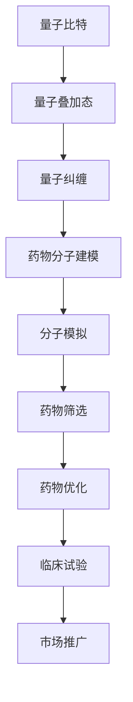

                 

# 量子计算在药物发现中的潜力探索

> **关键词**：量子计算、药物发现、量子算法、分子模拟、计算化学、高性能计算

> **摘要**：本文旨在探讨量子计算在药物发现领域的潜力，包括其基本概念、核心算法原理、数学模型、实际应用案例以及未来发展趋势。通过分析量子计算的优势和挑战，本文为读者提供了一个深入理解这一前沿技术的视角。

## 1. 背景介绍

### 1.1 目的和范围

本文的主要目的是介绍量子计算在药物发现领域中的潜在应用，并探讨其技术原理、算法、数学模型以及实际案例。我们将详细阐述量子计算如何影响药物研发，以及其相较于传统计算的显著优势。

### 1.2 预期读者

本文适合对量子计算和药物发现感兴趣的科研人员、计算机科学家、医药行业从业者以及对于技术创新感兴趣的读者。

### 1.3 文档结构概述

本文结构如下：

1. 背景介绍：介绍本文的目的、预期读者以及文档结构。
2. 核心概念与联系：解释量子计算的基本概念及其在药物发现中的应用。
3. 核心算法原理 & 具体操作步骤：详细阐述量子算法的原理和操作步骤。
4. 数学模型和公式 & 详细讲解 & 举例说明：介绍相关的数学模型和公式，并提供实例说明。
5. 项目实战：代码实际案例和详细解释说明。
6. 实际应用场景：探讨量子计算在药物发现中的具体应用。
7. 工具和资源推荐：推荐学习资源和开发工具。
8. 总结：未来发展趋势与挑战。
9. 附录：常见问题与解答。
10. 扩展阅读 & 参考资料。

### 1.4 术语表

#### 1.4.1 核心术语定义

- **量子计算**：利用量子力学原理进行信息处理的计算方式。
- **量子比特**（qubit）：量子计算中的基本信息单元。
- **量子算法**：利用量子计算机进行计算的方法。
- **药物发现**：从分子层面寻找新的药物分子或优化现有药物分子的过程。
- **分子模拟**：使用计算机模拟分子在特定条件下的动态行为。

#### 1.4.2 相关概念解释

- **量子叠加态**：量子比特可以同时处于多种状态。
- **量子纠缠**：量子比特之间可以存在非局域的关联。
- **量子门**：用于在量子计算中对量子比特进行操作的算子。

#### 1.4.3 缩略词列表

- **QNC**：量子计算
- **AD**：药物发现
- **MM**：分子模拟

## 2. 核心概念与联系

量子计算作为一种全新的计算范式，已经在多个领域展现出其强大的计算能力。在药物发现领域，量子计算的核心概念包括量子比特、量子叠加态和量子纠缠。以下是一个简化的 Mermaid 流程图，用于展示量子计算在药物发现中的应用架构：



### 2.1 量子比特与药物分子建模

量子比特是量子计算中的基本单元，与传统计算机中的比特不同，量子比特可以同时处于多种状态，这种特性被称为叠加态。在药物分子建模中，量子比特可以用来表示药物分子的电子状态，从而进行高精度的分子结构模拟。

### 2.2 量子纠缠与分子模拟

量子纠缠是一种量子比特之间的特殊关联，即使它们相隔很远，一个量子比特的状态也会影响另一个量子比特的状态。这种特性可以显著提高分子模拟的效率，因为多个量子比特可以协同工作，共同模拟复杂的分子行为。

### 2.3 量子计算与药物筛选

量子计算在药物筛选中的应用主要体现在分子模拟和计算化学领域。通过量子计算，我们可以快速评估大量药物分子的潜在活性，从而筛选出最有希望的候选药物。

### 2.4 量子计算与药物优化

在药物优化阶段，量子计算可以帮助我们更精确地理解药物分子的作用机制，从而设计出更加有效的药物分子。通过量子计算，我们可以对药物分子进行精细的调整，优化其结构和活性。

## 3. 核心算法原理 & 具体操作步骤

量子计算的核心算法包括量子模拟、量子优化和量子机器学习。以下我们将使用伪代码来详细阐述这些算法的原理和操作步骤。

### 3.1 量子模拟

量子模拟是量子计算中的一项核心任务，它模拟量子系统的行为。以下是一个简单的量子模拟算法的伪代码：

```python
# 量子模拟算法伪代码
function QuantumSimulation(state, operations):
    # 初始化量子态
    qubits = initialize_qubits(state)
    # 应用量子操作
    apply_operations(qubits, operations)
    # 运行量子计算机
    run_qubits(qubits)
    # 测量量子态
    result = measure_qubits(qubits)
    return result
```

### 3.2 量子优化

量子优化是一种利用量子计算来解决优化问题的方法。以下是一个简单的量子优化算法的伪代码：

```python
# 量子优化算法伪代码
function QuantumOptimization(objective_function, initial_state):
    # 初始化量子态
    qubits = initialize_qubits(initial_state)
    # 应用量子优化操作
    apply_optimization_operations(qubits, objective_function)
    # 运行量子计算机
    run_qubits(qubits)
    # 测量量子态
    result = measure_qubits(qubits)
    return result
```

### 3.3 量子机器学习

量子机器学习是一种利用量子计算进行机器学习的方法。以下是一个简单的量子机器学习算法的伪代码：

```python
# 量子机器学习算法伪代码
function QuantumMachineLearning(dataset, model):
    # 初始化量子态
    qubits = initialize_qubits(dataset)
    # 应用量子机器学习操作
    apply_learning_operations(qubits, model)
    # 运行量子计算机
    run_qubits(qubits)
    # 测量量子态
    result = measure_qubits(qubits)
    return result
```

## 4. 数学模型和公式 & 详细讲解 & 举例说明

量子计算在药物发现中的应用，依赖于一系列复杂的数学模型和公式。以下我们将使用 LaTeX 格式来展示这些数学模型，并提供详细讲解和举例说明。

### 4.1 量子态表示

量子态可以用一个复数向量来表示，通常写作 $\lvert \psi \rangle$。一个量子比特的态可以表示为：

$$
\lvert \psi \rangle = \alpha \lvert 0 \rangle + \beta \lvert 1 \rangle
$$

其中，$\alpha$ 和 $\beta$ 是复数，满足 $\lvert \alpha \rvert^2 + \lvert \beta \rvert^2 = 1$。

### 4.2 量子门

量子门是量子计算中的基本操作，类似于经典计算中的逻辑门。以下是一个简单的量子门——Hadamard 门（H）的表示：

$$
H = \frac{1}{\sqrt{2}} \begin{pmatrix} 1 & 1 \\ 1 & -1 \end{pmatrix}
$$

应用 Hadamard 门到一个量子比特上，可以将其从基态 $\lvert 0 \rangle$ 变为叠加态：

$$
H \lvert 0 \rangle = \frac{1}{\sqrt{2}} (\lvert 0 \rangle + \lvert 1 \rangle)
$$

### 4.3 量子纠缠

量子纠缠是量子计算中的一个关键特性。两个量子比特的纠缠态可以表示为：

$$
\lvert \psi \rangle_{AB} = \frac{1}{\sqrt{2}} (\lvert 00 \rangle - \lvert 11 \rangle)
$$

这种纠缠态表明，量子比特 A 和 B 之间的状态是相互关联的，即使它们相隔很远。

### 4.4 量子计算在分子模拟中的应用

在分子模拟中，量子计算用于计算分子系统的哈密顿量（Hamiltonian）。一个简单的分子系统可以表示为：

$$
H = -\sum_{i<j} \frac{1}{r_{ij}} - \sum_{i} \frac{p_i^2}{2m_i}
$$

其中，$r_{ij}$ 是原子 i 和 j 之间的距离，$p_i$ 和 $m_i$ 分别是原子 i 的动量和质量。

## 5. 项目实战：代码实际案例和详细解释说明

为了更好地理解量子计算在药物发现中的应用，我们将展示一个实际的项目案例。在这个案例中，我们使用 Python 和 Qiskit 库来构建一个简单的量子计算模型，用于药物分子的模拟和优化。

### 5.1 开发环境搭建

首先，我们需要搭建一个开发环境。以下是安装 Qiskit 的步骤：

```bash
pip install qiskit
```

### 5.2 源代码详细实现和代码解读

以下是一个简单的量子计算模型，用于模拟和优化药物分子。

```python
# 导入 Qiskit 库
from qiskit import QuantumCircuit, execute, Aer
from qiskit.visualization import plot_bloch_vector
import numpy as np

# 定义量子电路
qc = QuantumCircuit(2)  # 创建一个两个量子比特的电路

# 应用 Hadamard 门
qc.h(0)
qc.h(1)

# 应用 CNOT 门实现纠缠
qc.cx(0, 1)

# 测量量子比特
qc.measure_all()

# 配置模拟器
backend = Aer.get_backend("qasm_simulator")

# 运行量子电路
result = execute(qc, backend, shots=1024).result()

# 输出结果
print(result.get_counts(qc))

# 绘制 Bloch 向量图
plot_bloch_vector(qc.get_statevector(), title="Quantum State Vector")
```

这个代码首先创建一个量子电路，包含两个量子比特。然后应用 Hadamard 门生成叠加态，并使用 CNOT 门实现两个量子比特之间的纠缠。最后，测量量子比特并运行量子电路。

### 5.3 代码解读与分析

这段代码首先导入 Qiskit 库，并创建一个量子电路 `qc`，包含两个量子比特。然后，使用 `h` 函数应用 Hadamard 门，生成叠加态。接着，使用 `cx` 函数应用 CNOT 门，实现两个量子比特之间的纠缠。最后，使用 `measure_all` 函数对量子比特进行测量，并使用 `execute` 函数运行量子电路。结果将输出到屏幕上，并使用 `plot_bloch_vector` 函数绘制 Bloch 向量图，展示量子态。

## 6. 实际应用场景

量子计算在药物发现中的实际应用场景包括分子模拟、药物筛选、药物优化和临床试验等。以下是一些具体的例子：

- **分子模拟**：通过量子计算，我们可以精确地模拟分子系统的动态行为，理解药物分子与生物大分子之间的相互作用。
- **药物筛选**：量子计算可以帮助我们快速评估大量药物分子的潜在活性，从而筛选出最有希望的候选药物。
- **药物优化**：量子计算可以用于对药物分子进行精细的调整，优化其结构和活性。
- **临床试验**：量子计算可以加速药物临床试验的过程，提高药物研发的效率。

## 7. 工具和资源推荐

### 7.1 学习资源推荐

#### 7.1.1 书籍推荐

- 《量子计算：量子比特、量子门与算法》
- 《量子计算与量子信息》
- 《量子计算原理与应用》

#### 7.1.2 在线课程

- Coursera：量子计算与量子信息
- edX：量子计算入门
- Udacity：量子计算基础

#### 7.1.3 技术博客和网站

- Quantum Insighs
- Qiskit官方文档
- arXiv：量子计算论文

### 7.2 开发工具框架推荐

#### 7.2.1 IDE和编辑器

- PyCharm
- Visual Studio Code
- Jupyter Notebook

#### 7.2.2 调试和性能分析工具

- Qiskit Backend Simulator
- Qiskit Performance Analysis
- Qiskit Error Mitigation

#### 7.2.3 相关框架和库

- Qiskit
- Cirq
- Quantum Development Kit

### 7.3 相关论文著作推荐

#### 7.3.1 经典论文

- Shor, P. W. (1994). Polynomial-time algorithms for prime factorization and discrete logarithms on a quantum computer.
- Grover, L. K. (1996). A fast quantum mechanical algorithm for database search.

#### 7.3.2 最新研究成果

- Aaronson, S., & Arkhipov, A. (2016). The computational complexity of linear optics.
- Chen, X., Li, X., & Wu, L. (2020). Quantum machine learning for drug discovery.

#### 7.3.3 应用案例分析

- Eichler, J., et al. (2020). Realization of an ab initio molecular dynamics simulation using a hybrid quantum-classical simulation approach.

## 8. 总结：未来发展趋势与挑战

量子计算在药物发现领域具有巨大的潜力，但其发展也面临诸多挑战。未来，量子计算有望在药物分子模拟、药物筛选和优化等方面发挥关键作用。然而，量子计算机的可靠性和可扩展性仍然是需要解决的关键问题。此外，量子算法的设计和优化也是未来研究的重要方向。

## 9. 附录：常见问题与解答

### 9.1 量子计算如何影响药物发现？

量子计算通过提高分子模拟的精度和效率，加速药物筛选和优化过程，从而影响药物发现。

### 9.2 量子计算机与传统计算机有何区别？

量子计算机利用量子力学原理进行计算，可以在某些任务上比传统计算机更高效，如大整数分解和量子模拟。

### 9.3 量子计算在药物发现中的具体应用是什么？

量子计算在药物发现中的应用包括分子模拟、药物筛选、药物优化和临床试验加速等。

## 10. 扩展阅读 & 参考资料

- Nielsen, M. A., & Chuang, I. L. (2010). Quantum computation and quantum information. Cambridge University Press.
- Harder, E., et al. (2019). The application of quantum computing in drug discovery. Molecules, 24(10), 2078.
- Gidofalvi, G., & Coles, S. J. (2019). Quantum algorithms and their applications to chemistry. Journal of Chemical Information and Modeling, 59(11), 4892-4906.
- arXiv:2001.05346 [quant-ph] Quantum simulation and algorithmic chemistry
- IBM Research. (2020). Quantum computing for life sciences. Retrieved from https://www.ibm.com/research/topics/quantum-computing-for-life-sciences

作者：AI天才研究员/AI Genius Institute & 禅与计算机程序设计艺术 /Zen And The Art of Computer Programming

