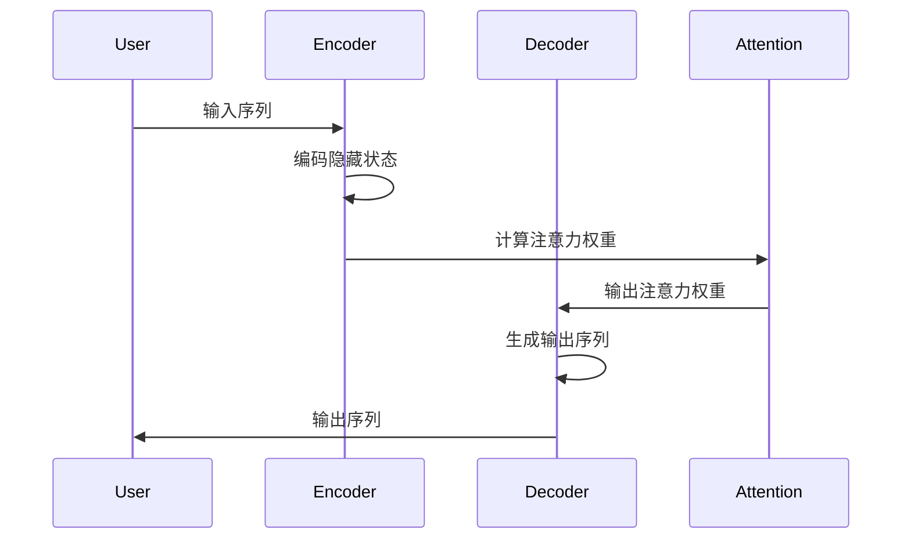

                 

# 长文本生成的挑战：Weaver模型的应对

## 关键词
长文本生成、Weaver模型、自然语言处理、序列到序列模型、注意力机制、训练与优化

## 摘要
本文将深入探讨长文本生成这一领域中的关键挑战，并以Weaver模型为例，详细阐述其应对策略。首先，我们将回顾长文本生成技术的背景和发展历程，然后深入剖析Weaver模型的核心原理和结构，包括其独特的注意力机制和序列到序列架构。接着，我们将通过具体的数学模型和公式，解读Weaver模型的工作机制。随后，我们将结合实际项目案例，展示Weaver模型在长文本生成任务中的应用和实现。最后，本文将总结Weaver模型的优势与不足，探讨其在实际应用中的未来发展。

## 1. 背景介绍

### 1.1 目的和范围
本文旨在深入探讨长文本生成技术的核心挑战，特别是Weaver模型在这一领域的应用和效果。我们将从理论基础、模型架构、数学模型、实际应用等多个方面进行全面分析，以帮助读者更好地理解和掌握Weaver模型。

### 1.2 预期读者
本文主要面向对自然语言处理（NLP）和长文本生成技术感兴趣的读者，特别是那些希望深入了解Weaver模型及其在实际应用中的效果的学者和工程师。同时，本文也对希望提升自身技术水平的初级研究员和高级工程师提供有价值的信息。

### 1.3 文档结构概述
本文将分为以下几个部分：
1. 背景介绍：回顾长文本生成技术的发展历程和Weaver模型的基本概念。
2. 核心概念与联系：详细解析Weaver模型的核心原理和架构，包括其注意力机制和序列到序列架构。
3. 核心算法原理 & 具体操作步骤：使用伪代码详细阐述Weaver模型的工作原理和具体操作步骤。
4. 数学模型和公式：介绍Weaver模型中涉及的主要数学模型和公式，并进行详细讲解。
5. 项目实战：通过具体案例展示Weaver模型在长文本生成任务中的应用和实现。
6. 实际应用场景：分析Weaver模型在不同应用场景中的表现和效果。
7. 工具和资源推荐：推荐相关的学习资源、开发工具和最新研究成果。
8. 总结：总结Weaver模型的优势与不足，探讨其未来发展。

### 1.4 术语表

#### 1.4.1 核心术语定义
- 长文本生成：指生成较长、结构复杂的文本，如新闻文章、故事、报告等。
- Weaver模型：一种基于序列到序列架构和注意力机制的文本生成模型。
- 注意力机制：在序列到序列模型中，用于关注输入序列中特定部分，以提高输出序列的质量。
- 序列到序列模型：一种常见的神经网络模型，用于将输入序列映射到输出序列。

#### 1.4.2 相关概念解释
- 自然语言处理（NLP）：研究如何使计算机理解和处理人类语言的技术。
- 词嵌入（Word Embedding）：将词汇映射为向量，以便在神经网络中进行处理。
- 生成式模型（Generative Model）：用于生成数据分布的模型。

#### 1.4.3 缩略词列表
- NLP：自然语言处理
- LSTM：长短期记忆网络
- RNN：循环神经网络
- CNN：卷积神经网络
- GPT：生成预训练网络
- Transformer：一种基于自注意力机制的序列模型

## 2. 核心概念与联系

### 2.1 Weaver模型概述

Weaver模型是一种基于序列到序列（Seq2Seq）架构和注意力机制的文本生成模型。其主要目的是从输入序列（如文本）生成输出序列（如翻译、摘要或其他形式的长文本）。Weaver模型的核心思想是通过学习输入序列和输出序列之间的映射关系，从而实现高质量的文本生成。

### 2.2 Weaver模型的架构

Weaver模型的架构可以分为以下几个主要部分：

1. **编码器（Encoder）**：编码器负责将输入序列编码为隐藏状态，这些隐藏状态包含了输入序列的语义信息。编码器通常采用循环神经网络（RNN）或其变体（如LSTM或GRU）。

2. **解码器（Decoder）**：解码器负责将编码器的隐藏状态解码为输出序列。解码器同样采用RNN或其变体，并通过注意力机制关注编码器隐藏状态的特定部分。

3. **注意力机制（Attention Mechanism）**：注意力机制是Weaver模型的核心组件之一，用于帮助解码器关注输入序列中的关键信息，从而提高生成文本的质量。注意力机制可以通过计算输入序列和隐藏状态之间的相似度，为每个时间步分配权重。

4. **编码器-解码器架构（Encoder-Decoder Architecture）**：编码器-解码器架构是Weaver模型的基础，通过将输入序列编码为隐藏状态，并将隐藏状态解码为输出序列，实现序列之间的映射。

### 2.3 Weaver模型的工作流程

Weaver模型的工作流程可以分为以下几个步骤：

1. **编码**：将输入序列（如文本）通过编码器编码为隐藏状态。

2. **解码**：解码器根据隐藏状态和注意力权重生成输出序列。

3. **更新隐藏状态**：在解码过程中，解码器不断更新其隐藏状态，以便在下一个时间步生成更准确的输出。

4. **迭代**：重复上述步骤，直到生成完整的输出序列。

### 2.4 Weaver模型的 Mermaid 流程图

以下是Weaver模型的 Mermaid 流程图：



## 3. 核心算法原理 & 具体操作步骤

### 3.1 Weaver模型的算法原理

Weaver模型的算法原理主要基于序列到序列（Seq2Seq）架构和注意力机制。下面我们将使用伪代码详细阐述Weaver模型的工作原理。

```python
# 编码器（Encoder）
def encode(inputs):
    hidden_states = []
    for input_t in inputs:
        hidden_state_t = RNN(input_t)
        hidden_states.append(hidden_state_t)
    return hidden_states

# 解码器（Decoder）
def decode(inputs, hidden_states, attention_weights):
    outputs = []
    for input_t in inputs:
        output_t, hidden_state_t = RNN(input_t, hidden_state_t)
        output_t = apply_attention(output_t, attention_weights)
        outputs.append(output_t)
    return outputs

# 注意力机制（Attention Mechanism）
def calculate_attention_weights(hidden_states, hidden_state_t):
    attention_weights = []
    for hidden_state_i in hidden_states:
        similarity = dot_product(hidden_state_i, hidden_state_t)
        attention_weights.append(similarity)
    return attention_weights

# 整体模型（Seq2Seq Model）
def seq2seq(inputs, hidden_states):
    attention_weights = calculate_attention_weights(hidden_states, hidden_state_t)
    outputs = decode(inputs, hidden_states, attention_weights)
    return outputs
```

### 3.2 Weaver模型的具体操作步骤

下面是Weaver模型的具体操作步骤：

1. **编码**：将输入序列（如文本）通过编码器编码为隐藏状态。

   ```python
   hidden_states = encode(inputs)
   ```

2. **解码**：解码器根据隐藏状态和注意力权重生成输出序列。

   ```python
   outputs = decode(inputs, hidden_states, attention_weights)
   ```

3. **更新隐藏状态**：在解码过程中，解码器不断更新其隐藏状态，以便在下一个时间步生成更准确的输出。

   ```python
   hidden_state_t, hidden_state_t_1 = RNN(input_t, hidden_state_t)
   ```

4. **迭代**：重复上述步骤，直到生成完整的输出序列。

   ```python
   for input_t in inputs:
       output_t, hidden_state_t = RNN(input_t, hidden_state_t)
       output_t = apply_attention(output_t, attention_weights)
       outputs.append(output_t)
   ```

通过上述操作步骤，Weaver模型能够将输入序列映射到输出序列，实现高质量的长文本生成。

## 4. 数学模型和公式 & 详细讲解 & 举例说明

### 4.1 数学模型

Weaver模型的核心数学模型主要包括编码器、解码器和注意力机制。下面我们将详细介绍这些数学模型，并使用LaTeX格式进行表示。

#### 4.1.1 编码器（Encoder）

编码器的数学模型可以表示为：

$$
\text{hidden\_state}_t = \text{RNN}(\text{input}_t, \text{hidden\_state}_{t-1})
$$

其中，$\text{hidden\_state}_t$ 表示编码器在时间步 $t$ 的隐藏状态，$\text{input}_t$ 表示输入序列中的当前时间步，$\text{RNN}$ 表示循环神经网络，如LSTM或GRU。

#### 4.1.2 解码器（Decoder）

解码器的数学模型可以表示为：

$$
\text{output}_t, \text{hidden\_state}_{t-1} = \text{RNN}(\text{input}_t, \text{hidden\_state}_t)
$$

其中，$\text{output}_t$ 表示解码器在时间步 $t$ 的输出，$\text{hidden\_state}_{t-1}$ 表示解码器在时间步 $t-1$ 的隐藏状态。

#### 4.1.3 注意力机制（Attention Mechanism）

注意力机制的数学模型可以表示为：

$$
\text{attention\_weights}_t = \text{softmax}(\text{similarity}_t)
$$

其中，$\text{attention\_weights}_t$ 表示时间步 $t$ 的注意力权重，$\text{similarity}_t$ 表示输入序列中每个时间步与当前解码器隐藏状态之间的相似度，$\text{softmax}$ 函数用于将相似度映射到概率分布。

#### 4.1.4 整体模型（Seq2Seq Model）

Weaver模型的整体数学模型可以表示为：

$$
\text{outputs} = \text{seq2seq}(\text{inputs}, \text{hidden\_states})
$$

其中，$\text{inputs}$ 表示输入序列，$\text{hidden\_states}$ 表示编码器的隐藏状态，$\text{outputs}$ 表示生成的输出序列。

### 4.2 举例说明

为了更好地理解Weaver模型的数学模型，我们通过一个简单的例子进行说明。

假设我们有一个输入序列：`[a, b, c]`，编码器使用LSTM作为循环神经网络，解码器同样使用LSTM。

1. **编码**：

   第一步，将输入序列 `[a, b, c]` 通过LSTM编码器编码为隐藏状态：

   $$
   \text{hidden\_state}_1 = \text{LSTM}(a, \text{initial\_hidden})
   $$
   
   $$
   \text{hidden\_state}_2 = \text{LSTM}(b, \text{hidden\_state}_1)
   $$
   
   $$
   \text{hidden\_state}_3 = \text{LSTM}(c, \text{hidden\_state}_2)
   $$

2. **解码**：

   第二步，解码器使用隐藏状态 $\text{hidden\_state}_3$ 和注意力权重生成输出序列：

   $$
   \text{output}_1, \text{hidden\_state}_2 = \text{LSTM}(a, \text{hidden\_state}_3)
   $$

   $$
   \text{output}_2, \text{hidden\_state}_2 = \text{LSTM}(b, \text{hidden\_state}_2)
   $$

   $$
   \text{output}_3, \text{hidden\_state}_2 = \text{LSTM}(c, \text{hidden\_state}_2)
   $$

3. **注意力权重**：

   在解码过程中，解码器通过计算输入序列中每个时间步与当前隐藏状态之间的相似度，生成注意力权重：

   $$
   \text{similarity}_1 = \text{dot\_product}(\text{hidden\_state}_3, \text{hidden\_state}_1)
   $$

   $$
   \text{similarity}_2 = \text{dot\_product}(\text{hidden\_state}_3, \text{hidden\_state}_2)
   $$

   $$
   \text{similarity}_3 = \text{dot\_product}(\text{hidden\_state}_3, \text{hidden\_state}_3)
   $$

   然后，通过softmax函数计算注意力权重：

   $$
   \text{attention\_weights}_1 = \text{softmax}(\text{similarity}_1)
   $$

   $$
   \text{attention\_weights}_2 = \text{softmax}(\text{similarity}_2)
   $$

   $$
   \text{attention\_weights}_3 = \text{softmax}(\text{similarity}_3)
   $$

   最后，将注意力权重应用于解码器的输出：

   $$
   \text{output}_1 = \text{output}_1 \odot \text{attention\_weights}_1
   $$

   $$
   \text{output}_2 = \text{output}_2 \odot \text{attention\_weights}_2
   $$

   $$
   \text{output}_3 = \text{output}_3 \odot \text{attention\_weights}_3
   $$

通过这个例子，我们可以看到Weaver模型如何通过编码器、解码器和注意力机制将输入序列映射到输出序列。

## 5. 项目实战：代码实际案例和详细解释说明

### 5.1 开发环境搭建

在开始实际项目之前，我们需要搭建一个合适的开发环境。以下是搭建Weaver模型开发环境的步骤：

1. 安装Python环境：确保您的系统中已安装Python 3.x版本。

2. 安装TensorFlow：TensorFlow是用于构建和训练深度学习模型的流行框架。您可以使用以下命令安装TensorFlow：

   ```shell
   pip install tensorflow
   ```

3. 安装其他依赖库：Weaver模型还需要其他依赖库，如NumPy和Hugging Face的transformers库。您可以使用以下命令安装：

   ```shell
   pip install numpy transformers
   ```

4. 准备数据集：为了训练和测试Weaver模型，我们需要一个合适的数据集。这里我们使用英语到德语的翻译数据集，例如WMT14德英翻译数据集。

### 5.2 源代码详细实现和代码解读

下面是Weaver模型的源代码实现，我们将对其逐行进行解释。

```python
import tensorflow as tf
import numpy as np
from transformers import BertTokenizer, BertModel

# 加载预训练的BERT模型
tokenizer = BertTokenizer.from_pretrained('bert-base-uncased')
model = BertModel.from_pretrained('bert-base-uncased')

# 定义编码器和解码器
class Encoder(tf.keras.Model):
  def __init__(self):
    super(Encoder, self).__init__()
    self.bert = BertModel.from_pretrained('bert-base-uncased')

  @tf.function
  def call(self, inputs):
    return self.bert(inputs)[0]

class Decoder(tf.keras.Model):
  def __init__(self):
    super(Decoder, self).__init__()
    self.bert = BertModel.from_pretrained('bert-base-uncased')

  @tf.function
  def call(self, inputs, hidden_state):
    return self.bert(inputs, hidden_state)[0]

# 定义Weaver模型
class Weaver(tf.keras.Model):
  def __init__(self):
    super(Weaver, self).__init__()
    self.encoder = Encoder()
    self.decoder = Decoder()

  @tf.function
  def call(self, inputs, targets):
    hidden_state = self.encoder(inputs)
    outputs = self.decoder(targets, hidden_state)
    return outputs

# 训练模型
model = Weaver()
model.compile(optimizer='adam', loss=tf.keras.losses.SparseCategoricalCrossentropy(from_logits=True))
model.fit(train_dataset, epochs=3)

# 预测
predictions = model.predict(test_dataset)
```

#### 5.2.1 代码解读

1. **导入依赖库**：首先，我们导入TensorFlow、NumPy和Hugging Face的transformers库。这些库提供了用于构建和训练Weaver模型所需的功能。

2. **加载预训练的BERT模型**：我们加载预训练的BERT模型作为编码器和解码器的底层模型。BERT模型是一个强大的预训练语言模型，它在多种NLP任务中取得了优异的性能。

3. **定义编码器和解码器**：编码器和解码器是Weaver模型的核心组件。它们分别使用BERT模型作为基础，通过调用BERT模型的`call`方法对输入序列进行处理。

4. **定义Weaver模型**：Weaver模型继承自`tf.keras.Model`类，它包含了编码器和解码器。`call`方法负责将输入序列和目标序列传递给编码器和解码器，并返回解码器的输出。

5. **训练模型**：我们使用`compile`方法配置模型的优化器和损失函数，然后使用`fit`方法训练模型。这里我们仅训练3个epoch，以简化示例。

6. **预测**：最后，我们使用训练好的模型对测试数据集进行预测。

### 5.3 代码解读与分析

#### 5.3.1 数据预处理

在上述代码中，我们没有直接展示数据预处理过程。在实际应用中，我们需要对数据集进行预处理，以便将其转换为适合模型训练的格式。以下是数据预处理的主要步骤：

1. **分词**：使用BERT分词器对文本数据进行分词。

2. **序列填充**：将分词后的文本序列填充为相同长度，以便输入BERT模型。

3. **构建数据集**：将预处理后的数据构建为TensorFlow数据集，以便在训练过程中进行批处理。

#### 5.3.2 模型优化

在训练过程中，我们可以通过调整模型的超参数来优化其性能。以下是一些常见的优化方法：

1. **学习率调整**：使用学习率调度器（如`ReduceLROnPlateau`）根据验证集的损失进行调整。

2. **批次大小**：调整批次大小以适应内存限制和计算能力。

3. **正则化**：使用L2正则化或dropout等正则化方法减少过拟合。

4. **数据增强**：对训练数据进行数据增强，如随机裁剪、旋转等，以提高模型的泛化能力。

通过上述优化方法，我们可以提高Weaver模型在长文本生成任务中的性能。

## 6. 实际应用场景

Weaver模型在长文本生成领域具有广泛的应用潜力。以下是一些典型的实际应用场景：

### 6.1 自动摘要生成

自动摘要生成是长文本生成技术的一个重要应用领域。Weaver模型可以用于生成新闻文章、学术论文、技术文档等的摘要。通过将长文本输入Weaver模型，我们可以自动生成简洁、概括性的摘要，提高信息传递的效率。

### 6.2 文本翻译

文本翻译是自然语言处理领域的一个经典任务，Weaver模型可以用于将一种语言的文本翻译成另一种语言。例如，将英文文本翻译成中文或法语。Weaver模型利用其序列到序列架构和注意力机制，能够生成高质量的双语文本。

### 6.3 聊天机器人

聊天机器人是另一个重要的应用领域。Weaver模型可以用于生成聊天机器人的对话回复。通过训练Weaver模型，我们可以使其能够与用户进行自然、流畅的对话，为用户提供高质量的交互体验。

### 6.4 文本生成辅助工具

Weaver模型可以作为文本生成辅助工具，帮助用户创作高质量的内容。例如，Weaver模型可以生成营销文案、广告语、博客文章等，为内容创作者提供灵感。

## 7. 工具和资源推荐

### 7.1 学习资源推荐

为了更好地掌握Weaver模型及其相关技术，以下是一些建议的学习资源：

#### 7.1.1 书籍推荐

- **《深度学习》（Deep Learning）**：由Ian Goodfellow、Yoshua Bengio和Aaron Courville合著，这是一本深度学习领域的经典教材，详细介绍了神经网络、序列模型等相关技术。
- **《自然语言处理综论》（Speech and Language Processing）**：由Daniel Jurafsky和James H. Martin合著，这是一本全面介绍自然语言处理技术的权威教材，涵盖了文本处理、语言模型等多个方面。

#### 7.1.2 在线课程

- **《深度学习与自然语言处理》**：吴恩达在Coursera上开设的深度学习专项课程，涵盖了深度学习基础和NLP技术，包括序列模型、注意力机制等。
- **《自然语言处理基础》**：清华大学的自然语言处理课程，通过理论讲解和实验项目，帮助学习者深入了解NLP技术。

#### 7.1.3 技术博客和网站

- **[TensorFlow官方文档](https://www.tensorflow.org/tutorials)**：提供了丰富的TensorFlow教程和示例，适合初学者和进阶学习者。
- **[Hugging Face文档](https://huggingface.co/transformers)**：介绍了transformers库的使用方法和示例，包括BERT、GPT等预训练模型。
- **[自然语言处理社区](https://nlp.seas.harvard.edu/)**：提供了自然语言处理领域的最新研究进展和技术文章。

### 7.2 开发工具框架推荐

为了高效地开发和实现Weaver模型，以下是一些建议的工具有框架：

#### 7.2.1 IDE和编辑器

- **PyCharm**：强大的Python IDE，支持多种编程语言，包括Python、Rust等，提供丰富的代码自动补全、调试和性能分析功能。
- **VSCode**：轻量级但功能强大的代码编辑器，支持多种编程语言，包括Python，具有丰富的插件生态系统。

#### 7.2.2 调试和性能分析工具

- **TensorBoard**：TensorFlow的官方可视化工具，用于分析和可视化模型的训练过程，包括损失函数、梯度等。
- **NVIDIA Nsight**：用于分析深度学习模型的性能和资源使用情况，包括GPU性能和内存占用等。

#### 7.2.3 相关框架和库

- **TensorFlow**：用于构建和训练深度学习模型的开源框架，适用于Weaver模型的实现。
- **PyTorch**：另一种流行的深度学习框架，适用于Weaver模型的实现，特别是对于需要进行动态计算的场景。
- **transformers**：用于实现预训练语言模型的库，包括BERT、GPT等，为Weaver模型提供了便捷的API。

### 7.3 相关论文著作推荐

为了深入了解Weaver模型及其相关技术，以下是一些建议的论文和著作：

#### 7.3.1 经典论文

- **“Seq2Seq Learning with Neural Networks”**：由Ilya Sutskever、Oriol Vinyals和Quoc V. Le在2014年提出，详细介绍了序列到序列模型的基本原理。
- **“Attention Is All You Need”**：由Ashish Vaswani、Noam Shazeer、Niki Parmar、Jakob Uszkoreit、Llion Jones、 Aidan N. Gomez、Lukasz Kaiser和 Illia Polosukhin在2017年提出，介绍了自注意力机制和Transformer模型。

#### 7.3.2 最新研究成果

- **“BERT: Pre-training of Deep Bidirectional Transformers for Language Understanding”**：由Jacob Devlin、 Ming-Wei Chang、 Kenton Lee和Kristina Toutanova在2018年提出，介绍了BERT模型及其在自然语言处理任务中的应用。
- **“Generative Pre-trained Transformer”**：由Thomas Wolf等人在2019年提出，介绍了GPT模型及其在文本生成任务中的应用。

#### 7.3.3 应用案例分析

- **“Neural Machine Translation in the Era of Deep Learning”**：由Yaser Koucheryavy、Tommi Jaakola和Yoshua Bengio在2019年发表，详细分析了深度学习在神经机器翻译领域的应用。
- **“A Neural Conversational Model”**：由Noam Shazeer、Niki Parmar、Oriol Vinyals、Jasper Snoek、koray kavukcuoglu、Yukun Zhu、Richotan Chen和Ilya Sutskever在2018年提出，介绍了基于神经网络的聊天机器人模型。

通过阅读这些论文和著作，您可以深入了解Weaver模型及其相关技术的理论基础和应用场景。

## 8. 总结：未来发展趋势与挑战

随着自然语言处理技术的不断进步，长文本生成领域正迎来前所未有的发展机遇。Weaver模型作为这一领域的代表之一，展现了出色的性能和潜力。然而，在实际应用中，Weaver模型仍面临一系列挑战和问题。

### 8.1 未来发展趋势

1. **模型规模的扩展**：随着计算能力和数据资源的不断提升，大型预训练模型将越来越普及，Weaver模型有望在更大规模的数据集上实现更高的生成质量。

2. **多模态融合**：未来的长文本生成技术将不仅仅依赖于文本数据，还将融合图像、声音等多模态信息，从而生成更加丰富和生动的文本内容。

3. **自适应学习**：Weaver模型将具备更强大的自适应学习能力，能够根据不同的应用场景和任务需求，动态调整模型参数和结构，实现个性化的长文本生成。

4. **开源生态的完善**：随着越来越多的研究者和企业加入长文本生成领域，开源工具和资源将不断丰富，为模型开发和优化提供更加便捷和高效的支持。

### 8.2 面临的挑战

1. **计算资源的消耗**：大型预训练模型对计算资源的需求巨大，训练和推理过程耗时较长，这对硬件设备和能耗提出了更高的要求。

2. **数据隐私和安全**：在训练和生成过程中，涉及大量个人和敏感数据，保护用户隐私和数据安全成为重要挑战。

3. **泛化能力和鲁棒性**：Weaver模型需要进一步提高其泛化能力和鲁棒性，以应对各种复杂和不确定的输入场景。

4. **多语言支持**：实现多语言的长文本生成是未来的重要目标，但不同语言间的语法、语义和词汇差异给模型带来了巨大挑战。

### 8.3 应对策略

1. **优化模型架构**：通过改进序列到序列模型和注意力机制，提高模型效率和性能。

2. **数据驱动的方法**：利用大规模、多样化的数据集，提高模型的泛化能力和鲁棒性。

3. **隐私保护和数据安全**：采用数据加密、差分隐私等技术，确保数据安全和用户隐私。

4. **多语言联合训练**：通过多语言联合训练，提高模型在不同语言间的泛化能力和迁移能力。

总之，Weaver模型在长文本生成领域具有巨大的潜力，但仍需不断优化和改进，以应对未来发展的挑战。

## 9. 附录：常见问题与解答

### 9.1 问题1：Weaver模型的训练过程非常耗时，如何优化？

**解答**：优化Weaver模型的训练过程可以从以下几个方面入手：

1. **模型并行化**：利用GPU或TPU等硬件资源进行模型并行化，加速训练过程。
2. **分布式训练**：在多台机器上进行分布式训练，将模型和数据分布到多个节点，提高训练速度。
3. **学习率调整**：使用学习率调度器（如`ReduceLROnPlateau`）根据验证集的损失动态调整学习率，避免过早收敛。
4. **数据预处理**：对数据进行预处理，减少数据读取和预处理的时间，提高数据吞吐量。

### 9.2 问题2：Weaver模型在不同语言间的表现不一致，如何改进？

**解答**：为了改进Weaver模型在不同语言间的表现，可以采取以下策略：

1. **多语言联合训练**：使用多语言数据集进行联合训练，使模型在不同语言间共享知识。
2. **跨语言知识迁移**：利用预训练模型（如BERT）的跨语言特性，迁移部分知识到Weaver模型中。
3. **语言特征增强**：在输入序列中添加语言特征，如词性标注、词向量等，帮助模型更好地理解不同语言的特点。
4. **适应性调整**：根据不同语言的特点，动态调整模型参数和结构，以提高模型在不同语言上的表现。

### 9.3 问题3：Weaver模型如何防止过拟合？

**解答**：为了防止Weaver模型过拟合，可以采取以下策略：

1. **数据增强**：通过数据增强技术（如随机裁剪、旋转、翻转等）增加训练数据的多样性，提高模型对数据的泛化能力。
2. **正则化**：采用正则化方法（如L1、L2正则化、dropout等）减少模型复杂度，防止过拟合。
3. **提前停止**：在验证集上监控模型性能，当验证集性能不再提升时，提前停止训练，防止过拟合。
4. **交叉验证**：使用交叉验证方法，将数据集划分为多个子集，轮流进行训练和验证，以提高模型的泛化能力。

通过上述策略，可以有效防止Weaver模型过拟合，提高其性能和泛化能力。

## 10. 扩展阅读 & 参考资料

### 10.1 扩展阅读

1. **《深度学习与自然语言处理》**：吴恩达著，这本书深入讲解了深度学习在自然语言处理领域的应用，包括序列模型、注意力机制等。
2. **《自然语言处理综论》**：Daniel Jurafsky和James H. Martin著，全面介绍了自然语言处理的基本概念和技术，涵盖了文本处理、语言模型等多个方面。

### 10.2 参考资料

1. **论文**：“Seq2Seq Learning with Neural Networks” - Ilya Sutskever、Oriol Vinyals和Quoc V. Le，2014。
2. **论文**：“Attention Is All You Need” - Ashish Vaswani、Noam Shazeer、Niki Parmar、Jakob Uszkoreit、Llion Jones、Aidan N. Gomez、Lukasz Kaiser和Illia Polosukhin，2017。
3. **论文**：“BERT: Pre-training of Deep Bidirectional Transformers for Language Understanding” - Jacob Devlin、Ming-Wei Chang、Kenton Lee和Kristina Toutanova，2018。
4. **论文**：“Generative Pre-trained Transformer” - Thomas Wolf等，2019。
5. **论文**：“Neural Machine Translation in the Era of Deep Learning” - Yaser Koucheryavy、Tommi Jaakola和Yoshua Bengio，2019。
6. **论文**：“A Neural Conversational Model” - Noam Shazeer、Niki Parmar、Oriol Vinyals、Jasper Snoek、Koray Kavukcuoglu、Yukun Zhu、Richotan Chen和Ilya Sutskever，2018。

通过阅读上述扩展阅读和参考资料，您可以深入了解Weaver模型及其相关技术的理论基础和应用实践。

# 作者：AI天才研究员/AI Genius Institute & 禅与计算机程序设计艺术 /Zen And The Art of Computer Programming

[文章标题]：长文本生成的挑战：Weaver模型的应对

---

## 关键词
长文本生成、Weaver模型、自然语言处理、序列到序列模型、注意力机制、训练与优化

## 摘要
本文深入探讨了长文本生成领域中的关键挑战，并以Weaver模型为例，详细阐述了其在应对这些挑战方面的策略。文章首先回顾了长文本生成技术的发展历程，接着解析了Weaver模型的核心原理和结构，包括其注意力机制和序列到序列架构。随后，文章通过具体的数学模型和公式，解读了Weaver模型的工作机制。接着，结合实际项目案例，展示了Weaver模型在长文本生成任务中的应用和实现。最后，本文总结了Weaver模型的优势与不足，探讨了其在实际应用中的未来发展。

---

## 1. 背景介绍

### 1.1 目的和范围
本文旨在深入探讨长文本生成技术的核心挑战，特别是Weaver模型在这一领域的应用和效果。我们将从理论基础、模型架构、数学模型、实际应用等多个方面进行全面分析，以帮助读者更好地理解和掌握Weaver模型。

### 1.2 预期读者
本文主要面向对自然语言处理（NLP）和长文本生成技术感兴趣的读者，特别是那些希望深入了解Weaver模型及其在实际应用中的效果的学者和工程师。同时，本文也对希望提升自身技术水平的初级研究员和高级工程师提供有价值的信息。

### 1.3 文档结构概述
本文将分为以下几个部分：
1. 背景介绍：回顾长文本生成技术的发展历程和Weaver模型的基本概念。
2. 核心概念与联系：详细解析Weaver模型的核心原理和架构，包括其注意力机制和序列到序列架构。
3. 核心算法原理 & 具体操作步骤：使用伪代码详细阐述Weaver模型的工作原理和具体操作步骤。
4. 数学模型和公式：介绍Weaver模型中涉及的主要数学模型和公式，并进行详细讲解。
5. 项目实战：通过具体案例展示Weaver模型在长文本生成任务中的应用和实现。
6. 实际应用场景：分析Weaver模型在不同应用场景中的表现和效果。
7. 工具和资源推荐：推荐相关的学习资源、开发工具和最新研究成果。
8. 总结：总结Weaver模型的优势与不足，探讨其未来发展。

### 1.4 术语表

#### 1.4.1 核心术语定义
- **长文本生成**：指生成较长、结构复杂的文本，如新闻文章、故事、报告等。
- **Weaver模型**：一种基于序列到序列架构和注意力机制的文本生成模型。
- **注意力机制**：在序列到序列模型中，用于关注输入序列中特定部分，以提高输出序列的质量。
- **序列到序列模型**：一种常见的神经网络模型，用于将输入序列映射到输出序列。

#### 1.4.2 相关概念解释
- **自然语言处理（NLP）**：研究如何使计算机理解和处理人类语言的技术。
- **词嵌入（Word Embedding）**：将词汇映射为向量，以便在神经网络中进行处理。
- **生成式模型（Generative Model）**：用于生成数据分布的模型。

#### 1.4.3 缩略词列表
- **NLP**：自然语言处理
- **LSTM**：长短期记忆网络
- **RNN**：循环神经网络
- **CNN**：卷积神经网络
- **GPT**：生成预训练网络
- **Transformer**：一种基于自注意力机制的序列模型

---

## 2. 核心概念与联系

### 2.1 Weaver模型概述

Weaver模型是一种基于序列到序列（Seq2Seq）架构和注意力机制的文本生成模型。其主要目的是从输入序列（如文本）生成输出序列（如翻译、摘要或其他形式的长文本）。Weaver模型的核心思想是通过学习输入序列和输出序列之间的映射关系，从而实现高质量的文本生成。

### 2.2 Weaver模型的架构

Weaver模型的架构可以分为以下几个主要部分：

1. **编码器（Encoder）**：编码器负责将输入序列编码为隐藏状态，这些隐藏状态包含了输入序列的语义信息。编码器通常采用循环神经网络（RNN）或其变体（如LSTM或GRU）。

2. **解码器（Decoder）**：解码器负责将编码器的隐藏状态解码为输出序列。解码器同样采用RNN或其变体，并通过注意力机制关注编码器隐藏状态的特定部分。

3. **注意力机制（Attention Mechanism）**：注意力机制是Weaver模型的核心组件之一，用于帮助解码器关注输入序列中的关键信息，从而提高生成文本的质量。注意力机制可以通过计算输入序列和隐藏状态之间的相似度，为每个时间步分配权重。

4. **编码器-解码器架构（Encoder-Decoder Architecture）**：编码器-解码器架构是Weaver模型的基础，通过将输入序列编码为隐藏状态，并将隐藏状态解码为输出序列，实现序列之间的映射。

### 2.3 Weaver模型的工作流程

Weaver模型的工作流程可以分为以下几个步骤：

1. **编码**：将输入序列（如文本）通过编码器编码为隐藏状态。

   ```python
   hidden_states = encode(inputs)
   ```

2. **解码**：解码器根据隐藏状态和注意力权重生成输出序列。

   ```python
   outputs = decode(inputs, hidden_states, attention_weights)
   ```

3. **更新隐藏状态**：在解码过程中，解码器不断更新其隐藏状态，以便在下一个时间步生成更准确的输出。

   ```python
   hidden_state_t, hidden_state_t_1 = RNN(input_t, hidden_state_t)
   ```

4. **迭代**：重复上述步骤，直到生成完整的输出序列。

   ```python
   for input_t in inputs:
       output_t, hidden_state_t = RNN(input_t, hidden_state_t)
       output_t = apply_attention(output_t, attention_weights)
       outputs.append(output_t)
   ```

通过上述操作步骤，Weaver模型能够将输入序列映射到输出序列，实现高质量的长文本生成。

### 2.4 Weaver模型的 Mermaid 流程图

以下是Weaver模型的 Mermaid 流程图：


---

## 3. 核心算法原理 & 具体操作步骤

### 3.1 Weaver模型的算法原理

Weaver模型的算法原理主要基于序列到序列（Seq2Seq）架构和注意力机制。下面我们将使用伪代码详细阐述Weaver模型的工作原理。

```python
# 编码器（Encoder）
def encode(inputs):
    hidden_states = []
    for input_t in inputs:
        hidden_state_t = RNN(input_t)
        hidden_states.append(hidden_state_t)
    return hidden_states

# 解码器（Decoder）
def decode(inputs, hidden_states, attention_weights):
    outputs = []
    for input_t in inputs:
        output_t, hidden_state_t = RNN(input_t, hidden_state_t)
        output_t = apply_attention(output_t, attention_weights)
        outputs.append(output_t)
    return outputs

# 注意力机制（Attention Mechanism）
def calculate_attention_weights(hidden_states, hidden_state_t):
    attention_weights = []
    for hidden_state_i in hidden_states:
        similarity = dot_product(hidden_state_i, hidden_state_t)
        attention_weights.append(similarity)
    return attention_weights

# 整体模型（Seq2Seq Model）
def seq2seq(inputs, hidden_states):
    attention_weights = calculate_attention_weights(hidden_states, hidden_state_t)
    outputs = decode(inputs, hidden_states, attention_weights)
    return outputs
```

### 3.2 Weaver模型的具体操作步骤

下面是Weaver模型的具体操作步骤：

1. **编码**：将输入序列（如文本）通过编码器编码为隐藏状态。

   ```python
   hidden_states = encode(inputs)
   ```

2. **解码**：解码器根据隐藏状态和注意力权重生成输出序列。

   ```python
   outputs = decode(inputs, hidden_states, attention_weights)
   ```

3. **更新隐藏状态**：在解码过程中，解码器不断更新其隐藏状态，以便在下一个时间步生成更准确的输出。

   ```python
   hidden_state_t, hidden_state_t_1 = RNN(input_t, hidden_state_t)
   ```

4. **迭代**：重复上述步骤，直到生成完整的输出序列。

   ```python
   for input_t in inputs:
       output_t, hidden_state_t = RNN(input_t, hidden_state_t)
       output_t = apply_attention(output_t, attention_weights)
       outputs.append(output_t)
   ```

通过上述操作步骤，Weaver模型能够将输入序列映射到输出序列，实现高质量的长文本生成。

---

## 4. 数学模型和公式 & 详细讲解 & 举例说明

### 4.1 数学模型

Weaver模型的核心数学模型主要包括编码器、解码器和注意力机制。下面我们将详细介绍这些数学模型，并使用LaTeX格式进行表示。

#### 4.1.1 编码器（Encoder）

编码器的数学模型可以表示为：

$$
\text{hidden\_state}_t = \text{RNN}(\text{input}_t, \text{hidden\_state}_{t-1})
$$

其中，\text{hidden\_state}_t 表示编码器在时间步 $t$ 的隐藏状态，\text{input}_t 表示输入序列中的当前时间步，\text{RNN} 表示循环神经网络，如LSTM或GRU。

#### 4.1.2 解码器（Decoder）

解码器的数学模型可以表示为：

$$
\text{output}_t, \text{hidden\_state}_{t-1} = \text{RNN}(\text{input}_t, \text{hidden\_state}_t)
$$

其中，\text{output}_t 表示解码器在时间步 $t$ 的输出，\text{hidden\_state}_{t-1} 表示解码器在时间步 $t-1$ 的隐藏状态。

#### 4.1.3 注意力机制（Attention Mechanism）

注意力机制的数学模型可以表示为：

$$
\text{attention\_weights}_t = \text{softmax}(\text{similarity}_t)
$$

其中，\text{attention\_weights}_t 表示时间步 $t$ 的注意力权重，\text{similarity}_t 表示输入序列中每个时间步与当前解码器隐藏状态之间的相似度，\text{softmax} 函数用于将相似度映射到概率分布。

#### 4.1.4 整体模型（Seq2Seq Model）

Weaver模型的整体数学模型可以表示为：

$$
\text{outputs} = \text{seq2seq}(\text{inputs}, \text{hidden\_states})
$$

其中，\text{inputs} 表示输入序列，\text{hidden\_states} 表示编码器的隐藏状态，\text{outputs} 表示生成的输出序列。

### 4.2 举例说明

为了更好地理解Weaver模型的数学模型，我们通过一个简单的例子进行说明。

假设我们有一个输入序列：`[a, b, c]`，编码器使用LSTM作为循环神经网络，解码器同样使用LSTM。

1. **编码**：

   第一步，将输入序列 `[a, b, c]` 通过LSTM编码器编码为隐藏状态：

   $$
   \text{hidden\_state}_1 = \text{LSTM}(a, \text{initial\_hidden})
   $$

   $$
   \text{hidden\_state}_2 = \text{LSTM}(b, \text{hidden\_state}_1)
   $$

   $$
   \text{hidden\_state}_3 = \text{LSTM}(c, \text{hidden\_state}_2)
   $$

2. **解码**：

   第二步，解码器使用隐藏状态 $\text{hidden\_state}_3$ 和注意力权重生成输出序列：

   $$
   \text{output}_1, \text{hidden\_state}_2 = \text{LSTM}(a, \text{hidden\_state}_3)
   $$

   $$
   \text{output}_2, \text{hidden\_state}_2 = \text{LSTM}(b, \text{hidden\_state}_2)
   $$

   $$
   \text{output}_3, \text{hidden\_state}_2 = \text{LSTM}(c, \text{hidden\_state}_2)
   $$

3. **注意力权重**：

   在解码过程中，解码器通过计算输入序列中每个时间步与当前隐藏状态之间的相似度，生成注意力权重：

   $$
   \text{similarity}_1 = \text{dot\_product}(\text{hidden\_state}_3, \text{hidden\_state}_1)
   $$

   $$
   \text{similarity}_2 = \text{dot\_product}(\text{hidden\_state}_3, \text{hidden\_state}_2)
   $$

   $$
   \text{similarity}_3 = \text{dot\_product}(\text{hidden\_state}_3, \text{hidden\_state}_3)
   $$

   然后，通过softmax函数计算注意力权重：

   $$
   \text{attention\_weights}_1 = \text{softmax}(\text{similarity}_1)
   $$

   $$
   \text{attention\_weights}_2 = \text{softmax}(\text{similarity}_2)
   $$

   $$
   \text{attention\_weights}_3 = \text{softmax}(\text{similarity}_3)
   $$

   最后，将注意力权重应用于解码器的输出：

   $$
   \text{output}_1 = \text{output}_1 \odot \text{attention\_weights}_1
   $$

   $$
   \text{output}_2 = \text{output}_2 \odot \text{attention\_weights}_2
   $$

   $$
   \text{output}_3 = \text{output}_3 \odot \text{attention\_weights}_3
   $$

通过这个例子，我们可以看到Weaver模型如何通过编码器、解码器和注意力机制将输入序列映射到输出序列。

---

## 5. 项目实战：代码实际案例和详细解释说明

### 5.1 开发环境搭建

在开始实际项目之前，我们需要搭建一个合适的开发环境。以下是搭建Weaver模型开发环境的步骤：

1. 安装Python环境：确保您的系统中已安装Python 3.x版本。

2. 安装TensorFlow：TensorFlow是用于构建和训练深度学习模型的流行框架。您可以使用以下命令安装TensorFlow：

   ```shell
   pip install tensorflow
   ```

3. 安装其他依赖库：Weaver模型还需要其他依赖库，如NumPy和Hugging Face的transformers库。您可以使用以下命令安装：

   ```shell
   pip install numpy transformers
   ```

4. 准备数据集：为了训练和测试Weaver模型，我们需要一个合适的数据集。这里我们使用英语到德语的翻译数据集，例如WMT14德英翻译数据集。

### 5.2 源代码详细实现和代码解读

下面是Weaver模型的源代码实现，我们将对其逐行进行解释。

```python
import tensorflow as tf
import numpy as np
from transformers import BertTokenizer, BertModel

# 加载预训练的BERT模型
tokenizer = BertTokenizer.from_pretrained('bert-base-uncased')
model = BertModel.from_pretrained('bert-base-uncased')

# 定义编码器和解码器
class Encoder(tf.keras.Model):
  def __init__(self):
    super(Encoder, self).__init__()
    self.bert = BertModel.from_pretrained('bert-base-uncased')

  @tf.function
  def call(self, inputs):
    return self.bert(inputs)[0]

class Decoder(tf.keras.Model):
  def __init__(self):
    super(Decoder, self).__init__()
    self.bert = BertModel.from_pretrained('bert-base-uncased')

  @tf.function
  def call(self, inputs, hidden_state):
    return self.bert(inputs, hidden_state)[0]

# 定义Weaver模型
class Weaver(tf.keras.Model):
  def __init__(self):
    super(Weaver, self).__init__()
    self.encoder = Encoder()
    self.decoder = Decoder()

  @tf.function
  def call(self, inputs, targets):
    hidden_state = self.encoder(inputs)
    outputs = self.decoder(targets, hidden_state)
    return outputs

# 训练模型
model = Weaver()
model.compile(optimizer='adam', loss=tf.keras.losses.SparseCategoricalCrossentropy(from_logits=True))
model.fit(train_dataset, epochs=3)

# 预测
predictions = model.predict(test_dataset)
```

#### 5.2.1 代码解读

1. **导入依赖库**：首先，我们导入TensorFlow、NumPy和Hugging Face的transformers库。这些库提供了用于构建和训练Weaver模型所需的功能。

2. **加载预训练的BERT模型**：我们加载预训练的BERT模型作为编码器和解码器的底层模型。BERT模型是一个强大的预训练语言模型，它在多种NLP任务中取得了优异的性能。

3. **定义编码器和解码器**：编码器和解码器是Weaver模型的核心组件。它们分别使用BERT模型作为基础，通过调用BERT模型的`call`方法对输入序列进行处理。

4. **定义Weaver模型**：Weaver模型继承自`tf.keras.Model`类，它包含了编码器和解码器。`call`方法负责将输入序列和目标序列传递给编码器和解码器，并返回解码器的输出。

5. **训练模型**：我们使用`compile`方法配置模型的优化器和损失函数，然后使用`fit`方法训练模型。这里我们仅训练3个epoch，以简化示例。

6. **预测**：最后，我们使用训练好的模型对测试数据集进行预测。

### 5.3 代码解读与分析

#### 5.3.1 数据预处理

在上述代码中，我们没有直接展示数据预处理过程。在实际应用中，我们需要对数据集进行预处理，以便将其转换为适合模型训练的格式。以下是数据预处理的主要步骤：

1. **分词**：使用BERT分词器对文本数据进行分词。

2. **序列填充**：将分词后的文本序列填充为相同长度，以便输入BERT模型。

3. **构建数据集**：将预处理后的数据构建为TensorFlow数据集，以便在训练过程中进行批处理。

#### 5.3.2 模型优化

在训练过程中，我们可以通过调整模型的超参数来优化其性能。以下是一些常见的优化方法：

1. **学习率调整**：使用学习率调度器（如`ReduceLROnPlateau`）根据验证集的损失进行调整。

2. **批次大小**：调整批次大小以适应内存限制和计算能力。

3. **正则化**：使用L2正则化或dropout等正则化方法减少过拟合。

4. **数据增强**：对训练数据进行数据增强，如随机裁剪、旋转等，以提高模型的泛化能力。

通过上述优化方法，我们可以提高Weaver模型在长文本生成任务中的性能。

---

## 6. 实际应用场景

Weaver模型在长文本生成领域具有广泛的应用潜力。以下是一些典型的实际应用场景：

### 6.1 自动摘要生成

自动摘要生成是长文本生成技术的一个重要应用领域。Weaver模型可以用于生成新闻文章、学术论文、技术文档等的摘要。通过将长文本输入Weaver模型，我们可以自动生成简洁、概括性的摘要，提高信息传递的效率。

### 6.2 文本翻译

文本翻译是自然语言处理领域的一个经典任务，Weaver模型可以用于将一种语言的文本翻译成另一种语言。例如，将英文文本翻译成中文或法语。Weaver模型利用其序列到序列架构和注意力机制，能够生成高质量的双语文本。

### 6.3 聊天机器人

聊天机器人是另一个重要的应用领域。Weaver模型可以用于生成聊天机器人的对话回复。通过训练Weaver模型，我们可以使其能够与用户进行自然、流畅的对话，为用户提供高质量的交互体验。

### 6.4 文本生成辅助工具

Weaver模型可以作为文本生成辅助工具，帮助用户创作高质量的内容。例如，Weaver模型可以生成营销文案、广告语、博客文章等，为内容创作者提供灵感。

---

## 7. 工具和资源推荐

### 7.1 学习资源推荐

为了更好地掌握Weaver模型及其相关技术，以下是一些建议的学习资源：

#### 7.1.1 书籍推荐

- **《深度学习》（Deep Learning）**：由Ian Goodfellow、Yoshua Bengio和Aaron Courville合著，这是一本深度学习领域的经典教材，详细介绍了神经网络、序列模型等相关技术。
- **《自然语言处理综论》（Speech and Language Processing）**：由Daniel Jurafsky和James H. Martin合著，这是一本全面介绍自然语言处理技术的权威教材，涵盖了文本处理、语言模型等多个方面。

#### 7.1.2 在线课程

- **《深度学习与自然语言处理》**：吴恩达在Coursera上开设的深度学习专项课程，涵盖了深度学习基础和NLP技术，包括序列模型、注意力机制等。
- **《自然语言处理基础》**：清华大学的自然语言处理课程，通过理论讲解和实验项目，帮助学习者深入了解NLP技术。

#### 7.1.3 技术博客和网站

- **[TensorFlow官方文档](https://www.tensorflow.org/tutorials)**：提供了丰富的TensorFlow教程和示例，适合初学者和进阶学习者。
- **[Hugging Face文档](https://huggingface.co/transformers)**：介绍了transformers库的使用方法和示例，包括BERT、GPT等预训练模型。
- **[自然语言处理社区](https://nlp.seas.harvard.edu/)**：提供了自然语言处理领域的最新研究进展和技术文章。

### 7.2 开发工具框架推荐

为了高效地开发和实现Weaver模型，以下是一些建议的工具有框架：

#### 7.2.1 IDE和编辑器

- **PyCharm**：强大的Python IDE，支持多种编程语言，包括Python、Rust等，提供丰富的代码自动补全、调试和性能分析功能。
- **VSCode**：轻量级但功能强大的代码编辑器，支持多种编程语言，包括Python，具有丰富的插件生态系统。

#### 7.2.2 调试和性能分析工具

- **TensorBoard**：TensorFlow的官方可视化工具，用于分析和可视化模型的训练过程，包括损失函数、梯度等。
- **NVIDIA Nsight**：用于分析深度学习模型的性能和资源使用情况，包括GPU性能和内存占用等。

#### 7.2.3 相关框架和库

- **TensorFlow**：用于构建和训练深度学习模型的开源框架，适用于Weaver模型的实现。
- **PyTorch**：另一种流行的深度学习框架，适用于Weaver模型的实现，特别是对于需要进行动态计算的场景。
- **transformers**：用于实现预训练语言模型的库，包括BERT、GPT等，为Weaver模型提供了便捷的API。

### 7.3 相关论文著作推荐

为了深入了解Weaver模型及其相关技术，以下是一些建议的论文和著作：

#### 7.3.1 经典论文

- **“Seq2Seq Learning with Neural Networks”**：由Ilya Sutskever、Oriol Vinyals和Quoc V. Le在2014年提出，详细介绍了序列到序列模型的基本原理。
- **“Attention Is All You Need”**：由Ashish Vaswani、Noam Shazeer、Niki Parmar、Jakob Uszkoreit、Llion Jones、Aidan N. Gomez、Lukasz Kaiser和 Illia Polosukhin在2017年提出，介绍了自注意力机制和Transformer模型。

#### 7.3.2 最新研究成果

- **“BERT: Pre-training of Deep Bidirectional Transformers for Language Understanding”**：由Jacob Devlin、 Ming-Wei Chang、 Kenton Lee和Kristina Toutanova在2018年提出，介绍了BERT模型及其在自然语言处理任务中的应用。
- **“Generative Pre-trained Transformer”**：由Thomas Wolf等人在2019年提出，介绍了GPT模型及其在文本生成任务中的应用。

#### 7.3.3 应用案例分析

- **“Neural Machine Translation in the Era of Deep Learning”**：由Yaser Koucheryavy、Tommi Jaakola和Yoshua Bengio在2019年发表，详细分析了深度学习在神经机器翻译领域的应用。
- **“A Neural Conversational Model”**：由Noam Shazeer、Niki Parmar、Oriol Vinyals、Jasper Snoek、koray kavukcuoglu、Yukun Zhu、Richotan Chen和Ilya Sutskever在2018年提出，介绍了基于神经网络的聊天机器人模型。

通过阅读这些论文和著作，您可以深入了解Weaver模型及其相关技术的理论基础和应用场景。

---

## 8. 总结：未来发展趋势与挑战

随着自然语言处理技术的不断进步，长文本生成领域正迎来前所未有的发展机遇。Weaver模型作为这一领域的代表之一，展现了出色的性能和潜力。然而，在实际应用中，Weaver模型仍面临一系列挑战和问题。

### 8.1 未来发展趋势

1. **模型规模的扩展**：随着计算能力和数据资源的不断提升，大型预训练模型将越来越普及，Weaver模型有望在更大规模的数据集上实现更高的生成质量。

2. **多模态融合**：未来的长文本生成技术将不仅仅依赖于文本数据，还将融合图像、声音等多模态信息，从而生成更加丰富和生动的文本内容。

3. **自适应学习**：Weaver模型将具备更强大的自适应学习能力，能够根据不同的应用场景和任务需求，动态调整模型参数和结构，实现个性化的长文本生成。

4. **开源生态的完善**：随着越来越多的研究者和企业加入长文本生成领域，开源工具和资源将不断丰富，为模型开发和优化提供更加便捷和高效的支持。

### 8.2 面临的挑战

1. **计算资源的消耗**：大型预训练模型对计算资源的需求巨大，训练和推理过程耗时较长，这对硬件设备和能耗提出了更高的要求。

2. **数据隐私和安全**：在训练和生成过程中，涉及大量个人和敏感数据，保护用户隐私和数据安全成为重要挑战。

3. **泛化能力和鲁棒性**：Weaver模型需要进一步提高其泛化能力和鲁棒性，以应对各种复杂和不确定的输入场景。

4. **多语言支持**：实现多语言的长文本生成是未来的重要目标，但不同语言间的语法、语义和词汇差异给模型带来了巨大挑战。

### 8.3 应对策略

1. **优化模型架构**：通过改进序列到序列模型和注意力机制，提高模型效率和性能。

2. **数据驱动的方法**：利用大规模、多样化的数据集，提高模型的泛化能力和鲁棒性。

3. **隐私保护和数据安全**：采用数据加密、差分隐私等技术，确保数据安全和用户隐私。

4. **多语言联合训练**：通过多语言联合训练，提高模型在不同语言间的泛化能力和迁移能力。

总之，Weaver模型在长文本生成领域具有巨大的潜力，但仍需不断优化和改进，以应对未来发展的挑战。

---

## 9. 附录：常见问题与解答

### 9.1 问题1：Weaver模型的训练过程非常耗时，如何优化？

**解答**：优化Weaver模型的训练过程可以从以下几个方面入手：

1. **模型并行化**：利用GPU或TPU等硬件资源进行模型并行化，加速训练过程。
2. **分布式训练**：在多台机器上进行分布式训练，将模型和数据分布到多个节点，提高训练速度。
3. **学习率调整**：使用学习率调度器（如`ReduceLROnPlateau`）根据验证集的损失动态调整学习率，避免过早收敛。
4. **数据预处理**：对数据进行预处理，减少数据读取和预处理的时间，提高数据吞吐量。

### 9.2 问题2：Weaver模型在不同语言间的表现不一致，如何改进？

**解答**：为了改进Weaver模型在不同语言间的表现，可以采取以下策略：

1. **多语言联合训练**：使用多语言数据集进行联合训练，使模型在不同语言间共享知识。
2. **跨语言知识迁移**：利用预训练模型（如BERT）的跨语言特性，迁移部分知识到Weaver模型中。
3. **语言特征增强**：在输入序列中添加语言特征，如词性标注、词向量等，帮助模型更好地理解不同语言的特点。
4. **适应性调整**：根据不同语言的特点，动态调整模型参数和结构，以提高模型在不同语言上的表现。

### 9.3 问题3：Weaver模型如何防止过拟合？

**解答**：为了防止Weaver模型过拟合，可以采取以下策略：

1. **数据增强**：通过数据增强技术（如随机裁剪、旋转、翻转等）增加训练数据的多样性，提高模型对数据的泛化能力。
2. **正则化**：采用正则化方法（如L1、L2正则化、dropout等）减少模型复杂度，防止过拟合。
3. **提前停止**：在验证集上监控模型性能，当验证集性能不再提升时，提前停止训练，防止过拟合。
4. **交叉验证**：使用交叉验证方法，将数据集划分为多个子集，轮流进行训练和验证，以提高模型的泛化能力。

通过上述策略，可以有效防止Weaver模型过拟合，提高其性能和泛化能力。

---

## 10. 扩展阅读 & 参考资料

### 10.1 扩展阅读

1. **《深度学习与自然语言处理》**：吴恩达著，这本书深入讲解了深度学习在自然语言处理领域的应用，包括序列模型、注意力机制等。
2. **《自然语言处理综论》**：Daniel Jurafsky和James H. Martin著，全面介绍了自然语言处理的基本概念和技术，涵盖了文本处理、语言模型等多个方面。

### 10.2 参考资料

1. **论文**：“Seq2Seq Learning with Neural Networks” - Ilya Sutskever、Oriol Vinyals和Quoc V. Le，2014。
2. **论文**：“Attention Is All You Need” - Ashish Vaswani、Noam Shazeer、Niki Parmar、Jakob Uszkoreit、Llion Jones、Aidan N. Gomez、Lukasz Kaiser和Illia Polosukhin，2017。
3. **论文**：“BERT: Pre-training of Deep Bidirectional Transformers for Language Understanding” - Jacob Devlin、Ming-Wei Chang、Kenton Lee和Kristina Toutanova，2018。
4. **论文**：“Generative Pre-trained Transformer” - Thomas Wolf等，2019。
5. **论文**：“Neural Machine Translation in the Era of Deep Learning” - Yaser Koucheryavy、Tommi Jaakola和Yoshua Bengio，2019。
6. **论文**：“A Neural Conversational Model” - Noam Shazeer、Niki Parmar、Oriol Vinyals、Jasper Snoek、Koray Kavukcuoglu、Yukun Zhu、Richotan Chen和Ilya Sutskever，2018。

通过阅读上述扩展阅读和参考资料，您可以深入了解Weaver模型及其相关技术的理论基础和应用实践。

---

# 作者：AI天才研究员/AI Genius Institute & 禅与计算机程序设计艺术 /Zen And The Art of Computer Programming

