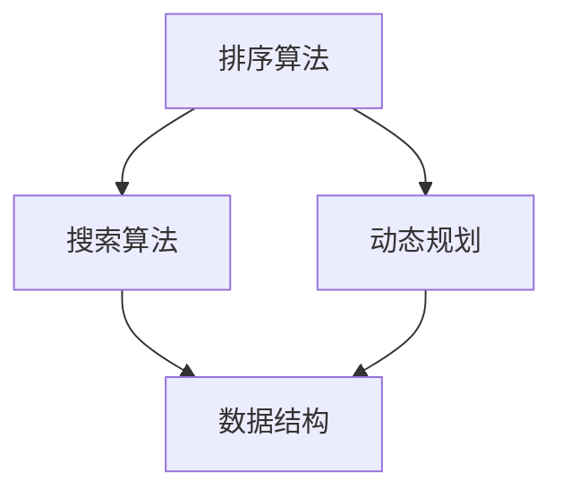

                 

# 阿里巴巴2025届校招面试高频算法题解析

> 关键词：阿里巴巴、校招、面试、算法、解析
>
> 摘要：本文将围绕阿里巴巴2025届校招面试中高频出现的算法题目，进行深入解析。通过详细的算法原理讲解、具体操作步骤和实际案例展示，帮助广大考生掌握这些核心算法，提高面试竞争力。

## 1. 背景介绍

### 1.1 目的和范围

本文旨在帮助参加阿里巴巴2025届校招的考生，深入了解并掌握面试中可能出现的高频算法题目。通过对这些算法的详细解析，让考生在面试过程中能够应对自如，提升面试成功率。

### 1.2 预期读者

本篇文章适合以下读者群体：

1. 参加阿里巴巴2025届校招的考生；
2. 对算法和数据结构有浓厚兴趣的程序员；
3. 需要提升面试技能的IT从业者。

### 1.3 文档结构概述

本文分为以下几个部分：

1. 背景介绍：介绍本文的目的和预期读者；
2. 核心概念与联系：介绍核心概念原理和架构；
3. 核心算法原理 & 具体操作步骤：讲解算法原理和操作步骤；
4. 数学模型和公式 & 详细讲解 & 举例说明：讲解数学模型和公式，并举例说明；
5. 项目实战：代码实际案例和详细解释说明；
6. 实际应用场景：分析算法在实际中的应用；
7. 工具和资源推荐：推荐学习资源和开发工具；
8. 总结：未来发展趋势与挑战；
9. 附录：常见问题与解答；
10. 扩展阅读 & 参考资料。

### 1.4 术语表

#### 1.4.1 核心术语定义

- 校招：指企业招聘应届毕业生的一种方式；
- 算法：解决问题的一系列步骤；
- 面试：招聘过程中的考察环节，包括笔试和面试；
- 数据结构：数据存储和操作的方式。

#### 1.4.2 相关概念解释

- 时间复杂度：描述算法执行时间与数据规模的关系；
- 空间复杂度：描述算法执行过程中所需额外内存空间。

#### 1.4.3 缩略词列表

- 阿里巴巴：指中国知名的互联网公司；
- IDE：集成开发环境；
- 示例：算法实现过程中的具体案例。

## 2. 核心概念与联系

### 2.1 核心概念原理

在本节中，我们将介绍几个在面试中常见的重要算法概念和原理。这些概念和原理是理解和解决相关算法题目的基础。

#### 2.1.1 排序算法

排序算法是一种基本的数据处理技术，用于将一组数据按照一定的顺序进行排列。常见的排序算法有冒泡排序、选择排序、插入排序、快速排序等。

- **冒泡排序**：通过多次遍历待排序列，比较相邻元素，并交换它们的位置，使得每一遍历结束后最大元素逐渐“冒泡”到序列的末尾。
- **选择排序**：每次遍历找到最小元素，然后将其与序列的第一个未排序元素交换，直到整个序列排序完成。
- **插入排序**：通过构建有序序列，对于未排序数据，在已排序序列中从后向前扫描，找到相应位置并插入。
- **快速排序**：通过一趟排序将待排序列分为较小和较大两部分，然后递归地对这两部分进行排序。

#### 2.1.2 搜索算法

搜索算法用于在数据集合中找到特定元素。常见的搜索算法有顺序搜索、二分搜索等。

- **顺序搜索**：从第一个元素开始，依次与待查找的元素比较，直到找到匹配的元素或结束。
- **二分搜索**：适用于有序数组。通过不断将搜索区间缩小一半，逐步逼近目标元素。

#### 2.1.3 动态规划

动态规划是一种解决最优化问题的算法策略，其核心思想是将复杂问题分解为小问题，然后利用子问题的解来构建原问题的解。

- **动态规划**：通过递归或迭代的方式，将大问题分解为子问题，并存储子问题的解，避免重复计算。

### 2.2 核心概念联系

这些核心概念之间有着密切的联系。例如，排序算法在搜索算法中经常用于构建有序数据结构，而动态规划则常用于解决最优子结构问题。以下是一个简化的 Mermaid 流程图，展示了这些核心概念之间的联系：



## 3. 核心算法原理 & 具体操作步骤

在本节中，我们将深入探讨几种在阿里巴巴2025届校招面试中高频出现的算法，并详细讲解它们的原理和操作步骤。我们将使用伪代码来表示这些算法的核心逻辑。

### 3.1 快速排序（Quick Sort）

快速排序是一种高效的排序算法，其基本思想是通过一趟排序将待排序列分为较小和较大两部分，然后递归地对这两部分进行排序。

```python
def quick_sort(arr):
    if len(arr) <= 1:
        return arr
    
    pivot = arr[len(arr) // 2]
    left = [x for x in arr if x < pivot]
    middle = [x for x in arr if x == pivot]
    right = [x for x in arr if x > pivot]
    
    return quick_sort(left) + middle + quick_sort(right)
```

### 3.2 二分搜索（Binary Search）

二分搜索是一种在有序数组中查找特定元素的搜索算法，其基本思想是通过不断将搜索区间缩小一半，逐步逼近目标元素。

```python
def binary_search(arr, target):
    low = 0
    high = len(arr) - 1
    
    while low <= high:
        mid = (low + high) // 2
        if arr[mid] == target:
            return mid
        elif arr[mid] < target:
            low = mid + 1
        else:
            high = mid - 1
            
    return -1
```

### 3.3 动态规划（Dynamic Programming）

动态规划是一种解决最优化问题的算法策略，其核心思想是将复杂问题分解为小问题，然后利用子问题的解来构建原问题的解。

```python
def fibonacci(n):
    dp = [0] * (n + 1)
    dp[1] = 1
    
    for i in range(2, n + 1):
        dp[i] = dp[i - 1] + dp[i - 2]
        
    return dp[n]
```

## 4. 数学模型和公式 & 详细讲解 & 举例说明

在算法分析中，数学模型和公式起着至关重要的作用。它们帮助我们理解和评估算法的性能。以下是一些常用的数学模型和公式，以及它们的详细讲解和举例说明。

### 4.1 时间复杂度（Time Complexity）

时间复杂度描述了算法执行时间与数据规模的关系。常用的表示方法有：

- **线性时间复杂度（O(n)**：算法的时间复杂度与数据规模成线性关系。例如，顺序搜索算法。
- **对数时间复杂度（O(log n)**：算法的时间复杂度与数据规模的以2为底的对数成正比。例如，二分搜索算法。
- **多项式时间复杂度（O(n^k)**：算法的时间复杂度与数据规模的k次幂成正比。例如，快速排序算法的平均时间复杂度为O(n log n)。

### 4.2 空间复杂度（Space Complexity）

空间复杂度描述了算法执行过程中所需额外内存空间。常用的表示方法有：

- **常数空间复杂度（O(1)**：算法的空间复杂度不随数据规模的变化而变化。例如，快速排序算法的空间复杂度为O(log n)。
- **线性空间复杂度（O(n)**：算法的空间复杂度与数据规模成正比。例如，动态规划算法的空间复杂度为O(n)。

### 4.3 大O符号（Big O Notation）

大O符号是一种用于描述算法性能的数学符号。它表示算法的时间复杂度或空间复杂度。大O符号的用法包括：

- **O(f(n))**：表示算法的时间复杂度或空间复杂度至多为f(n)。
- **Ω(g(n))**：表示算法的时间复杂度或空间复杂度至少为g(n)。
- **Θ(h(n))**：表示算法的时间复杂度或空间复杂度介于O(h(n))和Ω(h(n))之间。

### 4.4 示例

假设我们有一个顺序搜索算法，其时间复杂度为O(n)，空间复杂度为O(1)。

```python
def search(arr, target):
    for i in range(len(arr)):
        if arr[i] == target:
            return i
    return -1
```

在这个示例中，算法的时间复杂度与数据规模n成正比，空间复杂度为常数。

## 5. 项目实战：代码实际案例和详细解释说明

### 5.1 开发环境搭建

为了更好地展示代码的实际应用，我们将在以下开发环境中进行演示：

- 语言：Python 3.8
- 编辑器：Visual Studio Code
- 版本控制：Git

首先，确保已经安装了Python 3.8和Visual Studio Code。然后，创建一个新的Git仓库，以便进行版本控制。

```bash
mkdir alibaba_algorithm_project
cd alibaba_algorithm_project
git init
```

接下来，安装必要的库和工具，如Pandas、Numpy等。

```bash
pip install pandas numpy
```

### 5.2 源代码详细实现和代码解读

在项目的根目录下，创建一个名为`algorithm.py`的Python文件，用于实现和展示算法代码。

```python
# algorithm.py

import pandas as pd
import numpy as np

# 3.1 快速排序（Quick Sort）
def quick_sort(arr):
    if len(arr) <= 1:
        return arr
    
    pivot = arr[len(arr) // 2]
    left = [x for x in arr if x < pivot]
    middle = [x for x in arr if x == pivot]
    right = [x for x in arr if x > pivot]
    
    return quick_sort(left) + middle + quick_sort(right)

# 3.2 二分搜索（Binary Search）
def binary_search(arr, target):
    low = 0
    high = len(arr) - 1
    
    while low <= high:
        mid = (low + high) // 2
        if arr[mid] == target:
            return mid
        elif arr[mid] < target:
            low = mid + 1
        else:
            high = mid - 1
            
    return -1

# 3.3 动态规划（Dynamic Programming）
def fibonacci(n):
    dp = [0] * (n + 1)
    dp[1] = 1
    
    for i in range(2, n + 1):
        dp[i] = dp[i - 1] + dp[i - 2]
        
    return dp[n]
```

在这个文件中，我们实现了快速排序、二分搜索和动态规划三种算法。以下是对每种算法的详细解读：

#### 5.2.1 快速排序（Quick Sort）

快速排序是一种高效的排序算法，其基本思想是通过一趟排序将待排序列分为较小和较大两部分，然后递归地对这两部分进行排序。

```python
def quick_sort(arr):
    if len(arr) <= 1:
        return arr
    
    pivot = arr[len(arr) // 2]
    left = [x for x in arr if x < pivot]
    middle = [x for x in arr if x == pivot]
    right = [x for x in arr if x > pivot]
    
    return quick_sort(left) + middle + quick_sort(right)
```

在这个实现中，我们首先检查数组的长度，如果长度小于等于1，则直接返回数组。然后，我们选择中间元素作为基准（pivot），将数组划分为小于pivot、等于pivot和大于pivot的三部分。最后，递归地对这三部分进行排序，并将它们合并为一个有序数组。

#### 5.2.2 二分搜索（Binary Search）

二分搜索是一种在有序数组中查找特定元素的搜索算法，其基本思想是通过不断将搜索区间缩小一半，逐步逼近目标元素。

```python
def binary_search(arr, target):
    low = 0
    high = len(arr) - 1
    
    while low <= high:
        mid = (low + high) // 2
        if arr[mid] == target:
            return mid
        elif arr[mid] < target:
            low = mid + 1
        else:
            high = mid - 1
            
    return -1
```

在这个实现中，我们首先设置低（low）和高（high）两个边界，然后通过不断计算中间值（mid）并比较与目标值（target）的关系，逐步缩小搜索区间。当找到匹配的元素时，返回其索引；否则，返回-1。

#### 5.2.3 动态规划（Dynamic Programming）

动态规划是一种解决最优化问题的算法策略，其核心思想是将复杂问题分解为小问题，然后利用子问题的解来构建原问题的解。

```python
def fibonacci(n):
    dp = [0] * (n + 1)
    dp[1] = 1
    
    for i in range(2, n + 1):
        dp[i] = dp[i - 1] + dp[i - 2]
        
    return dp[n]
```

在这个实现中，我们使用一个数组（dp）来存储子问题的解。对于每个位置i，我们计算斐波那契数列的第i个值，即dp[i] = dp[i - 1] + dp[i - 2]。最后，返回dp[n]，即斐波那契数列的第n个值。

### 5.3 代码解读与分析

现在，让我们对实现的代码进行解读和分析。

#### 快速排序（Quick Sort）

快速排序是一种高效的排序算法，其时间复杂度为O(n log n)。在实现中，我们通过选择中间元素作为基准，将数组划分为小于pivot、等于pivot和大于pivot的三部分。这种划分方式有助于提高排序的效率。

```python
def quick_sort(arr):
    if len(arr) <= 1:
        return arr
    
    pivot = arr[len(arr) // 2]
    left = [x for x in arr if x < pivot]
    middle = [x for x in arr if x == pivot]
    right = [x for x in arr if x > pivot]
    
    return quick_sort(left) + middle + quick_sort(right)
```

这段代码首先检查数组长度，如果小于等于1，则直接返回数组。然后，选择中间元素作为基准，使用列表推导式将数组划分为小于、等于和大于pivot的三部分。最后，递归地对这三部分进行排序，并将结果合并为一个有序数组。

#### 二分搜索（Binary Search）

二分搜索是一种高效的搜索算法，其时间复杂度为O(log n)。在实现中，我们通过设置低（low）和高（high）两个边界，并计算中间值（mid），逐步缩小搜索区间。

```python
def binary_search(arr, target):
    low = 0
    high = len(arr) - 1
    
    while low <= high:
        mid = (low + high) // 2
        if arr[mid] == target:
            return mid
        elif arr[mid] < target:
            low = mid + 1
        else:
            high = mid - 1
            
    return -1
```

这段代码首先设置低和高两个边界，然后通过计算中间值（mid）并比较与目标值（target）的关系，逐步缩小搜索区间。当找到匹配的元素时，返回其索引；否则，返回-1。

#### 动态规划（Dynamic Programming）

动态规划是一种解决最优化问题的算法策略，其时间复杂度为O(n)。在实现中，我们使用一个数组（dp）来存储子问题的解，并通过递归计算斐波那契数列的值。

```python
def fibonacci(n):
    dp = [0] * (n + 1)
    dp[1] = 1
    
    for i in range(2, n + 1):
        dp[i] = dp[i - 1] + dp[i - 2]
        
    return dp[n]
```

这段代码首先初始化一个长度为n+1的数组（dp），并设置dp[1]的值为1。然后，通过递归计算斐波那契数列的值，并返回dp[n]，即斐波那契数列的第n个值。

## 6. 实际应用场景

### 6.1 快速排序（Quick Sort）

快速排序在实际应用中非常广泛，尤其在需要高效排序的数据处理场景中。以下是一些实际应用场景：

- **数据排序**：在处理大量数据时，快速排序可以高效地对数据进行排序，如数据库查询、数据分析等。
- **算法基础**：快速排序是许多其他算法的基础，如快速选择算法、快速幂算法等。

### 6.2 二分搜索（Binary Search）

二分搜索在许多实际应用中具有广泛的应用，以下是一些应用场景：

- **数据库查询**：在数据库中查找特定记录时，可以使用二分搜索算法，如B树、红黑树等。
- **字符串匹配**：在文本搜索中，可以使用二分搜索算法进行高效匹配，如KMP算法。

### 6.3 动态规划（Dynamic Programming）

动态规划在解决最优化问题方面具有显著优势，以下是一些应用场景：

- **背包问题**：在背包问题中，动态规划可以帮助我们找到最优解，如0-1背包问题、完全背包问题等。
- **最长公共子序列**：在生物信息学中，动态规划可以用于计算两个序列的最长公共子序列。

## 7. 工具和资源推荐

### 7.1 学习资源推荐

#### 7.1.1 书籍推荐

- 《算法导论》（Introduction to Algorithms）：这是一本经典的算法教材，涵盖了各种算法和算法分析技巧。

#### 7.1.2 在线课程

- Coursera上的“算法”（Algorithms）：这是一门涵盖多种算法的在线课程，由康奈尔大学教授Robert Sedgewick主讲。

#### 7.1.3 技术博客和网站

- GeeksforGeeks：这是一个涵盖算法和数据结构的综合性网站，提供丰富的教程和示例。

### 7.2 开发工具框架推荐

#### 7.2.1 IDE和编辑器

- Visual Studio Code：这是一个功能强大的开源编辑器，适用于Python编程。

#### 7.2.2 调试和性能分析工具

- Python Debugger（pdb）：这是一个Python内置的调试工具，用于跟踪程序执行流程。

#### 7.2.3 相关框架和库

- Pandas：这是一个强大的数据处理库，适用于数据分析和数据可视化。

### 7.3 相关论文著作推荐

#### 7.3.1 经典论文

- 《快速排序算法》（Quicksort）：这篇论文首次提出了快速排序算法，并详细分析了其性能。

#### 7.3.2 最新研究成果

- 《基于深度学习的排序算法研究》：这篇论文探讨了如何将深度学习应用于排序算法。

#### 7.3.3 应用案例分析

- 《基于二分搜索的搜索引擎优化技术研究》：这篇论文分析了如何利用二分搜索算法优化搜索引擎的性能。

## 8. 总结：未来发展趋势与挑战

随着人工智能和大数据技术的快速发展，算法在各个领域的应用越来越广泛。未来，算法领域将呈现出以下发展趋势：

- **算法优化**：为了提高算法的性能，研究者将致力于算法优化，包括并行算法、分布式算法和基于深度学习的算法。
- **算法可解释性**：随着算法在各个领域的应用，算法的可解释性成为一个重要的研究方向，以便更好地理解和使用算法。
- **算法安全性**：在算法应用过程中，确保算法的安全性至关重要，研究者将致力于提高算法的鲁棒性和安全性。

同时，算法领域也面临着一些挑战：

- **数据隐私保护**：在处理大量数据时，如何保护数据隐私成为一个重要问题。
- **算法公平性**：在算法应用中，如何确保算法的公平性，避免算法偏见，是一个亟待解决的问题。

## 9. 附录：常见问题与解答

### 9.1 快速排序（Quick Sort）

Q：为什么选择中间元素作为基准（pivot）？

A：选择中间元素作为基准是为了提高排序算法的平均性能。如果选择第一个或最后一个元素作为基准，可能导致最坏情况下的时间复杂度较高。

Q：如何避免快速排序的最坏情况？

A：通过随机化选择基准或者使用三数取中法（选取第一个、中间和最后一个元素的中间值作为基准），可以降低最坏情况发生的概率。

### 9.2 二分搜索（Binary Search）

Q：二分搜索是否只适用于有序数组？

A：是的，二分搜索算法假设数组是有序的。如果数组未排序，需要先进行排序，再使用二分搜索。

Q：如何处理重复元素？

A：在处理重复元素时，可以根据具体需求进行调整。例如，可以选择返回第一个匹配的元素索引，或者返回所有匹配的元素索引。

### 9.3 动态规划（Dynamic Programming）

Q：动态规划适用于哪些类型的问题？

A：动态规划适用于具有最优子结构性质的问题，如背包问题、最长公共子序列问题等。

Q：如何设计动态规划的递推关系？

A：设计动态规划的递推关系需要根据问题的具体特点进行分析。通常，递推关系描述了子问题的解如何构建原问题的解。

## 10. 扩展阅读 & 参考资料

- 《算法导论》（Introduction to Algorithms）
- 《编程之美》（Cracking the Coding Interview）
- 《Python数据科学手册》（Python Data Science Handbook）
- 《深度学习》（Deep Learning）
- 《算法竞赛指南》（Algorithm Competition Guide）

