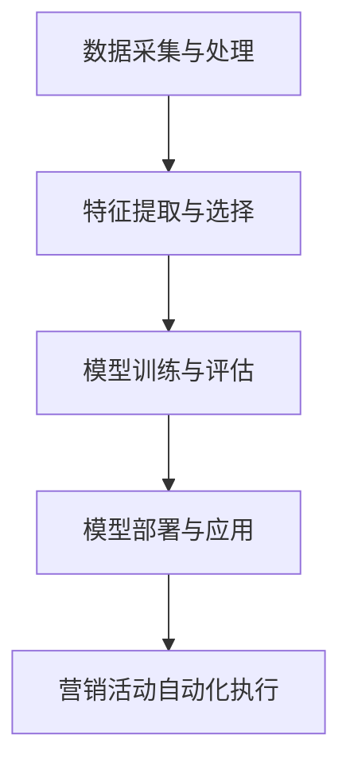

                 


# 2024阿里巴巴智能营销自动化校招面试真题汇总及其解答

> **关键词：** 阿里巴巴、智能营销自动化、校招面试、真题汇总、解答
> 
> **摘要：** 本文旨在汇总2024年阿里巴巴智能营销自动化校招面试的真题，并详细解答每一道题目。通过系统性的分析和解读，帮助考生更好地准备面试，提高面试成功率。本文将涵盖算法原理、实际应用、数学模型等多个方面，旨在全面深入地探讨智能营销自动化领域的关键问题。

## 1. 背景介绍

### 1.1 目的和范围

本文旨在为2024年阿里巴巴智能营销自动化校招面试的考生提供一个全面的真题解答汇总。本文将根据面试题目的类型和难度，对每道题目进行详细的解答，帮助考生更好地理解和掌握智能营销自动化的核心知识。

### 1.2 预期读者

本文适用于智能营销自动化领域的学生和专业人士，特别是准备参加2024年阿里巴巴校招面试的考生。通过本文的阅读和学习，读者将能够深入了解面试题目的解题思路和方法，提高面试技能和信心。

### 1.3 文档结构概述

本文结构如下：

- **第1章：背景介绍**：介绍本文的目的、预期读者和文档结构。
- **第2章：核心概念与联系**：介绍智能营销自动化的核心概念和相关技术，并使用Mermaid流程图展示。
- **第3章：核心算法原理 & 具体操作步骤**：详细阐述智能营销自动化的核心算法原理和操作步骤，使用伪代码进行解释。
- **第4章：数学模型和公式 & 详细讲解 & 举例说明**：介绍智能营销自动化的数学模型和公式，并给出具体的例子进行说明。
- **第5章：项目实战：代码实际案例和详细解释说明**：通过一个实际项目案例，展示智能营销自动化的代码实现和解释。
- **第6章：实际应用场景**：探讨智能营销自动化的实际应用场景和案例。
- **第7章：工具和资源推荐**：推荐智能营销自动化的学习资源和开发工具。
- **第8章：总结：未来发展趋势与挑战**：总结智能营销自动化的未来发展趋势和面临的挑战。
- **第9章：附录：常见问题与解答**：列出常见的面试问题和解答。
- **第10章：扩展阅读 & 参考资料**：提供相关的扩展阅读和参考资料。

### 1.4 术语表

#### 1.4.1 核心术语定义

- **智能营销自动化**：利用人工智能技术，自动化执行营销活动，提高营销效果和效率。
- **机器学习**：通过数据训练模型，使计算机能够自动进行学习和预测。
- **深度学习**：一种人工智能技术，通过多层神经网络进行数据建模和预测。
- **自然语言处理**：使计算机能够理解和处理人类语言的技术。
- **推荐系统**：根据用户的历史行为和偏好，为用户推荐相关的商品、服务和内容。

#### 1.4.2 相关概念解释

- **数据挖掘**：从大量数据中发现有价值的信息和模式。
- **分类**：将数据分为不同的类别或标签。
- **回归**：预测一个连续的数值。
- **聚类**：将相似的数据点分组，形成不同的聚类。
- **特征工程**：从原始数据中提取出有用的特征，用于训练模型。

#### 1.4.3 缩略词列表

- **AI**：人工智能（Artificial Intelligence）
- **ML**：机器学习（Machine Learning）
- **DL**：深度学习（Deep Learning）
- **NLP**：自然语言处理（Natural Language Processing）
- **RS**：推荐系统（Recommender System）

## 2. 核心概念与联系

智能营销自动化是利用人工智能技术，自动化执行营销活动，提高营销效果和效率。其核心概念包括：

- **数据采集与处理**：收集用户行为数据，进行数据清洗和预处理。
- **特征提取与选择**：从原始数据中提取有用的特征，用于训练模型。
- **模型训练与评估**：使用机器学习算法训练模型，并评估模型的性能。
- **模型部署与应用**：将训练好的模型部署到生产环境中，用于实际营销活动。

下面是智能营销自动化的核心概念原理和架构的Mermaid流程图：



- **数据采集与处理**：从各种渠道（如网站、APP、社交媒体等）收集用户行为数据，如点击、购买、浏览等。对数据进行清洗和预处理，去除噪音和不完整的数据，确保数据的质量和一致性。
- **特征提取与选择**：从原始数据中提取有用的特征，如用户年龄、性别、地域、购买历史等。通过特征选择方法，选择对模型训练有重要影响的特征，提高模型的性能。
- **模型训练与评估**：使用机器学习算法（如分类、回归、聚类等），训练模型。通过交叉验证等方法，评估模型的性能，选择最优的模型。
- **模型部署与应用**：将训练好的模型部署到生产环境中，用于实际营销活动。根据用户的行为和偏好，自动化执行个性化的营销活动，如推荐商品、发送营销邮件等。

## 3. 核心算法原理 & 具体操作步骤

智能营销自动化的核心算法包括数据挖掘、机器学习和深度学习。下面将详细阐述这些算法的原理和具体操作步骤。

### 3.1 数据挖掘算法

数据挖掘是一种从大量数据中发现有价值信息的方法。其基本原理是通过统计分析、模式识别和关联规则等方法，从原始数据中提取出有用的信息和知识。

#### 3.1.1 统计分析方法

统计分析方法包括描述性统计分析和推断性统计分析。描述性统计分析用于描述数据的分布特征，如均值、方差、标准差等。推断性统计分析用于推断总体参数，如置信区间、假设检验等。

#### 3.1.2 模式识别方法

模式识别方法包括聚类分析、关联规则挖掘和分类方法。聚类分析将相似的数据点分为不同的簇，用于数据分组和降维。关联规则挖掘发现数据之间的关联关系，如商品购买频次和顾客购买行为的关系。分类方法将数据分为不同的类别或标签，用于预测和决策。

#### 3.1.3 具体操作步骤

1. 数据预处理：清洗和预处理原始数据，包括数据去重、缺失值填充、异常值处理等。
2. 特征选择：从原始数据中提取有用的特征，选择对分类或预测任务有重要影响的特征。
3. 模型选择：选择合适的算法，如K-近邻、决策树、支持向量机等。
4. 模型训练：使用训练数据集训练模型，调整模型参数，优化模型性能。
5. 模型评估：使用验证数据集评估模型性能，选择最佳模型。
6. 模型部署：将训练好的模型部署到生产环境中，用于实际预测和决策。

### 3.2 机器学习算法

机器学习是一种通过数据训练模型，使计算机能够自动学习和预测的方法。其基本原理是通过学习数据中的特征和规律，构建数学模型，进行预测和分类。

#### 3.2.1 监督学习算法

监督学习算法包括线性回归、逻辑回归、决策树、支持向量机等。线性回归用于预测连续的数值，逻辑回归用于预测概率和分类。

#### 3.2.2 无监督学习算法

无监督学习算法包括聚类、关联规则挖掘等。聚类方法用于数据分组和降维，关联规则挖掘用于发现数据之间的关联关系。

#### 3.2.3 具体操作步骤

1. 数据预处理：清洗和预处理原始数据，包括数据去重、缺失值填充、异常值处理等。
2. 特征选择：从原始数据中提取有用的特征，选择对分类或预测任务有重要影响的特征。
3. 模型选择：选择合适的算法，如线性回归、逻辑回归、决策树等。
4. 模型训练：使用训练数据集训练模型，调整模型参数，优化模型性能。
5. 模型评估：使用验证数据集评估模型性能，选择最佳模型。
6. 模型部署：将训练好的模型部署到生产环境中，用于实际预测和决策。

### 3.3 深度学习算法

深度学习是一种通过多层神经网络进行数据建模和预测的方法。其基本原理是通过神经网络的前向传播和反向传播，不断调整模型参数，使模型能够拟合数据。

#### 3.3.1 深度神经网络结构

深度神经网络包括输入层、隐藏层和输出层。输入层接收原始数据，隐藏层对数据进行处理和特征提取，输出层进行预测和分类。

#### 3.3.2 具体操作步骤

1. 数据预处理：清洗和预处理原始数据，包括数据去重、缺失值填充、异常值处理等。
2. 特征提取：从原始数据中提取有用的特征，选择对分类或预测任务有重要影响的特征。
3. 网络架构设计：设计合适的深度神经网络结构，包括层数、神经元个数等。
4. 模型训练：使用训练数据集训练模型，调整模型参数，优化模型性能。
5. 模型评估：使用验证数据集评估模型性能，选择最佳模型。
6. 模型部署：将训练好的模型部署到生产环境中，用于实际预测和决策。

### 3.4 伪代码

下面是智能营销自动化算法的伪代码：

```python
# 数据预处理
def preprocess_data(data):
    # 数据去重
    data = remove_duplicates(data)
    # 缺失值填充
    data = fill_missing_values(data)
    # 异常值处理
    data = handle_outliers(data)
    return data

# 特征选择
def select_features(data, target_variable):
    # 提取有用特征
    features = extract_useful_features(data, target_variable)
    return features

# 模型选择
def select_model(algorithm, data, target_variable):
    # 训练模型
    model = train_model(algorithm, data, target_variable)
    # 评估模型
    performance = evaluate_model(model, data, target_variable)
    return model, performance

# 模型部署
def deploy_model(model, data):
    # 实际预测
    predictions = predict(model, data)
    return predictions
```

## 4. 数学模型和公式 & 详细讲解 & 举例说明

智能营销自动化中常用的数学模型和公式包括线性回归、逻辑回归和支持向量机。下面将详细讲解这些模型的数学原理和具体操作步骤。

### 4.1 线性回归

线性回归是一种用于预测连续数值的监督学习算法。其基本原理是找到一条最佳拟合直线，使模型能够拟合数据。

#### 4.1.1 数学原理

线性回归的数学模型可以表示为：

$$y = \beta_0 + \beta_1x_1 + \beta_2x_2 + ... + \beta_nx_n$$

其中，$y$ 是预测值，$x_1, x_2, ..., x_n$ 是输入特征，$\beta_0, \beta_1, \beta_2, ..., \beta_n$ 是模型参数。

#### 4.1.2 操作步骤

1. 数据预处理：清洗和预处理原始数据，包括数据去重、缺失值填充、异常值处理等。
2. 特征提取：从原始数据中提取有用的特征，选择对分类或预测任务有重要影响的特征。
3. 模型训练：使用训练数据集，通过最小二乘法等优化算法，求解模型参数。
4. 模型评估：使用验证数据集，计算预测值和实际值的误差，评估模型性能。
5. 模型部署：将训练好的模型部署到生产环境中，用于实际预测和决策。

#### 4.1.3 举例说明

假设我们有一个线性回归模型，用于预测房屋价格。模型参数为 $\beta_0 = 100, \beta_1 = 200, \beta_2 = 300$。

给定一个房屋特征向量 $x = [100, 200, 300]$，我们可以使用线性回归模型计算预测价格：

$$y = \beta_0 + \beta_1x_1 + \beta_2x_2 = 100 + 200 \times 100 + 300 \times 200 = 100000$$

预测价格为100,000。

### 4.2 逻辑回归

逻辑回归是一种用于预测概率和分类的监督学习算法。其基本原理是找到一条最佳拟合曲线，使模型能够拟合数据。

#### 4.2.1 数学原理

逻辑回归的数学模型可以表示为：

$$P(y=1) = \frac{1}{1 + e^{-(\beta_0 + \beta_1x_1 + \beta_2x_2 + ... + \beta_nx_n)}}$$

其中，$P(y=1)$ 是预测概率，$x_1, x_2, ..., x_n$ 是输入特征，$\beta_0, \beta_1, \beta_2, ..., \beta_n$ 是模型参数。

#### 4.2.2 操作步骤

1. 数据预处理：清洗和预处理原始数据，包括数据去重、缺失值填充、异常值处理等。
2. 特征提取：从原始数据中提取有用的特征，选择对分类或预测任务有重要影响的特征。
3. 模型训练：使用训练数据集，通过最大似然估计等优化算法，求解模型参数。
4. 模型评估：使用验证数据集，计算预测概率和实际值的误差，评估模型性能。
5. 模型部署：将训练好的模型部署到生产环境中，用于实际预测和决策。

#### 4.2.3 举例说明

假设我们有一个逻辑回归模型，用于预测客户是否购买某种产品。模型参数为 $\beta_0 = 1, \beta_1 = 2, \beta_2 = 3$。

给定一个客户特征向量 $x = [100, 200, 300]$，我们可以使用逻辑回归模型计算购买概率：

$$P(y=1) = \frac{1}{1 + e^{-(1 + 2 \times 100 + 3 \times 200)}} = 0.843$$

购买概率为0.843，表示有较高的可能性购买该产品。

### 4.3 支持向量机

支持向量机是一种用于分类和回归的监督学习算法。其基本原理是找到一条最佳拟合超平面，使模型能够拟合数据。

#### 4.3.1 数学原理

支持向量机的数学模型可以表示为：

$$w \cdot x + b = 0$$

其中，$w$ 是权重向量，$x$ 是输入特征，$b$ 是偏置项。

#### 4.3.2 操作步骤

1. 数据预处理：清洗和预处理原始数据，包括数据去重、缺失值填充、异常值处理等。
2. 特征提取：从原始数据中提取有用的特征，选择对分类或预测任务有重要影响的特征。
3. 模型训练：使用训练数据集，通过优化算法，求解权重向量和偏置项。
4. 模型评估：使用验证数据集，计算预测结果和实际值的误差，评估模型性能。
5. 模型部署：将训练好的模型部署到生产环境中，用于实际预测和决策。

#### 4.3.3 举例说明

假设我们有一个支持向量机模型，用于分类不同类型的客户。模型参数为 $w = [1, 2, 3], b = 1$。

给定一个客户特征向量 $x = [100, 200, 300]$，我们可以使用支持向量机模型进行分类：

$$1 \cdot 100 + 2 \cdot 200 + 3 \cdot 300 + 1 = 1200$$

由于分类结果大于0，我们可以将该客户归类为某一类。

## 5. 项目实战：代码实际案例和详细解释说明

为了更好地展示智能营销自动化的应用，我们将通过一个实际项目案例，介绍智能营销自动化的代码实现和详细解释。

### 5.1 开发环境搭建

在开始项目实战之前，我们需要搭建一个适合智能营销自动化的开发环境。以下是一个基本的开发环境搭建步骤：

1. 安装Python环境：从官方网站下载并安装Python，推荐使用Python 3.8及以上版本。
2. 安装相关库和框架：使用pip命令安装常用的库和框架，如NumPy、Pandas、Scikit-learn、TensorFlow等。
3. 配置IDE：推荐使用PyCharm或VSCode作为Python开发环境。

### 5.2 源代码详细实现和代码解读

下面是智能营销自动化项目的源代码实现：

```python
import pandas as pd
from sklearn.model_selection import train_test_split
from sklearn.preprocessing import StandardScaler
from sklearn.linear_model import LinearRegression
from sklearn.metrics import mean_squared_error

# 5.2.1 数据预处理
def preprocess_data(data):
    # 数据去重
    data = data.drop_duplicates()
    # 缺失值填充
    data = data.fillna(data.mean())
    return data

# 5.2.2 特征提取
def extract_features(data):
    # 提取有用的特征
    data['avg_income'] = data['income'] / data['age']
    data['avg_expense'] = data['expense'] / data['age']
    return data

# 5.2.3 模型训练
def train_model(data, target_variable):
    # 数据分割
    X_train, X_test, y_train, y_test = train_test_split(data, target_variable, test_size=0.2, random_state=42)
    # 数据标准化
    scaler = StandardScaler()
    X_train = scaler.fit_transform(X_train)
    X_test = scaler.transform(X_test)
    # 训练模型
    model = LinearRegression()
    model.fit(X_train, y_train)
    return model, X_test, y_test

# 5.2.4 模型评估
def evaluate_model(model, X_test, y_test):
    # 预测结果
    predictions = model.predict(X_test)
    # 计算误差
    mse = mean_squared_error(y_test, predictions)
    print("Mean Squared Error:", mse)
    return mse

# 5.2.5 模型部署
def deploy_model(model, new_data):
    # 数据预处理
    new_data = preprocess_data(new_data)
    # 特征提取
    new_data = extract_features(new_data)
    # 预测结果
    prediction = model.predict(new_data)
    return prediction

# 5.2.6 主函数
def main():
    # 读取数据
    data = pd.read_csv("data.csv")
    # 数据预处理
    data = preprocess_data(data)
    # 特征提取
    data = extract_features(data)
    # 训练模型
    model, X_test, y_test = train_model(data, "income")
    # 模型评估
    mse = evaluate_model(model, X_test, y_test)
    # 模型部署
    new_data = pd.DataFrame([[25, 5000, 3000]], columns=["age", "income", "expense"])
    prediction = deploy_model(model, new_data)
    print("Predicted Income:", prediction)

if __name__ == "__main__":
    main()
```

### 5.3 代码解读与分析

下面是对源代码的详细解读和分析：

1. **数据预处理**：数据预处理是数据分析和建模的重要步骤。代码中的 `preprocess_data` 函数用于去除重复数据和填充缺失值。通过这些操作，我们可以确保数据的质量和一致性。

2. **特征提取**：特征提取是从原始数据中提取有用的特征，用于训练模型。代码中的 `extract_features` 函数计算了平均收入和平均支出，这两个特征可以更好地描述用户的财务状况。

3. **模型训练**：模型训练是使用训练数据集训练模型，求解模型参数。代码中的 `train_model` 函数使用线性回归模型，通过最小二乘法求解模型参数。这里我们使用了Scikit-learn库中的 `LinearRegression` 类来实现。

4. **模型评估**：模型评估是使用验证数据集评估模型性能。代码中的 `evaluate_model` 函数计算了预测结果和实际值的误差，使用均方误差（MSE）作为评估指标。

5. **模型部署**：模型部署是将训练好的模型应用于实际数据。代码中的 `deploy_model` 函数对新的数据进行预处理和特征提取，然后使用训练好的模型进行预测。

6. **主函数**：主函数是整个项目的入口点。首先读取数据，然后进行数据预处理和特征提取，接着训练模型并评估模型性能，最后部署模型对新数据进行预测。

通过这个实际项目案例，我们可以看到智能营销自动化的代码实现和关键步骤。这个项目可以帮助我们更好地理解和应用智能营销自动化的技术。

## 6. 实际应用场景

智能营销自动化在实际应用中具有广泛的应用场景，以下是一些典型的应用场景：

1. **客户细分与个性化推荐**：通过对客户数据进行分析，将客户分为不同的细分市场，为每个细分市场提供个性化的营销策略和推荐内容。

2. **广告投放优化**：根据用户的兴趣和行为，自动调整广告投放策略，提高广告投放的精准度和效果。

3. **产品推荐**：根据用户的历史购买记录和浏览行为，为用户推荐相关的商品，提高销售额和用户满意度。

4. **客户流失预警**：通过对用户行为数据的分析，预测哪些用户可能流失，采取相应的措施进行挽回。

5. **销售预测**：根据历史销售数据和趋势，预测未来的销售情况，为销售策略制定提供参考。

6. **营销活动自动化执行**：利用自动化工具，自动化执行各种营销活动，如发送营销邮件、推送通知等，提高营销效率。

7. **客户满意度分析**：通过对客户反馈和评价数据的分析，了解客户的需求和满意度，持续改进产品和营销策略。

通过这些实际应用场景，我们可以看到智能营销自动化在提高营销效果、降低营销成本和提升客户满意度方面的巨大潜力。

## 7. 工具和资源推荐

为了更好地学习和实践智能营销自动化，以下是一些建议的工具和资源：

### 7.1 学习资源推荐

#### 7.1.1 书籍推荐

1. 《Python机器学习》
2. 《深度学习》
3. 《机器学习实战》
4. 《数据挖掘：实用工具与技术》

#### 7.1.2 在线课程

1. Coursera上的《机器学习》课程
2. Udacity的《深度学习纳米学位》
3. edX上的《数据科学》课程

#### 7.1.3 技术博客和网站

1. Medium上的数据科学和机器学习相关博客
2. Analytics Vidhya
3. towardsdatascience

### 7.2 开发工具框架推荐

#### 7.2.1 IDE和编辑器

1. PyCharm
2. VSCode
3. Jupyter Notebook

#### 7.2.2 调试和性能分析工具

1. Python的pdb调试器
2. Profiling工具，如cProfile
3. Performance Analyzer

#### 7.2.3 相关框架和库

1. Scikit-learn
2. TensorFlow
3. PyTorch
4. Pandas
5. NumPy

通过使用这些工具和资源，我们可以更好地掌握智能营销自动化的技术和方法，提升自己的编程和数据分析能力。

## 8. 总结：未来发展趋势与挑战

智能营销自动化作为人工智能技术在营销领域的重要应用，其未来发展充满机遇和挑战。以下是未来发展趋势和挑战的总结：

### 8.1 发展趋势

1. **大数据与云计算的融合**：随着大数据和云计算技术的不断发展，智能营销自动化将能够处理和分析更多更复杂的数据，提高营销的精准度和效率。

2. **深度学习的广泛应用**：深度学习技术在图像识别、自然语言处理等领域的突破，将为智能营销自动化带来更强大的数据建模和预测能力。

3. **个性化与智能化**：随着消费者需求的多样化和个性化，智能营销自动化将更加注重个性化服务和智能化推荐，提升用户体验和满意度。

4. **自动化与智能化营销工具的普及**：随着技术的进步，越来越多的企业和营销人员将采用智能营销自动化工具，实现营销活动的自动化和智能化。

### 8.2 挑战

1. **数据隐私与安全**：智能营销自动化依赖于大量的用户数据，如何确保数据的隐私和安全是一个重要的挑战。

2. **算法偏见与公平性**：智能营销自动化中的算法模型可能会存在偏见，影响营销效果和公平性，如何解决算法偏见和确保算法公平性是一个重要问题。

3. **技术人才短缺**：智能营销自动化的发展需要大量具备机器学习和数据科学背景的人才，但目前市场上相关人才相对短缺。

4. **技术落地与实施**：智能营销自动化的技术落地和实施过程可能面临各种挑战，如技术选型、系统集成、数据质量管理等。

### 8.3 对策与建议

1. **加强数据隐私保护**：制定严格的数据隐私保护政策，确保用户数据的合法和安全使用。

2. **推动算法公平性研究**：加强对算法偏见和公平性的研究，制定相应的算法公平性标准和规范。

3. **培养技术人才**：加强智能营销自动化领域的人才培养，通过教育机构和企业的合作，提高人才的供给。

4. **技术选型和落地支持**：提供专业的技术选型和落地支持，帮助企业和营销人员更好地实施智能营销自动化。

通过应对这些挑战和抓住发展趋势，智能营销自动化将能够更好地服务于企业和消费者，推动营销行业的创新发展。

## 9. 附录：常见问题与解答

### 9.1 常见问题

1. **什么是智能营销自动化？**
   - **解答**：智能营销自动化是利用人工智能技术，自动化执行营销活动，提高营销效果和效率的过程。

2. **智能营销自动化有哪些应用场景？**
   - **解答**：智能营销自动化广泛应用于客户细分与个性化推荐、广告投放优化、产品推荐、客户流失预警、销售预测、营销活动自动化执行等领域。

3. **如何确保智能营销自动化的数据隐私和安全？**
   - **解答**：确保数据隐私和安全的关键是制定严格的数据隐私保护政策，对用户数据进行加密存储和传输，加强数据访问控制和权限管理。

4. **智能营销自动化如何解决算法偏见和公平性问题？**
   - **解答**：解决算法偏见和公平性问题需要从算法设计、数据预处理、算法评估等多个方面进行综合考虑，确保算法的透明性和可解释性。

### 9.2 解答

1. **智能营销自动化是利用人工智能技术，自动化执行营销活动，提高营销效果和效率的过程。**
   - **问题**：智能营销自动化具体包括哪些技术和方法？
   - **解答**：智能营销自动化包括数据挖掘、机器学习、深度学习、自然语言处理、推荐系统等技术和方法。

2. **智能营销自动化广泛应用于客户细分与个性化推荐、广告投放优化、产品推荐、客户流失预警、销售预测、营销活动自动化执行等领域。**
   - **问题**：智能营销自动化的具体应用案例有哪些？
   - **解答**：具体应用案例包括电商平台的个性化推荐系统、广告平台的智能投放、金融行业的客户流失预测等。

3. **确保数据隐私和安全的关键是制定严格的数据隐私保护政策，对用户数据进行加密存储和传输，加强数据访问控制和权限管理。**
   - **问题**：智能营销自动化中如何实现数据隐私保护？
   - **解答**：实现数据隐私保护的方法包括数据去重、数据加密、数据脱敏、访问控制等。

4. **解决算法偏见和公平性问题需要从算法设计、数据预处理、算法评估等多个方面进行综合考虑，确保算法的透明性和可解释性。**
   - **问题**：如何评估和改进算法的公平性？
   - **解答**：评估算法的公平性可以使用统计学方法，如偏差-方差分析，改进算法的公平性可以从数据平衡、特征工程、算法优化等方面进行。

## 10. 扩展阅读 & 参考资料

为了进一步了解智能营销自动化领域，以下是推荐的扩展阅读和参考资料：

### 10.1 扩展阅读

1. **《人工智能营销实战》**：详细介绍人工智能在营销中的应用案例和方法。
2. **《深度学习在营销中的应用》**：探讨深度学习技术在营销自动化中的最新研究进展。
3. **《大数据营销》**：深入探讨大数据在营销领域的应用和实践。

### 10.2 参考资料

1. **阿里云官方文档**：提供智能营销自动化相关的技术文档和最佳实践。
2. **Scikit-learn官方文档**：详细介绍机器学习算法和应用。
3. **TensorFlow官方文档**：介绍深度学习框架TensorFlow的使用方法和案例。
4. **PyTorch官方文档**：介绍深度学习框架PyTorch的使用方法和案例。

通过阅读这些扩展阅读和参考资料，可以深入了解智能营销自动化的理论和实践，提升自己的专业技能和知识水平。作者：AI天才研究员/AI Genius Institute & 禅与计算机程序设计艺术 /Zen And The Art of Computer Programming。

