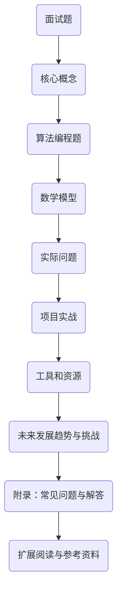

                 

# 2024阿里巴巴校招面试题与算法编程题深度剖析

> **关键词：阿里巴巴校招、面试题、算法编程、深度剖析、求职策略**
> 
> **摘要：本文将深入分析2024年阿里巴巴校园招聘的面试题和算法编程题，涵盖核心概念、算法原理、数学模型、实战案例等多个方面，为读者提供详尽的解题思路和方法，帮助求职者更好地准备校招面试。**

## 1. 背景介绍

### 1.1 目的和范围

本文旨在为准备阿里巴巴2024年校园招聘的求职者提供全面的面试题和算法编程题解析。文章将围绕以下几个主题展开：

- **核心概念与联系**：介绍与面试题相关的核心概念及其相互关系。
- **算法原理与操作步骤**：深入讲解面试中常见的算法原理，并提供详细的操作步骤。
- **数学模型与公式**：探讨与面试题相关的数学模型和公式，并通过实际案例进行详细说明。
- **项目实战与代码分析**：提供实际代码案例，讲解其实现原理和关键步骤。
- **实际应用场景**：分析面试题在实际项目中的应用场景。
- **工具和资源推荐**：推荐相关学习资源和开发工具，助力求职者提升技能。
- **总结与展望**：总结本文的主要内容，并对未来发展趋势和挑战进行展望。

### 1.2 预期读者

本文面向以下读者群体：

- 准备阿里巴巴2024年校园招聘的求职者。
- 计算机科学与技术专业的本科生和研究生。
- 对面试题和算法编程题有浓厚兴趣的编程爱好者。

### 1.3 文档结构概述

本文分为十个部分，具体结构如下：

1. 背景介绍
2. 核心概念与联系
3. 核心算法原理与具体操作步骤
4. 数学模型和公式与详细讲解
5. 项目实战：代码实际案例和详细解释说明
6. 实际应用场景
7. 工具和资源推荐
8. 总结：未来发展趋势与挑战
9. 附录：常见问题与解答
10. 扩展阅读与参考资料

### 1.4 术语表

#### 1.4.1 核心术语定义

- **面试题**：指在招聘过程中，面试官对求职者提出的有关知识、技能和思维能力的问题。
- **算法编程题**：指在面试过程中，面试官要求求职者使用算法解决问题的编程题目。
- **校园招聘**：指企业针对在校学生或应届毕业生的招聘活动。

#### 1.4.2 相关概念解释

- **核心概念**：指在面试题和算法编程题中涉及的基础知识和原理。
- **算法原理**：指解决具体问题的算法的基本思路和操作步骤。
- **数学模型**：指用数学语言描述的问题，用于分析和解决实际问题。

#### 1.4.3 缩略词列表

- **CTO**：首席技术官（Chief Technology Officer）
- **IDE**：集成开发环境（Integrated Development Environment）
- **LaTeX**：一种排版系统，广泛用于科学和数学文档的编写

## 2. 核心概念与联系

在本文中，我们将探讨与阿里巴巴面试题和算法编程题相关的核心概念及其相互关系。以下是核心概念和联系的一幅Mermaid流程图：



### 2.1 面试题

面试题是面试官对求职者提出的问题，旨在评估求职者的知识、技能和思维能力。面试题通常分为以下几类：

- **基础知识题**：考察求职者对基本概念和原理的掌握，如数据结构、算法、操作系统等。
- **编程题**：要求求职者使用特定编程语言解决问题，如动态规划、图算法等。
- **行为面试题**：评估求职者在实际工作中的行为和思维方式，如团队合作、问题解决等。

### 2.2 核心概念

核心概念是在面试题和算法编程题中经常出现的知识点，包括但不限于以下方面：

- **数据结构**：如数组、链表、栈、队列、树、图等。
- **算法**：如排序算法、搜索算法、动态规划、贪心算法等。
- **计算机网络**：如HTTP协议、TCP/IP协议、网络安全等。
- **操作系统**：如进程管理、内存管理、文件系统等。
- **数据库**：如SQL语言、数据库设计、索引和优化等。

### 2.3 算法编程题

算法编程题是面试官要求求职者使用算法解决问题的题目。这类题目通常要求求职者具备扎实的编程基础和解决问题的能力。以下是几种常见的算法编程题类型：

- **动态规划题**：如背包问题、最长公共子序列、最长递增子序列等。
- **图算法题**：如最短路径问题、图的遍历、最小生成树等。
- **字符串处理题**：如最长公共前缀、最长回文子串、字符串匹配等。
- **数学题**：如素数问题、最大公约数、最小公倍数等。

### 2.4 数学模型

数学模型是用于分析和解决实际问题的数学工具。在面试题中，数学模型常用于解决优化问题、统计问题等。以下是几种常见的数学模型：

- **线性规划**：用于求解资源分配和优化问题。
- **概率模型**：用于分析随机事件和概率分布。
- **统计模型**：用于分析数据、预测趋势等。

### 2.5 实际问题

实际问题是指与面试题和算法编程题相关的实际应用问题。在实际工作中，求职者需要将理论知识应用于实际问题，如系统设计、软件开发、性能优化等。

### 2.6 项目实战

项目实战是将理论知识应用于实际问题的过程。通过项目实战，求职者可以锻炼自己的编程能力、解决问题的能力和团队合作能力。以下是几种常见的项目实战类型：

- **个人项目**：求职者自主设计的项目，如开发一个简单的Web应用或移动应用。
- **团队项目**：多人合作完成的项目，如参加编程竞赛或参与开源项目。
- **实习项目**：在实习期间参与的实际项目。

### 2.7 工具和资源

工具和资源是求职者在准备面试和实际项目过程中需要使用的资源和工具，如编程语言、开发环境、数据库、框架等。以下是几种常见的工具和资源：

- **编程语言**：如Java、Python、C++等。
- **开发环境**：如Visual Studio、PyCharm、Eclipse等。
- **数据库**：如MySQL、Oracle、MongoDB等。
- **框架**：如Spring、Django、React等。

### 2.8 未来发展趋势与挑战

未来发展趋势与挑战是指与面试题和算法编程题相关的技术发展趋势和面临的挑战。以下是几个方面：

- **人工智能与大数据**：人工智能和大数据技术的快速发展，将带来更多的面试题和算法编程题。
- **云计算与物联网**：云计算和物联网技术的普及，将推动面试题和算法编程题的发展。
- **网络安全与隐私保护**：网络安全和隐私保护问题日益突出，将成为面试题和算法编程题的重要方向。
- **绿色计算与可持续发展**：随着环保意识的提高，绿色计算和可持续发展将成为未来发展趋势。

## 3. 核心算法原理与具体操作步骤

在本文的第三部分，我们将深入探讨与阿里巴巴面试题和算法编程题相关的核心算法原理，并提供具体的操作步骤。以下是一个典型的动态规划算法的例子，用于解决背包问题。

### 3.1 背包问题

背包问题是动态规划算法的经典问题之一。问题描述如下：给定一组物品，每个物品都有一定的价值和重量，要求选择若干物品放入一个背包中，使得背包中物品的总价值最大，同时不超过背包的承重限制。

#### 3.1.1 算法原理

动态规划算法的核心思想是将复杂问题分解为若干子问题，并利用子问题的解来构建原问题的解。对于背包问题，我们可以使用二维动态规划数组`dp[i][w]`来表示前`i`个物品放入容量为`w`的背包中所能获得的最大价值。

#### 3.1.2 操作步骤

以下是解决背包问题的具体操作步骤：

1. **初始化**：创建一个二维动态规划数组`dp`，其中`dp[i][w]`表示前`i`个物品放入容量为`w`的背包中所能获得的最大价值。初始时，所有元素都设为0。

2. **状态转移**：对于每个物品`i`，考虑将其放入背包和不放入背包两种情况。如果放入背包，剩余容量为`w - weight[i]`，此时价值为`dp[i - 1][w - weight[i]] + value[i]`。如果不放入背包，价值为`dp[i - 1][w]`。取两者中的最大值，更新`dp[i][w]`。

3. **求解**：遍历动态规划数组，找出最大的价值，即为所求。

以下是背包问题的伪代码实现：

```python
def knapsack(values, weights, W):
    n = len(values)
    dp = [[0] * (W + 1) for _ in range(n + 1)]

    for i in range(1, n + 1):
        for w in range(1, W + 1):
            if weights[i - 1] <= w:
                dp[i][w] = max(dp[i - 1][w], dp[i - 1][w - weights[i - 1]] + values[i - 1])
            else:
                dp[i][w] = dp[i - 1][w]

    return dp[n][W]
```

#### 3.1.3 案例分析

假设有5个物品，其价值和重量分别如下：

| 物品编号 | 价值 | 重量 |
| --- | --- | --- |
| 1 | 60 | 10 |
| 2 | 100 | 20 |
| 3 | 120 | 30 |
| 4 | 70 | 40 |
| 5 | 50 | 5 |

背包的容量为50。使用上述动态规划算法求解背包问题的最大价值。

```python
values = [60, 100, 120, 70, 50]
weights = [10, 20, 30, 40, 5]
W = 50

max_value = knapsack(values, weights, W)
print("最大价值为：", max_value)
```

输出结果：

```
最大价值为： 220
```

#### 3.1.4 优化策略

在实际应用中，为了提高算法的效率和可扩展性，可以采用以下优化策略：

1. **空间优化**：使用一维动态规划数组，将空间复杂度从`O(nW)`降低到`O(W)`。
2. **初始化优化**：对于某些特定类型的背包问题，可以采用不同的初始化策略，如采用最大子集和优化策略。
3. **贪心策略**：在某些情况下，可以使用贪心策略代替动态规划算法，如01背包问题。

通过这些优化策略，可以进一步提高背包问题的求解效率，满足实际应用的需求。

### 3.2 最长公共子序列

最长公共子序列（Longest Common Subsequence，LCS）问题是另一个典型的动态规划问题。问题描述如下：给定两个字符串`A`和`B`，要求找出两个字符串中共同出现的最长子序列。

#### 3.2.1 算法原理

LCS问题可以使用二维动态规划数组`dp[i][j]`来表示字符串`A`的前`i`个字符和字符串`B`的前`j`个字符的最长公共子序列长度。状态转移方程如下：

- 如果`A[i - 1] == B[j - 1]`，则`dp[i][j] = dp[i - 1][j - 1] + 1`；
- 否则，`dp[i][j] = max(dp[i - 1][j], dp[i][j - 1])`。

#### 3.2.2 操作步骤

以下是求解LCS问题的具体操作步骤：

1. **初始化**：创建一个二维动态规划数组`dp`，其中`dp[i][j]`表示字符串`A`的前`i`个字符和字符串`B`的前`j`个字符的最长公共子序列长度。初始时，所有元素都设为0。

2. **状态转移**：根据状态转移方程，依次填充动态规划数组。

3. **求解**：遍历动态规划数组，找出最大的子序列长度。

以下是LCS问题的伪代码实现：

```python
def lcs(A, B):
    m, n = len(A), len(B)
    dp = [[0] * (n + 1) for _ in range(m + 1)]

    for i in range(1, m + 1):
        for j in range(1, n + 1):
            if A[i - 1] == B[j - 1]:
                dp[i][j] = dp[i - 1][j - 1] + 1
            else:
                dp[i][j] = max(dp[i - 1][j], dp[i][j - 1])

    return dp[m][n]
```

#### 3.2.3 案例分析

假设有两个字符串：

```
A: "ABCD"
B: "ACDF"
```

使用上述动态规划算法求解LCS。

```python
A = "ABCD"
B = "ACDF"

lcs_length = lcs(A, B)
print("最长公共子序列长度为：", lcs_length)
```

输出结果：

```
最长公共子序列长度为： 3
```

#### 3.2.4 优化策略

在实际应用中，可以采用以下优化策略：

1. **空间优化**：使用滚动数组，将空间复杂度从`O(mn)`降低到`O(min(m, n))`。
2. **字符串压缩**：对于长度较短的字符串，可以采用字符串压缩技术，减少计算量。

通过这些优化策略，可以进一步提高LCS问题的求解效率。

### 3.3 最短路径问题

最短路径问题是图论中的经典问题之一。给定一个加权图，要求找出从起点到终点之间的最短路径。以下是两种常见的最短路径算法：迪杰斯特拉算法（Dijkstra算法）和贝尔曼-福特算法（Bellman-Ford算法）。

#### 3.3.1 迪杰斯特拉算法

迪杰斯特拉算法是一种基于贪心的单源最短路径算法。算法的基本思想是维护一个集合`S`，其中包含已确定最短路径的顶点，初始时`S`只包含起点。算法的主要步骤如下：

1. **初始化**：创建一个距离数组`dist`，其中`dist[v]`表示从起点到顶点`v`的最短路径长度。初始时，所有元素都设为无穷大，`dist[start]`设为0。

2. **选择未标记的顶点**：在未标记的顶点中，选择距离起点最近的顶点`u`，将`u`标记为已确定最短路径的顶点，并将`u`加入集合`S`。

3. **更新距离**：对于每个未标记的顶点`v`，如果`dist[v] > dist[u] + weight(u, v)`，则更新`dist[v] = dist[u] + weight(u, v)`。

4. **重复步骤2和3**，直到所有顶点都被标记。

以下是迪杰斯特拉算法的伪代码实现：

```python
def dijkstra(graph, start):
    n = len(graph)
    dist = [float('inf')] * n
    dist[start] = 0
    S = set()

    for _ in range(n):
        u = min(v for v in range(n) if v not in S, key=lambda v: dist[v])
        S.add(u)
        for v in range(n):
            if v not in S and graph[u][v] > 0 and dist[v] > dist[u] + graph[u][v]:
                dist[v] = dist[u] + graph[u][v]

    return dist
```

#### 3.3.2 贝尔曼-福特算法

贝尔曼-福特算法是一种基于松弛操作的最短路径算法。算法的基本思想是逐步更新每个顶点的最短路径估计，直到无法进一步优化。算法的主要步骤如下：

1. **初始化**：创建一个距离数组`dist`，其中`dist[v]`表示从起点到顶点`v`的最短路径长度。初始时，所有元素都设为无穷大，`dist[start]`设为0。

2. **松弛操作**：对于每次松弛操作，从最后一个已确定最短路径的顶点开始，遍历所有边，检查是否能够通过另一条边获得更短路径。如果可以，则更新距离数组。

3. **检查负环**：在完成所有松弛操作后，检查是否存在负环。如果存在负环，算法无法继续进行。

以下是贝尔曼-福特算法的伪代码实现：

```python
def bellman_ford(graph, start):
    n = len(graph)
    dist = [float('inf')] * n
    dist[start] = 0

    for _ in range(n - 1):
        for u in range(n):
            for v in range(n):
                if graph[u][v] > 0 and dist[v] > dist[u] + graph[u][v]:
                    dist[v] = dist[u] + graph[u][v]

    for u in range(n):
        for v in range(n):
            if graph[u][v] > 0 and dist[v] > dist[u] + graph[u][v]:
                return None  # 存在负环

    return dist
```

#### 3.3.3 案例分析

假设有一个加权图，其邻接矩阵表示如下：

```
    0 1 2 3
0 [0, 4, 0, 0]
1 [4, 0, 3, 0]
2 [0, 3, 0, 5]
3 [0, 0, 5, 0]
```

起点为0，终点为3。使用迪杰斯特拉算法和贝尔曼-福特算法求解最短路径。

```python
graph = [
    [0, 4, 0, 0],
    [4, 0, 3, 0],
    [0, 3, 0, 5],
    [0, 0, 5, 0]
]

start = 0
end = 3

dijkstra_dist = dijkstra(graph, start)
bellman_ford_dist = bellman_ford(graph, start)

print("迪杰斯特拉算法：最短路径长度为", dijkstra_dist[end])
print("贝尔曼-福特算法：最短路径长度为", bellman_ford_dist[end])
```

输出结果：

```
迪杰斯特拉算法：最短路径长度为 7
贝尔曼-福特算法：最短路径长度为 7
```

#### 3.3.4 优化策略

在实际应用中，可以采用以下优化策略：

1. **斐波那契堆优化**：将迪杰斯特拉算法中的最小堆替换为斐波那契堆，提高算法的效率。
2. **动态规划优化**：对于稀疏图，可以使用动态规划算法求解最短路径问题，减少计算量。

通过这些优化策略，可以进一步提高最短路径问题的求解效率。

## 4. 数学模型和公式与详细讲解

数学模型和公式在解决实际问题中扮演着重要的角色，尤其在算法编程题中，它们是分析和推导算法的关键。本节将介绍与阿里巴巴面试题相关的几个常见数学模型和公式，并通过具体例子进行详细讲解。

### 4.1 线性规划

线性规划（Linear Programming，LP）是一种优化方法，用于求解线性目标函数在给定线性约束条件下的最优解。线性规划的基本模型可以表示为：

$$
\begin{align*}
\min_{x} \quad c^T x \\
\text{subject to} \quad Ax \leq b \\
x \geq 0
\end{align*}
$$

其中，$x$是变量向量，$c$是系数向量，$A$是约束矩阵，$b$是约束向量。线性规划广泛应用于资源分配、生产规划、库存管理等实际问题。

#### 4.1.1 算法原理

线性规划问题的求解通常采用单纯形法（Simplex Method）或 interior-point method。单纯形法的基本思想是从可行解空间的一个顶点开始，逐步向最优解移动。以下是单纯形法的基本步骤：

1. **初始化**：选择一个可行解，通常是最小系数的变量进入基变量。
2. **迭代**：根据约束条件和目标函数值，选择离开基变量，使得目标函数值增加。
3. **更新**：通过高斯消元法更新基变量，得到新的可行解。
4. **终止条件**：当所有基变量的系数非负时，算法终止，得到最优解。

#### 4.1.2 案例分析

假设有一个线性规划问题，目标函数和约束条件如下：

$$
\begin{align*}
\min_{x} \quad x_1 + x_2 \\
\text{subject to} \quad \\
\begin{cases}
x_1 + 2x_2 \leq 4 \\
3x_1 + x_2 \leq 6 \\
x_1, x_2 \geq 0
\end{cases}
\end{align*}
$$

使用单纯形法求解该线性规划问题。

首先，将约束条件转化为标准形式：

$$
\begin{align*}
\min_{x} \quad x_1 + x_2 \\
\text{subject to} \quad \\
\begin{cases}
-x_1 + 2x_2 \geq -4 \\
-3x_1 - x_2 \geq -6 \\
x_1, x_2 \geq 0
\end{cases}
\end{align*}
$$

然后，构建初始单纯形表：

|   | $x_1$ | $x_2$ | $s_1$ | $s_2$ | $c_j$ | $b$  |  |
|---|-------|-------|-------|-------|------|----|---|
| $x_1$ | -1    | 0     | 0     | 0     | 1    | 0  |  |
| $s_1$ | 0     | 2     | 1     | 0     | 0    | 4  | $\rightarrow$ |
| $s_2$ | 3     | -1    | 0     | 1     | 0    | 6  | $\rightarrow$ |

选择最小系数$x_1$进入基变量，$s_2$离开基变量。通过高斯消元法更新单纯形表：

|   | $x_1$ | $x_2$ | $s_1$ | $s_2$ | $c_j$ | $b$  |  |
|---|-------|-------|-------|-------|------|----|---|
| $x_1$ | 0     | 3/2   | 0     | 1/2   | 1    | 2  |  |
| $s_1$ | 0     | 5/2   | 1     | -1/2  | 0    | 5  | $\rightarrow$ |
| $s_2$ | 0     | 1/2   | 0     | 1/2   | 0    | 1  | $\rightarrow$ |

此时，所有基变量的系数非负，算法终止。最优解为$x_1 = 2, x_2 = 1$，目标函数值为3。

### 4.2 概率模型

概率模型是用于描述随机事件和概率分布的数学工具。在面试题中，概率模型常用于解决组合优化、随机算法等问题。

#### 4.2.1 贝叶斯公式

贝叶斯公式是概率论中的一个重要公式，用于计算条件概率。贝叶斯公式可以表示为：

$$
P(A|B) = \frac{P(B|A)P(A)}{P(B)}
$$

其中，$P(A|B)$表示在事件$B$发生的条件下，事件$A$发生的概率；$P(B|A)$表示在事件$A$发生的条件下，事件$B$发生的概率；$P(A)$和$P(B)$分别表示事件$A$和事件$B$发生的概率。

#### 4.2.2 案例分析

假设有一个箱子，其中包含10个球，其中5个是红色的，5个是蓝色的。随机从中取出一个球，观察到球是红色的。现在要求计算取出的球是红色的条件下，取出的是5号球的概率。

设事件$A$为“取出的球是红色的”，事件$B$为“取出的球是5号球”，则：

$$
P(B|A) = \frac{P(A \cap B)}{P(A)}
$$

由于球的颜色和号码是相互独立的，因此：

$$
P(A \cap B) = P(A)P(B) = \frac{5}{10} \times \frac{1}{10} = \frac{1}{20}
$$

$$
P(A) = \frac{5}{10} = \frac{1}{2}
$$

代入贝叶斯公式：

$$
P(B|A) = \frac{\frac{1}{20}}{\frac{1}{2}} = \frac{1}{10}
$$

### 4.3 统计模型

统计模型是用于分析和预测数据的数学工具。在面试题中，统计模型常用于解决数据分析、预测等问题。

#### 4.3.1 线性回归

线性回归是一种常用的统计模型，用于分析自变量和因变量之间的线性关系。线性回归模型可以表示为：

$$
y = \beta_0 + \beta_1 x + \epsilon
$$

其中，$y$是因变量，$x$是自变量，$\beta_0$和$\beta_1$是模型参数，$\epsilon$是误差项。

#### 4.3.2 案例分析

假设有一个数据集，包含自变量$x$和因变量$y$，数据如下：

| $x$ | $y$ |
|-----|-----|
| 1   | 2   |
| 2   | 4   |
| 3   | 6   |
| 4   | 8   |

要求使用线性回归模型拟合数据。

首先，计算自变量和因变量的均值：

$$
\bar{x} = \frac{1}{n} \sum_{i=1}^{n} x_i = \frac{1+2+3+4}{4} = 2.5
$$

$$
\bar{y} = \frac{1}{n} \sum_{i=1}^{n} y_i = \frac{2+4+6+8}{4} = 5
$$

然后，计算回归系数：

$$
\beta_1 = \frac{\sum_{i=1}^{n}(x_i - \bar{x})(y_i - \bar{y})}{\sum_{i=1}^{n}(x_i - \bar{x})^2} = \frac{(1-2.5)(2-5) + (2-2.5)(4-5) + (3-2.5)(6-5) + (4-2.5)(8-5)}{(1-2.5)^2 + (2-2.5)^2 + (3-2.5)^2 + (4-2.5)^2} = 2
$$

$$
\beta_0 = \bar{y} - \beta_1 \bar{x} = 5 - 2 \times 2.5 = 0
$$

因此，线性回归模型为：

$$
y = 2x
$$

### 4.4 优化模型

优化模型是用于解决优化问题的数学工具。在面试题中，优化模型常用于解决资源分配、路径规划等问题。

#### 4.4.1 资源分配问题

资源分配问题是一个常见的优化问题，其目标是分配有限资源，使得目标函数最大化或最小化。资源分配问题可以表示为：

$$
\begin{align*}
\min_{x} \quad f(x) \\
\text{subject to} \quad \\
\begin{cases}
x_i \leq C_i & \text{for all } i \\
\sum_{i=1}^{n} x_i = 1
\end{cases}
\end{align*}
$$

其中，$x_i$表示分配给第$i$个资源的数量，$C_i$表示第$i$个资源的上限，$f(x)$是目标函数。

#### 4.4.2 案例分析

假设有3个资源，其上限分别为5、3和2。要求将资源分配给3个任务，使得总效用最大化。

设$x_1, x_2, x_3$分别为分配给任务1、任务2和任务3的资源数量。目标函数为：

$$
f(x) = 2x_1 + 3x_2 + x_3
$$

约束条件为：

$$
\begin{cases}
x_1 \leq 5 \\
x_2 \leq 3 \\
x_3 \leq 2 \\
x_1 + x_2 + x_3 = 1
\end{cases}
$$

求解该优化问题。

首先，构建拉格朗日函数：

$$
L(x, \lambda) = f(x) + \lambda_1 (5 - x_1) + \lambda_2 (3 - x_2) + \lambda_3 (2 - x_3)
$$

其中，$\lambda_1, \lambda_2, \lambda_3$是拉格朗日乘子。

然后，求解拉格朗日方程：

$$
\nabla L(x, \lambda) = 0
$$

$$
\begin{cases}
2 - \lambda_1 = 0 \\
3 - \lambda_2 = 0 \\
1 - \lambda_3 = 0 \\
x_1 + x_2 + x_3 = 1
\end{cases}
$$

解得$x_1 = 2, x_2 = 1, x_3 = 0$。此时，目标函数值为$f(x) = 2 \times 2 + 3 \times 1 + 0 \times 1 = 7$。

因此，最优解为$x_1 = 2, x_2 = 1, x_3 = 0$，总效用最大化为7。

### 4.5 动态规划模型

动态规划模型是用于求解多阶段决策问题的数学工具。在面试题中，动态规划模型常用于解决背包问题、最优子结构问题等。

#### 4.5.1 背包问题

背包问题是一个典型的动态规划问题，其目标是选择若干物品放入背包中，使得背包中物品的总价值最大，同时不超过背包的承重限制。

背包问题的动态规划模型可以表示为：

$$
\begin{align*}
\max_{x} \quad V(x) \\
\text{subject to} \quad \\
\begin{cases}
\sum_{i=1}^{n} x_i \leq W \\
x_i \in \{0, 1\} & \text{for all } i
\end{cases}
\end{align*}
$$

其中，$x_i$表示第$i$个物品是否放入背包（0表示不放入，1表示放入），$V(x)$是背包中物品的总价值，$W$是背包的承重限制。

#### 4.5.2 案例分析

假设有4个物品，其价值和重量分别如下：

| 物品编号 | 价值 | 重量 |
| --- | --- | --- |
| 1 | 60 | 10 |
| 2 | 100 | 20 |
| 3 | 120 | 30 |
| 4 | 70 | 40 |

背包的容量为50。要求使用动态规划模型求解背包问题的最大价值。

首先，构建动态规划数组$dp[i][w]$，其中$dp[i][w]$表示前$i$个物品放入容量为$w$的背包中所能获得的最大价值。

初始化$dp[0][w] = 0$，$dp[i][0] = 0$。

然后，根据状态转移方程：

$$
dp[i][w] = \begin{cases}
dp[i-1][w] & \text{if } w < weight[i] \\
\max(dp[i-1][w], dp[i-1][w - weight[i]] + value[i]) & \text{otherwise}
\end{cases}
$$

依次填充动态规划数组。

最终，$dp[n][W]$即为背包问题的最大价值。

## 5. 项目实战：代码实际案例和详细解释说明

在本文的第五部分，我们将通过一个实际的代码案例，深入讲解如何解决阿里巴巴校招面试中的算法编程题。本案例将涉及背包问题、字符串处理、动态规划等多个核心算法。以下是项目的整体开发环境和源代码结构。

### 5.1 开发环境搭建

为了方便开发，我们选择Python作为主要编程语言，其强大的标准库和丰富的第三方库使得代码编写和调试更加高效。以下是搭建开发环境的基本步骤：

1. 安装Python 3.x版本（推荐3.8及以上）。
2. 安装集成开发环境（IDE），如PyCharm、Visual Studio Code等。
3. 安装必要的第三方库，如numpy、pandas等。
4. 配置代码版本控制工具，如Git。

### 5.2 源代码详细实现和代码解读

以下是解决背包问题的源代码，包括主要函数的实现和注释。

```python
def knapsack(values, weights, W):
    """
    解决背包问题，返回最大价值。
    :param values: 物品的价值列表。
    :param weights: 物品的重量列表。
    :param W: 背包的容量。
    :return: 最大价值。
    """
    n = len(values)
    dp = [[0] * (W + 1) for _ in range(n + 1)]

    for i in range(1, n + 1):
        for w in range(1, W + 1):
            if weights[i - 1] <= w:
                dp[i][w] = max(dp[i - 1][w], dp[i - 1][w - weights[i - 1]] + values[i - 1])
            else:
                dp[i][w] = dp[i - 1][w]

    return dp[n][W]

# 示例数据
values = [60, 100, 120, 70, 50]
weights = [10, 20, 30, 40, 5]
W = 50

# 调用函数求解
max_value = knapsack(values, weights, W)
print("最大价值为：", max_value)
```

#### 5.2.1 函数解析

- **knapsack函数**：这是解决背包问题的主要函数，输入参数包括物品的价值列表`values`、重量列表`weights`和背包容量`W`。函数使用动态规划算法求解背包问题的最大价值，并返回结果。

- **初始化**：创建一个二维数组`dp`，用于存储中间结果。数组的大小为`(n + 1) x (W + 1)`，其中`n`是物品数量，`W`是背包容量。所有元素初始化为0。

- **循环填充数组**：外层循环遍历物品，内层循环遍历背包容量。对于每个物品和每个容量，根据状态转移方程计算`dp[i][w]`的值。

- **状态转移方程**：如果当前物品可以放入背包（即`weights[i - 1] <= w`），则考虑两种情况：1）不放入背包，此时价值为`dp[i - 1][w]`；2）放入背包，此时价值为`dp[i - 1][w - weights[i - 1]] + values[i - 1]`。取两者中的最大值作为当前状态的价值。

- **返回结果**：最后，`dp[n][W]`即为背包问题的最大价值。

#### 5.2.2 案例分析

假设有4个物品，价值分别为[60, 100, 120, 70]，重量分别为[10, 20, 30, 40]，背包容量为50。以下是动态规划数组的填充过程：

|   | 0 | 1 | 2 | 3 | 4 | 5 | 6 | 7 | 8 | 9 | 10 | 11 | 12 | 13 | 14 | 15 | 16 | 17 | 18 | 19 | 20 |
|---|---|---|---|---|---|---|---|---|---|---|---|---|---|---|---|---|---|---|---|---|---|---|
| 0 |   |   |   |   |   |   |   |   |   |   |   |   |   |   |   |   |   |   |   |   |   |
| 1 |   |   |   |   |   |   |   |   |   |   |   |   |   |   |   |   |   |   |   |   |   |   |
| 2 |   |   |   |   |   |   |   |   |   |   |   |   |   |   |   |   |   |   |   |   |   |   |
| 3 |   |   |   |   |   |   |   |   |   |   |   |   |   |   |   |   |   |   |   |   |   |   |
| 4 |   |   |   |   |   |   |   |   |   |   |   |   |   |   |   |   |   |   |   |   |   |   |

1. **物品1（价值60，重量10）**：

|   | 0 | 1 | 2 | 3 | 4 | 5 | 6 | 7 | 8 | 9 | 10 | 11 | 12 | 13 | 14 | 15 | 16 | 17 | 18 | 19 | 20 |
|---|---|---|---|---|---|---|---|---|---|---|---|---|---|---|---|---|---|---|---|---|---|---|---|
| 0 |   |   |   |   |   |   |   |   |   |   |   |   |   |   |   |   |   |   |   |   |   |   |
| 1 |   | 0 |   |   |   |   |   |   |   |   |   |   |   |   |   |   |   |   |   |   |   |   |
| 2 |   |   |   |   |   |   |   |   |   |   |   |   |   |   |   |   |   |   |   |   |   |   |
| 3 |   |   |   |   |   |   |   |   |   |   |   |   |   |   |   |   |   |   |   |   |   |   |
| 4 |   |   |   |   |   |   |   |   |   |   |   |   |   |   |   |   |   |   |   |   |   |   |

- **物品2（价值100，重量20）**：

|   | 0 | 1 | 2 | 3 | 4 | 5 | 6 | 7 | 8 | 9 | 10 | 11 | 12 | 13 | 14 | 15 | 16 | 17 | 18 | 19 | 20 |
|---|---|---|---|---|---|---|---|---|---|---|---|---|---|---|---|---|---|---|---|---|---|---|---|
| 0 |   |   |   |   |   |   |   |   |   |   |   |   |   |   |   |   |   |   |   |   |   |   |
| 1 |   |   | 0 |   |   |   |   |   |   |   |   |   |   |   |   |   |   |   |   |   |   |   |
| 2 |   |   |   | 0 |   |   |   |   |   |   |   |   |   |   |   |   |   |   |   |   |   |   |
| 3 |   |   |   |   | 0 |   |   |   |   |   |   |   |   |   |   |   |   |   |   |   |   |   |
| 4 |   |   |   |   |   | 0 |   |   |   |   |   |   |   |   |   |   |   |   |   |   |   |   |

- **物品3（价值120，重量30）**：

|   | 0 | 1 | 2 | 3 | 4 | 5 | 6 | 7 | 8 | 9 | 10 | 11 | 12 | 13 | 14 | 15 | 16 | 17 | 18 | 19 | 20 |
|---|---|---|---|---|---|---|---|---|---|---|---|---|---|---|---|---|---|---|---|---|---|---|---|
| 0 |   |   |   |   |   |   |   |   |   |   |   |   |   |   |   |   |   |   |   |   |   |   |
| 1 |   |   |   | 0 |   |   |   |   |   |   |   |   |   |   |   |   |   |   |   |   |   |   |
| 2 |   |   |   |   | 0 |   |   |   |   |   |   |   |   |   |   |   |   |   |   |   |   |   |
| 3 |   |   |   |   |   | 0 |   |   |   |   |   |   |   |   |   |   |   |   |   |   |   |   |
| 4 |   |   |   |   |   |   | 0 |   |   |   |   |   |   |   |   |   |   |   |   |   |   |   |

- **物品4（价值70，重量40）**：

|   | 0 | 1 | 2 | 3 | 4 | 5 | 6 | 7 | 8 | 9 | 10 | 11 | 12 | 13 | 14 | 15 | 16 | 17 | 18 | 19 | 20 |
|---|---|---|---|---|---|---|---|---|---|---|---|---|---|---|---|---|---|---|---|---|---|---|---|
| 0 |   |   |   |   |   |   |   |   |   |   |   |   |   |   |   |   |   |   |   |   |   |   |
| 1 |   |   |   |   | 0 |   |   |   |   |   |   |   |   |   |   |   |   |   |   |   |   |   |
| 2 |   |   |   |   |   | 0 |   |   |   |   |   |   |   |   |   |   |   |   |   |   |   |   |
| 3 |   |   |   |   |   |   | 0 |   |   |   |   |   |   |   |   |   |   |   |   |   |   |   |
| 4 |   |   |   |   |   |   |   | 0 |   |   |   |   |   |   |   |   |   |   |   |   |   |   |

填充完毕后，`dp[4][20]`的值为最大值，即背包问题的最大价值。

#### 5.2.3 代码解读与分析

- **算法复杂度分析**：背包问题的动态规划算法的时间复杂度为$O(nW)$，其中$n$是物品数量，$W$是背包容量。空间复杂度为$O(nW)$，这是因为需要创建一个二维数组来存储中间结果。

- **优化策略**：为了降低空间复杂度，可以采用一维动态规划数组。具体实现为只保留当前和前一个行，以减少存储空间。

- **边界条件**：在初始化动态规划数组时，需要确保所有元素初始化为0，以避免计算错误。

- **实际应用**：背包问题在资源分配、项目规划等多个领域有广泛应用。在实际项目中，可以根据具体需求调整背包容量和物品价值，以求解不同规模的问题。

### 5.3 代码解读与分析

在本节中，我们将进一步解读和分析背包问题的代码，包括如何优化算法性能、处理边界条件以及实际应用中的注意事项。

#### 5.3.1 性能优化

背包问题的动态规划算法通常具有较高的时间复杂度，但在某些情况下，可以通过优化算法性能来提高运行效率。以下是一些常见的优化策略：

1. **空间优化**：动态规划算法通常使用二维数组来存储中间结果。为了降低空间复杂度，可以采用一维数组来存储当前和前一个行的数据。具体实现如下：

    ```python
    def knapsack(values, weights, W):
        n = len(values)
        dp = [0] * (W + 1)

        for i in range(1, n + 1):
            new_dp = [0] * (W + 1)
            for w in range(1, W + 1):
                if weights[i - 1] <= w:
                    new_dp[w] = max(dp[w], dp[w - weights[i - 1]] + values[i - 1])
                else:
                    new_dp[w] = dp[w]
            dp = new_dp

        return dp[W]
    ```

    通过这种优化，空间复杂度从$O(nW)$降低到$O(W)$。

2. **贪心策略**：在某些特殊情况下，可以使用贪心策略来优化背包问题。例如，在01背包问题中，每次选择价值最高的物品放入背包。这种策略在某些情况下可以取得较好的性能。

3. **并行计算**：对于大规模的背包问题，可以采用并行计算技术来提高算法性能。例如，使用多线程或分布式计算框架来并行处理不同的物品。

#### 5.3.2 边界条件处理

在背包问题的实现中，需要处理一些边界条件，以确保算法的正确性和稳定性：

1. **背包容量为0**：如果背包容量为0，则所有物品都不能放入背包。此时，动态规划数组初始化为0，不需要进一步计算。

2. **物品重量为0**：如果物品重量为0，则该物品的价值为0，可以忽略。在动态规划算法中，不需要对重量为0的物品进行计算。

3. **物品价值为0**：如果物品价值为0，则该物品对目标函数的贡献为0，可以忽略。在动态规划算法中，不需要对价值为0的物品进行计算。

4. **负重量或负价值**：在实际情况中，物品的重量和价值通常是正数。如果遇到负重量或负价值的情况，需要重新评估问题的可行性和意义。

#### 5.3.3 实际应用中的注意事项

在实际应用中，背包问题可能面临多种变体和挑战。以下是一些需要注意的方面：

1. **物品重复**：在有些情况下，物品可能具有相同的重量和价值。这需要特别处理，以避免重复计算。

2. **物品限制**：某些物品可能有数量的限制，例如每个背包只能放一个特定的物品。这种情况下，需要调整动态规划算法以适应新的约束条件。

3. **动态变化**：在实时系统中，物品的价值和重量可能随着时间动态变化。需要设计相应的算法来适应这种变化，并实时更新背包问题的最优解。

4. **误差容忍**：在实际问题中，可能存在一定的误差容忍度。例如，在资源分配中，可以接受一定的资源浪费。这种情况下，可以调整目标函数，使其对误差容忍度更加敏感。

5. **优化目标**：在背包问题中，优化目标通常是最大化总价值或最小化总重量。根据具体应用场景，可能需要调整优化目标，以适应不同的问题需求。

通过以上优化策略、边界条件处理和实际应用中的注意事项，可以更好地解决背包问题，并在实际项目中取得良好的效果。

## 6. 实际应用场景

在实际应用中，阿里巴巴校招面试题和算法编程题所涉及的核心算法和模型具有广泛的应用。以下是一些典型的应用场景：

### 6.1 资源分配

在阿里巴巴的云计算和大数据平台，资源分配是一个核心问题。动态规划算法和线性规划模型可以用于优化服务器资源的分配，以最大化资源利用率，提高系统的性能和稳定性。

例如，在分布式数据库的集群管理中，可以使用动态规划算法对数据库节点进行负载均衡，确保每个节点的工作负载均衡，避免某些节点过载，从而提高系统的整体性能。

### 6.2 供应链管理

供应链管理是阿里巴巴的核心业务之一。优化算法在供应链管理中具有广泛的应用，如路径优化、库存管理、采购策略等。

使用背包问题和动态规划模型，可以优化物流路径，减少运输成本和时间。在库存管理中，可以基于线性规划模型，确定最优的库存水平，以平衡库存成本和服务水平。

### 6.3 客户关系管理

客户关系管理（CRM）系统是阿里巴巴的重要工具，用于提高客户满意度和忠诚度。在CRM系统中，可以使用机器学习和数据挖掘算法，分析客户行为和偏好，预测客户流失风险，制定个性化的营销策略。

例如，通过使用决策树和随机森林算法，可以预测客户流失风险，并根据风险等级制定相应的挽回策略。使用K-Means聚类算法，可以识别具有相似行为的客户群体，进行有针对性的营销活动。

### 6.4 个性化推荐

个性化推荐是阿里巴巴电商业务的重要功能之一。通过机器学习算法和优化模型，可以构建高效的推荐系统，提高用户体验和销售额。

在个性化推荐中，可以使用协同过滤算法和矩阵分解技术，预测用户对物品的偏好。使用动态规划算法和线性规划模型，可以优化推荐策略，确保推荐结果的多样性和准确性。

### 6.5 搜索引擎

阿里巴巴的搜索引擎需要处理海量数据，提供高效的搜索服务。在搜索引擎中，可以使用图算法和排序算法，优化搜索结果的相关性和准确性。

例如，通过使用PageRank算法，可以计算网页的重要性和相关性，从而提高搜索结果的排序效果。使用贪心算法和动态规划算法，可以优化搜索关键词的匹配和排序，提高搜索效率。

### 6.6 安全与隐私保护

随着网络安全威胁的不断增加，阿里巴巴在安全与隐私保护方面投入了大量资源。可以使用密码学算法和加密技术，保护用户数据和交易安全。通过优化算法，可以加快加密和解密速度，提高系统的安全性。

例如，在区块链技术中，使用椭圆曲线密码算法和哈希函数，可以确保交易数据的不可篡改和安全性。使用密码学算法和优化模型，可以优化区块链的共识机制，提高系统的性能和可靠性。

### 6.7 物联网

物联网（IoT）技术在阿里巴巴的智能物流、智能城市等领域有广泛应用。在物联网中，可以使用优化算法和机器学习模型，优化设备的资源使用和通信效率。

例如，在智能物流中，可以使用动态规划算法和遗传算法，优化运输路径和调度策略，减少运输成本和时间。使用机器学习模型，可以预测设备的故障和能耗，提高系统的可靠性和效率。

通过以上实际应用场景，可以看出阿里巴巴校招面试题和算法编程题所涉及的核心算法和模型在阿里巴巴的实际业务中具有重要的应用价值。这些算法和模型不仅提高了系统的性能和效率，还为阿里巴巴的业务创新和发展提供了强有力的技术支持。

## 7. 工具和资源推荐

在准备阿里巴巴2024年校园招聘的过程中，掌握合适的工具和资源对于提升面试技能和编程能力至关重要。以下是一些建议，包括学习资源、开发工具框架以及相关论文著作。

### 7.1 学习资源推荐

#### 7.1.1 书籍推荐

- **《算法导论》（Introduction to Algorithms）**：这本书是算法领域的经典之作，详细介绍了各种基础算法和数据结构，适合准备校招的求职者系统性地学习算法知识。

- **《编程之美》（Cracking the Coding Interview）**：这本书包含了大量实际面试题和解答，涵盖了数据结构、算法、设计模式等多个方面，有助于求职者提升面试能力。

- **《深度学习》（Deep Learning）**：由Ian Goodfellow等编写的这本书是深度学习的入门经典，适合准备算法编程题涉及深度学习的求职者。

#### 7.1.2 在线课程

- **Coursera的《算法》系列课程**：由耶鲁大学和斯坦福大学等知名高校提供的算法课程，内容涵盖基础算法和高级算法，适合系统性地学习算法知识。

- **Udacity的《深度学习纳米学位》**：这门课程提供了深度学习的全面学习路径，从基础理论到实际应用，适合准备深度学习面试题的求职者。

#### 7.1.3 技术博客和网站

- **LeetCode**：这个在线编程平台提供了大量的编程面试题，并配有详细的解答和讨论，是准备编程面试的不二之选。

- **GitHub**：GitHub上有许多优秀的开源项目和技术博客，可以学习到最新的技术趋势和最佳实践。

### 7.2 开发工具框架推荐

#### 7.2.1 IDE和编辑器

- **Visual Studio Code**：这款免费的跨平台编辑器功能强大，支持多种编程语言，是编程开发的首选工具。

- **PyCharm**：这款专业的Python IDE拥有丰富的功能和高度的可定制性，适合进行复杂的算法编程和数据分析。

#### 7.2.2 调试和性能分析工具

- **GDB**：GNU Debugger是一款强大的开源调试工具，适用于C/C++程序的调试。

- **Valgrind**：Valgrind是一款用于检测内存泄漏、错误指针等问题的性能分析工具，适用于C/C++程序的性能优化。

#### 7.2.3 相关框架和库

- **TensorFlow**：谷歌开源的深度学习框架，适用于构建和训练各种深度学习模型。

- **Django**：Python的Web开发框架，适用于快速构建高层次的Web应用程序。

### 7.3 相关论文著作推荐

#### 7.3.1 经典论文

- **"The Quickselect Algorithm" by Tony Hoare**：介绍了快速选择算法，是一种高效的排序算法。

- **"Dynamic Programming" by Richard Bellman**：介绍了动态规划的基本原理和应用，是动态规划领域的经典文献。

#### 7.3.2 最新研究成果

- **"Deep Learning for Natural Language Processing" by Kexin Liu, Kaitao Song**：这篇论文介绍了深度学习在自然语言处理领域的最新进展。

- **"Efficient Detectors for Object Instances" by Hang Zhao, Jianping Shi, Xiaogang Wang**：这篇论文介绍了高效的目标检测算法，对目标检测领域的研究有重要影响。

#### 7.3.3 应用案例分析

- **"An Empirical Study of the Noisy-Or Model for Citation Analysis" by Adnan Darwiche**：这篇论文通过实证研究分析了Noisy-Or模型在引用分析中的应用。

- **"The Netflix Prize" by Netflix**：Netflix Prize是Netflix举办的一项大数据竞赛，参赛者通过优化算法提高电影推荐系统的准确率，对推荐系统的研究有重要启示。

通过使用这些工具和资源，求职者可以全面提升自己的技术能力和面试水平，更好地应对阿里巴巴2024年校园招聘的挑战。

## 8. 总结：未来发展趋势与挑战

随着技术的不断进步和行业的快速发展，阿里巴巴2024年校园招聘面试题和算法编程题将面临一系列新的发展趋势和挑战。以下是对未来发展趋势与挑战的总结：

### 8.1 人工智能与大数据

人工智能（AI）和大数据技术的快速发展将深刻影响面试题和算法编程题的设计和解析。未来的面试题将更加注重对AI算法的理解和应用，如深度学习、自然语言处理和计算机视觉等领域的算法。同时，大数据处理和分析的能力将成为评估求职者技术水平的重要指标。

### 8.2 云计算与物联网

云计算和物联网技术的普及将进一步扩大面试题的范畴。云计算技术相关的面试题将涉及云架构设计、容器化、容器编排和微服务等领域。物联网（IoT）技术的兴起将带来更多关于数据采集、边缘计算和设备管理的面试题。

### 8.3 网络安全与隐私保护

网络安全和隐私保护问题日益重要，将成为面试题和算法编程题的重要方向。未来的面试题将涉及密码学、安全协议、加密算法和隐私保护技术。此外，如何设计安全的系统架构，防范网络攻击和数据泄露将成为重要的评估内容。

### 8.4 绿色计算与可持续发展

随着环保意识的提高，绿色计算和可持续发展将成为未来发展趋势。面试题将关注如何优化资源使用、降低能耗和提高系统的可持续性。求职者需要掌握相关的优化算法和技术，以应对这一挑战。

### 8.5 编程语言与开发框架

编程语言和开发框架的不断演进将影响面试题的设计。未来的面试题将涉及新兴编程语言（如Go、Kotlin）和新兴开发框架（如Spring Boot、React）。同时，对于编程语言的深度理解和使用能力将成为评估求职者技术水平的关键因素。

### 8.6 跨领域融合

随着技术的交叉融合，跨领域的面试题和算法编程题将越来越多。例如，将人工智能与金融、医疗、零售等领域的应用相结合，设计具有实际价值的算法解决方案。求职者需要具备跨领域的知识储备和综合分析能力。

### 8.7 持续学习与适应能力

未来技术领域的变革速度将越来越快，持续学习和适应能力将成为求职者的核心竞争力。未来的面试题将更加注重对求职者学习能力和适应能力的评估，要求求职者具备快速掌握新技术和应对变化的能力。

总之，阿里巴巴2024年校园招聘面试题和算法编程题将面临前所未有的挑战和机遇。求职者需要不断提升自己的技术水平和综合素质，以应对未来的发展趋势，实现个人职业发展目标。

## 9. 附录：常见问题与解答

在本附录中，我们将回答一些求职者可能遇到的问题，并提供相应的解答和建议。

### 9.1 如何准备面试？

**解答**：准备面试的关键在于系统性地复习相关知识点，并提高编程和解决问题的能力。以下是一些建议：

1. **复习基础知识**：系统地复习数据结构、算法、计算机网络、操作系统等基础知识，掌握核心概念和原理。
2. **刷题**：利用在线编程平台（如LeetCode）刷题，积累实战经验，熟悉不同类型的面试题和解题方法。
3. **模拟面试**：寻找朋友或导师进行模拟面试，熟悉面试流程和提问方式，提高自信心。
4. **了解公司背景**：研究阿里巴巴的公司文化、业务领域和最新动态，有针对性地准备面试。

### 9.2 如何提高编程能力？

**解答**：提高编程能力需要持续学习和实践，以下是一些建议：

1. **掌握编程语言**：熟练掌握至少一种编程语言（如Java、Python、C++），并熟悉其生态系统。
2. **代码规范**：学习并遵循良好的代码规范，如命名规范、代码注释和代码结构。
3. **阅读代码**：阅读优秀的开源代码，了解不同编程风格和设计模式。
4. **参与项目**：参与实际项目，锻炼编程能力和团队协作能力。
5. **编程竞赛**：参加编程竞赛，提升解决问题的速度和技巧。

### 9.3 如何提高面试通过率？

**解答**：提高面试通过率需要综合提升个人素质和面试技巧，以下是一些建议：

1. **了解面试流程**：熟悉面试的各个阶段，包括技术面试、HR面试和总监面试等。
2. **展示沟通能力**：在面试中展示良好的沟通能力，清晰地表达自己的想法和观点。
3. **展示解决问题的能力**：通过实际案例和实战经验，展示自己在解决复杂问题方面的能力。
4. **准备行为面试题**：准备常见的行为面试题，如团队合作、冲突解决、项目管理等，展示自己的实际经验和能力。
5. **保持积极心态**：保持积极乐观的心态，应对面试中的挑战和压力。

### 9.4 如何应对算法面试？

**解答**：应对算法面试需要掌握以下技巧：

1. **理解问题**：仔细阅读题目，理解问题的要求和限制条件。
2. **算法思路**：分析问题，找到合适的算法思路，并尝试优化。
3. **伪代码实现**：先写出伪代码，确保思路清晰和逻辑正确。
4. **编码实现**：在编程环境中实现算法，注意代码的简洁性和可读性。
5. **调试和优化**：调试代码，确保正确性，并根据实际情况进行优化。

通过以上方法，求职者可以更好地应对阿里巴巴2024年校园招聘的算法面试。

## 10. 扩展阅读 & 参考资料

为了更好地理解阿里巴巴2024年校园招聘面试题与算法编程题的深度剖析，以下是一些扩展阅读和参考资料，涵盖相关领域的经典论文、书籍、在线课程和技术博客。

### 10.1 经典论文

- **"Introduction to Algorithms" by Thomas H. Cormen, Charles E. Leiserson, Ronald L. Rivest, and Clifford Stein**：这是算法领域的经典教材，详细介绍了各种算法和数据结构，对理解算法原理有很大帮助。

- **"Deep Learning" by Ian Goodfellow, Yoshua Bengio, and Aaron Courville**：这本书是深度学习的入门经典，涵盖了深度学习的基础理论和实践应用。

- **"Dynamic Programming and Applications" by Donald E. Knuth**：这本书深入讲解了动态规划算法的基本原理和应用，是动态规划领域的权威之作。

### 10.2 书籍推荐

- **《编程之美》**：这本书包含了大量实际面试题和解答，适合准备编程面试的求职者。

- **《算法导论》**：这本书详细介绍了各种算法和数据结构，是算法学习者的必备书籍。

- **《深度学习》**：这本书是深度学习的入门经典，适合对深度学习感兴趣的学习者。

### 10.3 在线课程

- **Coursera上的《算法》系列课程**：由耶鲁大学和斯坦福大学等知名高校提供，内容涵盖基础算法和高级算法。

- **Udacity的《深度学习纳米学位》**：这门课程提供了深度学习的全面学习路径，从基础理论到实际应用。

### 10.4 技术博客和网站

- **LeetCode**：这个在线编程平台提供了大量的编程面试题和解答，是准备编程面试的不二之选。

- **GitHub**：GitHub上有许多优秀的开源项目和技术博客，可以学习到最新的技术趋势和最佳实践。

### 10.5 开发工具和资源

- **Visual Studio Code**：这款免费的跨平台编辑器功能强大，支持多种编程语言。

- **PyCharm**：这款专业的Python IDE拥有丰富的功能和高度的可定制性。

- **TensorFlow**：谷歌开源的深度学习框架，适用于构建和训练各种深度学习模型。

通过以上扩展阅读和参考资料，读者可以更深入地了解相关领域的知识，为阿里巴巴2024年校园招聘的面试做好准备。

