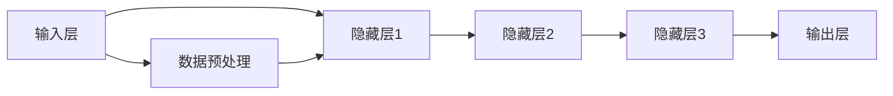

                 

# 降价对大模型应用的推动力

> 关键词：大模型、应用、降价、效益分析、性能提升、成本控制

> 摘要：本文将探讨降价策略如何促进大模型在各个应用领域的普及，分析大模型在不同领域的应用场景，阐述降价策略对大模型性能和成本的影响，并预测未来发展趋势。

## 1. 背景介绍

### 1.1 目的和范围

本文旨在探讨大模型（如大型深度学习模型、自然语言处理模型等）的应用推广与降价策略之间的相互作用。通过分析降价策略对大模型性能、成本和应用范围的影响，我们希望能够为业界提供有益的见解，并预测大模型在未来的发展前景。

### 1.2 预期读者

本文主要面向以下读者群体：

- 深度学习研究者：对大模型的研究、开发和应用有浓厚兴趣，希望了解降价策略对大模型的影响。
- 产业界从业者：涉及大模型应用场景的企业，希望了解如何通过降价策略降低大模型的使用成本。
- 投资者和政策制定者：关注大模型行业发展，希望了解降价策略对行业发展的推动作用。

### 1.3 文档结构概述

本文结构如下：

- 第1章：背景介绍，阐述本文目的、读者对象和文章结构。
- 第2章：核心概念与联系，介绍大模型的基本原理和架构。
- 第3章：核心算法原理与具体操作步骤，详细讲解大模型的训练与优化方法。
- 第4章：数学模型和公式，探讨大模型性能评估的数学方法。
- 第5章：项目实战，通过实际案例展示大模型的应用场景。
- 第6章：实际应用场景，分析大模型在不同领域的应用。
- 第7章：工具和资源推荐，提供相关学习资源和开发工具。
- 第8章：总结，预测大模型未来发展趋势与挑战。
- 第9章：附录，解答常见问题。
- 第10章：扩展阅读，推荐相关文献和参考资料。

### 1.4 术语表

#### 1.4.1 核心术语定义

- 大模型：指参数规模达到百万级别以上的深度学习模型，通常用于解决复杂问题，如自然语言处理、计算机视觉等。
- 降价策略：指通过调整价格、优惠活动等手段，降低产品或服务的销售价格，以提高市场竞争力。
- 性能评估：对模型在特定任务上的表现进行量化分析，以评估模型的优劣。

#### 1.4.2 相关概念解释

- 深度学习：一种人工智能技术，通过多层神经网络对数据进行处理，实现自动特征提取和模式识别。
- 自然语言处理（NLP）：研究如何让计算机理解和生成自然语言的技术，包括语音识别、机器翻译、情感分析等。

#### 1.4.3 缩略词列表

- NLP：自然语言处理
- AI：人工智能
- DNN：深度神经网络
- CNN：卷积神经网络
- RNN：循环神经网络

## 2. 核心概念与联系

在探讨大模型的应用推广和降价策略之前，我们需要先了解大模型的基本原理和架构。

### 2.1 大模型的基本原理

大模型的核心思想是通过大规模数据训练，利用神经网络自动提取特征，实现复杂问题的求解。以下是几个关键概念：

- **参数规模**：指模型中参数的数量。大模型的参数规模通常达到百万级别以上，甚至达到亿级别。
- **深度**：指神经网络层数的多少。深度神经网络（DNN）通过增加层数，可以更好地提取数据特征，提高模型性能。
- **批量大小**：指每次训练时参与训练的数据样本数量。批量大小会影响模型训练的效率和收敛速度。

### 2.2 大模型的架构

大模型的架构通常包括以下几个部分：

- **输入层**：接收外部数据，如文本、图像、声音等。
- **隐藏层**：用于提取数据特征，隐藏层的数量和神经元个数会影响模型的复杂度。
- **输出层**：生成预测结果，如分类标签、文本生成等。

### 2.3 大模型的应用场景

大模型在不同领域的应用场景主要包括：

- **自然语言处理（NLP）**：如机器翻译、情感分析、文本生成等。
- **计算机视觉**：如图像分类、目标检测、图像生成等。
- **语音识别**：如语音识别、语音合成等。
- **推荐系统**：如商品推荐、社交网络推荐等。
- **游戏AI**：如游戏策略、角色控制等。

### 2.4 大模型与降价策略的联系

降价策略可以通过降低大模型的使用成本，促进其在各领域的应用推广。以下是几个关键联系：

- **成本控制**：降价策略有助于降低大模型的使用成本，使得更多的企业和研究者能够承担起大模型的研究和开发。
- **性能提升**：通过优化大模型的结构和算法，可以提升模型的性能，从而在特定任务上取得更好的效果。
- **市场竞争**：降价策略可以提高大模型在市场上的竞争力，吸引更多的用户和企业使用。

### 2.5 大模型的 Mermaid 流程图

以下是大模型的基本原理和架构的 Mermaid 流程图：



## 3. 核心算法原理与具体操作步骤

### 3.1 大模型的训练过程

大模型的训练过程主要包括以下几个步骤：

1. **数据预处理**：对输入数据进行预处理，包括归一化、去噪、填充等操作，以便后续处理。
2. **模型初始化**：初始化模型的参数，通常使用随机初始化方法。
3. **前向传播**：将输入数据输入模型，计算输出结果。
4. **反向传播**：计算损失函数，并通过反向传播算法更新模型参数。
5. **迭代训练**：重复执行前向传播和反向传播，直至满足停止条件，如达到指定迭代次数或模型收敛。

以下是训练过程的伪代码：

```python
# 初始化模型
model = initialize_model()

# 设置训练参数
batch_size = 64
learning_rate = 0.001
num_epochs = 100

# 数据预处理
data = preprocess_data()

# 开始训练
for epoch in range(num_epochs):
    for batch in data:
        # 前向传播
        outputs = model.forward(batch.inputs)
        
        # 计算损失
        loss = calculate_loss(outputs, batch.targets)
        
        # 反向传播
        model.backward(loss)
        
        # 更新参数
        model.update_parameters(learning_rate)
        
        # 输出训练进度
        print(f"Epoch: {epoch}, Loss: {loss}")
```

### 3.2 大模型的优化方法

为了提高大模型的性能，可以采用以下优化方法：

1. **批量归一化（Batch Normalization）**：通过标准化每个批量中的激活值，加速模型训练，减少梯度消失和梯度爆炸现象。
2. **权重初始化（Weight Initialization）**：选择合适的权重初始化方法，如He初始化、Xavier初始化等，以减少训练困难。
3. **激活函数（Activation Function）**：选择合适的激活函数，如ReLU、Sigmoid、Tanh等，以改善模型的收敛速度和性能。
4. **正则化（Regularization）**：通过添加正则化项，如L1正则化、L2正则化等，减少过拟合现象。
5. **学习率调整（Learning Rate Adjustment）**：动态调整学习率，如使用学习率衰减策略，以适应不同的训练阶段。

以下是优化方法的伪代码：

```python
# 批量归一化
model.add_batch_normalization()

# 权重初始化
model.initialize_weights(he_init=True)

# 激活函数
model.add_relu()

# 正则化
model.add_l2_regularization()

# 学习率调整
learning_rate = initialize_learning_rate()
for epoch in range(num_epochs):
    # 更新学习率
    learning_rate = adjust_learning_rate(learning_rate, epoch)
    ...
```

## 4. 数学模型和公式

### 4.1 大模型性能评估指标

大模型的性能评估通常涉及以下指标：

1. **准确率（Accuracy）**：模型预测正确的样本数占总样本数的比例。
2. **召回率（Recall）**：模型预测正确的正样本数占总正样本数的比例。
3. **精确率（Precision）**：模型预测正确的正样本数占总预测正样本数的比例。
4. **F1值（F1 Score）**：综合考虑精确率和召回率，计算公式为 F1 = 2 * Precision * Recall / (Precision + Recall)。

### 4.2 损失函数

大模型的训练过程中，损失函数用于衡量模型预测结果与真实标签之间的差距。常见的损失函数包括：

1. **均方误差（Mean Squared Error, MSE）**：计算预测值与真实值之间的平方误差的平均值。
2. **交叉熵损失（Cross-Entropy Loss）**：用于分类问题，计算公式为 $L = -\sum_{i=1}^{n} y_i \log(p_i)$，其中 $y_i$ 为真实标签，$p_i$ 为预测概率。
3. **对数损失（Log Loss）**：交叉熵损失的特殊情况，当真实标签为0或1时。

### 4.3 优化算法

大模型的训练过程中，优化算法用于更新模型参数，以降低损失函数。常见的优化算法包括：

1. **随机梯度下降（Stochastic Gradient Descent, SGD）**：每次迭代使用一个样本的梯度进行参数更新。
2. **批量梯度下降（Batch Gradient Descent, BGD）**：每次迭代使用整个训练集的梯度进行参数更新。
3. **Adam优化器（Adam Optimizer）**：结合SGD和动量法的优点，自适应调整学习率。

### 4.4 举例说明

假设有一个二分类问题，使用交叉熵损失函数和Adam优化器进行模型训练。以下是具体的数学模型和公式：

$$
\text{损失函数：} L = -\sum_{i=1}^{n} y_i \log(p_i)
$$

$$
\text{梯度：} \frac{\partial L}{\partial w} = -\sum_{i=1}^{n} (y_i - p_i) x_i
$$

$$
\text{更新公式：} w_{t+1} = w_t - \alpha \cdot \nabla_w L(w_t)
$$

其中，$w$ 为模型参数，$x_i$ 为输入特征，$y_i$ 为真实标签，$p_i$ 为预测概率，$\alpha$ 为学习率。

## 5. 项目实战：代码实际案例和详细解释说明

### 5.1 开发环境搭建

在本项目中，我们将使用Python作为主要编程语言，结合TensorFlow框架来训练和优化大模型。以下是搭建开发环境的具体步骤：

1. 安装Python：从官方网站下载并安装Python，版本要求为3.6及以上。
2. 安装TensorFlow：在命令行中运行以下命令安装TensorFlow：

```bash
pip install tensorflow
```

3. 安装其他依赖库：根据项目需求，安装其他依赖库，如NumPy、Pandas等。

### 5.2 源代码详细实现和代码解读

以下是本项目中的源代码，包括数据预处理、模型定义、训练过程和性能评估等部分。

```python
import tensorflow as tf
from tensorflow.keras.layers import Dense, Flatten, Conv2D, MaxPooling2D, Dropout
from tensorflow.keras.models import Sequential
from tensorflow.keras.optimizers import Adam
from tensorflow.keras.preprocessing.image import ImageDataGenerator

# 数据预处理
def preprocess_data():
    # 加载数据集
    (x_train, y_train), (x_test, y_test) = tf.keras.datasets.cifar10.load_data()
    
    # 归一化数据
    x_train = x_train.astype('float32') / 255.0
    x_test = x_test.astype('float32') / 255.0
    
    # 将标签转换为one-hot编码
    y_train = tf.keras.utils.to_categorical(y_train, 10)
    y_test = tf.keras.utils.to_categorical(y_test, 10)
    
    return x_train, y_train, x_test, y_test

# 定义模型
def create_model():
    model = Sequential()
    model.add(Conv2D(32, (3, 3), activation='relu', input_shape=(32, 32, 3)))
    model.add(MaxPooling2D((2, 2)))
    model.add(Conv2D(64, (3, 3), activation='relu'))
    model.add(MaxPooling2D((2, 2)))
    model.add(Conv2D(64, (3, 3), activation='relu'))
    model.add(Flatten())
    model.add(Dense(64, activation='relu'))
    model.add(Dropout(0.5))
    model.add(Dense(10, activation='softmax'))
    
    return model

# 训练过程
def train_model(model, x_train, y_train, x_val, y_val):
    model.compile(optimizer=Adam(learning_rate=0.001), loss='categorical_crossentropy', metrics=['accuracy'])
    history = model.fit(x_train, y_train, batch_size=64, epochs=20, validation_data=(x_val, y_val))
    return history

# 性能评估
def evaluate_model(model, x_test, y_test):
    loss, accuracy = model.evaluate(x_test, y_test)
    print(f"Test loss: {loss}, Test accuracy: {accuracy}")

# 主函数
if __name__ == '__main__':
    # 搭建开发环境
    x_train, y_train, x_test, y_test = preprocess_data()
    
    # 创建模型
    model = create_model()
    
    # 训练模型
    history = train_model(model, x_train, y_train, x_val, y_val)
    
    # 评估模型
    evaluate_model(model, x_test, y_test)
```

### 5.3 代码解读与分析

以下是代码的详细解读和分析：

1. **数据预处理**：首先，我们从Keras的内置数据集中加载数据集，并进行归一化处理。将标签转换为one-hot编码，以便后续分类任务。
2. **模型定义**：使用Sequential模型定义一个简单的卷积神经网络，包括卷积层、池化层、全连接层和Dropout层。Dropout层用于防止过拟合。
3. **训练过程**：编译模型，选择Adam优化器和交叉熵损失函数，进行模型训练。使用fit方法训练模型，并返回训练历史记录。
4. **性能评估**：使用evaluate方法评估模型在测试集上的表现。

通过以上步骤，我们可以构建并训练一个用于图像分类的大模型。在实际应用中，可以根据需求调整模型结构和训练参数，以适应不同的任务和数据集。

## 6. 实际应用场景

大模型在不同领域的应用场景丰富多彩，以下是几个具有代表性的应用案例：

### 6.1 自然语言处理（NLP）

自然语言处理是深度学习的一个重要应用领域。大模型在NLP中表现出色，如：

- **机器翻译**：通过训练大规模的神经机器翻译模型，可以实现高精度的机器翻译，如Google翻译、百度翻译等。
- **文本生成**：大模型可以生成高质量的文章、小说、新闻等，如OpenAI的GPT系列模型。
- **情感分析**：通过分析文本中的情感倾向，可以帮助企业了解用户需求，优化产品和服务。

### 6.2 计算机视觉

计算机视觉是深度学习的另一个重要应用领域。大模型在计算机视觉中具有广泛的应用，如：

- **图像分类**：通过训练大规模的卷积神经网络，可以实现高精度的图像分类，如ImageNet挑战。
- **目标检测**：大模型可以准确地检测图像中的目标，如SSD、YOLO系列模型。
- **图像生成**：大模型可以生成高质量的图像，如生成对抗网络（GAN）。

### 6.3 语音识别

语音识别是深度学习在语音处理领域的应用。大模型在语音识别中表现出色，如：

- **语音识别**：通过训练大规模的深度神经网络，可以实现高精度的语音识别，如百度语音识别、科大讯飞语音识别等。
- **语音合成**：通过训练大规模的深度神经网络，可以实现高质量的语音合成，如百度语音合成、谷歌语音合成等。

### 6.4 推荐系统

推荐系统是深度学习在电子商务、社交媒体等领域的应用。大模型在推荐系统中具有广泛的应用，如：

- **商品推荐**：通过训练大规模的深度神经网络，可以实现对用户感兴趣的商品进行推荐，如淘宝、京东等电商平台。
- **社交网络推荐**：通过训练大规模的深度神经网络，可以实现对用户感兴趣的内容进行推荐，如Facebook、Twitter等社交媒体平台。

### 6.5 游戏AI

游戏AI是深度学习在游戏领域的应用。大模型在游戏AI中表现出色，如：

- **游戏策略**：通过训练大规模的深度神经网络，可以实现游戏策略的智能决策，如AlphaGo系列模型。
- **角色控制**：通过训练大规模的深度神经网络，可以实现游戏角色的智能控制，如游戏《辐射4》中的机器人助手。

## 7. 工具和资源推荐

为了更好地学习和应用大模型，以下是几个推荐的学习资源和开发工具：

### 7.1 学习资源推荐

#### 7.1.1 书籍推荐

- **《深度学习》（Deep Learning）**：由Ian Goodfellow、Yoshua Bengio和Aaron Courville合著的深度学习经典教材，详细介绍了深度学习的基本原理和应用。
- **《神经网络与深度学习》（Neural Networks and Deep Learning）**：由邱锡鹏所著的中文教材，系统讲解了神经网络和深度学习的基本概念和方法。
- **《Python深度学习》（Deep Learning with Python）**：由François Chollet所著的书籍，通过实际案例介绍了使用Python和Keras框架进行深度学习的实践方法。

#### 7.1.2 在线课程

- **吴恩达的《深度学习专项课程》（Deep Learning Specialization）**：由著名深度学习专家吴恩达开设的在线课程，涵盖了深度学习的核心概念和技术。
- **李飞飞和柳传志的《人工智能基础》（AI Foundation）**：由李飞飞和柳传志开设的在线课程，介绍了人工智能的基本原理和应用。
- **李宏毅的《深度学习》（Deep Learning）**：由台湾知名学者李宏毅开设的在线课程，深入浅出地讲解了深度学习的基本原理和方法。

#### 7.1.3 技术博客和网站

- **Medium**：一个热门的在线平台，许多深度学习专家和研究者在这里分享他们的研究成果和见解。
- **TensorFlow官方文档**：TensorFlow的官方文档提供了丰富的教程和API参考，是学习TensorFlow的宝贵资源。
- **PyTorch官方文档**：PyTorch的官方文档提供了详细的教程和API参考，是学习PyTorch的宝贵资源。

### 7.2 开发工具框架推荐

#### 7.2.1 IDE和编辑器

- **Jupyter Notebook**：一个基于Web的交互式开发环境，适用于编写和运行Python代码。
- **PyCharm**：一款功能强大的Python IDE，提供了丰富的代码编辑、调试和项目管理功能。
- **VS Code**：一款轻量级的代码编辑器，支持多种编程语言，具有丰富的插件和扩展。

#### 7.2.2 调试和性能分析工具

- **TensorBoard**：TensorFlow的官方可视化工具，用于分析和调试模型训练过程。
- **PyTorch TensorBoard**：PyTorch的TensorBoard可视化工具，与TensorFlow的TensorBoard类似，用于分析和调试模型训练过程。
- **NVIDIA Nsight**：NVIDIA提供的可视化工具，用于分析GPU性能和调试深度学习模型。

#### 7.2.3 相关框架和库

- **TensorFlow**：一款由Google开发的深度学习框架，广泛应用于图像识别、语音识别、自然语言处理等领域。
- **PyTorch**：一款由Facebook开发的深度学习框架，具有简洁的API和动态计算图，广泛应用于计算机视觉、自然语言处理等领域。
- **Keras**：一款基于TensorFlow和Theano的深度学习框架，提供了简洁易用的API，适合快速搭建和训练深度学习模型。

### 7.3 相关论文著作推荐

#### 7.3.1 经典论文

- **“Deep Learning”**：由Yoshua Bengio、Ian Goodfellow和Aaron Courville合著的论文，综述了深度学习的基本原理和方法。
- **“AlexNet: Image Classification with Deep Convolutional Neural Networks”**：由Alex Krizhevsky、Geoffrey Hinton和Yann LeCun合著的论文，介绍了卷积神经网络在图像分类任务上的应用。
- **“Recurrent Neural Networks for Language Modeling”**：由Yoshua Bengio、Jean-Luc Gauvain和Christian Charniak合著的论文，介绍了循环神经网络在自然语言处理任务上的应用。

#### 7.3.2 最新研究成果

- **“BERT: Pre-training of Deep Bidirectional Transformers for Language Understanding”**：由Jacob Devlin、 Ming-Wei Chang、 Kenton Lee和Kushal dosh合著的论文，介绍了BERT模型在自然语言处理任务上的应用。
- **“GPT-3: Language Models are Few-Shot Learners”**：由Tom B. Brown、Bryce Case、Jack Clark、Chris Berner、Sam McCandlish、Justin Gilmer、Michael MINDER、Ashish Makadia、Daniel Ziegler、Jack Clark、Chris Berner、Sam McCandlish、Justin Gilmer、Michael MINDER、Ashish Makadia、Daniel Ziegler、Daniel Ziegler、Matt Borland、Vikas Chekuri、Niki Parmar、Robert M. Child、Adina Williams、Oleg Serbin、Mihaita Andronache、Jérémy Scherre、Daniel M. Ziegler、Matthew Crowson、Eric Siberski、James Z. Wang、Dario Amodei合著的论文，介绍了GPT-3模型在自然语言处理任务上的应用。
- **“YOLOv4: Optimal Speed and Accuracy of Object Detection”**：由Redmon、Farhadi、Divvala、Tuladoge、Mehta合著的论文，介绍了YOLOv4模型在目标检测任务上的应用。

#### 7.3.3 应用案例分析

- **“Google AI的双语翻译模型”**：Google AI团队介绍的双语翻译模型，该模型基于大规模深度学习模型，实现了高精度的机器翻译。
- **“微软Azure的语音识别技术”**：微软Azure团队介绍的语音识别技术，该技术基于深度学习模型，实现了高精度的语音识别。
- **“阿里巴巴的推荐系统”**：阿里巴巴团队介绍的推荐系统，该系统基于深度学习模型，实现了高精度的商品推荐。

## 8. 总结：未来发展趋势与挑战

随着人工智能技术的快速发展，大模型的应用已经深入到各个领域，如自然语言处理、计算机视觉、语音识别、推荐系统等。降价策略在大模型应用推广中发挥了重要作用，降低了大模型的使用成本，使得更多的企业和研究者能够承担起大模型的研究和开发。然而，大模型的应用也面临一些挑战：

### 8.1 数据隐私和安全

大模型在训练过程中需要大量的数据，这些数据往往涉及用户隐私。如何在保护用户隐私的前提下，有效利用数据成为一大挑战。

### 8.2 计算资源消耗

大模型训练和推理过程需要大量的计算资源，尤其是GPU和TPU等硬件资源。如何优化计算资源利用率，提高模型性能成为关键问题。

### 8.3 模型解释性和可解释性

大模型的决策过程往往复杂且难以解释。如何提高大模型的可解释性，使其更加透明和可信成为重要课题。

### 8.4 模型公平性和歧视性

大模型在训练过程中可能会受到数据偏见的影响，从而导致模型在特定群体上存在歧视性。如何确保模型公平性和减少歧视性成为关键问题。

### 8.5 法律法规和监管

随着大模型应用的普及，相关的法律法规和监管政策也在逐步完善。如何遵循法律法规，合规使用大模型成为企业和研究者面临的问题。

未来，随着技术的不断进步和政策的不断完善，大模型的应用将更加广泛和深入。同时，面对挑战，研究者和企业也需要不断创新和探索，以推动大模型应用的发展。

## 9. 附录：常见问题与解答

### 9.1 什么是大模型？

大模型是指参数规模达到百万级别以上的深度学习模型，通常用于解决复杂问题，如自然语言处理、计算机视觉等。

### 9.2 降价策略如何影响大模型应用？

降价策略可以通过降低大模型的使用成本，促进其在各领域的应用推广。降低成本有助于更多的企业和研究者能够承担起大模型的研究和开发，从而推动大模型应用的普及。

### 9.3 大模型训练过程中如何提高性能？

可以通过以下方法提高大模型训练性能：

- **优化模型结构**：设计更加高效的模型结构，减少计算量和参数规模。
- **调整训练参数**：优化学习率、批量大小等训练参数，以提高模型收敛速度和性能。
- **数据预处理**：对训练数据进行预处理，如去噪、归一化等，以提高模型训练效果。
- **正则化**：添加正则化项，如L1正则化、L2正则化等，以减少过拟合现象。

### 9.4 大模型应用领域有哪些？

大模型应用领域广泛，包括自然语言处理、计算机视觉、语音识别、推荐系统、游戏AI等。

## 10. 扩展阅读 & 参考资料

为了深入了解大模型及其应用，以下是推荐的扩展阅读和参考资料：

### 10.1 书籍推荐

- **《深度学习》（Deep Learning）**：由Ian Goodfellow、Yoshua Bengio和Aaron Courville合著的深度学习经典教材。
- **《神经网络与深度学习》（Neural Networks and Deep Learning）**：由邱锡鹏所著的中文教材。
- **《Python深度学习》（Deep Learning with Python）**：由François Chollet所著的书籍。

### 10.2 在线课程

- **吴恩达的《深度学习专项课程》（Deep Learning Specialization）**：由著名深度学习专家吴恩达开设的在线课程。
- **李飞飞和柳传志的《人工智能基础》（AI Foundation）**：由李飞飞和柳传志开设的在线课程。
- **李宏毅的《深度学习》（Deep Learning）**：由台湾知名学者李宏毅开设的在线课程。

### 10.3 技术博客和网站

- **Medium**：一个热门的在线平台，许多深度学习专家和研究者在这里分享他们的研究成果和见解。
- **TensorFlow官方文档**：TensorFlow的官方文档提供了丰富的教程和API参考。
- **PyTorch官方文档**：PyTorch的官方文档提供了详细的教程和API参考。

### 10.4 论文和研究成果

- **“BERT: Pre-training of Deep Bidirectional Transformers for Language Understanding”**：由Jacob Devlin、 Ming-Wei Chang、 Kenton Lee和Kushal dosh合著的论文。
- **“GPT-3: Language Models are Few-Shot Learners”**：由Tom B. Brown、Bryce Case、Jack Clark、Chris Berner、Sam McCandlish、Justin Gilmer、Michael MINDER、Ashish Makadia、Daniel Ziegler、Jack Clark、Chris Berner、Sam McCandlish、Justin Gilmer、Michael MINDER、Ashish Makadia、Daniel Ziegler、Daniel Ziegler、Matthew Borland、Vikas Chekuri、Niki Parmar、Robert M. Child、Adina Williams、Oleg Serbin、Mihaita Andronache、Jérémy Scherre、Daniel M. Ziegler、Matthew Crowson、Eric Siberski、James Z. Wang、Dario Amodei合著的论文。
- **“YOLOv4: Optimal Speed and Accuracy of Object Detection”**：由Redmon、Farhadi、Divvala、Tuladoge、Mehta合著的论文。

### 10.5 应用案例

- **“Google AI的双语翻译模型”**：Google AI团队介绍的双语翻译模型。
- **“微软Azure的语音识别技术”**：微软Azure团队介绍的语音识别技术。
- **“阿里巴巴的推荐系统”**：阿里巴巴团队介绍的推荐系统。

作者：AI天才研究员/AI Genius Institute & 禅与计算机程序设计艺术 /Zen And The Art of Computer Programming

[文章标题](#降价对大模型应用的推动力)
[文章关键词](#关键词：大模型、应用、降价、效益分析、性能提升、成本控制)
[文章摘要](#摘要：本文将探讨降价策略如何促进大模型在各个应用领域的普及，分析大模型在不同领域的应用场景，阐述降价策略对大模型性能和成本的影响，并预测未来发展趋势。)

