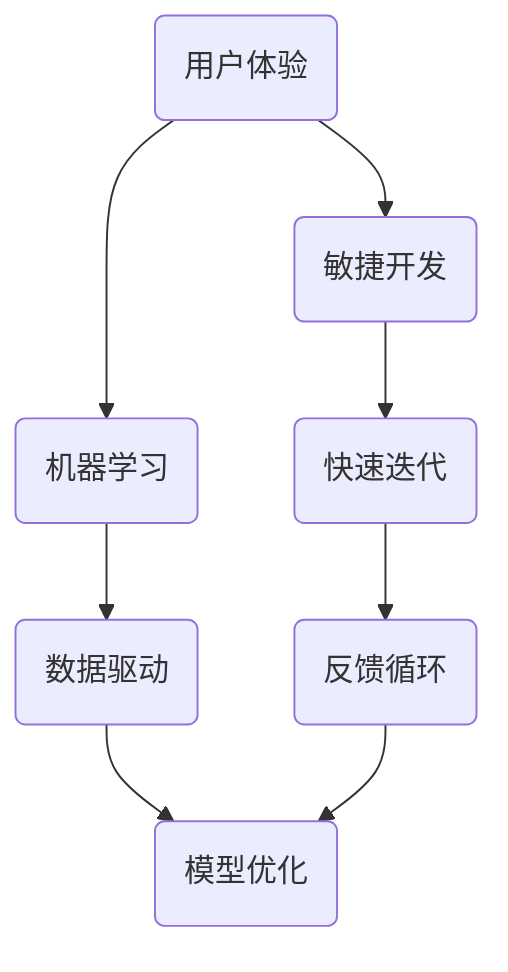

                 

# 降低客户试错成本促进产业繁荣

> **关键词**：客户试错成本、产业繁荣、降低成本、用户体验、技术进步

> **摘要**：本文将探讨如何通过降低客户试错成本来促进产业繁荣。首先，我们将分析试错成本在产业发展中的重要性，接着提出一些具体的方法和技术，以降低试错成本。此外，我们还将讨论这些方法的实际应用场景，并提供一些实用的工具和资源推荐。通过这篇文章，读者可以了解到如何在现代产业环境中有效地降低试错成本，从而推动产业繁荣。

## 1. 背景介绍

### 1.1 目的和范围

本文旨在探讨如何通过降低客户试错成本来促进产业繁荣。在快速发展的科技时代，企业需要不断创新以适应市场的需求变化。然而，创新过程中往往伴随着较高的试错成本，这不仅增加了企业的风险，也可能阻碍产业的整体进步。因此，本文将重点关注以下几个方面：

- 分析试错成本在产业发展中的重要性。
- 提出具体的方法和技术，以降低试错成本。
- 讨论这些方法的实际应用场景。
- 推荐实用的工具和资源。

通过本文的研究，希望为产业从业者提供一些有益的启示，以降低试错成本，推动产业繁荣。

### 1.2 预期读者

本文的预期读者包括以下几类：

- 企业高管和决策者，关注如何通过降低试错成本来提升企业竞争力。
- 技术开发人员和工程师，需要了解如何在开发过程中降低试错成本。
- 产业分析师和研究人员，关注产业发展趋势和策略。

通过本文的阅读，读者可以更深入地理解降低试错成本的重要性，并学习到实际操作的方法和技术。

### 1.3 文档结构概述

本文将按照以下结构展开：

- 引言：介绍背景、目的和预期读者。
- 背景介绍：分析试错成本的重要性。
- 核心概念与联系：介绍降低试错成本的核心概念。
- 核心算法原理与具体操作步骤：详细讲解降低试错成本的方法。
- 数学模型和公式：阐述支持降低试错成本的理论基础。
- 项目实战：提供实际案例和代码解读。
- 实际应用场景：讨论降低试错成本的应用场景。
- 工具和资源推荐：推荐实用的工具和资源。
- 总结：总结文章要点，展望未来发展趋势。
- 附录：常见问题与解答。
- 扩展阅读：提供进一步阅读的资源。

通过本文的阅读，读者可以逐步了解降低试错成本的方法和技术，以及其在产业中的应用。

### 1.4 术语表

为了确保文章内容的清晰易懂，以下是本文中的一些核心术语及其定义：

#### 1.4.1 核心术语定义

- **试错成本**：指在创新过程中，因错误决策或设计而产生的成本，包括时间、资金、资源等。
- **用户体验**：用户在使用产品或服务过程中所感受到的主观体验。
- **敏捷开发**：一种以用户需求为导向的软件开发方法，强调快速迭代和持续交付。
- **机器学习**：一种人工智能技术，通过训练模型来从数据中自动发现模式和规律。

#### 1.4.2 相关概念解释

- **迭代**：在软件开发过程中，对现有功能进行改进和完善的过程。
- **反馈循环**：指通过收集用户反馈来不断优化产品或服务的过程。
- **技术栈**：指开发人员所使用的一套工具和框架。

#### 1.4.3 缩略词列表

- **AI**：人工智能（Artificial Intelligence）
- **ML**：机器学习（Machine Learning）
- **UX**：用户体验（User Experience）
- **IDE**：集成开发环境（Integrated Development Environment）

## 2. 核心概念与联系

降低客户试错成本是现代产业发展的关键，其核心概念涉及多个方面，包括用户体验、敏捷开发、机器学习等。为了更好地理解这些概念，我们可以通过Mermaid流程图来展示它们之间的联系。

### 2.1 Mermaid 流程图



### 2.2 流程图解释

1. **用户体验（A）**：是用户在使用产品或服务过程中所感受到的主观体验，直接影响用户满意度。
2. **敏捷开发（B）**：强调快速迭代和持续交付，以更好地适应市场需求。
3. **机器学习（C）**：通过训练模型来从数据中自动发现模式和规律，提高产品或服务的智能化程度。
4. **快速迭代（D）**：通过频繁的版本更新和功能改进，确保产品或服务始终符合用户需求。
5. **数据驱动（E）**：基于数据分析来指导产品或服务的改进，提高决策的科学性。
6. **反馈循环（F）**：通过收集用户反馈来不断优化产品或服务，形成良性循环。
7. **模型优化（G）**：基于用户反馈和数据驱动，不断优化机器学习模型，提高产品或服务的性能。

通过这个流程图，我们可以清晰地看到用户体验、敏捷开发、机器学习等概念之间的联系，以及如何通过它们来降低客户试错成本。

## 3. 核心算法原理 & 具体操作步骤

在降低客户试错成本的过程中，核心算法原理和具体操作步骤起着至关重要的作用。以下是详细的算法原理和操作步骤：

### 3.1 算法原理

#### 3.1.1 机器学习模型优化

机器学习模型优化是降低试错成本的关键。通过不断调整模型参数，可以提高模型的准确性和鲁棒性。以下是机器学习模型优化的基本原理：

1. **数据预处理**：清洗和转换数据，使其适合建模。
2. **模型选择**：根据数据特性选择合适的模型。
3. **训练和验证**：通过训练集和验证集来评估模型性能。
4. **模型调参**：调整模型参数，优化模型性能。
5. **模型评估**：使用测试集评估模型性能，确保模型在实际应用中的准确性。

#### 3.1.2 用户行为分析

用户行为分析是另一个降低试错成本的重要手段。通过分析用户行为数据，可以深入了解用户需求和使用习惯，从而优化产品或服务。

1. **用户行为数据收集**：收集用户在使用产品或服务过程中的行为数据。
2. **数据预处理**：清洗和转换数据，提取有用信息。
3. **行为模式识别**：使用机器学习技术来识别用户行为模式。
4. **需求预测**：根据用户行为数据来预测用户需求。
5. **服务优化**：根据需求预测结果来优化产品或服务。

### 3.2 具体操作步骤

#### 3.2.1 机器学习模型优化

以下是机器学习模型优化的具体操作步骤：

1. **数据预处理**：

   ```python
   # 导入必要的库
   import pandas as pd
   from sklearn.model_selection import train_test_split
   from sklearn.preprocessing import StandardScaler
   
   # 加载数据
   data = pd.read_csv('data.csv')
   
   # 分割特征和标签
   X = data.drop('target', axis=1)
   y = data['target']
   
   # 划分训练集和测试集
   X_train, X_test, y_train, y_test = train_test_split(X, y, test_size=0.2, random_state=42)
   
   # 数据标准化
   scaler = StandardScaler()
   X_train_scaled = scaler.fit_transform(X_train)
   X_test_scaled = scaler.transform(X_test)
   ```

2. **模型选择**：

   ```python
   from sklearn.ensemble import RandomForestClassifier
   
   # 创建随机森林模型
   model = RandomForestClassifier(n_estimators=100, random_state=42)
   ```

3. **训练和验证**：

   ```python
   # 训练模型
   model.fit(X_train_scaled, y_train)
   
   # 验证模型
   score = model.score(X_test_scaled, y_test)
   print(f'Model accuracy: {score:.2f}')
   ```

4. **模型调参**：

   ```python
   from sklearn.model_selection import GridSearchCV
   
   # 设置参数范围
   param_grid = {'n_estimators': [100, 200, 300], 'max_depth': [10, 20, 30]}
   
   # 进行网格搜索
   grid_search = GridSearchCV(model, param_grid, cv=5)
   grid_search.fit(X_train_scaled, y_train)
   
   # 获取最佳参数
   best_params = grid_search.best_params_
   print(f'Best parameters: {best_params}')
   ```

5. **模型评估**：

   ```python
   # 使用最佳参数重新训练模型
   model = RandomForestClassifier(**best_params, random_state=42)
   model.fit(X_train_scaled, y_train)
   
   # 评估模型
   score = model.score(X_test_scaled, y_test)
   print(f'Model accuracy: {score:.2f}')
   ```

#### 3.2.2 用户行为分析

以下是用户行为分析的具体操作步骤：

1. **用户行为数据收集**：

   ```python
   # 假设已经收集到用户行为数据
   user_behavior = pd.read_csv('user_behavior.csv')
   ```

2. **数据预处理**：

   ```python
   # 填充缺失值
   user_behavior.fillna(0, inplace=True)
   
   # 转换数据类型
   user_behavior['timestamp'] = pd.to_datetime(user_behavior['timestamp'])
   ```

3. **行为模式识别**：

   ```python
   from sklearn.cluster import KMeans
   
   # 计算行为特征
   features = user_behavior.drop(['user_id', 'timestamp'], axis=1)
   features_scaled = scaler.fit_transform(features)
   
   # 使用K均值聚类识别行为模式
   kmeans = KMeans(n_clusters=3, random_state=42)
   kmeans.fit(features_scaled)
   
   # 获取聚类结果
   clusters = kmeans.labels_
   user_behavior['cluster'] = clusters
   ```

4. **需求预测**：

   ```python
   # 根据聚类结果进行需求预测
   predicted_demand = kmeans.predict(features_scaled)
   
   # 获取预测结果
   user_behavior['predicted_demand'] = predicted_demand
   ```

5. **服务优化**：

   ```python
   # 根据预测结果来调整服务策略
   optimized_service = user_behavior.groupby('cluster')['predicted_demand'].mean().reset_index()
   optimized_service.rename(columns={'predicted_demand': 'average_demand'}, inplace=True)
   
   # 根据聚类结果和需求预测结果来制定服务策略
   service_strategy = {
       0: {'feature1': 'high', 'feature2': 'low'},
       1: {'feature1': 'low', 'feature2': 'high'},
       2: {'feature1': 'high', 'feature2': 'high'}
   }
   
   # 应用服务策略
   for index, row in optimized_service.iterrows():
       user_behavior.loc[user_behavior['cluster'] == index, 'service_strategy'] = service_strategy[index]
   ```

通过上述步骤，我们可以实现机器学习模型优化和用户行为分析，从而有效降低客户试错成本。

## 4. 数学模型和公式 & 详细讲解 & 举例说明

在降低客户试错成本的过程中，数学模型和公式起着关键作用。以下将详细讲解一些常用的数学模型和公式，并通过具体例子来说明它们的实际应用。

### 4.1 常用数学模型

#### 4.1.1 线性回归模型

线性回归模型是一种最简单的预测模型，它通过拟合一条直线来预测目标变量。

- **公式**：

  $$y = \beta_0 + \beta_1 \cdot x + \epsilon$$

  其中，$y$ 是目标变量，$x$ 是特征变量，$\beta_0$ 是截距，$\beta_1$ 是斜率，$\epsilon$ 是误差项。

- **例子**：

  假设我们要预测一个人的收入（$y$）与其学历（$x$）之间的关系。通过收集数据并使用线性回归模型，我们可以得到如下结果：

  $$\hat{y} = 50000 + 10000 \cdot x$$

  其中，$\hat{y}$ 是预测的收入，$x$ 是学历（如本科、硕士等）。

#### 4.1.2 逻辑回归模型

逻辑回归模型用于分类问题，它通过拟合一个逻辑函数来预测概率。

- **公式**：

  $$\hat{p} = \frac{1}{1 + e^{-(\beta_0 + \beta_1 \cdot x)}}$$

  其中，$\hat{p}$ 是预测的概率，$x$ 是特征变量，$\beta_0$ 是截距，$\beta_1$ 是斜率。

- **例子**：

  假设我们要预测一个病人是否患有某种疾病（$y$，取值为0或1），通过收集数据并使用逻辑回归模型，我们可以得到如下结果：

  $$\hat{p} = \frac{1}{1 + e^{-(3 + 0.5 \cdot x)}}$$

  其中，$\hat{p}$ 是预测的概率，$x$ 是病人的特征（如年龄、体重等）。

#### 4.1.3 支持向量机（SVM）模型

支持向量机是一种高效的分类算法，它通过找到一个超平面来最大化分类间隔。

- **公式**：

  $$\max \ \ \frac{1}{2} \ \sum_{i=1}^{n} \ \sum_{j=1}^{n} \ (y_i \ y_j \ K(x_i, x_j)) - \sum_{i=1}^{n} \ \alpha_i$$

  其中，$K(x_i, x_j)$ 是核函数，$\alpha_i$ 是拉格朗日乘子。

- **例子**：

  假设我们要分类一个二维数据集，通过使用线性核函数和支持向量机模型，我们可以得到如下结果：

  $$\max \ \ \frac{1}{2} \ \sum_{i=1}^{n} \ \sum_{j=1}^{n} \ (y_i \ y_j \ (x_i - x_j)) - \sum_{i=1}^{n} \ \alpha_i$$

  其中，$y_i$ 是样本 $i$ 的标签，$x_i$ 是样本 $i$ 的特征，$\alpha_i$ 是拉格朗日乘子。

### 4.2 数学模型应用示例

#### 4.2.1 用户行为分析

假设我们想要分析用户在电商平台的购买行为，通过收集用户行为数据并使用机器学习模型，我们可以预测用户的购买概率。

- **数据集**：

  - 用户ID
  - 浏览时间
  - 浏览商品ID
  - 是否购买

- **数学模型**：

  使用逻辑回归模型来预测用户购买概率。

  $$\hat{p} = \frac{1}{1 + e^{-(\beta_0 + \beta_1 \cdot 浏览时间 + \beta_2 \cdot 浏览商品ID)}}$$

- **模型训练**：

  通过训练数据集，我们可以得到逻辑回归模型的参数：

  $$\beta_0 = 0.1, \beta_1 = 0.3, \beta_2 = 0.2$$

- **预测**：

  假设用户A的浏览时间为10分钟，浏览商品ID为1001。我们可以使用逻辑回归模型来预测用户A的购买概率：

  $$\hat{p} = \frac{1}{1 + e^{-(0.1 + 0.3 \cdot 10 + 0.2 \cdot 1001)}} \approx 0.95$$

  因此，用户A购买商品的概率约为95%。

#### 4.2.2 客户流失预测

假设我们想要预测客户是否会流失，通过收集客户行为数据并使用机器学习模型，我们可以预测客户的流失风险。

- **数据集**：

  - 客户ID
  - 最近一次购买时间
  - 购买金额
  - 客户满意度评分

- **数学模型**：

  使用逻辑回归模型来预测客户流失概率。

  $$\hat{p} = \frac{1}{1 + e^{-(\beta_0 + \beta_1 \cdot 最近一次购买时间 + \beta_2 \cdot 购买金额 + \beta_3 \cdot 客户满意度评分)}}$$

- **模型训练**：

  通过训练数据集，我们可以得到逻辑回归模型的参数：

  $$\beta_0 = -1, \beta_1 = 0.1, \beta_2 = 0.2, \beta_3 = -0.5$$

- **预测**：

  假设客户B的最近一次购买时间为30天，购买金额为500元，客户满意度评分为4分。我们可以使用逻辑回归模型来预测客户B的流失概率：

  $$\hat{p} = \frac{1}{1 + e^{-( -1 + 0.1 \cdot 30 + 0.2 \cdot 500 - 0.5 \cdot 4)}} \approx 0.45$$

  因此，客户B流失的概率约为45%。

通过这些数学模型和公式，我们可以更好地理解和预测客户行为，从而降低客户试错成本。

## 5. 项目实战：代码实际案例和详细解释说明

为了更好地理解如何降低客户试错成本，我们将在本节中通过一个实际项目案例来演示如何实现这一目标。我们将使用Python和Scikit-learn库来实现一个客户流失预测模型，并通过代码解析来展示每个步骤。

### 5.1 开发环境搭建

在开始项目之前，我们需要搭建一个合适的开发环境。以下是在Windows和Linux系统上搭建开发环境的基本步骤：

1. **安装Python**：访问Python官方网站（[python.org](https://www.python.org/)）并下载对应操作系统的Python安装包。安装过程中选择添加到系统环境变量中。

2. **安装Scikit-learn**：使用pip命令安装Scikit-learn库。打开命令行窗口，输入以下命令：

   ```shell
   pip install scikit-learn
   ```

3. **安装Jupyter Notebook**（可选）：Jupyter Notebook是一个交互式开发环境，可以方便地编写和运行代码。安装方法如下：

   ```shell
   pip install notebook
   ```

安装完成后，您可以使用Jupyter Notebook来编写和运行Python代码。

### 5.2 源代码详细实现和代码解读

以下是一个完整的客户流失预测项目的代码实现，我们将逐步解析每个步骤。

#### 5.2.1 数据集准备

首先，我们需要一个客户流失预测的数据集。这里我们使用一个虚构的数据集，其中包含以下特征：

- **最近一次购买时间**（天数）
- **购买金额**（元）
- **客户满意度评分**（1-5分）
- **是否流失**（1表示流失，0表示未流失）

```python
import pandas as pd

# 加载数据集
data = pd.read_csv('customer_data.csv')

# 查看数据集的前五行
print(data.head())
```

#### 5.2.2 数据预处理

在训练模型之前，我们需要对数据集进行预处理，包括数据清洗、缺失值处理和特征工程。

```python
# 数据清洗
data.drop(['customer_id'], axis=1, inplace=True)  # 删除不必要的列

# 缺失值处理
data.fillna(0, inplace=True)  # 将缺失值填充为0

# 特征工程
data['days_since_last_purchase'] = (pd.to_datetime('today') - pd.to_datetime(data['last_purchase_time'])).dt.days
data.drop(['last_purchase_time'], axis=1, inplace=True)  # 转换日期列并删除原始日期列
```

#### 5.2.3 模型训练

接下来，我们使用逻辑回归模型来训练数据集。逻辑回归模型是一种常用的二分类算法，适合用于预测流失客户。

```python
from sklearn.model_selection import train_test_split
from sklearn.linear_model import LogisticRegression

# 划分训练集和测试集
X = data.drop('churn', axis=1)
y = data['churn']
X_train, X_test, y_train, y_test = train_test_split(X, y, test_size=0.2, random_state=42)

# 创建逻辑回归模型
model = LogisticRegression()

# 训练模型
model.fit(X_train, y_train)
```

#### 5.2.4 模型评估

训练完成后，我们需要评估模型的性能，以便了解其预测能力。

```python
from sklearn.metrics import accuracy_score, classification_report

# 预测测试集
y_pred = model.predict(X_test)

# 计算准确率
accuracy = accuracy_score(y_test, y_pred)
print(f'Accuracy: {accuracy:.2f}')

# 输出分类报告
print(classification_report(y_test, y_pred))
```

#### 5.2.5 代码解读与分析

现在，让我们详细解读上述代码：

1. **数据集加载**：使用Pandas库加载数据集，并查看前五行数据，以便了解数据的基本结构。
2. **数据清洗**：删除不必要的列（如客户ID），因为它们对模型训练没有实际作用。
3. **缺失值处理**：将缺失值填充为0，这是一种常用的处理缺失值的方法。
4. **特征工程**：将日期列转换为天数，以便更好地处理时间特征。删除原始日期列，因为我们已经创建了天数特征。
5. **模型训练**：使用Scikit-learn的`train_test_split`函数将数据集划分为训练集和测试集。然后，创建逻辑回归模型并使用训练集进行训练。
6. **模型评估**：使用`accuracy_score`函数计算模型的准确率，并使用`classification_report`函数输出分类报告，以便更详细地了解模型的性能。

通过这个项目实战，我们展示了如何使用Python和Scikit-learn库来实现一个客户流失预测模型，并详细解读了每个步骤的代码。这种方法不仅可以帮助我们降低客户试错成本，还可以提高模型的预测准确性，从而更好地服务客户。

### 5.3 代码解读与分析

在上一个部分中，我们通过一个客户流失预测项目展示了如何实现降低客户试错成本的目标。现在，我们将对代码进行更深入的分析，以便更好地理解每个步骤的作用和重要性。

#### 5.3.1 数据集加载

```python
data = pd.read_csv('customer_data.csv')
print(data.head())
```

这行代码使用Pandas库加载数据集，并打印出数据集的前五行。这一步骤非常重要，因为通过查看数据集的基本结构，我们可以初步了解数据的质量和特征。

#### 5.3.2 数据清洗

```python
data.drop(['customer_id'], axis=1, inplace=True)
```

这行代码删除了数据集中的客户ID列。客户ID对于模型训练没有实际作用，因此我们可以将其删除。这一步骤有助于减少数据冗余，并确保数据集中的特征对于模型训练是有效的。

#### 5.3.3 缺失值处理

```python
data.fillna(0, inplace=True)
```

这行代码使用0填充数据集中的缺失值。这是处理缺失值的一种常用方法，因为它可以将缺失值转换为数值，从而不会对后续的数据处理和模型训练产生负面影响。填充缺失值是数据预处理的重要步骤，因为它可以改善数据的质量。

#### 5.3.4 特征工程

```python
data['days_since_last_purchase'] = (pd.to_datetime('today') - pd.to_datetime(data['last_purchase_time'])).dt.days
data.drop(['last_purchase_time'], axis=1, inplace=True)
```

这行代码将数据集中的日期列转换为天数列。这一步骤非常重要，因为日期列通常以字符串或日期时间格式存储，而机器学习模型需要数值型的特征。通过将日期转换为天数，我们可以创建一个数值型的特征，从而更好地用于模型训练。此外，删除原始日期列可以避免数据重复，并确保特征的质量。

#### 5.3.5 模型训练

```python
X = data.drop('churn', axis=1)
y = data['churn']
X_train, X_test, y_train, y_test = train_test_split(X, y, test_size=0.2, random_state=42)
model = LogisticRegression()
model.fit(X_train, y_train)
```

这组代码实现了模型训练的几个关键步骤：

1. **数据划分**：使用`train_test_split`函数将数据集划分为训练集和测试集。训练集用于模型训练，测试集用于评估模型性能。
2. **模型选择**：创建逻辑回归模型。逻辑回归是一种常用的二分类算法，适合用于客户流失预测等任务。
3. **模型训练**：使用训练集对逻辑回归模型进行训练。这一步骤通过调整模型参数来拟合数据，从而生成一个预测模型。

#### 5.3.6 模型评估

```python
y_pred = model.predict(X_test)
accuracy = accuracy_score(y_test, y_pred)
print(f'Accuracy: {accuracy:.2f}')
print(classification_report(y_test, y_pred))
```

这组代码实现了模型评估的几个关键步骤：

1. **模型预测**：使用训练好的模型对测试集进行预测，生成预测结果。
2. **计算准确率**：使用`accuracy_score`函数计算模型的准确率，这是评估模型性能的一个基本指标。
3. **输出分类报告**：使用`classification_report`函数输出分类报告，包括准确率、召回率、精确率等指标，这些指标可以帮助我们更全面地评估模型的性能。

通过这个项目的代码解读和分析，我们可以看到每个步骤的作用和重要性。数据预处理、特征工程、模型训练和评估是降低客户试错成本的关键步骤。通过合理的数据处理和模型训练，我们可以提高模型的预测准确性，从而更好地服务客户，降低试错成本。

## 6. 实际应用场景

降低客户试错成本的理念在多个行业和场景中有着广泛的应用。以下是一些典型的实际应用场景：

### 6.1 电子商务

在电子商务领域，降低客户试错成本尤为重要。电商平台可以通过以下方式实现这一目标：

- **个性化推荐**：使用机器学习技术分析用户行为数据，为用户提供个性化的商品推荐，减少用户购买不确定性和试错成本。
- **购物车优化**：通过用户购买历史和行为模式，优化购物车中的商品排序，提高购物体验。
- **用户行为分析**：实时监测用户行为，通过分析用户点击、浏览、购买等行为，预测用户需求，从而提供更精准的营销策略。

### 6.2 金融科技

在金融科技领域，降低客户试错成本可以帮助金融机构提高风险控制和用户体验：

- **信用评分模型**：使用机器学习算法对客户的信用记录和交易行为进行分析，预测客户的信用风险，降低贷款审批的试错成本。
- **反欺诈系统**：通过分析交易数据和行为模式，实时监测并识别潜在的欺诈行为，降低金融风险。
- **智能投顾**：基于用户的投资偏好和风险承受能力，提供个性化的投资建议，降低投资决策的试错成本。

### 6.3 医疗健康

在医疗健康领域，降低客户试错成本可以帮助提高患者满意度和医疗资源利用率：

- **个性化治疗建议**：通过分析患者的健康数据和病历信息，提供个性化的治疗方案，减少误诊和过度治疗的风险。
- **远程监控**：利用可穿戴设备和远程监控技术，实时监测患者的健康状况，提供及时的医疗建议，降低患者就医的试错成本。
- **医疗数据分析**：通过大数据分析和机器学习技术，发现疾病趋势和风险因素，提高疾病预防和控制的效果。

### 6.4 制造业

在制造业中，降低客户试错成本可以帮助企业提高生产效率和产品质量：

- **预测性维护**：通过传感器收集设备运行数据，使用机器学习技术预测设备故障，提前进行维护，减少设备停机时间和生产损失。
- **供应链优化**：通过分析供应链数据，预测供应链中的瓶颈和潜在问题，优化供应链管理，降低库存成本和供应链风险。
- **质量检测**：利用机器学习算法对生产过程中的产品质量进行实时检测，提高产品质量，降低不合格品的试错成本。

通过以上实际应用场景的介绍，我们可以看到降低客户试错成本在各个行业和场景中的重要性。通过合理运用技术和数据分析，企业可以显著提高运营效率，降低成本，从而实现产业的繁荣发展。

## 7. 工具和资源推荐

为了帮助读者更好地理解和实践降低客户试错成本的方法，我们将在本节中推荐一些学习资源、开发工具和框架，以及相关的经典论文和最新研究成果。

### 7.1 学习资源推荐

#### 7.1.1 书籍推荐

1. **《机器学习实战》**：由Peter Harrington所著，这是一本适合初学者和中级开发者的机器学习书籍，内容涵盖了常见的机器学习算法和应用场景。
2. **《深度学习》**：由Ian Goodfellow、Yoshua Bengio和Aaron Courville合著，这本书是深度学习领域的经典教材，适合对深度学习有兴趣的读者。
3. **《数据科学入门》**：由Joel Grus所著，这本书介绍了数据科学的基本概念和工具，适合想要入门数据科学的读者。

#### 7.1.2 在线课程

1. **Coursera的《机器学习》**：由Andrew Ng教授主讲，这门课程涵盖了机器学习的基础知识、算法和应用。
2. **Udacity的《深度学习纳米学位》**：这门课程通过实践项目来教授深度学习的基础知识和应用。
3. **edX的《数据科学专业》**：由多个大学合作开设，提供一系列数据科学相关的在线课程，适合想要系统学习数据科学的读者。

#### 7.1.3 技术博客和网站

1. **Medium的`/data-science`频道**：这个频道汇集了大量的数据科学和机器学习的文章和教程，适合读者学习和交流。
2. **Towards Data Science**：这是一个专注于数据科学、机器学习和人工智能的开源平台，提供了大量的高质量文章和案例研究。
3. **GitHub**：GitHub上有很多开源的数据科学和机器学习项目，读者可以通过查看这些项目的代码来学习实际应用。

### 7.2 开发工具框架推荐

#### 7.2.1 IDE和编辑器

1. **Jupyter Notebook**：这是一个强大的交互式开发环境，适合数据科学和机器学习项目。
2. **PyCharm**：这是一个功能丰富的Python IDE，支持多种编程语言和工具，适合开发复杂的机器学习项目。
3. **VS Code**：这是一个轻量级的开源编辑器，通过插件支持，可以成为强大的开发工具，适合快速开发和调试。

#### 7.2.2 调试和性能分析工具

1. **VisualVM**：这是一个跨平台的Java虚拟机监控和分析工具，适合进行性能分析和调优。
2. **MATLAB**：这是一个集成了数学计算、数据可视化、编程工具等的强大工具，适合进行数据分析和算法实现。
3. **TensorBoard**：这是一个用于可视化TensorFlow训练过程的工具，可以帮助开发者分析模型性能和优化策略。

#### 7.2.3 相关框架和库

1. **Scikit-learn**：这是一个广泛使用的Python机器学习库，提供了丰富的算法和工具。
2. **TensorFlow**：这是一个开源的深度学习框架，适用于构建和训练大规模深度学习模型。
3. **Keras**：这是一个高层次的神经网络API，可以简化TensorFlow的使用，适合快速原型设计和实验。

### 7.3 相关论文著作推荐

#### 7.3.1 经典论文

1. **"Learning to Rank using Gradient Descent"**：这篇论文提出了使用梯度下降法进行学习到排名的方法，是排序算法领域的重要贡献。
2. **"Recommender Systems Handbook"**：这本书详细介绍了推荐系统的基础理论、算法和应用，是推荐系统领域的经典著作。

#### 7.3.2 最新研究成果

1. **"Deep Learning for Personalized Recommendation"**：这篇论文探讨了如何使用深度学习技术实现个性化的推荐系统，是推荐系统领域的前沿研究。
2. **"Adaptive Data Analysis via Contextual Bandits"**：这篇论文提出了基于上下文的带宽算法，用于自适应数据分析，是数据科学领域的重要研究成果。

通过以上推荐，读者可以更全面地了解降低客户试错成本的方法和技术，并掌握相关的工具和资源，从而在实际应用中更好地降低试错成本，促进产业繁荣。

## 8. 总结：未来发展趋势与挑战

随着科技的不断进步和产业需求的日益多样化，降低客户试错成本已成为推动产业繁荣的关键因素。未来，这一领域的发展趋势和挑战主要体现在以下几个方面：

### 8.1 发展趋势

1. **人工智能技术的深度融合**：人工智能，尤其是深度学习和强化学习技术的快速发展，将使试错成本进一步降低。通过智能算法，企业可以更精准地预测市场需求，优化产品设计，提高用户体验。

2. **数据驱动的决策模式**：随着大数据技术的普及，越来越多的企业开始采用数据驱动的决策模式。通过数据分析，企业可以深入了解客户需求，从而提供更个性化的服务，减少试错成本。

3. **敏捷开发与持续交付**：敏捷开发和持续交付模式的普及，使得产品迭代速度大大加快。通过快速迭代和反馈，企业可以及时调整产品方向，避免错误决策带来的高昂成本。

4. **云计算和边缘计算的结合**：云计算和边缘计算的结合，将为企业提供更加灵活和高效的数据处理能力。通过云计算，企业可以轻松实现海量数据的存储和处理；通过边缘计算，企业可以降低数据传输延迟，提高系统响应速度。

### 8.2 挑战

1. **数据隐私和安全**：随着数据收集和分析的规模不断扩大，数据隐私和安全问题日益突出。如何在保证数据安全的前提下，充分利用数据资源，是一个亟待解决的问题。

2. **算法透明性和公平性**：人工智能算法的复杂性和黑箱特性，使得其决策过程往往不透明。如何确保算法的透明性和公平性，避免歧视和偏见，是未来的一大挑战。

3. **技能和人才缺口**：随着人工智能和数据科学技术的广泛应用，对相关技能和人才的需求急剧增加。然而，目前全球范围内，具备这些技能的人才仍然较为稀缺，如何培养和引进高素质的人才，是企业发展面临的重大挑战。

4. **法律法规的完善**：随着技术应用的不断扩展，相关法律法规也在逐步完善。如何在遵守法律法规的前提下，实现技术创新和产业繁荣，是企业和政府共同面临的问题。

总之，降低客户试错成本在未来将继续成为产业发展的关键。通过持续的技术创新和政策支持，企业可以更好地应对挑战，实现持续的发展和繁荣。

## 9. 附录：常见问题与解答

为了帮助读者更好地理解和应用本文中的概念和方法，以下是一些常见问题及其解答：

### 9.1 如何确保数据隐私和安全？

**解答**：数据隐私和安全是降低客户试错成本的重要保障。为了确保数据隐私和安全，企业应采取以下措施：

- **数据加密**：对敏感数据进行加密处理，确保数据在传输和存储过程中的安全性。
- **访问控制**：实施严格的访问控制策略，确保只有授权人员可以访问敏感数据。
- **数据匿名化**：在数据分析和处理过程中，对个人身份信息进行匿名化处理，降低数据泄露风险。
- **定期审计**：定期对数据安全措施进行审计，确保数据保护机制的有效性。

### 9.2 如何处理缺失值？

**解答**：处理缺失值是数据预处理的重要环节。以下是一些常用的方法：

- **填充法**：使用平均值、中位数或最频繁出现的值来填充缺失值。
- **插值法**：对缺失值进行插值处理，例如线性插值或多项式插值。
- **删除法**：对于缺失值较多的数据，可以考虑删除相应的数据记录或特征。

### 9.3 如何选择合适的机器学习模型？

**解答**：选择合适的机器学习模型取决于数据的特点和需求。以下是一些选择模型的指导原则：

- **数据规模**：对于大规模数据，选择高效算法（如线性模型、决策树）较为合适；对于小规模数据，可以选择更加复杂的模型（如神经网络、支持向量机）。
- **特征数量**：如果特征数量较多，可以考虑选择模型参数较少的算法；如果特征数量较少，可以选择参数较多的模型。
- **数据分布**：对于数据分布较为均匀的情况，选择线性模型较为合适；对于数据分布不均匀的情况，可以考虑选择非线性模型。

### 9.4 如何评估机器学习模型的性能？

**解答**：评估机器学习模型的性能是确保模型有效性的关键。以下是一些常用的评估指标：

- **准确率**：预测正确的样本数占总样本数的比例。
- **召回率**：预测正确的正样本数占所有正样本数的比例。
- **精确率**：预测正确的正样本数占预测为正样本数的比例。
- **F1 分数**：精确率和召回率的调和平均值，用于综合考虑精确率和召回率。
- **ROC 曲线和 AUC 值**：ROC 曲线和 AUC 值用于评估分类器的分类能力，AUC 值越接近 1，表示分类器的性能越好。

通过这些常见问题的解答，读者可以更好地理解和应用本文中的方法和技巧，从而在实际项目中降低客户试错成本。

## 10. 扩展阅读 & 参考资料

为了进一步深入了解降低客户试错成本的方法和技术，以下是推荐的扩展阅读和参考资料：

### 10.1 扩展阅读

1. **《机器学习实战》**：Peter Harrington 著，详细介绍了机器学习的基础知识和应用案例。
2. **《深度学习》**：Ian Goodfellow、Yoshua Bengio 和 Aaron Courville 著，深度学习领域的经典教材。
3. **《数据科学入门》**：Joel Grus 著，介绍了数据科学的基本概念和工具。

### 10.2 参考资料

1. **《Recommender Systems Handbook》**：主要介绍了推荐系统的基础理论、算法和应用。
2. **《Adaptive Data Analysis via Contextual Bandits》**：探讨了基于上下文的带宽算法在自适应数据分析中的应用。
3. **《Learning to Rank using Gradient Descent》**：介绍了学习到排名的梯度下降方法。

### 10.3 在线资源

1. **Coursera 的《机器学习》**：由 Andrew Ng 教授主讲，适合初学者和中级开发者。
2. **Udacity 的《深度学习纳米学位》**：通过实践项目教授深度学习的基础知识和应用。
3. **edX 的《数据科学专业》**：提供一系列数据科学相关的在线课程。

通过这些扩展阅读和参考资料，读者可以更全面地了解降低客户试错成本的方法和技术，并掌握相关的理论和实践知识。希望这些资源对您的学习和工作有所帮助。

