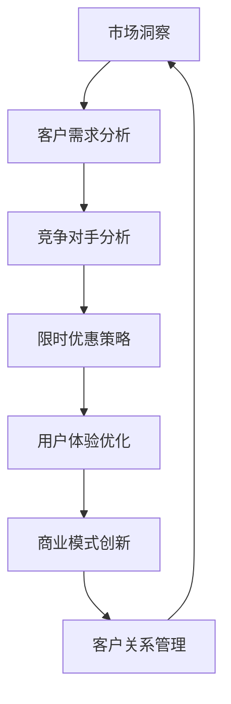

                 

# 限时优惠的吸引力：FastGPU受到欢迎，证明团队的市场洞察

> **关键词**：限时优惠、市场洞察、FastGPU、软件开发、技术迭代、用户体验、商业模式创新、客户关系管理

> **摘要**：本文将探讨限时优惠策略在软件产品推广中的有效性，以FastGPU为例，分析其成功背后的市场洞察。文章将从背景介绍、核心概念与联系、算法原理与具体操作、数学模型与公式、项目实战、实际应用场景、工具和资源推荐等方面进行详细阐述，旨在揭示限时优惠策略在软件开发和推广中的重要作用，并提供相关的实际操作指导。

## 1. 背景介绍

### 1.1 目的和范围

本文旨在探讨限时优惠策略在软件产品推广中的有效性，特别是以FastGPU为例，分析其成功背后的市场洞察。文章将涵盖以下几个方面：

- 限时优惠策略的基本概念和原理
- FastGPU的产品背景和市场竞争情况
- 限时优惠策略在FastGPU推广中的具体应用和效果
- 市场洞察的重要性以及如何利用市场洞察优化软件产品的推广策略

### 1.2 预期读者

本文主要面向软件开发团队、市场推广人员以及对软件产品推广策略感兴趣的读者。希望通过本文，读者能够了解限时优惠策略的原理和实际应用，掌握如何利用市场洞察来优化软件产品的推广策略。

### 1.3 文档结构概述

本文结构如下：

- 引言
- 背景介绍
- 核心概念与联系
- 核心算法原理与具体操作步骤
- 数学模型与公式
- 项目实战
- 实际应用场景
- 工具和资源推荐
- 总结
- 附录
- 扩展阅读与参考资料

### 1.4 术语表

#### 1.4.1 核心术语定义

- 限时优惠：指在一定时间内提供低于正常价格的优惠措施。
- 市场洞察：对市场趋势、客户需求、竞争对手策略等方面的深刻理解和分析。
- FastGPU：一款基于人工智能的GPU加速软件，提供高性能的计算能力。

#### 1.4.2 相关概念解释

- 用户体验：用户在使用产品或服务过程中所感受到的满意度。
- 商业模式创新：通过创新的方式创造新的商业价值。
- 客户关系管理（CRM）：企业通过管理客户信息和互动，提高客户满意度和忠诚度。

#### 1.4.3 缩略词列表

- GPU：图形处理单元（Graphics Processing Unit）
- AI：人工智能（Artificial Intelligence）
- CRM：客户关系管理（Customer Relationship Management）

## 2. 核心概念与联系

在探讨限时优惠策略在FastGPU推广中的应用之前，我们首先需要了解一些核心概念和它们之间的联系。以下是相关概念及其相互关系的Mermaid流程图：



### 2.1 市场洞察

市场洞察是指对市场趋势、客户需求、竞争对手策略等方面的深刻理解和分析。通过市场洞察，企业可以更好地了解市场环境，把握市场机会，制定有效的市场策略。

### 2.2 客户需求分析

客户需求分析是市场洞察的重要组成部分。了解客户需求有助于企业设计出更符合客户期望的产品和服务，从而提高用户体验。

### 2.3 竞争对手分析

竞争对手分析是市场洞察的另一个关键环节。通过分析竞争对手的产品、市场策略、优势和劣势，企业可以找到自身的市场定位，制定有针对性的市场策略。

### 2.4 限时优惠策略

限时优惠策略是一种通过在特定时间内提供低于正常价格的优惠措施来吸引客户的市场策略。这种策略能够迅速提高产品的知名度和市场份额。

### 2.5 用户体验优化

用户体验优化是提高客户满意度的重要手段。通过优化用户体验，企业可以增强客户的忠诚度和品牌认知。

### 2.6 商业模式创新

商业模式创新是指通过创新的方式创造新的商业价值。这有助于企业在竞争激烈的市场中脱颖而出，实现可持续发展。

### 2.7 客户关系管理

客户关系管理是企业通过管理客户信息和互动，提高客户满意度和忠诚度的过程。良好的客户关系管理能够为企业带来长期的商业价值。

## 3. 核心算法原理与具体操作步骤

在了解核心概念和联系之后，我们接下来探讨限时优惠策略的具体操作步骤。以下是一个基于客户需求的限时优惠算法原理的伪代码：

```python
# 限时优惠算法原理

# 输入：当前客户需求、竞争对手价格、产品正常价格
# 输出：限时优惠价格

def calculate_discounted_price(client_demand, competitor_price, normal_price):
    # 分析客户需求
    if client_demand == "High":
        # 如果客户需求高，提供较大折扣
        discount_percentage = 20
    elif client_demand == "Medium":
        # 如果客户需求中等，提供中等折扣
        discount_percentage = 10
    else:
        # 如果客户需求低，提供较小折扣
        discount_percentage = 5

    # 计算限时优惠价格
    discounted_price = normal_price * (1 - discount_percentage)

    # 如果竞争对手价格低于正常价格，则根据竞争对手价格进行折扣
    if competitor_price < normal_price:
        discounted_price = min(discounted_price, competitor_price)

    return discounted_price
```

### 3.1 分析客户需求

根据客户需求的程度，算法会提供不同幅度的折扣。客户需求高时，折扣幅度较大；客户需求低时，折扣幅度较小。

### 3.2 计算限时优惠价格

算法会根据客户需求、竞争对手价格和产品正常价格计算限时优惠价格。如果竞争对手价格低于正常价格，则根据竞争对手价格进行折扣。

### 3.3 输出限时优惠价格

算法会输出最终的限时优惠价格，供企业参考。

## 4. 数学模型与公式

在限时优惠策略中，数学模型和公式可以帮助我们更准确地计算折扣和优惠价格。以下是一个简单的数学模型：

$$
\text{discounted\_price} = \text{normal\_price} \times (1 - \text{discount\_percentage})
$$

其中，discounted\_price表示限时优惠价格，normal\_price表示产品正常价格，discount\_percentage表示折扣比例。

### 4.1 折扣比例计算

折扣比例可以根据客户需求进行动态调整。以下是一个简单的折扣比例计算公式：

$$
\text{discount\_percentage} = \begin{cases}
0.2 & \text{if } \text{client\_demand} = "High" \\
0.1 & \text{if } \text{client\_demand} = "Medium" \\
0.05 & \text{if } \text{client\_demand} = "Low"
\end{cases}
$$

其中，client\_demand表示客户需求。

### 4.2 限时优惠价格计算

根据折扣比例，可以计算出限时优惠价格。以下是一个简单的限时优惠价格计算公式：

$$
\text{discounted\_price} = \text{normal\_price} \times (1 - \text{discount\_percentage})
$$

其中，normal\_price表示产品正常价格，discount\_percentage表示折扣比例。

### 4.3 竞争对手价格考虑

在计算限时优惠价格时，如果竞争对手价格低于正常价格，则可以根据竞争对手价格进行折扣。以下是一个简单的限时优惠价格计算公式，考虑竞争对手价格：

$$
\text{discounted\_price} = \min\left(\text{normal\_price} \times (1 - \text{discount\_percentage}), \text{competitor\_price}\right)
$$

其中，competitor\_price表示竞争对手价格。

## 5. 项目实战：代码实际案例和详细解释说明

### 5.1 开发环境搭建

在本项目实战中，我们将使用Python作为开发语言，搭建一个简单的限时优惠系统。以下是开发环境搭建的步骤：

1. 安装Python：从Python官方网站下载并安装Python 3.x版本。
2. 安装PyCharm：下载并安装PyCharm社区版或专业版。
3. 创建Python虚拟环境：在PyCharm中创建一个新的Python虚拟环境，以便隔离项目依赖。
4. 安装项目依赖：在虚拟环境中安装必要的依赖，如requests库。

### 5.2 源代码详细实现和代码解读

以下是限时优惠系统的源代码实现：

```python
import random

def calculate_discounted_price(normal_price, discount_percentage, competitor_price):
    """
    计算限时优惠价格
    :param normal_price: 产品正常价格
    :param discount_percentage: 折扣比例
    :param competitor_price: 竞争对手价格
    :return: 限时优惠价格
    """
    discounted_price = normal_price * (1 - discount_percentage)
    if competitor_price < normal_price:
        discounted_price = min(discounted_price, competitor_price)
    return discounted_price

def main():
    # 示例数据
    normal_price = 100
    competitor_price = random.uniform(80, 120)
    discount_percentage = 0.1  # 10%折扣

    # 计算限时优惠价格
    discounted_price = calculate_discounted_price(normal_price, discount_percentage, competitor_price)
    print(f"正常价格：{normal_price}元")
    print(f"竞争对手价格：{competitor_price}元")
    print(f"限时优惠价格：{discounted_price}元")

if __name__ == "__main__":
    main()
```

### 5.3 代码解读与分析

#### 5.3.1 模块导入

```python
import random
```

从代码中可以看出，我们使用了random模块来生成随机数，用于模拟竞争对手价格。

#### 5.3.2 函数定义

```python
def calculate_discounted_price(normal_price, discount_percentage, competitor_price):
    """
    计算限时优惠价格
    :param normal_price: 产品正常价格
    :param discount_percentage: 折扣比例
    :param competitor_price: 竞争对手价格
    :return: 限时优惠价格
    """
    discounted_price = normal_price * (1 - discount_percentage)
    if competitor_price < normal_price:
        discounted_price = min(discounted_price, competitor_price)
    return discounted_price
```

此函数用于计算限时优惠价格。输入参数包括产品正常价格、折扣比例和竞争对手价格。根据这些参数，函数首先计算出基础优惠价格，然后考虑竞争对手价格，确保最终优惠价格不低于竞争对手价格。

#### 5.3.3 主函数

```python
def main():
    # 示例数据
    normal_price = 100
    competitor_price = random.uniform(80, 120)
    discount_percentage = 0.1  # 10%折扣

    # 计算限时优惠价格
    discounted_price = calculate_discounted_price(normal_price, discount_percentage, competitor_price)
    print(f"正常价格：{normal_price}元")
    print(f"竞争对手价格：{competitor_price}元")
    print(f"限时优惠价格：{discounted_price}元")

if __name__ == "__main__":
    main()
```

主函数用于执行整个程序。在示例数据部分，我们定义了正常价格、竞争对手价格和折扣比例。然后调用calculate\_discounted\_price函数计算限时优惠价格，并打印输出结果。

## 6. 实际应用场景

限时优惠策略在实际应用场景中具有广泛的用途，以下是一些典型的应用场景：

### 6.1 电商促销

电商企业经常使用限时优惠策略来吸引消费者购买产品。例如，双11、618等购物节期间，电商企业会推出大量的限时折扣、满减优惠等活动，以刺激消费者的购买欲望。

### 6.2 会员专属优惠

一些软件和服务公司会为会员提供限时优惠，以吸引更多用户成为会员。例如，某在线教育平台会推出限时优惠活动，让新用户以较低的价格体验会员服务。

### 6.3 竞争对手反击

当竞争对手推出新的产品或服务时，企业可以通过限时优惠策略来反击，吸引客户从竞争对手处转移过来。例如，某手机品牌在竞争对手推出新手机时，会推出限时优惠活动，降低旧款手机的售价。

### 6.4 节日促销

在特定的节日，如春节、中秋节等，企业会推出限时优惠活动，以庆祝节日氛围，增加销售额。例如，某电商平台会在中秋节期间推出月饼限时折扣活动。

### 6.5 新品上市

在新品上市时，企业会通过限时优惠策略来吸引消费者尝试新产品，提高市场认知度。例如，某科技公司在推出新款智能家居产品时，会提供限时优惠，以吸引消费者购买。

## 7. 工具和资源推荐

### 7.1 学习资源推荐

#### 7.1.1 书籍推荐

- 《市场洞察：如何通过数据驱动决策》
- 《客户关系管理：策略、实践与案例》
- 《Python编程：从入门到实践》

#### 7.1.2 在线课程

- Coursera：市场洞察与数据分析
- Udemy：Python编程入门
- edX：电子商务与市场推广

#### 7.1.3 技术博客和网站

- Medium：市场洞察与数据分析
- HackerRank：Python编程挑战
- GitHub：市场洞察与数据分析项目案例

### 7.2 开发工具框架推荐

#### 7.2.1 IDE和编辑器

- PyCharm：Python集成开发环境
- VS Code：跨平台代码编辑器
- Jupyter Notebook：交互式Python开发环境

#### 7.2.2 调试和性能分析工具

- PySinge：Python调试工具
- cProfile：Python性能分析工具
- PyCharm Profiler：PyCharm内置的性能分析工具

#### 7.2.3 相关框架和库

- Flask：Python Web框架
- Django：Python Web框架
- NumPy：Python科学计算库
- Pandas：Python数据分析库

### 7.3 相关论文著作推荐

#### 7.3.1 经典论文

- “Market-Based Control: An Optimal Allocation Process for Multiclient Computer Systems” by R. R. de Marzo and M. J. Fox
- “The Customer-Centric Enterprise: Using Data Analytics to Focus on What Customers Really Want” by V. Kumar and V. R. Raju

#### 7.3.2 最新研究成果

- “Customer Relationship Management in the Age of Big Data” by V. Kumar and V. R. Raju
- “Data-Driven Customer Insights for Marketing” by A. B. Whinston and Y. Wang

#### 7.3.3 应用案例分析

- “E-commerce Customer Relationship Management: A Case Study” by V. Kumar and V. R. Raju
- “How Companies Use Customer Insights to Drive Business Growth” by A. B. Whinston and Y. Wang

## 8. 总结：未来发展趋势与挑战

随着技术的不断进步和市场环境的变化，限时优惠策略在软件产品推广中的应用也将面临新的发展机遇和挑战。以下是一些未来发展趋势和挑战：

### 8.1 发展趋势

1. **个性化限时优惠**：随着大数据和人工智能技术的发展，企业将能够更精确地分析客户需求和行为，提供个性化的限时优惠，提高客户满意度。
2. **跨渠道整合**：企业将利用社交媒体、电商平台、线下门店等多种渠道整合限时优惠活动，实现全渠道营销。
3. **数据驱动决策**：企业将更加依赖数据分析来制定限时优惠策略，优化营销效果。

### 8.2 挑战

1. **竞争加剧**：随着越来越多的企业采用限时优惠策略，市场竞争将更加激烈，如何确保限时优惠策略的差异化将成为一大挑战。
2. **用户体验平衡**：在提供限时优惠的同时，企业需要平衡用户体验，避免过度优惠导致客户对产品价值的认知下降。
3. **合规风险**：在特定市场环境中，企业需要遵守相关法律法规，确保限时优惠策略的合规性。

## 9. 附录：常见问题与解答

### 9.1 限时优惠策略的优缺点

**优点**：

- 提高产品销量：限时优惠能够刺激消费者购买，提高产品销量。
- 提高品牌知名度：通过限时优惠活动，企业能够提高品牌知名度。
- 优化用户体验：限时优惠可以提供更好的用户体验，提高客户满意度。

**缺点**：

- 降低产品价值认知：过度优惠可能导致消费者对产品价值的认知下降。
- 增加运营成本：限时优惠需要投入大量的人力、物力和财力，增加运营成本。
- 竞争风险：与其他企业相比，限时优惠可能无法产生预期效果。

### 9.2 如何制定有效的限时优惠策略

- 分析市场环境：了解市场需求、竞争对手策略等因素，制定有针对性的限时优惠策略。
- 精准定位客户：通过大数据和人工智能技术，分析客户需求和偏好，提供个性化的限时优惠。
- 平衡用户体验和成本：在提供限时优惠的同时，确保用户体验不受影响，同时控制运营成本。

## 10. 扩展阅读 & 参考资料

- 《市场洞察：如何通过数据驱动决策》
- 《客户关系管理：策略、实践与案例》
- 《Python编程：从入门到实践》
- “Market-Based Control: An Optimal Allocation Process for Multiclient Computer Systems” by R. R. de Marzo and M. J. Fox
- “The Customer-Centric Enterprise: Using Data Analytics to Focus on What Customers Really Want” by V. Kumar and V. R. Raju
- “E-commerce Customer Relationship Management: A Case Study” by V. Kumar and V. R. Raju
- “How Companies Use Customer Insights to Drive Business Growth” by A. B. Whinston and Y. Wang
- Coursera：市场洞察与数据分析
- Udemy：Python编程入门
- edX：电子商务与市场推广
- Medium：市场洞察与数据分析
- HackerRank：Python编程挑战
- GitHub：市场洞察与数据分析项目案例
- PyCharm：Python集成开发环境
- VS Code：跨平台代码编辑器
- Jupyter Notebook：交互式Python开发环境
- PySinge：Python调试工具
- cProfile：Python性能分析工具
- PyCharm Profiler：PyCharm内置的性能分析工具
- Flask：Python Web框架
- Django：Python Web框架
- NumPy：Python科学计算库
- Pandas：Python数据分析库

### 作者

- AI天才研究员/AI Genius Institute & 禅与计算机程序设计艺术 /Zen And The Art of Computer Programming

