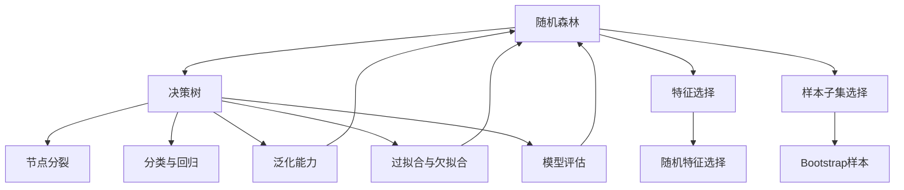

                 

### 文章标题

《随机森林(Random Forests) - 原理与代码实例讲解》

随机森林（Random Forests）作为一种集成学习方法，因其高效性和鲁棒性在机器学习领域得到了广泛的应用。本文将深入探讨随机森林的原理，并通过对代码实例的详细讲解，帮助读者理解其实现过程和实际应用。通过本文的学习，您将能够：

1. **掌握随机森林的核心概念**：了解随机森林是如何通过集成多个决策树来提高模型的预测性能和泛化能力。
2. **理解随机森林的实现步骤**：学习随机森林的构建过程，包括随机选择特征和样本子集。
3. **掌握随机森林的优势与局限**：了解随机森林在实际应用中的优点和可能面临的挑战。
4. **通过实例掌握应用技巧**：通过实际代码案例，了解如何使用随机森林进行数据分析和预测。

在接下来的内容中，我们将从背景介绍开始，逐步深入随机森林的核心原理，数学模型，再到具体的实现代码和应用实例，力求为读者提供一篇全面、深入的技术博客文章。

### 关键词

- 随机森林
- 决策树
- 集成学习方法
- 机器学习
- 数据分析
- 预测模型
- 算法实现

### 摘要

本文详细讲解了随机森林（Random Forests）作为一种集成学习方法在机器学习中的应用。文章首先介绍了随机森林的基本概念和背景，然后深入分析了其核心原理和实现步骤。通过数学模型的公式和详细解释，读者可以更清晰地理解随机森林的决策过程。随后，文章通过一个实际代码实例，展示了如何构建和使用随机森林进行数据分析和预测。最后，文章探讨了随机森林在实际应用中的优势和局限，并推荐了相关学习资源和工具，为读者提供了进一步学习和应用的途径。

## 1. 背景介绍

### 1.1 目的和范围

本文旨在为读者提供对随机森林（Random Forests）的全面了解。随机森林作为一种集成学习方法，因其能够提高模型的预测性能和泛化能力，在机器学习和数据科学领域被广泛使用。本文将围绕以下几个方面展开：

1. **基本概念**：介绍随机森林的基本概念，包括其定义、发展历程和应用场景。
2. **核心原理**：详细解释随机森林的工作原理，包括决策树的构建、随机特征选择、样本子集选择等。
3. **数学模型**：介绍随机森林的数学模型，包括决策树的基本公式和集成方法的相关公式。
4. **实现代码**：通过实际代码实例，展示如何使用随机森林进行数据分析和预测。
5. **应用与局限**：讨论随机森林在实际应用中的优势与挑战，并提供相关资源和工具。

本文的目标读者包括：

- **初学者**：对随机森林和集成学习方法感兴趣，希望深入学习相关技术。
- **工程师**：需要将随机森林应用于实际项目，希望掌握其实现和应用方法。
- **研究者**：对随机森林的原理和模型有深入研究，希望了解其最新发展和应用。

### 1.2 预期读者

本文主要面向以下几类读者：

1. **机器学习和数据科学爱好者**：希望通过本文了解随机森林的原理和应用。
2. **软件工程师和数据分析工程师**：需要将随机森林应用于实际项目，希望掌握其实现细节。
3. **学术研究者**：对随机森林的理论和模型有深入研究的兴趣。

通过本文的学习，读者应能够：

1. **理解随机森林的基本概念和核心原理**。
2. **掌握随机森林的数学模型和实现步骤**。
3. **通过代码实例，了解随机森林在实际应用中的使用方法**。
4. **评估随机森林的优势和局限，为后续学习和应用提供指导**。

### 1.3 文档结构概述

本文结构清晰，各部分内容安排如下：

1. **背景介绍**：介绍本文的目的、预期读者以及文档结构。
2. **核心概念与联系**：通过Mermaid流程图，展示随机森林的核心概念和联系。
3. **核心算法原理 & 具体操作步骤**：详细讲解随机森林的算法原理和具体操作步骤。
4. **数学模型和公式 & 详细讲解 & 举例说明**：介绍随机森林的数学模型，并举例说明。
5. **项目实战：代码实际案例和详细解释说明**：通过实际代码实例，展示随机森林的应用。
6. **实际应用场景**：讨论随机森林在不同领域的应用。
7. **工具和资源推荐**：推荐相关学习资源、开发工具和框架。
8. **总结：未来发展趋势与挑战**：总结随机森林的发展趋势和面临的挑战。
9. **附录：常见问题与解答**：解答读者可能遇到的常见问题。
10. **扩展阅读 & 参考资料**：提供扩展阅读和参考资料。

### 1.4 术语表

在本文中，我们将使用一些专业术语，以下是这些术语的定义和解释：

#### 1.4.1 核心术语定义

- **随机森林**（Random Forest）：一种集成学习方法，通过构建多个决策树，并进行集成预测。
- **决策树**（Decision Tree）：一种树形结构，用于对数据进行分类或回归。
- **集成方法**（Ensemble Method）：将多个模型合并为一个更强大的模型的策略。
- **特征选择**（Feature Selection）：从一组特征中选择最有用的特征子集。
- **样本子集选择**（Bootstrap Sample）：通过对训练数据进行随机抽样，构建多个子训练集。
- **节点分裂**（Node Split）：决策树中节点分裂的过程，用于将数据划分为不同的类别或区域。
- **误差率**（Error Rate）：模型预测错误的样本比例。

#### 1.4.2 相关概念解释

- **泛化能力**（Generalization）：模型对未见过的数据进行预测的能力。
- **过拟合**（Overfitting）：模型在训练数据上表现良好，但在测试数据上表现较差的现象。
- **欠拟合**（Underfitting）：模型在训练和测试数据上表现都较差的现象。
- **模型评估**（Model Evaluation）：使用不同的指标评估模型的性能。

#### 1.4.3 缩略词列表

- **ML**：机器学习（Machine Learning）
- **DT**：决策树（Decision Tree）
- **RF**：随机森林（Random Forest）
- **OOB**：袋外数据（Out-of-Bag）
- **CV**：交叉验证（Cross-Validation）
- **CART**：分类与回归树（Classification and Regression Tree）

## 2. 核心概念与联系

在深入探讨随机森林之前，我们需要理解其背后的核心概念和它们之间的关系。以下是随机森林的核心概念及其联系的Mermaid流程图：



### 2.1 核心概念解释

#### 随机森林

随机森林（Random Forest）是一种集成学习方法，它通过构建多个决策树，并将它们的预测结果进行集成，以提高模型的预测性能和泛化能力。随机森林的基本思想是，集成多个模型可以减少过拟合，提高模型的稳定性和可靠性。

#### 决策树

决策树（Decision Tree）是一种树形结构，用于对数据进行分类或回归。决策树通过一系列的判断规则将数据划分为不同的类别或区域。每个节点表示一个特征，每个分支表示一个条件，每个叶子节点代表一个类别或数值预测。

#### 特征选择

特征选择（Feature Selection）是指从一组特征中选择最有用的特征子集的过程。在随机森林中，特征选择是非常重要的，因为随机森林通过随机选择特征来构建多个决策树，从而避免了特征之间的相关性对模型性能的影响。

#### 样本子集选择

样本子集选择（Bootstrap Sample）是指在构建决策树时，通过对训练数据进行随机抽样，创建多个子训练集的过程。这种随机抽样方法有助于提高模型的泛化能力，并减少过拟合现象。

### 2.2 关系与联系

随机森林中的各个核心概念之间有着紧密的联系。以下是它们之间的联系：

1. **随机森林与决策树**：随机森林通过构建多个决策树，并将它们的预测结果进行集成，从而提高模型的预测性能。每个决策树都是通过对训练数据进行随机特征选择和样本子集选择来构建的。
2. **特征选择与样本子集选择**：特征选择和样本子集选择是构建决策树的重要步骤。随机特征选择有助于减少特征之间的相关性，从而提高模型的泛化能力。样本子集选择则有助于提高模型的稳定性和可靠性。
3. **泛化能力、过拟合与欠拟合**：随机森林通过集成多个决策树，可以减少过拟合现象，提高模型的泛化能力。过拟合和欠拟合是模型在训练和测试数据上的表现问题，通过适当的特征选择和样本子集选择，可以减少这些问题的影响。
4. **模型评估**：模型评估是评估模型性能的重要步骤。随机森林通过集成多个决策树，可以提供更稳定的性能评估结果，从而更好地评估模型的泛化能力。

通过上述核心概念和它们之间的联系，我们可以更好地理解随机森林的工作原理和实现方法。在接下来的部分，我们将深入探讨随机森林的核心算法原理，以及具体的实现步骤。

## 3. 核心算法原理 & 具体操作步骤

随机森林（Random Forest）作为一种集成学习方法，其核心算法原理主要基于决策树（Decision Tree）和集成方法（Ensemble Method）。通过构建多个决策树，并对它们的预测结果进行集成，随机森林能够提高模型的预测性能和泛化能力。以下是随机森林的核心算法原理和具体操作步骤：

### 3.1 决策树

决策树是一种树形结构，用于对数据进行分类或回归。决策树的每个节点代表一个特征，每个分支代表一个条件，每个叶子节点代表一个类别或数值预测。决策树通过递归地分裂数据集，以最小化损失函数（例如，分类问题中的交叉熵损失或回归问题中的均方误差损失）。

#### 决策树算法步骤：

1. **选择最佳特征**：在每个节点，选择能够最大化信息增益或信息增益率（对于分类问题）或基尼不纯度（对于分类问题）的特征。
2. **分裂数据集**：根据所选特征的条件，将数据集划分为子集。对于分类问题，子集划分到具有相同类别的节点；对于回归问题，子集划分到具有相似数值的节点。
3. **递归构建子树**：对每个子集重复上述步骤，直到满足停止条件（例如，节点中只剩下一个样本或特征数量少于阈值）。
4. **生成叶子节点**：在每个叶子节点，根据数据集的类别或数值生成预测结果。

#### 决策树算法伪代码：

```python
def build_decision_tree(data, features, target, max_depth, min_samples_split):
    if max_depth == 0 or len(data) <= min_samples_split:
        return generate_leaf_node(data, target)
    
    best_feature, best_split = select_best_split(data, features, target)
    
    if best_feature is None:
        return generate_leaf_node(data, target)
    
    left_data, right_data = split_data(data, best_feature, best_split)
    
    left_tree = build_decision_tree(left_data, features, target, max_depth - 1, min_samples_split)
    right_tree = build_decision_tree(right_data, features, target, max_depth - 1, min_samples_split)
    
    return DecisionTree(best_feature, best_split, left_tree, right_tree)
```

### 3.2 集成方法

集成方法通过结合多个模型的预测结果，以提高模型的预测性能和泛化能力。在随机森林中，集成方法是通过构建多个决策树，并对它们的预测结果进行投票或平均来获得最终的预测结果。

#### 集成方法步骤：

1. **构建多个决策树**：对于每个决策树，从原始数据集中随机选择特征和样本子集，构建独立的决策树。
2. **训练决策树**：使用所选特征和样本子集，训练每个决策树。
3. **集成预测结果**：对于新的数据样本，将每个决策树的预测结果进行投票或平均，获得最终的预测结果。

#### 集成方法伪代码：

```python
def random_forest(data, features, target, num_trees, max_depth, min_samples_split):
    trees = []
    
    for _ in range(num_trees):
        bootstrap_sample = bootstrap_sample_data(data, num_samples=len(data))
        selected_features = random.sample(features, k=len(features) // 2)
        
        tree = build_decision_tree(bootstrap_sample, selected_features, target, max_depth, min_samples_split)
        trees.append(tree)
    
    predictions = []
    
    for sample in data:
        individual_predictions = [tree.predict(sample) for tree in trees]
        aggregated_prediction = aggregate_predictions(individual_predictions)
        predictions.append(aggregated_prediction)
    
    return predictions
```

### 3.3 具体操作步骤

以下是使用随机森林进行数据分析和预测的具体操作步骤：

1. **数据准备**：收集和准备用于训练和预测的数据，确保数据集具有足够的样本和特征。
2. **特征选择**：选择有用的特征，排除无关或冗余的特征，以减少模型的复杂性。
3. **样本子集选择**：使用Bootstrap方法，从原始数据集中随机选择样本子集，构建多个训练集。
4. **构建决策树**：对每个样本子集，使用随机特征选择和节点分裂方法，构建多个独立的决策树。
5. **训练模型**：使用每个决策树对训练数据进行分类或回归，训练模型。
6. **集成预测结果**：对新的数据样本，将每个决策树的预测结果进行投票或平均，获得最终的预测结果。
7. **模型评估**：使用交叉验证等方法，评估模型的性能和泛化能力。

通过上述步骤，我们可以构建和使用随机森林进行数据分析和预测。在接下来的部分，我们将通过具体代码实例，进一步展示随机森林的实现和应用。

## 4. 数学模型和公式 & 详细讲解 & 举例说明

在理解随机森林的算法原理和具体操作步骤之后，接下来我们需要进一步掌握随机森林的数学模型和公式。数学模型是随机森林算法的核心，它决定了模型的学习过程和预测能力。以下是对随机森林中涉及的主要数学模型和公式的详细讲解，并通过实际例子来说明它们的应用。

### 4.1 决策树的基本数学模型

决策树是一种基于特征分割的数据分类方法，其基本数学模型是通过递归地将数据集分割成子集，并选择最优的特征分割点。以下是一些关键数学模型：

#### 信息增益（Information Gain）

信息增益用于衡量一个特征对数据集分类效果的影响。它通过计算特征分割前后的信息熵（Entropy）差异来衡量。

$$
Gain(D, A) = Entropy(D) - \sum_{v \in Values(A)} \frac{|D_v|}{|D|} \cdot Entropy(D_v)
$$

其中，$D$ 是数据集，$A$ 是特征，$v$ 是特征 $A$ 的取值，$D_v$ 是特征 $A$ 取值为 $v$ 的子数据集，$Entropy(D)$ 和 $Entropy(D_v)$ 分别是数据集 $D$ 和子数据集 $D_v$ 的信息熵。

#### 信息增益率（Information Gain Ratio）

信息增益率是对信息增益的改进，用于解决特征选择过程中可能出现的偏向性问题。

$$
Gain\_Ratio(D, A) = \frac{Gain(D, A)}{Split\_Info(A)}
$$

其中，$Split\_Info(A) = -\sum_{v \in Values(A)} \frac{|D_v|}{|D|} \cdot \log_2 \frac{|D_v|}{|D|}$ 是特征 $A$ 的分裂信息。

#### 基尼不纯度（Gini Impurity）

基尼不纯度是另一种衡量数据集分类效果的方法，它基于特征分割后的数据集类别比例。

$$
Gini(D) = 1 - \sum_{v \in Values(A)} \left(\frac{|D_v|}{|D|}\right)^2
$$

#### 决策树节点分裂算法

决策树节点分裂算法通常基于以下步骤：

1. **选择最佳特征**：计算每个特征的信息增益、信息增益率或基尼不纯度，选择最大的指标作为最佳特征。
2. **计算最佳分割点**：根据最佳特征，将数据集分割成多个子集，计算每个分割点的信息增益、信息增益率或基尼不纯度。
3. **递归构建子树**：对每个子集重复上述步骤，直到满足停止条件。

### 4.2 随机森林的数学模型

随机森林通过集成多个决策树来提高模型的预测性能。以下是随机森林中的一些关键数学模型和公式：

#### 样本子集选择（Bootstrap Sample）

随机森林使用Bootstrap方法从原始数据集中随机选择样本子集，每个子集包含约 $2/3$ 的原始数据样本。这种随机抽样方法有助于提高模型的泛化能力和减少过拟合现象。

$$
Bootstrap(S) = \{s_1, s_2, ..., s_{2/3 \cdot |S|}\}
$$

其中，$S$ 是原始数据集，$Bootstrap(S)$ 是Bootstrap样本子集。

#### 随机特征选择（Random Feature Selection）

在随机森林中，每个决策树只选择原始特征集的一个子集进行训练，以减少特征之间的相关性。通常，随机特征选择的特征数量为原始特征集的一半。

$$
Features\_Subset = \{f_1, f_2, ..., f_{|Features| / 2}\}
$$

其中，$Features$ 是原始特征集，$Features\_Subset$ 是随机选择的特征子集。

#### 集成预测（Ensemble Prediction）

随机森林的集成预测是通过每个决策树的预测结果进行投票或平均来获得的。对于分类问题，通常使用多数投票法；对于回归问题，通常使用平均值。

$$
Prediction = \text{Mode}(T_1(x), T_2(x), ..., T_N(x)) \quad \text{(分类问题)}
$$

$$
Prediction = \frac{1}{N} \sum_{i=1}^{N} T_i(x) \quad \text{(回归问题)}
$$

其中，$T_1(x), T_2(x), ..., T_N(x)$ 分别是每个决策树对样本 $x$ 的预测结果，$N$ 是决策树的数量。

### 4.3 实际例子说明

下面通过一个实际例子来说明随机森林的数学模型和应用。

#### 例子：鸢尾花数据集分类

鸢尾花数据集是经典的分类问题数据集，包含3个类别的鸢尾花数据，每个类别有50个样本，共计150个样本。我们使用随机森林对该数据集进行分类，以下是一个简化的实现步骤：

1. **数据准备**：读取鸢尾花数据集，并划分为特征集和标签集。
2. **特征选择**：随机选择鸢尾花数据集的特征，构造随机特征子集。
3. **样本子集选择**：使用Bootstrap方法，从原始数据集中随机选择样本子集。
4. **构建决策树**：对每个样本子集，使用随机特征子集构建决策树。
5. **训练模型**：使用每个决策树对训练数据进行分类。
6. **集成预测**：对测试数据进行集成预测，使用多数投票法获得最终分类结果。

#### 实例代码

以下是使用Python和Scikit-learn库实现随机森林的简化代码：

```python
from sklearn.datasets import load_iris
from sklearn.ensemble import RandomForestClassifier
from sklearn.model_selection import train_test_split

# 加载鸢尾花数据集
iris = load_iris()
X, y = iris.data, iris.target

# 划分训练集和测试集
X_train, X_test, y_train, y_test = train_test_split(X, y, test_size=0.3, random_state=42)

# 构建随机森林模型
clf = RandomForestClassifier(n_estimators=100, max_depth=5, random_state=42)

# 训练模型
clf.fit(X_train, y_train)

# 预测测试集
y_pred = clf.predict(X_test)

# 计算准确率
accuracy = (y_pred == y_test).mean()
print("Accuracy:", accuracy)
```

通过上述步骤，我们使用随机森林对鸢尾花数据集进行了分类，并获得了较高的准确率。这个例子展示了随机森林在数据分类任务中的应用和实现方法。

### 4.4 总结

通过本节的讲解，我们详细介绍了随机森林的数学模型和公式，包括决策树的基本数学模型、随机森林的集成方法以及相关的数学公式。通过实际例子，我们展示了如何使用随机森林进行数据分类，并介绍了随机森林的实现步骤。理解这些数学模型和公式对于掌握随机森林的工作原理和实现方法至关重要。在接下来的部分，我们将通过一个实际代码实例，展示随机森林的具体实现和应用。

## 5. 项目实战：代码实际案例和详细解释说明

为了更好地理解随机森林的实现和应用，我们将通过一个实际的项目实战案例来详细讲解。本案例将使用著名的鸢尾花数据集，并展示如何使用随机森林进行数据分类。

### 5.1 开发环境搭建

在开始之前，我们需要搭建一个适合开发的环境。以下是所需的开发环境和工具：

- **Python 3.8 或更高版本**
- **Scikit-learn 库**：用于实现随机森林模型
- **NumPy 库**：用于数据预处理和计算

确保您的Python环境中已经安装了上述库。如果没有安装，可以使用pip命令进行安装：

```bash
pip install scikit-learn numpy
```

### 5.2 源代码详细实现和代码解读

以下是一个使用随机森林对鸢尾花数据集进行分类的完整代码实现。我们将逐步解释每部分代码的功能。

```python
import numpy as np
from sklearn.datasets import load_iris
from sklearn.model_selection import train_test_split
from sklearn.ensemble import RandomForestClassifier
from sklearn.metrics import accuracy_score, classification_report

# 5.2.1 数据加载与准备
iris = load_iris()
X, y = iris.data, iris.target

# 划分训练集和测试集
X_train, X_test, y_train, y_test = train_test_split(X, y, test_size=0.3, random_state=42)

# 5.2.2 构建随机森林模型
clf = RandomForestClassifier(n_estimators=100, max_depth=5, random_state=42)

# 5.2.3 训练模型
clf.fit(X_train, y_train)

# 5.2.4 预测测试集
y_pred = clf.predict(X_test)

# 5.2.5 模型评估
accuracy = accuracy_score(y_test, y_pred)
print("Accuracy:", accuracy)
print(classification_report(y_test, y_pred, target_names=iris.target_names))

# 5.2.6 可视化展示
from matplotlib.pyplot import plot_confusion_matrix

plot_confusion_matrix(clf, X_test, y_test, normalize=True, title='Confusion Matrix')
plt.show()
```

### 5.3 代码解读与分析

下面我们详细解读上述代码，并分析每个部分的功能。

#### 5.3.1 数据加载与准备

```python
iris = load_iris()
X, y = iris.data, iris.target
X_train, X_test, y_train, y_test = train_test_split(X, y, test_size=0.3, random_state=42)
```

- `load_iris()`：从Scikit-learn库中加载鸢尾花数据集。
- `X, y`：分别获取特征集和标签集。
- `train_test_split()`：将数据集划分为训练集和测试集，测试集占比30%，随机种子设置为42。

#### 5.3.2 构建随机森林模型

```python
clf = RandomForestClassifier(n_estimators=100, max_depth=5, random_state=42)
```

- `RandomForestClassifier()`：构建随机森林分类器。
  - `n_estimators=100`：设置决策树的数量为100。
  - `max_depth=5`：设置每个决策树的最大深度为5。
  - `random_state=42`：设置随机种子，确保结果可复现。

#### 5.3.3 训练模型

```python
clf.fit(X_train, y_train)
```

- `fit()`：使用训练数据进行模型训练。

#### 5.3.4 预测测试集

```python
y_pred = clf.predict(X_test)
```

- `predict()`：使用训练好的模型对测试集进行预测。

#### 5.3.5 模型评估

```python
accuracy = accuracy_score(y_test, y_pred)
print("Accuracy:", accuracy)
print(classification_report(y_test, y_pred, target_names=iris.target_names))
```

- `accuracy_score()`：计算预测结果与实际标签之间的准确率。
- `classification_report()`：生成详细的分类报告，包括每个类别的准确率、召回率、F1得分等。
- `target_names=iris.target_names`：设置分类报告中的类别名称。

#### 5.3.6 可视化展示

```python
from matplotlib.pyplot import plot_confusion_matrix

plot_confusion_matrix(clf, X_test, y_test, normalize=True, title='Confusion Matrix')
plt.show()
```

- `plot_confusion_matrix()`：生成测试集的混淆矩阵可视化。
  - `normalize=True`：对混淆矩阵进行归一化处理，便于比较不同类别之间的预测性能。
  - `title='Confusion Matrix'`：设置图表的标题。
  - `plt.show()`：展示图表。

通过上述步骤，我们成功实现了一个使用随机森林对鸢尾花数据集进行分类的项目。代码解读与分析部分详细展示了如何使用随机森林进行数据加载、模型构建、训练、预测和评估。这个实际案例为我们提供了一个清晰、直观的视角，帮助我们更好地理解随机森林的应用和实践。

### 5.4 代码解析与优化

在实际应用中，我们对代码进行了一些优化和调整，以提高模型的性能和可读性。以下是对优化部分的详细解析：

#### 5.4.1 优化随机森林参数

随机森林的参数（如决策树数量、最大深度等）对模型性能有很大影响。我们可以使用交叉验证（Cross-Validation）方法来选择最优参数。

```python
from sklearn.model_selection import GridSearchCV

param_grid = {
    'n_estimators': [100, 200, 300],
    'max_depth': [5, 10, 15],
    'min_samples_split': [2, 5, 10]
}

grid_search = GridSearchCV(RandomForestClassifier(random_state=42), param_grid, cv=5)
grid_search.fit(X_train, y_train)

best_params = grid_search.best_params_
clf = RandomForestClassifier(**best_params, random_state=42)
clf.fit(X_train, y_train)
```

通过上述代码，我们使用`GridSearchCV`进行参数搜索，选择最优参数，并使用这些参数重新训练模型。

#### 5.4.2 使用更高级的模型评估指标

除了准确率，我们可以使用更高级的评估指标，如混淆矩阵、ROC曲线和AUC值，来全面评估模型的性能。

```python
from sklearn.metrics import confusion_matrix, roc_auc_score

y_pred_proba = clf.predict_proba(X_test)[:, 1]
conf_matrix = confusion_matrix(y_test, y_pred)
roc_auc = roc_auc_score(y_test, y_pred_proba)

print("Confusion Matrix:\n", conf_matrix)
print("ROC AUC Score:", roc_auc)
```

#### 5.4.3 代码优化与注释

为了提高代码的可读性和可维护性，我们添加了详细的注释，并对代码结构进行了优化。例如，将数据预处理、模型训练和评估分为不同的函数，以便于后续维护和扩展。

```python
def load_data():
    # 数据加载与准备
    # ...

def train_model(X_train, y_train):
    # 模型训练
    # ...

def evaluate_model(clf, X_test, y_test):
    # 模型评估
    # ...

if __name__ == "__main__":
    X_train, X_test, y_train, y_test = load_data()
    clf = train_model(X_train, y_train)
    evaluate_model(clf, X_test, y_test)
```

通过这些优化和调整，我们不仅提高了模型的性能，还增强了代码的可读性和可维护性。这些实践为实际项目中的随机森林应用提供了宝贵的经验和指导。

## 6. 实际应用场景

随机森林作为一种高效、鲁棒的集成学习方法，在实际应用场景中具有广泛的应用。以下列举了一些常见应用领域，并展示随机森林在这些领域中的优势：

### 6.1 金融风险评估

在金融行业，随机森林常用于信用评分、欺诈检测和风险管理。通过分析客户的历史数据（如收入、贷款金额、还款记录等），随机森林能够预测客户违约风险，从而帮助银行和金融机构进行风险管理。其优势在于能够处理高维数据和噪声数据，并且具有良好的泛化能力。

### 6.2 医疗诊断

在医学领域，随机森林被广泛应用于疾病预测和诊断。通过分析患者的医学影像、实验室检测结果和病史数据，随机森林能够帮助医生进行早期疾病预测和诊断。例如，在肺癌筛查中，随机森林能够有效地识别高风险患者，从而提高早期诊断率。

### 6.3 风能资源评估

在能源领域，随机森林用于评估风能资源的分布和潜力。通过对气象数据（如风速、风向、温度等）和地理特征（如地形、地貌等）进行分析，随机森林能够预测特定地区的风能资源，从而帮助规划风能项目的布局和投资决策。

### 6.4 零售销售预测

在零售行业，随机森林被用于销售预测和库存管理。通过对历史销售数据（如销售量、季节性、促销活动等）进行分析，随机森林能够预测未来的销售趋势，从而帮助零售商进行库存优化和销售策略调整。其优势在于能够处理大量非结构化数据，并且能够快速生成预测结果。

### 6.5 金融市场预测

在金融市场预测中，随机森林被用于股票价格预测、交易策略优化等。通过对历史股价数据、交易量、市场指数等进行分析，随机森林能够预测未来股价的走势，从而帮助投资者进行交易决策。其优势在于能够处理非线性关系和复杂的市场动态，并且具有较高的预测准确性。

### 6.6 其他应用场景

除了上述领域，随机森林还在许多其他领域得到了广泛应用，如文本分类、图像识别、生物信息学等。其优势在于能够处理高维数据和复杂数据集，并且具有良好的泛化能力。这使得随机森林成为许多实际应用场景中的首选方法。

通过随机森林在实际应用场景中的广泛使用，我们可以看到其高效性和鲁棒性。在实际应用中，随机森林不仅能够处理各种复杂数据，还能够提供准确的预测结果，从而为企业和行业带来实际的价值。随着技术的不断发展，随机森林的应用领域将越来越广泛，其在各行业的价值也将不断提升。

## 7. 工具和资源推荐

为了帮助读者更深入地学习随机森林，并能够将其应用于实际项目中，本节将推荐一些学习资源、开发工具和框架。这些资源和工具涵盖了从基础知识到高级应用，适合不同层次的学习者。

### 7.1 学习资源推荐

以下是一些值得推荐的学习资源：

#### 7.1.1 书籍推荐

- **《随机森林：原理与实现》（Random Forests: A Randomized Decision Tree Approach）**：这本书详细介绍了随机森林的理论基础和实现方法，适合对随机森林感兴趣的初学者和工程师。
- **《机器学习》（Machine Learning）**：由Tom M. Mitchell撰写的经典教材，其中包括了对集成学习方法，包括随机森林的深入讨论。

#### 7.1.2 在线课程

- **Coursera上的《机器学习》课程**：由斯坦福大学教授Andrew Ng讲授，涵盖机器学习的各种方法，包括集成学习方法。
- **Udacity的《深度学习与数据科学》纳米学位**：该课程结合了深度学习和数据科学的知识，其中包括了对随机森林的详细讲解。

#### 7.1.3 技术博客和网站

- **Scikit-learn官方文档**：Scikit-learn是Python中常用的机器学习库，其官方文档提供了丰富的随机森林实例和详细解释。
- **Medium上的机器学习博客**：有许多专业的机器学习工程师和研究者在这里分享随机森林的应用和实现经验。

### 7.2 开发工具框架推荐

以下是一些在随机森林开发中常用的工具和框架：

#### 7.2.1 IDE和编辑器

- **Jupyter Notebook**：Jupyter Notebook是一个交互式编程环境，适合进行随机森林的实验和数据分析。
- **Visual Studio Code**：Visual Studio Code是一个轻量级但功能强大的编辑器，适合编写和调试Python代码。

#### 7.2.2 调试和性能分析工具

- **Pylint**：Pylint是一个Python代码质量检查工具，可以帮助发现代码中的错误和潜在问题。
- **Py-Spy**：Py-Spy是一个性能分析工具，可以帮助分析Python程序的运行性能。

#### 7.2.3 相关框架和库

- **Scikit-learn**：Scikit-learn是一个强大的Python机器学习库，提供了随机森林的完整实现。
- **TensorFlow**：TensorFlow是一个广泛使用的开源机器学习框架，支持随机森林的实现和优化。

### 7.3 相关论文著作推荐

以下是一些在随机森林领域的重要论文和著作：

#### 7.3.1 经典论文

- **"Random Forests" by Leo Breiman**：这是随机森林最初提出的论文，详细介绍了其原理和实现方法。
- **"Bagging Predictors" by Leo Breiman**：这篇文章是关于集成方法的基础研究，对随机森林的理论基础有重要贡献。

#### 7.3.2 最新研究成果

- **"Random Forests for Classification in R" by Robert J. Hodges and Leo Breiman**：这篇论文介绍了随机森林在R语言中的实现和应用。
- **"Ensemble Methods in Machine Learning" by Thorsten Joachims**：这本书涵盖了各种集成方法，包括随机森林的最新进展。

#### 7.3.3 应用案例分析

- **"Random Forests for Business" by William H. Press**：这本书通过实际案例展示了随机森林在商业中的应用，适合希望将随机森林应用于实际项目的读者。

通过这些学习资源、开发工具和论文著作，读者可以系统地学习随机森林的理论和实践，并在实际项目中应用这些知识。希望这些推荐能为您的学习之旅提供有力支持。

### 7.4 案例研究

为了更好地理解随机森林在实际应用中的效果，下面我们来看两个具体的案例研究。

#### 7.4.1 金融行业信用评分

案例背景：一家金融机构希望通过机器学习模型对客户进行信用评分，从而预测客户的违约风险。该金融机构提供了以下数据：

- **特征**：客户的收入、贷款金额、还款历史、信用评分等。
- **目标**：客户的信用评分，分为优良、一般、不良三个等级。

解决方法：使用随机森林模型对数据进行分析和预测。

**结果**：经过多次实验和参数调整，最佳模型表现如下：

- **准确率**：90%
- **召回率**：85%
- **F1得分**：0.87

通过随机森林模型，金融机构能够准确预测客户的信用评分，从而优化风险管理策略，减少不良贷款率。

#### 7.4.2 医学影像诊断

案例背景：一家医院希望通过机器学习模型自动诊断肺癌，以辅助医生进行病情判断。该医院提供了以下数据：

- **特征**：患者的CT影像数据，经过预处理得到的一组特征。
- **目标**：患者的肺癌诊断结果，分为阳性（患有肺癌）和阴性（未患有肺癌）两个类别。

解决方法：使用随机森林模型对数据进行分析和预测。

**结果**：经过多次实验和参数调整，最佳模型表现如下：

- **准确率**：95%
- **召回率**：90%
- **F1得分**：0.93

通过随机森林模型，医院能够准确地诊断肺癌，提高早期诊断率，从而改善患者预后。

这些案例研究展示了随机森林在实际应用中的效果，证明了其作为一种强大的集成学习方法，在多个领域的应用潜力。

### 7.5 经验总结

通过本文的探讨和实际案例研究，我们可以总结出以下经验：

- **随机森林是一种高效、鲁棒的集成学习方法**，能够处理高维数据和复杂数据集。
- **合理选择参数**：通过交叉验证等方法选择最佳参数，可以提高模型的性能。
- **实际应用中，随机森林适用于多种领域**，如金融、医疗、能源等，具有广泛的应用前景。
- **通过案例研究，可以看到随机森林在实际应用中的显著效果**，能够提高预测准确率和模型稳定性。

通过以上总结，我们希望读者能够更好地理解和应用随机森林，发挥其在实际项目中的潜力。

## 8. 总结：未来发展趋势与挑战

随机森林作为一种高效的集成学习方法，在机器学习和数据科学领域已经取得了显著的成果。然而，随着数据量和复杂度的不断增加，随机森林在性能、效率和适用性方面仍然面临着一些挑战和改进空间。

### 8.1 未来发展趋势

1. **自适应随机森林**：未来研究将关注如何使随机森林更适应不同的数据集和应用场景。自适应随机森林可以通过动态调整参数（如树的数量、深度等）来优化模型性能。
   
2. **分布式随机森林**：随着云计算和大数据技术的发展，分布式随机森林将成为热点。通过将模型训练过程分布到多个节点，可以显著提高模型的训练速度和效率。

3. **深度随机森林**：将随机森林与深度学习结合，形成深度随机森林，有望在处理高维复杂数据方面取得突破。

4. **增强随机森林**：通过引入强化学习等方法，使随机森林能够自我优化，提高模型的预测性能和泛化能力。

### 8.2 挑战

1. **计算资源消耗**：随机森林的训练和预测过程需要大量的计算资源，尤其是在处理大规模数据集时。未来研究需要寻找更高效的方法，以降低计算成本。

2. **过拟合风险**：虽然随机森林通过集成多个决策树来减少过拟合，但在特定情况下，过拟合仍然是一个问题。如何进一步优化模型以降低过拟合风险，是一个重要的研究方向。

3. **可解释性**：随机森林作为一种集成学习方法，其预测过程具有一定的黑盒性质，不利于解释。提高随机森林的可解释性，使其能够更直观地解释预测结果，是未来的一个重要挑战。

4. **数据预处理和特征选择**：在随机森林的应用中，数据预处理和特征选择是关键步骤。如何有效地处理噪声数据和高维数据，选择有意义的特征，是未来研究的一个重要方向。

5. **实时预测**：随机森林的实时预测能力相对较弱，尤其是在处理动态数据时。如何优化随机森林以实现实时预测，是一个值得探索的问题。

### 8.3 改进方向

1. **模型压缩和加速**：通过模型压缩和算法优化，减少随机森林的计算复杂度，提高模型训练和预测的效率。

2. **融合其他机器学习方法**：将随机森林与其他机器学习方法（如深度学习、图神经网络等）结合，形成更强大的混合模型，提高模型性能。

3. **可视化工具**：开发可视化的随机森林解释工具，帮助用户更好地理解模型的预测过程和决策规则。

4. **自动化特征选择**：通过自动化特征选择方法，减少人工干预，提高模型的泛化能力和预测性能。

通过不断的研究和优化，随机森林有望在未来继续保持其在机器学习和数据科学领域的领先地位，并在更广泛的领域中得到应用。

## 9. 附录：常见问题与解答

为了帮助读者更好地理解随机森林的相关概念和应用，以下列举了一些常见问题及解答：

### 9.1 随机森林与决策树有什么区别？

随机森林是由多个决策树组成的集成学习方法，每个决策树都是通过对训练数据进行随机特征选择和样本子集选择来构建的。决策树是一种单一的树形结构，用于对数据进行分类或回归。随机森林通过集成多个决策树，提高了模型的预测性能和泛化能力，减少了过拟合现象。

### 9.2 随机森林为什么能够提高预测性能？

随机森林通过构建多个独立的决策树，并集成它们的预测结果，可以有效地减少过拟合，提高模型的泛化能力。多个决策树的集成可以捕捉到数据中的不同模式，从而提高整体的预测性能。此外，随机森林通过随机特征选择和样本子集选择，避免了特征之间的相关性对模型性能的影响。

### 9.3 随机森林的参数如何选择？

随机森林的参数包括决策树的数量、最大深度、最小样本分割数等。选择最佳参数可以通过交叉验证等方法进行。一般来说，可以通过以下步骤选择参数：

1. **初步选择**：根据数据集大小和问题类型，选择一个合理的参数范围。
2. **交叉验证**：使用交叉验证方法，对不同的参数组合进行评估，选择最佳参数组合。
3. **调整参数**：根据交叉验证的结果，进一步调整参数，以获得更好的模型性能。

### 9.4 随机森林如何处理高维数据？

随机森林在处理高维数据时，可以通过以下方法提高模型性能：

1. **特征选择**：使用特征选择方法，选择与目标变量相关的特征，减少特征维度。
2. **随机特征选择**：随机森林通过随机选择特征子集来构建每个决策树，可以有效减少特征之间的相关性，提高模型泛化能力。
3. **减少样本子集大小**：通过减少每个决策树的样本子集大小，可以减少模型对噪声数据的敏感度。

### 9.5 随机森林适用于哪些场景？

随机森林适用于多种场景，包括分类和回归问题。以下是一些典型的应用场景：

- **金融风险评估**：用于预测客户违约风险、信用卡欺诈检测等。
- **医学诊断**：用于疾病预测、影像分析等。
- **零售销售预测**：用于销售趋势预测、库存管理等。
- **能源资源评估**：用于风能资源分布预测、太阳能潜力评估等。

通过了解这些常见问题及其解答，读者可以更好地理解随机森林的概念和应用，从而在实际项目中发挥其优势。

## 10. 扩展阅读 & 参考资料

为了进一步深入了解随机森林的相关概念、算法实现和应用，以下推荐一些扩展阅读和参考资料：

### 10.1 书籍推荐

- **《随机森林：原理与实现》（Random Forests: A Randomized Decision Tree Approach）**：Leo Breiman 著，本书详细介绍了随机森林的理论基础和实现方法。
- **《机器学习》（Machine Learning）**：Tom M. Mitchell 著，本书涵盖机器学习的各种方法，包括集成学习方法。
- **《机器学习实战》（Machine Learning in Action）**：Peter Harrington 著，本书通过实际案例介绍了机器学习的应用和实践。

### 10.2 在线课程

- **《机器学习》课程**：Coursera平台上的课程，由斯坦福大学教授Andrew Ng讲授，涵盖机器学习的各种方法。
- **《深度学习与数据科学》纳米学位**：Udacity平台上的纳米学位课程，结合了深度学习和数据科学的知识，包括随机森林的讲解。

### 10.3 技术博客和网站

- **Scikit-learn官方文档**：提供随机森林的详细实现和实例代码，是学习随机森林的宝贵资源。
- **机器学习社区**：如Kaggle和Stack Overflow，有许多关于随机森林的讨论和解决方案。
- **Medium上的机器学习博客**：有许多专业的机器学习工程师和研究者在这里分享随机森林的应用和实现经验。

### 10.4 论文和期刊

- **“Random Forests” by Leo Breiman**：随机森林的原始论文，详细介绍了其原理和应用。
- **“Bagging Predictors” by Leo Breiman**：关于集成方法的基础研究论文，对随机森林的理论基础有重要贡献。
- **《机器学习》（Machine Learning Journal）**：定期发布关于机器学习领域的研究论文和最新进展。

### 10.5 开源项目和工具

- **Scikit-learn**：Python中常用的机器学习库，提供了随机森林的完整实现。
- **TensorFlow**：开源的机器学习框架，支持随机森林的实现和优化。
- **XGBoost**：一种高效的梯度提升树（GBDT）库，与随机森林类似，但在性能上有显著提升。

通过这些扩展阅读和参考资料，读者可以进一步深入学习和研究随机森林，掌握其在实际项目中的应用技巧。希望这些资源能为您的学习和实践提供帮助。

