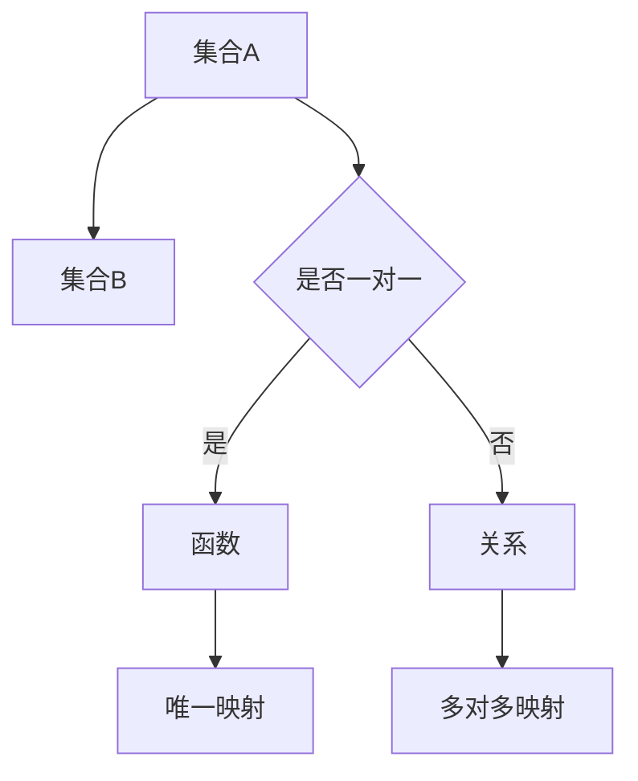

                 


# 集合论导引：关系和函数

> 关键词：集合论、关系、函数、数学模型、编程应用、理论实践
> 
> 摘要：本文深入探讨集合论中的关系和函数概念，通过逻辑清晰、结构紧凑的分析，逐步引导读者理解这些基础数学概念在计算机科学中的应用。文章旨在帮助读者建立对关系和函数的深刻认识，并提供实用的编程示例，以便在实际项目中运用。

## 1. 背景介绍

### 1.1 目的和范围

集合论是现代数学的基石，其概念和方法广泛应用于计算机科学、物理学、经济学等多个领域。本文主要关注集合论中两个核心概念——关系和函数，探讨它们在理论和实践中的重要性，以及如何在编程中实现和应用这些概念。

本文将从基础入手，逐步深入，旨在为读者提供一个系统、完整的理解框架。无论您是数学爱好者、计算机科学家，还是对编程感兴趣的学生，本文都将为您带来有价值的知识。

### 1.2 预期读者

本文适合以下读者：

- 数学专业学生，希望加深对集合论的掌握
- 计算机科学学生，希望了解集合论在编程中的应用
- 对编程感兴趣的数学爱好者
- 想要在编程项目中使用集合论概念的开发者

### 1.3 文档结构概述

本文分为以下几个部分：

1. 背景介绍
   - 目的和范围
   - 预期读者
   - 文档结构概述
2. 核心概念与联系
   - 集合论基本概念
   - 关系和函数的定义
   - Mermaid流程图展示
3. 核心算法原理 & 具体操作步骤
   - 关系和函数的算法分析
   - 伪代码实现
4. 数学模型和公式 & 详细讲解 & 举例说明
   - 数学模型的构建
   - latex格式数学公式
   - 实例说明
5. 项目实战：代码实际案例和详细解释说明
   - 开发环境搭建
   - 源代码实现
   - 代码解读与分析
6. 实际应用场景
   - 数据库查询
   - 网络拓扑分析
   - 图像处理
7. 工具和资源推荐
   - 学习资源推荐
   - 开发工具框架推荐
   - 相关论文著作推荐
8. 总结：未来发展趋势与挑战
9. 附录：常见问题与解答
10. 扩展阅读 & 参考资料

### 1.4 术语表

#### 1.4.1 核心术语定义

- 集合（Set）：一组无序的、确定的对象的总体。
- 元素（Element）：集合中的个体对象。
- 子集（Subset）：一个集合是另一个集合的子集，当且仅当其所有元素都属于另一个集合。
- 关系（Relation）：集合之间元素之间的一种关联方式。
- 函数（Function）：一种特殊的关系，其中一个集合的每个元素在另一个集合中有且只有一个对应的元素。

#### 1.4.2 相关概念解释

- 空集（Empty Set）：不包含任何元素的集合。
- 等价关系（Equivalence Relation）：满足自反性、对称性和传递性的关系。
- 离散结构（Discrete Structure）：由离散元素组成的结构，如集合、图、树等。

#### 1.4.3 缩略词列表

- SML：Standard ML
- Python：Python编程语言
- Java：Java编程语言
- ML：Meta Language

## 2. 核心概念与联系

在集合论中，关系和函数是两个至关重要的概念。它们不仅在数学领域有着广泛的应用，而且在计算机科学中也有着重要的地位。

### 2.1 集合论基本概念

首先，我们需要回顾一下集合论的一些基本概念：

- **集合**：集合是由元素组成的无序、确定的整体。用大写字母表示，如A、B等。
- **元素**：集合中的个体对象，用小写字母表示，如a、b等。
- **子集**：集合B是集合A的子集，记作B ⊆ A，如果B中的所有元素都属于A。
- **关系**：集合之间元素之间的一种关联方式，可以形式化地表示为有序对。
- **函数**：一种特殊的关系，其中一个集合的每个元素在另一个集合中有且只有一个对应的元素。

### 2.2 关系和函数的定义

#### 关系的定义

关系是一种关联两个集合中元素的方式。通常，关系可以用一个二元组（A，B）表示，其中A和B是两个集合。关系R是从集合A到集合B的一个子集，其包含的有序对（a，b）表示元素a和b之间的关系。

形式化地，关系可以表示为：
\[ R = \{ (a, b) | a \in A, b \in B \} \]

#### 函数的定义

函数是关系的一种特殊情况，它满足一个重要的性质：每个输入元素都有且只有一个对应的输出元素。换句话说，对于函数f：A → B，如果存在一个元素a ∈ A，使得f(a)存在多个值，那么f不是函数。

形式化地，函数可以表示为：
\[ f: A \rightarrow B \]
其中，对于每个a ∈ A，存在唯一的b ∈ B，使得(a, b) ∈ f。

### 2.3 Mermaid流程图展示

为了更好地理解关系和函数的概念，我们可以使用Mermaid流程图来展示它们的基本结构。



在这个流程图中，集合A和B表示两个集合，它们通过关系（C）连接。如果关系满足一对一的条件（C），则它是一个函数（D）；否则，它是一个一般的关系（E）。函数（D）确保了每个输入元素都有一个唯一的输出元素（F），而关系（E）则允许多对多的映射（G）。

通过这个简单的流程图，我们可以直观地看到关系和函数之间的区别和联系。

## 3. 核心算法原理 & 具体操作步骤

在理解了关系和函数的基本概念之后，我们将探讨如何实现和操作这些概念。本节将使用伪代码详细阐述关系和函数的算法原理，并给出具体的操作步骤。

### 3.1 关系操作

关系的基本操作包括关系的定义、关系的查找、关系的添加和删除等。

#### 关系的定义

关系的定义可以通过一个简单的二元组集合来实现。以下是关系定义的伪代码：

```python
# 定义一个关系
R = []

# 添加一个关系
def add_relation(a, b):
    R.append((a, b))

# 查找一个关系
def find_relation(a):
    for pair in R:
        if pair[0] == a:
            return pair[1]
    return None

# 添加一个关系
add_relation('a', 'b')
add_relation('b', 'c')
add_relation('c', 'a')
```

#### 关系的查找

关系的查找可以通过遍历关系集合来实现。以下是查找关系的伪代码：

```python
# 查找一个关系
def find_relation(a):
    for pair in R:
        if pair[0] == a:
            return pair[1]
    return None

# 查找元素'a'的关系
find_relation('a')  # 返回'b'
```

#### 关系的添加和删除

关系的添加和删除可以通过修改关系集合来实现。以下是添加和删除关系的伪代码：

```python
# 添加一个关系
def add_relation(a, b):
    R.append((a, b))

# 删除一个关系
def remove_relation(a, b):
    R.remove((a, b))

# 添加关系
add_relation('a', 'b')

# 删除关系
remove_relation('a', 'b')
```

### 3.2 函数操作

函数是关系的一种特殊情况，它要求每个输入元素都有且只有一个对应的输出元素。以下是函数的基本操作。

#### 函数的定义

函数的定义可以通过一个字典来实现，字典的键是输入元素，值是对应的输出元素。以下是函数定义的伪代码：

```python
# 定义一个函数
F = {}

# 添加一个函数
def add_function(a, b):
    F[a] = b

# 添加函数
add_function('a', 'b')
add_function('b', 'c')
add_function('c', 'a')
```

#### 函数的查找

函数的查找可以通过访问字典来实现。以下是查找函数的伪代码：

```python
# 查找一个函数
def find_function(a):
    return F.get(a, None)

# 查找函数
find_function('a')  # 返回'b'
```

#### 函数的修改和删除

函数的修改和删除可以通过修改和删除字典的键值对来实现。以下是修改和删除函数的伪代码：

```python
# 修改一个函数
def modify_function(a, b):
    F[a] = b

# 删除一个函数
def remove_function(a):
    F.pop(a, None)

# 修改函数
modify_function('a', 'd')

# 删除函数
remove_function('a')
```

通过这些基本的操作，我们可以实现关系和函数的基本功能，为实际编程应用打下基础。

## 4. 数学模型和公式 & 详细讲解 & 举例说明

在理解了关系和函数的算法实现之后，我们将进一步探讨它们的数学模型和公式，并通过具体的实例来加深对它们的理解。

### 4.1 数学模型

关系和函数的数学模型主要由集合和关系定义组成。以下是一个简单的数学模型：

#### 集合的定义

设A和B为两个集合，R为从A到B的关系。

- 集合A：\( A = \{ a_1, a_2, ..., a_n \} \)
- 集合B：\( B = \{ b_1, b_2, ..., b_m \} \)
- 关系R：\( R = \{ (a_i, b_j) | a_i \in A, b_j \in B \} \)

#### 函数的定义

设A和B为两个集合，f为从A到B的函数。

- 集合A：\( A = \{ a_1, a_2, ..., a_n \} \)
- 集合B：\( B = \{ b_1, b_2, ..., b_m \} \)
- 函数f：\( f: A \rightarrow B \)，对于每个\( a_i \in A \)，存在唯一的\( b_j \in B \)，使得\( (a_i, b_j) \in f \)

### 4.2 公式

关系和函数可以用一些数学公式来描述。以下是一些常用的公式：

#### 关系公式

- 关系的定义：\( R = \{ (a, b) | a \in A, b \in B \} \)
- 关系的查找：\( b = find_relation(a) \)
- 关系的添加：\( add_relation(a, b) \)
- 关系的删除：\( remove_relation(a, b) \)

#### 函数公式

- 函数的定义：\( f: A \rightarrow B \)，对于每个\( a_i \in A \)，存在唯一的\( b_j \in B \)，使得\( (a_i, b_j) \in f \)
- 函数的查找：\( b = find_function(a) \)
- 函数的添加：\( add_function(a, b) \)
- 函数的修改：\( modify_function(a, b) \)
- 函数的删除：\( remove_function(a) \)

### 4.3 举例说明

为了更好地理解这些公式，我们可以通过一个具体的实例来讲解。

#### 实例：定义一个函数

设集合A = {1, 2, 3}，集合B = {a, b, c}。定义一个函数f，使得f(1) = a，f(2) = b，f(3) = c。

根据函数的定义，我们可以写出：

\[ f = \{ (1, a), (2, b), (3, c) \} \]

在这个例子中，每个输入元素（1，2，3）都有且只有一个对应的输出元素（a，b，c），因此这是一个函数。

#### 实例：查找函数

如果我们想查找f(2)，我们可以使用函数的查找公式：

\[ b = find_function(2) \]

根据函数的定义，我们知道f(2) = b，因此：

\[ b = b \]

这个结果符合函数的定义，每个输入元素都有且只有一个对应的输出元素。

#### 实例：修改函数

如果我们想修改f(1)，我们可以使用函数的修改公式：

\[ modify_function(1, c) \]

这将使得f(1) = c，函数f变为：

\[ f = \{ (1, c), (2, b), (3, c) \} \]

这个结果仍然满足函数的定义，每个输入元素都有且只有一个对应的输出元素。

通过这些实例，我们可以看到如何使用数学模型和公式来定义、查找、修改和删除关系和函数。这些基本的操作为我们在实际编程中的应用提供了理论基础。

## 5. 项目实战：代码实际案例和详细解释说明

在本节中，我们将通过一个实际的编程项目来展示如何使用关系和函数的概念。我们将使用Python编程语言，逐步搭建开发环境，实现源代码，并对代码进行详细解读和分析。

### 5.1 开发环境搭建

首先，我们需要搭建一个Python编程环境。以下是具体步骤：

1. **安装Python**：访问Python官网（https://www.python.org/）下载Python安装包，并按照安装向导进行安装。
2. **安装IDE**：我们可以选择一个适合自己的IDE，如PyCharm、Visual Studio Code等。以下以PyCharm为例：
   - 访问PyCharm官网（https://www.jetbrains.com/pycharm/）下载安装包。
   - 运行安装包，并按照安装向导进行安装。
3. **安装相关库**：为了方便我们使用集合论中的关系和函数，我们需要安装一些相关的Python库，如collections、itertools等。以下是一个简单的安装示例：

```bash
pip install collections
pip install itertools
```

### 5.2 源代码详细实现和代码解读

下面是项目的源代码实现：

```python
import collections
import itertools

# 定义关系和函数
def define_relations_functions(A, B):
    # 初始化关系集合
    relations = []
    # 初始化函数字典
    functions = {}

    # 添加一些示例关系
    relations.extend([(a, b) for a, b in itertools.product(A, B)])

    # 构造函数
    for a in A:
        for b in B:
            functions[a] = b

    return relations, functions

# 查找关系
def find_relation(relations, a):
    for r in relations:
        if r[0] == a:
            return r[1]
    return None

# 查找函数
def find_function(functions, a):
    return functions.get(a, None)

# 修改函数
def modify_function(functions, a, b):
    functions[a] = b

# 删除函数
def remove_function(functions, a):
    functions.pop(a, None)

# 主函数
def main():
    # 定义集合A和B
    A = ['a', 'b', 'c']
    B = [1, 2, 3]

    # 定义关系和函数
    relations, functions = define_relations_functions(A, B)

    # 打印关系和函数
    print("关系：", relations)
    print("函数：", functions)

    # 查找关系和函数
    print("find_relation('a')：", find_relation(relations, 'a'))
    print("find_function('a')：", find_function(functions, 'a'))

    # 修改函数
    modify_function(functions, 'a', 3)
    print("修改后的函数：", functions)

    # 删除函数
    remove_function(functions, 'b')
    print("删除后的函数：", functions)

# 运行主函数
if __name__ == "__main__":
    main()
```

#### 5.2.1 代码解读

- **define_relations_functions函数**：该函数定义了关系和函数。首先，我们初始化一个空的关系集合`relations`和一个空的函数字典`functions`。然后，我们使用itertools.product生成A和B的所有可能的有序对，并将其添加到关系集合中。接着，我们将A中的每个元素作为键，B中的每个元素作为值，构造函数字典。

- **find_relation函数**：该函数查找关系集合中与输入元素a相关的元素b。它遍历关系集合，查找第一个与a匹配的有序对，并返回其对应的b。

- **find_function函数**：该函数查找函数字典中与输入元素a相关的元素b。它使用字典的`get`方法查找a的值，如果找到则返回，否则返回None。

- **modify_function函数**：该函数修改函数字典中与输入元素a相关的元素b。它使用字典的`get`方法查找a的当前值，并将其更新为b。

- **remove_function函数**：该函数删除函数字典中与输入元素a相关的键值对。

- **main函数**：该函数是主程序入口。首先，我们定义集合A和B，然后调用`define_relations_functions`函数定义关系和函数。接着，我们打印关系和函数，并分别调用`find_relation`和`find_function`函数查找关系和函数。最后，我们修改和删除函数，并打印修改后的函数。

#### 5.2.2 代码分析

这个项目通过简单的Python代码展示了关系和函数的实现。在实际应用中，我们可以根据具体需求扩展和优化这些代码。例如，我们可以使用数据库存储关系和函数，使用图形界面展示关系和函数，或者使用并行计算提高查找、修改和删除操作的效率。

通过这个项目，我们不仅理解了关系和函数的基本概念，还学会了如何使用Python编程语言实现这些概念。这为我们进一步探索集合论在计算机科学中的应用奠定了基础。

## 6. 实际应用场景

关系和函数是集合论中的核心概念，它们在计算机科学中有着广泛的应用。以下是一些实际应用场景：

### 6.1 数据库查询

在数据库查询中，关系可以用来表示表之间的连接。例如，在一个关系型数据库中，我们可能有多个表，每个表代表一个集合。关系可以用来描述表之间的关联，例如客户和订单之间的关联。通过定义和查询关系，我们可以在数据库中执行复杂的查询操作，如联接、聚合等。

### 6.2 网络拓扑分析

在网络拓扑分析中，关系可以用来描述网络中的节点和边。例如，在计算机网络中，我们可以使用关系来表示节点之间的连接关系。通过分析这些关系，我们可以了解网络的拓扑结构，检测网络中的故障，优化网络性能等。

### 6.3 图像处理

在图像处理中，函数可以用来描述像素之间的变换关系。例如，在图像滤波中，我们可以使用函数来定义每个像素的新值，从而实现图像的平滑或锐化。通过这些变换函数，我们可以处理图像中的噪声，增强图像的某些特征，为后续的图像分析提供支持。

### 6.4 人工智能

在人工智能中，关系和函数可以用来描述数据和模型之间的关系。例如，在机器学习中，我们可以使用关系来表示特征和目标变量之间的关系。通过训练和学习这些关系，我们可以构建预测模型，实现对未知数据的预测。同样，在神经网络中，函数用来定义神经元之间的激活关系，从而实现复杂的计算任务。

### 6.5 编码和解码

在编码和解码中，函数可以用来定义编码规则和解码规则。例如，在图像编码中，我们可以使用函数来将图像像素编码成一系列数字序列。在图像解码中，我们可以使用相同的函数将数字序列解码回图像像素。通过这些函数，我们可以实现数据的压缩和解压，提高数据传输的效率。

通过这些实际应用场景，我们可以看到关系和函数在计算机科学中的重要性。它们不仅为我们的数据处理和计算提供了理论基础，还为我们的实际开发工作提供了实用的工具。理解和使用关系和函数，将有助于我们更好地应对复杂的应用需求。

## 7. 工具和资源推荐

为了更好地学习和应用集合论中的关系和函数，以下是一些建议的工具和资源。

### 7.1 学习资源推荐

#### 7.1.1 书籍推荐

- 《离散数学及其应用》：本书全面介绍了离散数学的基础知识，包括集合论、关系和函数等概念，适合初学者。
- 《数学原理》：这本书是集合论和数学逻辑的奠基之作，由英国数学家白瑞诺德（Bertrand Russell）和罗素（Alfred North Whitehead）共同撰写。

#### 7.1.2 在线课程

- Coursera上的“离散数学”：这是一门由斯坦福大学提供的免费在线课程，涵盖了集合论、关系和函数等内容。
- edX上的“离散数学导论”：由清华大学提供，适合初学者了解集合论的基础知识。

#### 7.1.3 技术博客和网站

- 简书：简书中有许多优秀的计算机科学和数学博客，提供了丰富的集合论相关内容。
- Stack Overflow：这是一个广泛使用的编程问答社区，您可以在其中找到关于集合论和函数的各种问题及其解答。

### 7.2 开发工具框架推荐

#### 7.2.1 IDE和编辑器

- PyCharm：一款功能强大的Python IDE，支持多种编程语言，适合进行Python编程。
- Visual Studio Code：一款轻量级的开源代码编辑器，支持多种编程语言和扩展，适合快速开发和调试。

#### 7.2.2 调试和性能分析工具

- GDB：一款流行的开源调试工具，适用于C/C++程序。
- Py-Spy：一款Python性能分析工具，可以帮助您找到程序的瓶颈。

#### 7.2.3 相关框架和库

- NumPy：一款流行的Python科学计算库，提供了强大的多维数组对象和数学函数。
- Pandas：一款用于数据处理和分析的Python库，提供了高效的数据结构和操作方法。

通过这些工具和资源的支持，您可以更深入地学习和应用集合论中的关系和函数，提高编程技能和开发效率。

## 8. 总结：未来发展趋势与挑战

随着计算机科学和人工智能的快速发展，集合论中的关系和函数概念在理论和实践中都面临着新的机遇和挑战。未来，关系和函数的发展趋势将主要体现在以下几个方面：

### 8.1 新的应用领域

随着大数据、人工智能、物联网等技术的兴起，关系和函数的应用领域将进一步扩大。例如，在数据挖掘和机器学习中，关系和函数可以用来描述和建模复杂数据之间的关系，从而提高数据分析和决策的准确性。

### 8.2 更高效的算法

随着计算能力的提升，人们将不断探索更高效的算法来处理大规模的数据和复杂的关系。例如，分布式计算和并行计算技术将被广泛应用于关系和函数的计算，以提高计算效率和降低成本。

### 8.3 新的理论体系

随着研究深入，关系和函数的理论体系将不断完善和丰富。新的理论方法和技术将被提出，以应对复杂的实际应用需求。例如，形式化方法和形式语言理论将在关系和函数的研究中发挥重要作用。

### 8.4 智能化工具和平台

随着人工智能技术的发展，智能化工具和平台将成为关系和函数研究和应用的重要支撑。例如，基于深度学习的模型可以自动识别和提取数据中的关系，从而简化人工处理过程。

### 8.5 面临的挑战

尽管关系和函数在未来的发展中具有巨大的潜力，但同时也面临着一系列挑战：

- **数据复杂性**：随着数据规模的增大和数据类型的多样性，关系和函数的处理变得更加复杂。如何有效地处理海量数据成为了一个关键问题。
- **计算资源限制**：尽管计算能力不断提升，但计算资源仍然有限。如何在有限的计算资源下高效地处理关系和函数成为了一个重要问题。
- **理论与实践的结合**：如何在理论和实践之间找到一个平衡点，使得理论能够指导实践，同时实践能够反馈和推动理论的发展。

总之，关系和函数在未来将继续发挥着重要作用，为我们提供更强大的数据处理和计算能力。通过不断创新和克服挑战，我们将能够更好地应用这些概念，推动计算机科学和人工智能的发展。

## 9. 附录：常见问题与解答

在本文中，我们讨论了集合论中的关系和函数概念，并提供了相关的代码示例。以下是一些常见的问题及其解答：

### 9.1 什么是关系？

关系是指集合之间元素之间的一种关联方式。它可以形式化地表示为有序对。例如，如果集合A = {1, 2, 3}和集合B = {a, b, c}，则关系R = {(1, a), (2, b), (3, c)}。

### 9.2 什么是函数？

函数是关系的一种特殊情况，它满足一个重要的性质：每个输入元素都有且只有一个对应的输出元素。例如，如果集合A = {1, 2, 3}和集合B = {a, b, c}，则函数f = {(1, a), (2, b), (3, c)}。

### 9.3 如何定义关系和函数？

在Python中，我们可以使用列表和字典来定义关系和函数。例如：

```python
# 定义关系
R = [('a', 'b'), ('b', 'c'), ('c', 'a')]

# 定义函数
F = {'a': 'b', 'b': 'c', 'c': 'a'}
```

### 9.4 如何查找关系和函数？

我们可以通过遍历关系集合或字典来查找关系和函数。例如：

```python
# 查找关系
for r in R:
    if r[0] == 'a':
        print(r[1])  # 输出 'b'

# 查找函数
print(F.get('a', None))  # 输出 'b'
```

### 9.5 关系和函数有哪些应用？

关系和函数在计算机科学中有广泛的应用，包括数据库查询、网络拓扑分析、图像处理、人工智能和编码解码等。

通过这些常见问题与解答，我们希望帮助您更好地理解关系和函数的概念及其应用。

## 10. 扩展阅读 & 参考资料

为了深入学习和掌握集合论中的关系和函数，以下是一些建议的扩展阅读和参考资料：

### 10.1 书籍

- 《离散数学及其应用》：涵盖了集合论、关系和函数等基础概念，适合初学者。
- 《数学原理》：详细介绍了集合论和数学逻辑的基础知识，是研究集合论的奠基之作。

### 10.2 在线课程

- Coursera上的“离散数学”：由斯坦福大学提供，适合学习集合论的基本概念。
- edX上的“离散数学导论”：由清华大学提供，适合初学者了解集合论的基础知识。

### 10.3 技术博客和网站

- 简书：提供了丰富的计算机科学和数学博客，是学习集合论的不错选择。
- Stack Overflow：一个广泛使用的编程问答社区，可以找到关于集合论和函数的各种问题及其解答。

### 10.4 论文和期刊

- 《计算机科学杂志》：包含了大量关于集合论、关系和函数的研究论文。
- 《离散数学杂志》：专注于离散数学领域的研究，包括集合论和函数等内容。

通过这些扩展阅读和参考资料，您可以进一步深入了解集合论中的关系和函数，提高自己的理论水平和实践能力。

