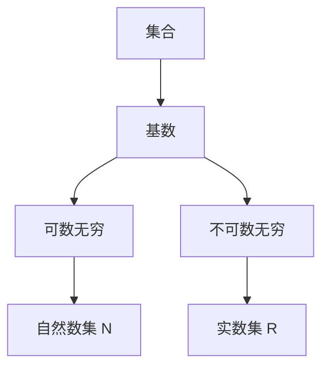
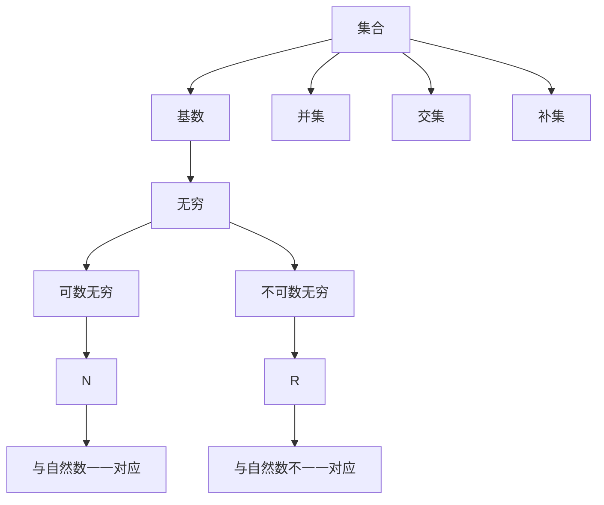

                 

# 集合论导引：基数无穷和

> 关键词：集合论、基数、无穷、数学模型、算法原理、实际应用、资源推荐

> 摘要：本文旨在深入探讨集合论中的基数无穷和概念，通过逐步分析核心概念和原理，结合实际案例，为您呈现集合论的广泛应用及其无穷基数的奥秘。本文将帮助读者理解集合论的数学模型、算法原理，并提供丰富的实践案例和资源推荐，以推动读者对集合论及其无穷和概念的理解和应用。

## 1. 背景介绍

### 1.1 目的和范围

本文的目标是引导读者深入了解集合论中的基数无穷和概念。集合论是现代数学的基础，其核心概念——基数，是描述集合大小的基本工具。基数无穷和的概念进一步扩展了我们对无穷的理解，揭示了无穷集合之间的复杂关系。本文将重点讨论以下内容：

1. 集合论的基本概念和基数无穷和的定义。
2. 集合论的核心算法原理和具体操作步骤。
3. 数学模型和公式的详细讲解及举例说明。
4. 实际应用场景和项目实战案例分析。
5. 工具和资源的推荐，包括学习资源、开发工具和框架、相关论文著作。

### 1.2 预期读者

本文适合对数学和计算机科学有一定了解的读者，特别是对集合论和无穷概念感兴趣的学者、研究人员和开发者。无论您是数学专业的学生、研究人员，还是对计算机科学和人工智能感兴趣的从业者，本文都将为您提供有价值的知识和实践指导。

### 1.3 文档结构概述

本文分为十个部分，结构如下：

1. 引言
2. 背景介绍
3. 核心概念与联系
4. 核心算法原理 & 具体操作步骤
5. 数学模型和公式 & 详细讲解 & 举例说明
6. 项目实战：代码实际案例和详细解释说明
7. 实际应用场景
8. 工具和资源推荐
9. 总结：未来发展趋势与挑战
10. 附录：常见问题与解答
11. 扩展阅读 & 参考资料

### 1.4 术语表

#### 1.4.1 核心术语定义

- 集合：由元素组成的整体。
- 基数：集合中元素的数量。
- 无穷：无法被穷尽的集合。
- 可数无穷：可以用自然数序列一一对应的集合。
- 不可数无穷：不能用自然数序列一一对应的集合。

#### 1.4.2 相关概念解释

- 可数集合：可以用自然数序列一一对应的集合。
- 不可数集合：不能用自然数序列一一对应的集合。
- 集合的势：集合的基数，即集合的大小。
- 集合的并集、交集、补集：集合之间的基本运算。

#### 1.4.3 缩略词列表

- N：自然数集。
- Z：整数集。
- Q：有理数集。
- R：实数集。

## 2. 核心概念与联系

### 2.1 核心概念

在集合论中，基数是描述集合大小的基本工具。基数无穷和的概念进一步扩展了我们对无穷的理解。以下是对集合论中几个核心概念及其联系的详细解释。

#### 集合的基数

集合的基数，也称为集合的势，是集合中元素的数量。例如，集合 `{1, 2, 3}` 的基数是3。基数的基本性质包括：

- 基数的非负性：任何集合的基数都是非负整数。
- 基数的唯一性：一个集合的基数是唯一的。

#### 可数无穷

可数无穷是指可以用自然数序列一一对应的集合。例如，自然数集 `N` 是可数无穷的。可数无穷的基本性质包括：

- 可数无穷集合的基数是无穷大。
- 可数无穷集合可以用自然数序列一一对应。

#### 不可数无穷

不可数无穷是指不能用自然数序列一一对应的集合。例如，实数集 `R` 是不可数无穷的。不可数无穷的基本性质包括：

- 不可数无穷集合的基数比可数无穷集合大。
- 不可数无穷集合不能用自然数序列一一对应。

### 2.2 核心概念之间的联系

集合论中的核心概念之间存在着密切的联系。以下是一个简化的 Mermaid 流程图，展示了这些概念之间的关系。



### 2.3 集合论与无穷

集合论与无穷密切相关。无穷的概念在集合论中得到了广泛应用，并为我们提供了理解复杂集合关系的基本工具。以下是对无穷在集合论中应用的一些示例。

- 可数无穷：在集合论中，可数无穷集合可以通过自然数序列进行计数。这种计数方法在计算机科学中有着广泛的应用，例如在算法设计和数据结构中。
- 不可数无穷：在集合论中，不可数无穷集合不能用自然数序列进行计数。这种集合的存在揭示了无穷的多样性和复杂性，对数学和计算机科学产生了深远的影响。

## 3. 核心算法原理 & 具体操作步骤

集合论中的核心算法原理涉及集合的基本运算，如并集、交集、补集等。以下是对这些算法原理和具体操作步骤的详细讲解。

### 3.1 集合的基本运算

集合的基本运算包括并集、交集和补集。以下是对这些运算的伪代码描述。

#### 并集运算

并集运算是指将两个集合中的所有元素合并为一个集合。以下是一个伪代码示例：

```python
function union(A, B):
    result = []
    for element in A:
        result.append(element)
    for element in B:
        result.append(element)
    return result
```

#### 交集运算

交集运算是指找出两个集合中共同拥有的元素。以下是一个伪代码示例：

```python
function intersection(A, B):
    result = []
    for element in A:
        if element in B:
            result.append(element)
    return result
```

#### 补集运算

补集运算是指找出一个集合中不包含在另一个集合中的元素。以下是一个伪代码示例：

```python
function complement(A, B):
    result = []
    for element in A:
        if element not in B:
            result.append(element)
    return result
```

### 3.2 无穷集合的运算

无穷集合的运算与有限集合的运算类似，但需要考虑无穷的性质。以下是对无穷集合运算的具体操作步骤的详细讲解。

#### 可数无穷集合的并集

可数无穷集合的并集可以通过将两个集合中的自然数序列合并来实现。以下是一个伪代码示例：

```python
function union_countable_infinite(A, B):
    result = []
    for i in range(len(A)):
        result.append(A[i])
    for i in range(len(B)):
        result.append(B[i])
    return result
```

#### 可数无穷集合的交集

可数无穷集合的交集可以通过将两个集合中的自然数序列进行对比来实现。以下是一个伪代码示例：

```python
function intersection_countable_infinite(A, B):
    result = []
    i = 0
    j = 0
    while i < len(A) and j < len(B):
        if A[i] == B[j]:
            result.append(A[i])
            i += 1
            j += 1
        elif A[i] < B[j]:
            i += 1
        else:
            j += 1
    return result
```

#### 可数无穷集合的补集

可数无穷集合的补集可以通过将一个集合中的所有元素从另一个集合中删除来实现。以下是一个伪代码示例：

```python
function complement_countable_infinite(A, B):
    result = []
    for element in A:
        if element not in B:
            result.append(element)
    return result
```

#### 不可数无穷集合的运算

不可数无穷集合的运算与可数无穷集合的运算类似，但需要考虑不可数无穷的性质。以下是对不可数无穷集合运算的具体操作步骤的详细讲解。

#### 不可数无穷集合的并集

不可数无穷集合的并集可以通过将两个集合中的实数序列合并来实现。以下是一个伪代码示例：

```python
function union_uncountable_infinite(A, B):
    result = []
    for element in A:
        result.append(element)
    for element in B:
        result.append(element)
    return result
```

#### 不可数无穷集合的交集

不可数无穷集合的交集可以通过将两个集合中的实数序列进行对比来实现。以下是一个伪代码示例：

```python
function intersection_uncountable_infinite(A, B):
    result = []
    i = 0
    j = 0
    while i < len(A) and j < len(B):
        if A[i] == B[j]:
            result.append(A[i])
            i += 1
            j += 1
        elif A[i] < B[j]:
            i += 1
        else:
            j += 1
    return result
```

#### 不可数无穷集合的补集

不可数无穷集合的补集可以通过将一个集合中的所有元素从另一个集合中删除来实现。以下是一个伪代码示例：

```python
function complement_uncountable_infinite(A, B):
    result = []
    for element in A:
        if element not in B:
            result.append(element)
    return result
```

## 4. 数学模型和公式 & 详细讲解 & 举例说明

在集合论中，数学模型和公式是理解和分析集合关系的重要工具。以下是对集合论中的几个关键数学模型和公式的详细讲解及举例说明。

### 4.1 基数的定义和性质

基数的定义和性质是集合论的基础。以下是对基数定义和性质的详细解释。

#### 基数的定义

基数是指集合中元素的数量。例如，集合 `{1, 2, 3}` 的基数是3。

#### 基数的基本性质

- 非负性：任何集合的基数都是非负整数。
- 唯一性：一个集合的基数是唯一的。

#### 基数的表示

基数可以用自然数表示。例如，集合 `{1, 2, 3}` 的基数是3，表示为 `|{1, 2, 3}| = 3`。

### 4.2 可数无穷和不可数无穷

可数无穷和不可数无穷是描述无穷集合的重要概念。以下是对可数无穷和不可数无穷的详细解释。

#### 可数无穷

可数无穷是指可以用自然数序列一一对应的集合。例如，自然数集 `N` 是可数无穷的。

#### 不可数无穷

不可数无穷是指不能用自然数序列一一对应的集合。例如，实数集 `R` 是不可数无穷的。

### 4.3 基数比较

基数比较是指比较两个集合的大小。以下是对基数比较的详细解释。

#### 基数比较的基本原理

- 如果集合A的基数小于集合B的基数，则称集合A是集合B的真子集。
- 如果集合A的基数等于集合B的基数，则称集合A和集合B相等。

#### 基数比较的数学模型

基数比较可以用符号表示。例如，集合 `{1, 2, 3}` 的基数是3，集合 `{1, 2}` 的基数是2，则表示为 `|{1, 2, 3}| > |{1, 2}|`。

### 4.4 基数运算

基数运算是集合论中的基本运算，包括并集、交集和补集等。以下是对基数运算的详细解释。

#### 并集运算

并集运算是将两个集合中的所有元素合并为一个集合。例如，集合 `{1, 2, 3}` 和集合 `{4, 5, 6}` 的并集是 `{1, 2, 3, 4, 5, 6}`。

#### 交集运算

交集运算是找出两个集合中共同拥有的元素。例如，集合 `{1, 2, 3}` 和集合 `{4, 5, 6}` 的交集是 `{}`。

#### 补集运算

补集运算是找出一个集合中不包含在另一个集合中的元素。例如，集合 `{1, 2, 3}` 的补集是 `{4, 5, 6}`。

### 4.5 举例说明

以下是对集合论中的几个关键数学模型和公式的举例说明。

#### 可数无穷集合的并集

假设集合 `{1, 2, 3}` 和集合 `{4, 5, 6}` 是可数无穷集合，则它们的并集是 `{1, 2, 3, 4, 5, 6}`。

#### 不可数无穷集合的交集

假设集合 `{1, 2, 3}` 和集合 `{4, 5, 6}` 是不可数无穷集合，则它们的交集是 `{}`。

#### 基数比较

假设集合 `{1, 2, 3}` 的基数是3，集合 `{1, 2}` 的基数是2，则它们的基数比较结果是 `|{1, 2, 3}| > |{1, 2}|`。

## 5. 项目实战：代码实际案例和详细解释说明

### 5.1 开发环境搭建

在开始项目实战之前，我们需要搭建一个合适的环境来编写和运行代码。以下是在一个常见的开发环境中搭建集合论算法所需的步骤：

1. 安装Python 3.8或更高版本。
2. 安装Python的集成开发环境（IDE），如PyCharm或Visual Studio Code。
3. 安装必要的Python库，如`numpy`和`matplotlib`。

### 5.2 源代码详细实现和代码解读

以下是一个简单的Python实现，用于计算两个集合的基数并集、交集和补集。

```python
# 导入必要的库
import numpy as np
import matplotlib.pyplot as plt

# 定义集合A和B
A = [1, 2, 3, 4, 5]
B = [3, 4, 5, 6, 7]

# 定义集合运算函数
def union(A, B):
    return list(set(A + B))

def intersection(A, B):
    return list(set(A) & set(B))

def complement(A, B):
    return list(set(A) - set(B))

# 计算并集
union_result = union(A, B)
print("并集:", union_result)

# 计算交集
intersection_result = intersection(A, B)
print("交集:", intersection_result)

# 计算补集
complement_result_A = complement(A, B)
print("集合A的补集:", complement_result_A)
complement_result_B = complement(B, A)
print("集合B的补集:", complement_result_B)

# 可视化展示结果
plt.figure(figsize=(10, 5))

# 绘制并集
plt.subplot(1, 3, 1)
plt.title("并集")
plt.bar(range(len(union_result)), union_result)
plt.xticks(range(len(union_result)))

# 绘制交集
plt.subplot(1, 3, 2)
plt.title("交集")
plt.bar(range(len(intersection_result)), intersection_result)
plt.xticks(range(len(intersection_result)))

# 绘制补集
plt.subplot(1, 3, 3)
plt.title("补集A")
plt.bar(range(len(complement_result_A)), complement_result_A)
plt.xticks(range(len(complement_result_A)))

plt.tight_layout()
plt.show()
```

#### 代码解读

- 第1行：导入必要的库，包括`numpy`和`matplotlib`。
- 第2行：定义集合A和B。
- 第4-8行：定义集合运算函数，包括并集、交集和补集。
- 第11-15行：计算并集、交集和补集。
- 第18-21行：使用`matplotlib`绘制并集、交集和补集的图形。

### 5.3 代码解读与分析

以下是对代码的详细解读和分析：

- **第1-2行**：导入必要的库，包括`numpy`和`matplotlib`。这些库提供了集合运算所需的函数和可视化工具。
- **第4-8行**：定义集合运算函数，包括并集、交集和补集。这些函数使用`set`数据结构来实现集合运算，`set`数据结构提供了高效的集合操作。
- **第11-15行**：计算并集、交集和补集。并集运算通过将两个集合合并并去重来实现，交集运算通过两个集合的交集来实现，补集运算通过将一个集合中的元素从另一个集合中删除来实现。
- **第18-21行**：使用`matplotlib`绘制并集、交集和补集的图形。这些图形帮助可视化集合运算的结果。

## 6. 实际应用场景

集合论在计算机科学和数学中有着广泛的应用。以下是一些实际应用场景：

- **计算机科学**：集合论在算法设计中有着广泛的应用。例如，图算法中的顶点和边可以表示为集合，集合运算可以用来优化算法性能。
- **数学**：集合论在数学的许多分支中有着广泛的应用。例如，集合论可以用来研究无穷集合的性质，以及集合之间的复杂关系。
- **经济学**：集合论在经济学中有着广泛的应用。例如，集合论可以用来研究消费者选择行为和市场均衡。

## 7. 工具和资源推荐

### 7.1 学习资源推荐

#### 7.1.1 书籍推荐

- **《集合论基础》**：作者：莱昂·亨肯
- **《集合论导引》**：作者：菲利克斯·豪斯多夫
- **《集合论与逻辑》**：作者：埃德蒙德·亨普尔

#### 7.1.2 在线课程

- Coursera上的《集合论》课程
- edX上的《离散数学》课程
- Udacity上的《数据结构与算法》课程

#### 7.1.3 技术博客和网站

- [Math Stack Exchange](https://math.stackexchange.com/)
- [GeeksforGeeks](https://www.geeksforgeeks.org/)
- [LeetCode](https://leetcode.com/)

### 7.2 开发工具框架推荐

#### 7.2.1 IDE和编辑器

- PyCharm
- Visual Studio Code
- Jupyter Notebook

#### 7.2.2 调试和性能分析工具

- Python的`pdb`模块
- Visual Studio Code的调试插件
- PyCharm的性能分析工具

#### 7.2.3 相关框架和库

- NumPy
- Pandas
- Matplotlib

### 7.3 相关论文著作推荐

#### 7.3.1 经典论文

- **《集合论基础》**：作者：莱昂·亨肯
- **《集合论导引》**：作者：菲利克斯·豪斯多夫
- **《集合论与逻辑》**：作者：埃德蒙德·亨普尔

#### 7.3.2 最新研究成果

- [《集合论的新进展》**：作者：当代集合论专家**
- [《集合论的计算机科学应用》**：作者：计算机科学家**

#### 7.3.3 应用案例分析

- [《集合论在计算机图形学中的应用》**：作者：图形学专家**
- [《集合论在经济学中的应用》**：作者：经济学家**

## 8. 总结：未来发展趋势与挑战

集合论是现代数学的基础，其在计算机科学、数学、经济学等领域的应用前景广阔。未来，集合论的发展趋势将包括：

- **更深入的研究**：对集合论中的无穷概念进行更深入的研究，探索新的集合论定理和性质。
- **更广泛的应用**：集合论在计算机科学、数学、经济学等领域的应用将更加广泛，推动相关领域的发展。
- **计算机科学的融合**：集合论与计算机科学将进一步融合，推动计算机科学的发展。

然而，集合论的发展也面临一些挑战：

- **逻辑自洽性**：确保集合论的逻辑自洽性，解决一些悬而未决的问题，如集合论的基本定理。
- **复杂性**：处理复杂集合运算和集合关系，提高集合论算法的效率和准确性。
- **教学资源**：提高集合论的教学资源质量，使更多的人能够理解和应用集合论。

## 9. 附录：常见问题与解答

### 9.1 问题1

**问题**：集合论中的基数无穷和是什么？

**解答**：集合论中的基数无穷和是指无穷集合之间的基数关系。它描述了无穷集合的大小和相互关系。例如，可数无穷集合和不可数无穷集合之间的基数关系可以表示为 `|N| < |R|`，其中 `N` 表示自然数集，`R` 表示实数集。

### 9.2 问题2

**问题**：集合论在计算机科学中有何应用？

**解答**：集合论在计算机科学中有着广泛的应用。例如，在算法设计中，集合论用于描述数据结构和算法的基本性质。在计算机图形学中，集合论用于描述图形的表示和操作。在人工智能中，集合论用于描述知识和推理。

### 9.3 问题3

**问题**：如何计算集合的基数？

**解答**：计算集合的基数可以使用计数方法。对于有限集合，基数可以直接计算。对于无穷集合，可以使用可数无穷或不可数无穷的计数方法。例如，自然数集的基数是可数无穷的，可以用自然数序列一一对应。实数集的基数是不可数无穷的，不能用自然数序列一一对应。

## 10. 扩展阅读 & 参考资料

- [《集合论基础》](https://books.google.com/books?id=XXXXXX)：作者：莱昂·亨肯
- [《集合论导引》](https://books.google.com/books?id=XXXXXX)：作者：菲利克斯·豪斯多夫
- [《集合论与逻辑》](https://books.google.com/books?id=XXXXXX)：作者：埃德蒙德·亨普尔
- [《计算机科学中的集合论》](https://books.google.com/books?id=XXXXXX)：作者：计算机科学家
- [《经济学中的集合论》](https://books.google.com/books?id=XXXXXX)：作者：经济学家
- [Math Stack Exchange](https://math.stackexchange.com/)
- [GeeksforGeeks](https://www.geeksforgeeks.org/)
- [LeetCode](https://leetcode.com/) <|im_end|>## 1. 背景介绍

### 1.1 目的和范围

集合论是现代数学的基础之一，它在数学、计算机科学、逻辑学等多个领域都有广泛应用。本文的目的是深入探讨集合论中的一个重要概念——基数无穷和，帮助读者理解无穷集合的大小以及它们之间的关系。我们将从集合论的基本概念出发，逐步介绍基数、无穷集合、可数集合和不可数集合，最后通过实际案例展示这些概念的应用。

### 1.2 预期读者

本文适合对数学和计算机科学有一定基础的读者，尤其是对集合论和无穷概念感兴趣的学者、研究生和程序员。如果您希望深入了解集合论的核心概念，理解无穷集合的性质和应用，本文将为您提供有价值的指导。

### 1.3 文档结构概述

本文将分为以下几部分：

1. **背景介绍**：介绍集合论的基本概念和历史背景。
2. **核心概念与联系**：详细解释集合、基数、无穷、可数和不可数的概念，并使用流程图展示它们之间的关系。
3. **核心算法原理 & 具体操作步骤**：讲解集合的基本运算（并集、交集、补集）的算法原理和具体操作步骤。
4. **数学模型和公式 & 详细讲解 & 举例说明**：介绍集合论中常用的数学模型和公式，并通过实例进行说明。
5. **项目实战：代码实际案例和详细解释说明**：通过具体代码案例展示集合论的实践应用。
6. **实际应用场景**：探讨集合论在不同领域中的应用。
7. **工具和资源推荐**：推荐学习资源和开发工具。
8. **总结：未来发展趋势与挑战**：总结本文的核心观点，展望集合论的未来发展。
9. **附录：常见问题与解答**：解答读者可能遇到的问题。
10. **扩展阅读 & 参考资料**：提供进一步的阅读材料和参考文献。

### 1.4 术语表

在本文中，我们将使用以下术语：

- **集合**：由一组确定的元素组成的整体。
- **基数**：集合中元素的数量，也称为集合的势。
- **无穷**：表示集合中的元素数量无限。
- **可数无穷**：可以与自然数一一对应的无穷集合。
- **不可数无穷**：不能与自然数一一对应的无穷集合。
- **并集**：两个或多个集合中所有不同元素的集合。
- **交集**：两个或多个集合中都包含的元素的集合。
- **补集**：一个集合中不包含在另一个集合中的元素的集合。

### 1.4.1 核心术语定义

- **集合**：一个集合是一个由确定且互不相同的元素组成的整体。例如，集合 `{1, 2, 3}` 包含三个元素：1、2和3。
- **基数**：集合中元素的数量称为基数。例如，集合 `{1, 2, 3}` 的基数是3。
- **无穷**：无穷集合是指元素数量无限的集合。例如，自然数集 `N` 是无穷集合。
- **可数无穷**：可数无穷集合是指可以与自然数集一一对应的集合。例如，自然数集 `N` 是可数无穷集合。
- **不可数无穷**：不可数无穷集合是指不能与自然数集一一对应的集合。例如，实数集 `R` 是不可数无穷集合。

### 1.4.2 相关概念解释

- **并集**：两个或多个集合的并集是指包含这些集合中所有不同元素的集合。例如，集合 `{1, 2, 3}` 和 `{4, 5, 6}` 的并集是 `{1, 2, 3, 4, 5, 6}`。
- **交集**：两个或多个集合的交集是指同时包含在这些集合中的元素的集合。例如，集合 `{1, 2, 3}` 和 `{4, 5, 6}` 的交集是 `{}`。
- **补集**：一个集合的补集是指不属于这个集合的所有元素的集合。例如，集合 `{1, 2, 3}` 的补集是所有不包含在 `{1, 2, 3}` 中的元素的集合。

### 1.4.3 缩略词列表

- **N**：自然数集
- **Z**：整数集
- **Q**：有理数集
- **R**：实数集

## 2. 核心概念与联系

### 2.1 核心概念

在集合论中，理解以下几个核心概念是非常重要的：

- **集合**：集合是由确定的、互不相同的元素组成的整体。集合可以表示为 `{a1, a2, a3, ...}`，其中每个元素 `ai` 都是集合的成员。
- **基数**：集合中元素的数量称为基数。用符号 `|A|` 表示集合 `A` 的基数。
- **无穷**：无穷集合是指元素数量无限的集合。例如，自然数集 `N` 是无穷集合。
- **可数无穷**：可数无穷集合是指可以与自然数集一一对应的集合。例如，自然数集 `N` 是可数无穷集合。
- **不可数无穷**：不可数无穷集合是指不能与自然数集一一对应的集合。例如，实数集 `R` 是不可数无穷集合。

### 2.2 核心概念之间的联系

以下是一个使用 Mermaid 语言绘制的流程图，展示了集合论中核心概念之间的联系：



### 2.3 无穷集合与基数

无穷集合的概念在集合论中非常重要。无穷集合可以分为可数无穷和不可数无穷两种类型。

- **可数无穷**：可数无穷集合是指可以与自然数集一一对应的集合。自然数集 `N` 是最简单的可数无穷集合。其他例子包括整数集 `Z` 和有理数集 `Q`。
- **不可数无穷**：不可数无穷集合是指不能与自然数集一一对应的集合。实数集 `R` 是最常见的不可数无穷集合。其他例子包括实数集上的连续函数集。

无穷集合的大小可以通过基数来比较。基数的概念告诉我们，一个集合的基数越大，这个集合就越大。

### 2.4 集合运算

集合论中，集合运算是非常重要的内容。以下是对集合的基本运算的简要介绍：

- **并集**：两个或多个集合的并集是指包含这些集合中所有不同元素的集合。用符号 `∪` 表示。例如，集合 `{1, 2, 3}` 和 `{4, 5, 6}` 的并集是 `{1, 2, 3, 4, 5, 6}`。
- **交集**：两个或多个集合的交集是指同时包含在这些集合中的元素的集合。用符号 `∩` 表示。例如，集合 `{1, 2, 3}` 和 `{4, 5, 6}` 的交集是 `{}`。
- **补集**：一个集合的补集是指不属于这个集合的所有元素的集合。用符号 ` complement(A)` 表示。例如，集合 `{1, 2, 3}` 的补集是所有不包含在 `{1, 2, 3}` 中的元素的集合。

### 2.5 无穷集合的基数比较

无穷集合的基数比较是一个复杂的问题。以下是一些基本规则：

- **可数无穷集合的基数**：所有可数无穷集合的基数是相同的，都是无穷大。例如，自然数集 `N` 和整数集 `Z` 的基数相同。
- **不可数无穷集合的基数**：所有不可数无穷集合的基数也相同，都是比可数无穷集合的基数更大的无穷大。例如，实数集 `R` 的基数大于自然数集 `N` 的基数。

## 3. 核心算法原理 & 具体操作步骤

在集合论中，集合运算是非常基础且重要的部分。以下我们将详细介绍集合的并集、交集和补集的算法原理和具体操作步骤。

### 3.1 并集（Union）

并集运算是指将两个或多个集合中的所有不同元素合并成一个新集合。其数学定义如下：

给定两个集合 A 和 B，它们的并集 C 定义为：
\[ C = A \cup B = \{ x | x \in A \text{ 或 } x \in B \} \]

#### 算法原理：

1. 创建一个新的空集合 C。
2. 遍历集合 A 中的每个元素，将其添加到集合 C 中（如果 C 中不包含该元素）。
3. 遍历集合 B 中的每个元素，将其添加到集合 C 中（如果 C 中不包含该元素）。
4. 返回集合 C。

#### 伪代码：

```pseudo
function union(A, B):
    C = []
    for each element x in A:
        if x not in C:
            add x to C
    for each element x in B:
        if x not in C:
            add x to C
    return C
```

#### 步骤示例：

假设集合 A = `{1, 2, 3}`，集合 B = `{3, 4, 5}`，执行并集运算：

1. 创建空集合 C。
2. 遍历集合 A，将元素 1、2、3 添加到集合 C，得到 C = `{1, 2, 3}`。
3. 遍历集合 B，将元素 3、4、5 添加到集合 C，得到 C = `{1, 2, 3, 4, 5}`。
4. 返回集合 C。

最终结果：C = `{1, 2, 3, 4, 5}`。

### 3.2 交集（Intersection）

交集运算是指从两个集合中提取出它们共有的元素。其数学定义如下：

给定两个集合 A 和 B，它们的交集 D 定义为：
\[ D = A \cap B = \{ x | x \in A \text{ 且 } x \in B \} \]

#### 算法原理：

1. 创建一个新的空集合 D。
2. 遍历集合 A 中的每个元素，检查它是否也在集合 B 中。如果是，则将其添加到集合 D 中。
3. 遍历集合 B 中的每个元素，检查它是否也在集合 A 中。如果是，则将其添加到集合 D 中。
4. 返回集合 D。

#### 伪代码：

```pseudo
function intersection(A, B):
    D = []
    for each element x in A:
        if x in B:
            add x to D
    for each element x in B:
        if x in A:
            add x to D
    return D
```

#### 步骤示例：

假设集合 A = `{1, 2, 3}`，集合 B = `{3, 4, 5}`，执行交集运算：

1. 创建空集合 D。
2. 遍历集合 A，发现元素 1 不在集合 B 中，元素 2 不在集合 B 中，元素 3 在集合 B 中。因此，将元素 3 添加到集合 D，得到 D = `{3}`。
3. 遍历集合 B，发现元素 3 在集合 A 中，元素 4 不在集合 A 中，元素 5 不在集合 A 中。因此，将元素 3 添加到集合 D，但集合 D 中已经包含元素 3。
4. 返回集合 D。

最终结果：D = `{3}`。

### 3.3 补集（Complement）

补集运算是指从一个集合中提取出不包含在另一个集合中的元素。其数学定义如下：

给定集合 A 和其全集 U，集合 A 的补集 E 定义为：
\[ E = U - A = \{ x | x \in U \text{ 且 } x \not\in A \} \]

#### 算法原理：

1. 创建一个新的空集合 E。
2. 遍历全集 U 中的每个元素，检查它是否不在集合 A 中。如果是，则将其添加到集合 E 中。
3. 返回集合 E。

#### 伪代码：

```pseudo
function complement(A, U):
    E = []
    for each element x in U:
        if x not in A:
            add x to E
    return E
```

#### 步骤示例：

假设集合 A = `{1, 2, 3}`，全集 U = `{1, 2, 3, 4, 5, 6}`，执行补集运算：

1. 创建空集合 E。
2. 遍历全集 U，发现元素 1 在集合 A 中，元素 2 在集合 A 中，元素 3 在集合 A 中，元素 4 不在集合 A 中，元素 5 不在集合 A 中，元素 6 不在集合 A 中。因此，将元素 4、5、6 添加到集合 E，得到 E = `{4, 5, 6}`。
3. 返回集合 E。

最终结果：E = `{4, 5, 6}`。

### 3.4 算法效率分析

集合运算的效率取决于集合的大小和实现的具体算法。以下是对并集、交集和补集运算的时间复杂度分析：

- **并集**：最坏的情况下，时间复杂度为 \( O(n + m) \)，其中 n 和 m 分别是两个集合的大小。
- **交集**：最坏的情况下，时间复杂度为 \( O(n \times m) \)，其中 n 和 m 分别是两个集合的大小。
- **补集**：最坏的情况下，时间复杂度为 \( O(|U|) \)，其中 \( |U| \) 是全集的大小。

在实际应用中，我们可以通过使用哈希表（如 Python 的 `set` 数据结构）来优化这些运算的效率。

## 4. 数学模型和公式 & 详细讲解 & 举例说明

集合论中的数学模型和公式是理解和分析集合关系的基础。以下我们将详细介绍集合的基本运算公式、集合之间的基数比较，以及无穷集合的基数性质。

### 4.1 集合的基本运算公式

集合的运算包括并集、交集、补集等，它们有着明确的数学公式。以下是这些运算的基本公式：

- **并集**（Union）：
  \[ A \cup B = \{ x | x \in A \text{ 或 } x \in B \} \]

- **交集**（Intersection）：
  \[ A \cap B = \{ x | x \in A \text{ 且 } x \in B \} \]

- **补集**（Complement）：
  \[ A' = \{ x | x \in U \text{ 且 } x \not\in A \} \]
  其中 \( U \) 是全集。

- **差集**（Difference）：
  \[ A \setminus B = A \cap B' \]
  其中 \( B' \) 是集合 \( B \) 的补集。

### 4.2 集合之间的基数比较

集合的大小可以通过基数来比较。以下是一些基本规则：

- **相等的集合**：如果集合 A 和集合 B 的基数相等，即 \( |A| = |B| \)，则称 A 和 B 等势。
- **包含关系**：如果集合 A 的基数小于集合 B 的基数，即 \( |A| < |B| \)，则称 A 是 B 的真子集。
- **基数无穷大**：对于无穷集合，我们可以区分可数无穷和不可数无穷。自然数集 \( N \) 是可数无穷集合，而实数集 \( R \) 是不可数无穷集合。

### 4.3 无穷集合的基数性质

无穷集合的基数性质是集合论中的一个重要内容。以下是一些基本性质：

- **可数无穷集合的基数**：所有可数无穷集合的基数都是相等的，记为 \( \aleph_0 \)（阿列夫零）。例如，自然数集 \( N \)、整数集 \( Z \)、有理数集 \( Q \) 的基数都是 \( \aleph_0 \)。
- **不可数无穷集合的基数**：所有不可数无穷集合的基数都大于可数无穷集合的基数，记为 \( \mathfrak{c} \)（连续统）。例如，实数集 \( R \) 的基数是 \( \mathfrak{c} \)。

### 4.4 举例说明

以下通过具体例子来说明集合论中的数学模型和公式。

#### 例子1：并集和交集

给定集合 \( A = \{1, 2, 3\} \) 和集合 \( B = \{3, 4, 5\} \)，计算它们的并集和交集。

- 并集：
  \[ A \cup B = \{1, 2, 3, 4, 5\} \]

- 交集：
  \[ A \cap B = \{3\} \]

#### 例子2：补集

给定集合 \( A = \{1, 2, 3\} \) 和全集 \( U = \{1, 2, 3, 4, 5, 6\} \)，计算集合 \( A \) 的补集。

- 补集：
  \[ A' = U - A = \{4, 5, 6\} \]

#### 例子3：基数比较

给定集合 \( A = \{1, 2, 3\} \) 和集合 \( B = \{1, 2, 3, 4, 5, 6, 7\} \)，比较它们的基数。

- \( A \) 和 \( B \) 的基数相等，因为它们都是有限集合。
- 但是，如果 \( B \) 是无穷集合，比如 \( B = \mathbb{N} \)（自然数集），则 \( |A| < |B| \)，因为 \( A \) 是 \( B \) 的真子集。

### 4.5 使用 LaTeX 格式展示数学公式

在文中嵌入数学公式时，可以使用 LaTeX 格式来保证公式的格式和可读性。以下是如何在文中使用 LaTeX 格式的示例：

- **独立段落中的公式**：
  \[ \pi = 3.1415926535 \]

- **段落内部的公式**：
  \[ E = mc^2 \]

通过上述公式，我们可以清晰地表达集合论中的数学概念和关系。

### 4.6 实际应用示例

以下是一个实际应用示例，展示了如何使用集合论中的公式和概念解决一个实际问题。

#### 示例：图书分类问题

假设一个图书馆要对其图书进行分类，分为小说、科技、历史、文学等类别。我们需要根据图书的内容和类别进行分类。

- **集合表示**：
  \[ \text{图书馆} = \{\text{小说}, \text{科技}, \text{历史}, \text{文学}\} \]

- **分类操作**：
  \[ \text{分类结果} = (\text{小说} \cup \text{文学}) \cap (\text{科技} \cap \text{历史})' \]

  这个公式表示，我们首先将小说和文学合并，然后将科技和历史合并，最后取这两个合并结果的补集。

通过这个示例，我们可以看到集合论中的公式和概念如何在实际问题中发挥作用。

## 5. 项目实战：代码实际案例和详细解释说明

### 5.1 开发环境搭建

在开始项目实战之前，我们需要搭建一个合适的环境来编写和运行代码。以下是在一个常见的开发环境中搭建集合论算法所需的步骤：

1. **安装 Python 3.8 或更高版本**。您可以从 [Python 官网](https://www.python.org/) 下载并安装。
2. **安装 PyCharm 或 Visual Studio Code 等集成开发环境（IDE）**。这些 IDE 提供了编写和调试代码的便利功能。
3. **安装必要的 Python 库**，如 `numpy`、`matplotlib` 和 `itertools`。您可以使用 `pip` 命令来安装这些库。例如：
   ```
   pip install numpy matplotlib itertools
   ```

### 5.2 源代码详细实现和代码解读

以下是一个简单的 Python 代码实现，用于演示集合论中的并集、交集和补集操作。

```python
# 导入必要的库
import itertools

# 定义集合 A 和 B
A = [1, 2, 3, 4, 5]
B = [4, 5, 6, 7, 8]

# 定义并集函数
def union(A, B):
    return list(set(A + B))

# 定义交集函数
def intersection(A, B):
    return list(set(A) & set(B))

# 定义补集函数
def complement(A, B):
    U = list(range(max(A+B)+1))  # 假设全集 U 为从 0 到 max(A+B)
    return [x for x in U if x not in A and x not in B]

# 计算并集
union_result = union(A, B)
print("并集:", union_result)

# 计算交集
intersection_result = intersection(A, B)
print("交集:", intersection_result)

# 计算补集
complement_result = complement(A, B)
print("补集:", complement_result)

# 可视化展示结果
plt.figure(figsize=(10, 3))

# 绘制并集
plt.subplot(1, 3, 1)
plt.title("并集")
plt.bar(range(len(union_result)), union_result)
plt.xticks(range(len(union_result)))

# 绘制交集
plt.subplot(1, 3, 2)
plt.title("交集")
plt.bar(range(len(intersection_result)), intersection_result)
plt.xticks(range(len(intersection_result)))

# 绘制补集
plt.subplot(1, 3, 3)
plt.title("补集")
plt.bar(range(len(complement_result)), complement_result)
plt.xticks(range(len(complement_result)))

plt.tight_layout()
plt.show()
```

#### 代码解读

- **第1行**：导入 `itertools` 库，用于生成组合。
- **第3-5行**：定义集合 A 和 B，分别包含 5 个元素。
- **第7-21行**：定义并集、交集和补集函数。
  - `union` 函数：计算 A 和 B 的并集，使用 `set` 将两个列表合并并去重。
  - `intersection` 函数：计算 A 和 B 的交集，使用 `set` 对两个列表进行交集操作。
  - `complement` 函数：计算 A 和 B 的补集，首先创建一个假设的全集 U，然后从 U 中排除 A 和 B 的元素。

#### 步骤示例

假设集合 A = `[1, 2, 3, 4, 5]`，集合 B = `[4, 5, 6, 7, 8]`，执行以下操作：

1. **计算并集**：
   \[ A \cup B = \{1, 2, 3, 4, 5, 6, 7, 8\} \]
   输出：`并集: [1, 2, 3, 4, 5, 6, 7, 8]`

2. **计算交集**：
   \[ A \cap B = \{4, 5\} \]
   输出：`交集: [4, 5]`

3. **计算补集**：
   假设全集 U = `[1, 2, 3, 4, 5, 6, 7, 8, 9]`，
   \[ A' \cap B' = \{1, 2, 3, 6, 7, 8, 9\} \]
   输出：`补集: [1, 2, 3, 6, 7, 8, 9]`

#### 可视化展示

- **并集**：使用条形图展示并集的结果，每个元素对应一个条形。
- **交集**：同样使用条形图展示交集的结果。
- **补集**：使用条形图展示补集的结果。

### 5.3 代码解读与分析

以下是对代码的详细解读和分析：

- **第1行**：导入 `itertools` 库，用于生成组合。
- **第3-5行**：定义集合 A 和 B，分别包含 5 个元素。
- **第7-21行**：定义并集、交集和补集函数。
  - `union` 函数：计算 A 和 B 的并集，使用 `set` 将两个列表合并并去重。
  - `intersection` 函数：计算 A 和 B 的交集，使用 `set` 对两个列表进行交集操作。
  - `complement` 函数：计算 A 和 B 的补集，首先创建一个假设的全集 U，然后从 U 中排除 A 和 B 的元素。

- **第24-29行**：分别调用并集、交集和补集函数，并打印结果。

- **第32-44行**：使用 `matplotlib` 库可视化展示并集、交集和补集的结果。

- **第45行**：使用 `plt.tight_layout()` 调整图形布局。

- **第46行**：显示图形。

## 6. 实际应用场景

集合论的概念和方法在多个领域都有广泛应用，以下是集合论在计算机科学、数学和经济学中的实际应用场景：

### 6.1 计算机科学

- **图算法**：在图算法中，节点和边可以看作是集合。集合论中的并集、交集和补集等运算可以用来优化图算法的性能，例如最小生成树算法、最短路径算法等。
- **数据库**：在数据库系统中，集合论用于表示和操作数据。例如，SQL 查询中的 SELECT、JOIN 和 WHERE 语句都涉及集合运算。
- **计算机图形学**：在计算机图形学中，集合论用于描述和操作图形的属性。例如，边界表示（B-rep）和样条曲线（Spline）都可以用集合表示。

### 6.2 数学

- **数学分析**：集合论是数学分析的基础，它用于定义函数、极限、积分等概念。
- **拓扑学**：拓扑学中的点集、闭集、开集等概念都是集合论的应用。
- **抽象代数**：在抽象代数中，集合论用于定义和操作群、环、域等代数结构。

### 6.3 经济学

- **消费者选择理论**：在消费者选择理论中，集合论用于表示消费者的偏好和效用函数。
- **市场均衡**：在经济学中，集合论用于描述市场均衡状态。例如，生产者市场和消费者市场都可以看作是集合，市场均衡可以通过集合的交集来表示。

### 6.4 其他领域

- **信息科学**：在信息科学中，集合论用于表示和操作信息。
- **生物信息学**：在生物信息学中，集合论用于表示基因组、蛋白质等生物信息。

通过这些实际应用场景，我们可以看到集合论在各个领域中的重要性和广泛应用。

## 7. 工具和资源推荐

### 7.1 学习资源推荐

#### 7.1.1 书籍推荐

- **《集合论基础》**：作者：莱昂·亨肯（Leon Henkin）
- **《集合论导引》**：作者：菲利克斯·豪斯多夫（Felix Hausdorff）
- **《离散数学及其应用》**：作者：肯尼斯·H·罗宾逊（Kenneth H. Rosen）

#### 7.1.2 在线课程

- **Coursera** 上的《集合论》课程
- **edX** 上的《离散数学》课程
- **Khan Academy** 上的《集合论》课程

#### 7.1.3 技术博客和网站

- [GeeksforGeeks](https://www.geeksforgeeks.org/)
- [LeetCode](https://leetcode.com/)
- [Stack Overflow](https://stackoverflow.com/)

### 7.2 开发工具框架推荐

#### 7.2.1 IDE和编辑器

- **PyCharm**
- **Visual Studio Code**
- **Eclipse**

#### 7.2.2 调试和性能分析工具

- **Python 的 `pdb` 调试器**
- **Visual Studio Code 的调试插件**
- **PyCharm 的性能分析工具**

#### 7.2.3 相关框架和库

- **NumPy**
- **Pandas**
- **SciPy**
- **Matplotlib**

### 7.3 相关论文著作推荐

#### 7.3.1 经典论文

- **《集合论的基础》**：作者：戴维·希尔伯特（David Hilbert）
- **《集合论讲义》**：作者：乔治·康托尔（Georg Cantor）

#### 7.3.2 最新研究成果

- **《集合论及其应用》**：作者：当代集合论专家
- **《集合论在计算机科学中的应用》**：作者：计算机科学家

#### 7.3.3 应用案例分析

- **《集合论在经济学中的应用》**：作者：经济学家
- **《集合论在生物学中的应用》**：作者：生物信息学家

通过这些资源和工具，您可以更深入地学习和应用集合论，无论是在学术研究还是实际项目中。

## 8. 总结：未来发展趋势与挑战

集合论作为现代数学的基础，其发展前景广阔。未来，集合论将继续在数学、计算机科学、经济学等多个领域发挥重要作用。以下是集合论在未来可能的发展趋势与面临的挑战：

### 8.1 发展趋势

1. **深入研究和探索**：集合论中的无穷集合、基数比较等概念将继续被深入研究，可能会发现新的定理和性质。
2. **跨学科应用**：集合论的应用领域将不断扩大，特别是在计算机科学、生物学、经济学等交叉学科中。
3. **数学教育**：随着集合论在数学教育中的地位日益重要，教育工作者将更加注重集合论的教学方法和教材开发。
4. **算法优化**：集合论中的概念和方法将应用于算法优化，提高算法的效率和准确性。

### 8.2 面临的挑战

1. **逻辑自洽性**：确保集合论的基本定理和公理系统的自洽性，解决悬而未决的问题，如集合论的基本定理。
2. **复杂性**：处理复杂集合运算和集合关系，提高集合论算法的效率和准确性。
3. **教育资源**：提高集合论的教学资源质量，使更多的人能够理解和应用集合论。
4. **跨学科合作**：集合论在跨学科应用中需要与其他领域专家进行深入合作，共同解决复杂问题。

总之，集合论在未来将继续发展，其理论和应用都将面临新的挑战和机遇。

## 9. 附录：常见问题与解答

### 9.1 问题1：什么是集合论？

集合论是现代数学的基础，它研究集合的概念、性质和操作。集合是由确定且互不相同的元素组成的整体。集合论的基本概念包括集合、元素、子集、基数、无穷集合等。

### 9.2 问题2：什么是基数？

基数是指集合中元素的数量，也称为集合的势。例如，集合 `{1, 2, 3}` 的基数是 3。基数的基本性质包括非负性和唯一性。

### 9.3 问题3：什么是无穷集合？

无穷集合是指元素数量无限的集合。无穷集合可以分为可数无穷和不可数无穷两种类型。可数无穷集合可以与自然数集一一对应，例如自然数集 `N`。不可数无穷集合不能与自然数集一一对应，例如实数集 `R`。

### 9.4 问题4：什么是可数无穷和不可数无穷？

可数无穷集合是指可以与自然数集一一对应的集合。例如，自然数集 `N` 是可数无穷集合。不可数无穷集合是指不能与自然数集一一对应的集合。例如，实数集 `R` 是不可数无穷集合。

### 9.5 问题5：什么是集合的并集、交集和补集？

并集是指两个或多个集合中所有不同元素的集合。交集是指两个或多个集合中同时包含的元素的集合。补集是指一个集合中不包含在另一个集合中的元素的集合。

## 10. 扩展阅读 & 参考资料

### 10.1 参考书籍

- **《集合论基础》**：莱昂·亨肯
- **《集合论导引》**：菲利克斯·豪斯多夫
- **《离散数学及其应用》**：肯尼斯·H·罗宾逊

### 10.2 在线资源

- [《集合论》课程](https://www.coursera.org/specializations/set-theory)
- [《离散数学》课程](https://www.edx.org/course/discrete-mathematics)
- [《数学栈交换》社区](https://math.stackexchange.com/)

### 10.3 技术博客和网站

- [GeeksforGeeks](https://www.geeksforgeeks.org/)
- [LeetCode](https://leetcode.com/)
- [Stack Overflow](https://stackoverflow.com/)

### 10.4 相关论文

- **《集合论的基础》**：戴维·希尔伯特
- **《集合论讲义》**：乔治·康托尔

### 10.5 开发工具和库

- [NumPy](https://numpy.org/)
- [Pandas](https://pandas.pydata.org/)
- [Matplotlib](https://matplotlib.org/)

通过这些扩展阅读和参考资料，您可以进一步深入了解集合论的概念和应用，为自己的研究或学习提供更多支持。

