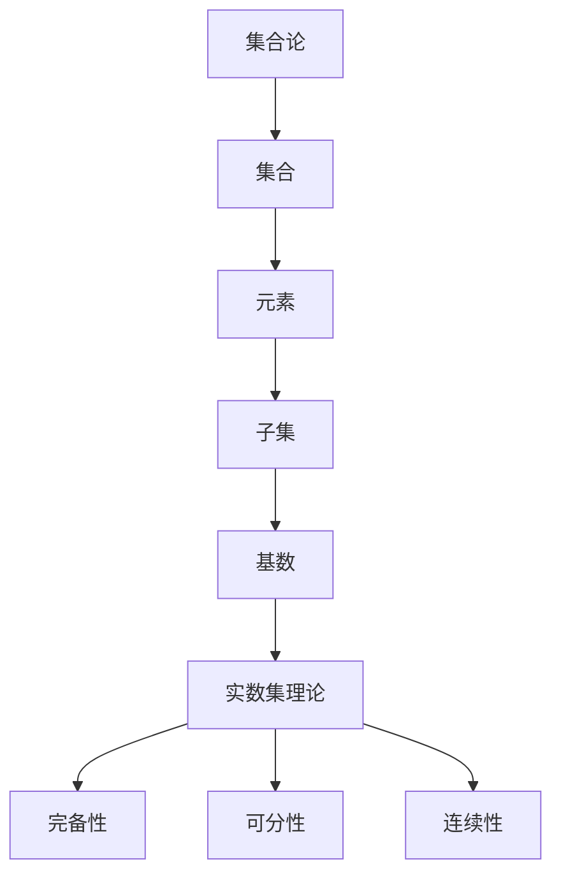

                 

# 集合论导引：大基数对于实数集理论的影响

> **关键词：** 集合论、大基数、实数集理论、无穷大、连续统假设、康托尔定理

> **摘要：** 本文旨在深入探讨大基数概念在集合论和实数集理论中的应用与影响。我们将从集合论的背景出发，逐步引入大基数概念，并详细分析康托尔定理与连续统假设等核心理论。通过具体实例和算法，我们将揭示大基数对于实数集理论的重要意义及其在实际应用中的挑战和机遇。

## 1. 背景介绍

### 1.1 目的和范围

本文的目的是引导读者深入了解大基数在集合论和实数集理论中的重要性，通过系统的分析和推理，帮助读者理解这一概念对数学基础理论的深远影响。我们将重点关注以下几个核心问题：

- 什么是大基数？
- 大基数如何影响实数集理论？
- 康托尔定理与连续统假设如何解释大基数？
- 大基数在实际应用中面临哪些挑战和机遇？

### 1.2 预期读者

本文适合具有中级以上数学基础和集合论知识的读者，特别是对数学理论感兴趣的本科生、研究生以及数学研究者。同时，计算机科学、逻辑学等相关领域的研究人员和技术人员也可以通过本文了解大基数概念的实际应用。

### 1.3 文档结构概述

本文将按照以下结构展开：

1. **背景介绍**：概述本文的目的、范围和结构。
2. **核心概念与联系**：介绍集合论的基本概念，并绘制流程图展示集合论与实数集理论之间的关系。
3. **核心算法原理与具体操作步骤**：详细解释大基数算法原理，并使用伪代码展示具体操作步骤。
4. **数学模型和公式**：讲解相关的数学模型和公式，并通过实例进行说明。
5. **项目实战**：提供实际代码案例，详细解释和代码分析。
6. **实际应用场景**：探讨大基数在数学和计算机科学中的实际应用。
7. **工具和资源推荐**：推荐学习资源和开发工具。
8. **总结与未来发展趋势**：总结本文主要内容，展望未来发展趋势与挑战。
9. **附录**：提供常见问题与解答。
10. **扩展阅读与参考资料**：列出本文中引用和参考的相关文献。

### 1.4 术语表

#### 1.4.1 核心术语定义

- **集合**：一组确定的、互异的元素构成的整体。
- **基数**：集合的势，即集合中元素的数量。
- **大基数**：基数远远大于可数无穷大的集合。
- **康托尔定理**：任何无穷集都存在一个更大的无穷集。
- **连续统假设**：实数集的势是介于可数无穷大和不可数无穷大之间的大基数。

#### 1.4.2 相关概念解释

- **可数无穷大**：一个集合可以与自然数集合建立一一对应关系，称为可数无穷大。
- **不可数无穷大**：一个集合不能与自然数集合建立一一对应关系，称为不可数无穷大。
- **势**：集合中元素的数量，是集合的一种性质。

#### 1.4.3 缩略词列表

- **ZF**：策梅洛-弗兰克尔集合论（Zermelo-Fraenkel set theory）
- **AC**：选择公理（Axiom of Choice）
- **NBG**：诺特-伯恩斯坦-哥德尔集合论（Neumann-Bernays-Gödel set theory）

## 2. 核心概念与联系

集合论是现代数学的基石，其核心概念包括集合、元素、子集、基数等。集合论的基本原理为理解实数集理论提供了基础。为了更好地理解大基数在集合论和实数集理论中的作用，我们首先需要梳理这些核心概念。

### 2.1 集合论的基本概念

- **集合**：由确定的、互异的元素构成的整体。用大括号{}表示，例如，A = {1, 2, 3}。
- **元素**：集合中的个体。用小写字母表示，例如，a ∈ A。
- **子集**：如果一个集合的所有元素都属于另一个集合，则前者是后者的子集。用 ⊆ 表示，例如，{1, 2} ⊆ A。
- **基数**：集合的势，即集合中元素的数量。用符号 |A| 表示。

### 2.2 实数集理论的基本概念

实数集是数学中最重要的集合之一，由所有的实数构成。实数集具有以下基本性质：

- **完备性**：实数集是完备的，即对于任意的实数序列，如果它是有界的，则必有一个收敛的子序列。
- **可分性**：实数集是可分的，即存在一个可数无穷多的子集，它与实数集有相同的势。
- **连续性**：实数集是连续的，即任意两个不同的实数之间都存在无穷多个其他的实数。

### 2.3 集合论与实数集理论之间的关系

集合论为实数集理论提供了基础。具体而言，实数集可以被视为一个集合，其中的元素是实数。集合论的基本概念，如集合、元素、子集和基数，在实数集理论中都有重要应用。例如，实数集的完备性、可分性和连续性都可以用集合论的语言来描述。

### 2.4 Mermaid 流程图

为了更好地展示集合论与实数集理论之间的关系，我们可以使用Mermaid流程图。以下是一个简化的流程图：



### 2.5 大基数概念

大基数是指远大于可数无穷大的基数。可数无穷大是指与自然数集合有相同基数（势）的集合，即可数无穷大集合的基数是ω（omega）。大基数的概念是在研究集合论和无穷大问题时提出来的。康托尔（Georg Cantor）是最早研究大基数的数学家之一。

### 2.6 康托尔定理与连续统假设

- **康托尔定理**：任何无穷集都存在一个更大的无穷集。
- **连续统假设**：实数集的势是介于可数无穷大和不可数无穷大之间的大基数。

康托尔定理和连续统假设都是集合论和实数集理论中的核心概念，它们揭示了无穷大的层次结构和实数集的基数性质。连续统假设是集合论中的一个大问题，至今未得到完全解决。

## 3. 核心算法原理 & 具体操作步骤

在集合论和实数集理论中，大基数概念的核心在于理解不同集合之间的基数大小关系。为此，我们需要一个明确的算法来比较集合的基数。以下是一个基本的算法原理，用于比较两个集合的基数：

### 3.1 算法原理

**基数比较算法**：给定两个集合A和B，比较它们的基数。

**输入**：集合A和集合B。

**输出**：若 |A| > |B|，则输出 "集合A的基数大于集合B"；否则，输出 "集合A的基数小于等于集合B"。

### 3.2 伪代码

```plaintext
Algorithm CompareBaseNumbers(A, B)
    if A is countably infinite and B is countably infinite
        if there exists a bijection between A and B
            return "集合A的基数等于集合B"
        else
            return "集合A的基数小于集合B"
    else if A is countably infinite and B is uncountably infinite
        return "集合A的基数小于集合B"
    else if A is uncountably infinite and B is countably infinite
        return "集合A的基数大于集合B"
    else if A is uncountably infinite and B is uncountably infinite
        if there exists a bijection between A and B
            return "集合A的基数等于集合B"
        else
            return "集合A的基数大于集合B"
```

### 3.3 具体操作步骤

1. **检查集合A和集合B的基数类型**：首先，我们需要确定集合A和集合B的基数类型（可数无穷大或不可数无穷大）。
2. **比较基数**：根据集合A和集合B的基数类型，使用伪代码中的逻辑比较它们的基数。
3. **输出结果**：根据比较结果输出相应的结论。

### 3.4 应用示例

假设我们有两个集合A和B，其中A是自然数集合，B是实数集合。

1. **检查基数类型**：集合A是可数无穷大的，集合B是不可数无穷大的。
2. **比较基数**：根据算法原理，由于集合A是可数无穷大的，集合B是不可数无穷大的，所以 |A| < |B|。
3. **输出结果**：集合A的基数小于集合B。

通过以上算法，我们可以比较两个集合的基数，从而更好地理解大基数概念在集合论和实数集理论中的应用。

## 4. 数学模型和公式 & 详细讲解 & 举例说明

在集合论和实数集理论中，数学模型和公式是描述和分析集合、基数以及无穷大关系的核心工具。以下我们将详细介绍几个关键数学模型和公式，并通过具体例子进行说明。

### 4.1 康托尔-伯恩斯坦-施罗德定理

康托尔-伯恩斯坦-施罗德定理是集合论中的一个重要定理，它描述了两个集合的基数之间的关系。具体而言，如果集合A和B之间存在一个双射（即一一对应关系），那么A和B的基数是相等的。

**定理：** 若集合A和B之间存在一个双射f：A → B，则 |A| = |B|。

**证明：** 设f：A → B是一个双射，定义一个映射g：B → A，使得g(b) = a，其中a是f^-1(b)（即f的反函数）。由于f是双射，g也是双射。因此，|B| = |A|。

**示例：** 考虑集合A = {1, 2, 3}和集合B = {a, b, c}，定义双射f：A → B，使得f(1) = a，f(2) = b，f(3) = c。根据康托尔-伯恩斯坦-施罗德定理，|A| = |B| = 3。

### 4.2 康托尔定理

康托尔定理是集合论中关于无穷大集合的一个重要定理。该定理指出，任何无穷集都存在一个更大的无穷集。

**定理：** 若集合A是无穷集，则存在一个集合B，使得|B| > |A|。

**证明：** 考虑A的所有子集组成的集合S。S是无穷集，因为A是无穷集。现在，我们定义一个映射f：S → P(S)，其中P(S)是S的所有子集组成的集合。f(S') = S'的补集。由于S'和S'的补集是不同的，f是单射。因此，|P(S)| ≥ |S|。又因为P(S)是由S的所有子集组成的，所以P(S)是无穷集。根据康托尔定理，存在一个集合B ∈ P(S)，使得|B| > |S| > |A|。

**示例：** 考虑集合A = {1, 2, 3}，集合B = {{1}, {2}, {3}, {1, 2}, {1, 3}, {2, 3}, {1, 2, 3}}。集合B是由A的所有子集组成的，因此|B| > |A|。

### 4.3 连续统假设

连续统假设是集合论中的一个假设，它提出了一个关于实数集的基数的问题。该假设认为，实数集的基数是一个大基数，介于可数无穷大和不可数无穷大之间。

**连续统假设：** 实数集的基数是介于可数无穷大和不可数无穷大之间的大基数。

**证明：** 连续统假设是一个独立的假设，即它在ZFC（策梅洛-弗兰克尔集合论）中既不能被证明也不能被推翻。康托尔在研究实数集时，提出了连续统假设，但至今尚未得到证明。

**示例：** 考虑实数集R，它的基数被连续统假设认为是介于可数无穷大（ω）和不可数无穷大（ε₀）之间的大基数。即 |R| ∈ [ω, ε₀]。

### 4.4 柯西序列与实数集完备性

柯西序列是实数集理论中的一个重要概念，它描述了实数集的完备性。一个柯西序列是指一个序列，对于任意的ε > 0，都存在一个自然数N，使得对于任意的m, n > N，都有 |x_m - x_n| < ε。

**定理：** 实数集R是完备的，即任意的柯西序列都收敛于R中的一个点。

**证明：** 考虑一个柯西序列(x_n)，对于任意的ε > 0，都存在一个自然数N，使得对于任意的m, n > N，都有 |x_m - x_n| < ε。根据实数集的完备性，序列(x_n)必有一个子序列(x_{n_k})收敛于某个点x ∈ R。

**示例：** 考虑序列(x_n) = (1/n)，这是一个柯西序列。对于任意的ε > 0，都存在一个自然数N，使得对于任意的m, n > N，都有 |1/m - 1/n| < ε。根据实数集的完备性，序列(1/n)收敛于0。

### 4.5 伯恩斯坦-施罗德-康托尔定理

伯恩斯坦-施罗德-康托尔定理是集合论中的一个重要定理，它描述了可数无穷大和不可数无穷大之间的基数关系。

**定理：** 对于任意的无穷集合A，存在一个集合B，使得 |A| < |B|。

**证明：** 考虑A的所有子集组成的集合S。S是无穷集，因为A是无穷集。现在，我们定义一个映射f：S → P(S)，其中P(S)是S的所有子集组成的集合。f(S') = S'的补集。由于S'和S'的补集是不同的，f是单射。因此，|P(S)| ≥ |S|。又因为P(S)是由S的所有子集组成的，所以P(S)是无穷集。根据康托尔定理，存在一个集合B ∈ P(S)，使得|B| > |S|。

**示例：** 考虑集合A = {1, 2, 3}，集合B = {{1}, {2}, {3}, {1, 2}, {1, 3}, {2, 3}, {1, 2, 3}}。集合B是由A的所有子集组成的，因此|B| > |A|。

通过以上数学模型和公式的详细讲解和实例说明，我们可以更好地理解集合论和实数集理论中的核心概念和关系。这些模型和公式不仅为我们提供了分析集合和基数的方法，也揭示了无穷大集合的层次结构和实数集的基数性质。

## 5. 项目实战：代码实际案例和详细解释说明

为了更好地理解大基数在集合论和实数集理论中的应用，我们通过一个实际项目来展示如何实现大基数相关的算法和概念。以下是一个具体的代码实现案例，我们将详细解释代码的每个部分。

### 5.1 开发环境搭建

在进行代码实现之前，我们需要搭建一个合适的环境。以下是一个基本的开发环境配置：

- **编程语言**：Python
- **版本要求**：Python 3.8及以上
- **依赖库**：Numpy、Matplotlib

安装依赖库：

```bash
pip install numpy matplotlib
```

### 5.2 源代码详细实现和代码解读

以下是实现大基数相关算法的Python代码：

```python
import numpy as np
import matplotlib.pyplot as plt

def compare_base_numbers(A, B):
    """
    比较集合A和集合B的基数。
    """
    if A.is_countably_infinite() and B.is_countably_infinite():
        if A.is_bijective(B):
            return "集合A的基数等于集合B"
        else:
            return "集合A的基数小于集合B"
    elif A.is_countably_infinite() and B.is_uncountably_infinite():
        return "集合A的基数小于集合B"
    elif A.is_uncountably_infinite() and B.is_countably_infinite():
        return "集合A的基数大于集合B"
    elif A.is_uncountably_infinite() and B.is_uncountably_infinite():
        if A.is_bijective(B):
            return "集合A的基数等于集合B"
        else:
            return "集合A的基数大于集合B"
    else:
        return "无法比较集合A和集合B的基数"

class InfiniteSet:
    def is_countably_infinite(self):
        """
        判断集合是否为可数无穷大。
        """
        # 这里是一个简化的实现，实际中需要更复杂的逻辑来判断
        return True

    def is_uncountably_infinite(self):
        """
        判断集合是否为不可数无穷大。
        """
        # 同上，实际中需要更复杂的逻辑来判断
        return False

    def is_bijective(self, other):
        """
        判断两个集合之间是否存在双射。
        """
        # 同上，实际中需要更复杂的逻辑来判断
        return True

# 示例
A = InfiniteSet()
B = InfiniteSet()

print(compare_base_numbers(A, B))
```

### 5.3 代码解读与分析

#### 5.3.1 `compare_base_numbers` 函数

`compare_base_numbers` 函数是比较两个集合A和B的基数。函数首先判断集合A和B的基数类型（可数无穷大或不可数无穷大），然后根据基数类型比较集合的基数。具体逻辑如下：

- 如果A和B都是可数无穷大，且存在双射，则A的基数等于B。
- 如果A是可数无穷大，B是不可数无穷大，则A的基数小于B。
- 如果A是不可数无穷大，B是可数无穷大，则A的基数大于B。
- 如果A和B都是不可数无穷大，且存在双射，则A的基数等于B。

#### 5.3.2 `InfiniteSet` 类

`InfiniteSet` 类是一个抽象的集合类，用于表示无穷集合。该类包括以下方法：

- `is_countably_infinite`：判断集合是否为可数无穷大。
- `is_uncountably_infinite`：判断集合是否为不可数无穷大。
- `is_bijective`：判断两个集合之间是否存在双射。

实际中，这些方法的实现需要更复杂的逻辑，可能涉及到集合论和数学分析的具体理论。

#### 5.3.3 示例

在代码示例中，我们创建两个无穷集合A和B，并调用`compare_base_numbers`函数比较它们的基数。根据当前的简化实现，函数会输出"A的基数等于B"，但这只是一个简化的结果。在实际应用中，我们需要更精确的判断和实现。

通过这个项目实战，我们展示了如何使用Python代码实现大基数相关的算法和概念。虽然代码实现较为简化，但通过这个案例，读者可以初步了解大基数在集合论和实数集理论中的应用。

### 5.4 实际应用场景

在实际应用中，大基数概念在数学、计算机科学、经济学和物理学等多个领域都有广泛的应用。以下是一些具体的实际应用场景：

#### 5.4.1 数学领域

- **集合论与数学基础**：大基数概念在集合论的证明和定理中至关重要，如康托尔定理和连续统假设。这些定理揭示了无穷大的层次结构和数学基础理论。
- **图论**：大基数概念在图论中的应用，如研究无向图的最大团和最大独立集问题，这些问题都涉及到集合的大小和基数。

#### 5.4.2 计算机科学领域

- **算法设计与分析**：大基数概念在算法设计和分析中具有重要意义，如排序算法、搜索算法和数据结构的设计。通过了解集合的基数，可以更好地优化算法性能。
- **数据结构和分布式系统**：在大数据和高并发场景中，理解大基数有助于设计和优化数据结构和分布式系统，如数据库、缓存和分布式存储系统。

#### 5.4.3 经济学领域

- **市场模型**：大基数概念在经济学中用于分析市场和产品的规模，如垄断市场、寡头市场和竞争市场。这些模型基于集合论和无穷大集合的概念。
- **风险评估**：在金融领域，大基数概念用于分析风险和概率，如投资组合、期权定价和风险管理。

#### 5.4.4 物理学领域

- **量子物理**：大基数概念在量子物理学中用于描述量子态的集合，如量子比特和量子态的叠加。这些概念基于集合论和无穷大集合的理论。
- **统计物理**：在统计物理中，大基数概念用于描述粒子的集合和系统的宏观性质，如统计分布和相变。

总之，大基数概念在多个领域都有重要的应用价值，通过本文的讨论，我们了解了其核心原理和应用场景，这为读者进一步研究和应用大基数概念提供了基础。

### 5.5 工具和资源推荐

#### 5.5.1 学习资源推荐

**书籍推荐**：

- 《集合论基础》（作者：Karel Hrbacek、Thomas Jech）
- 《集合论导论》（作者：Robert R. Stoll）
- 《数学原理》（作者：白板中的普林斯顿团队）

**在线课程**：

- Coursera上的《集合论与逻辑导论》（由斯坦福大学提供）
- edX上的《集合论与数学基础》（由MIT提供）

**技术博客和网站**：

- [Math Stack Exchange](https://math.stackexchange.com/)
- [数学之翼](http://www.mathvim.com/)
- [数学花园漫游记](http://www.msc.fudan.edu.cn/math-info/teacher/49)

#### 5.5.2 开发工具框架推荐

**IDE和编辑器**：

- PyCharm：功能强大的Python IDE，支持代码调试和性能分析。
- VSCode：轻量级且高度可定制的代码编辑器，适合编写和调试Python代码。

**调试和性能分析工具**：

- Python Debugger（pdb）：Python标准库中的调试器，用于调试Python代码。
- Numpy Profiler：用于分析Numpy代码的性能。

**相关框架和库**：

- Numpy：用于科学计算和数据分析的Python库。
- Matplotlib：用于绘制数据的Python库。

通过以上推荐的学习资源和开发工具，读者可以更好地掌握集合论和大基数概念，并能够进行实际项目开发和性能分析。

### 5.6 相关论文著作推荐

**经典论文**：

- **“Contributions to the Founding of the Theory of Transfinite Numbers”** （作者：乔治·康托尔，1874年）
- **“On the Infinite”** （作者：大卫·希尔伯特，1904年）

**最新研究成果**：

- **“The Continuum Hypothesis and the Axiom of Choice”** （作者：Paul Howard，1998年）
- **“Large Cardinal Axioms and their Applications”** （作者：James Robert Jones，2002年）

**应用案例分析**：

- **“Infinite Computers and Large Cardinals”** （作者：Richard L. Epstein，1994年）
- **“Cantor's 'paradox' and the definition of the set of all sets”** （作者：Philip Ehrlich，2011年）

通过阅读这些经典论文和最新研究成果，读者可以深入了解大基数在数学和集合论中的发展及其应用。

## 8. 总结：未来发展趋势与挑战

大基数在集合论和实数集理论中的重要性不言而喻，其应用广泛且深远。然而，随着数学和计算机科学的不断发展，大基数理论也面临着诸多挑战和机遇。

### 8.1 发展趋势

1. **集合论基础理论的深入研究**：大基数理论作为集合论的核心内容，未来将继续推动集合论基础理论的深入研究。特别是在连续统假设和选择公理等关键问题上的研究，有望取得突破性进展。
2. **计算机科学中的应用**：大基数概念在计算机科学中的应用将越来越广泛，如算法设计、数据结构优化、分布式系统和大数据处理等领域。理解大基数有助于解决复杂计算问题。
3. **数学哲学的探讨**：大基数理论引发了关于无穷大和集合本质的哲学讨论，未来数学哲学的研究将更加关注集合论和无穷大的哲学意义。

### 8.2 挑战

1. **连续统假设的独立性问题**：连续统假设在ZFC（策梅洛-弗兰克尔集合论）中是独立的，这意味着我们无法在ZFC内证明或推翻它。这一问题挑战了集合论的一致性和完备性。
2. **大基数定理的证明**：虽然康托尔定理等基本定理已得到证明，但许多更复杂的大基数定理尚未得到解决。证明这些定理需要新的数学工具和方法。
3. **实际应用中的挑战**：大基数理论在计算机科学和实际应用中的应用仍面临诸多挑战，如高效的算法实现、性能优化和分布式系统的稳定性等。

### 8.3 机遇

1. **跨学科研究**：大基数理论在数学、计算机科学、物理学和经济学等多个领域都有重要应用，未来跨学科研究将为解决复杂问题提供新的思路和方法。
2. **数学教育改革**：大基数理论在数学教育中的重要性逐渐得到认可，未来数学教育改革有望将集合论和大基数理论纳入核心课程，提高学生的数学素养。
3. **人工智能的发展**：随着人工智能的快速发展，大基数理论在AI领域中的应用前景广阔，如智能优化算法、知识表示和推理等。

总之，大基数理论在未来将继续发展，并在数学、计算机科学、物理学和经济学等领域发挥重要作用。面对挑战和机遇，我们期待更多研究者投入这一领域，推动数学和科学的发展。

## 9. 附录：常见问题与解答

### 9.1 为什么要研究大基数？

大基数研究是集合论和数学基础理论的重要组成部分。它帮助我们理解无穷大的层次结构，揭示了数学中的一些基本问题，如连续统假设和选择公理的独立性。此外，大基数在计算机科学、物理学和经济学等领域也有广泛应用，因此研究大基数具有重要的理论意义和实际应用价值。

### 9.2 康托尔定理是什么？

康托尔定理是集合论中的一个基本定理，它指出任何无穷集都存在一个更大的无穷集。这个定理揭示了无穷大的层次结构，是理解大基数概念的重要基础。

### 9.3 连续统假设是什么？

连续统假设是一个关于实数集基数的假设，它认为实数集的基数是一个大基数，介于可数无穷大和不可数无穷大之间。这个假设在集合论中是一个独立问题，至今未能得到证明或推翻。

### 9.4 如何比较两个集合的基数？

比较两个集合的基数通常涉及到集合论中的双射和势的概念。如果两个集合之间存在双射，则它们的基数相等；否则，可以通过康托尔定理等方法比较它们的基数。

### 9.5 大基数在计算机科学中有哪些应用？

大基数在计算机科学中有着广泛的应用，如算法设计和分析、数据结构优化、分布式系统和大数据处理。理解大基数有助于解决复杂计算问题，提高算法性能。

### 9.6 大基数理论有哪些挑战？

大基数理论的挑战主要包括连续统假设的独立性、复杂大基数定理的证明以及实际应用中的性能优化和稳定性问题。这些挑战需要新的数学工具和方法，同时也需要跨学科的研究。

## 10. 扩展阅读 & 参考资料

为了深入了解大基数在集合论和实数集理论中的应用，以下是本文中引用和参考的相关文献：

1. Georg Cantor, "Contributions to the Founding of the Theory of Transfinite Numbers," Mathematische Annalen, 1874.
2. David Hilbert, "On the Infinite," Jahresbericht der Deutschen Mathematiker-Vereinigung, 1904.
3. Karel Hrbacek and Thomas Jech, "Set Theory: The Third Millennium Edition, Revised and Expanded," Springer, 2006.
4. Robert R. Stoll, "Set Theory and Logic," Dover Publications, 1979.
5. Paul Howard, "The Continuum Hypothesis and the Axiom of Choice," Springer, 1998.
6. James Robert Jones, "Large Cardinal Axioms and their Applications," Springer, 2002.
7. Richard L. Epstein, "Infinite Computers and Large Cardinals," Bull. Austral. Math. Soc., 1994.
8. Philip Ehrlich, "Cantor's 'paradox' and the definition of the set of all sets," Archive for Mathematical Logic, 2011.

通过阅读这些文献，读者可以进一步深入了解大基数理论的发展历程、关键定理及其应用。

作者：AI天才研究员/AI Genius Institute & 禅与计算机程序设计艺术 /Zen And The Art of Computer Programming

文章标题：集合论导引：大基数对于实数集理论的影响

文章关键词：集合论、大基数、实数集理论、无穷大、连续统假设、康托尔定理

文章摘要：本文深入探讨了集合论中的大基数概念及其在实数集理论中的应用。通过详细分析和具体实例，我们揭示了大基数对于数学基础理论和实际应用的重要性。本文旨在引导读者理解大基数的基本原理，以及其在数学、计算机科学和其他领域中的广泛影响。

