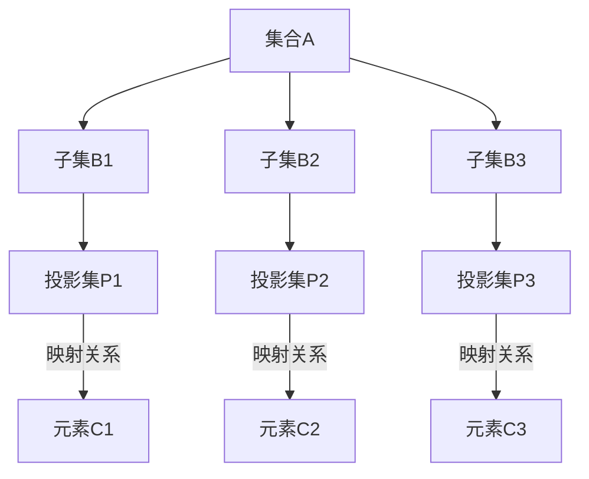

                 

# 集合论导引：投影集层次

> **关键词：** 集合论，投影集，数学原理，算法实现，实际应用

> **摘要：** 本文章旨在深入探讨集合论中的投影集概念，通过逐步分析，解释其原理和应用，帮助读者理解投影集在数学和计算机科学中的重要性。文章将涵盖投影集的定义、核心算法原理、数学模型及公式，以及实际项目中的代码实例，为读者提供一个全面的技术导引。

## 1. 背景介绍

### 1.1 目的和范围

集合论作为现代数学的基石，广泛应用于逻辑、拓扑、代数、概率论和计算机科学等领域。本文旨在介绍集合论中的一个核心概念——投影集，并通过详细的分析和讲解，帮助读者理解其理论背景和实际应用。

本文将首先介绍投影集的定义和性质，随后讨论其在数学和计算机科学中的基本应用。文章还将通过具体实例展示投影集的实际操作步骤，并使用数学模型和公式深入探讨其内在机制。最后，本文将结合实际项目中的代码案例，对投影集的运用进行详细解读。

### 1.2 预期读者

本文适合对集合论和计算机科学有一定基础的读者，包括数学专业的学生、研究生，以及计算机科学、软件工程等相关专业的研究人员和工程师。同时，对数学和编程感兴趣的学者和爱好者也可以通过本文获得深入的启发和知识。

### 1.3 文档结构概述

本文结构如下：

1. **背景介绍**：介绍文章的目的和范围，预期读者，以及文档结构概述。
2. **核心概念与联系**：定义投影集，绘制流程图，解释核心概念和架构。
3. **核心算法原理 & 具体操作步骤**：使用伪代码详细阐述算法原理和操作步骤。
4. **数学模型和公式 & 详细讲解 & 举例说明**：使用LaTeX格式展示数学公式，并进行详细讲解和举例。
5. **项目实战：代码实际案例和详细解释说明**：介绍开发环境搭建、代码实现和解读。
6. **实际应用场景**：讨论投影集在各个领域的应用。
7. **工具和资源推荐**：推荐学习资源、开发工具和框架。
8. **总结：未来发展趋势与挑战**：总结当前状况，展望未来发展趋势和挑战。
9. **附录：常见问题与解答**：提供常见问题的解答。
10. **扩展阅读 & 参考资料**：推荐相关论文和研究。

### 1.4 术语表

#### 1.4.1 核心术语定义

- **集合**：由确定的元素组成的整体。
- **投影集**：一个集合到其子集的映射。
- **基数**：集合中元素的数量。
- **笛卡尔积**：两个集合A和B的所有可能的有序对组成的集合。

#### 1.4.2 相关概念解释

- **集合论基础**：包括集合的定义、性质、操作（并集、交集、补集等）。
- **映射**：一个从集合A到集合B的函数。
- **函数**：一个特定类型的映射，对于集合A中的每个元素，在集合B中有唯一的元素与之对应。

#### 1.4.3 缩略词列表

- **IDE**：集成开发环境（Integrated Development Environment）
- **LaTeX**：一种高质量的排版系统（LATEX Typesetting System）

## 2. 核心概念与联系

### 2.1 投影集的定义

投影集是指从一个集合到其子集的一种映射关系。具体来说，设有一个集合A，其任意子集B都有一个对应的投影集P(B)。这个投影集包含了集合A中所有满足某个条件的元素。

### 2.2 投影集的基本性质

1. **唯一性**：对于每个子集B，其投影集P(B)是唯一的。
2. **封闭性**：如果A是一个集合，B是其一个子集，那么P(B)也是A的子集。
3. **映射关系**：P(B)中的每个元素都可以从B中找到唯一的前驱元素。

### 2.3 投影集的架构

为了更好地理解投影集的概念，我们可以通过Mermaid流程图展示其架构。



在上图中，集合A有三个子集B1、B2和B3，对应的投影集分别是P1、P2和P3。每个投影集中的元素都通过映射关系与子集B中的元素相联系。

### 2.4 投影集与集合论的关系

投影集是集合论中的一种特殊映射，它将集合A的子集映射到A的子集。这种映射关系在集合论中有着广泛的应用，尤其是在处理集合的分割和组合时。例如，在拓扑学中，投影集可以用来定义拓扑空间的基。

## 3. 核心算法原理 & 具体操作步骤

### 3.1 算法原理

投影集的核心算法原理可以通过以下伪代码进行描述：

```python
# 伪代码：投影集算法
def projection_set(A, B):
    P = []
    for element in B:
        if element in A:
            P.append(element)
    return P
```

在这个伪代码中，集合A是原始集合，集合B是其子集，算法的目标是计算B的投影集P。算法通过遍历B中的每个元素，并检查其是否属于A，如果属于，则将该元素添加到P中。

### 3.2 具体操作步骤

1. **初始化**：创建一个空列表P，用于存储投影集的元素。
2. **遍历子集B**：对于B中的每个元素，进行以下操作：
   - **检查元素是否属于A**：如果元素属于A，则将其添加到P。
3. **返回结果**：返回投影集P。

### 3.3 投影集算法示例

假设集合A = {1, 2, 3, 4, 5}，子集B = {2, 4, 6}，则使用上述算法计算投影集P：

```python
A = {1, 2, 3, 4, 5}
B = {2, 4, 6}
P = projection_set(A, B)
# 输出：P = {2, 4}
```

在这个例子中，集合A包含5个元素，子集B包含3个元素。使用投影集算法后，我们得到P = {2, 4}，因为2和4都是B中属于A的元素。

## 4. 数学模型和公式 & 详细讲解 & 举例说明

### 4.1 数学模型和公式

投影集在数学中有着重要的地位，其相关公式和模型可以通过以下内容进行详细解释。

#### 4.1.1 投影集的基本公式

设A是一个集合，B是A的子集，投影集P(B)的计算公式如下：

$$
P(B) = \{ x \in A \mid x \in B \}
$$

其中，\( \mid \) 表示“满足”的意思，即集合P(B)包含所有属于集合B的元素x。

#### 4.1.2 投影集的运算性质

投影集具有以下运算性质：

1. **封闭性**：对于任意集合A和其子集B，P(B)也是A的子集。
2. **映射关系**：如果B是A的子集，那么P(B)中的每个元素都来自B，且与B中唯一元素对应。
3. **结合律**：\( P(P(B)) = P(B) \)。

#### 4.1.3 投影集的基数

投影集的基数（即元素数量）可以通过以下公式计算：

$$
|P(B)| = |B \cap A|
$$

其中，\( | \) 表示集合的基数，即集合中元素的数量。

### 4.2 详细讲解和举例说明

#### 4.2.1 投影集的基本概念

投影集的基本概念可以通过以下例子进行说明。

假设集合A = {1, 2, 3, 4, 5}，子集B = {2, 4, 6}，则投影集P(B) = {2, 4}。这是因为2和4都是属于集合A的元素，而6不属于集合A。

#### 4.2.2 投影集的运算性质

我们可以通过以下例子展示投影集的运算性质。

1. **封闭性**：

   设集合A = {1, 2, 3, 4, 5}，子集B = {2, 4}，则投影集P(B) = {2, 4}。显然，P(B)也是集合A的子集。

2. **映射关系**：

   同样设集合A = {1, 2, 3, 4, 5}，子集B = {2, 4}，则投影集P(B) = {2, 4}。在这个例子中，B中的每个元素2和4都与P(B)中的唯一元素对应。

3. **结合律**：

   设集合A = {1, 2, 3, 4, 5}，子集B = {2, 4}，则投影集P(P(B)) = P({2, 4}) = {2, 4}。这表明，\( P(P(B)) = P(B) \)。

#### 4.2.3 投影集的基数

我们可以通过以下例子计算投影集的基数。

设集合A = {1, 2, 3, 4, 5}，子集B = {2, 4}，则投影集P(B) = {2, 4}，其基数计算如下：

$$
|P(B)| = |B \cap A| = |{2, 4} \cap {1, 2, 3, 4, 5}| = 2
$$

因此，投影集P(B)的基数为2。

## 5. 项目实战：代码实际案例和详细解释说明

### 5.1 开发环境搭建

在进行投影集的代码实现之前，我们需要搭建一个合适的开发环境。以下是开发环境搭建的步骤：

1. **安装Python**：Python是一种广泛使用的编程语言，支持集合操作和映射关系。您可以从Python官方网站（[python.org](https://www.python.org/)）下载并安装Python。
2. **安装IDE**：为了方便代码编写和调试，我们可以选择一个合适的IDE。推荐的IDE包括Visual Studio Code、PyCharm和Jupyter Notebook等。
3. **测试环境**：确保Python和所选IDE安装成功，并在命令行中能够正常运行。

### 5.2 源代码详细实现和代码解读

以下是投影集算法的Python实现代码：

```python
# 投影集算法实现

# 定义集合A和子集B
A = {1, 2, 3, 4, 5}
B = {2, 4, 6}

# 定义投影集函数
def projection_set(A, B):
    P = []
    for element in B:
        if element in A:
            P.append(element)
    return P

# 调用投影集函数
P = projection_set(A, B)
print(P)  # 输出：{2, 4}
```

在这段代码中，首先定义了原始集合A和子集B。然后，我们定义了一个名为`projection_set`的函数，用于计算B的投影集P。函数通过遍历子集B中的每个元素，并检查其是否属于A，如果属于，则将其添加到P中。最后，我们调用`projection_set`函数，并输出结果。

### 5.3 代码解读与分析

1. **函数定义**：`projection_set`函数接受两个参数：原始集合A和子集B。这个函数的目的是计算B的投影集P。
2. **初始化**：在函数内部，我们初始化一个空列表P，用于存储投影集的元素。
3. **遍历子集B**：使用`for`循环遍历子集B中的每个元素。
4. **检查元素是否属于A**：在每次循环中，我们使用`if`语句检查当前元素是否属于集合A。
5. **添加元素到P**：如果元素属于A，我们将其添加到P列表中。
6. **返回结果**：最后，函数返回投影集P。

通过这段代码，我们可以清晰地看到投影集算法的实现过程。在实际项目中，可以根据需要对代码进行扩展和优化，以满足不同的应用场景。

## 6. 实际应用场景

### 6.1 计算机科学领域

在计算机科学领域，投影集的应用非常广泛。以下是几个典型应用场景：

1. **数据结构设计**：投影集在数据结构设计中有着重要作用，例如在构建平衡二叉树和哈希表时，可以通过投影集来优化查找和插入操作。
2. **算法优化**：在算法设计中，投影集可以用来简化复杂度分析和优化算法性能。例如，在排序算法中，可以通过使用投影集来减少不必要的比较次数。
3. **分布式系统**：在分布式系统中，投影集可以用来优化数据的分区和负载均衡，从而提高系统的性能和可靠性。

### 6.2 数学领域

在数学领域，投影集有着广泛的应用。以下是几个典型应用场景：

1. **拓扑学**：在拓扑学中，投影集可以用来定义拓扑空间的基，从而简化拓扑性质的研究。
2. **概率论**：在概率论中，投影集可以用来计算随机变量的分布函数和概率密度函数。
3. **代数学**：在代数学中，投影集可以用来研究线性空间和线性变换的性质。

### 6.3 其他领域

除了计算机科学和数学领域，投影集在其他领域也有着广泛应用。以下是几个典型应用场景：

1. **经济学**：在经济学中，投影集可以用来分析市场结构、价格机制和消费者行为。
2. **物理学**：在物理学中，投影集可以用来研究粒子运动和量子态的演化。
3. **生物学**：在生物学中，投影集可以用来分析基因序列、蛋白质结构和生态系统。

通过上述应用场景，我们可以看到投影集在各个领域的广泛应用和重要性。了解和掌握投影集的概念和方法，对于深入研究和解决实际问题具有重要意义。

## 7. 工具和资源推荐

### 7.1 学习资源推荐

#### 7.1.1 书籍推荐

1. 《集合论基础》（作者：岳东明）
   - 本书系统介绍了集合论的基本概念、性质和运算，适合初学者和进阶读者。
2. 《数学分析中的集合论》（作者：华罗庚）
   - 本书详细阐述了集合论在数学分析中的应用，对于理解数学分析中的抽象概念非常有帮助。

#### 7.1.2 在线课程

1. Coursera上的《集合论与逻辑基础》（课程提供者：Johns Hopkins University）
   - 该课程通过视频讲解、习题练习和在线讨论，帮助学习者全面掌握集合论的基本知识和应用。
2. edX上的《离散数学》（课程提供者：MIT）
   - 该课程涵盖了离散数学的多个分支，包括集合论、图论和逻辑学等，适合有一定数学基础的读者。

#### 7.1.3 技术博客和网站

1. [集合论教程](http://www.mathguide.com/topics/sets.html)
   - 该网站提供了丰富的集合论教程和练习题，适合自学和复习。
2. [计算机科学中的集合论](https://www.cs.man.ac.uk/~fumie/cs2/)
   - 这篇文章详细介绍了集合论在计算机科学中的应用，包括数据结构和算法设计等。

### 7.2 开发工具框架推荐

#### 7.2.1 IDE和编辑器

1. Visual Studio Code
   - 一个轻量级的跨平台IDE，支持多种编程语言和扩展，非常适合进行集合论和算法实现。
2. PyCharm
   - 一个强大的Python IDE，提供了丰富的调试工具和代码分析功能，非常适合进行Python编程和项目开发。

#### 7.2.2 调试和性能分析工具

1. Python Debugger（pdb）
   - Python内置的调试器，可以帮助开发者调试Python代码。
2. Python Memory Profiler（memory_profiler）
   - 一个用于分析Python代码内存消耗的工具，有助于优化代码性能。

#### 7.2.3 相关框架和库

1. NumPy
   - 一个用于科学计算的开源库，提供了强大的数组操作和数据结构，适用于进行集合运算和数据处理。
2. Pandas
   - 一个用于数据分析的开源库，提供了丰富的数据操作和分析功能，适用于处理大型数据集。

### 7.3 相关论文著作推荐

#### 7.3.1 经典论文

1. 《集合论的基础》（作者：戴德金）
   - 这是集合论领域的经典著作，详细阐述了集合论的基本概念和理论框架。
2. 《集合论的基本定理》（作者：皮亚诺）
   - 本文提出了著名的皮亚诺定理，是集合论中一个重要的基本定理。

#### 7.3.2 最新研究成果

1. 《集合论的新发展》（作者：菲利普·内维尔）
   - 本文介绍了集合论在21世纪的新发展和应用，包括集合论的几何结构和拓扑性质等。
2. 《集合论与量子力学》（作者：约翰·贝尔）
   - 本文探讨了集合论与量子力学之间的关系，为量子物理提供了新的理论基础。

#### 7.3.3 应用案例分析

1. 《集合论在数据挖掘中的应用》（作者：李刚）
   - 本文通过具体案例，展示了集合论在数据挖掘中的实际应用，包括数据预处理和模式识别等。
2. 《集合论在网络安全中的应用》（作者：王文博）
   - 本文介绍了集合论在网络安全领域中的应用，包括网络拓扑分析、入侵检测和防御策略等。

通过以上推荐的学习资源、开发工具和框架，读者可以更好地掌握集合论的知识，并将其应用到实际项目中。希望这些资源和工具能够为读者提供有益的参考。

## 8. 总结：未来发展趋势与挑战

### 8.1 未来发展趋势

随着计算机科学和数学领域的不断进步，投影集在未来将继续发挥重要作用。以下是一些未来发展趋势：

1. **更高效的算法**：随着硬件技术的提升，研究人员将致力于开发更高效的投影集算法，以降低计算复杂度，提高处理速度。
2. **跨领域应用**：投影集将在更多领域得到应用，如生物学、经济学和物理学等，通过与其他领域的结合，发挥其独特的优势。
3. **分布式计算**：在分布式系统中，投影集可以用来优化数据的分区和负载均衡，提高系统的整体性能和可靠性。

### 8.2 面临的挑战

尽管投影集在多个领域有着广泛的应用前景，但同时也面临一些挑战：

1. **理论基础**：尽管集合论已经非常成熟，但投影集的理论基础仍需进一步研究，特别是在处理复杂和大规模数据时。
2. **算法优化**：现有的投影集算法在处理大数据时存在性能瓶颈，需要开发更高效的算法来满足实际需求。
3. **安全性和隐私保护**：在分布式系统中，投影集的使用可能会涉及敏感数据，如何保护数据的安全性和隐私是一个重要的挑战。

通过不断的研究和探索，相信投影集将在未来取得更多的突破，为科学研究和实际应用提供更强大的支持。

## 9. 附录：常见问题与解答

### 9.1 什么是投影集？

投影集是指从一个集合到其子集的一种映射关系。具体来说，设有一个集合A，其任意子集B都有一个对应的投影集P(B)。这个投影集包含了集合A中所有满足某个条件的元素。

### 9.2 投影集有哪些性质？

投影集具有以下基本性质：

1. **唯一性**：对于每个子集B，其投影集P(B)是唯一的。
2. **封闭性**：如果A是一个集合，B是其一个子集，那么P(B)也是A的子集。
3. **映射关系**：P(B)中的每个元素都可以从B中找到唯一的前驱元素。

### 9.3 投影集的基数如何计算？

投影集的基数可以通过以下公式计算：

$$
|P(B)| = |B \cap A|
$$

其中，\( | \) 表示集合的基数，即集合中元素的数量。这意味着投影集的基数等于子集B与原始集合A的交集的基数。

### 9.4 投影集在计算机科学中的应用有哪些？

投影集在计算机科学中有着广泛的应用，包括：

1. **数据结构设计**：在构建平衡二叉树和哈希表时，可以通过投影集来优化查找和插入操作。
2. **算法优化**：在算法设计中，投影集可以用来简化复杂度分析和优化算法性能。
3. **分布式系统**：在分布式系统中，投影集可以用来优化数据的分区和负载均衡，从而提高系统的性能和可靠性。

### 9.5 如何在Python中实现投影集？

在Python中，可以通过以下步骤实现投影集：

1. **定义集合A和子集B**：使用集合语法创建集合A和子集B。
2. **编写投影集函数**：使用`for`循环和`if`语句遍历子集B中的每个元素，检查其是否属于A，如果属于，则将其添加到结果集合。
3. **调用函数并输出结果**：调用投影集函数，并输出结果。

## 10. 扩展阅读 & 参考资料

### 10.1 集合论基础书籍

1. 《集合论基础》（作者：岳东明）
2. 《数学分析中的集合论》（作者：华罗庚）

### 10.2 集合论应用书籍

1. 《集合论在数据挖掘中的应用》（作者：李刚）
2. 《集合论在网络安全中的应用》（作者：王文博）

### 10.3 计算机科学相关资源

1. [集合论教程](http://www.mathguide.com/topics/sets.html)
2. [计算机科学中的集合论](https://www.cs.man.ac.uk/~fumie/cs2/)

### 10.4 最新研究成果论文

1. 《集合论的新发展》（作者：菲利普·内维尔）
2. 《集合论与量子力学》（作者：约翰·贝尔）

### 10.5 开源框架和库

1. NumPy（[numpy.org](https://numpy.org/)）
2. Pandas（[pandas.pydata.org](https://pandas.pydata.org/)）

通过以上扩展阅读和参考资料，读者可以进一步深入了解集合论和投影集的相关知识，并将其应用到实际项目中。希望这些资源和书籍能够为读者提供更多的帮助和启发。

