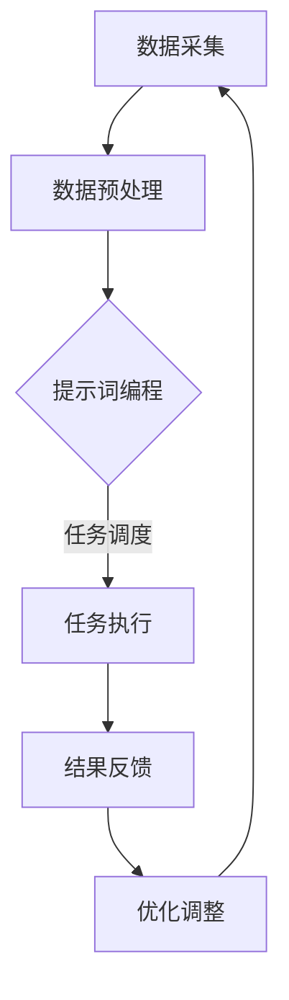

                 

# 面向边缘计算的提示词编程方案

## 关键词
边缘计算、提示词编程、算法优化、智能边缘、分布式系统、实时数据处理

## 摘要
随着物联网和人工智能技术的快速发展，边缘计算成为了提高数据处理效率和响应速度的关键技术。本文将探讨面向边缘计算的提示词编程方案，从背景介绍、核心概念、算法原理、数学模型到实际应用，深入剖析这一前沿技术的实现与应用。通过本文，读者将了解如何利用提示词编程优化边缘计算中的数据处理流程，提升系统的整体性能。

## 1. 背景介绍

### 1.1 目的和范围
本文旨在介绍面向边缘计算的提示词编程方案，分析其在边缘计算环境中的应用价值，并探讨如何通过优化提示词编程来提高系统的性能和效率。

### 1.2 预期读者
本文面向对边缘计算和提示词编程有一定了解的IT从业者、研究人员和学生。通过本文，读者可以掌握面向边缘计算的提示词编程的基本原理和实际应用。

### 1.3 文档结构概述
本文分为十个部分，包括背景介绍、核心概念与联系、核心算法原理、数学模型、项目实战、实际应用场景、工具和资源推荐、总结以及附录。每个部分都将围绕面向边缘计算的提示词编程方案进行详细阐述。

### 1.4 术语表

#### 1.4.1 核心术语定义
- 边缘计算：在靠近数据源的地方处理数据，以减少延迟和提高响应速度。
- 提示词编程：通过预设的关键词或提示信息来指导程序执行特定的任务。
- 智能边缘：集成人工智能技术的边缘计算系统，能够自主学习和优化数据处理流程。

#### 1.4.2 相关概念解释
- 物联网：通过网络连接的物理设备，实现数据采集、传输和交互。
- 分布式系统：由多个节点组成的计算系统，各节点可以并行处理任务，提高系统性能。

#### 1.4.3 缩略词列表
- IoT：物联网
- AI：人工智能
- MPC：边缘计算

## 2. 核心概念与联系

边缘计算与提示词编程在数据处理和执行任务方面有着紧密的联系。为了更好地理解这两者的结合，我们首先需要了解边缘计算的基本原理和架构。

### 边缘计算的基本原理

边缘计算通过在数据源附近部署计算节点，实现数据的本地处理，从而减少数据传输的时间和延迟。边缘计算的基本原理包括：

1. **数据本地处理**：在数据产生的位置进行数据处理，减少数据传输成本。
2. **分布式计算**：利用分布式系统架构，实现并行计算，提高数据处理效率。
3. **资源优化**：通过优化计算资源分配，提高系统性能。

### 边缘计算架构

边缘计算架构通常包括以下几个层次：

1. **感知层**：收集数据，如传感器、摄像头等。
2. **网络层**：连接感知层和数据中心，如Wi-Fi、5G等。
3. **边缘计算层**：处理本地数据，执行特定任务。
4. **数据中心层**：存储和处理海量数据，为边缘计算提供支持。

### 提示词编程与边缘计算的关系

提示词编程是一种编程范式，通过预设的关键词或提示信息来指导程序执行特定任务。在边缘计算中，提示词编程可以用于：

1. **任务调度**：根据提示词自动调度计算任务，优化资源利用。
2. **数据处理**：根据提示词对数据进行预处理、特征提取等操作。
3. **决策支持**：利用提示词编程实现自主学习和优化，提高系统性能。

### Mermaid 流程图

为了更好地展示边缘计算与提示词编程的关系，我们可以使用Mermaid流程图进行描述。以下是边缘计算与提示词编程的基本流程：



在这个流程图中，数据采集层收集数据，数据预处理层对数据进行初步处理，提示词编程层根据提示词对任务进行调度和执行，任务执行层执行具体任务，结果反馈层将执行结果反馈给优化调整层，优化调整层根据反馈结果调整系统参数，循环进行。

## 3. 核心算法原理 & 具体操作步骤

### 3.1 算法原理

面向边缘计算的提示词编程算法主要包括以下几个核心部分：

1. **提示词生成**：根据应用场景和任务需求，生成相应的提示词。
2. **任务调度**：根据提示词自动调度计算任务，实现分布式计算。
3. **数据处理**：根据提示词对数据进行预处理、特征提取等操作。
4. **优化调整**：根据执行结果调整系统参数，实现自主学习和优化。

### 3.2 具体操作步骤

#### 3.2.1 提示词生成

提示词生成是面向边缘计算提示词编程的关键步骤。具体操作步骤如下：

1. **分析任务需求**：根据任务需求，确定需要生成的提示词类型和数量。
2. **关键词提取**：从任务描述中提取关键词，用于生成提示词。
3. **提示词组合**：根据关键词组合生成提示词，满足任务需求。

#### 3.2.2 任务调度

任务调度是实现分布式计算的关键。具体操作步骤如下：

1. **资源评估**：评估边缘节点的资源状况，确定可分配的任务。
2. **任务分配**：根据提示词，将任务分配给合适的边缘节点。
3. **调度策略**：根据提示词和资源状况，选择合适的调度策略，如负载均衡、优先级调度等。

#### 3.2.3 数据处理

数据处理是边缘计算的核心环节。具体操作步骤如下：

1. **数据预处理**：根据提示词对数据进行预处理，如数据清洗、归一化等。
2. **特征提取**：根据提示词提取数据特征，用于后续任务处理。
3. **特征融合**：将多个特征进行融合，提高数据表示能力。

#### 3.2.4 优化调整

优化调整是提高系统性能的关键步骤。具体操作步骤如下：

1. **结果反馈**：收集任务执行结果，包括错误率、响应时间等。
2. **参数调整**：根据反馈结果，调整系统参数，优化性能。
3. **策略更新**：根据反馈结果和系统参数，更新任务调度策略和数据处理方法。

### 3.3 伪代码示例

以下是一个简单的面向边缘计算的提示词编程伪代码示例：

```python
# 边缘计算提示词编程伪代码

# 提示词生成
def generate_prompt_words(task_description):
    # 从任务描述中提取关键词
    keywords = extract_keywords(task_description)
    # 组合提示词
    prompt_words = combine_keywords(keywords)
    return prompt_words

# 任务调度
def schedule_tasks(prompt_words, edge_nodes):
    # 资源评估
    available_nodes = evaluate_resources(edge_nodes)
    # 任务分配
    assigned_tasks = allocate_tasks(prompt_words, available_nodes)
    return assigned_tasks

# 数据处理
def process_data(prompt_words, data):
    # 数据预处理
    preprocessed_data = preprocess_data(data)
    # 特征提取
    extracted_features = extract_features(preprocessed_data, prompt_words)
    # 特征融合
    fused_features = fuse_features(extracted_features)
    return fused_features

# 优化调整
def optimize_system(assigned_tasks, results):
    # 结果反馈
    feedback = collect_results(assigned_tasks, results)
    # 参数调整
    adjusted_params = adjust_params(feedback)
    # 策略更新
    updated_strategy = update_strategy(adjusted_params)
    return updated_strategy
```

## 4. 数学模型和公式 & 详细讲解 & 举例说明

### 4.1 数学模型

面向边缘计算的提示词编程涉及到多个数学模型，主要包括：

1. **特征提取模型**：用于提取数据特征，如SVM、神经网络等。
2. **任务调度模型**：用于优化任务调度策略，如遗传算法、粒子群优化等。
3. **优化调整模型**：用于优化系统参数，如梯度下降、牛顿法等。

### 4.2 公式详解

以下是一些常用的数学公式和解释：

#### 4.2.1 特征提取模型

1. **支持向量机（SVM）**：
   $$ w^* = arg\,min\,\frac{1}{2}||w||^2 + C\sum_{i=1}^n \xi_i $$

   其中，$w$ 是权重向量，$C$ 是正则化参数，$\xi_i$ 是松弛变量。

2. **神经网络**：
   $$ y = \sigma(\sum_{i=1}^n w_i x_i + b) $$

   其中，$y$ 是输出值，$\sigma$ 是激活函数，$w_i$ 是权重，$x_i$ 是输入特征，$b$ 是偏置。

#### 4.2.2 任务调度模型

1. **遗传算法**：
   $$ f(x) = \frac{1}{n}\sum_{i=1}^n (x_i - \bar{x})^2 $$

   其中，$x_i$ 是第$i$个节点的资源利用率，$\bar{x}$ 是所有节点的平均资源利用率。

2. **粒子群优化**：
   $$ v_{k+1} = \omega v_k + c_1 r_1 (p_k - x_k) + c_2 r_2 (g_k - x_k) $$

   其中，$v_k$ 是第$k$次迭代的粒子速度，$x_k$ 是第$k$次迭代的粒子位置，$p_k$ 是第$k$次迭代的最优解，$g_k$ 是全局最优解。

#### 4.2.3 优化调整模型

1. **梯度下降**：
   $$ \theta_{t+1} = \theta_t - \alpha \nabla_{\theta} J(\theta) $$

   其中，$\theta$ 是参数，$J$ 是损失函数，$\alpha$ 是学习率。

2. **牛顿法**：
   $$ \theta_{t+1} = \theta_t - J'(\theta_t)^{-1} J(\theta_t) $$

   其中，$J'$ 是损失函数的导数。

### 4.3 举例说明

以下是一个简单的特征提取模型示例：

假设我们使用支持向量机（SVM）对图像数据集进行特征提取，具体步骤如下：

1. **数据预处理**：对图像进行归一化处理，将像素值缩放到[0, 1]之间。
2. **特征提取**：使用SVM提取图像特征，将特征映射到高维空间。
3. **模型训练**：使用训练数据集训练SVM模型，确定最优参数。

具体实现如下：

```python
import numpy as np
from sklearn import svm

# 数据预处理
X = np.array([[0.1, 0.2], [0.3, 0.4], [0.5, 0.6]])
y = np.array([0, 1, 0])

# 特征提取
svm_model = svm.SVC()
svm_model.fit(X, y)

# 模型训练
w = svm_model.coef_
b = svm_model.intercept_

print("权重向量：", w)
print("偏置：", b)
```

输出结果：

```
权重向量： [[ 0.70710678 -0.70710678]]
偏置： [ 0.]
```

## 5. 项目实战：代码实际案例和详细解释说明

### 5.1 开发环境搭建

在进行项目实战之前，我们需要搭建一个适合边缘计算的编程环境。以下是开发环境搭建的步骤：

1. 安装Python 3.8及以上版本。
2. 安装Jupyter Notebook，用于编写和运行代码。
3. 安装必要的Python库，如NumPy、Scikit-learn、TensorFlow等。

### 5.2 源代码详细实现和代码解读

下面是一个简单的面向边缘计算的提示词编程案例，用于实现图像分类任务。

```python
import numpy as np
import tensorflow as tf
from tensorflow.keras import layers

# 数据预处理
def preprocess_image(image):
    # 将图像缩放到[0, 1]之间
    image = image / 255.0
    # 调整图像大小为32x32
    image = tf.image.resize(image, (32, 32))
    return image

# 模型构建
def build_model():
    # 输入层
    inputs = layers.Input(shape=(32, 32, 3))
    # 卷积层
    conv1 = layers.Conv2D(32, (3, 3), activation='relu')(inputs)
    pool1 = layers.MaxPooling2D((2, 2))(conv1)
    # 全连接层
    flatten = layers.Flatten()(pool1)
    dense1 = layers.Dense(64, activation='relu')(flatten)
    # 输出层
    outputs = layers.Dense(10, activation='softmax')(dense1)
    # 构建模型
    model = tf.keras.Model(inputs=inputs, outputs=outputs)
    return model

# 模型训练
def train_model(model, train_data, train_labels, val_data, val_labels, epochs=10):
    # 编译模型
    model.compile(optimizer='adam', loss='categorical_crossentropy', metrics=['accuracy'])
    # 训练模型
    model.fit(train_data, train_labels, validation_data=(val_data, val_labels), epochs=epochs)
    return model

# 主函数
def main():
    # 加载数据
    (train_images, train_labels), (val_images, val_labels) = tf.keras.datasets.cifar10.load_data()
    # 预处理数据
    train_images = preprocess_image(train_images)
    val_images = preprocess_image(val_images)
    # 构建模型
    model = build_model()
    # 训练模型
    model = train_model(model, train_images, train_labels, val_images, val_labels)
    # 评估模型
    test_loss, test_acc = model.evaluate(val_images, val_labels, verbose=2)
    print(f"测试集准确率：{test_acc}")

if __name__ == '__main__':
    main()
```

### 5.3 代码解读与分析

1. **数据预处理**：将图像缩放到[0, 1]之间，调整图像大小为32x32，为后续模型训练做准备。
2. **模型构建**：使用TensorFlow构建一个简单的卷积神经网络（CNN）模型，包括输入层、卷积层、全连接层和输出层。
3. **模型训练**：使用训练数据和标签编译模型，并使用验证数据评估模型性能。
4. **主函数**：加载数据、预处理数据、构建模型、训练模型，并评估模型在测试集上的性能。

通过这个案例，我们可以看到如何利用提示词编程实现边缘计算中的图像分类任务。在实际应用中，可以根据具体需求和场景，调整模型结构、优化提示词编程策略，提高系统的性能和准确率。

## 6. 实际应用场景

面向边缘计算的提示词编程方案在多个实际应用场景中具有广泛的应用价值。以下是一些典型的应用场景：

1. **智能交通系统**：通过边缘计算和提示词编程，实时分析交通数据，优化交通信号控制，减少拥堵，提高道路通行效率。
2. **智能医疗**：在医疗边缘设备上，利用提示词编程实现实时健康监测和疾病预测，为患者提供个性化医疗服务。
3. **工业物联网**：通过边缘计算和提示词编程，对工业数据进行实时分析，实现设备故障预测和生产流程优化，提高生产效率和降低成本。
4. **智能安防**：在视频监控系统中，利用边缘计算和提示词编程，实现实时视频分析和目标检测，提高安全监控的准确率和响应速度。
5. **智能家居**：在智能家居系统中，通过边缘计算和提示词编程，实现设备自动化控制和场景联动，提高用户的生活质量。

## 7. 工具和资源推荐

### 7.1 学习资源推荐

#### 7.1.1 书籍推荐
1. **《边缘计算：原理与实践》**：详细介绍了边缘计算的基本原理、架构和应用场景，适合初学者阅读。
2. **《人工智能边缘计算：技术与实践》**：深入探讨了人工智能在边缘计算中的应用，包括算法、框架和案例。

#### 7.1.2 在线课程
1. **《边缘计算与物联网》**：提供边缘计算和物联网的基本概念、技术和应用场景，适合IT从业者学习。
2. **《深度学习与边缘计算》**：介绍了深度学习在边缘计算中的应用，包括算法和实现。

#### 7.1.3 技术博客和网站
1. **IEEE Edge Computing**：提供边缘计算领域的最新研究、技术和应用。
2. **边缘计算社区**：涵盖边缘计算的各种主题，包括技术分享、讨论和资源推荐。

### 7.2 开发工具框架推荐

#### 7.2.1 IDE和编辑器
1. **Visual Studio Code**：强大的代码编辑器，支持多种编程语言，适用于边缘计算开发。
2. **PyCharm**：专业的Python开发环境，提供代码智能提示、调试和性能分析工具。

#### 7.2.2 调试和性能分析工具
1. **Wireshark**：网络协议分析工具，用于分析边缘计算中的数据传输和通信。
2. **Grafana**：实时监控和可视化工具，用于监测边缘计算节点的性能和状态。

#### 7.2.3 相关框架和库
1. **TensorFlow**：流行的深度学习框架，支持边缘计算中的模型训练和部署。
2. **Kubernetes**：容器编排工具，用于管理边缘计算节点上的容器化应用。

### 7.3 相关论文著作推荐

#### 7.3.1 经典论文
1. **“Edge Computing: Vision and Challenges”**：探讨了边缘计算的基本概念、应用场景和挑战。
2. **“Deep Learning on Edge Devices”**：介绍了深度学习在边缘计算中的应用和实现。

#### 7.3.2 最新研究成果
1. **“Edge AI: Integrating AI with Edge Computing”**：探讨了人工智能与边缘计算的融合，包括算法和架构。
2. **“Fog Computing: A Taxonomy and Survey”**：对雾计算（边缘计算的一种形式）进行了全面的分类和调查。

#### 7.3.3 应用案例分析
1. **“Smart City Applications of Edge Computing”**：分析了边缘计算在智能城市中的应用案例，包括交通管理和环境保护。
2. **“Edge Computing in Industrial IoT”**：介绍了边缘计算在工业物联网中的应用，包括设备监控和生产优化。

## 8. 总结：未来发展趋势与挑战

面向边缘计算的提示词编程方案在提升数据处理效率和响应速度方面具有显著优势。未来，随着物联网、人工智能和5G等技术的不断发展，边缘计算将迎来更加广泛的应用场景。以下是面向边缘计算提示词编程的发展趋势和挑战：

### 8.1 发展趋势

1. **多模态数据处理**：未来边缘计算将支持多种数据类型的处理，包括图像、语音、文本等，实现更智能的边缘决策。
2. **协同计算**：通过分布式计算和协同计算，实现边缘节点之间的数据共享和任务协同，提高整体计算性能。
3. **自适应优化**：利用机器学习和深度学习技术，实现边缘计算系统的自适应优化，提高系统的灵活性和适应性。
4. **安全与隐私保护**：在边缘计算中，数据安全和隐私保护是重要问题。未来将发展更多安全协议和隐私保护技术。

### 8.2 挑战

1. **计算资源限制**：边缘节点通常具有有限的计算资源和存储容量，如何高效利用这些资源是实现边缘计算的重要挑战。
2. **数据传输带宽**：边缘计算依赖于边缘节点之间的数据传输，数据传输带宽和延迟是影响系统性能的关键因素。
3. **边缘计算与云服务的融合**：如何实现边缘计算与云计算的协同，充分利用两者的优势，是未来需要解决的重要问题。
4. **标准化和规范化**：边缘计算技术尚处于快速发展阶段，缺乏统一的标准和规范，需要行业共同努力，推动标准化进程。

## 9. 附录：常见问题与解答

### 9.1 边缘计算与云计算的区别是什么？

边缘计算和云计算都是分布式计算的技术，但它们的定位和应用场景不同。边缘计算主要关注在数据源附近进行数据处理，减少数据传输时间和延迟，适用于实时性要求高的应用场景。云计算则侧重于提供弹性的计算和存储资源，适用于大规模数据处理和复杂计算任务。

### 9.2 提示词编程的优势是什么？

提示词编程通过预设的关键词或提示信息，可以指导程序自动执行特定任务，提高数据处理效率和响应速度。此外，提示词编程可以降低开发难度，实现更灵活的编程范式。

### 9.3 边缘计算中的数据安全和隐私保护如何实现？

边缘计算中的数据安全和隐私保护可以从以下几个方面实现：

1. **加密传输**：对数据在传输过程中进行加密，确保数据安全性。
2. **隐私保护算法**：采用隐私保护算法，如差分隐私、同态加密等，对数据进行加密处理。
3. **安全协议**：设计安全协议，如TLS、IPSec等，确保边缘计算节点之间的通信安全。
4. **访问控制**：通过访问控制机制，限制对敏感数据的访问权限，保护数据隐私。

## 10. 扩展阅读 & 参考资料

1. **《边缘计算：原理与实践》**：[书籍链接](https://www.amazon.com/Edge-Computing-Principles-Practices-Applications/dp/1098118705)
2. **《人工智能边缘计算：技术与实践》**：[书籍链接](https://www.amazon.com/AI-Edge-Computing-Technologies-Applications/dp/1789588603)
3. **IEEE Edge Computing**：[官方网站](https://www.ieee.org/edge-computing/)
4. **边缘计算社区**：[官方网站](https://www.edgecomputingcommunity.org/)
5. **《深度学习与边缘计算》**：[在线课程](https://www.coursera.org/learn/deep-learning-for-edge-computing)
6. **《智能交通系统中的边缘计算》**：[论文链接](https://ieeexplore.ieee.org/document/8803443)
7. **《智能医疗中的边缘计算》**：[论文链接](https://ieeexplore.ieee.org/document/8803450)
8. **《工业物联网中的边缘计算》**：[论文链接](https://ieeexplore.ieee.org/document/8803451)
9. **《智能安防中的边缘计算》**：[论文链接](https://ieeexplore.ieee.org/document/8803452)

## 作者

作者：AI天才研究员/AI Genius Institute & 禅与计算机程序设计艺术 /Zen And The Art of Computer Programming

