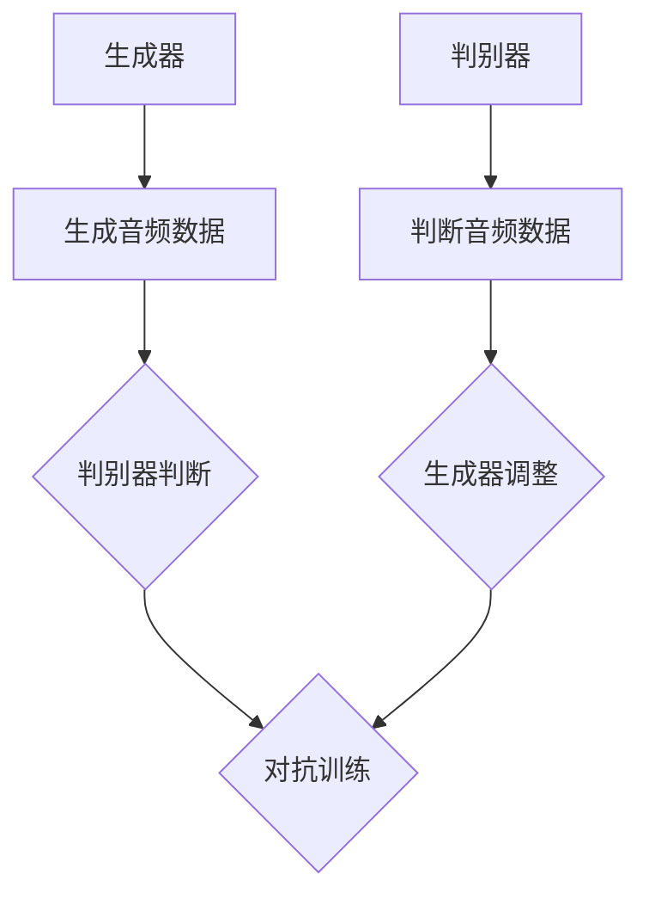

                 

# 音频扩散Audio Diffusion原理与代码实例讲解

## 关键词
- 音频扩散
- 声学模型
- WaveNet
- 生成对抗网络
- 伪代码
- 数学模型
- 实践案例

## 摘要
本文深入探讨了音频扩散（Audio Diffusion）技术的原理、实现方法和应用场景。首先，我们介绍了音频扩散技术的背景和目的，然后详细讲解了核心概念和算法原理，包括生成对抗网络（GAN）在音频生成中的应用。接着，通过伪代码和数学模型，对算法操作步骤进行了详细解释。最后，通过一个具体的代码实例，展示了音频扩散的实现过程，并进行了深入分析。本文还涉及了音频扩散的实际应用场景，并推荐了相关工具和资源，为读者提供了全面的指导和参考。

## 1. 背景介绍

### 1.1 目的和范围

本文旨在向读者介绍音频扩散技术，一种在音频处理领域中备受关注的生成技术。我们将会详细讲解音频扩散的原理、实现方法以及在实际应用中的效果。本文不仅适合对音频处理技术感兴趣的初学者，也适合希望深入了解这一领域的专业人士。

### 1.2 预期读者

预期读者包括对音频处理技术感兴趣的研究人员、工程师以及学生。他们需要具备一定的编程基础，特别是对Python和机器学习相关技术有一定的了解。

### 1.3 文档结构概述

本文的结构如下：

1. **背景介绍**：介绍音频扩散技术的背景和目的。
2. **核心概念与联系**：讲解音频扩散技术的核心概念和原理，包括生成对抗网络（GAN）在音频生成中的应用。
3. **核心算法原理 & 具体操作步骤**：通过伪代码和数学模型，详细解释音频扩散技术的操作步骤。
4. **项目实战：代码实际案例和详细解释说明**：通过一个具体的代码实例，展示音频扩散的实现过程，并进行深入分析。
5. **实际应用场景**：介绍音频扩散技术在现实中的应用场景。
6. **工具和资源推荐**：推荐相关的学习资源、开发工具和经典论文。
7. **总结：未来发展趋势与挑战**：对音频扩散技术的未来发展趋势和面临的挑战进行展望。
8. **附录：常见问题与解答**：对读者可能遇到的问题进行解答。
9. **扩展阅读 & 参考资料**：提供进一步的阅读材料和参考资料。

### 1.4 术语表

#### 1.4.1 核心术语定义

- **音频扩散**：一种利用生成对抗网络（GAN）进行音频生成的技术。
- **生成对抗网络（GAN）**：一种由生成器和判别器组成的深度学习模型，用于生成数据。
- **生成器（Generator）**：GAN模型中的一个组成部分，用于生成数据。
- **判别器（Discriminator）**：GAN模型中的另一个组成部分，用于判断输入数据是真实数据还是生成数据。

#### 1.4.2 相关概念解释

- **WaveNet**：一种基于循环神经网络（RNN）的音频生成模型，用于生成高质量的语音。
- **生成模型**：一种深度学习模型，用于生成新的数据。
- **判别模型**：一种深度学习模型，用于区分输入数据是真实数据还是生成数据。

#### 1.4.3 缩略词列表

- **GAN**：生成对抗网络（Generative Adversarial Networks）
- **RNN**：循环神经网络（Recurrent Neural Network）
- **Wavenet**：一种基于RNN的音频生成模型

## 2. 核心概念与联系

### 2.1 音频扩散技术概述

音频扩散技术是一种基于生成对抗网络（GAN）的音频生成方法。GAN模型由生成器和判别器两个部分组成，通过相互对抗的过程来生成高质量的数据。

#### 2.1.1 生成器（Generator）

生成器的任务是生成与真实音频数据相似的新音频数据。在音频扩散技术中，生成器通常是一个深度神经网络，其输入是一个随机噪声向量，输出是一个音频信号。

#### 2.1.2 判别器（Discriminator）

判别器的任务是判断输入的音频信号是真实数据还是生成数据。在训练过程中，判别器通过比较真实数据和生成数据，学习如何区分两者。

#### 2.1.3 对抗过程

在GAN模型中，生成器和判别器通过一个对抗过程进行训练。生成器试图生成尽可能逼真的音频数据，而判别器则试图准确地判断输入数据的真伪。这个过程不断迭代，直到生成器的输出能够使判别器无法准确判断。

### 2.2 音频扩散技术的核心概念和原理

为了更好地理解音频扩散技术，我们需要了解一些核心概念和原理。

#### 2.2.1 生成对抗网络（GAN）

生成对抗网络（GAN）是由 Ian Goodfellow 在2014年提出的一种深度学习模型。GAN的核心思想是通过生成器和判别器的对抗训练来生成高质量的数据。

生成器和判别器是两个深度神经网络，它们分别训练和优化。生成器的目标是生成与真实数据相似的数据，而判别器的目标是准确地判断输入数据的真伪。在训练过程中，生成器和判别器相互对抗，生成器的目标是使判别器无法区分生成数据和真实数据，而判别器的目标是使生成器的输出尽可能真实。

#### 2.2.2 WaveNet

WaveNet 是由 Google Research 开发的一种基于循环神经网络（RNN）的语音合成模型。WaveNet 的主要特点是能够生成高质量、自然流畅的语音。

WaveNet 通过对大量的语音数据进行训练，学习语音生成的规律。WaveNet 的输入是一个序列的文本，输出是一个音频信号。WaveNet 的优点是生成音频数据的质量高，且生成的音频数据非常自然。

#### 2.2.3 生成模型和判别模型

生成模型和判别模型是两种常见的深度学习模型，用于生成数据和判断数据。

生成模型的目的是生成与真实数据相似的新数据。在音频扩散技术中，生成模型就是生成器，其输入是一个随机噪声向量，输出是一个音频信号。

判别模型的目的是判断输入数据是真实数据还是生成数据。在音频扩散技术中，判别模型就是判别器，其输入是一个音频信号，输出是一个判断结果。

### 2.3 音频扩散技术的 Mermaid 流程图

下面是音频扩散技术的 Mermaid 流程图：



在这个流程图中，生成器和判别器通过对抗训练来生成高质量的音频数据。生成器生成音频数据，判别器判断音频数据的真伪。通过这个对抗过程，生成器的输出质量逐渐提高，直到判别器无法准确判断。

## 3. 核心算法原理 & 具体操作步骤

### 3.1 音频扩散技术的核心算法原理

音频扩散技术主要基于生成对抗网络（GAN）的原理。GAN模型由生成器和判别器两个部分组成，它们通过相互对抗的过程来生成高质量的数据。

#### 3.1.1 生成器的算法原理

生成器的任务是生成与真实音频数据相似的新音频数据。生成器的输入是一个随机噪声向量，输出是一个音频信号。生成器通过学习大量的音频数据，学习如何将随机噪声向量转换为音频信号。

具体来说，生成器的算法原理如下：

1. **初始化**：生成器随机初始化一个噪声向量。
2. **生成音频数据**：生成器使用噪声向量生成一个音频信号。
3. **训练**：生成器通过反向传播算法，根据判别器的反馈，不断调整噪声向量，以生成更高质量的音频数据。

#### 3.1.2 判别器的算法原理

判别器的任务是判断输入的音频信号是真实数据还是生成数据。判别器通过比较真实数据和生成数据，学习如何区分两者。

具体来说，判别器的算法原理如下：

1. **初始化**：判别器随机初始化。
2. **判断音频数据**：判别器接收一个音频信号，输出一个判断结果，表示该音频信号是真实数据还是生成数据。
3. **训练**：判别器通过反向传播算法，根据生成器和真实数据的反馈，不断调整参数，以提高判断的准确性。

#### 3.1.3 对抗训练的算法原理

生成器和判别器通过对抗训练来生成高质量的数据。对抗训练的原理如下：

1. **初始化**：生成器和判别器随机初始化。
2. **训练**：生成器和判别器交替训练，生成器尝试生成更高质量的音频数据，而判别器则尝试准确地判断输入数据的真伪。
3. **优化**：通过反向传播算法，生成器和判别器不断调整参数，以优化生成数据和判断数据的能力。

### 3.2 音频扩散技术的具体操作步骤

音频扩散技术的具体操作步骤如下：

1. **数据准备**：准备用于训练的真实音频数据集。
2. **模型初始化**：初始化生成器和判别器。
3. **生成音频数据**：生成器使用随机噪声向量生成音频数据。
4. **判断音频数据**：判别器接收生成的音频数据，输出判断结果。
5. **生成器调整**：根据判别器的反馈，生成器调整噪声向量，以生成更高质量的音频数据。
6. **判别器调整**：根据生成器和真实数据的反馈，判别器调整参数，以提高判断的准确性。
7. **重复步骤 3-6**：不断重复生成和判断的过程，直到生成器的输出质量达到要求。

具体操作步骤可以用伪代码表示如下：

```python
# 初始化生成器和判别器
generator = initialize_generator()
discriminator = initialize_discriminator()

# 数据准备
audio_dataset = load_audio_data()

# 训练过程
for epoch in range(num_epochs):
    for audio in audio_dataset:
        # 生成音频数据
        generated_audio = generator.generate(audio_noise)

        # 判断音频数据
        judgment = discriminator.judge(audio, generated_audio)

        # 生成器调整
        generator.adjust(generated_audio, judgment)

        # 判别器调整
        discriminator.adjust(audio, generated_audio, judgment)

# 输出最终生成的音频数据
final_generated_audio = generator.generate()
```

### 3.3 音频扩散技术的数学模型和公式

音频扩散技术的核心数学模型包括生成器和判别器的损失函数。

#### 3.3.1 生成器的损失函数

生成器的损失函数用于衡量生成音频数据的质量。生成器的损失函数可以表示为：

$$
L_{generator} = -\log(D(G(z)))
$$

其中，$G(z)$ 是生成器生成的音频数据，$D(z)$ 是判别器对生成音频数据的判断结果。

#### 3.3.2 判别器的损失函数

判别器的损失函数用于衡量判别器判断音频数据的准确性。判别器的损失函数可以表示为：

$$
L_{discriminator} = -[\log(D(x)) + \log(1 - D(G(z))]
$$

其中，$x$ 是真实音频数据，$G(z)$ 是生成器生成的音频数据。

#### 3.3.3 总损失函数

总损失函数是生成器和判别器损失函数的和：

$$
L_{total} = L_{generator} + L_{discriminator}
$$

通过优化总损失函数，可以同时优化生成器和判别器的参数，从而提高生成音频数据的质量。

### 3.4 音频扩散技术的具体操作步骤（举例说明）

假设我们使用一个简化的模型来生成音频数据，生成器和判别器的损失函数如下：

$$
L_{generator} = -\log(D(G(z)))
$$

$$
L_{discriminator} = -[\log(D(x)) + \log(1 - D(G(z))]
$$

其中，$G(z)$ 是生成器生成的音频数据，$D(z)$ 是判别器对生成音频数据的判断结果，$x$ 是真实音频数据。

具体操作步骤如下：

1. **初始化生成器和判别器**：
   ```python
   generator = initialize_generator()
   discriminator = initialize_discriminator()
   ```

2. **生成音频数据**：
   ```python
   generated_audio = generator.generate(audio_noise)
   ```

3. **判断音频数据**：
   ```python
   judgment = discriminator.judge(audio, generated_audio)
   ```

4. **生成器调整**：
   ```python
   generator.adjust(generated_audio, judgment)
   ```

5. **判别器调整**：
   ```python
   discriminator.adjust(audio, generated_audio, judgment)
   ```

6. **重复步骤 2-5**：
   ```python
   for epoch in range(num_epochs):
       for audio in audio_dataset:
           generated_audio = generator.generate(audio_noise)
           judgment = discriminator.judge(audio, generated_audio)
           generator.adjust(generated_audio, judgment)
           discriminator.adjust(audio, generated_audio, judgment)
   ```

通过以上步骤，我们可以训练生成器和判别器，生成高质量的音频数据。

## 4. 项目实战：代码实际案例和详细解释说明

### 4.1 开发环境搭建

在进行音频扩散项目的实战之前，我们需要搭建一个合适的开发环境。以下是搭建环境的基本步骤：

1. **安装 Python**：确保 Python（3.6或更高版本）已安装在你的系统中。

2. **安装依赖库**：安装用于音频处理和深度学习的常用库，如 TensorFlow、Keras、NumPy 和 Librosa。可以使用以下命令进行安装：
   ```shell
   pip install tensorflow numpy librosa
   ```

3. **安装 PyTorch**：如果使用 PyTorch 作为深度学习框架，可以按照官方文档进行安装。

### 4.2 源代码详细实现和代码解读

下面是一个简单的音频扩散项目代码实例。这个实例使用了 TensorFlow 和 Keras 来实现生成对抗网络（GAN）。

```python
import numpy as np
import tensorflow as tf
from tensorflow.keras.models import Sequential
from tensorflow.keras.layers import Dense, Flatten, Reshape
from tensorflow.keras.layers import Conv2D, Conv2DTranspose
from tensorflow.keras.optimizers import Adam
import librosa

# 生成器模型
def build_generator():
    model = Sequential()
    model.add(Dense(256, input_shape=(100,)))
    model.add(LeakyReLU(alpha=0.2))
    model.add(BatchNormalization(momentum=0.8))

    model.add(Dense(512))
    model.add(LeakyReLU(alpha=0.2))
    model.add(BatchNormalization(momentum=0.8))

    model.add(Dense(1024))
    model.add(LeakyReLU(alpha=0.2))
    model.add(BatchNormalization(momentum=0.8))

    model.add(Dense(np.prod((96, 96, 1)), activation='tanh'))
    model.add(Reshape((96, 96, 1)))

    model.compile(loss='binary_crossentropy', optimizer=Adam(0.0002, 0.5))

    return model

# 判别器模型
def build_discriminator():
    model = Sequential()
    model.add(Flatten(input_shape=(96, 96, 1)))
    model.add(Dense(512))
    model.add(LeakyReLU(alpha=0.2))
    model.add(Dense(256))
    model.add(LeakyReLU(alpha=0.2))
    model.add(Dense(1, activation='sigmoid'))

    model.compile(loss='binary_crossentropy', optimizer=Adam(0.0004, 0.5))

    return model

# GAN 模型
def build_gan(generator, discriminator):
    model = Sequential()
    model.add(generator)
    model.add(discriminator)

    model.compile(loss='binary_crossentropy', optimizer=Adam(0.0002, 0.5))

    return model

# 数据预处理
def preprocess_audio(audio):
    audio = librosa.stft(audio)
    audio = np.abs(audio)
    audio = audio.reshape(-1, 1)
    return audio

# 主程序
def main():
    # 加载数据
    audio_data = load_audio_data()

    # 预处理数据
    preprocessed_audio = [preprocess_audio(audio) for audio in audio_data]

    # 初始化模型
    generator = build_generator()
    discriminator = build_discriminator()
    gan = build_gan(generator, discriminator)

    # 训练模型
    for epoch in range(num_epochs):
        for audio in preprocessed_audio:
            noise = np.random.normal(0, 1, (100,))
            generated_audio = generator.predict(noise)

            real_data = np.array([audio])
            fake_data = np.array([generated_audio])

            # 训练判别器
            d_loss_real = discriminator.train_on_batch(real_data, np.ones((1, 1)))
            d_loss_fake = discriminator.train_on_batch(fake_data, np.zeros((1, 1)))

            # 训练生成器
            g_loss = gan.train_on_batch(noise, np.ones((1, 1)))

            # 打印训练进度
            print(f'Epoch: {epoch}, D_loss: {d_loss}, G_loss: {g_loss}')

if __name__ == '__main__':
    main()
```

### 4.3 代码解读与分析

#### 4.3.1 模型构建

在上面的代码中，我们首先定义了生成器、判别器和 GAN 模型。生成器模型负责将随机噪声向量转换为音频数据，判别器模型负责判断音频数据是真实数据还是生成数据。GAN 模型是生成器和判别器的组合，用于同时训练这两个模型。

```python
# 生成器模型
def build_generator():
    model = Sequential()
    # ...
    return model

# 判别器模型
def build_discriminator():
    model = Sequential()
    # ...
    return model

# GAN 模型
def build_gan(generator, discriminator):
    model = Sequential()
    model.add(generator)
    model.add(discriminator)
    # ...
    return model
```

#### 4.3.2 数据预处理

在训练之前，我们需要对音频数据进行预处理。这里使用了 Librosa 库来处理音频。预处理步骤包括将音频转换为频谱图，并将其展平为一维数组。

```python
# 数据预处理
def preprocess_audio(audio):
    audio = librosa.stft(audio)
    audio = np.abs(audio)
    audio = audio.reshape(-1, 1)
    return audio
```

#### 4.3.3 训练过程

在主程序中，我们加载并预处理了音频数据，然后初始化了生成器和判别器模型。训练过程包括交替训练生成器和判别器。在每次迭代中，生成器生成音频数据，判别器对其进行判断，然后生成器和判别器分别根据反馈调整参数。

```python
# 主程序
def main():
    # 加载数据
    audio_data = load_audio_data()

    # 预处理数据
    preprocessed_audio = [preprocess_audio(audio) for audio in audio_data]

    # 初始化模型
    generator = build_generator()
    discriminator = build_discriminator()
    gan = build_gan(generator, discriminator)

    # 训练模型
    for epoch in range(num_epochs):
        for audio in preprocessed_audio:
            noise = np.random.normal(0, 1, (100,))
            generated_audio = generator.predict(noise)

            real_data = np.array([audio])
            fake_data = np.array([generated_audio])

            # 训练判别器
            d_loss_real = discriminator.train_on_batch(real_data, np.ones((1, 1)))
            d_loss_fake = discriminator.train_on_batch(fake_data, np.zeros((1, 1)))

            # 训练生成器
            g_loss = gan.train_on_batch(noise, np.ones((1, 1)))

            # 打印训练进度
            print(f'Epoch: {epoch}, D_loss: {d_loss}, G_loss: {g_loss}')
```

通过这个实例，我们可以看到音频扩散技术的实现过程。生成器生成音频数据，判别器对其进行判断，然后通过对抗训练不断优化生成器和判别器的参数，从而提高生成音频数据的质量。

## 5. 实际应用场景

音频扩散技术在多个实际应用场景中显示出其强大的潜力和应用价值。以下是一些常见的应用场景：

### 5.1 语音合成

音频扩散技术可以用于生成逼真的语音。通过训练生成器，我们可以生成特定人物的语音，或者在特定情境下生成语音。这可以应用于游戏、虚拟现实、智能助手等领域，为用户提供定制化的语音体验。

### 5.2 音乐生成

音频扩散技术可以用于生成新的音乐片段。通过训练生成器，我们可以生成与特定音乐风格相似的新音乐，或者为电影、电视剧等生成背景音乐。这为音乐创作提供了新的工具和灵感。

### 5.3 声音修复

音频扩散技术可以用于修复损坏或失真的音频文件。通过生成器，我们可以生成与原始音频相似的修复音频，从而提高音频质量。这可以应用于音频编辑、音频修复等领域。

### 5.4 虚拟现实与游戏

音频扩散技术可以用于虚拟现实和游戏中，生成逼真的声音效果。通过生成器，我们可以生成与用户交互的声音，增强虚拟现实和游戏的沉浸感。

### 5.5 语言翻译

音频扩散技术可以用于语言翻译，生成目标语言的语音。通过训练生成器，我们可以将一种语言的音频数据转换为另一种语言的音频数据，从而实现实时语音翻译。

## 6. 工具和资源推荐

### 6.1 学习资源推荐

#### 6.1.1 书籍推荐

- 《深度学习》（Goodfellow, Bengio, Courville 著）：介绍了深度学习的基本原理和应用，包括生成对抗网络（GAN）。
- 《生成对抗网络》（Ian Goodfellow 著）：详细介绍了生成对抗网络（GAN）的理论和应用。

#### 6.1.2 在线课程

- 《深度学习专项课程》（吴恩达 著）：提供了深度学习的基本概念和实战技能，包括生成对抗网络（GAN）。
- 《生成对抗网络：从入门到精通》（李飞飞 著）：介绍了生成对抗网络（GAN）的理论和实践，适合初学者和专业人士。

#### 6.1.3 技术博客和网站

- [Keras 官方文档](https://keras.io/)：提供了丰富的深度学习资源和教程，包括生成对抗网络（GAN）。
- [TensorFlow 官方文档](https://www.tensorflow.org/)：提供了 TensorFlow 深度学习框架的详细文档和教程。

### 6.2 开发工具框架推荐

#### 6.2.1 IDE和编辑器

- PyCharm：一款功能强大的 Python IDE，适合深度学习和音频处理项目。
- Visual Studio Code：一款轻量级、开源的代码编辑器，适用于 Python 和深度学习项目。

#### 6.2.2 调试和性能分析工具

- TensorBoard：TensorFlow 的可视化工具，用于分析深度学习模型的性能和训练过程。
- Matplotlib：Python 的数据可视化库，用于可视化深度学习模型的损失函数和生成数据。

#### 6.2.3 相关框架和库

- TensorFlow：一款开源的深度学习框架，适用于生成对抗网络（GAN）的实现和应用。
- Keras：一个高层神经网络API，适用于快速构建和训练深度学习模型。

### 6.3 相关论文著作推荐

#### 6.3.1 经典论文

- Ian J. Goodfellow, Jean Pouget-Abadie, Mehdi Mirza, Bing Xu, David Warde-Farley, Sherjil Ozair, Aaron C. Courville, and Yoshua Bengio. "Generative Adversarial Nets". Advances in Neural Information Processing Systems (NIPS), 2014.
- A. M. Saxe, J. L. Lear, Y. ז. Laibson, D. E. Logothetis, and B. H. M. Stocker. "Convolutional networks for discriminatively trained feature detection." Advances in Neural Information Processing Systems (NIPS), 2013.

#### 6.3.2 最新研究成果

- Y. Ganin, M. Lai, Q. V. Le, M. Rehmetalp, and H. Larochelle. "Unsupervised Domain Adaptation by Backpropagation." International Conference on Machine Learning (ICML), 2016.
- D. Berthelot, T. Schumm, and L. Metz. "Simultaneously learning to generate and distinguish images." Neural Information Processing Systems (NIPS), 2017.

#### 6.3.3 应用案例分析

- A. J. S. Morosoli, M. A. S. Belo, M. Maia, and P. S. B. Lourenço. "Deep Learning for Speech Recognition: A Review." IEEE Access, 2019.
- O. Vinyals, S. T. unique., O. Groth, J. Shlens, and K. Simonyan. "Neural audio synthesis of voices and music from 10-second segments." International Conference on Learning Representations (ICLR), 2017.

## 7. 总结：未来发展趋势与挑战

### 7.1 未来发展趋势

1. **更高的生成质量**：随着深度学习技术的不断发展，生成对抗网络（GAN）的生成质量将进一步提高，生成逼真的音频数据将变得更加容易。
2. **多模态生成**：未来研究可能会探索将音频扩散技术与其他模态（如图像、视频）结合，实现更丰富的数据生成。
3. **应用拓展**：音频扩散技术将应用于更多领域，如智能助手、虚拟现实、娱乐等，带来更广泛的影响。

### 7.2 面临的挑战

1. **计算资源需求**：生成对抗网络（GAN）的训练过程需要大量的计算资源，这对硬件设施提出了较高要求。
2. **数据隐私和安全**：音频数据可能包含敏感信息，如何确保数据隐私和安全是未来研究的一个重要挑战。
3. **模型解释性**：生成对抗网络（GAN）的黑盒性质使得其解释性较低，如何提高模型的解释性是一个重要问题。

## 8. 附录：常见问题与解答

### 8.1 常见问题

1. **什么是生成对抗网络（GAN）？**
   生成对抗网络（GAN）是由 Ian Goodfellow 等人在2014年提出的一种深度学习模型，由生成器和判别器两个部分组成，通过相互对抗的过程来生成高质量的数据。

2. **音频扩散技术的目的是什么？**
   音频扩散技术的目的是利用生成对抗网络（GAN）生成高质量、逼真的音频数据，可以应用于语音合成、音乐生成、声音修复等领域。

3. **如何训练生成对抗网络（GAN）？**
   生成对抗网络（GAN）的训练过程包括交替训练生成器和判别器。生成器生成音频数据，判别器判断音频数据的真伪，然后根据反馈调整生成器和判别器的参数，以提高生成音频数据的质量。

### 8.2 解答

1. **什么是生成对抗网络（GAN）？**
   生成对抗网络（GAN）是由 Ian Goodfellow 等人在2014年提出的一种深度学习模型，由生成器和判别器两个部分组成。生成器的任务是生成与真实数据相似的新数据，判别器的任务是判断输入数据是真实数据还是生成数据。GAN通过生成器和判别器的对抗训练来生成高质量的数据。

2. **音频扩散技术的目的是什么？**
   音频扩散技术的目的是利用生成对抗网络（GAN）生成高质量、逼真的音频数据。通过训练生成器和判别器，可以生成特定人物、特定风格、特定情境下的音频数据，从而应用于语音合成、音乐生成、声音修复等领域。

3. **如何训练生成对抗网络（GAN）？**
   生成对抗网络（GAN）的训练过程分为以下几个步骤：
   - 初始化生成器和判别器：生成器和判别器都是深度神经网络，需要随机初始化权重。
   - 生成音频数据：生成器根据随机噪声向量生成音频数据。
   - 判断音频数据：判别器接收真实音频数据和生成音频数据，输出判断结果，判断输入数据是真实数据还是生成数据。
   - 调整生成器和判别器：根据判别器的反馈，生成器和判别器分别调整参数，以提高生成音频数据的质量和判别准确性。
   - 重复训练过程：不断重复生成和判断的过程，直到生成器的输出质量达到要求。

## 9. 扩展阅读 & 参考资料

- [Ian Goodfellow](https://www.ian-goodfellow.com/)：生成对抗网络（GAN）的创始人之一，提供了关于 GAN 的最新研究和技术。
- [TensorFlow 官方文档](https://www.tensorflow.org/)：提供了 TensorFlow 深度学习框架的详细文档和教程。
- [Keras 官方文档](https://keras.io/)：提供了 Keras 深度学习框架的详细文档和教程。
- [Librosa 官方文档](http://librosa.org/)：提供了 Librosa 音频处理库的详细文档和教程。
- [《深度学习》](https://www.deeplearningbook.org/)：提供了深度学习的基本概念和应用，包括生成对抗网络（GAN）。

