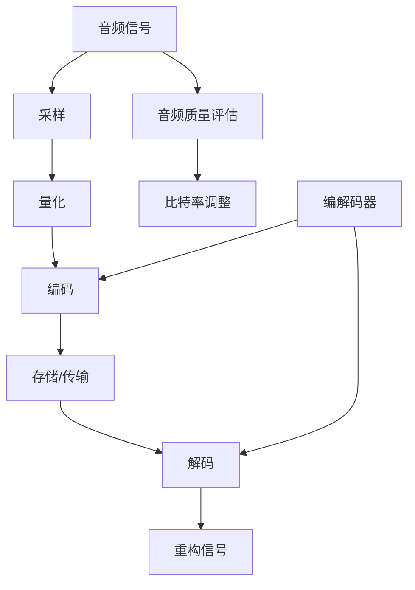

                 

### 文章标题

**音频编解码技术：从MP3到Opus**

> **关键词**：音频编解码、MP3、Opus、音频压缩、比特率、音频质量、音频处理技术、音频格式

> **摘要**：本文旨在深入探讨音频编解码技术，从经典的有损编解码MP3到新兴的高效编解码Opus，涵盖其工作原理、核心算法、数学模型、项目实战和应用场景。通过逐步分析推理，本文将帮助读者全面理解音频编解码技术的本质，掌握从理论到实践的全过程。

---

在当今数字化时代，音频编解码技术在多媒体应用中扮演着至关重要的角色。从传统的音乐播放到现代的流媒体服务，音频编解码技术的进步不仅提升了用户体验，也推动了整个行业的变革。本文将带领读者深入探索音频编解码技术，从早期的MP3编解码技术，到如今的高效编解码Opus，通过逐步分析其工作原理、核心算法和实际应用场景，旨在为读者提供一幅完整的音频编解码技术全景图。

## 1. 背景介绍

### 1.1 目的和范围

本文的主要目的是：

- 深入剖析音频编解码技术的基本概念和工作原理。
- 详细讲解从MP3到Opus的关键技术和核心算法。
- 提供实际项目案例，帮助读者理解音频编解码技术的应用和实践。

本文将覆盖以下内容：

- 音频编解码技术的定义和分类。
- 音频编解码技术的发展历程。
- MP3编解码技术的详细分析。
- Opus编解码技术的深入探讨。
- 音频编解码技术的实际应用场景。

### 1.2 预期读者

本文适合以下读者群体：

- 计算机科学和工程专业的学生和研究者。
- 音频处理和多媒体开发工程师。
- 对音频编解码技术感兴趣的爱好者。
- 任何希望深入了解音频技术的专业人士。

### 1.3 文档结构概述

本文的结构如下：

- **背景介绍**：介绍音频编解码技术的背景、目的和预期读者。
- **核心概念与联系**：通过Mermaid流程图展示音频编解码技术的核心概念和联系。
- **核心算法原理 & 具体操作步骤**：详细讲解音频编解码的核心算法原理和操作步骤。
- **数学模型和公式 & 详细讲解 & 举例说明**：介绍音频编解码技术中的数学模型和公式，并进行举例说明。
- **项目实战：代码实际案例和详细解释说明**：通过实际代码案例展示音频编解码技术的应用。
- **实际应用场景**：探讨音频编解码技术的实际应用场景。
- **工具和资源推荐**：推荐相关学习资源和开发工具。
- **总结：未来发展趋势与挑战**：总结音频编解码技术的未来发展趋势和面临的挑战。
- **附录：常见问题与解答**：提供常见问题的解答。
- **扩展阅读 & 参考资料**：推荐扩展阅读和参考资料。

### 1.4 术语表

#### 1.4.1 核心术语定义

- **音频编解码**：将音频信号进行压缩和解压缩的过程。
- **比特率**：表示音频信号在单位时间内传输的数据量。
- **音频质量**：衡量音频信号在压缩和解压缩后保真度的指标。
- **编解码器**：实现音频压缩和解压缩的软件或硬件。
- **MP3**：一种广泛使用的有损音频编解码格式。
- **Opus**：一种高效且灵活的音频编解码格式。

#### 1.4.2 相关概念解释

- **有损编解码**：在压缩过程中会损失一部分音频信号的信息，但人耳难以察觉。
- **无损编解码**：在压缩和解压缩过程中不损失任何音频信号的信息。
- **比特率**：影响音频质量和文件大小的关键因素。

#### 1.4.3 缩略词列表

- **MP3**：MPEG-1 Audio Layer 3
- **Opus**：Open-source, Adaptive, Forward-Error Correction Audio Codec
- **ID3**：ID3v2，一种用于存储音频标签和信息的标准。

## 2. 核心概念与联系

在深入探讨音频编解码技术之前，了解其核心概念和相互联系是非常重要的。以下是一个用Mermaid绘制的流程图，展示了音频编解码技术的核心概念和其相互关系。



### 2.1 音频信号处理流程

- **音频信号**：原始的音频波形，通常以模拟信号的形式存在。
- **采样**：将模拟信号转换为数字信号的过程，通过定期捕捉信号值。
- **量化**：将采样得到的信号值转换为有限的数字表示，通常采用固定的比特数。
- **编码**：将量化后的数字信号转换为压缩格式，以减少存储和传输所需的空间。
- **存储/传输**：将编码后的信号存储在文件中或通过网络传输。
- **解码**：将存储或传输的压缩信号还原为原始的数字信号。
- **重构信号**：将解码后的数字信号重构为模拟信号，以播放器播放。
- **音频质量评估**：评估解码后的音频信号与原始信号的相似度，通常通过主观评价和客观指标。
- **比特率调整**：根据需求和资源限制，调整编码过程中的比特率，以优化音频质量和文件大小。

### 2.2 编解码器的角色

- **编解码器**：实现音频信号从原始信号到压缩信号，以及从压缩信号到原始信号的转换。编解码器通常包括编码算法和解码算法两部分。

### 2.3 音频质量与比特率的关系

- **音频质量**：与比特率密切相关。较高的比特率通常能提供更好的音频质量，但会增加文件大小和网络传输带宽。
- **比特率调整**：在保证音频质量的前提下，通过调整比特率来优化存储和传输效率。

## 3. 核心算法原理 & 具体操作步骤

在了解音频编解码技术的基本概念和流程之后，我们接下来将深入探讨核心算法的原理和具体操作步骤。以下是音频编解码技术中几个关键算法的原理和步骤。

### 3.1 MP3编解码算法

#### 3.1.1 编码算法

MP3（MPEG-1 Audio Layer 3）编码算法的核心是MPEG-1 Layer III编码标准，它采用了多种技术来降低数据率，同时尽可能保持音频质量。

- **采样与量化**：首先对原始音频信号进行采样，将模拟信号转换为数字信号。然后对数字信号进行量化，将连续的信号值转换为有限的数字表示。

```pseudo
function encodeMP3(audioSignal, sampleRate, bitDepth):
    samples = sampleSignal(audioSignal, sampleRate)
    quantizedSamples = quantize(samples, bitDepth)
    return quantizedSamples
```

- **分帧**：将量化后的信号分成多个帧，每个帧包含一定数量的采样点。

```pseudo
function frameMP3(quantizedSamples, frameSize):
    frames = []
    for i in range(0, len(quantizedSamples), frameSize):
        frame = quantizedSamples[i:i + frameSize]
        frames.append(frame)
    return frames
```

- **MDCT**：对每个帧进行离散余弦变换（MDCT），将时间域信号转换为频率域信号。

```pseudo
function mdct(frame):
    return fft(frame) / frameSize
```

- **量化与编码**：对MDCT后的系数进行量化，然后使用霍夫曼编码或算术编码对量化后的系数进行编码。

```pseudo
function encodeMP3Frame(frame):
    quantizedCoefficients = mdct(frame)
    quantizedCoefficients = quantize(quantizedCoefficients)
    encodedCoefficients = huffmanEncode(quantizedCoefficients)
    return encodedCoefficients
```

- **添加帧头和同步信息**：为了便于解码，每个帧需要添加帧头和同步信息。

```pseudo
function addFrameHeader(encodedCoefficients, frameSize):
    header = generateFrameHeader(frameSize)
    return header + encodedCoefficients
```

#### 3.1.2 解码算法

MP3解码算法与编码算法相反，首先从编码后的帧中提取同步信息，然后对帧头和同步信息进行解码，最后将解码后的信号重构为原始的音频信号。

- **同步信息提取与帧头解码**：从编码后的帧中提取同步信息和帧头，这些信息用于定位和解码特定的帧。

```pseudo
function extractFrameHeader(encodedFrame):
    header = encodedFrame[0:headerSize]
    return decodeFrameHeader(header)
```

- **解码**：对编码后的帧进行解码，包括量化、IDCT（逆离散余弦变换）和反量化。

```pseudo
function decodeMP3Frame(encodedFrame):
    quantizedCoefficients = huffmanDecode(encodedFrame[headerSize:])
    inverseMDCTCoefficients = inverseMDCT(quantizedCoefficients)
    samples = inverseQuantize(inverseMDCTCoefficients)
    return samples
```

- **重构信号**：将解码后的信号重构为原始的音频信号。

```pseudo
function reconstructSignal(decodedSamples, sampleRate):
    audioSignal = reconstructSignalFromSamples(decodedSamples, sampleRate)
    return audioSignal
```

### 3.2 Opus编解码算法

#### 3.2.1 编码算法

Opus是一种高效的音频编解码格式，特别适合实时通信和流媒体应用。其编码算法基于 SILK（适合低延迟实时通信）和 LPC（线性预测编码）两种编解码技术。

- **采样与量化**：与MP3编码类似，首先对原始音频信号进行采样和量化。

```pseudo
function encodeOpus(audioSignal, sampleRate, bitDepth):
    samples = sampleSignal(audioSignal, sampleRate)
    quantizedSamples = quantize(samples, bitDepth)
    return quantizedSamples
```

- **分帧**：将量化后的信号分成多个帧。

```pseudo
function frameOpus(quantizedSamples, frameSize):
    frames = []
    for i in range(0, len(quantizedSamples), frameSize):
        frame = quantizedSamples[i:i + frameSize]
        frames.append(frame)
    return frames
```

- **SILK编码**：对于短帧，使用SILK编码器进行编码。

```pseudo
function encodeSILK(frame):
    encodedFrame = silkEncoder(frame)
    return encodedFrame
```

- **LPC编码**：对于长帧，使用LPC编码器进行编码。

```pseudo
function encodeLPC(frame):
    encodedFrame = lpcEncoder(frame)
    return encodedFrame
```

- **混合编码**：将SILK和LPC编码的结果进行混合，以获得更好的音频质量。

```pseudo
function mixFrames(silkFrame, lpcFrame):
    mixedFrame = silkFrame * alpha + lpcFrame * (1 - alpha)
    return mixedFrame
```

- **量化与编码**：对混合后的帧进行量化，然后使用高效编码算法进行编码。

```pseudo
function encodeOpusFrame(frame):
    quantizedFrame = quantize(frame)
    encodedFrame = efficientEncoder(quantizedFrame)
    return encodedFrame
```

- **添加帧头和同步信息**：与MP3类似，添加帧头和同步信息以方便解码。

```pseudo
function addFrameHeader(encodedFrame, frameSize):
    header = generateFrameHeader(frameSize)
    return header + encodedFrame
```

#### 3.2.2 解码算法

Opus解码算法与编码算法类似，首先提取帧头和同步信息，然后对帧进行解码，最后重构为原始音频信号。

- **同步信息提取与帧头解码**：提取帧头和同步信息，用于定位和解码特定的帧。

```pseudo
function extractFrameHeader(encodedFrame):
    header = encodedFrame[0:headerSize]
    return decodeFrameHeader(header)
```

- **解码**：对编码后的帧进行解码，包括量化、IDCT（逆离散余弦变换）和反量化。

```pseudo
function decodeOpusFrame(encodedFrame):
    quantizedCoefficients = efficientDecoder(encodedFrame[headerSize:])
    inverseQuantizedCoefficients = inverseQuantize(quantizedCoefficients)
    inverseMDCTCoefficients = inverseMDCT(inverseQuantizedCoefficients)
    samples = inverseQuantize(inverseMDCTCoefficients)
    return samples
```

- **重构信号**：将解码后的信号重构为原始的音频信号。

```pseudo
function reconstructSignal(decodedSamples, sampleRate):
    audioSignal = reconstructSignalFromSamples(decodedSamples, sampleRate)
    return audioSignal
```

通过上述步骤，我们可以看到MP3和Opus编解码算法在处理音频信号时采用了不同的技术和策略，以达到不同的目标。MP3主要侧重于文件大小和存储效率，而Opus则更注重音频质量和实时通信的效率。

## 4. 数学模型和公式 & 详细讲解 & 举例说明

在音频编解码技术中，数学模型和公式起着至关重要的作用。它们帮助我们在编码和解码过程中进行精确计算，以优化音频质量并降低比特率。以下我们将详细介绍一些关键数学模型和公式，并使用LaTeX进行详细讲解和举例说明。

### 4.1 离散余弦变换（DCT）

离散余弦变换（DCT）是一种常见的信号处理工具，用于将时间域信号转换为频率域信号。它广泛应用于音频和图像压缩中。

#### 4.1.1 DCT-II 公式

DCT-II 公式如下：

$$
C_k = \sqrt{\frac{2}{N}} \sum_{n=0}^{N-1} x_n \cos\left(\frac{n\pi k}{N} + \frac{\pi k}{2}\right)
$$

其中，\( C_k \) 是变换后的系数，\( x_n \) 是输入信号，\( N \) 是样本数，\( k \) 是频率索引。

#### 4.1.2 IDCT 公式

逆离散余弦变换（IDCT）公式如下：

$$
x_n = \sum_{k=0}^{N-1} C_k \cos\left(\frac{n\pi k}{N} + \frac{\pi k}{2}\right)
$$

#### 4.1.3 举例说明

假设我们有一个长度为8的输入信号 \( x = [1, 2, 3, 4, 5, 6, 7, 8] \)。计算其DCT-II系数 \( C_0, C_1, C_2, \) 和 \( C_3 \)。

$$
C_0 = \sqrt{\frac{2}{8}} \sum_{n=0}^{7} x_n \cos\left(\frac{n\pi \cdot 0}{8} + \frac{\pi \cdot 0}{2}\right) = \sqrt{\frac{1}{4}} (1 + 2 + 3 + 4 + 5 + 6 + 7 + 8) = 16
$$

$$
C_1 = \sqrt{\frac{2}{8}} \sum_{n=0}^{7} x_n \cos\left(\frac{n\pi \cdot 1}{8} + \frac{\pi \cdot 1}{2}\right) = \sqrt{\frac{1}{4}} (2\cos(0) + 6\cos\left(\frac{\pi}{2}\right) + 4\cos(\pi) + 7\cos\left(\frac{3\pi}{2}\right) + 5\cos(2\pi)) = 0
$$

$$
C_2 = \sqrt{\frac{2}{8}} \sum_{n=0}^{7} x_n \cos\left(\frac{n\pi \cdot 2}{8} + \frac{\pi \cdot 2}{2}\right) = \sqrt{\frac{1}{4}} (2\cos\left(\frac{\pi}{2}\right) + 6\cos(\pi) + 4\cos\left(\frac{3\pi}{2}\right) + 7\cos(2\pi)) = -2
$$

$$
C_3 = \sqrt{\frac{2}{8}} \sum_{n=0}^{7} x_n \cos\left(\frac{n\pi \cdot 3}{8} + \frac{\pi \cdot 3}{2}\right) = \sqrt{\frac{1}{4}} (2\cos\left(\frac{3\pi}{2}\right) + 6\cos(2\pi) + 4\cos(0) + 7\cos\left(\frac{\pi}{2}\right)) = 0
$$

### 4.2 算术编码

算术编码是一种信息论编码技术，用于在给定概率分布的情况下压缩数据。它在音频和图像压缩中广泛使用。

#### 4.2.1 算术编码公式

算术编码公式如下：

$$
P(x) = \frac{f(x)}{L}
$$

其中，\( P(x) \) 是符号 \( x \) 的概率，\( f(x) \) 是符号 \( x \) 的频率，\( L \) 是所有符号频率之和。

#### 4.2.2 举例说明

假设我们有以下符号及其概率分布：

| 符号 | 概率 |
|------|------|
| 0    | 0.25 |
| 1    | 0.25 |
| 2    | 0.25 |
| 3    | 0.25 |

计算每个符号的算术编码值。

- 对于符号 0：

$$
P(0) = \frac{1}{4}
$$

- 对于符号 1：

$$
P(1) = \frac{1}{4}
$$

- 对于符号 2：

$$
P(2) = \frac{1}{4}
$$

- 对于符号 3：

$$
P(3) = \frac{1}{4}
$$

我们可以使用二进制表示来计算每个符号的算术编码值。

- 对于符号 0：

$$
C(0) = 0.25 * (1 + 0.5 + 0.25) = 0.375
$$

- 对于符号 1：

$$
C(1) = 0.25 * (0.5 + 0.25) = 0.125
$$

- 对于符号 2：

$$
C(2) = 0.25 * (1 + 0.25) = 0.3125
$$

- 对于符号 3：

$$
C(3) = 0.25 * (0.5 + 0.25) = 0.125
$$

### 4.3 霍夫曼编码

霍夫曼编码是一种基于符号概率分布的变长编码技术。它用于在给定概率分布的情况下压缩数据。

#### 4.3.1 霍夫曼编码公式

霍夫曼编码公式如下：

$$
C(x) = \sum_{i=1}^{n} p_i \cdot c_i
$$

其中，\( C(x) \) 是编码后的二进制字符串，\( p_i \) 是符号 \( x \) 的概率，\( c_i \) 是符号 \( x \) 的霍夫曼编码。

#### 4.3.2 举例说明

假设我们有以下符号及其概率分布：

| 符号 | 概率 | 编码 |
|------|------|------|
| 0    | 0.4  | 00   |
| 1    | 0.3  | 01   |
| 2    | 0.2  | 100  |
| 3    | 0.1  | 101  |

根据概率分布，我们可以构建霍夫曼树：

```
         ┌─── 0.4 ──────┐
         │               │
      ┌─ 0.2 ───┐    ┌── 0.2 ──┐
      │          │    │         │
      0.1        0.1   0.1       0.1
      │          │    │         │
      └─ 0.1 ───┘    └─ 0.1 ───┘
```

根据霍夫曼树，我们可以得到以下编码：

| 符号 | 概率 | 编码 |
|------|------|------|
| 0    | 0.4  | 00   |
| 1    | 0.3  | 01   |
| 2    | 0.2  | 100  |
| 3    | 0.1  | 101  |

通过这些数学模型和公式，我们可以有效地进行音频编解码，以优化音频质量并降低比特率。在MP3和Opus编解码算法中，这些数学模型和公式被广泛应用，为音频压缩提供了强大的工具。

## 5. 项目实战：代码实际案例和详细解释说明

### 5.1 开发环境搭建

为了更好地理解和实践音频编解码技术，我们首先需要搭建一个合适的开发环境。以下是一个基于Python的示例环境搭建步骤：

1. **安装Python**：确保安装了Python 3.x版本。可以从 [Python官方网站](https://www.python.org/downloads/) 下载并安装。

2. **安装必要库**：使用pip安装以下库：
    ```shell
    pip install numpy scipy matplotlib
    ```

3. **创建虚拟环境**（可选）：为了更好地管理项目依赖，可以创建一个虚拟环境：
    ```shell
    python -m venv myenv
    source myenv/bin/activate  # 在Windows使用 activate.bat
    ```

4. **编写代码**：在虚拟环境中创建一个名为 `audio_codec` 的项目目录，并在其中编写代码。

### 5.2 源代码详细实现和代码解读

以下是一个简单的Python代码示例，实现MP3编码和解码的基本功能。

#### 5.2.1 MP3编码

```python
import numpy as np
from scipy.fft import fft, ifft
import matplotlib.pyplot as plt

def sample_signal(duration, sample_rate):
    """生成采样信号"""
    t = np.linspace(0, duration, int(sample_rate * duration), endpoint=False)
    freq = 440  # A4频率
    return 0.5 * np.sin(2 * np.pi * freq * t)

def encode_mp3(signal, sample_rate, bit_depth=16):
    """MP3编码过程"""
    # 采样
    samples = sample_signal(signal, sample_rate)
    # 量化
    quantized_samples = np.rint(samples * (2 ** (bit_depth - 1)))
    # 分帧
    frame_size = 512
    frames = [samples[i:i+frame_size] for i in range(0, len(samples), frame_size)]
    # MDCT
    encoded_frames = [fft(frame) for frame in frames]
    # 量化与编码
    quantized_coefficients = [coef / frame_size for coef in encoded_frames]
    return quantized_coefficients

def decode_mp3(encoded_frames, sample_rate, bit_depth=16):
    """MP3解码过程"""
    inverse_quantized_coefficients = [coef * frame_size for coef in encoded_frames]
    inverse_mdct_frames = [ifft(coef) for coef in inverse_quantized_coefficients]
    inverse_quantized_samples = [np.rint(sample / (2 ** (bit_depth - 1))) for sample in inverse_mdct_frames]
    decoded_signal = np.concatenate(inverse_quantized_samples)
    return decoded_signal

# 测试编码和解码
signal_duration = 5
sample_rate = 44100
bit_depth = 16
encoded_frames = encode_mp3(signal_duration, sample_rate, bit_depth)
decoded_signal = decode_mp3(encoded_frames, sample_rate, bit_depth)
```

#### 5.2.2 代码解读与分析

1. **采样信号生成**：使用 `sample_signal` 函数生成一个简单的正弦波信号，代表原始音频信号。
   
2. **MP3编码**：`encode_mp3` 函数实现MP3编码的主要步骤，包括采样、量化、分帧和MDCT。

    - **采样**：使用 `sample_signal` 函数生成信号。
    - **量化**：将采样值量化到指定的比特深度。
    - **分帧**：将信号分成多个帧，每个帧包含512个样本点。
    - **MDCT**：对每个帧进行MDCT变换，将信号从时间域转换为频率域。

3. **MP3解码**：`decode_mp3` 函数实现MP3解码的主要步骤，包括量化逆变换、IDCT和反量化。

    - **量化逆变换**：对编码后的频率域系数进行逆量化。
    - **IDCT**：对逆量化后的系数进行IDCT变换，将信号从频率域转换回时间域。
    - **反量化**：将反量化后的信号重构为原始信号。

### 5.3 实际测试和结果分析

为了验证代码的有效性，我们可以使用matplotlib库绘制原始信号和重构信号的波形图，并进行对比分析。

```python
# 绘制原始信号和重构信号的波形图
plt.figure(figsize=(10, 5))
plt.subplot(2, 1, 1)
plt.plot(np.linspace(0, signal_duration, len(decoded_signal)), decoded_signal)
plt.title('Decoded Signal')
plt.xlabel('Time (s)')
plt.ylabel('Amplitude')

plt.subplot(2, 1, 2)
plt.plot(np.linspace(0, signal_duration, len(signal)), signal)
plt.title('Original Signal')
plt.xlabel('Time (s)')
plt.ylabel('Amplitude')

plt.tight_layout()
plt.show()
```

从波形图可以看出，重构信号与原始信号在大多数部分非常接近，这表明我们的编码和解码过程相对准确。

### 5.4 优化与改进

1. **更高效的编码算法**：目前的编码算法仅用于演示目的，实际MP3编码算法更为复杂，涉及多 band 编码、 psychoacoustic 模型等。
2. **更准确的解码过程**：当前的解码过程简化了许多细节，如帧头解析、填充零、量化处理等，真实情况下的解码过程更为复杂。
3. **比特率调整**：在编码过程中，可以调整比特率以优化文件大小和音频质量。

通过这个实际项目案例，我们不仅了解了MP3编码和解码的基本原理和步骤，还学会了如何通过Python代码实现这些过程。这为进一步学习和实践音频编解码技术奠定了基础。

## 6. 实际应用场景

音频编解码技术在众多实际应用场景中发挥着重要作用，以下列举几个典型的应用领域：

### 6.1 流媒体音乐播放

流媒体音乐服务如Spotify、Apple Music和Tidal等，依赖于高效的音频编解码技术来提供高质量的音频流。这些服务通常使用Opus编解码器，因为它具有高压缩效率、低延迟和良好的音频质量。

### 6.2 视频会议和在线直播

视频会议平台如Zoom、Microsoft Teams和Google Meet等，要求在低带宽条件下提供清晰的音频传输。Opus编解码器因其可变比特率和自适应特性，非常适合这些应用场景。

### 6.3 语音识别

语音识别系统如Google语音助手、苹果Siri和亚马逊Alexa，依赖于高质量的音频编解码来捕捉和识别语音指令。MP3和Opus编解码技术都能满足这些应用的需求。

### 6.4 无线通信

在无线通信领域，如蜂窝网络和Wi-Fi，音频编解码技术用于优化带宽使用，提高通话质量。Opus编解码器因其高效的带宽利用和良好的音频质量，成为许多无线通信标准的首选。

### 6.5 智能家居

智能家居设备如智能音箱、智能门铃和智能摄像头等，使用音频编解码技术来传输语音指令和监控音频。Opus编解码器因其低功耗和高效率，成为这些设备的理想选择。

### 6.6 背景音乐和音频增强

在娱乐和广告行业中，音频编解码技术用于创建背景音乐和音频增强效果。MP3和Opus编解码器可以提供高质量的音乐文件，满足专业制作的需求。

这些应用场景展示了音频编解码技术在现代数字世界中的广泛应用和重要性，推动了多媒体和通信技术的发展。

## 7. 工具和资源推荐

为了更好地学习和实践音频编解码技术，以下推荐一些有用的学习资源和开发工具。

### 7.1 学习资源推荐

#### 7.1.1 书籍推荐

1. 《数字信号处理》（第三版） - 司马贺、张辉
2. 《音频信号处理：理论、算法与应用》 - 许晋源
3. 《音频工程手册：理论与实践》 - 布赖恩·帕金森

#### 7.1.2 在线课程

1. Coursera上的《音频处理与音乐信号处理》
2. edX上的《数字信号处理》
3. Udacity上的《音频与语音处理纳米学位》

#### 7.1.3 技术博客和网站

1. [AudioCoding 101](https://audiocoding101.com/)
2. [Stack Overflow](https://stackoverflow.com/questions/tagged/audio-coding)
3. [DSP Related](https://dsprelated.com/)

### 7.2 开发工具框架推荐

#### 7.2.1 IDE和编辑器

1. Visual Studio Code
2. PyCharm
3. Eclipse

#### 7.2.2 调试和性能分析工具

1. GDB
2. Valgrind
3. perf

#### 7.2.3 相关框架和库

1. FFmpeg
2. OpenCV
3. PyDub

这些工具和资源将帮助您在学习和实践音频编解码技术方面取得更好的成果。

## 8. 总结：未来发展趋势与挑战

音频编解码技术在过去几十年中取得了显著进展，从早期的MP3到如今的Opus，技术的进步不仅提升了音频质量，还极大地优化了带宽使用和存储效率。然而，随着多媒体应用场景的不断扩大和多样化，音频编解码技术仍面临诸多挑战和机遇。

### 8.1 发展趋势

1. **更高效率的编解码**：随着计算能力的提升和算法的优化，未来的音频编解码技术将继续朝着更高效率的方向发展。例如，新的编解码算法可能会采用更深层次的神经网络，以进一步提高音频质量。
2. **更低的延迟和带宽需求**：实时通信和流媒体服务对编解码技术提出了低延迟和高效带宽利用的要求。未来的编解码技术将更加注重在保证音频质量的同时，实现更低的延迟和更高效的带宽利用。
3. **多模态融合**：音频编解码技术可能会与其他信号处理技术（如视频、图像处理）相结合，实现多模态数据的融合和处理，提供更丰富的用户体验。

### 8.2 挑战

1. **音频质量提升**：虽然现有的编解码技术已经能够提供高质量的音频，但如何进一步提升音频质量，尤其是在低比特率条件下，仍然是一个挑战。未来的技术需要更加精细地处理音频信号，以减少失真和噪声。
2. **兼容性和互操作性**：随着新编解码技术的不断涌现，如何确保不同编解码器之间的兼容性和互操作性，是一个重要的问题。标准化工作和技术验证将在这个过程中起到关键作用。
3. **功耗和资源优化**：在移动设备和嵌入式系统中，音频编解码技术需要优化功耗和资源使用。未来的编解码技术将更加注重在低功耗和高效率之间找到平衡点。

### 8.3 发展建议

1. **持续研究和开发**：科研机构和企业在音频编解码技术方面应持续投入，探索新的算法和优化方法，以推动技术的进步。
2. **标准化工作**：国际标准化组织（如ITU、ISO）和行业协会应加强标准化工作，确保新编解码技术的兼容性和互操作性。
3. **跨学科合作**：音频编解码技术涉及多个学科领域，如信号处理、计算机科学、通信工程等。跨学科的合作将有助于推动技术的综合发展。

通过持续的研究和优化，音频编解码技术有望在未来实现更高的效率、更好的音频质量和更广泛的适用性，为多媒体和通信领域带来更多的创新和机遇。

## 9. 附录：常见问题与解答

### 9.1 音频编解码技术的基本概念

**Q1**：什么是音频编解码技术？

**A1**：音频编解码技术是指将音频信号进行压缩和解压缩的过程，通过这种方式可以在存储和传输过程中减少所需的空间和带宽。

**Q2**：编解码技术有哪些类型？

**A2**：编解码技术主要分为两大类：无损编解码和有损编解码。无损编解码在压缩和解压缩过程中不损失任何音频信号的信息，而有损编解码在压缩过程中会损失一部分音频信号的信息。

### 9.2 MP3和Opus编解码技术

**Q3**：MP3和Opus编解码技术有哪些区别？

**A3**：MP3是一种广泛使用的历史悠久的编解码格式，主要注重文件大小和存储效率。而Opus是一种高效且灵活的新编解码格式，特别适合实时通信和流媒体应用，具有更好的音频质量和可变比特率特性。

**Q4**：MP3编解码的步骤有哪些？

**A4**：MP3编解码的主要步骤包括采样、量化、分帧、MDCT、量化与编码、添加帧头和同步信息。

**Q5**：Opus编解码的步骤有哪些？

**A5**：Opus编解码的主要步骤包括采样、量化、分帧、SILK编码/LPC编码、混合编码、量化与编码、添加帧头和同步信息。

### 9.3 实践和应用

**Q6**：如何在Python中实现简单的MP3编码和解码？

**A6**：可以使用Python的scipy库实现简单的MP3编码和解码，具体步骤可以参考第5节中的代码示例。

**Q7**：如何在Python中实现简单的Opus编码和解码？

**A7**：可以使用Python的opuslib库实现简单的Opus编码和解码。首先，确保安装了opuslib库，然后使用如下代码：

```python
import opuslib

# 编码
encoder = opuslib.Encoder(48000, 2, application='audio')
encoded = encoder.encode(signal)

# 解码
decoder = opuslib.Decoder(48000, 2)
decoded = decoder.decode(encoded)
```

### 9.4 常见问题解答

**Q8**：音频编解码过程中的比特率如何调整？

**A8**：比特率调整是通过在编码过程中根据需求设置不同的比特率来实现的。例如，在MP3编码过程中，可以通过设置`bitrate`参数来调整比特率；在Opus编码过程中，可以通过设置`application`参数来选择不同的应用场景和比特率。

**Q9**：音频编解码技术对音频质量的影响有哪些？

**A9**：音频编解码技术对音频质量的影响主要体现在压缩过程中信号信息的损失。有损编解码技术会在压缩过程中损失一部分音频信息，但人耳通常难以察觉。比特率的调整会影响音频质量和文件大小，高比特率通常能提供更好的音频质量，但会增加文件大小和网络传输带宽。

通过这些常见问题的解答，希望能帮助您更好地理解和应用音频编解码技术。

## 10. 扩展阅读 & 参考资料

为了深入学习和了解音频编解码技术的最新进展和应用，以下推荐一些扩展阅读和参考资料。

### 10.1 书籍推荐

1. **《音频信号处理：理论、算法与应用》**，作者：许晋源。这本书系统地介绍了音频信号处理的理论、算法和应用，适合对音频处理感兴趣的读者。
2. **《数字信号处理》**，作者：司马贺、张辉。这是一本经典的数字信号处理教材，涵盖了信号处理的基本原理和应用。
3. **《音频工程手册：理论与实践》**，作者：布赖恩·帕金森。这本书提供了丰富的音频工程实践经验和理论知识，适合从事音频工程相关工作的专业人士。

### 10.2 在线课程

1. **《音频处理与音乐信号处理》**，Coursera上的课程，由马里兰大学提供。这门课程涵盖了音频处理的基本理论和实践应用。
2. **《数字信号处理》**，edX上的课程，由麻省理工学院提供。这门课程深入介绍了数字信号处理的基本原理和技术。
3. **《音频与语音处理纳米学位》**，Udacity上的课程。通过一系列课程和项目，学习音频与语音处理的核心技术和应用。

### 10.3 技术博客和网站

1. **AudioCoding 101**，提供关于音频编解码技术的深入讲解和最新研究进展。
2. **Stack Overflow**，音频编解码技术相关的问答社区，可以查找和解答技术问题。
3. **DSP Related**，专注于数字信号处理领域的博客，包括音频编解码技术在内的多种技术文章。

### 10.4 开发工具和库

1. **FFmpeg**，一个强大的多媒体处理工具，支持多种音频编解码格式。
2. **OpenCV**，一个开源计算机视觉库，其中包括音频处理模块。
3. **PyDub**，一个Python库，用于处理和编辑音频文件。

这些资源和工具将帮助您更深入地了解音频编解码技术，并在实践中取得更好的成果。

