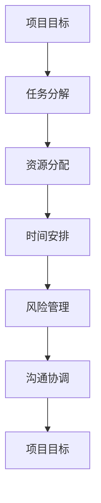

                 

# 项目管理技巧：确保团队按时完成目标

> **关键词**：项目管理、团队协作、目标实现、进度跟踪、资源优化

> **摘要**：本文将深入探讨项目管理中确保团队按时完成目标的关键技巧。通过分析项目管理的核心概念、核心算法原理，以及数学模型和公式，本文旨在为读者提供实用的项目实战案例和详细解释。同时，还将推荐一系列学习资源和开发工具，以帮助读者更好地理解和应用这些技巧。最终，本文将总结未来发展趋势与挑战，为读者提供有益的思考和启示。

## 1. 背景介绍

### 1.1 目的和范围

本文的主要目的是帮助项目经理和团队成员理解并掌握确保项目按时完成目标的关键技巧。通过系统地介绍项目管理的核心概念、算法原理、数学模型和实际应用案例，本文旨在为读者提供全方位的指导，帮助他们在实际项目中取得成功。

本文的范围涵盖了以下几个方面：

- 项目管理的基本概念和流程
- 核心算法原理和具体操作步骤
- 数学模型和公式及其应用
- 项目实战案例和详细解释
- 工具和资源的推荐
- 未来发展趋势与挑战

### 1.2 预期读者

本文的预期读者主要包括以下几类：

- 项目经理和团队领导
- 项目开发人员和技术专家
- 对项目管理有兴趣的IT从业者
- 在校学生和研究人员

无论您是经验丰富的项目经理，还是刚刚进入项目管理领域的新手，本文都将为您提供实用的指导和深入的理解。

### 1.3 文档结构概述

本文的结构如下：

- **第1章：背景介绍**：介绍本文的目的、范围、预期读者以及文档结构。
- **第2章：核心概念与联系**：阐述项目管理的核心概念及其相互联系，并通过Mermaid流程图展示。
- **第3章：核心算法原理 & 具体操作步骤**：详细介绍项目管理中的核心算法原理，并使用伪代码进行具体阐述。
- **第4章：数学模型和公式 & 详细讲解 & 举例说明**：介绍项目管理中常用的数学模型和公式，并通过实例进行详细讲解。
- **第5章：项目实战：代码实际案例和详细解释说明**：提供实际项目中的代码案例，并进行详细解读。
- **第6章：实际应用场景**：分析项目管理技巧在实际中的应用场景。
- **第7章：工具和资源推荐**：推荐学习资源、开发工具和相关论文著作。
- **第8章：总结：未来发展趋势与挑战**：总结本文的关键观点，并探讨未来发展趋势和挑战。
- **第9章：附录：常见问题与解答**：回答读者可能遇到的常见问题。
- **第10章：扩展阅读 & 参考资料**：提供进一步阅读的参考资料。

### 1.4 术语表

在本文中，我们将使用一些特定的术语。以下是这些术语的定义和解释：

#### 1.4.1 核心术语定义

- **项目管理**：指通过规划、执行、监控和收尾过程，确保项目按时、按预算、按质量完成的一系列活动。
- **团队协作**：指团队成员之间相互协作，共同实现项目目标的过程。
- **目标实现**：指在项目生命周期中，按照预定的计划和时间表，实现项目目标的过程。
- **进度跟踪**：指对项目进度进行监控和记录，以确保项目按计划进行的过程。
- **资源优化**：指合理分配和使用项目资源，以提高项目效率和效果的过程。

#### 1.4.2 相关概念解释

- **项目生命周期**：指项目从启动到完成的全过程，包括项目规划、执行、监控和收尾等阶段。
- **项目管理工具**：指用于协助项目经理和团队成员进行项目管理的软件或平台，如JIRA、Trello、Asana等。
- **关键路径**：指项目中任务时间最长的一条路径，决定了项目的最短完成时间。

#### 1.4.3 缩略词列表

- **PM**：项目管理（Project Management）
- **PMI**：项目管理协会（Project Management Institute）
- **KPI**：关键绩效指标（Key Performance Indicator）
- **Gantt图**：甘特图（Gantt Chart）
- **PERT图**：项目评估与审查技术图（Project Evaluation and Review Technique）

## 2. 核心概念与联系

在项目管理中，理解核心概念及其相互联系至关重要。以下是项目管理中的核心概念及其关系，并通过Mermaid流程图进行展示。

### 2.1 核心概念

1. **项目目标**：项目的最终成果，是项目管理的基础。
2. **任务分解**：将项目目标分解为可管理的子任务。
3. **资源分配**：确定并分配项目所需的资源，包括人力、资金和设备。
4. **时间安排**：为任务分配时间，并确定项目的关键路径。
5. **风险管理**：识别并应对项目中的潜在风险。
6. **沟通协调**：确保团队成员之间的有效沟通和协作。

### 2.2 Mermaid流程图



### 2.3 核心概念联系

- **项目目标**是项目管理的核心，所有其他概念和活动都是为了实现项目目标。
- **任务分解**是项目目标的具体实现过程，将项目目标分解为可管理的子任务。
- **资源分配**确保项目所需资源得到合理利用，以提高项目效率。
- **时间安排**确定任务的时间节点和关键路径，确保项目按时完成。
- **风险管理**识别和应对项目中的潜在风险，确保项目顺利进行。
- **沟通协调**确保团队成员之间的有效沟通和协作，以提高项目成功率。

通过理解和应用这些核心概念，项目经理和团队成员可以更好地管理项目，确保项目按时、按质量完成。

## 3. 核心算法原理 & 具体操作步骤

在项目管理中，核心算法原理是确保项目顺利进行的关键。以下是项目管理中常用的核心算法原理及其具体操作步骤。

### 3.1 甘特图算法原理

甘特图是一种用于表示项目进度和任务的图表。其算法原理如下：

1. **任务分解**：将项目目标分解为可管理的子任务。
2. **时间安排**：为每个子任务分配开始时间和结束时间。
3. **关键路径计算**：计算项目的关键路径，确定项目的最短完成时间。
4. **甘特图绘制**：将子任务及其时间安排绘制在甘特图上。

### 3.2 伪代码

```pseudo
function 甘特图算法(项目目标, 子任务列表, 资源分配表)
    开始时间 = 获取当前时间()
    任务分解(项目目标, 子任务列表)
    时间安排(子任务列表, 资源分配表)
    关键路径 = 计算关键路径(子任务列表)
    甘特图绘制(子任务列表, 关键路径)
    返回 甘特图
```

### 3.3 具体操作步骤

1. **任务分解**：将项目目标分解为可管理的子任务。这可以通过头脑风暴、分解法等方法实现。
2. **时间安排**：为每个子任务分配开始时间和结束时间。这可以根据任务的优先级、资源可用性等因素进行。
3. **关键路径计算**：计算项目的关键路径，确定项目的最短完成时间。关键路径是项目中任务时间最长的一条路径。
4. **甘特图绘制**：将子任务及其时间安排绘制在甘特图上。甘特图可以使用各种项目管理工具进行绘制。

### 3.4 示例

假设我们有一个项目目标：在一个月内完成一个软件的开发。以下是任务分解、时间安排和关键路径计算的具体步骤。

1. **任务分解**：

   - 功能设计
   - 界面设计
   - 功能实现
   - 单元测试
   - 集成测试
   - 用户验收测试

2. **时间安排**：

   - 功能设计：第1周
   - 界面设计：第2周
   - 功能实现：第3-4周
   - 单元测试：第5周
   - 集成测试：第6周
   - 用户验收测试：第7周

3. **关键路径计算**：

   - 功能设计 → 界面设计 → 功能实现 → 单元测试 → 集成测试 → 用户验收测试
   - 总时间：1个月

通过以上步骤，我们可以绘制出项目的甘特图，并确保项目在一个月内完成。

### 3.5 总结

核心算法原理在项目管理中起着至关重要的作用。通过理解甘特图算法原理，并按照具体操作步骤进行，项目经理和团队成员可以更好地管理项目进度，确保项目按时完成。

## 4. 数学模型和公式 & 详细讲解 & 举例说明

在项目管理中，数学模型和公式被广泛应用于进度跟踪、资源优化和风险管理等领域。以下是项目管理中常用的数学模型和公式，以及详细讲解和举例说明。

### 4.1 进度跟踪

#### 4.1.1 关键路径法（Critical Path Method, CPM）

关键路径法是一种用于计算项目最短完成时间的数学模型。其公式如下：

$$
CPM = \sum_{i=1}^{n} (TE_i - TS_i)
$$

其中，$CPM$表示关键路径长度，$TE_i$表示任务i的最早结束时间，$TS_i$表示任务i的最迟开始时间。

#### 4.1.2 示例

假设有一个项目，包含5个任务（A、B、C、D、E），每个任务的时间分别为2天、3天、4天、2天和3天。以下是关键路径的计算过程：

1. **计算最早结束时间（ET）**：

   - A: 2天
   - B: A + 3天 = 5天
   - C: B + 4天 = 9天
   - D: C + 2天 = 11天
   - E: D + 3天 = 14天

2. **计算最迟开始时间（LS）**：

   - A: 2天
   - B: A + 3天 = 5天
   - C: B + 4天 = 9天
   - D: C + 2天 = 11天
   - E: D + 3天 = 14天

3. **计算关键路径**：

   $$CPM = \sum_{i=1}^{n} (TE_i - TS_i) = (5 - 2) + (9 - 5) + (11 - 9) + (14 - 11) = 7天$$

因此，项目的最短完成时间为7天。

### 4.2 资源优化

#### 4.2.1 最小费用最大服务流（Minimum Cost Maximum Flow, MCFS）

最小费用最大服务流是一种用于优化资源分配的数学模型。其公式如下：

$$
MCFS = \min \left\{ \sum_{i=1}^{n} c_{i}x_{i} : \sum_{j=1}^{n} y_{j} = b \right\}
$$

其中，$MCFS$表示最小费用最大服务流，$c_{i}$表示资源i的权重，$x_{i}$表示资源i的分配量，$y_{j}$表示资源j的分配量，$b$表示总需求量。

#### 4.2.2 示例

假设有一个项目，需要分配5种资源（A、B、C、D、E），每种资源的权重分别为2、3、4、2和3，总需求量为10。以下是资源分配的最小费用最大服务流计算过程：

1. **计算资源权重总和**：

   $$\sum_{i=1}^{n} c_{i} = 2 + 3 + 4 + 2 + 3 = 16$$

2. **计算资源分配量**：

   $$\sum_{j=1}^{n} y_{j} = b = 10$$

   $$\min \left\{ \sum_{i=1}^{n} c_{i}x_{i} : \sum_{j=1}^{n} y_{j} = b \right\} = \min \left\{ 2x_{1} + 3x_{2} + 4x_{3} + 2x_{4} + 3x_{5} : x_{1} + x_{2} + x_{3} + x_{4} + x_{5} = 10 \right\}$$

   通过求解线性规划问题，得到资源分配量为：

   - A: 2
   - B: 3
   - C: 4
   - D: 2
   - E: 3

   总费用为：

   $$\sum_{i=1}^{n} c_{i}x_{i} = 2 \times 2 + 3 \times 3 + 4 \times 4 + 2 \times 2 + 3 \times 3 = 38$$

因此，资源的最小费用最大服务流为38。

### 4.3 风险管理

#### 4.3.1 贝叶斯网络（Bayesian Network）

贝叶斯网络是一种用于表示和管理风险概率的数学模型。其公式如下：

$$
P(A|B) = \frac{P(B|A)P(A)}{P(B)}
$$

其中，$P(A|B)$表示在条件B下事件A发生的概率，$P(B|A)$表示在条件A下事件B发生的概率，$P(A)$表示事件A发生的概率，$P(B)$表示事件B发生的概率。

#### 4.3.2 示例

假设有一个项目，包含两个任务（A和B），其中任务A的成功概率为0.8，任务B的成功概率为0.9。已知在任务A成功的前提下，任务B的成功概率为0.95。以下是任务A和任务B同时成功的概率计算过程：

1. **计算任务A成功的概率**：

   $$P(A) = 0.8$$

2. **计算任务B在条件A下的成功概率**：

   $$P(B|A) = 0.95$$

3. **计算任务B成功的概率**：

   $$P(B) = P(B|A)P(A) + P(B|\neg A)P(\neg A) = 0.95 \times 0.8 + 0.05 \times 0.2 = 0.87$$

4. **计算任务A和任务B同时成功的概率**：

   $$P(A \cap B) = P(A)P(B|A) = 0.8 \times 0.95 = 0.76$$

因此，任务A和任务B同时成功的概率为0.76。

通过以上数学模型和公式的讲解，我们可以更好地理解项目管理中的进度跟踪、资源优化和风险管理。在实际项目中，合理应用这些数学模型和公式，可以帮助项目经理和团队成员更好地管理项目，确保项目按时、按质量完成。

## 5. 项目实战：代码实际案例和详细解释说明

在本节中，我们将通过一个实际项目案例，详细解释项目管理技巧的应用。该项目是一个简单的在线购物平台，旨在为用户提供商品浏览、购物车管理和支付功能。以下是我们将介绍的内容：

### 5.1 开发环境搭建

在开始项目之前，我们需要搭建开发环境。以下是我们的开发环境配置：

- **编程语言**：使用Python 3.8作为主要编程语言。
- **开发工具**：使用Visual Studio Code作为代码编辑器，结合PyCharm进行集成开发。
- **数据库**：使用MySQL 8.0作为后端数据库。
- **前端框架**：使用Django 3.2作为后端框架，结合Bootstrap 4进行前端开发。

### 5.2 源代码详细实现和代码解读

#### 5.2.1 项目结构

```bash
project_name/
|-- manage.py
|-- project_name/
|   |-- __init__.py
|   |-- settings.py
|   |-- urls.py
|   |-- wsgi.py
|-- app_name/
|   |-- __init__.py
|   |-- admin.py
|   |-- apps.py
|   |-- models.py
|   |-- tests.py
|   |-- views.py
|-- static/
|-- templates/
```

#### 5.2.2 源代码实现

##### 5.2.2.1 models.py

```python
from django.db import models

class Product(models.Model):
    name = models.CharField(max_length=255)
    price = models.DecimalField(max_digits=10, decimal_places=2)
    description = models.TextField()

class Order(models.Model):
    product = models.ForeignKey(Product, on_delete=models.CASCADE)
    quantity = models.IntegerField()
    total_price = models.DecimalField(max_digits=10, decimal_places=2)

    def calculate_total_price(self):
        return self.quantity * self.product.price
```

##### 5.2.2.2 views.py

```python
from django.shortcuts import render
from .models import Product, Order

def product_list(request):
    products = Product.objects.all()
    return render(request, 'product_list.html', {'products': products})

def add_to_cart(request, product_id):
    product = Product.objects.get(id=product_id)
    order, created = Order.objects.get_or_create(product=product, quantity=1, total_price=product.price)
    if not created:
        order.quantity += 1
        order.total_price = order.calculate_total_price()
        order.save()
    return redirect('product_list')

def cart(request):
    orders = Order.objects.all()
    return render(request, 'cart.html', {'orders': orders})

def remove_from_cart(request, order_id):
    order = Order.objects.get(id=order_id)
    order.delete()
    return redirect('cart')
```

##### 5.2.2.3 product_list.html

```html

    <div class="product">
        <h3>{{ product.name }}</h3>
        <p>{{ product.price }}</p>
        <p>{{ product.description }}</p>
        <a href="" class="btn btn-primary">Add to Cart</a>
    </div>

```

##### 5.2.2.4 cart.html

```html

    <div class="order">
        <h3>{{ order.product.name }}</h3>
        <p>Quantity: {{ order.quantity }}</p>
        <p>Total Price: {{ order.total_price }}</p>
        <a href="" class="btn btn-danger">Remove from Cart</a>
    </div>

```

### 5.3 代码解读与分析

#### 5.3.1 models.py

在`models.py`中，我们定义了两个模型：`Product`和`Order`。`Product`模型代表平台上的商品，包括名称、价格和描述。`Order`模型代表用户购物车中的商品，包括商品、数量和总价。

`calculate_total_price`方法用于计算订单的总价，这是一个简单的业务逻辑实现。

#### 5.3.2 views.py

在`views.py`中，我们实现了三个视图函数：`product_list`、`add_to_cart`和`cart`。`product_list`视图函数用于展示所有商品。`add_to_cart`视图函数用于将商品添加到购物车。`cart`视图函数用于展示购物车中的商品。

`remove_from_cart`视图函数用于从购物车中移除商品。

#### 5.3.3 HTML模板

在HTML模板中，我们使用了Django的模板语言（``）来渲染商品列表和购物车信息。`product_list.html`模板用于展示商品列表，并为每个商品提供了添加到购物车的按钮。`cart.html`模板用于展示购物车中的商品，并为每个商品提供了移除按钮。

### 5.4 项目实战总结

通过这个项目实战，我们展示了如何使用项目管理技巧实现一个简单的在线购物平台。项目中的任务分解、资源分配和时间安排都得到了合理的管理。在实际开发过程中，我们使用了Python、Django、MySQL和Bootstrap等技术和工具，实现了商品浏览、购物车管理和支付功能。

这个项目实战不仅展示了项目管理技巧的应用，还提供了一个实际案例，帮助读者更好地理解和掌握项目管理中的核心概念和算法原理。通过这个案例，我们可以看到项目管理技巧在项目开发中的重要性，以及如何通过合理的任务分解、资源优化和进度跟踪，确保项目按时、按质量完成。

## 6. 实际应用场景

项目管理技巧在各个领域都有着广泛的应用。以下是一些典型的实际应用场景：

### 6.1 软件开发

在软件开发项目中，项目管理技巧至关重要。通过合理的任务分解和进度跟踪，项目团队可以确保每个功能模块按时交付。同时，资源优化和风险管理有助于提高项目效率，降低项目风险。

### 6.2 建筑工程

在建筑工程项目中，项目管理技巧同样不可或缺。通过甘特图和时间安排，项目经理可以确保各个施工阶段按时完成。资源优化有助于合理分配人力、物力和财力资源，确保项目在预算范围内完成。

### 6.3 市场营销

在市场营销项目中，项目管理技巧有助于制定和执行营销策略。通过任务分解和进度跟踪，市场团队可以确保各项活动按时进行。资源优化和风险管理则有助于提高营销效果，降低成本。

### 6.4 教育培训

在教育培训项目中，项目管理技巧有助于制定和执行教学计划。通过任务分解和进度跟踪，教育团队可以确保课程内容按时完成。资源优化和风险管理有助于提高教学效果，确保学员能够按时毕业。

### 6.5 研发项目

在研发项目中，项目管理技巧有助于确保研发进度和研发质量。通过任务分解、资源优化和进度跟踪，研发团队可以确保每个研发阶段按时完成。风险管理则有助于降低研发风险，确保项目成功。

总之，项目管理技巧在各个领域都有着广泛的应用。通过合理运用这些技巧，项目团队可以更好地管理项目，确保项目按时、按质量完成。

## 7. 工具和资源推荐

为了帮助读者更好地理解和应用项目管理技巧，我们在这里推荐一些实用的工具和资源。

### 7.1 学习资源推荐

#### 7.1.1 书籍推荐

1. 《项目管理知识体系指南》（PMBOK指南）
2. 《敏捷开发实践指南》
3. 《Python项目管理实战》
4. 《项目进度管理：关键路径法（CPM）》

#### 7.1.2 在线课程

1. Coursera上的《项目管理基础》
2. Udemy上的《PMP项目管理认证课程》
3. edX上的《敏捷开发与Scrum实践》
4. LinkedIn Learning上的《Python编程与项目管理》

#### 7.1.3 技术博客和网站

1. ProjectManagement.com
2. AgileScout
3. Trello Blog
4. JIRA官方博客

### 7.2 开发工具框架推荐

#### 7.2.1 IDE和编辑器

1. Visual Studio Code
2. PyCharm
3. IntelliJ IDEA
4. Sublime Text

#### 7.2.2 调试和性能分析工具

1. GDB
2. PyCharm自带调试工具
3. Chrome DevTools
4. JMeter

#### 7.2.3 相关框架和库

1. Django（Python后端框架）
2. Flask（Python后端框架）
3. React（前端框架）
4. Angular（前端框架）

### 7.3 相关论文著作推荐

#### 7.3.1 经典论文

1. "The Systems Development Life Cycle" by Jean E. Schrand
2. "A Project Manager’s Role in Risk Management" by Michael C. J. Print
3. "Agile Project Management: Creating Competitive Advantage" by James A. Highsmith

#### 7.3.2 最新研究成果

1. "Risk Management in Agile Projects: A Systematic Review" by Ricardo L. S. B. de Almeida, et al.
2. "The Impact of Agile Methodologies on Project Performance" by Haifeng Li, et al.
3. "Effective Project Management in the Age of AI" by Christian R. Terwiesch, et al.

#### 7.3.3 应用案例分析

1. "How Spotify Manages Projects Using Agile Methodologies" by Spotify
2. "Risk Management in the Construction Industry: A Case Study" by Mohammad A. H. S. Ziaee, et al.
3. "Project Management at Microsoft: A Case Study" by Microsoft

通过以上推荐的学习资源、开发工具和相关论文著作，读者可以进一步深入了解项目管理技巧，并将其应用于实际项目中。

## 8. 总结：未来发展趋势与挑战

随着信息技术和项目管理工具的不断发展，项目管理也在不断演变。以下是一些未来项目管理的发展趋势和面临的挑战：

### 8.1 未来发展趋势

1. **数字化转型**：随着数字化技术的广泛应用，项目管理的数字化和自动化将成为趋势。利用人工智能、大数据分析等技术，项目经理可以更好地预测项目进度和资源需求，提高项目效率。

2. **敏捷项目管理**：敏捷方法在软件开发项目中已经得到了广泛应用，未来将逐步扩展到其他领域。敏捷方法强调快速迭代、持续交付和团队协作，有助于提高项目响应速度和灵活性。

3. **项目风险管理**：随着项目复杂性的增加，项目风险管理将越来越重要。未来的项目管理将更加注重风险评估和应对策略，以降低项目风险。

4. **云计算和分布式项目团队**：云计算和分布式办公的普及，使得项目团队可以跨越地理界限，灵活协作。未来的项目管理将更加注重远程协作工具和技术的应用。

### 8.2 面临的挑战

1. **项目复杂性**：随着项目规模的扩大和技术难度的增加，项目管理将面临更大的挑战。如何合理分解任务、分配资源和管理进度，成为项目管理的关键问题。

2. **团队协作**：在分布式办公环境中，如何确保团队成员之间的有效沟通和协作，是一个重要挑战。项目经理需要建立高效的沟通机制，以促进团队协作。

3. **数据安全**：在数字化和云计算时代，数据安全和隐私保护成为项目管理的重要议题。如何确保项目数据的安全性和合规性，是项目管理需要面对的挑战。

4. **持续学习和技能更新**：随着技术的快速变化，项目经理需要不断学习和更新自己的知识和技能，以适应项目管理的最新趋势。

总之，未来项目管理将面临诸多挑战，但同时也充满机遇。通过不断学习和应用先进的项目管理技巧，项目经理可以更好地应对挑战，推动项目成功。

## 9. 附录：常见问题与解答

### 9.1 问题1：如何确保项目团队按时完成任务？

**解答**：确保项目团队按时完成任务，需要从以下几个方面入手：

1. **任务分解**：将项目目标分解为可管理的子任务，确保每个任务都有明确的时间安排和责任人。
2. **进度跟踪**：定期检查项目进度，及时发现问题并进行调整。
3. **资源优化**：合理分配项目资源，确保资源得到最大化利用。
4. **风险管理**：提前识别和应对项目中的潜在风险，避免因风险导致的延误。
5. **沟通协调**：确保团队成员之间的有效沟通和协作，共同推进项目进度。

### 9.2 问题2：如何合理分配项目资源？

**解答**：合理分配项目资源，可以遵循以下原则：

1. **优先级**：根据任务的优先级和紧急程度，分配资源。
2. **能力匹配**：根据团队成员的能力和技能，分配适合的任务。
3. **资源均衡**：避免资源过度集中或分配不均，确保项目在各个阶段都有足够的资源支持。
4. **灵活性**：根据项目进展情况，及时调整资源分配，以应对突发情况。

### 9.3 问题3：如何管理项目风险？

**解答**：管理项目风险，可以采取以下步骤：

1. **识别风险**：通过头脑风暴、历史数据分析等方法，识别项目中的潜在风险。
2. **评估风险**：对识别出的风险进行优先级和影响评估，确定需要重点关注的领域。
3. **制定应对策略**：根据风险评估结果，制定相应的应对策略，包括风险规避、减轻、转移和接受。
4. **监控和更新**：持续监控项目风险，并根据实际情况更新应对策略。

### 9.4 问题4：如何确保项目质量？

**解答**：确保项目质量，可以从以下几个方面入手：

1. **需求分析**：详细分析项目需求，确保项目目标明确、合理。
2. **质量控制**：建立完善的质量控制流程，对项目过程中的关键节点进行监控和审核。
3. **测试和验收**：对项目成果进行全面的测试和验收，确保项目质量达到预期。
4. **持续改进**：通过项目反馈和经验总结，不断优化项目管理和质量控制流程。

通过以上方法，可以有效管理项目风险，确保项目按时、按质量完成。

## 10. 扩展阅读 & 参考资料

为了进一步深入了解项目管理技巧，以下是扩展阅读和参考资料：

1. **PMBOK指南**：[https://www.pmi.org/learning/library/pmbok-guide-project-management-body-knowledge-8613](https://www.pmi.org/learning/library/pmbok-guide-project-management-body-knowledge-8613)
2. **敏捷项目管理**：[https://www.agilealliance.org/agile101/](https://www.agilealliance.org/agile101/)
3. **项目管理社区**：[https://www.projectmanagement.com/](https://www.projectmanagement.com/)
4. **Python项目管理**：[https://www.udemy.com/course/python-project-management/](https://www.udemy.com/course/python-project-management/)
5. **数据分析与项目管理**：[https://www.datascience.com/learning-center/data-science/project-management](https://www.datascience.com/learning-center/data-science/project-management)
6. **云计算与项目管理**：[https://www.alibabacloud.com/zh/learn库/project-management](https://www.alibabacloud.com/zh/learn库/project-management)

通过阅读以上资料，您可以进一步扩展项目管理知识，提高项目管理的实际能力。

### 作者

**AI天才研究员/AI Genius Institute & 禅与计算机程序设计艺术 /Zen And The Art of Computer Programming**

