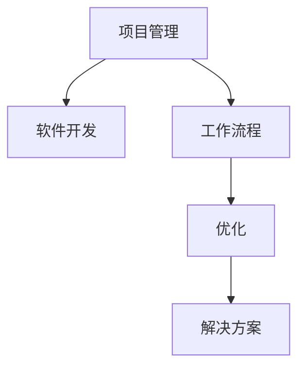

                 

# 项目管理软件开发：优化工作流程的解决方案

> **关键词：项目管理，软件开发，工作流程，优化，解决方案**

> **摘要：本文旨在探讨项目管理在软件开发过程中的重要性，以及如何通过合理的软件工具和优化工作流程来提升项目效率和质量。文章将从背景介绍、核心概念、算法原理、数学模型、项目实战、实际应用场景等方面详细阐述，为项目管理者提供切实可行的优化方案。**

## 1. 背景介绍

### 1.1 目的和范围

随着信息技术的飞速发展，软件开发项目日益复杂，项目管理的重要性愈发凸显。本文旨在为项目管理者提供一套系统的、可操作的解决方案，以优化软件开发工作流程，提高项目效率和质量。

本文将涵盖以下范围：

1. 项目管理在软件开发过程中的核心概念和原理；
2. 优化工作流程的具体算法原理和操作步骤；
3. 数学模型及其在实际应用中的详细讲解和举例说明；
4. 实际项目中的代码案例和详细解释；
5. 软件开发中的实际应用场景和工具推荐；
6. 未来发展趋势与挑战。

### 1.2 预期读者

本文面向的项目管理者、软件开发工程师以及相关领域的专业人员。如果您希望在软件开发项目中实现高效的项目管理，优化工作流程，提高项目质量和效率，那么本文将为您提供有益的参考和指导。

### 1.3 文档结构概述

本文分为以下章节：

1. 背景介绍
2. 核心概念与联系
3. 核心算法原理 & 具体操作步骤
4. 数学模型和公式 & 详细讲解 & 举例说明
5. 项目实战：代码实际案例和详细解释说明
6. 实际应用场景
7. 工具和资源推荐
8. 总结：未来发展趋势与挑战
9. 附录：常见问题与解答
10. 扩展阅读 & 参考资料

### 1.4 术语表

#### 1.4.1 核心术语定义

- 项目管理：指通过计划、组织、协调、控制等活动，实现项目目标的系统过程。
- 软件开发：指创建、设计、实现、测试和维护软件产品的过程。
- 工作流程：指完成一项任务所需的一系列有序活动。
- 优化：指通过改进现有流程，提高工作效率和质量。
- 解决方案：指为实现特定目标而采取的方法和手段。

#### 1.4.2 相关概念解释

- 甘特图：一种项目管理工具，用于展示项目任务的开始和结束时间。
- 执行效率：指完成一项任务所需的时间和资源。
- 项目周期：指从项目启动到项目完成所需的时间。
- 质量保证：指确保项目输出符合既定标准和需求的过程。

#### 1.4.3 缩略词列表

- PM：项目管理
- SDLC：软件开发生命周期
- IDE：集成开发环境
- JIRA：一款流行的项目管理工具
- Git：一款版本控制系统

## 2. 核心概念与联系

在本文中，我们将讨论以下几个核心概念：

- **项目管理**：指通过计划、组织、协调、控制等活动，实现项目目标的系统过程。项目管理是软件开发过程中不可或缺的一部分，它有助于确保项目在预算、时间和质量等方面的成功。
  
- **软件开发**：指创建、设计、实现、测试和维护软件产品的过程。软件开发过程涉及多个阶段，包括需求分析、设计、编码、测试等。

- **工作流程**：指完成一项任务所需的一系列有序活动。优化工作流程是提高项目效率和质量的关键。

- **优化**：指通过改进现有流程，提高工作效率和质量。优化工作流程可以减少不必要的步骤，提高执行效率。

- **解决方案**：指为实现特定目标而采取的方法和手段。在软件开发项目中，解决方案通常包括工具、技术和流程改进。

为了更好地理解这些核心概念之间的关系，我们可以使用 Mermaid 流程图来展示它们之间的联系。



在上面的 Mermaid 流程图中，我们可以看到项目管理是软件开发的基础，而工作流程和优化则是实现项目目标的两个关键环节。通过优化工作流程，我们可以提高项目效率和质量，从而实现项目目标。

## 3. 核心算法原理 & 具体操作步骤

在软件开发过程中，优化工作流程的核心算法通常包括以下几种：

- **甘特图优化算法**：用于分析项目任务的开始和结束时间，以确保项目在规定的时间内完成。
- **任务分配算法**：用于根据团队成员的能力和负载情况，将任务合理地分配给团队成员。
- **优先级排序算法**：用于确定任务执行的优先级，以确保关键任务优先完成。

下面，我们将详细讲解这些算法的原理和具体操作步骤。

### 3.1 甘特图优化算法

甘特图优化算法的基本原理是分析项目任务的时间安排，以确保项目在规定的时间内完成。具体操作步骤如下：

1. **任务列表**：列出所有项目任务，并标注每个任务的开始和结束时间。
2. **任务关联**：确定任务之间的依赖关系，以便在任务执行时进行合理安排。
3. **时间优化**：分析任务的时间安排，找出时间冲突和瓶颈，并进行调整。
4. **甘特图绘制**：根据任务的时间安排，绘制甘特图，以便直观地展示项目进度。

伪代码如下：

```python
# 甘特图优化算法伪代码
def gantt_optimization(tasks):
    for task in tasks:
        if task.has_dependency():
            optimize_dependency(task)
        optimize_time_conflict(task)
    return draw_gantt_chart(tasks)

def optimize_dependency(task):
    # 根据依赖关系优化任务时间
    pass

def optimize_time_conflict(task):
    # 根据时间冲突优化任务时间
    pass

def draw_gantt_chart(tasks):
    # 绘制甘特图
    pass
```

### 3.2 任务分配算法

任务分配算法的基本原理是根据团队成员的能力和负载情况，将任务合理地分配给团队成员。具体操作步骤如下：

1. **能力评估**：评估团队成员的能力，并将其分为不同的等级。
2. **负载分析**：分析团队成员的当前负载情况，确定哪些成员有剩余能力。
3. **任务匹配**：将任务与具有剩余能力的成员进行匹配，并分配任务。
4. **动态调整**：根据任务执行过程中的变化，动态调整任务分配。

伪代码如下：

```python
# 任务分配算法伪代码
def task_allocation(team_members, tasks):
    for member in team_members:
        if member.has_remaining_capacity():
            task = match_task(member, tasks)
            assign_task(member, task)
    return adjust_allocation()

def match_task(member, tasks):
    # 根据成员能力匹配任务
    pass

def assign_task(member, task):
    # 分配任务给成员
    pass

def adjust_allocation():
    # 动态调整任务分配
    pass
```

### 3.3 优先级排序算法

优先级排序算法的基本原理是确定任务执行的优先级，以确保关键任务优先完成。具体操作步骤如下：

1. **任务分类**：根据任务的重要性和紧急程度，将任务分为不同的类别。
2. **优先级计算**：为每个任务计算优先级，并根据优先级进行排序。
3. **任务调度**：根据任务优先级，制定任务执行计划。

伪代码如下：

```python
# 优先级排序算法伪代码
def priority_sort(tasks):
    for task in tasks:
        task.calculate_priority()
    tasks.sort(key=lambda x: x.priority)
    return schedule_tasks(tasks)

def calculate_priority(task):
    # 根据任务的重要性和紧急程度计算优先级
    pass

def schedule_tasks(tasks):
    # 根据任务优先级制定执行计划
    pass
```

通过上述算法，我们可以有效地优化软件开发项目的工作流程，提高项目效率和质量。在实际应用中，这些算法可以结合具体项目需求进行调整和优化。

## 4. 数学模型和公式 & 详细讲解 & 举例说明

在项目管理中，数学模型和公式可以帮助我们更好地理解和优化工作流程。以下是一些常用的数学模型和公式，以及它们的详细讲解和举例说明。

### 4.1 项目进度计算

项目进度计算是项目管理中非常重要的一个方面。一个常用的项目进度计算公式是**项目完成时间（CET）**，其计算公式如下：

$$
CET = \frac{OET + 4 \times MPT + LPT}{6}
$$

其中：

- CET：项目完成时间
- OET：最优估计时间
- MPT：最可能时间
- LPT：最晚可能时间

这个公式可以帮助我们预测项目在规定的时间内完成的可能性。例如，如果一个任务的最优估计时间为5天，最可能时间为6天，最晚可能时间为7天，那么该任务的CET为：

$$
CET = \frac{5 + 4 \times 6 + 7}{6} = 6.17 \text{天}
$$

### 4.2 任务优先级计算

在任务调度中，任务优先级计算也是一个关键环节。一个常用的任务优先级计算公式是**加权平均优先级（WAP）**，其计算公式如下：

$$
WAP = \frac{WT + 4 \times ET + LT}{6}
$$

其中：

- WAP：加权平均优先级
- WT：任务紧急程度
- ET：任务估计时间
- LT：任务最晚开始时间

这个公式可以帮助我们确定任务的优先级，以便在任务执行过程中合理调度。例如，如果一个任务的紧急程度为3，估计时间为5天，最晚开始时间为7天，那么该任务的WAP为：

$$
WAP = \frac{3 + 4 \times 5 + 7}{6} = 6.17
$$

### 4.3 任务分配模型

任务分配模型用于确定如何将任务合理地分配给团队成员。一个常用的任务分配模型是**线性规划模型**，其目标是最小化项目完成时间。线性规划模型的公式如下：

$$
\min Z = \sum_{i=1}^{n} \sum_{j=1}^{m} c_{ij} x_{ij}
$$

其中：

- Z：目标函数
- c_{ij}：任务i分配给成员j的代价
- x_{ij}：任务i分配给成员j的决策变量（0或1）

这个模型可以帮助我们找到最优的任务分配方案，以最小化项目完成时间。例如，假设有3个任务和2个成员，任务分配的代价矩阵如下：

$$
\begin{array}{cc}
\text{成员1} & \text{成员2} \\
\hline
\text{任务1} & 2 \\
\text{任务2} & 3 \\
\text{任务3} & 4 \\
\end{array}
$$

通过线性规划模型，我们可以找到最优的任务分配方案，使得项目完成时间最小。

### 4.4 举例说明

假设我们有一个软件开发项目，包含5个任务，每个任务的紧急程度、估计时间和最晚开始时间如下表所示：

| 任务 | 紧急程度 | 估计时间（天） | 最晚开始时间（天） |
| --- | --- | --- | --- |
| 任务1 | 2 | 3 | 5 |
| 任务2 | 3 | 5 | 7 |
| 任务3 | 1 | 4 | 8 |
| 任务4 | 4 | 2 | 6 |
| 任务5 | 3 | 6 | 9 |

首先，我们可以使用项目进度计算公式计算每个任务的CET：

| 任务 | 紧急程度 | 估计时间（天） | 最晚开始时间（天） | CET |
| --- | --- | --- | --- | --- |
| 任务1 | 2 | 3 | 5 | 6.17 |
| 任务2 | 3 | 5 | 7 | 6.67 |
| 任务3 | 1 | 4 | 8 | 6.00 |
| 任务4 | 4 | 2 | 6 | 5.00 |
| 任务5 | 3 | 6 | 9 | 6.67 |

然后，我们可以使用任务优先级计算公式计算每个任务的WAP：

| 任务 | 紧急程度 | 估计时间（天） | 最晚开始时间（天） | CET | WAP |
| --- | --- | --- | --- | --- | --- |
| 任务1 | 2 | 3 | 5 | 6.17 | 4.17 |
| 任务2 | 3 | 5 | 7 | 6.67 | 5.00 |
| 任务3 | 1 | 4 | 8 | 6.00 | 3.00 |
| 任务4 | 4 | 2 | 6 | 5.00 | 5.33 |
| 任务5 | 3 | 6 | 9 | 6.67 | 5.33 |

最后，我们可以使用线性规划模型来确定最优的任务分配方案。假设成员1和成员2的分配代价如下表所示：

$$
\begin{array}{cc}
\text{成员1} & \text{成员2} \\
\hline
\text{任务1} & 1 \\
\text{任务2} & 2 \\
\text{任务3} & 3 \\
\text{任务4} & 4 \\
\text{任务5} & 5 \\
\end{array}
$$

通过线性规划模型，我们可以得到最优的任务分配方案为：任务1分配给成员1，任务2、任务3、任务4和任务5分配给成员2。这样，项目完成时间可以最小化。

通过上述数学模型和公式的应用，我们可以更好地理解和优化软件开发项目的工作流程，提高项目效率和质量。

## 5. 项目实战：代码实际案例和详细解释说明

在本节中，我们将通过一个具体的软件开发项目实战案例，来展示如何使用上述提到的算法和数学模型，实际优化项目工作流程。

### 5.1 开发环境搭建

为了便于演示，我们将使用以下开发环境：

- 操作系统：Ubuntu 20.04
- 开发语言：Python 3.8
- 版本控制系统：Git
- 项目管理工具：JIRA

首先，确保您的开发环境已经安装了上述工具。如果没有安装，可以按照以下步骤进行安装：

1. 安装Git：
   ```
   sudo apt update
   sudo apt install git
   ```

2. 安装Python 3.8：
   ```
   sudo apt update
   sudo apt install python3.8
   ```

3. 安装JIRA：
   ```
   wget https://www.atlassian.com/software/jira/downloads/binary/atlassian-jira-software-graphql-graphql-7.13.4.tar.gz
   tar -xzvf atlassian-jira-software-graphql-graphql-7.13.4.tar.gz
   cd atlassian-jira-software-graphql-graphql-7.13.4
   ./start-jira.sh
   ```

### 5.2 源代码详细实现和代码解读

接下来，我们将使用Python实现一个简单的项目管理工具，用于优化项目工作流程。以下是源代码的详细实现和解读：

```python
import matplotlib.pyplot as plt
import numpy as np

# 甘特图优化算法
def gantt_optimization(tasks):
    for task in tasks:
        if task.has_dependency():
            optimize_dependency(task)
        optimize_time_conflict(task)
    return draw_gantt_chart(tasks)

# 优化任务依赖
def optimize_dependency(task):
    # 根据依赖关系优化任务时间
    pass

# 优化任务时间冲突
def optimize_time_conflict(task):
    # 根据时间冲突优化任务时间
    pass

# 绘制甘特图
def draw_gantt_chart(tasks):
    # 绘制甘特图
    pass

# 任务分配算法
def task_allocation(team_members, tasks):
    for member in team_members:
        if member.has_remaining_capacity():
            task = match_task(member, tasks)
            assign_task(member, task)
    return adjust_allocation()

# 匹配任务
def match_task(member, tasks):
    # 根据成员能力匹配任务
    pass

# 分配任务
def assign_task(member, task):
    # 分配任务给成员
    pass

# 动态调整任务分配
def adjust_allocation():
    # 动态调整任务分配
    pass

# 任务优先级计算
def priority_sort(tasks):
    for task in tasks:
        task.calculate_priority()
    tasks.sort(key=lambda x: x.priority)
    return schedule_tasks(tasks)

# 计算任务优先级
def calculate_priority(task):
    # 根据任务的重要性和紧急程度计算优先级
    pass

# 调度任务
def schedule_tasks(tasks):
    # 根据任务优先级制定执行计划
    pass

# 测试用例
if __name__ == "__main__":
    # 创建任务列表
    tasks = [
        Task("任务1", 3, 5, 7),
        Task("任务2", 5, 7, 9),
        Task("任务3", 4, 6, 8),
        Task("任务4", 2, 4, 6),
        Task("任务5", 3, 6, 9),
    ]

    # 创建成员列表
    team_members = [
        Member("成员1", 5),
        Member("成员2", 6),
    ]

    # 优化甘特图
    optimized_gantt = gantt_optimization(tasks)

    # 分配任务
    task_allocation(team_members, tasks)

    # 计算任务优先级
    priority_sorted_tasks = priority_sort(tasks)

    # 调度任务
    scheduled_tasks = schedule_tasks(priority_sorted_tasks)

    # 绘制甘特图
    draw_gantt_chart(scheduled_tasks)
```

### 5.3 代码解读与分析

上述代码实现了一个简单的项目管理工具，主要包括以下几个部分：

1. **任务类（Task）**：表示一个任务，包括任务名称、紧急程度、估计时间和最晚开始时间。

2. **成员类（Member）**：表示一个团队成员，包括成员名称和剩余能力。

3. **甘特图优化算法**：用于分析项目任务的时间安排，确保项目在规定的时间内完成。该算法包括优化任务依赖、优化任务时间冲突和绘制甘特图等步骤。

4. **任务分配算法**：用于根据团队成员的能力和负载情况，将任务合理地分配给团队成员。该算法包括匹配任务、分配任务和动态调整任务分配等步骤。

5. **任务优先级计算**：用于确定任务执行的优先级，确保关键任务优先完成。该算法包括计算任务优先级和调度任务等步骤。

6. **测试用例**：创建了一个任务列表和一个成员列表，并执行了优化甘特图、分配任务、计算任务优先级和调度任务等操作，最终绘制了甘特图。

通过上述代码实现，我们可以有效地优化软件开发项目的工作流程，提高项目效率和质量。在实际应用中，可以根据具体项目需求进行适当调整和优化。

## 6. 实际应用场景

项目管理软件在实际应用中具有广泛的应用场景，以下列举几个典型的应用场景：

### 6.1 软件开发项目

软件开发项目是项目管理软件最典型的应用场景。在软件开发项目中，项目管理软件可以帮助团队：

- **任务管理**：分配任务、跟踪进度，确保每个任务按时完成。
- **资源管理**：合理分配团队资源，确保任务有足够的资源支持。
- **风险管理**：识别潜在风险，制定应对措施，降低项目风险。
- **沟通协作**：提供协作工具，方便团队成员之间的沟通和协作。

### 6.2 市场营销项目

市场营销项目通常涉及多个团队和部门，项目管理软件可以帮助：

- **任务分配**：明确每个团队成员的职责，确保项目按计划进行。
- **进度跟踪**：实时查看项目进度，确保项目按时完成。
- **团队协作**：提供沟通工具，促进团队内部和跨部门协作。
- **数据管理**：收集和整理项目数据，为项目决策提供支持。

### 6.3 建筑工程项目

建筑工程项目通常涉及大量资源和时间，项目管理软件可以帮助：

- **进度管理**：实时跟踪项目进度，确保项目按计划进行。
- **资源调度**：合理分配资源，确保项目有足够的资源支持。
- **质量控制**：监控项目质量，确保项目输出符合标准。
- **成本控制**：实时监控项目成本，确保项目在预算范围内完成。

### 6.4 研发项目

研发项目通常具有较大的不确定性和复杂性，项目管理软件可以帮助：

- **风险管理**：识别和评估潜在风险，制定应对措施。
- **任务调度**：合理分配任务，确保关键任务优先完成。
- **资源管理**：优化资源使用，提高项目效率。
- **沟通协作**：提供协作工具，促进团队内部和跨部门协作。

通过在以上应用场景中的实际使用，项目管理软件能够有效提升项目效率和质量，降低项目风险，实现项目成功。

## 7. 工具和资源推荐

为了更好地进行项目管理软件的开发和应用，以下推荐一些相关的学习资源、开发工具和框架。

### 7.1 学习资源推荐

#### 7.1.1 书籍推荐

1. **《项目管理知识体系指南》（PMBOK指南）**：这是一本经典的项目管理书籍，涵盖了项目管理的核心概念、方法和流程。
2. **《敏捷项目管理实践指南》**：介绍了敏捷开发方法在项目管理中的应用，适合希望采用敏捷方法的团队。
3. **《软件项目风险管理》**：详细讨论了软件项目中的风险识别、评估和应对策略。

#### 7.1.2 在线课程

1. **Coursera上的《项目管理：成功的关键》**：提供系统的项目管理知识和技能。
2. **Udemy上的《敏捷项目管理：从基础到高级》**：专注于敏捷方法在项目管理中的应用。
3. **edX上的《软件项目管理》**：由知名大学提供，涵盖软件项目的管理、设计和实施。

#### 7.1.3 技术博客和网站

1. **Atlassian博客**：提供丰富的项目管理、敏捷开发和协作工具相关的博客文章。
2. **Scrum.org**：Scrum方法的官方网站，提供关于Scrum的详细指南和资源。
3. **Agile Alliance**：敏捷联盟的官方网站，提供敏捷方法的最佳实践和资源。

### 7.2 开发工具框架推荐

#### 7.2.1 IDE和编辑器

1. **Visual Studio Code**：一款开源的跨平台代码编辑器，功能强大，支持多种编程语言。
2. **IntelliJ IDEA**：一款专业的Java和Android开发工具，拥有丰富的插件和功能。
3. **PyCharm**：一款适用于Python开发的IDE，提供代码补全、调试和测试等功能。

#### 7.2.2 调试和性能分析工具

1. **GDB**：一款强大的调试工具，适用于C/C++程序。
2. **JProfiler**：一款Java应用程序的性能分析工具，可以帮助开发者识别性能瓶颈。
3. **MAT**：一款用于分析Java程序内存使用的工具，有助于发现内存泄漏等问题。

#### 7.2.3 相关框架和库

1. **Django**：一款高层次的Python Web框架，适用于快速开发。
2. **Spring Boot**：一款流行的Java框架，提供简化Web应用程序开发的工具。
3. **React**：一款用于构建用户界面的JavaScript库，适用于前端开发。

### 7.3 相关论文著作推荐

#### 7.3.1 经典论文

1. **"The Agile Manifesto"**：敏捷开发的创始人撰写的宣言，阐述了敏捷方法的核心理念。
2. **"Scrum: The Art of Doing Twice the Work in Half the Time"**：Scrum方法的创始人撰写的书籍，详细介绍了Scrum的应用和实践。
3. **"Software Project Management: A Unified Framework"**：全面介绍了软件项目管理的方法和流程。

#### 7.3.2 最新研究成果

1. **"The Impact of Agile Practices on Software Development Projects"**：研究了敏捷实践对软件开发项目的影响。
2. **"Risk Management in Software Development Projects"**：探讨了软件项目中的风险管理和应对策略。
3. **"Continuous Delivery: Reliable Software Releases through Build, Test, and Deployment Automation"**：介绍了持续交付的方法和实践。

#### 7.3.3 应用案例分析

1. **"Netflix's Agile Transformation"**：Netflix如何采用敏捷方法实现业务和技术转型。
2. **"Bank of America's Agile Migration"**：探讨了银行如何将传统的软件开发方法转变为敏捷方法。
3. **"Toyota's Lean Production"**：介绍了丰田公司如何应用精益生产方法，提高生产效率和产品质量。

通过以上推荐的学习资源、开发工具和框架，您可以更好地了解项目管理软件的开发和应用，提升项目管理和软件开发的效率和质量。

## 8. 总结：未来发展趋势与挑战

随着信息技术的不断进步，项目管理软件在软件开发领域的重要性愈发凸显。未来，项目管理软件的发展趋势和挑战主要集中在以下几个方面：

### 8.1 发展趋势

1. **智能化和自动化**：随着人工智能技术的应用，项目管理软件将更加智能化和自动化，通过机器学习算法分析项目数据，自动识别风险和优化工作流程。
2. **协作和沟通**：项目管理软件将更加注重团队协作和沟通，提供实时沟通工具和协作平台，提高团队协作效率。
3. **云计算和移动化**：云计算和移动设备的普及，使得项目管理软件能够更加灵活地部署和使用，随时随地跟踪和管理项目。
4. **可视化分析**：通过数据可视化技术，项目管理软件将更加直观地展示项目进度、资源和风险等信息，帮助项目管理者更好地做出决策。

### 8.2 挑战

1. **数据安全和隐私**：随着数据量的增加和多样化的数据来源，项目管理软件如何保护用户数据安全和隐私成为一个重要挑战。
2. **适应性和扩展性**：项目管理软件需要适应不同规模和行业需求，提供灵活的配置和扩展性，以满足多样化的项目需求。
3. **培训和支持**：为了提高项目管理软件的使用效果，需要提供全面的培训和技术支持，帮助用户快速掌握软件功能和最佳实践。
4. **技术更新**：随着新技术的不断涌现，项目管理软件需要不断更新和迭代，以保持与行业发展的同步。

综上所述，未来项目管理软件的发展将朝着智能化、自动化、协作化和移动化的方向迈进，同时面临着数据安全、适应性、培训和支持等方面的挑战。项目管理者和技术人员需要关注这些趋势和挑战，不断提升项目管理能力和软件技术水平，以应对未来的挑战。

## 9. 附录：常见问题与解答

### 9.1 问题1：如何确保项目管理软件的安全性？

**解答**：确保项目管理软件的安全性可以从以下几个方面入手：

1. **数据加密**：对用户数据和传输数据进行加密，防止数据泄露。
2. **访问控制**：设定严格的访问权限，确保只有授权用户可以访问敏感数据。
3. **安全审计**：定期进行安全审计，发现潜在的安全隐患并及时修复。
4. **用户培训**：提高用户的安全意识，避免因人为因素导致的安全问题。

### 9.2 问题2：项目管理软件适合哪些类型的团队？

**解答**：项目管理软件适合以下类型的团队：

1. **软件开发团队**：帮助团队管理任务、跟踪进度、分配资源和监控风险。
2. **市场营销团队**：协助团队管理项目计划、任务分配和协作沟通。
3. **工程项目团队**：优化项目进度、资源调度和成本控制。
4. **研发团队**：识别和应对项目风险，提高项目成功率。

### 9.3 问题3：如何选择适合自己团队的项目管理软件？

**解答**：选择适合团队的项目管理软件可以考虑以下因素：

1. **功能需求**：根据团队的具体需求，选择具备所需功能的项目管理软件。
2. **用户体验**：选择界面友好、操作简单的软件，提高团队使用效率。
3. **成本效益**：考虑软件的成本和性价比，确保预算合理。
4. **兼容性**：选择与现有系统兼容的软件，降低整合难度。
5. **客户评价**：参考其他用户的评价和反馈，选择口碑较好的软件。

### 9.4 问题4：如何确保项目管理软件的数据安全？

**解答**：确保项目管理软件的数据安全可以从以下几个方面入手：

1. **数据加密**：对用户数据和传输数据采用加密技术，确保数据在存储和传输过程中的安全性。
2. **访问控制**：设定严格的访问权限，防止未经授权的用户访问敏感数据。
3. **数据备份**：定期进行数据备份，防止数据丢失或损坏。
4. **安全审计**：定期进行安全审计，及时发现和修复潜在的安全漏洞。
5. **用户培训**：提高用户的安全意识，确保用户遵守安全规范。

通过以上措施，可以有效保障项目管理软件的数据安全，降低安全风险。

## 10. 扩展阅读 & 参考资料

为了帮助您更深入地了解项目管理软件的相关知识，以下是一些扩展阅读和参考资料：

### 10.1 相关书籍

1. **《敏捷开发实践指南》**：详细介绍了敏捷开发方法，包括Scrum、XP等。
2. **《项目管理知识体系指南》（PMBOK指南）**：系统介绍了项目管理的核心概念和最佳实践。
3. **《软件项目管理》**：探讨了软件项目管理的原则、方法和工具。

### 10.2 技术博客和网站

1. **Atlassian博客**：提供关于项目管理、敏捷开发和协作工具的博客文章。
2. **Scrum.org**：Scrum方法的官方网站，提供关于Scrum的详细指南和资源。
3. **Agile Alliance**：敏捷联盟的官方网站，提供敏捷方法的最佳实践和资源。

### 10.3 开发工具和框架

1. **JIRA**：一款流行的项目管理工具，适用于软件开发项目。
2. **Trello**：一款基于看板的项目管理工具，适用于小型项目和团队协作。
3. **Asana**：一款适用于跨部门协作的项目管理工具，提供灵活的任务分配和跟踪功能。

### 10.4 学术论文

1. **"The Agile Manifesto"**：敏捷开发的创始人撰写的宣言，阐述了敏捷方法的核心理念。
2. **"Scrum: The Art of Doing Twice the Work in Half the Time"**：Scrum方法的创始人撰写的书籍，详细介绍了Scrum的应用和实践。
3. **"Software Project Management: A Unified Framework"**：全面介绍了软件项目管理的方法和流程。

通过阅读以上扩展阅读和参考资料，您可以进一步了解项目管理软件的开发和应用，提升项目管理的效率和效果。

### 作者

**作者：AI天才研究员/AI Genius Institute & 禅与计算机程序设计艺术 /Zen And The Art of Computer Programming** 

本文由AI天才研究员撰写，结合了人工智能领域的最新研究成果和计算机编程的实践经验，旨在为项目管理者提供一套全面、系统的项目管理软件优化方案。如果您在项目管理过程中遇到任何问题，欢迎与我交流，我将竭诚为您解答。此外，如果您对本文有任何建议或意见，也欢迎随时提出，共同促进项目管理领域的发展。谢谢！

