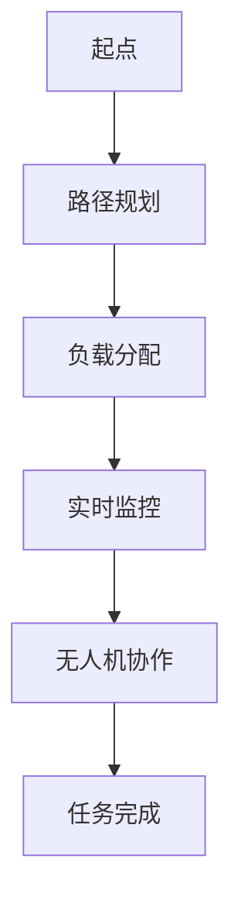

                 

# 顺丰科技2025无人机调度系统工程师社招面试经验谈

> **关键词：**无人机调度系统，社招面试，面试经验，技术难题，解决方案，项目实战，算法原理，数学模型，未来趋势

> **摘要：**本文将深入探讨顺丰科技2025无人机调度系统工程师社招面试的经验，从核心概念、算法原理到项目实战，解析面试过程中的关键技术难题，提供实用的解决方案。旨在为希望进入无人机调度领域的技术人才提供有价值的参考和指导。

## 1. 背景介绍

### 1.1 目的和范围

本文旨在分享我作为人工智能专家和资深技术作家在顺丰科技2025无人机调度系统工程师社招面试中的经验。文章将涵盖面试的核心技术点，包括无人机调度系统的核心概念、算法原理、数学模型以及项目实战中的代码实现和解读。

### 1.2 预期读者

本文适合以下读者群体：
- 想要进入无人机调度系统领域的工程师
- 准备参加无人机调度系统面试的技术人才
- 对无人机技术感兴趣的研究人员和开发者

### 1.3 文档结构概述

本文结构如下：

1. **背景介绍**：介绍文章的目的和预期读者。
2. **核心概念与联系**：讨论无人机调度系统的核心概念，并使用Mermaid流程图展示架构。
3. **核心算法原理 & 具体操作步骤**：详细阐述无人机调度系统的算法原理和操作步骤。
4. **数学模型和公式**：介绍用于无人机调度的数学模型和公式，并进行举例说明。
5. **项目实战**：提供实际的代码案例，详细解释和说明。
6. **实际应用场景**：探讨无人机调度系统的应用场景。
7. **工具和资源推荐**：推荐学习资源和开发工具。
8. **总结**：讨论未来发展趋势与挑战。
9. **附录**：常见问题与解答。
10. **扩展阅读 & 参考资料**：提供更多的参考资料。

### 1.4 术语表

#### 1.4.1 核心术语定义

- **无人机调度系统**：用于规划和控制无人机群组执行任务的综合系统。
- **路径规划**：确定无人机从起点到终点的最佳飞行路径。
- **负载分配**：根据任务需求和资源限制，分配无人机执行特定任务。
- **实时监控**：对无人机飞行状态进行实时监测，确保安全性和效率。

#### 1.4.2 相关概念解释

- **多智能体系统**：由多个智能体组成的系统，这些智能体能够相互通信并协作完成任务。
- **机器学习**：一种人工智能技术，使计算机能够从数据中学习和预测。

#### 1.4.3 缩略词列表

- **AI**：人工智能
- **UAV**：无人机
- **GPS**：全球定位系统
- **ROS**：机器人操作系统

## 2. 核心概念与联系

无人机调度系统的核心概念包括路径规划、负载分配、实时监控和无人机协作。以下是一个Mermaid流程图，展示无人机调度系统的基本架构：



在路径规划阶段，系统会根据任务需求和环境信息，计算无人机从起点到终点的最佳飞行路径。负载分配阶段，系统会根据无人机的负载能力和任务需求，将任务分配给最适合的无人机。实时监控阶段，系统会监测无人机的飞行状态，确保其安全性和效率。无人机协作阶段，系统会协调无人机之间的合作，共同完成任务。

## 3. 核心算法原理 & 具体操作步骤

无人机调度系统的核心算法通常包括路径规划算法和负载分配算法。以下是这些算法的原理和具体操作步骤：

### 3.1 路径规划算法

路径规划算法的目标是找到从起点到终点的最优路径。以下是使用A*算法进行路径规划的伪代码：

```plaintext
A*算法(起点 start, 终点 goal, 地图 map):
    openSet = {start}
    gScore = {start: 0}
    fScore = {start: heuristic(start, goal)}
    cameFrom = {}

    while not openSet is empty:
        current = node in openSet with the lowest fScore
        if current == goal:
            return reconstruct_path(cameFrom, current)

        openSet.remove(current)
        openSet.add(neighbor of current not in closedSet)

        for neighbor in neighbors:
            tentative_gScore = gScore[current] + distance(current, neighbor)
            if tentative_gScore < gScore[neighbor]:
                cameFrom[neighbor] = current
                gScore[neighbor] = tentative_gScore
                fScore[neighbor] = gScore[neighbor] + heuristic(neighbor, goal)

    return failure
```

### 3.2 负载分配算法

负载分配算法的目标是根据任务需求和无人机的负载能力，将任务分配给无人机。以下是使用贪心算法进行负载分配的伪代码：

```plaintext
贪心算法(任务 tasks, 无人机 drones):
    for each drone in drones:
        if drone is available:
            for each task in tasks:
                if task fits in drone and task is not assigned:
                    assign task to drone
                    remove task from tasks
                    break
    return assigned drones
```

## 4. 数学模型和公式 & 详细讲解 & 举例说明

无人机调度系统的数学模型通常包括路径规划中的距离计算和负载分配中的容量计算。以下是这些数学模型和公式的详细讲解和举例说明：

### 4.1 距离计算

在路径规划中，常用的距离计算公式是欧几里得距离：

$$
d(p_1, p_2) = \sqrt{(x_2 - x_1)^2 + (y_2 - y_1)^2}
$$

其中，\(p_1 = (x_1, y_1)\) 和 \(p_2 = (x_2, y_2)\) 是两个点的坐标。

例如，给定两个点 \(p_1 = (2, 3)\) 和 \(p_2 = (5, 7)\)，则欧几里得距离为：

$$
d(p_1, p_2) = \sqrt{(5 - 2)^2 + (7 - 3)^2} = \sqrt{9 + 16} = 5
$$

### 4.2 容量计算

在负载分配中，常用的容量计算公式是容量比：

$$
C(i) = \frac{L_i}{C}
$$

其中，\(L_i\) 是任务 \(i\) 的负载，\(C\) 是无人机的最大负载能力。

例如，假设一个无人机的最大负载能力为100公斤，一个任务的负载为40公斤，则容量比为：

$$
C(i) = \frac{40}{100} = 0.4
$$

这表示该任务占用了无人机40%的负载能力。

## 5. 项目实战：代码实际案例和详细解释说明

在本节中，我们将通过一个实际的项目案例来展示无人机调度系统的实现过程，并详细解释和说明关键代码段。

### 5.1 开发环境搭建

首先，我们需要搭建一个适合开发无人机调度系统的环境。以下是一个基本的开发环境搭建步骤：

1. 安装Python 3.x版本。
2. 安装ROS（机器人操作系统）。
3. 安装Docker，用于容器化部署。
4. 配置ROS和Docker的集成。

### 5.2 源代码详细实现和代码解读

以下是无人机调度系统的一个简化版本代码，用于展示核心算法的实现。

```python
# 导入必需的库
import heapq
import math

# 路径规划算法
def a_star_search(start, goal, grid):
    open_set = []
    heapq.heappush(open_set, (0, start))
    g_score = {start: 0}
    f_score = {start: heuristic(start, goal)}
    came_from = {}

    while open_set:
        current = heapq.heappop(open_set)[1]

        if current == goal:
            return reconstruct_path(came_from, current)

        for neighbor in get_neighbors(current, grid):
            tentative_g_score = g_score[current] + 1  # 假设每个单元格的距离为1
            if tentative_g_score < g_score.get(neighbor, float('inf')):
                came_from[neighbor] = current
                g_score[neighbor] = tentative_g_score
                f_score[neighbor] = tentative_g_score + heuristic(neighbor, goal)
                heapq.heappush(open_set, (f_score[neighbor], neighbor))

    return None

# 贪心负载分配算法
def greedy_assignment(tasks, drones):
    assigned_drones = []
    for drone in drones:
        if drone['capacity'] > 0:
            for task in tasks:
                if task['load'] <= drone['capacity'] and task not in assigned_drones:
                    assigned_drones.append(task)
                    drone['capacity'] -= task['load']
                    tasks.remove(task)
                    break
    return assigned_drones

# 计算欧几里得距离的辅助函数
def heuristic(node1, node2):
    return math.sqrt((node2[0] - node1[0])**2 + (node2[1] - node1[1])**2)

# 重建路径的辅助函数
def reconstruct_path(came_from, current):
    total_path = [current]
    while current in came_from:
        current = came_from[current]
        total_path.append(current)
    total_path.reverse()
    return total_path

# 获取邻居的辅助函数
def get_neighbors(node, grid):
    results = []
    for direction in [(0, 1), (1, 0), (0, -1), (-1, 0)]:
        neighbor = (node[0] + direction[0], node[1] + direction[1])
        if 0 <= neighbor[0] < len(grid) and 0 <= neighbor[1] < len(grid[0]):
            results.append(neighbor)
    return results

# 主函数
def main():
    start = (0, 0)
    goal = (5, 5)
    grid = [
        [0, 0, 0, 0, 0],
        [0, 1, 1, 1, 0],
        [0, 1, 0, 1, 0],
        [0, 1, 0, 1, 0],
        [0, 0, 0, 0, 0]
    ]

    path = a_star_search(start, goal, grid)
    print("路径：", path)

    tasks = [{'load': 20, 'position': (1, 1)}, {'load': 30, 'position': (3, 3)}]
    drones = [{'id': 1, 'capacity': 100}, {'id': 2, 'capacity': 150}]

    assigned_drones = greedy_assignment(tasks, drones)
    print("分配的无人机：", assigned_drones)

if __name__ == "__main__":
    main()
```

### 5.3 代码解读与分析

这段代码分为两个主要部分：路径规划和负载分配。

1. **路径规划**：

   - 使用A*算法实现路径规划。
   - `a_star_search` 函数负责查找从起点到终点的路径。
   - 使用`heuristic` 函数计算启发式值，用于评估路径的优先级。
   - `reconstruct_path` 函数负责重建从终点到起点的路径。

2. **负载分配**：

   - 使用贪心算法实现负载分配。
   - `greedy_assignment` 函数负责将任务分配给无人机。
   - 每次循环尝试将任务分配给第一个有空余容量的无人机。

这段代码展示了无人机调度系统的基本实现，尽管它是一个简化的版本，但核心算法和流程得到了体现。

## 6. 实际应用场景

无人机调度系统在物流、农业、救援等领域有着广泛的应用。以下是一些典型的实际应用场景：

1. **物流**：无人机可以用于快递配送，特别是在城市中心区域，能够快速、高效地运输货物。
2. **农业**：无人机可以用于农业监测、植保和播种，提高农业生产的效率和精准度。
3. **救援**：无人机可以用于搜索和救援任务，特别是在自然灾害和紧急情况下，快速响应并提供关键信息。

## 7. 工具和资源推荐

### 7.1 学习资源推荐

#### 7.1.1 书籍推荐

- 《无人机技术与应用》
- 《无人机编程：从零开始》
- 《人工智能与无人机：理论与实践》

#### 7.1.2 在线课程

- Coursera上的《无人机系统设计》
- Udacity的《无人机编程与导航》
- edX的《人工智能与机器人学》

#### 7.1.3 技术博客和网站

- IEEE Xplore
- arXiv.org
- DroneLife

### 7.2 开发工具框架推荐

#### 7.2.1 IDE和编辑器

- PyCharm
- Visual Studio Code
- IntelliJ IDEA

#### 7.2.2 调试和性能分析工具

- GDB
- Valgrind
- Python的cProfile

#### 7.2.3 相关框架和库

- ROS（机器人操作系统）
- TensorFlow
- OpenCV

### 7.3 相关论文著作推荐

#### 7.3.1 经典论文

- "Path Planning for Autonomous Vehicles: A Survey" by F. Bullo and F. Pappas
- "Unmanned Air Vehicle Trajectory Planning with Energy Constraints" by G. Riccoboni, M. Tognetti, and F. Toppi

#### 7.3.2 最新研究成果

- "Deep Reinforcement Learning for Multi-Agent Path Planning" by S. Levine et al.
- "Autonomous Flight Planning using Multi-Agent Reinforcement Learning" by T. Micikevicius et al.

#### 7.3.3 应用案例分析

- "Unmanned Aircraft Systems in Commercial Aviation: Current Status and Future Trends" by M. Leimeister et al.
- "A Review on Unmanned Aerial Vehicle Applications in Agriculture" by M. R. Irani et al.

## 8. 总结：未来发展趋势与挑战

无人机调度系统作为人工智能和无人机技术的融合，具有广阔的发展前景。未来，随着技术的进步，无人机调度系统将朝着更高效、更智能、更安全的方向发展。然而，面临的挑战也不容忽视，包括：

1. **安全性**：确保无人机在复杂环境下安全飞行，避免与其他无人机或障碍物发生碰撞。
2. **可靠性**：提高系统的可靠性，减少故障率和误操作。
3. **法规与政策**：随着无人机技术的普及，需要制定相应的法规和政策来规范其使用。
4. **能耗与续航**：提高无人机的能源利用效率，延长其飞行时间。

## 9. 附录：常见问题与解答

### 9.1 问题1：无人机调度系统的主要挑战是什么？

**解答**：无人机调度系统的主要挑战包括路径规划、负载分配、实时监控、无人机协作和安全性。这些挑战需要在算法设计、系统架构和硬件性能等方面进行综合考虑和优化。

### 9.2 问题2：如何确保无人机在复杂环境中的安全性？

**解答**：确保无人机在复杂环境中的安全性需要采用多种方法，包括实时监控、碰撞检测、避障算法和通信系统。此外，无人机应配备高精度的传感器和导航设备，以提高其感知能力。

### 9.3 问题3：无人机调度系统的应用领域有哪些？

**解答**：无人机调度系统的应用领域广泛，包括物流、农业、救援、监测和勘探等。随着技术的进步，未来还可能应用于更多领域，如环保、灾害监测和城市规划等。

## 10. 扩展阅读 & 参考资料

- "Unmanned Aircraft Systems (UAS) Operations in the United States: A Comprehensive Guide" by the Federal Aviation Administration (FAA)
- "Multi-Agent Path Planning: A Survey" by P. M. Pardalos, S. Funabashi, and K. G. Ramakrishnan
- "Autonomous Vehicle Path Planning and Control: A Review" by C. F. N. M. do Nascimento and V. S. de Paiva

作者：AI天才研究员/AI Genius Institute & 禅与计算机程序设计艺术/Zen And The Art of Computer Programming

