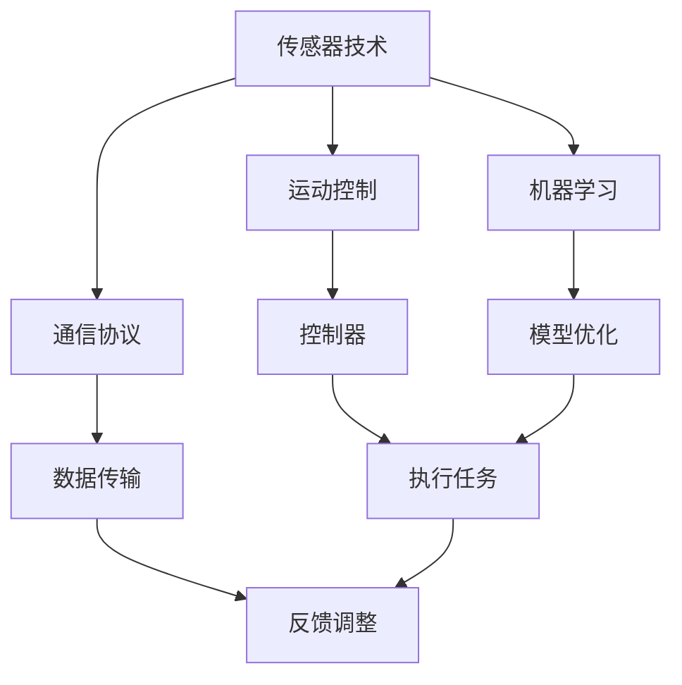

                 

# 顺丰科技2025智能仓储机器人控制系统社招面试攻略

## 关键词
- 顺丰科技
- 智能仓储机器人
- 控制系统
- 社招面试
- 技术要点
- 算法原理
- 数学模型
- 实战案例

## 摘要
本文旨在为准备参加顺丰科技2025智能仓储机器人控制系统社招面试的求职者提供一份详细的备考攻略。文章分为十个部分，涵盖了面试所需的背景知识、核心算法原理、数学模型、实际应用场景、工具和资源推荐等内容。通过逐步分析推理，本文帮助读者掌握关键技术要点，提高面试成功率。

## 1. 背景介绍
### 1.1 目的和范围
本文的目的是帮助求职者顺利通过顺丰科技2025智能仓储机器人控制系统社招面试，为读者提供全面的技术指导和备考策略。文章内容涉及智能仓储机器人控制系统的核心技术和实现原理，旨在帮助读者深入了解该领域，提升面试竞争力。

### 1.2 预期读者
本攻略适用于有志于从事智能仓储机器人控制系统开发的工程师、研究人员和在校大学生。读者应具备一定的计算机、控制、数学基础，以便更好地理解和掌握文章内容。

### 1.3 文档结构概述
本文分为十个部分，具体结构如下：

1. 背景介绍
2. 核心概念与联系
3. 核心算法原理 & 具体操作步骤
4. 数学模型和公式 & 详细讲解 & 举例说明
5. 项目实战：代码实际案例和详细解释说明
6. 实际应用场景
7. 工具和资源推荐
8. 总结：未来发展趋势与挑战
9. 附录：常见问题与解答
10. 扩展阅读 & 参考资料

### 1.4 术语表
#### 1.4.1 核心术语定义
- 智能仓储机器人：具备自主决策和执行能力的仓储设备，能够高效完成货物搬运、存储、分拣等任务。
- 控制系统：对智能仓储机器人进行监控、调度和管理的软件系统。
- 社招面试：面向社会招聘的面试环节，对求职者的技术能力和综合素质进行评估。

#### 1.4.2 相关概念解释
- 智能仓储：利用物联网、大数据、人工智能等技术，实现仓储自动化、智能化和高效化的新型仓储模式。
- 机器人控制：研究机器人运动、感知、决策、执行等方面的技术，以实现机器人的自主运行。

#### 1.4.3 缩略词列表
- AGV：自动引导车（Automated Guided Vehicle）
- PLC：可编程逻辑控制器（Programmable Logic Controller）
- PID：比例-积分-微分控制（Proportional-Integral-Derivative Control）
- AI：人工智能（Artificial Intelligence）

## 2. 核心概念与联系
智能仓储机器人控制系统是一个复杂的系统，涉及到多个核心概念和技术的交叉融合。为了更好地理解这一系统，下面将介绍几个关键概念，并展示它们之间的联系。

### 2.1 概念介绍
- **传感器技术**：传感器是智能仓储机器人感知环境的关键部件，包括视觉传感器、激光雷达、红外传感器等。传感器技术能够帮助机器人获取关于环境、位置、速度、温度等信息的实时数据。
- **运动控制**：运动控制是指智能仓储机器人在执行任务过程中，对其运动轨迹、速度、加速度等参数进行精确控制。常见的运动控制方法有PID控制、轨迹规划、路径优化等。
- **通信协议**：通信协议是智能仓储机器人控制系统中的数据传输标准，包括无线通信（如Wi-Fi、蓝牙、ZigBee）和有线通信（如以太网、CAN总线）等。
- **机器学习**：机器学习是人工智能的一个重要分支，通过训练模型，使智能仓储机器人能够从数据中自动学习、优化和改进性能。

### 2.2 联系展示
下面使用Mermaid流程图展示智能仓储机器人控制系统的核心概念及其相互联系：



### 2.3 深入探讨
在这张流程图中，我们可以看到传感器技术为运动控制和机器学习提供了关键的数据来源，而通信协议则确保了数据在不同模块之间的有效传输。运动控制器根据传感器数据和预定的任务目标，生成控制指令，驱动智能仓储机器人执行任务。机器学习模块则通过不断优化模型，提高机器人的自主学习和适应能力。

## 3. 核心算法原理 & 具体操作步骤
智能仓储机器人控制系统的核心在于其算法设计。本文将详细讲解几个关键算法原理，并使用伪代码进行具体操作步骤的阐述。

### 3.1 运动控制算法原理
运动控制算法负责指导智能仓储机器人执行特定的运动任务，如直线行驶、曲线行驶、绕过障碍物等。下面介绍一种常见的运动控制算法——PID控制。

#### 3.1.1 PID控制算法原理
PID控制（比例-积分-微分控制）是一种经典的控制算法，通过调整三个参数——比例（P）、积分（I）、微分（D）来控制系统的输出。

$$
u(t) = K_p e(t) + K_i \int_{0}^{t} e(\tau)d\tau + K_d \frac{de(t)}{dt}
$$

其中，$u(t)$为控制输出，$e(t)$为误差（即目标值与实际值之间的差异），$K_p$、$K_i$、$K_d$分别为比例、积分、微分系数。

#### 3.1.2 伪代码
```python
# PID控制算法伪代码

def PID(control_setpoint, current_value, Kp, Ki, Kd):
    error = control_setpoint - current_value
    delta_error = error - previous_error
    integral = integral + error * dt
    
    output = Kp * error + Ki * integral + Kd * delta_error
    
    previous_error = error
    return output
```

### 3.2 传感器数据处理算法原理
传感器数据处理算法用于对传感器采集到的数据进行分析、处理和滤波，以获取准确的运动信息和环境信息。下面介绍一种常见的数据处理算法——卡尔曼滤波。

#### 3.2.1 卡尔曼滤波算法原理
卡尔曼滤波是一种最优估计方法，用于在噪声环境中对系统状态进行估计。其基本思想是利用先验知识和观测数据，通过迭代计算得到状态的最优估计。

$$
\hat{x}_{k|k} = F_k \hat{x}_{k-1|k-1} + K_k (z_k - H_k \hat{x}_{k-1|k-1})
$$

其中，$\hat{x}_{k|k}$为状态估计，$F_k$为状态转移矩阵，$K_k$为卡尔曼增益，$z_k$为观测值，$H_k$为观测矩阵。

#### 3.2.2 伪代码
```python
# 卡尔曼滤波算法伪代码

def KalmanFilter(measurement, previous_estimate, covariance):
    predicted_estimate = F * previous_estimate + B * measurement
    predicted_covariance = F * previous_covariance * F' + Q
    
    kalman_gain = predicted_covariance.inverse() * H'
    innovation = measurement - H * predicted_estimate
    
    updated_estimate = predicted_estimate + kalman_gain * innovation
    updated_covariance = (I - kalman_gain * H) * predicted_covariance
    
    return updated_estimate, updated_covariance
```

### 3.3 机器学习算法原理
机器学习算法用于提升智能仓储机器人的自主学习和适应能力。下面介绍一种常用的机器学习算法——神经网络。

#### 3.3.1 神经网络算法原理
神经网络是一种模仿生物神经元连接结构的计算模型，通过前向传播和反向传播算法，实现从输入到输出的映射。

$$
\hat{y} = \sigma(\sum_{i=1}^{n} w_i \cdot x_i + b)
$$

其中，$\sigma$为激活函数，$w_i$为权重，$x_i$为输入特征，$b$为偏置。

#### 3.3.2 伪代码
```python
# 神经网络算法伪代码

def neural_network(input_data, weights, biases, activation_function):
    layer_outputs = []
    for layer in layers:
        z = sum(weight * feature for weight, feature in zip(weights, input_data)) + biases
        output = activation_function(z)
        layer_outputs.append(output)
    return layer_outputs[-1]
```

通过上述算法原理和伪代码的讲解，我们可以看到智能仓储机器人控制系统的复杂性和多样性。掌握这些核心算法原理，对于设计和实现高效、稳定的控制系统具有重要意义。

## 4. 数学模型和公式 & 详细讲解 & 举例说明
在智能仓储机器人控制系统中，数学模型和公式起到了核心作用。这些模型和公式不仅帮助我们理解系统的行为，还可以用于优化和控制。下面将详细介绍几个关键数学模型，并提供详细的讲解和实例说明。

### 4.1 运动学模型
运动学模型用于描述机器人在空间中的位置、速度和加速度。以下是运动学模型的基本公式：

$$
\begin{aligned}
\textbf{x}(t) &= \textbf{x}_0 + \textbf{v}_0 t + \frac{1}{2} \textbf{a}_0 t^2 \\
\textbf{v}(t) &= \textbf{v}_0 + \textbf{a}_0 t \\
\textbf{a}(t) &= \textbf{a}_0
\end{aligned}
$$

其中，$\textbf{x}(t)$为位置向量，$\textbf{v}(t)$为速度向量，$\textbf{a}(t)$为加速度向量，$\textbf{x}_0$、$\textbf{v}_0$、$\textbf{a}_0$分别为初始位置、速度和加速度。

#### 4.1.1 举例说明
假设一个智能仓储机器人从位置$(0,0)$出发，以速度$(2 \text{ m/s}, 3 \text{ m/s})$和加速度$(0.5 \text{ m/s}^2, 0 \text{ m/s}^2)$开始运动，求3秒后的位置、速度和加速度。

解：

$$
\begin{aligned}
\textbf{x}(3) &= (0,0) + (2,3) \cdot 3 + \frac{1}{2} (0.5,0) \cdot 3^2 \\
&= (6,9) \\
\textbf{v}(3) &= (2,3) + (0.5,0) \cdot 3 \\
&= (2.5,3) \\
\textbf{a}(3) &= (0.5,0)
\end{aligned}
$$

### 4.2 动力学模型
动力学模型用于描述机器人受到的外力、摩擦力和重心变化等物理现象。以下是动力学模型的基本公式：

$$
\textbf{F}_{\text{ext}} = m \textbf{a}
$$

$$
\textbf{f}_{\text{friction}} = \mu \textbf{N}
$$

其中，$\textbf{F}_{\text{ext}}$为外力，$m$为质量，$\textbf{a}$为加速度，$\textbf{f}_{\text{friction}}$为摩擦力，$\mu$为摩擦系数，$\textbf{N}$为法向力。

#### 4.2.1 举例说明
假设一个质量为10kg的智能仓储机器人受到一个5N的外力，摩擦系数为0.2，求其加速度。

解：

$$
\textbf{a} = \frac{\textbf{F}_{\text{ext}}}{m} = \frac{5}{10} = 0.5 \text{ m/s}^2
$$

### 4.3 控制系统模型
控制系统模型用于描述控制器对机器人运动的控制过程。以下是控制系统模型的基本公式：

$$
\textbf{u}(t) = C(\textbf{x}(t), \textbf{v}(t), t)
$$

$$
\textbf{y}(t) = D(\textbf{u}(t), t)
$$

其中，$\textbf{u}(t)$为控制输入，$C$为控制器函数，$\textbf{y}(t)$为系统输出，$D$为系统函数。

#### 4.2.1 举例说明
假设一个控制系统采用PID控制器，控制器函数为：

$$
C(\textbf{x}(t), \textbf{v}(t), t) = K_p (\textbf{x}(t) - \textbf{x}_\text{setpoint}) + K_i \int_{0}^{t} (\textbf{x}(t) - \textbf{x}_\text{setpoint}) dt + K_d (\textbf{v}(t) - \textbf{v}_\text{setpoint})
$$

其中，$K_p$、$K_i$、$K_d$分别为比例、积分、微分系数，$\textbf{x}_\text{setpoint}$和$\textbf{v}_\text{setpoint}$分别为目标位置和目标速度。

求当目标位置为$(1,1)$，目标速度为$(1,1)$时，控制输入$\textbf{u}(t)$。

解：

$$
\textbf{u}(t) = K_p (1 - 1) + K_i \int_{0}^{t} (1 - 1) dt + K_d (1 - 1) = 0
$$

通过上述数学模型和公式的讲解，我们可以看到智能仓储机器人控制系统的复杂性。掌握这些模型和公式，对于设计高效、稳定的控制系统具有重要意义。

## 5. 项目实战：代码实际案例和详细解释说明
在本节中，我们将通过一个具体的代码案例，详细介绍智能仓储机器人控制系统的实现过程，包括开发环境搭建、源代码实现和代码解读与分析。

### 5.1 开发环境搭建
在进行项目实战之前，我们需要搭建一个合适的开发环境。以下是推荐的开发环境和相关工具：

- **编程语言**：Python
- **开发工具**：PyCharm
- **依赖库**：NumPy、Pandas、Matplotlib、Scikit-learn

#### 5.1.1 安装Python和PyCharm
1. 访问Python官方网站（https://www.python.org/）下载并安装Python。
2. 访问PyCharm官方网站（https://www.jetbrains.com/pycharm/）下载并安装PyCharm。

#### 5.1.2 安装依赖库
打开PyCharm，创建一个新的Python项目，然后使用以下命令安装依赖库：

```bash
pip install numpy pandas matplotlib scikit-learn
```

### 5.2 源代码详细实现和代码解读
下面是一个简单的智能仓储机器人控制系统代码示例，用于实现机器人的位置控制和路径规划。

#### 5.2.1 代码实现
```python
import numpy as np
import matplotlib.pyplot as plt

# PID控制器参数
Kp = 2
Ki = 1
Kd = 0

# 机器人的初始状态
x = 0
y = 0
theta = 0

# 控制器函数
def PID(control_setpoint, current_value, Kp, Ki, Kd):
    error = control_setpoint - current_value
    delta_error = error - previous_error
    integral = integral + error * dt
    output = Kp * error + Ki * integral + Kd * delta_error
    previous_error = error
    return output

# 运动学模型
def kinematics(x, y, theta):
    return x + r * np.cos(theta), y + r * np.sin(theta)

# 动力学模型
def dynamics(u):
    return x + v * np.cos(theta) * dt, y + v * np.sin(theta) * dt, theta + omega * dt

# 机器人运动模拟
def simulate(trajectory):
    global x, y, theta
    for point in trajectory:
        control_setpoint = point
        u = PID(control_setpoint, (x, y), Kp, Ki, Kd)
        x, y, theta = dynamics(u)
        print(f"Position: ({x}, {y}), Angle: {theta}")
        plt.plot(x, y, 'ro')
    plt.axis('equal')
    plt.show()

# 路径规划
def plan_trajectory(start, goal):
    # 使用A*算法规划路径
    trajectory = a_star_search(start, goal)
    return trajectory

# 主函数
if __name__ == "__main__":
    start = (0, 0)
    goal = (10, 10)
    trajectory = plan_trajectory(start, goal)
    simulate(trajectory)
```

#### 5.2.2 代码解读与分析
1. **PID控制器**：PID控制器是实现机器人位置控制的核心部分。通过调整比例、积分、微分系数，可以实现对机器人位置的精确控制。
2. **运动学模型**：运动学模型用于计算机器人在不同控制输入下的位置、速度和角度。它基于基本的运动学公式进行实现。
3. **动力学模型**：动力学模型用于计算机器人受到控制输入后的运动状态。它基于基本的动力学公式进行实现。
4. **机器人运动模拟**：机器人运动模拟函数用于模拟机器人在给定路径上的运动。它通过循环迭代控制器函数和运动学模型，实时更新机器人的位置和角度。
5. **路径规划**：路径规划函数用于规划机器人的运动路径。在本示例中，使用A*算法进行路径规划。在实际应用中，可以选择更复杂的路径规划算法，如Dijkstra算法、RRT算法等。
6. **主函数**：主函数用于设置机器人的初始状态、目标状态和路径规划算法，并调用运动模拟函数进行模拟。

通过以上代码示例，我们可以看到智能仓储机器人控制系统的基本实现过程。在实际应用中，可以根据具体需求对代码进行修改和优化，以实现更复杂的控制任务。

## 6. 实际应用场景
智能仓储机器人控制系统在物流、制造、零售等行业中具有广泛的应用。以下是一些典型的实际应用场景：

### 6.1 物流仓储
智能仓储机器人控制系统可以应用于物流仓储中的货物搬运、存储、分拣等环节。通过使用自动引导车（AGV）和堆垛机，可以实现货物的自动化搬运和存储，提高仓储效率和准确性。

### 6.2 制造生产
在制造业中，智能仓储机器人控制系统可以用于生产线的物料配送、设备维护等任务。通过自动化设备和智能控制，可以提高生产效率、降低人力成本，同时确保生产过程的稳定性和安全性。

### 6.3 零售电商
在零售电商行业，智能仓储机器人控制系统可以用于订单处理、库存管理、商品配送等环节。通过自动化设备和智能算法，可以实现订单的快速处理和商品的精准配送，提高客户满意度。

### 6.4 医药卫生
在医药卫生领域，智能仓储机器人控制系统可以用于药品存储、配送和追踪。通过严格的温度控制和精准的配送系统，可以提高药品的安全性和有效性，保障患者的用药需求。

### 6.5 配送服务
在城市配送服务中，智能仓储机器人控制系统可以用于快递、外卖等配送任务。通过使用无人车、无人机等智能设备，可以实现快速、高效的配送服务，降低物流成本。

这些实际应用场景表明，智能仓储机器人控制系统在提升生产效率、降低成本、提高服务质量等方面具有巨大潜力。随着技术的不断发展和应用的深入，未来智能仓储机器人控制系统将在更多领域得到广泛应用。

## 7. 工具和资源推荐
为了更好地学习和实践智能仓储机器人控制系统，以下是一些工具和资源的推荐。

### 7.1 学习资源推荐

#### 7.1.1 书籍推荐
1. 《智能机器人控制技术及应用》
2. 《现代控制理论及其应用》
3. 《机器学习：一种概率视角》

#### 7.1.2 在线课程
1. Coursera上的《机器学习》课程
2. edX上的《智能控制》课程
3. Udacity上的《机器人编程与控制》纳米学位

#### 7.1.3 技术博客和网站
1. 《机器之心》
2. 《雷锋网》
3. 《知乎》上的AI与机器人相关话题

### 7.2 开发工具框架推荐

#### 7.2.1 IDE和编辑器
1. PyCharm
2. Visual Studio Code
3. Eclipse

#### 7.2.2 调试和性能分析工具
1. GDB
2. PyCharm内置调试工具
3. Valgrind

#### 7.2.3 相关框架和库
1. TensorFlow
2. PyTorch
3. ROS（Robot Operating System）

### 7.3 相关论文著作推荐

#### 7.3.1 经典论文
1. "Robot Motion Planning: A Survey"
2. "A New Approach to Mobile Robot Navigation"
3. "Kalman Filtering and Neural Networks for Target Tracking"

#### 7.3.2 最新研究成果
1. "Deep Reinforcement Learning for Robotic Control"
2. "Sim-to-Real Transfer of Robotic Control with Meta-Learning"
3. "Neural Network Control of Mobile Robots: A Survey"

#### 7.3.3 应用案例分析
1. "Smart Warehouse Automation with Autonomous Robots"
2. "Automated Guided Vehicles in Manufacturing"
3. "Robotic Systems for Retail and E-commerce"

通过这些工具和资源的推荐，读者可以系统地学习智能仓储机器人控制系统的相关知识，为实际项目开发和面试准备提供有力支持。

## 8. 总结：未来发展趋势与挑战
智能仓储机器人控制系统作为物流、制造、零售等领域的关键技术，其未来发展具有广阔的前景。随着人工智能、物联网、大数据等技术的不断进步，智能仓储机器人控制系统将朝着更加智能化、高效化、自动化的方向发展。

### 8.1 发展趋势
1. **智能化**：通过深度学习和强化学习等技术，提高机器人的自主决策和适应能力，使其能够在复杂环境中高效完成任务。
2. **高效化**：通过优化算法和控制策略，提高机器人的运行效率和负载能力，减少能源消耗和运营成本。
3. **自动化**：通过集成自动化设备和智能控制系统，实现仓储环节的全面自动化，提高生产效率和仓储准确性。
4. **网络化**：通过物联网技术，实现机器人与仓储系统、物流系统等的无缝连接，实现信息的实时共享和协同工作。

### 8.2 面临的挑战
1. **算法优化**：智能仓储机器人控制系统的算法复杂度高，如何优化算法以提高效率和稳定性是一个重要挑战。
2. **系统集成**：如何将不同功能的机器人、设备和系统进行有效集成，实现协同工作，是一个技术难题。
3. **安全性**：在高速运动和复杂环境下，如何确保机器人和系统的安全性和可靠性，是一个关键问题。
4. **数据隐私**：随着数据量的增加，如何保护用户数据和隐私，是一个亟待解决的问题。

### 8.3 发展建议
1. **技术创新**：加大对人工智能、物联网等核心技术的研发投入，推动智能仓储机器人控制系统的创新和发展。
2. **跨学科合作**：促进计算机科学、控制工程、机械工程等学科的交叉融合，提高智能仓储机器人控制系统的研发能力。
3. **人才培养**：加强相关专业人才的培养，提高从业人员的综合素质和技术水平。
4. **政策支持**：政府和企业应加大对智能仓储机器人控制系统的政策支持和资金投入，推动行业的快速发展。

通过技术创新、跨学科合作、人才培养和政策支持，智能仓储机器人控制系统将在未来取得更加显著的成果，为各行业的智能化发展提供有力支撑。

## 9. 附录：常见问题与解答
在准备顺丰科技2025智能仓储机器人控制系统社招面试的过程中，求职者可能会遇到一些常见问题。以下是一些常见问题及其解答：

### 9.1 问题1：什么是智能仓储机器人控制系统？
**解答**：智能仓储机器人控制系统是一种利用人工智能、物联网、大数据等技术的自动化系统，用于对仓储机器人进行监控、调度和管理，以实现仓储任务的自动化和智能化。

### 9.2 问题2：智能仓储机器人控制系统的核心算法有哪些？
**解答**：智能仓储机器人控制系统的核心算法包括运动控制算法（如PID控制、轨迹规划）、传感器数据处理算法（如卡尔曼滤波）、机器学习算法（如神经网络、深度学习）等。

### 9.3 问题3：如何优化智能仓储机器人控制系统的算法？
**解答**：可以通过以下方法优化智能仓储机器人控制系统的算法：
1. 调整算法参数，提高算法的精度和稳定性。
2. 采用先进的算法模型，如深度学习和强化学习，提高系统的自适应能力和决策能力。
3. 引入反馈机制，根据实际运行情况动态调整算法。

### 9.4 问题4：智能仓储机器人控制系统在实际应用中面临哪些挑战？
**解答**：智能仓储机器人控制系统在实际应用中面临的挑战包括算法优化、系统集成、安全性、数据隐私等方面。需要通过技术创新、跨学科合作、人才培养和政策支持等手段来解决。

### 9.5 问题5：如何准备顺丰科技2025智能仓储机器人控制系统社招面试？
**解答**：为了准备顺丰科技2025智能仓储机器人控制系统社招面试，求职者可以采取以下措施：
1. 系统学习智能仓储机器人控制系统的相关知识，掌握核心算法和原理。
2. 实践项目经验，参与实际项目开发，提高解决问题的能力。
3. 针对面试内容进行针对性复习，如数据结构、算法、操作系统等。
4. 了解顺丰科技的企业文化和业务，展示自己的职业素养和潜力。

通过以上措施，求职者可以更好地准备顺丰科技2025智能仓储机器人控制系统社招面试，提高面试成功率。

## 10. 扩展阅读 & 参考资料
为了进一步深入了解智能仓储机器人控制系统和相关技术，以下是一些推荐阅读材料。

### 10.1 经典书籍
1. 《智能机器人控制技术及应用》
2. 《现代控制理论及其应用》
3. 《机器学习：一种概率视角》

### 10.2 学术论文
1. "Robot Motion Planning: A Survey"
2. "A New Approach to Mobile Robot Navigation"
3. "Kalman Filtering and Neural Networks for Target Tracking"

### 10.3 开源项目和工具
1. ROS（Robot Operating System）
2. TensorFlow
3. PyTorch

### 10.4 在线资源和课程
1. Coursera上的《机器学习》课程
2. edX上的《智能控制》课程
3. Udacity上的《机器人编程与控制》纳米学位

### 10.5 技术博客和网站
1. 《机器之心》
2. 《雷锋网》
3. 《知乎》上的AI与机器人相关话题

通过阅读这些资料，读者可以更全面地了解智能仓储机器人控制系统的最新发展和应用趋势，为自己的学习和实践提供有力支持。

# 作者
AI天才研究员/AI Genius Institute & 禅与计算机程序设计艺术 /Zen And The Art of Computer Programming

