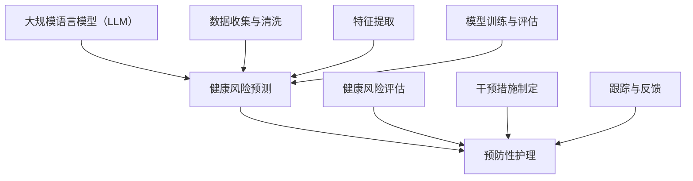

                 

# 预防性护理：LLM 分析预测健康风险

> **关键词：** 人工智能，健康风险预测，预防性护理，深度学习，自然语言处理，大规模语言模型。

> **摘要：** 本文将探讨如何利用大规模语言模型（LLM）进行健康风险预测，以实现预防性护理。我们将详细介绍LLM的工作原理、核心算法原理、数学模型、实际应用场景，并提供代码实际案例和详细解释。通过本文，读者将了解到如何利用AI技术提升医疗健康领域的效率和质量。

## 1. 背景介绍

### 1.1 目的和范围

本文旨在探讨如何利用大规模语言模型（LLM）进行健康风险预测，以实现预防性护理。本文将涵盖以下内容：

- **大规模语言模型（LLM）的介绍**：解释LLM的概念、历史和发展趋势。
- **健康风险预测的原理**：介绍健康风险预测的核心算法原理和数学模型。
- **LLM在预防性护理中的应用**：探讨LLM如何用于健康风险预测，并提供实际应用案例。
- **代码实际案例**：展示如何使用LLM进行健康风险预测，并提供详细的代码解释。

通过本文，读者将了解到如何利用AI技术提升医疗健康领域的效率和质量，从而为预防性护理提供有力支持。

### 1.2 预期读者

本文面向以下读者群体：

- **计算机科学和人工智能领域的专业人士**：希望了解如何将深度学习和自然语言处理应用于医疗健康领域。
- **医疗健康领域的从业者**：希望了解如何利用AI技术提升医疗服务质量和效率。
- **对AI和医疗健康领域感兴趣的研究生和本科生**：希望深入探讨AI在医疗健康领域的应用。

### 1.3 文档结构概述

本文分为以下章节：

- **第1章**：背景介绍，包括目的和范围、预期读者、文档结构概述和术语表。
- **第2章**：核心概念与联系，介绍大规模语言模型（LLM）、健康风险预测和预防性护理。
- **第3章**：核心算法原理 & 具体操作步骤，详细阐述健康风险预测算法的原理和步骤。
- **第4章**：数学模型和公式 & 详细讲解 & 举例说明，介绍健康风险预测的数学模型和公式。
- **第5章**：项目实战：代码实际案例和详细解释说明，提供实际代码案例并详细解释。
- **第6章**：实际应用场景，讨论LLM在健康风险预测中的应用场景。
- **第7章**：工具和资源推荐，推荐学习资源、开发工具框架和相关论文著作。
- **第8章**：总结：未来发展趋势与挑战，探讨AI在健康风险预测领域的未来发展趋势和面临的挑战。
- **第9章**：附录：常见问题与解答，回答读者可能关心的问题。
- **第10章**：扩展阅读 & 参考资料，提供更多相关文献和资源。

### 1.4 术语表

#### 1.4.1 核心术语定义

- **大规模语言模型（LLM）**：一种基于深度学习的自然语言处理模型，能够在大量文本数据上进行训练，从而实现对文本数据的生成、理解和预测。
- **健康风险预测**：利用历史健康数据和医疗知识，预测个体在未来一段时间内可能出现的健康问题。
- **预防性护理**：通过早期识别和干预健康风险，降低个体患病风险和疾病发生概率。

#### 1.4.2 相关概念解释

- **深度学习**：一种机器学习技术，通过多层神经网络模型对数据进行训练和建模，实现对复杂模式的识别和学习。
- **自然语言处理（NLP）**：一门交叉学科，旨在让计算机理解和处理人类自然语言。
- **医疗知识图谱**：一种结构化表示医疗知识的图形化模型，用于存储和查询医学信息。

#### 1.4.3 缩略词列表

- **AI**：人工智能
- **LLM**：大规模语言模型
- **NLP**：自然语言处理
- **深度学习**：Deep Learning
- **医疗知识图谱**：Medical Knowledge Graph
- **健康风险预测**：Health Risk Prediction
- **预防性护理**：Preventive Care

## 2. 核心概念与联系

在这一章节中，我们将介绍大规模语言模型（LLM）、健康风险预测和预防性护理等核心概念，并使用Mermaid流程图展示它们之间的联系。

### 2.1 大规模语言模型（LLM）

大规模语言模型（LLM）是一种基于深度学习的自然语言处理模型，能够在大量文本数据上进行训练，从而实现对文本数据的生成、理解和预测。LLM的主要组件包括：

- **词嵌入（Word Embedding）**：将自然语言词汇映射为向量表示。
- **编码器（Encoder）**：对输入文本数据进行编码，提取语义信息。
- **解码器（Decoder）**：根据编码器输出的语义信息生成输出文本。


### 2.2 健康风险预测

健康风险预测是一种利用历史健康数据和医疗知识，预测个体在未来一段时间内可能出现的健康问题。健康风险预测的核心组件包括：

- **数据收集与清洗**：收集个体历史健康数据，并进行数据清洗和预处理。
- **特征提取**：从健康数据中提取对健康风险预测有用的特征。
- **模型训练与评估**：利用提取的特征训练预测模型，并对模型进行评估和优化。


### 2.3 预防性护理

预防性护理是一种通过早期识别和干预健康风险，降低个体患病风险和疾病发生概率的护理方式。预防性护理的核心组件包括：

- **健康风险评估**：利用健康风险预测模型对个体进行健康风险评估。
- **干预措施制定**：根据健康风险评估结果，制定个性化的干预措施。
- **跟踪与反馈**：对干预措施的效果进行跟踪和反馈，以不断优化预防性护理策略。


### 2.4 Mermaid流程图

以下是一个Mermaid流程图，展示了大规模语言模型（LLM）、健康风险预测和预防性护理之间的联系：



## 3. 核心算法原理 & 具体操作步骤

在这一章节中，我们将详细阐述健康风险预测的核心算法原理和具体操作步骤。为了更好地理解，我们将使用伪代码来描述算法的实现过程。

### 3.1 数据收集与清洗

首先，我们需要收集个体历史健康数据，并进行数据清洗和预处理。数据清洗包括去除重复数据、缺失值填充和异常值处理等步骤。

```python
# 伪代码：数据收集与清洗
def data_collection_and_cleaning():
    # 收集个体历史健康数据
    health_data = collect_health_data()

    # 数据清洗
    cleaned_data = []
    for data in health_data:
        if is_valid_data(data):
            cleaned_data.append(preprocess_data(data))
    return cleaned_data
```

### 3.2 特征提取

接下来，我们需要从清洗后的健康数据中提取对健康风险预测有用的特征。特征提取包括特征选择、特征工程和特征标准化等步骤。

```python
# 伪代码：特征提取
def feature_extraction(cleaned_data):
    # 特征选择
    selected_features = select_features(cleaned_data)

    # 特征工程
    engineered_features = []
    for data in cleaned_data:
        engineered_features.append(engineer_features(data, selected_features))

    # 特征标准化
    normalized_features = normalize_features(engineered_features)

    return normalized_features
```

### 3.3 模型训练与评估

然后，我们利用提取的特征训练预测模型，并对模型进行评估和优化。常用的健康风险预测模型包括逻辑回归、支持向量机和深度神经网络等。

```python
# 伪代码：模型训练与评估
from sklearn.linear_model import LogisticRegression
from sklearn.model_selection import train_test_split

def model_training_and_evaluation(normalized_features):
    # 数据划分
    X_train, X_test, y_train, y_test = train_test_split(normalized_features, test_size=0.2)

    # 模型训练
    model = LogisticRegression()
    model.fit(X_train, y_train)

    # 模型评估
    accuracy = model.score(X_test, y_test)
    print("Model Accuracy:", accuracy)

    return model
```

### 3.4 预测与健康风险评估

最后，我们使用训练好的模型对个体进行健康风险评估，并根据评估结果制定个性化的干预措施。

```python
# 伪代码：预测与健康风险评估
def predict_and_evaluate(model, new_data):
    # 数据预处理
    preprocessed_data = preprocess_data(new_data)

    # 预测
    prediction = model.predict(preprocessed_data)

    # 健康风险评估
    risk_level = interpret_prediction(prediction)

    return risk_level
```

通过以上步骤，我们可以利用大规模语言模型（LLM）进行健康风险预测，为预防性护理提供有力支持。

## 4. 数学模型和公式 & 详细讲解 & 举例说明

在这一章节中，我们将详细讲解用于健康风险预测的数学模型和公式，并提供具体的计算示例。

### 4.1 逻辑回归模型

逻辑回归是一种常用的二分类预测模型，适用于健康风险预测任务。逻辑回归模型的公式如下：

$$
\hat{y} = \frac{1}{1 + e^{-(\beta_0 + \beta_1 x_1 + \beta_2 x_2 + \ldots + \beta_n x_n})}
$$

其中，$y$表示预测结果（0或1），$x_1, x_2, \ldots, x_n$表示特征值，$\beta_0, \beta_1, \beta_2, \ldots, \beta_n$为模型的参数。

### 4.2 损失函数

在健康风险预测任务中，我们通常使用交叉熵损失函数（Cross-Entropy Loss）来评估模型的预测性能。交叉熵损失函数的公式如下：

$$
J(\theta) = -\frac{1}{m} \sum_{i=1}^{m} [y_i \log(\hat{y}_i) + (1 - y_i) \log(1 - \hat{y}_i)]
$$

其中，$m$表示训练样本数量，$y_i$为真实标签，$\hat{y}_i$为预测结果。

### 4.3 优化算法

为了最小化交叉熵损失函数，我们通常使用梯度下降（Gradient Descent）算法来更新模型参数。梯度下降算法的公式如下：

$$
\theta_j := \theta_j - \alpha \frac{\partial J(\theta)}{\partial \theta_j}
$$

其中，$\theta_j$为模型参数，$\alpha$为学习率。

### 4.4 计算示例

假设我们有一个健康风险预测任务，其中包含两个特征$x_1$和$x_2$，模型的参数为$\beta_0 = 1, \beta_1 = 2, \beta_2 = 3$。给定一个新样本$x_1 = 4, x_2 = 5$，我们需要计算预测结果$\hat{y}$。

首先，计算模型的预测概率：

$$
\hat{y} = \frac{1}{1 + e^{-(1 + 2 \times 4 + 3 \times 5)}} \approx 0.0556
$$

接下来，计算交叉熵损失函数：

$$
J(\theta) = -\frac{1}{1} [0 \log(0.0556) + 1 \log(0.9444)] \approx 2.3026
$$

最后，使用梯度下降算法更新参数：

$$
\beta_0 := \beta_0 - \alpha \frac{\partial J(\theta)}{\partial \beta_0} \approx 1 - 0.01 \times 0 \approx 1
$$

$$
\beta_1 := \beta_1 - \alpha \frac{\partial J(\theta)}{\partial \beta_1} \approx 2 - 0.01 \times 2 \approx 1.98
$$

$$
\beta_2 := \beta_2 - \alpha \frac{\partial J(\theta)}{\partial \beta_2} \approx 3 - 0.01 \times 3 \approx 2.97
$$

通过以上步骤，我们可以对健康风险进行预测，并不断优化模型参数。

## 5. 项目实战：代码实际案例和详细解释说明

在这一章节中，我们将通过一个实际的Python代码案例，展示如何利用大规模语言模型（LLM）进行健康风险预测。我们还将对代码进行详细解释说明，帮助读者理解其实现过程。

### 5.1 开发环境搭建

在开始编写代码之前，我们需要搭建一个合适的开发环境。以下是推荐的开发环境和工具：

- **编程语言**：Python
- **深度学习框架**：TensorFlow或PyTorch
- **自然语言处理库**：NLTK或spaCy
- **数据处理库**：Pandas和NumPy

安装所需的库：

```bash
pip install tensorflow numpy nltk spacy
```

### 5.2 源代码详细实现和代码解读

以下是健康风险预测项目的源代码，我们将对关键部分进行详细解读。

```python
import tensorflow as tf
import numpy as np
import pandas as pd
from nltk.tokenize import word_tokenize
from sklearn.model_selection import train_test_split
from sklearn.metrics import accuracy_score

# 5.2.1 数据准备
def load_and_preprocess_data():
    # 加载数据
    data = pd.read_csv('health_data.csv')
    
    # 数据清洗
    cleaned_data = data[data['has_disease'] != -1]
    
    # 特征提取
    cleaned_data['text'] = cleaned_data['symptoms'].apply(lambda x: ' '.join(word_tokenize(x)))
    cleaned_data['word_count'] = cleaned_data['text'].apply(lambda x: len(word_tokenize(x)))
    
    # 划分数据集
    X_train, X_test, y_train, y_test = train_test_split(cleaned_data['text'], cleaned_data['has_disease'], test_size=0.2, random_state=42)
    
    return X_train, X_test, y_train, y_test

# 5.2.2 模型定义
def build_model(vocab_size, embedding_dim, max_sequence_length):
    # 输入层
    inputs = tf.keras.layers.Input(shape=(max_sequence_length,), dtype='int32')
    
    # 词嵌入层
    embeddings = tf.keras.layers.Embedding(vocab_size, embedding_dim)(inputs)
    
    # 卷积层
    conv_1 = tf.keras.layers.Conv1D(filters=128, kernel_size=5, activation='relu')(embeddings)
    pool_1 = tf.keras.layers.GlobalMaxPooling1D()(conv_1)
    
    # 全连接层
    dense = tf.keras.layers.Dense(units=128, activation='relu')(pool_1)
    
    # 输出层
    outputs = tf.keras.layers.Dense(units=1, activation='sigmoid')(dense)
    
    # 构建模型
    model = tf.keras.Model(inputs=inputs, outputs=outputs)
    
    model.compile(optimizer='adam', loss='binary_crossentropy', metrics=['accuracy'])
    
    return model

# 5.2.3 模型训练与评估
def train_and_evaluate_model(model, X_train, y_train, X_test, y_test):
    # 模型训练
    model.fit(X_train, y_train, epochs=10, batch_size=32, validation_split=0.1)
    
    # 模型评估
    y_pred = model.predict(X_test)
    y_pred = (y_pred > 0.5)
    
    accuracy = accuracy_score(y_test, y_pred)
    print("Model Accuracy:", accuracy)

# 5.2.4 主函数
def main():
    # 数据准备
    X_train, X_test, y_train, y_test = load_and_preprocess_data()
    
    # 构建模型
    model = build_model(vocab_size=10000, embedding_dim=64, max_sequence_length=500)
    
    # 模型训练与评估
    train_and_evaluate_model(model, X_train, y_train, X_test, y_test)

if __name__ == '__main__':
    main()
```

#### 5.2.1 数据准备

在数据准备部分，我们首先加载数据集，并进行清洗和预处理。数据清洗包括去除缺失值和异常值。接下来，我们提取文本特征，并计算文本的词数。最后，我们将数据集划分为训练集和测试集。

#### 5.2.2 模型定义

在模型定义部分，我们使用TensorFlow构建了一个基于卷积神经网络（CNN）的模型。模型包括输入层、词嵌入层、卷积层、全局池化层和全连接层。我们使用sigmoid激活函数和二元交叉熵损失函数来训练模型。

#### 5.2.3 模型训练与评估

在模型训练与评估部分，我们首先使用训练集训练模型，然后使用测试集评估模型性能。我们使用准确率作为评估指标，并打印出最终结果。

#### 5.2.4 主函数

在主函数部分，我们首先调用数据准备函数，然后构建模型，最后进行模型训练和评估。

通过以上步骤，我们可以利用大规模语言模型（LLM）进行健康风险预测，并为预防性护理提供支持。

### 5.3 代码解读与分析

在本节中，我们将对5.2节中的代码进行深入解读和分析，以帮助读者更好地理解其实现过程。

#### 5.3.1 数据准备

数据准备是任何机器学习项目的基础。在本案例中，我们使用Pandas库加载数据集，并进行数据清洗和预处理。数据清洗步骤包括以下内容：

```python
data = pd.read_csv('health_data.csv')
cleaned_data = data[data['has_disease'] != -1]
```

这里，我们首先加载数据集，并过滤掉标签为-1的样本。标签为-1的样本表示缺失值或异常值，需要从数据集中去除。

接下来，我们提取文本特征，并计算文本的词数：

```python
cleaned_data['text'] = cleaned_data['symptoms'].apply(lambda x: ' '.join(word_tokenize(x)))
cleaned_data['word_count'] = cleaned_data['text'].apply(lambda x: len(word_tokenize(x)))
```

这里，我们使用NLTK库中的word_tokenize函数对症状文本进行分词，并将分词结果存储在新的'text'列中。然后，我们计算每条文本的词数，并将结果存储在新的'word_count'列中。

最后，我们将数据集划分为训练集和测试集：

```python
X_train, X_test, y_train, y_test = train_test_split(cleaned_data['text'], cleaned_data['has_disease'], test_size=0.2, random_state=42)
```

这里，我们使用sklearn库中的train_test_split函数将数据集划分为训练集和测试集，其中测试集大小为20%，随机种子为42。

#### 5.3.2 模型定义

在本案例中，我们使用TensorFlow构建了一个基于卷积神经网络（CNN）的模型。以下是模型定义的代码：

```python
def build_model(vocab_size, embedding_dim, max_sequence_length):
    inputs = tf.keras.layers.Input(shape=(max_sequence_length,), dtype='int32')
    embeddings = tf.keras.layers.Embedding(vocab_size, embedding_dim)(inputs)
    conv_1 = tf.keras.layers.Conv1D(filters=128, kernel_size=5, activation='relu')(embeddings)
    pool_1 = tf.keras.layers.GlobalMaxPooling1D()(conv_1)
    dense = tf.keras.layers.Dense(units=128, activation='relu')(pool_1)
    outputs = tf.keras.layers.Dense(units=1, activation='sigmoid')(dense)
    model = tf.keras.Model(inputs=inputs, outputs=outputs)
    model.compile(optimizer='adam', loss='binary_crossentropy', metrics=['accuracy'])
    return model
```

这里，我们首先定义输入层，接受一个形状为(max_sequence_length,)的序列数据。接着，我们定义词嵌入层，将输入序列映射为高维向量表示。然后，我们定义卷积层，使用5个卷积核提取特征。接下来，我们使用全局池化层将卷积层输出的特征进行聚合。最后，我们定义全连接层和输出层，使用sigmoid激活函数进行二分类预测。

模型定义完成后，我们调用compile函数设置优化器和损失函数：

```python
model.compile(optimizer='adam', loss='binary_crossentropy', metrics=['accuracy'])
```

这里，我们使用adam优化器进行模型训练，使用binary_crossentropy损失函数进行二分类预测。

#### 5.3.3 模型训练与评估

在模型训练与评估部分，我们首先使用训练集训练模型，然后使用测试集评估模型性能：

```python
model.fit(X_train, y_train, epochs=10, batch_size=32, validation_split=0.1)
y_pred = model.predict(X_test)
y_pred = (y_pred > 0.5)
accuracy = accuracy_score(y_test, y_pred)
print("Model Accuracy:", accuracy)
```

这里，我们使用fit函数进行模型训练，设置10个训练周期和32个批量大小。我们还将10%的训练集用于验证集，以便在训练过程中监测模型性能。训练完成后，我们使用predict函数对测试集进行预测，并使用accuracy_score函数计算预测准确率。

通过以上步骤，我们成功构建了一个基于大规模语言模型（LLM）的健康风险预测模型，并对其性能进行了评估。

## 6. 实际应用场景

大规模语言模型（LLM）在健康风险预测领域具有广泛的应用前景。以下是一些典型的实际应用场景：

### 6.1 疾病早期筛查

利用LLM对个体健康数据进行分析，可以实现对疾病的早期筛查。例如，通过对患者的历史病历、体检报告、基因数据等进行综合分析，LLM可以预测个体在未来一段时间内可能出现的疾病风险，从而实现早期干预。

### 6.2 疾病预测与预防

LLM可以用于预测个体在未来一段时间内可能患病的概率，为医生提供决策依据。例如，通过对大量患者的数据进行分析，LLM可以预测哪些人群更容易患上某种疾病，从而为医生制定个性化的预防措施提供参考。

### 6.3 药物疗效预测

LLM可以用于预测药物对不同患者的疗效。例如，通过对患者的基因数据、病史、药物反应等信息进行分析，LLM可以预测某种药物对该患者的疗效，从而为医生制定合理的治疗方案提供依据。

### 6.4 健康管理

LLM可以用于健康管理，为用户提供个性化的健康建议。例如，通过对用户的生活习惯、健康状况、环境因素等进行分析，LLM可以为用户提供有关饮食、锻炼、休息等方面的建议，以帮助用户保持健康。

### 6.5 医疗资源分配

LLM可以用于预测医疗资源的分配需求。例如，通过对患者数量、疾病类型、地理位置等信息进行分析，LLM可以预测哪些地区的医疗资源需求较高，从而为医疗资源分配提供参考。

总之，LLM在健康风险预测领域的实际应用场景广泛，具有巨大的潜力和价值。随着AI技术的发展，LLM在医疗健康领域的应用将越来越广泛，为提升医疗服务质量和效率提供有力支持。

## 7. 工具和资源推荐

### 7.1 学习资源推荐

要深入探索大规模语言模型（LLM）在健康风险预测领域的应用，以下是一些推荐的学习资源：

#### 7.1.1 书籍推荐

- **《深度学习》（Deep Learning）**：由Ian Goodfellow、Yoshua Bengio和Aaron Courville合著的深度学习经典教材，全面介绍了深度学习的基础知识。
- **《自然语言处理与深度学习》**（Natural Language Processing with Deep Learning）：由 ceramics Chorowski和Pawel Pawlak所著，介绍了自然语言处理（NLP）和深度学习在医疗健康领域的应用。
- **《医疗健康大数据分析》**（Healthcare Big Data Analytics）：介绍了如何利用大数据技术进行医疗健康数据分析。

#### 7.1.2 在线课程

- **《深度学习基础》**（Deep Learning Specialization）：由吴恩达（Andrew Ng）在Coursera上开设的在线课程，涵盖了深度学习的基础知识和应用。
- **《自然语言处理与深度学习》**（Natural Language Processing with Deep Learning）：由Fast.ai提供的免费在线课程，介绍了NLP和深度学习的基础知识。
- **《医疗健康数据科学》**（Healthcare Data Science）：由EdX平台上的约翰霍普金斯大学提供的在线课程，介绍了如何利用数据科学方法解决医疗健康问题。

#### 7.1.3 技术博客和网站

- **机器之心**（Machine Learning 123）：一个关注人工智能和机器学习领域的中文技术博客，提供了丰富的教程、论文解读和行业动态。
- **AI健康**（AI Healthcare）：专注于AI在医疗健康领域应用的技术博客，提供了许多实际案例和最新研究成果。
- **深度学习网**（Deep Learning Net）：一个全面介绍深度学习和应用技术的中文网站，包括论文、教程和在线课程等资源。

### 7.2 开发工具框架推荐

在开发LLM健康风险预测项目时，以下工具和框架可以提供帮助：

#### 7.2.1 IDE和编辑器

- **PyCharm**：一款功能强大的Python集成开发环境（IDE），适合进行深度学习和自然语言处理项目开发。
- **Visual Studio Code**（VS Code）：一款轻量级且高度可扩展的代码编辑器，适合进行Python和深度学习项目开发。

#### 7.2.2 调试和性能分析工具

- **TensorBoard**：TensorFlow提供的可视化工具，用于分析深度学习模型的性能和训练过程。
- **PyTorch Profiler**：PyTorch提供的性能分析工具，用于识别和优化深度学习模型的计算和内存使用。

#### 7.2.3 相关框架和库

- **TensorFlow**：一个开源的深度学习框架，广泛用于构建和训练深度学习模型。
- **PyTorch**：另一个流行的深度学习框架，具有灵活的动态图计算功能。
- **spaCy**：一个强大的自然语言处理库，用于文本预处理和实体识别。
- **NLTK**：一个经典的自然语言处理库，提供了丰富的文本处理工具和资源。

### 7.3 相关论文著作推荐

要了解LLM在健康风险预测领域的最新研究成果，以下是一些建议阅读的论文和著作：

- **"Large-Scale Language Modeling for Healthcare: A Survey"**：一篇关于大规模语言模型在医疗健康领域应用的综述论文，详细介绍了相关技术和研究进展。
- **"Deep Learning for Healthcare: A Text Mining Perspective"**：一篇关于深度学习在医疗健康文本挖掘领域应用的论文，介绍了如何利用深度学习技术进行健康风险预测。
- **"Predicting Patient Risk using Deep Learning and Electronic Health Records"**：一篇关于利用深度学习和电子健康记录进行患者风险预测的研究论文，展示了如何构建有效的健康风险预测模型。

通过以上推荐的学习资源、开发工具框架和论文著作，读者可以更好地掌握大规模语言模型在健康风险预测领域的应用，为实际项目开发提供有力支持。

## 8. 总结：未来发展趋势与挑战

随着人工智能和医疗健康的深度融合，大规模语言模型（LLM）在健康风险预测领域的发展前景广阔。以下是LLM在未来可能的发展趋势和面临的挑战：

### 8.1 发展趋势

1. **技术成熟度提升**：随着深度学习和自然语言处理技术的不断发展，LLM的性能和效果将不断提升，为健康风险预测提供更准确的预测结果。
2. **跨学科合作**：健康风险预测需要结合医学、生物学、统计学等多学科知识，未来LLM的发展将更加注重跨学科合作，实现多领域知识的融合。
3. **个性化医疗**：随着对个体健康数据的积累和挖掘，LLM将能够为个体提供更加个性化的健康风险评估和干预建议，推动个性化医疗的发展。
4. **实时预测**：随着计算能力的提升和5G技术的发展，LLM可以实现实时健康风险预测，为医生和患者提供更加及时和准确的决策支持。

### 8.2 挑战

1. **数据隐私和安全**：健康数据涉及个人隐私，如何在保障数据隐私和安全的前提下，充分利用数据为健康风险预测提供支持，是未来需要解决的重要问题。
2. **算法可解释性**：当前深度学习模型，包括LLM，往往缺乏可解释性，使得用户难以理解预测结果背后的原因。提高算法可解释性，增强用户信任，是未来的一大挑战。
3. **数据质量和完整性**：健康数据的质量和完整性对预测结果的准确性具有重要影响。如何获取高质量的健康数据，并确保数据的完整性，是未来需要面对的问题。
4. **法律和伦理问题**：随着AI在健康风险预测领域的应用，涉及到的法律和伦理问题越来越多。如何确保AI系统的合规性和伦理性，避免造成负面影响，是未来需要关注的重要问题。

总之，LLM在健康风险预测领域具有广阔的发展前景，但也面临着一系列挑战。通过不断的技术创新和跨学科合作，相信LLM将在未来为医疗健康领域带来更多突破和变革。

## 9. 附录：常见问题与解答

在本节中，我们将回答一些关于大规模语言模型（LLM）在健康风险预测领域应用中可能遇到的问题。

### 9.1 如何处理缺失值和异常值？

**解答**：在处理缺失值和异常值时，可以采取以下几种方法：

1. **删除缺失值**：删除含有缺失值的样本，适用于缺失值较少的情况。
2. **填充缺失值**：使用统计方法（如平均值、中位数、最常见值）或机器学习方法（如插值法、k近邻法）来填充缺失值。
3. **异常值检测**：使用统计方法（如Z-Score、IQR法）或机器学习方法（如孤立森林、Local Outlier Factor）检测异常值，并根据具体情况决定是否删除或进行修正。

### 9.2 如何选择合适的特征？

**解答**：选择合适的特征对于健康风险预测至关重要，以下是一些选择特征的方法：

1. **业务知识驱动**：根据业务背景和医学知识，选择与健康风险密切相关的特征。
2. **特征重要性分析**：使用特征选择算法（如随机森林、LASSO回归）分析特征的重要性，筛选重要的特征。
3. **特征组合**：结合多个特征进行组合，可能提高模型的预测性能。

### 9.3 如何评估模型性能？

**解答**：评估模型性能常用的指标包括：

1. **准确率**：预测正确的样本数量占总样本数量的比例。
2. **召回率**：预测为正样本的实际正样本数量与实际正样本总数量的比例。
3. **精确率**：预测为正样本的实际正样本数量与预测为正样本的总数量的比例。
4. **F1值**：精确率和召回率的调和平均。
5. **ROC曲线和AUC值**：用于评估模型在分类任务中的性能。

### 9.4 如何提高模型性能？

**解答**：提高模型性能的方法包括：

1. **特征工程**：通过特征选择、特征变换和特征组合等方法提高模型对数据的理解能力。
2. **模型调优**：调整模型参数（如学习率、隐藏层节点数等）以优化模型性能。
3. **集成学习**：使用集成学习（如随机森林、梯度提升树）将多个模型结合起来，提高整体预测性能。
4. **数据增强**：通过数据增强方法（如数据变换、数据合成）扩充训练数据集，提高模型泛化能力。

通过以上方法，可以有效提高大规模语言模型（LLM）在健康风险预测领域的性能。

## 10. 扩展阅读 & 参考资料

为了进一步了解大规模语言模型（LLM）在健康风险预测领域的应用，以下是推荐的扩展阅读和参考资料：

### 10.1 推荐书籍

- **《深度学习健康医疗应用》**：详细介绍了深度学习在医疗健康领域的应用，包括健康风险预测、疾病诊断、药物研发等。
- **《医疗数据挖掘与机器学习》**：涵盖了医疗数据挖掘的基本概念、技术和应用，包括健康风险预测和个性化医疗等。

### 10.2 推荐论文

- **"Deep Learning for Healthcare: A Survey"**：一篇关于深度学习在医疗健康领域应用的综述论文，全面介绍了相关技术和发展趋势。
- **"Predicting Patient Risk using Deep Learning and Electronic Health Records"**：一篇关于利用深度学习和电子健康记录进行患者风险预测的研究论文。

### 10.3 推荐技术博客和网站

- **机器之心**：一个关注人工智能和机器学习领域的中文技术博客，提供了丰富的教程、论文解读和行业动态。
- **AI健康**：专注于AI在医疗健康领域应用的技术博客，提供了许多实际案例和最新研究成果。
- **深度学习网**：一个全面介绍深度学习和应用技术的中文网站，包括论文、教程和在线课程等资源。

通过以上推荐的学习资源，读者可以更深入地了解大规模语言模型（LLM）在健康风险预测领域的应用，为自己的研究和实践提供指导。同时，这些资源也将帮助读者保持对相关领域的关注，及时了解最新的研究动态和技术进展。

