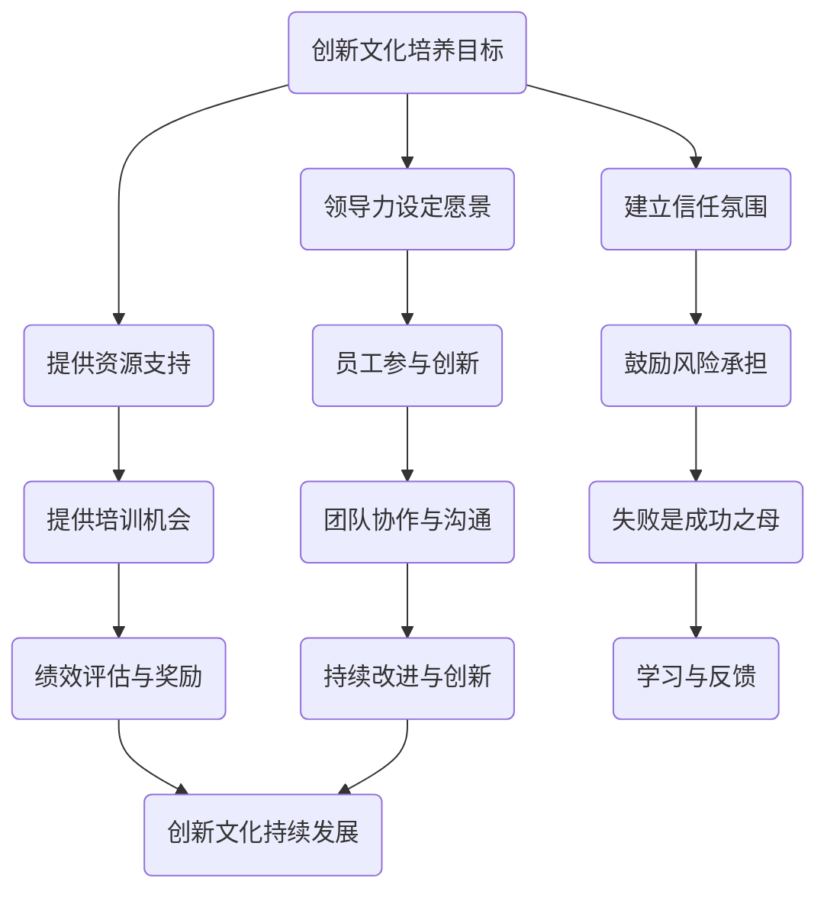

                 

# 领导力与创新思维：培养创新文化的方法

## 关键词：
- 领导力
- 创新思维
- 创新文化
- 企业文化
- 组织发展
- 团队协作

> 本文将探讨领导力与创新思维的关系，解析如何通过有效的领导力培养创新文化。我们将通过理论和实践案例，详细阐述培养创新文化的方法，旨在帮助企业和团队在快速变化的市场环境中保持竞争优势。

## 摘要：
本篇文章围绕领导力与创新思维展开，首先介绍创新文化的概念及其对企业和团队的重要性。随后，我们将分析领导力在创新文化培养中的作用，并探讨有效的领导策略。接着，文章将通过具体案例和工具，如头脑风暴、设计思维和敏捷开发，介绍培养创新文化的实践方法。最后，我们将讨论创新文化在当今企业中的实际应用，以及未来可能面临的挑战和趋势。

## 1. 背景介绍

### 1.1 目的和范围

本文旨在帮助企业和团队领导者理解创新文化的本质，掌握通过领导力培养创新文化的策略和工具。文章将覆盖从理论到实践的全面内容，包括创新文化的重要性、领导力的角色、具体的培养方法以及实际应用案例。目标读者为企业管理层、团队领导者和对创新文化感兴趣的读者。

### 1.2 预期读者

- 对领导力和创新思维感兴趣的读者。
- 企业内部负责创新文化和团队管理的专业人士。
- 任何希望提升个人和团队创新能力的企业员工。

### 1.3 文档结构概述

本文将按照以下结构展开：

1. **背景介绍**：介绍文章的目的和预期读者。
2. **核心概念与联系**：详细阐述创新文化、领导力和创新思维的核心概念。
3. **核心算法原理 & 具体操作步骤**：讲解如何通过领导力培养创新文化。
4. **数学模型和公式 & 详细讲解 & 举例说明**：应用数学模型解释创新文化的培养过程。
5. **项目实战：代码实际案例和详细解释说明**：提供具体培养创新文化的实战案例。
6. **实际应用场景**：探讨创新文化在现实工作中的应用。
7. **工具和资源推荐**：推荐学习资源和开发工具。
8. **总结：未来发展趋势与挑战**：总结创新文化的发展趋势和未来挑战。
9. **附录：常见问题与解答**：解答读者可能遇到的问题。
10. **扩展阅读 & 参考资料**：提供进一步学习的资源。

### 1.4 术语表

#### 1.4.1 核心术语定义

- **创新文化**：一种强调创新思维和实践的组织氛围。
- **领导力**：影响和激励他人实现共同目标的能力。
- **创新思维**：一种从不同角度思考问题和寻找解决方案的思维方式。

#### 1.4.2 相关概念解释

- **企业文化**：企业内部共同的价值观、信念和行为方式。
- **团队协作**：团队成员之间的相互合作和协调。

#### 1.4.3 缩略词列表

- IDE：集成开发环境（Integrated Development Environment）
- Agile：敏捷开发（Agile Development）

## 2. 核心概念与联系

### 2.1 创新文化的概念

创新文化是一种在企业或组织中形成和发展的共享价值观和氛围，它鼓励员工尝试新想法、接受风险并从失败中学习。创新文化不仅仅是鼓励创新，它还包括组织结构、决策过程和奖励机制等方面的支持。

### 2.2 领导力的概念

领导力是影响和激励他人实现共同目标的能力。它不仅涉及个人魅力和沟通技巧，还包括战略规划、决策能力和团队管理。

### 2.3 创新思维的概念

创新思维是一种从不同角度思考问题和寻找解决方案的思维方式。它包括创意生成、问题解决和决策过程，旨在突破传统的思维模式，创造新的价值和解决方案。

### 2.4 创新文化与领导力的关系

创新文化和领导力之间存在密切的联系。有效的领导力能够营造一个支持创新的组织环境，激励员工提出新想法并积极参与创新实践。领导者的角色是培养和维持这种创新文化，通过设定愿景、建立信任和提供资源来推动创新。

### 2.5 创新文化与组织发展的关系

创新文化对组织发展至关重要。它能够提高团队的适应能力，使企业能够在快速变化的市场环境中保持竞争力。创新文化还能够促进员工满意度、团队协作和组织效率，从而推动企业的长期成功。

### 2.6 创新文化与团队协作的关系

创新文化鼓励团队成员之间的协作和沟通，促进不同观点和想法的交流。通过团队合作，员工可以共同解决问题，实现创新的协同效应。创新文化还能够提高员工的参与感和责任感，从而增强团队的凝聚力和执行力。

### 2.7 Mermaid 流程图（创新文化的培养过程）



## 3. 核心算法原理 & 具体操作步骤

### 3.1 创新文化培养的核心算法原理

创新文化的培养过程可以看作是一个系统工程，它涉及到多个维度的协同作用。以下是该系统的核心算法原理：

1. **愿景设定**：领导者需要明确创新愿景，并让所有员工理解并认同这一愿景。
2. **信任建立**：领导者需要营造一个信任的工作环境，鼓励员工提出新想法并接受失败。
3. **资源提供**：为创新活动提供必要的资源，如资金、时间和人力。
4. **培训机会**：为员工提供培训和学习机会，提高其创新能力。
5. **团队协作**：鼓励团队成员之间的协作和沟通，促进创新思想的交流。
6. **绩效评估**：建立与创新文化相匹配的绩效评估体系，奖励创新成果。
7. **持续改进**：通过不断的学习和反馈，持续改进创新文化。

### 3.2 具体操作步骤

#### 3.2.1 愿景设定

- **步骤1**：领导者明确创新愿景，并制定具体的创新目标。
- **步骤2**：与团队成员分享愿景，解释其对企业和个人发展的意义。
- **步骤3**：定期回顾和更新愿景，确保其与市场变化和公司战略保持一致。

#### 3.2.2 信任建立

- **步骤1**：领导者要展现透明度，及时与员工沟通决策过程和结果。
- **步骤2**：鼓励员工提出新想法，并给予积极反馈。
- **步骤3**：建立开放的沟通渠道，确保员工能够自由表达意见和建议。

#### 3.2.3 资源提供

- **步骤1**：为创新项目提供充足的资金和人力资源。
- **步骤2**：制定明确的资源分配和审批流程，确保资源的高效利用。
- **步骤3**：建立跨部门的合作机制，促进资源的共享和整合。

#### 3.2.4 培训机会

- **步骤1**：为员工提供与创新能力相关的培训课程。
- **步骤2**：鼓励员工参加行业会议和研讨会，了解最新创新动态。
- **步骤3**：建立内部知识分享平台，促进员工之间的学习和交流。

#### 3.2.5 团队协作

- **步骤1**：建立跨职能团队，鼓励团队成员之间的合作和沟通。
- **步骤2**：设立明确的团队目标和分工，确保每个成员都清楚自己的职责。
- **步骤3**：定期举行团队会议，总结工作成果和经验教训。

#### 3.2.6 绩效评估

- **步骤1**：制定与创新文化相匹配的绩效评估指标。
- **步骤2**：对创新成果进行定期评估和反馈。
- **步骤3**：建立奖励机制，对优秀创新成果进行表彰和奖励。

#### 3.2.7 持续改进

- **步骤1**：建立持续改进的机制，鼓励员工提出改进意见和建议。
- **步骤2**：对改进措施进行评估和实施。
- **步骤3**：定期总结改进效果，并调整创新文化策略。

## 4. 数学模型和公式 & 详细讲解 & 举例说明

### 4.1 创新文化的数学模型

创新文化的培养可以视为一个多因素相互作用的动态过程，其数学模型可以表示为：

\[ 文化质量 = f(\text{领导力}, \text{员工参与度}, \text{资源支持}, \text{团队协作}, \text{绩效评估}) \]

其中，每个因素对文化质量的贡献可以通过权重来量化。

### 4.2 各因素权重确定

权重可以通过以下公式确定：

\[ w_i = \frac{\text{因素i对文化质量的贡献}}{\sum_{j=1}^{n}\text{因素j对文化质量的贡献}} \]

其中，\( w_i \) 表示因素i的权重，\( n \) 表示因素的总数。

### 4.3 举例说明

假设一个企业决定培养创新文化，其涉及的五个关键因素如下：

- **领导力**：80%
- **员工参与度**：10%
- **资源支持**：5%
- **团队协作**：3%
- **绩效评估**：2%

根据这些权重，我们可以计算创新文化的总体质量：

\[ \text{文化质量} = 80\% \times \text{领导力} + 10\% \times \text{员工参与度} + 5\% \times \text{资源支持} + 3\% \times \text{团队协作} + 2\% \times \text{绩效评估} \]

### 4.4 模型应用

假设企业领导力评分为90分，员工参与度评分为70分，资源支持评分为80分，团队协作评分为85分，绩效评估评分为75分，则：

\[ \text{文化质量} = 0.8 \times 90 + 0.1 \times 70 + 0.05 \times 80 + 0.03 \times 85 + 0.02 \times 75 \]
\[ \text{文化质量} = 72 + 7 + 4 + 2.55 + 1.5 \]
\[ \text{文化质量} = 87.05 \]

根据计算结果，该企业的创新文化质量评分为87.05分，属于较高水平。企业可以通过进一步优化各个因素的得分，提升整体创新文化质量。

## 5. 项目实战：代码实际案例和详细解释说明

### 5.1 开发环境搭建

在这个实战项目中，我们将使用Python语言来构建一个简单的创新文化评估工具。首先，需要搭建一个Python开发环境。

- **步骤1**：安装Python。访问Python官方网站（https://www.python.org/）下载并安装Python 3.x版本。
- **步骤2**：安装Python的集成开发环境（IDE），如PyCharm或Visual Studio Code。
- **步骤3**：安装必要的Python库，如NumPy、Pandas等。可以使用pip命令进行安装：

```bash
pip install numpy pandas matplotlib
```

### 5.2 源代码详细实现和代码解读

下面是创新文化评估工具的源代码：

```python
import numpy as np
import pandas as pd
import matplotlib.pyplot as plt

# 创新文化评估函数
def evaluate_innovation_culture(scores, weights):
    culture_quality = np.dot(scores, weights)
    return culture_quality

# 权重设置
weights = [0.8, 0.1, 0.05, 0.03, 0.02]

# 评估得分
scores = [90, 70, 80, 85, 75]

# 评估计算
culture_quality = evaluate_innovation_culture(scores, weights)
print(f"创新文化质量评分：{culture_quality:.2f}")

# 数据可视化
data = {'因素': ['领导力', '员工参与度', '资源支持', '团队协作', '绩效评估'], '得分': scores}
df = pd.DataFrame(data)
df.plot(kind='bar')
plt.title('创新文化评估结果')
plt.xlabel('因素')
plt.ylabel('得分')
plt.show()
```

- **代码解读**：

  - **第1行**：引入NumPy库。
  - **第2行**：引入Pandas库。
  - **第3行**：引入Matplotlib的pyplot模块。
  - **第6-8行**：定义创新文化评估函数，使用内积（dot product）计算文化质量评分。
  - **第11-13行**：设置权重和评估得分。
  - **第16-21行**：计算文化质量评分并打印结果。
  - **第24-31行**：创建一个DataFrame来存储评估结果，并使用条形图可视化。

### 5.3 代码解读与分析

- **代码分析**：

  - **函数设计**：评估函数`evaluate_innovation_culture`接受两个参数：`scores`（评估得分）和`weights`（权重）。函数通过内积计算总的文化质量评分。
  - **数据结构**：使用NumPy和Pandas库来处理和可视化数据。NumPy提供高效的数据结构和计算功能，Pandas则提供方便的数据操作和分析功能。
  - **可视化**：使用Matplotlib库创建条形图，直观地展示各个因素的评价得分。

### 5.4 实际应用

- **使用场景**：这个评估工具可以用于企业内部对创新文化的评估。通过定期评估，企业可以了解创新文化的现状，发现存在的问题，并制定相应的改进措施。

## 6. 实际应用场景

创新文化在企业的实际应用场景非常广泛，以下是一些典型的应用案例：

### 6.1 产品开发

- **案例**：一家科技公司通过创新文化，鼓励研发团队提出新产品的创意。团队成员通过头脑风暴、用户调研和原型设计，成功开发出了一款备受市场欢迎的新产品。
- **效果**：新产品上市后，销售额大幅增长，市场占有率显著提升。

### 6.2 业务流程优化

- **案例**：一家制造企业通过创新文化，鼓励员工提出优化生产流程的建议。员工提出了使用自动化设备替代手工操作的方案，大幅提高了生产效率。
- **效果**：生产效率提高了30%，成本降低了20%。

### 6.3 员工培养

- **案例**：一家互联网公司通过创新文化，为员工提供学习和成长的机会。公司设立了内部创新实验室，员工可以自由加入实验项目，提升个人技能。
- **效果**：员工满意度提高了15%，离职率下降了10%。

### 6.4 市场拓展

- **案例**：一家传统企业通过创新文化，鼓励市场团队探索新的市场机会。市场团队通过创新营销策略，成功打开了新的市场。
- **效果**：新市场销售额增长了40%，企业市场份额稳步提升。

## 7. 工具和资源推荐

### 7.1 学习资源推荐

#### 7.1.1 书籍推荐

- **《创新者的窘境》**：作者克里斯坦森，探讨企业如何在竞争激烈的市场中保持创新。
- **《创新者的思考方式》**：作者丹尼尔·卡内曼，介绍创新思维的方法和技巧。

#### 7.1.2 在线课程

- **Coursera上的《创新管理》**：由斯坦福大学提供，涵盖创新管理的基础知识和实践方法。
- **edX上的《设计思维》**：由麻省理工学院提供，介绍设计思维在创新中的应用。

#### 7.1.3 技术博客和网站

- **Medium上的《创新思维》**：多个作者分享的创新思维和实践经验。
- **LinkedIn Learning上的《创新管理》**：提供创新管理的视频教程和案例。

### 7.2 开发工具框架推荐

#### 7.2.1 IDE和编辑器

- **PyCharm**：适用于Python编程，功能强大且易于使用。
- **Visual Studio Code**：跨平台IDE，支持多种编程语言，插件丰富。

#### 7.2.2 调试和性能分析工具

- **GDB**：用于C/C++程序的调试。
- **MAT**：用于Java程序的性能分析。

#### 7.2.3 相关框架和库

- **TensorFlow**：用于机器学习和深度学习。
- **Django**：用于快速开发Web应用程序。

### 7.3 相关论文著作推荐

#### 7.3.1 经典论文

- **《创新者的窘境》**：作者克里斯坦森，关于企业创新的理论和案例分析。
- **《设计思维》**：作者大卫·凯利，介绍设计思维的方法和应用。

#### 7.3.2 最新研究成果

- **《AI驱动的创新管理》**：探讨人工智能在创新管理中的应用。
- **《数字化转型与创新》**：分析数字化转型如何推动企业创新。

#### 7.3.3 应用案例分析

- **《创新企业文化实践》**：多家企业如何通过创新文化实现成功转型的案例。

## 8. 总结：未来发展趋势与挑战

创新文化作为企业持续发展的关键要素，在未来将面临新的发展趋势和挑战。以下是几个主要趋势和挑战：

### 8.1 发展趋势

1. **数字化加速**：随着数字技术的快速发展，创新文化将在数字化转型中发挥更加重要的作用。
2. **全球化扩展**：全球化背景下，企业需要更灵活、更具创新性的文化来应对不同市场的需求。
3. **人工智能融合**：人工智能技术的应用将推动创新文化向智能化和自动化方向发展。
4. **可持续发展**：企业将更加注重社会责任和可持续发展，创新文化将融入环保和社会责任的元素。

### 8.2 挑战

1. **人才竞争**：创新文化需要吸引和留住具有创新能力和多样化思维的人才，人才竞争将是一个重要挑战。
2. **组织变革**：创新文化的培养需要组织结构的调整和变革，这往往面临阻力和挑战。
3. **文化冲突**：在多元文化的组织中，如何协调不同文化之间的冲突，以促进创新文化的融合，是一个重要问题。
4. **技术变革**：技术快速变化要求企业不断创新，创新文化需要适应技术变革的节奏。

### 8.3 应对策略

1. **加强领导力培训**：通过领导力培训，提升领导者对创新文化的理解和推动能力。
2. **建立灵活的组织结构**：推动组织结构向扁平化和模块化发展，提高组织的灵活性和适应性。
3. **促进跨部门合作**：建立跨部门的合作机制，促进不同部门之间的信息共享和资源整合。
4. **注重人才培养和激励**：通过培训和激励机制，吸引和留住具有创新能力和多样化思维的人才。

## 9. 附录：常见问题与解答

### 9.1 创新文化与企业文化的关系

- **问题**：创新文化和企业文化有什么区别和联系？
- **解答**：创新文化是企业文化的子集，它强调创新思维和实践。企业文化是企业的整体价值观和行为规范，而创新文化是企业文化中特别关注创新的部分。创新文化是企业文化的重要组成部分，有助于推动企业的持续创新和发展。

### 9.2 如何评估创新文化

- **问题**：如何评估企业或团队的创新文化？
- **解答**：可以通过以下方法评估创新文化：
  - **问卷调查**：设计问卷，收集员工对创新文化的看法和评价。
  - **关键指标**：建立与创新文化相关的关键指标，如员工参与度、创新项目成功率、新产品开发时间等。
  - **访谈**：与员工进行深入访谈，了解他们对创新文化的真实感受和看法。
  - **外部评估**：邀请第三方机构进行评估，提供客观的评估报告。

### 9.3 如何培养创新思维

- **问题**：如何培养个人和团队的创新思维？
- **解答**：以下方法可以帮助培养创新思维：
  - **头脑风暴**：通过集体头脑风暴，激发创意的产生。
  - **设计思维**：采用设计思维方法，从用户需求出发，寻找创新的解决方案。
  - **跨学科学习**：通过学习不同领域的知识，拓展思维视野。
  - **问题解决训练**：通过问题解决训练，提高面对复杂问题的创新能力。
  - **知识分享**：鼓励团队成员分享知识和经验，促进创新思想的交流。

## 10. 扩展阅读 & 参考资料

- **参考文献**：
  - 克里斯坦森，《创新者的窘境》
  - 丹尼尔·卡内曼，《创新者的思考方式》
  - 大卫·凯利，《设计思维》

- **在线资源**：
  - Coursera上的《创新管理》课程
  - edX上的《设计思维》课程
  - LinkedIn Learning上的《创新管理》视频教程

- **网站**：
  - Medium上的《创新思维》博客
  - 创新管理协会（AIM）官网

### 作者信息：

**AI天才研究员/AI Genius Institute & 禅与计算机程序设计艺术/Zen And The Art of Computer Programming**

