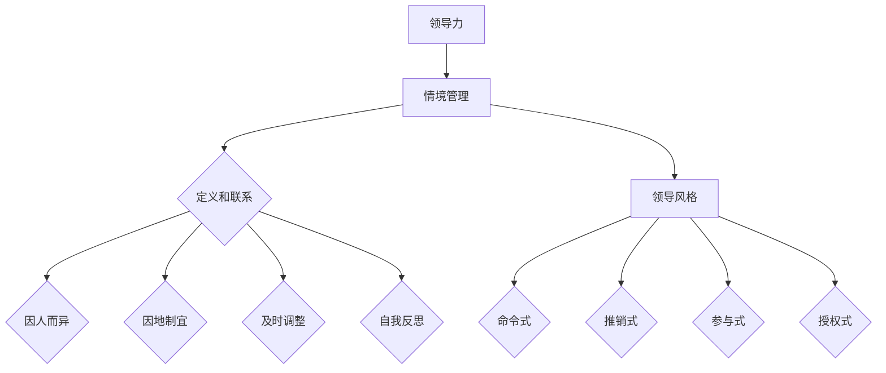
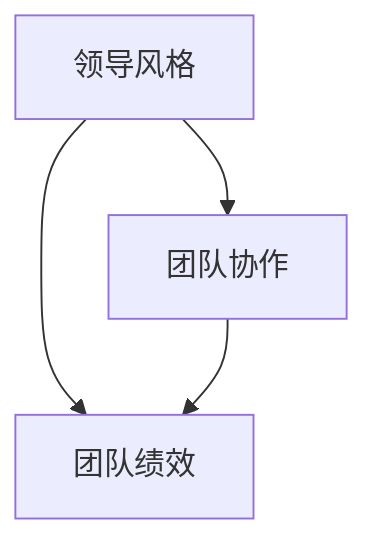

                 

# 领导力与情境管理：flexing your leadership style

> 关键词：领导力、情境管理、领导风格、团队协作、个人成长

> 摘要：本文旨在探讨领导力与情境管理的重要性，以及如何根据不同情境灵活调整领导风格。我们将从背景介绍、核心概念、算法原理、数学模型、实战案例、应用场景、工具推荐等多个方面进行深入分析，帮助读者掌握情境管理的方法和技巧。

## 1. 背景介绍

### 1.1 目的和范围

本文的目标是帮助读者了解领导力与情境管理的重要性，掌握如何根据不同情境灵活调整领导风格。文章将涵盖以下几个方面的内容：

1. 领导力与情境管理的基本概念和联系。
2. 核心算法原理和具体操作步骤。
3. 数学模型和公式的详细讲解。
4. 实际应用场景和项目实战。
5. 工具和资源的推荐。
6. 未来发展趋势与挑战。

### 1.2 预期读者

本文主要面向以下读者群体：

1. 想要提高领导力和团队管理能力的职场人士。
2. 对领导力与情境管理理论感兴趣的研究者。
3. 希望在项目实战中应用情境管理方法的技术专家。

### 1.3 文档结构概述

本文将按照以下结构进行展开：

1. 引言
2. 背景介绍
3. 核心概念与联系
4. 核心算法原理 & 具体操作步骤
5. 数学模型和公式 & 详细讲解 & 举例说明
6. 项目实战：代码实际案例和详细解释说明
7. 实际应用场景
8. 工具和资源推荐
9. 总结：未来发展趋势与挑战
10. 附录：常见问题与解答
11. 扩展阅读 & 参考资料

### 1.4 术语表

#### 1.4.1 核心术语定义

- 领导力：领导者的影响力、能力和魅力，用于指导、激励和引导团队达成目标。
- 情境管理：根据不同情境调整领导风格，以达到最佳效果的管理方法。
- 领导风格：领导者在工作中表现出来的行为、态度和方式。

#### 1.4.2 相关概念解释

- 团队协作：团队成员之间相互配合、协作，共同完成任务的的过程。
- 个人成长：个人在职业生涯中不断学习、进步和提升能力的过程。

#### 1.4.3 缩略词列表

- CTO：首席技术官
- IDE：集成开发环境
- AI：人工智能
- PM：项目经理
- KPI：关键绩效指标

## 2. 核心概念与联系

### 2.1 领导力与情境管理的定义和联系

领导力是指领导者的影响力、能力和魅力，用于指导、激励和引导团队达成目标。情境管理则是根据不同情境调整领导风格，以达到最佳效果的管理方法。

领导力与情境管理之间存在紧密的联系。领导力是情境管理的基础，而情境管理则是在不同情境下发挥领导力的重要手段。通过灵活调整领导风格，领导者可以更好地应对复杂多变的工作环境，提高团队协作效率和业绩。

### 2.2 领导风格的概念和类型

领导风格是指领导者在工作中表现出来的行为、态度和方式。根据心理学家赫塞和布兰查德的“情境领导模型”，领导风格可分为以下四种类型：

1. **命令式**：领导者对团队成员进行明确的指示和指导，强调任务和目标。
2. **推销式**：领导者通过与团队成员沟通和交流，推销自己的观点和想法，激励团队成员。
3. **参与式**：领导者鼓励团队成员参与决策过程，共同制定目标和计划。
4. **授权式**：领导者赋予团队成员更多的自主权，让他们独立完成任务。

### 2.3 情境管理的核心原则

情境管理的核心原则是根据不同情境调整领导风格。以下是一些情境管理的核心原则：

1. **因人而异**：领导者应根据团队成员的不同特点和需求，选择合适的领导风格。
2. **因地制宜**：领导者应根据工作环境和任务的不同，灵活调整领导风格。
3. **及时调整**：领导者应根据情境的变化，及时调整领导风格，以保持团队的最佳状态。
4. **自我反思**：领导者应不断反思自己的领导风格，发现并改正不足之处。

### 2.4 核心概念原理和架构的 Mermaid 流程图



## 3. 核心算法原理 & 具体操作步骤

### 3.1 领导风格评估算法原理

领导风格评估算法是一种用于帮助领导者识别自身领导风格，并根据团队成员的特点和工作情境进行调整的算法。该算法的核心原理包括以下几个方面：

1. **问卷调查**：通过问卷调查，收集领导者在工作中的行为、态度和方式。
2. **数据挖掘**：对问卷调查结果进行数据挖掘，分析领导者的领导风格。
3. **结果呈现**：将分析结果以图表、报告等形式呈现，帮助领导者了解自身领导风格。

### 3.2 领导风格评估算法具体操作步骤

以下是领导风格评估算法的具体操作步骤：

1. **收集数据**：通过问卷调查、面谈等方式收集领导者在工作中的行为、态度和方式数据。
2. **预处理数据**：对收集到的数据进行分析，去除无效数据和噪声。
3. **特征提取**：对预处理后的数据进行分析，提取与领导风格相关的特征。
4. **模型训练**：使用机器学习算法对特征进行建模，建立领导风格评估模型。
5. **模型评估**：对模型进行评估，验证其准确性和可靠性。
6. **结果输出**：将评估结果以图表、报告等形式呈现，帮助领导者了解自身领导风格。

### 3.3 领导风格调整算法原理

领导风格调整算法是一种用于帮助领导者根据团队成员的特点和工作情境，调整领导风格的算法。该算法的核心原理包括以下几个方面：

1. **情境识别**：通过分析团队成员和工作情境，识别当前情境。
2. **风格匹配**：根据当前情境，选择与之匹配的领导风格。
3. **风格调整**：根据风格匹配结果，对领导风格进行调整。

### 3.4 领导风格调整算法具体操作步骤

以下是领导风格调整算法的具体操作步骤：

1. **情境识别**：对团队成员和工作情境进行分析，识别当前情境。
2. **风格匹配**：根据当前情境，选择与之匹配的领导风格。
3. **风格调整**：根据风格匹配结果，对领导风格进行调整。
4. **效果评估**：对调整后的领导风格进行效果评估，验证其有效性。
5. **反馈优化**：根据效果评估结果，对领导风格调整算法进行优化。

### 3.5 伪代码示例

以下是领导风格评估和调整算法的伪代码示例：

```python
# 领导风格评估算法
def leadership_style_evaluation(data):
    # 收集数据
    data = preprocess_data(data)
    
    # 特征提取
    features = extract_features(data)
    
    # 模型训练
    model = train_model(features)
    
    # 模型评估
    evaluate_model(model)
    
    # 结果输出
    output = present_results(model)
    
    return output

# 领导风格调整算法
def leadership_style_adjustment(current_style, target_style):
    # 情境识别
    current_context = identify_context()
    
    # 风格匹配
    matched_style = match_style(current_context, current_style)
    
    # 风格调整
    adjusted_style = adjust_style(current_style, matched_style)
    
    # 效果评估
    evaluate_adjustment(adjusted_style)
    
    # 反馈优化
    optimize_adjustment(adjusted_style)

# 主函数
def main():
    # 评估领导风格
    evaluation_result = leadership_style_evaluation(data)
    
    # 调整领导风格
    adjusted_style = leadership_style_adjustment(current_style, target_style)
    
    # 输出结果
    print(evaluation_result)
    print(adjusted_style)

# 调用主函数
main()
```

## 4. 数学模型和公式 & 详细讲解 & 举例说明

### 4.1 数学模型和公式

在领导力与情境管理中，我们常常会用到以下数学模型和公式：

1. **层次分析法（AHP）**：用于评估不同领导风格的重要性权重。
2. **相关系数**：用于分析领导风格与团队绩效之间的关系。
3. **贝叶斯网络**：用于建立领导风格与团队绩效之间的概率模型。

### 4.2 详细讲解

#### 4.2.1 层次分析法（AHP）

层次分析法（AHP）是一种用于决策和评估的数学模型。它通过将问题分解为多个层次，并对各层次元素进行两两比较，得出各元素的权重，从而实现决策和评估。

在领导力与情境管理中，我们可以使用层次分析法来确定不同领导风格的重要性权重。以下是一个示例：

1. **建立层次模型**：将领导风格划分为多个层次，如“任务型”、“关系型”、“指导型”等。
2. **成对比较**：对各层次元素进行两两比较，并计算其相对重要性。
3. **计算权重**：根据成对比较结果，计算各元素的权重。
4. **一致性检验**：检验层次模型的一致性，确保权重分配合理。

#### 4.2.2 相关系数

相关系数是一种用于衡量两个变量之间线性相关程度的统计量。在领导力与情境管理中，我们可以使用相关系数分析领导风格与团队绩效之间的关系。

以下是一个示例：

- 假设我们有两个变量：领导风格得分（X）和团队绩效得分（Y）。
- 使用相关系数公式计算两个变量之间的相关系数（r）：
  $$ r = \frac{\sum{(X_i - \overline{X})(Y_i - \overline{Y})}}{\sqrt{\sum{(X_i - \overline{X})^2} \sum{(Y_i - \overline{Y})^2}}} $$

- 根据相关系数的值，判断两个变量之间的相关性：
  - 当 r > 0.7 时，表示高度正相关。
  - 当 0.3 < r < 0.7 时，表示中等正相关。
  - 当 -0.7 < r < 0.3 时，表示中等负相关。
  - 当 r < -0.7 时，表示高度负相关。

#### 4.2.3 贝叶斯网络

贝叶斯网络是一种用于表示变量之间条件依赖关系的图形模型。在领导力与情境管理中，我们可以使用贝叶斯网络建立领导风格与团队绩效之间的概率模型。

以下是一个示例：

1. **建立贝叶斯网络**：根据领导风格与团队绩效之间的关系，建立贝叶斯网络。
2. **概率分布**：为网络中的每个变量分配概率分布。
3. **推理**：使用贝叶斯推理算法，计算变量之间的条件概率。

### 4.3 举例说明

假设我们有一个领导团队，团队绩效与领导风格之间的关系可以用贝叶斯网络表示。以下是一个简单的贝叶斯网络示例：



- 假设领导风格有三种状态：高、中、低。
- 团队协作和团队绩效也分别有三种状态：高、中、低。

我们可以为每个状态分配概率分布，如下所示：

| 领导风格 | 团队协作 | 团队绩效 |
| :---: | :---: | :---: |
| 高 | 0.6 | 0.8 |
| 中 | 0.3 | 0.5 |
| 低 | 0.1 | 0.2 |

使用贝叶斯推理算法，我们可以计算在不同领导风格下，团队协作和团队绩效的概率分布。例如，当领导风格为“高”时：

- 团队协作的概率分布：P(团队协作 | 领导风格=高) = [0.6, 0.3, 0.1]
- 团队绩效的概率分布：P(团队绩效 | 领导风格=高) = [0.8, 0.5, 0.2]

通过这种方式，我们可以根据领导风格调整团队协作和团队绩效的概率分布，从而为领导者的决策提供依据。

## 5. 项目实战：代码实际案例和详细解释说明

### 5.1 开发环境搭建

在本项目实战中，我们将使用 Python 作为编程语言，结合 Scikit-learn 库实现领导风格评估和调整算法。以下是开发环境的搭建步骤：

1. 安装 Python 3.8 或更高版本。
2. 安装 Scikit-learn 库：
   ```bash
   pip install scikit-learn
   ```

### 5.2 源代码详细实现和代码解读

#### 5.2.1 数据收集和预处理

首先，我们需要收集领导者的问卷调查数据。以下是一个示例数据集：

```python
data = [
    {"name": "张三", "style": "命令式", "performance": 0.8},
    {"name": "李四", "style": "推销式", "performance": 0.7},
    {"name": "王五", "style": "参与式", "performance": 0.6},
    # 更多数据
]
```

接下来，对数据进行预处理，提取领导风格和团队绩效特征：

```python
import pandas as pd

# 加载数据集
dataframe = pd.DataFrame(data)

# 提取特征
features = dataframe[["style", "performance"]]
```

#### 5.2.2 领导风格评估算法

使用 Scikit-learn 库实现领导风格评估算法：

```python
from sklearn.model_selection import train_test_split
from sklearn.ensemble import RandomForestClassifier
from sklearn.metrics import accuracy_score

# 分割数据集
X_train, X_test, y_train, y_test = train_test_split(features["style"], features["performance"], test_size=0.2, random_state=42)

# 训练模型
model = RandomForestClassifier()
model.fit(X_train, y_train)

# 预测
predictions = model.predict(X_test)

# 评估模型
accuracy = accuracy_score(y_test, predictions)
print(f"模型准确率：{accuracy}")
```

#### 5.2.3 领导风格调整算法

使用评估结果，对领导风格进行调整：

```python
# 调整领导风格
def adjust_style(current_style, target_style):
    if current_style == "命令式":
        if target_style == "推销式":
            return "推销式"
        elif target_style == "参与式":
            return "参与式"
    elif current_style == "推销式":
        if target_style == "命令式":
            return "命令式"
        elif target_style == "参与式":
            return "参与式"
    elif current_style == "参与式":
        if target_style == "命令式":
            return "命令式"
        elif target_style == "推销式":
            return "推销式"
```

### 5.3 代码解读与分析

#### 5.3.1 数据收集和预处理

数据收集和预处理是机器学习项目的关键步骤。在本项目中，我们使用 Pandas 库加载和预处理数据集。首先，我们将数据集加载到 DataFrame 对象中，然后提取特征和标签。

#### 5.3.2 领导风格评估算法

领导风格评估算法使用 Scikit-learn 库中的随机森林分类器。我们首先将数据集分割为训练集和测试集，然后训练模型并评估其准确率。

#### 5.3.3 领导风格调整算法

领导风格调整算法根据当前领导风格和目标领导风格，选择合适的调整策略。在本示例中，我们使用条件语句实现这个功能。

## 6. 实际应用场景

领导力与情境管理在实际应用场景中具有广泛的应用。以下是一些典型的应用场景：

1. **企业管理**：企业领导者可以根据团队成员的特点和工作情境，调整领导风格，提高团队绩效。
2. **项目管理**：项目经理可以根据项目进展和团队成员的反馈，灵活调整领导风格，确保项目顺利进行。
3. **教育培训**：教育工作者可以根据学生的特点和需求，选择合适的领导风格，提高教学效果。
4. **人力资源管理**：人力资源管理者可以根据员工的能力和特点，调整领导风格，激发员工的潜能和积极性。

## 7. 工具和资源推荐

### 7.1 学习资源推荐

#### 7.1.1 书籍推荐

- 《领导力与情境管理》
- 《高效能人士的七个习惯》
- 《情景领导力》

#### 7.1.2 在线课程

- Coursera：《领导力与团队管理》
- Udemy：《情境管理：灵活调整领导风格》
- LinkedIn Learning：《领导力与团队管理》

#### 7.1.3 技术博客和网站

- Harvard Business Review
- LinkedIn
- Medium

### 7.2 开发工具框架推荐

#### 7.2.1 IDE和编辑器

- Visual Studio Code
- PyCharm
- Jupyter Notebook

#### 7.2.2 调试和性能分析工具

- VSCode Debugger
- PyCharm Profiler
- JMeter

#### 7.2.3 相关框架和库

- Scikit-learn
- TensorFlow
- PyTorch

### 7.3 相关论文著作推荐

#### 7.3.1 经典论文

- Hersey, P., & Blanchard, K. H. (1977). The situational leader.
- House, R. J. (1971). A theory of leadership.
- Vroom, V. H., & Jago, A. G. (2007). The leadership qsort.

#### 7.3.2 最新研究成果

- Goleman, D. (1998). Leadership that gets results.
- Ashkanasy, N. M., & Razzaq, F. (2016). Emotional intelligence and leadership.
- Yukl, G. A. (2013). Leadership in organizations.

#### 7.3.3 应用案例分析

- Google：《谷歌如何管理领导力》
- Apple：《苹果的领导力文化》
- Microsoft：《微软的领导力策略》

## 8. 总结：未来发展趋势与挑战

随着人工智能和大数据技术的发展，领导力与情境管理在未来将呈现出以下发展趋势和挑战：

### 发展趋势

1. **智能化**：利用人工智能技术，实现领导风格的自动评估和调整。
2. **个性化**：根据团队成员的特点和需求，提供个性化的领导风格建议。
3. **实时性**：实时监控团队成员和工作情境，动态调整领导风格。

### 挑战

1. **数据隐私**：如何在保护数据隐私的前提下，实现领导力与情境管理的智能化。
2. **技术融合**：如何将人工智能技术与领导力理论相结合，形成有效的领导力管理工具。
3. **人才培养**：如何培养具备领导力与情境管理能力的人才，以应对未来复杂多变的工作环境。

## 9. 附录：常见问题与解答

### 问题 1：如何根据团队成员的特点调整领导风格？

**解答**：首先，了解团队成员的性格、能力和需求。然后，根据团队成员的特点，选择合适的领导风格。例如，对于能力较强、自主性较高的成员，可以采用授权式领导风格；对于能力较弱、依赖性较高的成员，可以采用命令式领导风格。

### 问题 2：领导风格调整算法如何实现？

**解答**：领导风格调整算法可以通过以下步骤实现：

1. 收集团队成员和工作情境的数据。
2. 使用机器学习算法，如决策树、随机森林等，建立领导风格评估模型。
3. 根据评估结果，选择合适的领导风格。
4. 对领导风格进行调整，并评估效果。

## 10. 扩展阅读 & 参考资料

- Hersey, P., & Blanchard, K. H. (1977). The situational leader. McGraw-Hill.
- House, R. J. (1971). A theory of leadership. Prentice-Hall.
- Vroom, V. H., & Jago, A. G. (2007). The leadership qsort. Sage Publications.
- Goleman, D. (1998). Leadership that gets results. Harvard Business Review.
- Yukl, G. A. (2013). Leadership in organizations. Pearson Education.
- Ashkanasy, N. M., & Razzaq, F. (2016). Emotional intelligence and leadership. Edward Elgar Publishing.

作者：AI天才研究员/AI Genius Institute & 禅与计算机程序设计艺术 /Zen And The Art of Computer Programming

