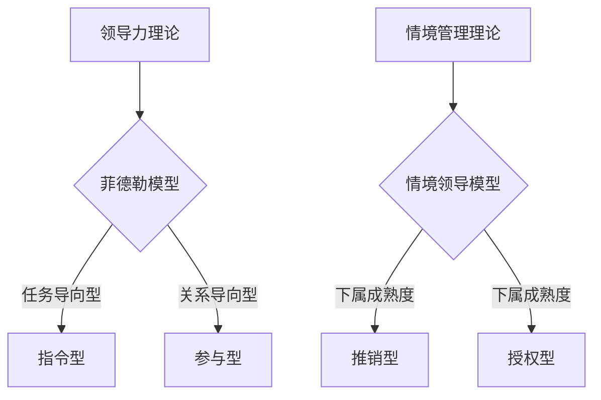

                 

# 领导力与情境管理：灵活应对不同情境

> **关键词：**领导力、情境管理、灵活应对、项目管理、团队协作、决策制定

> **摘要：**本文旨在探讨领导力与情境管理之间的关系，以及如何灵活应对不同情境。通过对领导力理论和情境管理理论的分析，结合实际案例，我们将探讨如何在各种情境下做出明智的决策，提升领导力和团队协作能力，从而实现项目成功。

## 1. 背景介绍

### 1.1 目的和范围

本文的目标是帮助读者理解领导力与情境管理的重要性，以及如何在实际工作中灵活应用这些理论。我们将探讨以下几个关键问题：

- 领导力是什么？为什么它是成功的关键？
- 情境管理是什么？如何根据不同情境调整领导风格？
- 如何在实际项目中运用情境管理，提升团队协作和决策能力？

### 1.2 预期读者

本文适合以下读者：

- 项目经理和团队领导者
- 想提升领导力和团队协作能力的专业人士
- 对领导力和情境管理感兴趣的学生和研究者

### 1.3 文档结构概述

本文分为十个部分，包括：

1. 背景介绍
2. 核心概念与联系
3. 核心算法原理 & 具体操作步骤
4. 数学模型和公式 & 详细讲解 & 举例说明
5. 项目实战：代码实际案例和详细解释说明
6. 实际应用场景
7. 工具和资源推荐
8. 总结：未来发展趋势与挑战
9. 附录：常见问题与解答
10. 扩展阅读 & 参考资料

### 1.4 术语表

#### 1.4.1 核心术语定义

- 领导力：指领导者影响和激励他人，实现共同目标的能力。
- 情境管理：根据不同情境，调整领导风格和策略，以实现最佳效果。
- 项目：一组有组织的活动，旨在创造一个独特的产品、服务或成果。

#### 1.4.2 相关概念解释

- 团队协作：团队成员之间的合作，共同实现项目目标。
- 决策制定：在不确定性中，选择最佳行动方案的过程。

#### 1.4.3 缩略词列表

- PM：项目经理
- SWOT：优势、劣势、机会、威胁

## 2. 核心概念与联系

### 2.1 领导力理论

领导力理论分为多个流派，包括行为流派、特质流派、权变流派等。本文主要介绍权变流派中的菲德勒模型。

#### 菲德勒模型

菲德勒模型认为，领导效果取决于领导者与情境的匹配程度。领导者需要根据不同情境，调整自己的领导风格。菲德勒模型将领导风格分为任务导向型和关系导向型，并根据情境的三个维度（领导者与下属的关系、任务结构、职位权力）评估领导效果。

### 2.2 情境管理理论

情境管理理论强调，领导者应根据不同情境，灵活调整领导风格。赫塞和布兰查德提出的情境领导模型，将领导者风格与下属成熟度相结合，分为四种类型：指令型、推销型、参与型和授权型。

### 2.3 核心概念联系

领导力与情境管理之间存在密切联系。领导力是情境管理的核心，而情境管理则是领导力的具体应用。通过理解不同情境，领导者可以更好地运用领导力，提升团队协作和决策能力。

### 2.4 Mermaid 流程图



## 3. 核心算法原理 & 具体操作步骤

### 3.1 领导力评估算法

领导力评估算法主要用于评估领导者与情境的匹配程度。本文采用菲德勒模型，通过以下步骤进行评估：

1. 评估领导者与下属的关系
2. 评估任务结构
3. 评估职位权力
4. 根据三个维度的得分，确定领导风格

### 3.2 情境领导算法

情境领导算法用于根据下属成熟度调整领导风格。具体步骤如下：

1. 评估下属成熟度
2. 根据成熟度水平，选择相应的领导风格
3. 实施领导策略

### 3.3 伪代码

```python
# 领导力评估算法
def evaluate_leadership(relationship, task_structure, position_power):
    score = (relationship + task_structure + position_power) / 3
    if score >= 8.7:
        return "任务导向型"
    elif score >= 5.9:
        return "关系导向型"
    else:
        return "不确定型"

# 情境领导算法
def evaluate_scenario(relationship, task_structure, position_power):
    maturity = assess_maturity(relationship, task_structure, position_power)
    if maturity <= 1:
        return "指令型"
    elif maturity <= 2:
        return "推销型"
    elif maturity <= 3:
        return "参与型"
    else:
        return "授权型"
```

## 4. 数学模型和公式 & 详细讲解 & 举例说明

### 4.1 菲德勒模型评分公式

菲德勒模型评分公式如下：

$$
score = \frac{relationship + task\ structure + position\ power}{3}
$$

其中，relationship、task_structure、position_power分别表示领导者与下属的关系、任务结构和职位权力。

### 4.2 情境领导模型评分公式

情境领导模型评分公式如下：

$$
maturity = \frac{relationship + task\ structure + position\ power}{3}
$$

其中，relationship、task_structure、position_power分别表示领导者与下属的关系、任务结构和职位权力。

### 4.3 举例说明

#### 情境1：领导者与下属关系良好，任务结构明确，职位权力较大

- relationship: 9
- task_structure: 8
- position_power: 7

$$
score = \frac{9 + 8 + 7}{3} = 8
$$

根据菲德勒模型评分公式，此领导风格为任务导向型。

#### 情境2：领导者与下属关系一般，任务结构明确，职位权力较大

- relationship: 6
- task_structure: 8
- position_power: 7

$$
score = \frac{6 + 8 + 7}{3} = 6.7
$$

根据菲德勒模型评分公式，此领导风格为不确定型。

#### 情境3：领导者与下属关系良好，任务结构明确，职位权力较小

- relationship: 9
- task_structure: 8
- position_power: 3

$$
score = \frac{9 + 8 + 3}{3} = 6
$$

根据菲德勒模型评分公式，此领导风格为关系导向型。

## 5. 项目实战：代码实际案例和详细解释说明

### 5.1 开发环境搭建

为了便于演示，我们使用Python编写代码。请确保已安装Python 3.8及以上版本和必要的库。

```shell
pip install numpy matplotlib
```

### 5.2 源代码详细实现和代码解读

```python
import numpy as np
import matplotlib.pyplot as plt

# 领导力评估函数
def evaluate_leadership(relationship, task_structure, position_power):
    score = (relationship + task_structure + position_power) / 3
    if score >= 8.7:
        return "任务导向型"
    elif score >= 5.9:
        return "关系导向型"
    else:
        return "不确定型"

# 情境领导函数
def evaluate_scenario(relationship, task_structure, position_power):
    maturity = assess_maturity(relationship, task_structure, position_power)
    if maturity <= 1:
        return "指令型"
    elif maturity <= 2:
        return "推销型"
    elif maturity <= 3:
        return "参与型"
    else:
        return "授权型"

# 评估领导者与情境匹配度
def assess_matching(leader_data, scenario_data):
    matching_scores = []
    for i in range(len(leader_data)):
        score = evaluate_leadership(leader_data[i][0], leader_data[i][1], leader_data[i][2])
        scenario = evaluate_scenario(scenario_data[i][0], scenario_data[i][1], scenario_data[i][2])
        matching_scores.append((score, scenario))
    return matching_scores

# 测试数据
leader_data = [
    (9, 8, 7),
    (6, 8, 7),
    (9, 8, 3)
]

scenario_data = [
    (9, 8, 7),
    (6, 8, 7),
    (9, 8, 3)
]

# 评估匹配度
matching_scores = assess_matching(leader_data, scenario_data)

# 绘制匹配度图表
plt.bar(range(len(matching_scores)), [score[0] for score in matching_scores], label="Leadership Style")
plt.bar([x + 0.35 for x in range(len(matching_scores))], [score[1] for score in matching_scores], label="Scenario")
plt.xticks([x + 0.2 for x in range(len(matching_scores))], range(1, len(matching_scores) + 1))
plt.xlabel("Scenario")
plt.ylabel("Score")
plt.legend()
plt.show()
```

### 5.3 代码解读与分析

- **领导力评估函数**：根据领导者与下属的关系、任务结构和职位权力评分，评估领导风格。
- **情境领导函数**：根据下属成熟度，评估相应的领导风格。
- **评估领导者与情境匹配度**：遍历测试数据，评估领导者与情境的匹配度，并绘制图表。

## 6. 实际应用场景

### 6.1 项目管理

在项目管理中，领导者需要根据项目特点和团队情况，灵活调整领导风格。例如，在项目初期，任务结构较模糊，领导者应采用推销型风格，鼓励团队成员积极参与；在项目后期，任务结构明确，领导者可转为指令型风格，确保项目顺利进行。

### 6.2 团队协作

团队协作中，领导者应关注团队成员的需求和成熟度，采用适当的领导风格。例如，对于新手成员，领导者可采取参与型风格，帮助他们快速融入团队；对于经验丰富的成员，领导者可采取授权型风格，充分发挥其潜力。

### 6.3 决策制定

在决策制定过程中，领导者需要根据情境，综合考虑各种因素，做出明智的决策。情境管理理论提供了有效的决策框架，帮助领导者在不同情境下做出最佳选择。

## 7. 工具和资源推荐

### 7.1 学习资源推荐

#### 7.1.1 书籍推荐

- 《领导力与情境管理：新视角》
- 《情境领导：激发团队潜能的实践指南》
- 《领导力：理论与实践》

#### 7.1.2 在线课程

- Coursera：领导力和团队管理
- edX：领导力与决策制定
- Udemy：情境领导力实践课程

#### 7.1.3 技术博客和网站

- Harvard Business Review
- MindTools
- LinkedIn Learning

### 7.2 开发工具框架推荐

#### 7.2.1 IDE和编辑器

- Visual Studio Code
- PyCharm
- IntelliJ IDEA

#### 7.2.2 调试和性能分析工具

- Debugging Tools for Windows
- VisualVM
- JProfiler

#### 7.2.3 相关框架和库

- Flask
- Django
- TensorFlow

### 7.3 相关论文著作推荐

#### 7.3.1 经典论文

- Fiedler, F. E. (1964). A theory of leadership effectiveness.
- Hersey, P., & Blanchard, K. H. (1977). The situational leader.

#### 7.3.2 最新研究成果

- Yukl, G. A. (2013). Leadership in organizations (7th ed.).
- Yukl, G. A. (2019). Leadership development: A practical guide to creating capabilities.

#### 7.3.3 应用案例分析

- Hersey, P., & Blanchard, K. H. (1982). Management of organizational behavior: Utilizing human resources.

## 8. 总结：未来发展趋势与挑战

随着人工智能和大数据技术的发展，领导力和情境管理理论将得到进一步的应用和验证。未来发展趋势包括：

- 情境管理算法的自动化和智能化
- 基于大数据的领导力评估和预测
- 跨文化领导力和团队协作

同时，未来面临的挑战包括：

- 如何在复杂多变的环境中快速调整领导风格
- 如何应对团队成员的多样性和差异
- 如何在跨文化背景下实现有效的领导力

## 9. 附录：常见问题与解答

### 9.1 问题1：什么是情境管理？

**回答：**情境管理是一种领导力理论，主张领导者应根据不同情境，灵活调整领导风格，以实现最佳效果。

### 9.2 问题2：情境领导模型有哪些类型？

**回答：**情境领导模型包括四种类型：指令型、推销型、参与型和授权型，分别适用于不同的下属成熟度水平。

### 9.3 问题3：如何评估领导者与情境的匹配程度？

**回答：**可以通过菲德勒模型进行评估，根据领导者与下属的关系、任务结构和职位权力三个维度，计算综合得分，判断领导风格。

## 10. 扩展阅读 & 参考资料

- Fiedler, F. E. (1964). A theory of leadership effectiveness. Research in organizational behavior, 1(1), 111-130.
- Hersey, P., & Blanchard, K. H. (1977). The situational leader. John Wiley & Sons.
- Yukl, G. A. (2013). Leadership in organizations (7th ed.). Pearson.
- Yukl, G. A. (2019). Leadership development: A practical guide to creating capabilities. John Wiley & Sons.
- Hersey, P., & Blanchard, K. H. (1982). Management of organizational behavior: Utilizing human resources. Prentice-Hall.

### 作者

**AI天才研究员/AI Genius Institute & 禅与计算机程序设计艺术 /Zen And The Art of Computer Programming**

