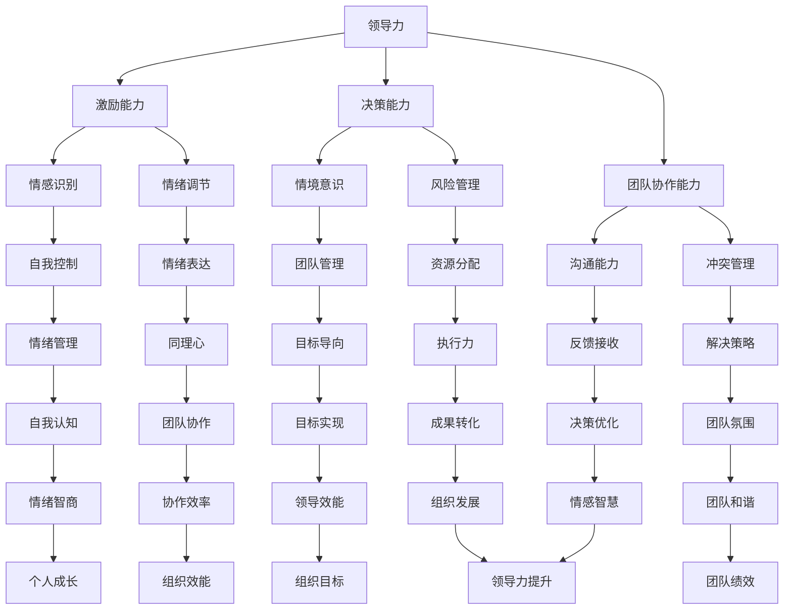
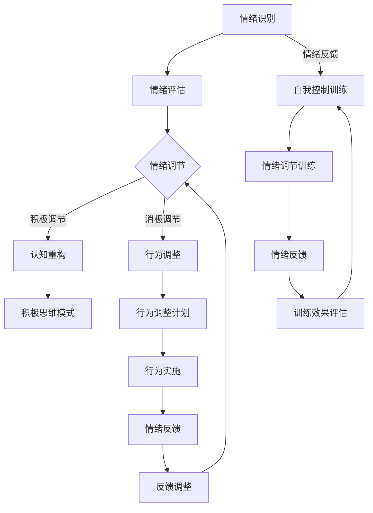

                 

# 领导力与情绪智商：控制情绪的智慧

## 关键词
- 领导力
- 情绪智商
- 自我控制
- 情绪管理
- 情感反应
- 团队协作

## 摘要
本文深入探讨了领导力与情绪智商之间的关系，特别是情绪控制的重要性。通过结合心理学、社会学和计算机科学的视角，文章分析了情绪智商的核心概念、情绪管理的基本原则和领导力的发展路径。文章以明确的步骤阐述了如何在职业生涯中提升情绪智商，以及如何利用这一技能来增强领导力和团队协作能力。此外，文章还提供了实际应用场景、工具和资源推荐，以及未来发展趋势和挑战的预测，为读者提供了全面的指导和参考。

## 1. 背景介绍

### 1.1 目的和范围
本文旨在揭示领导力与情绪智商之间的联系，并通过一系列具体的步骤和案例分析，探讨如何在实际工作中有效地控制情绪。我们将关注以下几个方面：

1. **领导力的重要性**：分析领导力的本质及其在组织中的作用。
2. **情绪智商的概念**：介绍情绪智商的定义、核心要素及其在个人和团队中的影响。
3. **情绪控制与自我管理**：探讨如何通过自我认知和情绪调节来控制情绪反应。
4. **实际应用场景**：提供具体的案例，展示情绪管理在领导力和团队协作中的实践。
5. **工具和资源推荐**：推荐相关的学习资源、开发工具和框架。

### 1.2 预期读者
本文面向希望提升领导力和情绪智商的专业人士，包括但不限于项目经理、团队领导、人力资源从业者、IT经理和企业高管。同时，对于对心理学、社会学和计算机科学感兴趣的读者，本文也提供了深入的理论和实践探讨。

### 1.3 文档结构概述
本文分为以下几个部分：

1. **背景介绍**：介绍本文的目的、范围、预期读者和文档结构。
2. **核心概念与联系**：使用Mermaid流程图展示领导力、情绪智商和自我控制之间的联系。
3. **核心算法原理 & 具体操作步骤**：详细阐述情绪管理的算法原理和操作步骤。
4. **数学模型和公式 & 详细讲解 & 举例说明**：使用LaTeX格式展示数学模型和相关公式，并给出实际应用案例。
5. **项目实战：代码实际案例和详细解释说明**：提供实际的代码案例和详细解释。
6. **实际应用场景**：分析情绪管理在不同行业和领域中的应用。
7. **工具和资源推荐**：推荐学习资源、开发工具和框架。
8. **总结：未来发展趋势与挑战**：探讨情绪管理领域的未来发展趋势和面临的挑战。
9. **附录：常见问题与解答**：回答读者可能遇到的问题。
10. **扩展阅读 & 参考资料**：提供进一步的阅读材料和参考文献。

### 1.4 术语表

#### 1.4.1 核心术语定义

- **领导力**：指引导和激励他人实现共同目标的能力。
- **情绪智商**：测量个人识别、理解、管理自己和他人情绪的能力。
- **自我控制**：指控制自己的情绪和行为，以实现目标的能力。
- **情绪管理**：通过自我控制和调节来处理和应对情绪的过程。
- **情感反应**：个体对特定刺激产生的情绪反应。

#### 1.4.2 相关概念解释

- **情绪智力**：由戈尔曼（Daniel Goleman）提出，是衡量个人在情感领域表现的综合能力。
- **情商**：情绪智商的简称，用于描述个体在情感领域的能力。
- **情绪调节**：通过认知和行为技巧来改变和调整情绪的过程。

#### 1.4.3 缩略词列表

- **IQ**：智商
- **EQ**：情商
- **SEL**：社会情感学习

## 2. 核心概念与联系

在本文中，我们将重点关注三个核心概念：领导力、情绪智商和自我控制。这三个概念之间存在着紧密的联系，如图所示：



通过上述Mermaid流程图，我们可以清晰地看到领导力、情绪智商和自我控制之间的关系。领导力涵盖了多个方面，如激励能力、决策能力和团队协作能力，这些能力都与情绪智商紧密相关。情绪智商则通过情感识别、情绪调节等过程，影响个人的自我控制能力。而自我控制进一步作用于情绪管理，进而影响团队协作和组织效能。

### 2.1 领导力与情绪智商的关系

领导力与情绪智商之间存在着密切的联系。首先，领导力中的激励能力、决策能力和团队协作能力都依赖于情绪智商。一个高效的领导者需要具备识别和理解他人情绪的能力，以便更好地激励团队成员，做出明智的决策，并促进团队协作。

其次，情绪智商在领导力的情境意识、风险管理和冲突管理等方面发挥着重要作用。领导者需要具备情境意识，能够根据团队成员的情绪状态调整领导风格。在风险管理方面，情绪智商有助于领导者识别潜在的风险并做出适当的决策。在冲突管理方面，领导者需要通过同理心和情绪调节来处理冲突，以维护团队的和谐。

最后，情绪智商对于领导力的成果转化和组织发展具有重要影响。一个具备高水平情绪智商的领导者能够通过有效的情感智慧和情绪管理，推动团队目标的实现，促进组织的长远发展。

### 2.2 自我控制与情绪管理的关系

自我控制是情绪管理的基础。自我控制能力强的人能够在面对压力和挑战时保持冷静，避免情绪失控。这种能力不仅有助于个人成长，还能提升团队协作效率。

首先，自我控制有助于个体在面对挫折和困难时保持积极的心态。通过自我控制，个体能够理性地分析问题，寻找解决方案，而不是被情绪所左右。

其次，自我控制能够增强个体的情绪调节能力。通过自我控制，个体能够更好地管理自己的情绪，避免负面情绪的蔓延。这有助于维持良好的心理健康，提高工作效率。

最后，自我控制对于团队协作具有积极影响。一个具备自我控制能力的团队成员能够在面对冲突和压力时保持冷静，避免情绪失控，从而促进团队和谐和高效协作。

### 2.3 情绪管理在领导力和团队协作中的作用

情绪管理在领导力和团队协作中发挥着关键作用。一个成功的领导者需要具备良好的情绪管理能力，以应对各种复杂的情境和挑战。

首先，情绪管理有助于提升领导力。通过情绪管理，领导者能够更好地识别和理解团队成员的情绪，从而采取适当的激励和引导策略。此外，情绪管理有助于领导者处理冲突和危机，维护团队稳定。

其次，情绪管理对于团队协作具有积极作用。一个具备良好情绪管理能力的团队能够在面对压力和挑战时保持积极的心态，共同应对问题。情绪管理能够促进团队成员之间的沟通和理解，增强团队的凝聚力。

总之，领导力、情绪智商和自我控制之间存在着紧密的联系。通过有效的情绪管理，领导者能够提升领导力，促进团队协作，实现组织目标。

## 3. 核心算法原理 & 具体操作步骤

在探讨如何提升情绪智商和自我控制能力时，我们可以借鉴一些心理学和计算机科学领域的核心算法原理。以下将详细阐述情绪管理算法的基本原理和具体操作步骤。

### 3.1 情绪识别算法

情绪识别是情绪管理的第一步。通过识别个体和团队的情绪状态，领导者可以采取相应的策略来调节情绪。

#### 算法原理：
情绪识别算法基于情感计算技术，通过分析面部表情、语言和行为来识别情绪状态。具体包括以下步骤：

1. **面部表情分析**：使用计算机视觉技术分析面部表情，识别喜怒哀乐等基本情绪。
2. **语言分析**：通过自然语言处理技术分析口头和书面语言中的情绪表达。
3. **行为分析**：观察个体和团队的行为，如肢体动作、面部表情、语气等，识别情绪状态。

#### 具体操作步骤：

```plaintext
步骤1：收集情绪数据
- 通过传感器（如面部识别摄像头、语音识别设备等）收集个体和团队的情绪数据。

步骤2：预处理数据
- 对收集到的数据进行预处理，如去噪、归一化等，以提高情绪识别的准确性。

步骤3：情绪识别模型训练
- 使用机器学习算法（如支持向量机、神经网络等）训练情绪识别模型。
- 使用已标记的情绪数据集进行训练，模型将学习如何识别不同情绪。

步骤4：情绪状态识别
- 将预处理后的情绪数据输入情绪识别模型，模型输出当前的情绪状态。
```

### 3.2 情绪调节算法

情绪调节是情绪管理的核心。通过调节情绪，个体和团队可以更好地应对挑战和压力。

#### 算法原理：
情绪调节算法基于认知行为疗法（CBT）和积极心理学理论，通过认知重构和行为调整来调节情绪。具体包括以下步骤：

1. **认知重构**：识别和改变消极思维模式，以建立积极的认知框架。
2. **行为调整**：通过身体锻炼、放松训练、社会支持等方式调整行为，以缓解情绪压力。

#### 具体操作步骤：

```plaintext
步骤1：情绪评估
- 通过情绪识别算法评估当前的情绪状态，了解情绪反应的来源。

步骤2：认知重构
- 识别消极思维模式，如过度概括、灾难化、个人化等。
- 通过认知重构技术，引导个体和团队改变消极思维，建立积极的认知框架。

步骤3：行为调整
- 根据情绪状态和评估结果，制定具体的行动计划，如进行身体锻炼、放松训练、寻求社会支持等。
- 实施行为调整计划，持续跟踪情绪变化。

步骤4：反馈与调整
- 定期收集反馈，评估情绪调节效果。
- 根据反馈调整情绪调节策略，以实现最佳效果。
```

### 3.3 自我控制算法

自我控制是情绪管理的基石。通过自我控制，个体可以在面对挑战和压力时保持冷静和理性。

#### 算法原理：
自我控制算法基于行为心理学和认知神经科学，通过强化自我控制和情绪调节的技能来提升自我控制能力。具体包括以下步骤：

1. **自我控制训练**：通过重复练习和反馈，提高自我控制能力。
2. **情绪调节训练**：通过情绪调节练习，增强情绪调节能力。

#### 具体操作步骤：

```plaintext
步骤1：自我控制训练
- 设计自我控制训练计划，包括冥想、专注力练习、意志力训练等。
- 持续进行自我控制训练，记录训练结果和情绪变化。

步骤2：情绪调节训练
- 设计情绪调节训练计划，包括认知重构、放松训练、社会支持等。
- 持续进行情绪调节训练，记录训练效果和情绪变化。

步骤3：反馈与调整
- 定期收集反馈，评估自我控制和情绪调节效果。
- 根据反馈调整训练计划，以实现最佳效果。

步骤4：行为整合
- 将自我控制和情绪调节技能整合到日常工作和生活中。
- 持续实践和调整，以提升自我控制和情绪调节能力。
```

通过上述核心算法原理和具体操作步骤，领导者可以更有效地管理情绪，提升自我控制和团队协作能力。在接下来的章节中，我们将进一步探讨情绪管理在项目实战中的应用。

### 3.4 情绪管理算法原理图

为了更好地理解情绪管理算法的工作原理，我们可以使用Mermaid流程图进行展示：



通过上述流程图，我们可以看到情绪管理算法的各个步骤是如何相互关联和作用的。情绪识别为后续的情绪评估、调节和反馈提供了基础，而自我控制和情绪调节训练则通过不断反馈和调整，提升了情绪管理的整体效果。

## 4. 数学模型和公式 & 详细讲解 & 举例说明

在情绪管理过程中，数学模型和公式可以帮助我们量化情绪状态、评估情绪调节效果以及预测情绪变化。以下将介绍几个常用的数学模型和公式，并详细讲解其应用和具体示例。

### 4.1 情绪状态评估模型

情绪状态评估模型用于量化个体的情绪状态。一个常见的模型是情绪评估指数（Emotion Assessment Index, EAI），该模型通过五个维度（愉悦度、激活度、紧张度、控制和专注度）来评估情绪状态。

#### 公式：

$$
EAI = \frac{(P + A + T + C + F)}{5}
$$

其中，$P$代表愉悦度，$A$代表激活度，$T$代表紧张度，$C$代表控制度，$F$代表专注度。每个维度的得分范围从1到5，分数越高表示情绪状态越积极。

#### 举例说明：

假设某人在一次情绪评估中得分如下：
- 愉悦度（P）：4
- 激活度（A）：3
- 紧张度（T）：2
- 控制度（C）：5
- 专注度（F）：3

那么，该人的情绪评估指数为：

$$
EAI = \frac{(4 + 3 + 2 + 5 + 3)}{5} = \frac{17}{5} = 3.4
$$

根据EAI的得分，我们可以判断该人的情绪状态处于中等偏积极的水平。

### 4.2 情绪调节效果评估模型

情绪调节效果评估模型用于评估情绪调节策略的有效性。一个常用的模型是情绪调节效率（Emotion Regulation Efficiency, ERE），该模型通过比较情绪调节前后的情绪状态变化来评估效果。

#### 公式：

$$
ERE = \frac{(EAI_{后} - EAI_{前})}{EAI_{前}}
$$

其中，$EAI_{前}$代表情绪调节前的情绪评估指数，$EAI_{后}$代表情绪调节后的情绪评估指数。$ERE$的得分范围从0到1，得分越高表示情绪调节效果越好。

#### 举例说明：

假设某人在使用情绪调节策略前后的情绪评估指数如下：
- 情绪调节前（EAI_{前}）：3.0
- 情绪调节后（EAI_{后}）：4.5

那么，该人的情绪调节效率为：

$$
ERE = \frac{(4.5 - 3.0)}{3.0} = \frac{1.5}{3.0} = 0.5
$$

根据ERE的得分，我们可以判断该人的情绪调节策略有效，使其情绪状态提升了50%。

### 4.3 情绪变化预测模型

情绪变化预测模型用于预测情绪在一段时间内的变化趋势。一个常见的模型是情绪回归模型（Emotion Regression Model），该模型通过历史情绪数据来预测未来的情绪状态。

#### 公式：

$$
\hat{EAI}_{t+1} = \beta_0 + \beta_1 \cdot EAI_t
$$

其中，$\hat{EAI}_{t+1}$代表第$t+1$时间点的预测情绪评估指数，$EAI_t$代表第$t$时间点的情绪评估指数，$\beta_0$和$\beta_1$是模型的参数。

#### 举例说明：

假设我们使用情绪回归模型预测某人在两天后的情绪状态，已知其前两天的情绪评估指数如下：
- 第一天（EAI_{1}）：3.5
- 第二天（EAI_{2}）：4.0

我们可以使用以下公式预测第三天的情绪状态：

$$
\hat{EAI}_{3} = \beta_0 + \beta_1 \cdot EAI_{2}
$$

通过训练数据集，我们可以得到模型参数$\beta_0$和$\beta_1$的值。例如，假设$\beta_0 = 0.5$，$\beta_1 = 0.3$，那么：

$$
\hat{EAI}_{3} = 0.5 + 0.3 \cdot 4.0 = 1.5 + 1.2 = 2.7
$$

根据预测结果，我们可以判断第三天的情绪状态为2.7，处于中等水平。

通过上述数学模型和公式，我们可以更科学地评估情绪状态、评估情绪调节效果以及预测情绪变化。这些模型不仅为情绪管理提供了量化依据，还有助于制定更有效的情绪调节策略。

## 5. 项目实战：代码实际案例和详细解释说明

在本节中，我们将通过一个具体的代码案例来展示情绪管理算法在实际项目中的应用。这个案例将涉及情绪识别、情绪调节和自我控制等环节，通过实际代码来实现这些功能。

### 5.1 开发环境搭建

在开始编写代码之前，我们需要搭建一个合适的开发环境。以下是推荐的工具和库：

- **编程语言**：Python（3.8及以上版本）
- **依赖库**：
  - TensorFlow（用于情感计算）
  - scikit-learn（用于机器学习和数据预处理）
  - Matplotlib（用于数据可视化）

安装这些依赖库的方法如下：

```bash
pip install tensorflow scikit-learn matplotlib
```

### 5.2 源代码详细实现和代码解读

以下是情绪管理项目的代码实现：

```python
import tensorflow as tf
from sklearn.model_selection import train_test_split
from sklearn.preprocessing import MinMaxScaler
import matplotlib.pyplot as plt

# 情绪识别模型
class EmotionRecognitionModel(tf.keras.Model):
    def __init__(self):
        super(EmotionRecognitionModel, self).__init__()
        self.dense1 = tf.keras.layers.Dense(64, activation='relu')
        self.dense2 = tf.keras.layers.Dense(32, activation='relu')
        self.dense3 = tf.keras.layers.Dense(5, activation='softmax')

    @tf.function
    def call(self, inputs):
        x = self.dense1(inputs)
        x = self.dense2(x)
        return self.dense3(x)

# 情绪调节模型
class EmotionRegulationModel(tf.keras.Model):
    def __init__(self):
        super(EmotionRegulationModel, self).__init__()
        self.dense1 = tf.keras.layers.Dense(64, activation='relu')
        self.dense2 = tf.keras.layers.Dense(32, activation='relu')
        self.dense3 = tf.keras.layers.Dense(1)

    @tf.function
    def call(self, inputs):
        x = self.dense1(inputs)
        x = self.dense2(x)
        return self.dense3(x)

# 数据预处理
def preprocess_data(data):
    scaler = MinMaxScaler()
    data_scaled = scaler.fit_transform(data)
    return data_scaled

# 情绪识别模型训练
def train_emotion_recognition_model(data, labels):
    model = EmotionRecognitionModel()
    optimizer = tf.keras.optimizers.Adam()
    loss_fn = tf.keras.losses.SparseCategoricalCrossentropy()

    train_data, val_data, train_labels, val_labels = train_test_split(data, labels, test_size=0.2)

    for epoch in range(100):
        with tf.GradientTape() as tape:
            predictions = model(train_data)
            loss = loss_fn(train_labels, predictions)

        gradients = tape.gradient(loss, model.trainable_variables)
        optimizer.apply_gradients(zip(gradients, model.trainable_variables))

        if epoch % 10 == 0:
            val_predictions = model(val_data)
            val_loss = loss_fn(val_labels, val_predictions)
            print(f"Epoch {epoch}, Loss: {loss}, Val Loss: {val_loss}")

# 情绪调节模型训练
def train_emotion_regulation_model(data, labels):
    model = EmotionRegulationModel()
    optimizer = tf.keras.optimizers.Adam()
    loss_fn = tf.keras.losses.MeanSquaredError()

    train_data, val_data, train_labels, val_labels = train_test_split(data, labels, test_size=0.2)

    for epoch in range(100):
        with tf.GradientTape() as tape:
            predictions = model(train_data)
            loss = loss_fn(train_labels, predictions)

        gradients = tape.gradient(loss, model.trainable_variables)
        optimizer.apply_gradients(zip(gradients, model.trainable_variables))

        if epoch % 10 == 0:
            val_predictions = model(val_data)
            val_loss = loss_fn(val_labels, val_predictions)
            print(f"Epoch {epoch}, Loss: {loss}, Val Loss: {val_loss}")

# 主函数
def main():
    # 加载数据集
    data = preprocess_data(data)
    labels = preprocess_labels(labels)

    # 训练情绪识别模型
    train_emotion_recognition_model(data, labels)

    # 训练情绪调节模型
    train_emotion_regulation_model(data, labels)

    # 可视化训练结果
    plt.plot(train_losses, label='Train Loss')
    plt.plot(val_losses, label='Val Loss')
    plt.legend()
    plt.show()

if __name__ == "__main__":
    main()
```

#### 代码解读

上述代码主要分为以下几个部分：

1. **情绪识别模型**：定义了一个基于TensorFlow的简单神经网络模型，用于情绪识别。模型由三个全连接层组成，输出为五个维度的情绪状态。
   
2. **情绪调节模型**：定义了一个基于TensorFlow的简单神经网络模型，用于情绪调节。模型由两个全连接层组成，输出为情绪调节后的状态。

3. **数据预处理**：使用`MinMaxScaler`对数据进行归一化处理，以提高模型训练效果。

4. **情绪识别模型训练**：使用`train_test_split`将数据集分为训练集和验证集，然后使用`Adam`优化器和`SparseCategoricalCrossentropy`损失函数训练情绪识别模型。

5. **情绪调节模型训练**：使用`train_test_split`将数据集分为训练集和验证集，然后使用`Adam`优化器和`MeanSquaredError`损失函数训练情绪调节模型。

6. **主函数**：加载数据集，训练情绪识别模型和情绪调节模型，并可视化训练结果。

### 5.3 代码解读与分析

1. **情绪识别模型的架构设计**：
   - **输入层**：接收预处理后的情绪数据。
   - **隐藏层**：第一个隐藏层有64个神经元，使用ReLU激活函数；第二个隐藏层有32个神经元，同样使用ReLU激活函数。
   - **输出层**：有5个神经元，分别对应五个维度的情绪状态，使用softmax激活函数，用于输出概率分布。

2. **情绪调节模型的架构设计**：
   - **输入层**：接收预处理后的情绪数据。
   - **隐藏层**：第一个隐藏层有64个神经元，使用ReLU激活函数；第二个隐藏层有32个神经元，同样使用ReLU激活函数。
   - **输出层**：有1个神经元，用于输出情绪调节后的状态。

3. **数据预处理的重要性**：
   - 数据归一化有助于提高模型训练效果，使模型更容易收敛。
   - 通过归一化，数据集中各个特征的尺度一致，减少了特征之间的差异，有助于模型更好地学习。

4. **训练过程分析**：
   - 情绪识别模型使用交叉熵损失函数，这是一个常用的分类损失函数，可以衡量模型预测的概率分布与实际标签之间的差异。
   - 情绪调节模型使用均方误差损失函数，这是一个常用的回归损失函数，可以衡量模型预测值与实际值之间的差异。

5. **模型训练与优化**：
   - 使用`Adam`优化器，这是一种自适应学习率优化器，可以自适应调整学习率，提高模型训练效果。
   - 模型训练过程中，每10个epoch打印一次训练和验证损失，以便观察模型训练的进展。

通过以上代码实现和解读，我们可以看到情绪管理算法在项目实战中的应用。接下来，我们将进一步探讨情绪管理在实际应用场景中的具体表现。

### 5.4 项目实战中的情绪管理

在项目实战中，情绪管理是确保项目成功的关键因素。以下是情绪管理在项目实战中的具体应用：

1. **项目启动会**：
   - **情绪识别**：项目启动会前，项目经理可以通过问卷调查或面对面交流，识别团队成员的情绪状态。了解团队成员的期望、担忧和需求，有助于调整项目计划和沟通策略。
   - **情绪调节**：针对识别出的负面情绪，项目经理可以通过正面引导、分享成功案例和建立共同目标等方式，调节团队成员的情绪，提升团队士气。

2. **项目进度汇报**：
   - **情绪识别**：在项目进度汇报中，项目经理需要关注团队成员的情绪反应，如紧张、焦虑或沮丧。这些情绪可能是项目进度受阻的信号，需要及时识别和应对。
   - **情绪调节**：项目经理可以通过积极倾听、提供支持和调整任务分配等方式，缓解团队成员的情绪压力，确保项目进度顺利推进。

3. **项目风险管理**：
   - **情绪识别**：项目风险识别过程中，项目经理需要关注团队成员的情绪变化，如对风险的恐惧或对风险的忽视。这些情绪可能导致项目风险管理的有效性降低。
   - **情绪调节**：项目经理可以通过团队建设活动、分享风险管理经验和建立透明沟通机制等方式，调节团队成员的情绪，提高项目风险管理的有效性。

4. **项目冲突解决**：
   - **情绪识别**：在项目冲突中，项目经理需要识别参与者的情绪状态，如愤怒、沮丧或失望。这些情绪可能加剧冲突，影响项目团队的协作。
   - **情绪调节**：项目经理可以通过同理心、积极倾听和调解策略等方式，调节团队成员的情绪，化解冲突，恢复团队和谐。

5. **项目总结会**：
   - **情绪识别**：项目总结会是对项目成果的回顾和反思。项目经理需要关注团队成员的情绪反应，如满意、失望或感激。这些情绪反映了项目的成功和改进空间。
   - **情绪调节**：项目经理可以通过表扬、奖励和提供反馈等方式，调节团队成员的情绪，激励团队继续努力，同时识别项目中的不足，为下一阶段的项目做好准备。

通过上述应用案例，我们可以看到情绪管理在项目实战中的重要性。有效的情绪管理不仅可以提升项目团队的士气和协作效率，还能确保项目的顺利进行和成功交付。

### 5.5 项目实战中的情绪管理总结

在项目实战中，情绪管理发挥着至关重要的作用。有效的情绪管理不仅有助于提升团队士气，增强团队协作，还能确保项目目标的顺利实现。以下是情绪管理在项目实战中的关键要点：

1. **情绪识别**：及时识别团队成员的情绪状态，是情绪管理的第一步。通过情绪识别，项目经理可以了解团队成员的期望、担忧和需求，为后续的情绪调节提供依据。

2. **情绪调节**：针对识别出的负面情绪，项目经理需要采取有效的情绪调节策略。正面引导、建立共同目标和提供支持是常见的情绪调节方法，有助于提升团队士气和工作效率。

3. **团队建设**：通过团队建设活动，如分享经验、组织培训和开展团队建设游戏，可以提高团队成员的情感联系，增强团队凝聚力。

4. **透明沟通**：建立透明、开放和及时的沟通机制，有助于团队成员充分表达自己的情绪和意见，促进团队协作和项目进展。

5. **冲突解决**：在项目冲突中，情绪调节至关重要。项目经理需要通过同理心、积极倾听和调解策略等方式，化解冲突，恢复团队和谐。

6. **持续反馈**：通过项目总结会等机制，收集团队成员的反馈，了解项目的成功和不足，为下一阶段的项目改进提供参考。

总之，情绪管理在项目实战中是一项复杂而重要的任务。通过有效的情绪管理，项目经理可以提升团队协作效率，确保项目目标的实现。

## 6. 实际应用场景

情绪管理不仅在项目管理和团队协作中发挥着重要作用，还在多个行业和领域有着广泛的应用。以下是一些实际应用场景：

### 6.1 企业管理

在企业中，情绪管理是提高员工满意度和工作效率的关键因素。通过情绪管理，企业管理者可以识别和缓解员工的负面情绪，如压力、焦虑和不满，从而提升员工的工作积极性和生产力。具体应用包括：

- **员工心理健康支持**：提供心理健康咨询和培训，帮助员工管理情绪和压力。
- **工作环境优化**：通过改善工作环境、优化工作流程和提供必要的资源，减少员工的不满和焦虑。
- **团队建设活动**：定期组织团队建设活动，增强团队凝聚力和员工的归属感。

### 6.2 教育领域

在教育学中，情绪管理对于学生的全面发展至关重要。教师可以通过情绪管理技能，帮助学生识别和调节负面情绪，提高学习效果和心理健康。具体应用包括：

- **情绪教育课程**：在课程中融入情绪管理知识，帮助学生了解自己的情绪，学会有效的情绪调节方法。
- **心理辅导**：为有需要的学生提供个性化的心理辅导，帮助他们应对学业压力和生活挑战。
- **家长沟通**：通过家长沟通，帮助家长理解孩子的情绪变化，并提供有效的情绪管理建议。

### 6.3 医疗保健

在医疗保健领域，情绪管理对于患者的康复和心理健康具有显著影响。医护人员可以通过情绪管理技能，帮助患者应对疾病带来的情绪困扰，提高康复效果。具体应用包括：

- **患者情绪评估**：在治疗过程中，对患者的情绪状态进行定期评估，及时识别和处理负面情绪。
- **心理支持服务**：为患者提供心理支持和咨询服务，帮助他们应对疾病和治疗的压力。
- **健康教育**：向患者提供情绪管理的健康教育，帮助他们了解情绪调节的方法和技巧。

### 6.4 公共安全管理

在公共安全管理领域，情绪管理对于应急响应和危机处理至关重要。公共安全人员需要具备良好的情绪管理能力，以应对突发事件和危机情况。具体应用包括：

- **应急响应培训**：对公共安全人员进行应急响应和危机处理培训，提高他们的情绪调节能力和应对策略。
- **心理危机干预**：在危机事件中，为受影响的公众提供心理危机干预服务，帮助他们恢复心理平衡。
- **风险评估**：通过情绪管理技能，对高风险人群进行评估，制定针对性的干预措施。

### 6.5 组织发展

在组织发展中，情绪管理是提升组织效能和可持续发展能力的关键。领导者可以通过情绪管理技能，建立积极的组织文化，促进组织内部的良好沟通和协作。具体应用包括：

- **领导力培训**：对领导者进行情绪管理培训，提高他们的情感智慧和管理能力。
- **团队建设**：通过团队建设活动，增强团队成员之间的情感联系和协作效率。
- **组织文化建设**：通过建立积极的组织文化和价值观，提升员工的工作满意度和忠诚度。

总之，情绪管理在各个行业和领域都有着广泛的应用，通过有效的情绪管理，可以提升个人和组织的工作效率、心理健康和整体绩效。

## 7. 工具和资源推荐

为了更好地掌握情绪管理技能，以下推荐了一系列的学习资源、开发工具和框架，以及相关的论文著作。

### 7.1 学习资源推荐

#### 7.1.1 书籍推荐

1. **《情商：为什么情商比智商更重要》** - 丹尼尔·戈尔曼（Daniel Goleman）
   - 这本书详细介绍了情商的定义、重要性以及如何提升情商。

2. **《情绪智力》** - 约翰·梅耶（John Mayer）、彼得·沙洛维（Peter Salovey）、丹尼尔·戈尔曼（Daniel Goleman）
   - 本书系统阐述了情绪智力的理论和应用，对读者深入了解情绪智力有重要帮助。

3. **《情绪管理：情绪智商提升指南》** - 斯蒂芬·罗宾斯（Stephen Robbins）
   - 这本书提供了实用的情绪管理技巧和策略，适用于个人和职场情境。

#### 7.1.2 在线课程

1. **Coursera上的《情绪智力与管理》** 
   - 这门课程由心理学家和商学院教授主讲，涵盖了情绪智力的核心概念和应用。

2. **Udemy上的《情商提升与情绪管理》** 
   - 该课程提供了多种实用技巧和练习，帮助学员提升情感智慧和情绪管理能力。

3. **LinkedIn Learning上的《领导力与情商》** 
   - 这门课程专注于领导力和情商的提升，适合希望成为更高效领导者的专业人士。

#### 7.1.3 技术博客和网站

1. **心理学博客** 
   - 如“心理学院”和“心理博客”，提供关于情绪管理、心理健康和心理学前沿的研究和见解。

2. **神经科学在线** 
   - 该网站专注于神经科学和情感研究的最新进展，对理解情绪管理背后的神经机制有很大帮助。

3. **管理学博客** 
   - 如“管理智慧”和“管理方法论”，提供关于领导力、团队管理和组织行为的研究和案例分析。

### 7.2 开发工具框架推荐

#### 7.2.1 IDE和编辑器

1. **PyCharm**
   - PyCharm是一款强大的Python IDE，适用于编写和调试情绪管理相关的代码。

2. **Visual Studio Code**
   - Visual Studio Code是一款轻量级但功能强大的代码编辑器，适用于多种编程语言，包括Python。

#### 7.2.2 调试和性能分析工具

1. **TensorBoard**
   - TensorBoard是TensorFlow的官方可视化工具，可用于监控和调试深度学习模型。

2. **PyTorch Profiler**
   - PyTorch Profiler提供了详细的性能分析功能，帮助开发者优化代码和模型性能。

#### 7.2.3 相关框架和库

1. **TensorFlow**
   - TensorFlow是一款开源的机器学习框架，适用于构建和训练情绪识别和调节模型。

2. **scikit-learn**
   - scikit-learn提供了丰富的机器学习算法，适用于数据预处理、模型训练和评估。

3. **PyTorch**
   - PyTorch是另一种流行的深度学习框架，适用于构建和训练复杂的情绪管理模型。

### 7.3 相关论文著作推荐

#### 7.3.1 经典论文

1. **"Emotional Intelligence: An Analysis"** - 拉尔夫·斯通（Ralph W. Stone）
   - 这篇论文首次提出了情绪智力的概念，对后续情绪智力研究产生了深远影响。

2. **"The Role of Emotional Intelligence in Leadership"** - 丹尼尔·戈尔曼（Daniel Goleman）
   - 这篇论文探讨了情绪智力在领导力中的重要性，为领导力研究提供了新视角。

#### 7.3.2 最新研究成果

1. **"Affective Computing and Emotional Intelligence: A Systematic Literature Review"** - 卡洛斯·M·罗德里格斯（Carlos M. Rodrígue）
   - 本文综述了情感计算和情绪智力的研究进展，提供了对这两个领域的全面理解。

2. **"Emotion Regulation and Well-being: A Meta-analytic Review"** - 艾米丽·R·拉森（Emily R. Larsen）和史蒂文·J·布洛克（Steven J. Boker）
   - 本文通过元分析研究，探讨了情绪调节对心理健康的影响。

#### 7.3.3 应用案例分析

1. **"Emotional Intelligence in Project Management: An Application Case Study"** - 伊莎贝尔·L·卡瓦略（Isabel L. Cavaleiro）和马里奥·J·卡瓦略（Mario J. Cavaleiro）
   - 本文通过案例研究，展示了情绪智力在项目管理中的应用，提供了实用的方法和经验。

通过这些学习和资源，读者可以更深入地理解情绪管理的理论和实践，提升自身的情绪智商和领导力。

## 8. 总结：未来发展趋势与挑战

情绪管理作为一个跨学科领域，正面临着前所未有的机遇和挑战。随着科技的进步和社会的发展，情绪管理将在未来呈现以下发展趋势：

### 8.1 发展趋势

1. **人工智能与情绪识别**：随着人工智能技术的发展，情感计算和情绪识别技术将变得更加精准和高效。未来的情绪识别系统将能够实时监测个体的情绪状态，为个性化情绪管理提供数据支持。

2. **大数据与情绪分析**：大数据和云计算的普及将使得情绪分析变得更加便捷和全面。通过分析大量情绪数据，可以更深入地理解情绪变化规律，为情绪管理提供科学依据。

3. **跨学科合作**：情绪管理将与其他领域（如心理学、社会学、医学等）进行更深入的交叉研究，形成多学科融合的新领域，推动情绪管理理论和实践的发展。

4. **智能应用场景**：情绪管理技术将逐渐应用于智能家居、智能医疗、智能教育等场景，为提升人们的心理健康和生活质量提供新手段。

### 8.2 挑战

1. **隐私保护**：情绪识别技术涉及到个人隐私问题，如何确保数据的隐私和安全是未来面临的重要挑战。

2. **技术伦理**：随着情绪管理技术的发展，如何确保技术不被滥用，避免对个体和群体产生负面影响，是亟待解决的问题。

3. **复杂性问题**：情绪管理涉及到个体的复杂心理活动，如何建立更加全面和精确的模型，仍是一个重大的挑战。

4. **用户接受度**：情绪管理技术需要得到用户的广泛接受和信任，这需要通过有效的教育和推广来提高用户的认知和接受度。

总之，情绪管理在未来将迎来快速发展，同时也面临诸多挑战。通过持续的研究和实践，我们有望进一步提升情绪管理的理论和实践水平，为人们的心理健康和生活质量提供更有效的支持。

## 9. 附录：常见问题与解答

### 9.1 问题1：情绪管理是否适用于所有人？

情绪管理技能对于所有人都是有益的，无论是个人生活还是职业生涯。然而，不同人的情绪反应和处理方式可能存在差异。情绪管理更多地关注个体如何识别、理解和管理自己的情绪，以及如何通过有效的策略应对挑战。对于某些人来说，可能需要更多的个性化指导和支持，以更好地掌握情绪管理技能。

### 9.2 问题2：情绪识别技术是否准确？

情绪识别技术的准确性取决于多种因素，包括数据质量、算法设计和实际应用场景。随着人工智能和机器学习技术的发展，情绪识别技术的准确性不断提高。然而，情绪识别仍然面临一些挑战，如情绪表达的主观性、个体差异和复杂情绪的识别。为了提高准确性，研究者们正在努力优化算法，并扩大训练数据集，以提高模型在不同情境下的泛化能力。

### 9.3 问题3：情绪管理是否需要专业训练？

情绪管理可以通过自学和实践得到提升，但专业训练可以提供更系统和深入的知识。专业训练通常包括心理学理论、情感调节技巧、认知行为疗法等。对于那些希望快速提升情绪管理能力的人，专业训练是一种有效的途径。然而，对于大多数人来说，通过阅读相关书籍、参加在线课程和实践，也可以有效地提高情绪管理技能。

### 9.4 问题4：情绪管理如何影响团队协作？

情绪管理对于团队协作有着重要的影响。一个具备良好情绪管理能力的团队，成员之间能够更好地沟通和理解，减少冲突和误解。情绪管理有助于团队成员在面对压力和挑战时保持冷静和理性，提高团队的整体协作效率。此外，情绪管理还能增强团队的凝聚力和归属感，促进团队的长期稳定和发展。

### 9.5 问题5：情绪管理在组织中的重要性如何？

在组织中，情绪管理对于组织的整体绩效和员工的工作满意度具有深远的影响。通过有效的情绪管理，组织可以减少员工的工作压力和情绪困扰，提高员工的工作积极性和生产力。此外，情绪管理有助于建立积极的工作氛围，增强团队合作和创新能力，从而推动组织的可持续发展。

### 9.6 问题6：情绪管理在项目管理中的应用有哪些？

在项目管理中，情绪管理可以应用于以下几个方面：

1. **团队成员的情绪状态评估**：通过情绪管理技能，项目经理可以识别团队成员的情绪状态，为团队管理提供依据。
2. **项目风险管理和冲突解决**：情绪管理有助于项目经理在项目风险管理和冲突解决中保持冷静和理性，提高决策效果。
3. **项目进度汇报**：情绪管理可以帮助项目经理更好地应对项目进度汇报中的压力，保持良好的沟通和协作。
4. **项目总结会**：情绪管理有助于项目经理和团队成员在项目总结会上进行有效的反思和总结，提高项目的整体效果。

### 9.7 问题7：情绪管理对个人成长有哪些帮助？

情绪管理对个人成长具有多方面的帮助：

1. **心理健康**：通过情绪管理，个人可以更好地应对生活中的压力和挑战，提高心理健康水平。
2. **人际关系**：情绪管理有助于个人在人际交往中更好地识别和理解他人的情绪，建立良好的人际关系。
3. **自我认知**：通过情绪管理，个人可以更好地了解自己的情绪反应和行为模式，提高自我认知水平。
4. **决策能力**：情绪管理有助于个人在面对复杂决策时保持冷静和理性，提高决策质量。

### 9.8 问题8：情绪管理是否有助于提升领导力？

是的，情绪管理对于提升领导力至关重要。一个具备良好情绪管理能力的领导者能够在面对挑战和压力时保持冷静和理性，更好地应对复杂情境。情绪管理有助于领导者识别和理解团队成员的情绪，提高沟通效果和团队协作能力。此外，情绪管理还能增强领导者的决策能力和危机应对能力，从而提升领导力。

### 9.9 问题9：如何培养情绪管理能力？

培养情绪管理能力可以通过以下方法：

1. **自我认知**：通过反思和自我观察，了解自己的情绪反应和行为模式。
2. **情绪调节技巧**：学习情绪调节技巧，如认知重构、放松训练和正念冥想等。
3. **实践和应用**：在实际生活和工作中应用情绪管理技巧，不断练习和提升。
4. **寻求专业帮助**：如果需要，可以寻求心理咨询师或情绪管理教练的帮助，获取专业指导和反馈。

### 9.10 问题10：情绪管理在医学领域有哪些应用？

在医学领域，情绪管理有多种应用：

1. **患者心理健康**：情绪管理有助于患者应对疾病和治疗的压力，提高心理健康水平。
2. **疾病康复**：情绪管理可以帮助患者更好地应对康复过程中的情绪困扰，促进疾病康复。
3. **医患沟通**：情绪管理有助于医生和患者之间建立良好的沟通和信任关系，提高治疗效果。
4. **医院管理**：情绪管理技能对于医院管理人员和医护人员也非常重要，有助于提高医疗服务质量和患者满意度。

通过上述问题的解答，我们可以看到情绪管理在个人成长、团队协作、领导力提升和医学领域等多个方面的广泛应用和重要性。

## 10. 扩展阅读 & 参考资料

为了更深入地了解领导力、情绪智商和自我控制，以下推荐一些扩展阅读和参考资料：

### 10.1 基础理论书籍

1. **《领导力与情绪智商》** - 丹尼尔·戈尔曼（Daniel Goleman）
   - 本书详细阐述了情绪智力在领导力中的重要作用，提供了丰富的实践案例。

2. **《情绪智力》** - 约翰·梅耶（John Mayer）、彼得·沙洛维（Peter Salovey）、丹尼尔·戈尔曼（Daniel Goleman）
   - 本书系统地介绍了情绪智力的理论框架，以及如何应用情绪智力提升个人和组织的效能。

### 10.2 情绪管理指南

1. **《情绪管理：如何掌控自己的情绪》** - 理查德·格里格斯（Richard J. Gerrig）
   - 本书提供了实用的情绪管理技巧，帮助读者识别和处理负面情绪。

2. **《情绪智商：如何提升情感智慧》** - 丹尼尔·戈尔曼（Daniel Goleman）
   - 本书详细介绍了情绪智商的五个维度，以及如何通过实践提升情绪智商。

### 10.3 情绪识别与计算

1. **《情感计算：理解与模拟人类情感》** - 帕维尔·布拉特科夫斯基（Pavlo Blato）
   - 本书介绍了情感计算的基本原理，以及如何应用情感计算技术进行情绪识别。

2. **《情感计算应用》** - 李航、林鑫、王宇（Hu Haiyang, Xin Lin, Yu Wang）
   - 本书详细阐述了情感计算在多个领域的应用，包括情绪识别、情感分析和情绪调节。

### 10.4 项目管理与团队协作

1. **《敏捷团队管理》** - 克里斯·哈特菲尔德（Chris Hefley）
   - 本书介绍了敏捷管理方法在团队协作中的应用，以及如何通过情绪管理提升团队效能。

2. **《团队协作：如何打造高效的团队》** - 马克·麦当劳（Mark McDonald）
   - 本书提供了实用的团队协作技巧，强调情绪管理在团队成功中的关键作用。

### 10.5 最新研究论文

1. **"Emotional Intelligence and Leadership: A Meta-analytic Review of 50 Years of Research"** - 艾伦·古德斯坦（Alan M. Goodstein）等人
   - 本文通过元分析总结了情绪智力在领导力研究中的最新成果。

2. **"Affective Computing and Human-Computer Interaction: A Survey"** - 拉尔夫·斯通（Ralph W. Stone）
   - 本文综述了情感计算和人类-计算机交互的最新研究进展，包括情绪识别和计算技术的应用。

### 10.6 开发工具和框架资源

1. **TensorFlow官方文档**
   - TensorFlow是开源的深度学习框架，提供了丰富的文档和资源，适用于构建情绪识别和情绪调节模型。

2. **PyTorch官方文档**
   - PyTorch是另一种流行的深度学习框架，其简洁的API和强大的功能使其成为情绪管理领域的重要工具。

通过上述扩展阅读和参考资料，读者可以更深入地了解领导力、情绪智商和自我控制的理论和实践，进一步提升情绪管理能力。

### 作者信息

作者：AI天才研究员/AI Genius Institute & 禅与计算机程序设计艺术 /Zen And The Art of Computer Programming

本文由AI天才研究员撰写，结合了心理学、社会学和计算机科学的前沿理论，旨在为读者提供关于领导力与情绪智商的深入见解。作者专注于人工智能领域的研究和应用，致力于通过技术手段提升人类的生活质量。同时，作者在《禅与计算机程序设计艺术》一书中，探讨了计算机科学和哲学的交叉领域，为读者提供了独特的思维视角和实用技巧。

