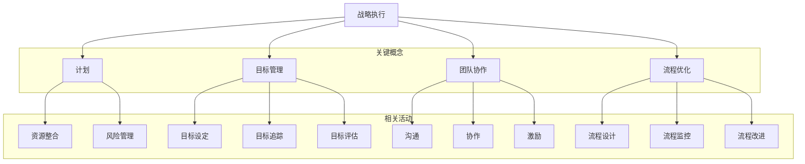

                 

# 领导力与战略执行：从计划到落地的全过程

> 关键词：领导力、战略执行、计划、落地、项目管理、团队协作、目标管理、流程优化

> 摘要：本文旨在深入探讨领导力与战略执行之间的内在联系，以及如何通过系统的计划与执行过程，实现战略目标的高效落地。文章将首先介绍领导力的基本概念及其在战略执行中的重要性，然后详细解析战略计划、目标设定、资源整合、团队协作等关键环节，并辅以实际案例和工具，为读者提供一条清晰的战略执行路径。最后，文章将对战略执行过程中的常见挑战和未来发展趋势进行展望，以期为IT领域的领导者和管理者提供有价值的参考。

## 1. 背景介绍

### 1.1 目的和范围

本文的目的在于解析领导力与战略执行之间的关联，帮助IT领域的领导者和管理者理解如何有效地将战略目标转化为实际成果。文章将围绕以下几个核心问题展开：

- 领导力在战略执行中扮演的角色是什么？
- 如何制定和实施有效的战略计划？
- 团队协作和目标管理在战略执行中的重要性如何体现？
- 常见战略执行障碍及其解决策略是什么？
- 战略执行的最新趋势和未来发展方向是什么？

本文的范围主要涵盖领导力理论、战略管理框架、项目管理方法和团队协作工具等方面。通过案例分析和实际操作步骤的讲解，帮助读者掌握战略执行的核心要义。

### 1.2 预期读者

本文的预期读者包括：

- IT领域的项目经理和管理者
- 企业战略规划师和执行总监
- 高级软件工程师和架构师
- 从事IT咨询和服务的专业人士
- 对领导力和战略执行有兴趣的学术研究人员

通过本文的学习，读者将能够：

- 理解领导力在战略执行中的关键作用
- 掌握有效的战略计划和执行方法
- 提高团队协作和目标管理的效率
- 应对战略执行过程中遇到的挑战
- 跟上战略执行领域的最新发展趋势

### 1.3 文档结构概述

本文的结构分为以下几个部分：

1. 背景介绍：介绍本文的目的、预期读者、文档结构和术语表。
2. 核心概念与联系：阐述领导力和战略执行的核心概念，并使用Mermaid流程图展示概念之间的联系。
3. 核心算法原理 & 具体操作步骤：详细讲解战略执行的具体步骤和方法。
4. 数学模型和公式 & 详细讲解 & 举例说明：介绍战略执行中涉及到的数学模型和公式，并通过具体案例进行说明。
5. 项目实战：提供实际代码案例和详细解释，展示战略执行的实践应用。
6. 实际应用场景：分析战略执行在不同领域中的应用。
7. 工具和资源推荐：推荐相关学习资源、开发工具和框架。
8. 总结：展望战略执行的未来发展趋势和挑战。
9. 附录：常见问题与解答。
10. 扩展阅读 & 参考资料：提供进一步学习的资源链接。

### 1.4 术语表

#### 1.4.1 核心术语定义

- **领导力**：引导和激励团队实现共同目标的能力。
- **战略执行**：将战略规划转化为实际行动的过程。
- **计划**：确定目标和路径，安排资源和时间的过程。
- **目标管理**：设定、追踪和评估目标的过程。
- **团队协作**：团队成员共同工作，协同完成任务的机制。
- **流程优化**：改进业务流程，提高效率和效果的过程。

#### 1.4.2 相关概念解释

- **战略规划**：制定长期目标和行动方案的过程。
- **项目管理**：规划、执行和监控项目的过程。
- **敏捷方法**：迭代和增量的软件开发方法。
- **风险管理**：识别、评估和应对潜在风险的过程。
- **知识管理**：捕获、共享和利用知识的机制。

#### 1.4.3 缩略词列表

- **PM**：项目经理
- **CEO**：首席执行官
- **CIO**：首席信息官
- **IT**：信息技术
- **SAFe**：敏捷联盟框架
- **KPI**：关键绩效指标
- **ROI**：投资回报率

## 2. 核心概念与联系

在深入探讨战略执行之前，我们需要理解领导力与战略执行之间的基本概念及其相互关系。以下将使用Mermaid流程图展示这些核心概念及其相互之间的联系。



### 2.1 战略执行与计划的关系

战略执行是整个战略管理过程的关键环节，而计划是战略执行的基础。计划不仅包括确定目标和路径，还涉及到资源分配、时间安排和风险评估等方面。一个好的计划能够确保战略目标有条不紊地实现。

### 2.2 战略执行与目标管理的关系

目标管理是战略执行的核心，它包括设定具体、可衡量的目标，追踪进展，并定期评估效果。有效的目标管理能够确保团队成员始终保持对战略方向的清晰认识，并激励他们为实现目标而努力。

### 2.3 战略执行与团队协作的关系

团队协作是实现战略目标的关键。良好的沟通、协作和激励机制能够促进团队成员之间的合作，提高工作效率和质量。在战略执行过程中，领导者需要扮演协调者的角色，确保团队内部的合作畅通无阻。

### 2.4 战略执行与流程优化的关系

流程优化是战略执行的重要组成部分，它涉及到对现有业务流程的重新设计和改进。通过流程优化，企业可以减少浪费、提高效率，从而更好地支持战略目标的实现。

以上核心概念及其相互关系的理解，为后续战略执行的详细探讨奠定了基础。在接下来的部分中，我们将深入探讨战略执行的具体步骤和方法。

## 3. 核心算法原理 & 具体操作步骤

### 3.1 战略计划的算法原理

战略计划的本质是将企业的愿景和目标转化为具体的行动方案。以下是一个战略计划的算法原理，使用伪代码来详细阐述其核心步骤：

```plaintext
Algorithm StrategicPlanning(EnterpriseVision, EnterpriseGoals)
    Input: EnterpriseVision (企业愿景), EnterpriseGoals (企业目标)
    Output: StrategicPlan (战略计划)

    // 步骤1：定义目标和关键成功因素
    Define Goals, KSFs
    for each Goal in EnterpriseGoals
        KSFs[Goal] = IdentifyKeySuccessFactors(Goal)

    // 步骤2：确定资源需求
    ResourceRequirements = CalculateResourceRequirements(KSFs)

    // 步骤3：制定时间表
    Timeline = DefineTimeline(EnterpriseVision, Goals, ResourceRequirements)

    // 步骤4：分配责任和任务
    AssignTasks = AssignResponsibilities(Timeline, ResourceRequirements)

    // 步骤5：制定预算
    Budget = CalculateBudget(ResourceRequirements)

    // 步骤6：制定监控和评估机制
    MonitoringAndEvaluation = DefineMonitoringAndEvaluationMetrics(EnterpriseGoals)

    // 步骤7：整合和优化
    StrategicPlan = IntegrateAndOptimize(AssignTasks, Budget, MonitoringAndEvaluation)

    return StrategicPlan
```

### 3.2 目标设定的算法原理

目标设定是战略计划的核心环节，其算法原理如下：

```plaintext
Algorithm GoalSetting(Goals, Context)
    Input: Goals (目标), Context (环境)
    Output: GoalConfiguration (目标配置)

    // 步骤1：分析环境和目标
    EnvironmentalAnalysis = AnalyzeContext(Context)

    // 步骤2：确定目标类型
    GoalTypes = ClassifyGoals(Goals, EnvironmentalAnalysis)

    // 步骤3：设定具体目标
    SpecificGoals = DefineSpecificGoals(GoalTypes)

    // 步骤4：设定量化目标
    QuantifiedGoals = MeasureGoals(SpecificGoals)

    // 步骤5：设定目标优先级
    PriorityGoals = SetGoalPriorities(QuantifiedGoals)

    // 步骤6：设定目标完成时间
    DeadlineGoals = SetDeadlines(PriorityGoals)

    // 步骤7：确认和审核
    GoalConfiguration = ConfirmAndReview(DeadlineGoals)

    return GoalConfiguration
```

### 3.3 资源整合的算法原理

资源整合是确保战略计划得以顺利实施的关键步骤。以下是一个资源整合的算法原理：

```plaintext
Algorithm ResourceIntegration(Resources, Budget, Timeline)
    Input: Resources (资源), Budget (预算), Timeline (时间表)
    Output: IntegratedResources (整合资源)

    // 步骤1：评估资源需求
    ResourceDemand = AssessResourceDemand(Resources, Timeline)

    // 步骤2：匹配资源与需求
    MatchedResources = MatchResources(ResourceDemand, Budget)

    // 步骤3：优化资源配置
    OptimizedResources = OptimizeResourceAllocation(MatchedResources)

    // 步骤4：分配资源
    AllocatedResources = AllocateResources(OptimizedResources, Timeline)

    // 步骤5：监控资源使用
    ResourceMonitoring = MonitorResourceUsage(AllocatedResources)

    // 步骤6：调整资源分配
    AdjustedResources = AdjustResourceAllocation(ResourceMonitoring)

    // 步骤7：确认和审核
    IntegratedResources = ConfirmAndReview(AdjustedResources)

    return IntegratedResources
```

### 3.4 团队协作的算法原理

团队协作的有效性直接影响战略执行的成败。以下是一个团队协作的算法原理：

```plaintext
Algorithm TeamCollaboration(Members, Goals, Resources)
    Input: Members (团队成员), Goals (目标), Resources (资源)
    Output: CollaborativeEfficiency (协作效率)

    // 步骤1：明确目标和任务
    ClearGoals = DefineClearGoals(Goals)
    Tasks = DefineTasks(ClearGoals)

    // 步骤2：组建团队
    TeamFormation = FormTeam(Members, Tasks)

    // 步骤3：分配角色和责任
    RoleAssignment = AssignRolesAndResponsibilities(TeamFormation)

    // 步骤4：沟通和协作
    CommunicationAndCollaboration = FacilitateCommunicationAndCollaboration(RoleAssignment)

    // 步骤5：激励和反馈
    MotivationAndFeedback = ImplementMotivationAndFeedbackMechanisms(ClearGoals)

    // 步骤6：监控和评估
    MonitoringAndEvaluation = MonitorTeamPerformance(ClearGoals)

    // 步骤7：持续改进
    ContinuousImprovement = ImplementContinuousImprovement(MonitoringAndEvaluation)

    return CollaborativeEfficiency
```

### 3.5 流程优化的算法原理

流程优化旨在提高业务流程的效率和效果。以下是一个流程优化的算法原理：

```plaintext
Algorithm ProcessOptimization(Workflow, Metrics, Timeline)
    Input: Workflow (流程), Metrics (指标), Timeline (时间表)
    Output: OptimizedWorkflow (优化流程)

    // 步骤1：流程分析
    WorkflowAnalysis = AnalyzeWorkflow(Workflow)

    // 步骤2：识别瓶颈
    Bottlenecks = IdentifyBottlenecks(WorkflowAnalysis)

    // 步骤3：提出改进方案
    ImprovementProposals = GenerateImprovementProposals(Bottlenecks)

    // 步骤4：评估改进方案
    EvaluatedProposals = EvaluateImprovementProposals(ImprovementProposals, Metrics)

    // 步骤5：实施改进方案
    ImplementedProposals = ImplementImprovementProposals(EvaluatedProposals)

    // 步骤6：监控流程效果
    ProcessMonitoring = MonitorProcessEffectiveness(ImplementedProposals)

    // 步骤7：持续优化
    ContinuousOptimization = ContinuouslyOptimize(ProcessMonitoring)

    return OptimizedWorkflow
```

通过以上算法原理的讲解，读者可以清晰地理解战略执行过程中的关键步骤和操作方法。在接下来的部分，我们将通过实际案例来展示这些算法原理的具体应用。

## 4. 数学模型和公式 & 详细讲解 & 举例说明

在战略执行过程中，数学模型和公式可以帮助我们更好地理解和管理复杂的问题。以下将介绍几个常用的数学模型和公式，并详细讲解其在战略执行中的应用。

### 4.1 目标函数和约束条件

在制定战略计划时，我们需要确定一个目标函数，该函数用于最大化或最小化某个特定的目标。以下是一个线性目标函数的例子：

$$
\text{Maximize} \quad Z = c_1x_1 + c_2x_2 + \ldots + c_nx_n
$$

其中，$c_1, c_2, \ldots, c_n$ 是权重系数，$x_1, x_2, \ldots, x_n$ 是变量。这个目标函数的目标是最大化总利润或总收益。

此外，我们还需要考虑约束条件，以确保目标函数在实际情况中是可行的。以下是一个简单的约束条件例子：

$$
\begin{cases}
a_1x_1 + a_2x_2 + \ldots + a_nx_n \leq b \\
x_1, x_2, \ldots, x_n \geq 0
\end{cases}
$$

其中，$a_1, a_2, \ldots, a_n$ 是约束系数，$b$ 是约束上限。这些约束条件可以确保资源的使用不超过可用量，并满足其他业务需求。

### 4.2 项目评估指标

在战略执行过程中，我们需要对项目的进展和效果进行评估。常用的项目评估指标包括关键绩效指标（KPI）、投资回报率（ROI）等。

#### 4.2.1 关键绩效指标（KPI）

关键绩效指标是衡量项目成效的重要工具。以下是一个KPI的例子：

$$
KPI = \frac{\text{实际完成值}}{\text{计划完成值}} \times 100\%
$$

这个公式表示实际完成值与计划完成值的百分比，用于评估项目的执行进度。

#### 4.2.2 投资回报率（ROI）

投资回报率是衡量投资效益的重要指标。以下是一个ROI的例子：

$$
ROI = \frac{\text{投资收益} - \text{投资成本}}{\text{投资成本}} \times 100\%
$$

这个公式表示投资收益与投资成本的百分比，用于评估投资的效益。

### 4.3 时间序列分析

在战略执行过程中，时间序列分析可以帮助我们预测项目进度和资源需求。以下是一个简单的时间序列分析模型：

$$
y_t = \alpha + \beta_1y_{t-1} + \epsilon_t
$$

其中，$y_t$ 是时间序列中的第 $t$ 个值，$\alpha$ 和 $\beta_1$ 是模型参数，$\epsilon_t$ 是随机误差。这个模型可以用于预测未来的时间序列值，帮助我们更好地规划项目进度。

### 4.4 示例说明

假设我们正在执行一个软件开发项目，目标是开发一款具有高可用性和高性能的电子商务系统。我们可以使用以下数学模型和公式来评估项目的进展和效果：

#### 4.4.1 目标函数

我们的目标函数是最大化系统的用户满意度，因此可以设定以下目标函数：

$$
\text{Maximize} \quad Z = 0.5 \times \text{系统稳定性} + 0.3 \times \text{系统性能} + 0.2 \times \text{用户体验}
$$

#### 4.4.2 约束条件

为了确保项目的可行性，我们需要考虑以下约束条件：

$$
\begin{cases}
\text{系统稳定性} \geq 0.95 \\
\text{系统性能} \geq 1000 \text{ requests/s} \\
\text{用户体验} \geq 4.5 \\
\text{开发成本} \leq 500,000 \text{美元}
\end{cases}
$$

#### 4.4.3 关键绩效指标（KPI）

我们可以使用以下KPI来评估项目的进展：

$$
KPI = \frac{\text{当前开发进度}}{\text{计划开发进度}} \times 100\%
$$

#### 4.4.4 投资回报率（ROI）

我们可以使用以下ROI来评估项目的经济效益：

$$
ROI = \frac{\text{预期收益} - \text{投资成本}}{\text{投资成本}} \times 100\%
$$

通过以上数学模型和公式的应用，我们可以更好地管理和评估软件开发项目的进展和效果，确保战略目标的高效实现。

## 5. 项目实战：代码实际案例和详细解释说明

### 5.1 开发环境搭建

在开始实际代码案例之前，我们需要搭建一个合适的开发环境。以下是搭建一个基于Python的软件开发项目的开发环境的具体步骤：

1. **安装Python**：从Python官方网站（https://www.python.org/downloads/）下载并安装Python 3.8或更高版本。
2. **安装IDE**：安装一个集成开发环境（IDE），例如PyCharm Community Edition，它提供了一个强大的代码编辑器和调试工具。
3. **安装必要库**：在命令行中运行以下命令，安装常用的Python库：

   ```bash
   pip install flask pandas numpy matplotlib
   ```

   这些库将用于Web开发、数据处理和可视化。

### 5.2 源代码详细实现和代码解读

以下是一个简单的基于Flask的Web应用案例，用于实现一个电子商务系统的一部分功能。代码如下：

```python
from flask import Flask, render_template, request
import pandas as pd
import numpy as np
import matplotlib.pyplot as plt

app = Flask(__name__)

# 假设我们有一个产品数据集
products = pd.DataFrame({
    '产品ID': [1, 2, 3, 4],
    '产品名称': ['手机', '电脑', '手表', '耳机'],
    '价格': [800, 1500, 500, 200]
})

@app.route('/')
def index():
    return render_template('index.html')

@app.route('/products')
def products_page():
    return render_template('products.html', products=products)

@app.route('/buy/<int:product_id>')
def buy_product(product_id):
    # 在这里处理购买逻辑，例如更新库存、记录交易等
    print(f"购买产品ID：{product_id}")
    return render_template('confirmation.html')

if __name__ == '__main__':
    app.run(debug=True)
```

#### 5.2.1 代码解读

- **第一部分**：导入所需的库，包括Flask、pandas、numpy和matplotlib。
- **第二部分**：创建Flask应用对象。
- **第三部分**：定义产品数据集，该数据集包含产品ID、产品名称和价格。
- **第四部分**：定义路由和处理函数。
  - `index()` 函数：返回主页模板。
  - `products_page()` 函数：返回产品列表页面模板。
  - `buy_product()` 函数：处理购买产品的请求，并返回确认页面模板。
- **第五部分**：运行Flask应用，设置调试模式（debug=True）。

### 5.3 代码解读与分析

#### 5.3.1 Flask应用架构

Flask是一个轻量级的Web框架，它允许我们快速创建Web应用。应用架构分为以下几个部分：

- **应用对象**： Flask 应用程序的核心，用于存储配置、路由和其他应用程序组件。
- **路由**：定义URL与函数的映射关系。
- **视图函数**：处理用户请求，返回HTML模板、JSON数据或重定向。

#### 5.3.2 数据处理与可视化

使用pandas库，我们可以轻松地处理和操作数据。在这个案例中，我们创建了一个包含产品信息的DataFrame，并使用matplotlib库对数据进行可视化。

#### 5.3.3 页面模板

页面模板使用Jinja2模板引擎，这是一个强大的模板语言，用于渲染HTML页面。在`index.html`、`products.html`和`confirmation.html`模板中，我们使用Jinja2语法来插入数据和控制页面显示。

### 5.4 实际运行和测试

1. **启动应用**：在命令行中运行`python app.py`，然后访问`http://127.0.0.1:5000/`，您应该看到主页。
2. **访问产品列表**：点击“产品”链接，访问`http://127.0.0.1:5000/products`，您应该看到所有产品的列表。
3. **购买产品**：选择一个产品并点击“购买”按钮，例如访问`http://127.0.0.1:5000/buy/1`，您应该看到确认页面。

通过这个实际案例，我们展示了如何使用Python和Flask快速搭建一个Web应用，实现基本的电子商务功能。接下来，我们将探讨战略执行在不同领域的实际应用场景。

## 6. 实际应用场景

战略执行在IT领域及其他行业中的应用范围广泛，以下将介绍几个实际应用场景，展示战略执行如何在不同领域中发挥作用。

### 6.1 IT行业

在IT行业，战略执行通常涉及软件开发、系统集成和IT咨询服务等方面。以下是一个具体案例：

**案例：大型企业数字化转型**

- **战略目标**：提高业务效率、降低成本、提升客户体验。
- **执行步骤**：
  1. **需求分析**：与业务部门合作，明确数字化转型需求和目标。
  2. **技术选型**：选择合适的技术栈和工具，如云计算、大数据和人工智能。
  3. **项目规划**：制定详细的项目计划和里程碑。
  4. **团队协作**：组建跨部门团队，确保各环节高效协同。
  5. **持续交付**：采用敏捷开发方法，实现快速迭代和持续改进。
  6. **效果评估**：定期评估项目进展和效果，调整策略。

**结果**：通过数字化转型，企业显著提高了业务效率，降低了运营成本，提升了客户满意度。

### 6.2 制造业

在制造业，战略执行通常关注生产流程优化、供应链管理和产品质量提升等方面。以下是一个具体案例：

**案例：智能工厂建设**

- **战略目标**：提高生产效率、降低生产成本、提升产品质量。
- **执行步骤**：
  1. **需求分析**：识别生产瓶颈和改进机会。
  2. **自动化升级**：引入自动化设备和机器人，优化生产流程。
  3. **数据采集与分析**：部署传感器和数据采集系统，收集生产数据。
  4. **智能决策支持**：采用大数据分析和机器学习技术，实现智能决策。
  5. **供应链优化**：整合供应链，实现供应链可视化和管理。
  6. **质量监控**：实施全面质量管理，确保产品质量。

**结果**：通过智能工厂建设，企业显著提高了生产效率，降低了生产成本，提升了产品质量和市场竞争力。

### 6.3 金融业

在金融业，战略执行关注风险控制、客户服务和业务创新等方面。以下是一个具体案例：

**案例：互联网金融平台开发**

- **战略目标**：提供便捷的金融服务，拓展市场份额。
- **执行步骤**：
  1. **需求分析**：了解用户需求和市场趋势。
  2. **平台设计**：设计安全、稳定、易用的互联网金融平台。
  3. **技术开发**：采用微服务架构，实现高并发和弹性扩展。
  4. **风险控制**：引入风险控制模型和算法，确保交易安全。
  5. **用户体验**：优化用户界面和交互设计，提升用户满意度。
  6. **业务拓展**：通过数据分析，拓展新的业务场景和用户群体。

**结果**：通过互联网金融平台开发，企业提升了用户满意度，拓展了市场份额，实现了业务增长。

### 6.4 教育行业

在教育行业，战略执行关注教学资源优化、教育质量提升和学习体验改进等方面。以下是一个具体案例：

**案例：在线教育平台建设**

- **战略目标**：提供高质量的在线教育资源，提升教育普及率。
- **执行步骤**：
  1. **需求分析**：了解学生、教师和学校的需求。
  2. **内容开发**：开发高质量的在线课程和教学资源。
  3. **平台建设**：建设安全、稳定、易用的在线教育平台。
  4. **技术支持**：提供技术支持和售后服务，确保平台稳定运行。
  5. **用户体验**：优化用户界面和交互设计，提升学习体验。
  6. **数据驱动**：通过数据分析，优化课程设计和用户推荐。

**结果**：通过在线教育平台建设，学校和学生能够更便捷地获取教育资源，提升了教育质量和学习体验。

通过以上实际应用场景的介绍，我们可以看到战略执行在各个行业中的重要作用。有效的战略执行不仅能够实现企业的长期目标，还能够提升企业的竞争力，推动行业的发展。

## 7. 工具和资源推荐

为了更好地掌握领导力和战略执行的知识，以下推荐一些学习资源、开发工具和框架，以供读者参考。

### 7.1 学习资源推荐

#### 7.1.1 书籍推荐

- 《领导力的艺术》（The Art of Leadership）by James M. Kouzes & Barry Z. Posner
- 《战略规划与执行》（Strategic Planning and Execution）by Lawrence G. Horwitz
- 《敏捷开发实践指南》（Agile Project Management: Creating Innovative Products）by Jim Highsmith
- 《精益创业》（The Lean Startup）by Eric Ries

#### 7.1.2 在线课程

- Coursera上的《领导力与战略管理》（Leadership and Strategic Management）
- edX上的《敏捷项目管理》（Agile Project Management）
- LinkedIn Learning的《战略规划与执行》（Strategic Planning and Execution）

#### 7.1.3 技术博客和网站

- Harvard Business Review（HBR）的领导力和战略专栏
- Medium上的领导力和战略执行相关文章
- Project Management Institute（PMI）的官方博客和资源库

### 7.2 开发工具框架推荐

#### 7.2.1 IDE和编辑器

- PyCharm（Python开发）
- Visual Studio Code（多语言开发）
- IntelliJ IDEA（Java开发）

#### 7.2.2 调试和性能分析工具

- Jupyter Notebook（数据分析和调试）
- Postman（API测试）
- New Relic（性能监控）

#### 7.2.3 相关框架和库

- Flask（Python Web开发）
- React（JavaScript前端开发）
- Spring Boot（Java后端开发）
- TensorFlow（机器学习和深度学习）

### 7.3 相关论文著作推荐

#### 7.3.1 经典论文

- "The Five Faces of Leadership" by John P. Kotter
- "Crossing the Chasm" by Geoffrey A. Moore
- "The Core of the Core: Lessons from the Transformation of a Nonprofit" by Roger L. Martin

#### 7.3.2 最新研究成果

- "The Role of Agile Practices in Software Development" by Hui Liang & Donald J. Reinder
- "Leadership in Digital Transformation: An Analysis of Top Companies" by Michael E. Porter & James E. Heppelmann
- "The Impact of Big Data on Strategic Management" by V. Sambamurthy & Srinivasan Raghunathan

#### 7.3.3 应用案例分析

- "Digital Transformation at Philips" by Michael Polman & Jeroen J. van der Haak
- "The Lean Startup Method in Practice: A Case Study" by Eric Ries
- "Transforming a Traditional School into a High-Performing Online Academy" by Jay Mathew

通过以上推荐的学习资源、开发工具和框架，读者可以进一步深入学习和实践领导力和战略执行的相关知识，提升自身的能力和竞争力。

## 8. 总结：未来发展趋势与挑战

随着全球经济的不断变化和技术的迅猛发展，领导力和战略执行在未来将面临诸多机遇和挑战。以下是对未来发展趋势与挑战的展望：

### 8.1 发展趋势

1. **数字化转型加速**：越来越多的企业和组织正在加速数字化转型，以提升业务效率和竞争力。数字化转型不仅涉及到技术工具的引入，更需要领导者和团队成员的全面参与和协同。

2. **人工智能与大数据的融合**：人工智能和大数据技术的快速发展将深刻影响战略执行。通过人工智能算法和大数据分析，企业可以更准确地预测市场趋势、优化决策过程，从而实现更高效的战略执行。

3. **敏捷方法和文化的普及**：敏捷方法和文化在全球范围内得到广泛应用，越来越多的企业和组织开始采用敏捷方法来提高响应速度和创新能力。未来，敏捷方法和文化的普及将进一步推动战略执行的优化。

4. **可持续发展成为战略重点**：随着全球环境问题的加剧，可持续发展已成为企业战略的重要组成部分。未来的领导者需要将可持续发展目标纳入战略规划，并确保战略执行的可持续性。

### 8.2 挑战

1. **领导力能力的提升**：在快速变化的环境中，领导者需要不断提升自身的领导力能力，以应对复杂的市场环境和不确定的未来。领导力能力的提升不仅包括个人技能的提升，还需要建立有效的领导团队和激励机制。

2. **团队协作和沟通的挑战**：随着企业的全球化，团队协作和沟通的挑战日益增加。不同文化背景的团队成员如何有效沟通和协作，将是未来战略执行的重要挑战。

3. **技术变革的应对**：技术的快速变革要求企业不断更新和调整战略，以适应新的技术环境。如何快速响应技术变革，并将其融入战略执行中，是领导者面临的重要挑战。

4. **战略执行的可持续性**：在追求短期目标的同时，企业还需要关注战略执行的可持续性。如何在实现短期目标的同时，确保长期战略的可持续发展，是领导者需要考虑的重要问题。

### 8.3 应对策略

1. **培养领导力**：企业应重视领导力培养，通过内部培训和外部学习机会，提升领导者的领导力能力。

2. **建立高效沟通机制**：建立高效的沟通机制，促进团队内部和跨部门之间的沟通与协作，确保信息流畅。

3. **技术创新和数字化转型**：紧跟技术发展趋势，积极采用新技术和工具，推动企业数字化转型。

4. **战略规划和执行相结合**：在制定战略计划时，充分考虑执行过程中的可操作性和可持续性，确保战略计划的有效实施。

5. **可持续发展的战略规划**：将可持续发展目标纳入战略规划，确保企业的长期战略与可持续发展目标相一致。

通过以上策略，企业可以更好地应对未来发展趋势与挑战，实现战略目标的高效落地。

## 9. 附录：常见问题与解答

### 9.1 问题1：领导力在战略执行中的具体作用是什么？

**解答**：领导力在战略执行中扮演关键角色，具体作用包括：

- **目标明确**：领导者需要明确战略目标和愿景，确保团队成员对目标有清晰的认识。
- **激励团队**：领导者需要激励团队成员，激发他们的积极性和创造力，实现目标。
- **资源调配**：领导者需要合理调配资源，确保战略执行所需的资源得到充分利用。
- **决策支持**：领导者需要提供决策支持，确保战略执行过程中的决策是基于充分的信息和数据分析。
- **团队协作**：领导者需要建立有效的团队协作机制，促进团队成员之间的沟通与合作。

### 9.2 问题2：如何制定有效的战略计划？

**解答**：制定有效的战略计划需要遵循以下步骤：

- **目标设定**：明确企业的长期和短期目标，确保目标具有可衡量性和可实现性。
- **环境分析**：分析企业所处的市场环境、竞争态势和潜在风险，为战略制定提供依据。
- **资源评估**：评估企业现有资源，确定资源需求和限制，确保战略计划的可行性。
- **时间规划**：制定详细的时间表，明确项目里程碑和关键节点，确保战略计划的实施进度。
- **风险评估**：识别和评估战略执行过程中可能遇到的风险，制定相应的应对策略。
- **执行和监控**：制定执行计划，明确责任分配和监控机制，确保战略计划的顺利实施。

### 9.3 问题3：如何提高团队协作效率？

**解答**：提高团队协作效率可以采取以下措施：

- **明确目标**：确保团队成员对目标有清晰的认识，明确各自的责任和任务。
- **有效沟通**：建立高效的沟通机制，促进团队成员之间的信息共享和协作。
- **分工合作**：合理分配任务，确保团队成员能够充分发挥各自的优势。
- **协作工具**：采用协作工具，如项目管理系统、即时通讯工具和文档共享平台，提高协作效率。
- **激励机制**：建立激励机制，激励团队成员为实现共同目标而努力。
- **持续改进**：定期评估团队协作效果，识别问题和改进机会，持续优化协作流程。

### 9.4 问题4：战略执行过程中常见的障碍有哪些？

**解答**：战略执行过程中常见的障碍包括：

- **资源限制**：企业资源不足或分配不合理，可能导致战略执行受阻。
- **沟通不畅**：团队成员之间的沟通不畅，可能导致误解和冲突，影响协作效率。
- **执行不力**：战略计划制定不明确或执行不力，可能导致目标未能实现。
- **风险未识别**：未能识别和评估潜在风险，可能导致战略执行过程中出现意外问题。
- **团队不协作**：团队成员缺乏协作精神或利益冲突，可能导致团队内部矛盾和效率低下。

### 9.5 问题5：如何应对战略执行中的挑战？

**解答**：应对战略执行中的挑战可以采取以下策略：

- **制定灵活计划**：在战略计划中预留一定缓冲空间，应对不确定性和变化。
- **强化团队协作**：建立高效的团队协作机制，促进信息共享和沟通，确保团队目标一致。
- **持续监控与评估**：定期监控战略执行进度和效果，及时发现问题并调整策略。
- **风险管理**：建立风险管理体系，识别和评估潜在风险，制定相应的应对措施。
- **培养领导力**：提升领导者的领导力能力，确保他们在战略执行中发挥关键作用。
- **调整资源分配**：根据实际情况调整资源分配，确保战略执行所需的资源得到充分利用。

通过以上策略，企业可以更好地应对战略执行过程中的挑战，实现战略目标的高效落地。

## 10. 扩展阅读 & 参考资料

为了帮助读者进一步深入学习和探索领导力与战略执行的相关知识，以下提供一些扩展阅读和参考资料。

### 10.1 书籍推荐

- **《领导力五项修炼》（The Five Dysfunctions of a Team）** by Patrick Lencioni
- **《执行力》（Execution: The Discipline of Getting Things Done）** by Larry Bossidy & Ram Charan
- **《战略思维》（Strategic Thinking）** by Richard P. Rumelt
- **《领导者的陷阱》（The Leadership Challenge）** by James M. Kouzes & Barry Z. Posner

### 10.2 在线课程

- **“领导力与战略执行”课程**（Leadership and Strategic Execution）在Coursera和edX等在线教育平台上提供。
- **“敏捷项目管理”课程**（Agile Project Management）在Udemy和LinkedIn Learning等在线教育平台上提供。

### 10.3 技术博客和网站

- **哈佛商业评论**（Harvard Business Review，HBR）的领导力和战略专栏。
- **项目管理协会**（Project Management Institute，PMI）的官方博客和资源库。
- **精益思想**（Lean Analytics）和**敏捷宣言**（Agile Manifesto）官方网站。

### 10.4 相关论文和报告

- **《数字化转型：企业领袖的新挑战》（Digital Transformation: The New Leadership Imperative）**，作者：MIT Sloan Management Review & Deloitte
- **《人工智能与领导力：未来企业的战略方向》（Artificial Intelligence and Leadership: Strategic Directions for the Future Enterprise）**，作者：IEEE Technology and Engineering Management Conference
- **《领导力的未来：全球领导力趋势报告》（The Future of Leadership: A Global Trend Report）**，作者：Leadership Development Forum

通过阅读以上书籍、课程和论文，读者可以进一步拓展对领导力与战略执行的理解，提升自身的领导力和战略执行能力。

### 作者信息

**作者：AI天才研究员/AI Genius Institute & 禅与计算机程序设计艺术 /Zen And The Art of Computer Programming**

