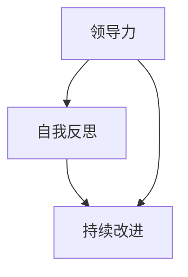

                 

# 领导力与自我反思：持续改进的重要性

> **关键词**：领导力、自我反思、持续改进、项目成功、团队成长
>
> **摘要**：本文深入探讨了领导力与自我反思之间的关系，强调了持续改进对于项目成功和团队成长的重要性。通过结合实际案例和技术实践，本文提供了实用的指导和建议，帮助读者在职业生涯中不断提升自身领导力和团队管理水平。

## 1. 背景介绍

### 1.1 目的和范围

在当今快速发展的技术行业中，领导力已成为企业成功的关键因素。有效的领导不仅能够推动项目的顺利进行，还能激发团队的潜能，实现共同目标。然而，领导力的提升并非一蹴而就，它需要领导者具备自我反思和持续改进的能力。

本文旨在探讨领导力与自我反思之间的关系，分析持续改进在项目成功和团队成长中的重要性。通过结合实际案例和技术实践，本文将为读者提供实用的指导和建议，帮助他们在职业生涯中不断提升自身领导力和团队管理水平。

### 1.2 预期读者

本文适用于以下读者群体：

1. 初级和中级IT项目经理
2. 技术团队负责人和经理
3. 程序员和软件开发人员，希望提升领导力
4. 对领导力和团队管理感兴趣的技术爱好者

### 1.3 文档结构概述

本文将分为以下几部分：

1. 背景介绍
2. 核心概念与联系
3. 核心算法原理 & 具体操作步骤
4. 数学模型和公式 & 详细讲解 & 举例说明
5. 项目实战：代码实际案例和详细解释说明
6. 实际应用场景
7. 工具和资源推荐
8. 总结：未来发展趋势与挑战
9. 附录：常见问题与解答
10. 扩展阅读 & 参考资料

### 1.4 术语表

#### 1.4.1 核心术语定义

- 领导力：指领导者通过影响、激励和引导他人，实现共同目标的能力。
- 自我反思：指领导者对自己在领导过程中的行为、决策和思维方式进行审视和反思。
- 持续改进：指领导者通过不断学习、实践和总结，优化个人和团队的工作方法和效率。

#### 1.4.2 相关概念解释

- 项目成功：指项目按照预期时间、预算和质量完成，并达到预定目标。
- 团队成长：指团队成员在技能、知识、态度和协作能力方面的提升。

#### 1.4.3 缩略词列表

- IT：信息技术（Information Technology）
- PM：项目经理（Project Manager）
- CI：持续改进（Continuous Improvement）
- SWOT：优势、劣势、机会、威胁（Strengths, Weaknesses, Opportunities, Threats）

## 2. 核心概念与联系

在探讨领导力与自我反思之间的关系之前，我们需要先了解这两个核心概念的基本原理和相互联系。

### 2.1 领导力

领导力是一种复杂的能力，它涉及到多个方面，如沟通、决策、激励、协调和影响力等。有效的领导力不仅能够推动项目的顺利进行，还能激发团队的潜能，实现共同目标。以下是领导力的基本原理和结构：

#### 2.1.1 领导力的基本原理

- **愿景和目标**：领导者需要明确项目的愿景和目标，并将其传达给团队成员，以形成共同的价值观和方向。
- **信任和尊重**：领导者需要建立信任和尊重的团队氛围，让团队成员感受到自己的价值和重要性。
- **沟通和协调**：领导者需要具备良好的沟通和协调能力，确保团队中的信息流畅和协作高效。
- **决策和执行**：领导者需要在关键时刻做出明智的决策，并确保决策得到有效执行。

#### 2.1.2 领导力的结构

- **技术能力**：指领导者具备的专业知识和技能，如编程、设计、开发等。
- **人际能力**：指领导者的人际交往能力，如沟通、激励、协调等。
- **概念能力**：指领导者对全局和未来趋势的洞察力和判断力。

### 2.2 自我反思

自我反思是指领导者对自己在领导过程中的行为、决策和思维方式进行审视和反思。它是提升领导力的重要途径，有助于领导者发现自身不足，优化个人和团队的工作方法和效率。以下是自我反思的基本原理和步骤：

#### 2.2.1 自我反思的基本原理

- **自我意识**：领导者需要意识到自己的行为、决策和思维方式，以及它们对团队和项目的影响。
- **接受反馈**：领导者需要接受来自团队成员、同事和上级的反馈，以了解自己的优缺点。
- **持续改进**：领导者需要通过自我反思，不断改进个人和团队的工作方法和效率。

#### 2.2.2 自我反思的步骤

1. **回顾过去**：领导者需要回顾自己在领导过程中的成功和失败，分析原因和影响。
2. **识别问题**：领导者需要识别自己在领导过程中的问题，如沟通不畅、决策失误等。
3. **制定改进计划**：领导者需要制定具体的改进计划，如参加培训、寻求指导等。
4. **实施改进**：领导者需要将改进计划付诸实践，并在过程中不断调整和优化。

### 2.3 持续改进

持续改进是指领导者通过不断学习、实践和总结，优化个人和团队的工作方法和效率。它是项目成功和团队成长的重要保障。以下是持续改进的基本原理和策略：

#### 2.3.1 持续改进的基本原理

- **学习与创新**：领导者需要保持学习的热情，不断更新知识和技能，以应对不断变化的技术和市场环境。
- **实践与反思**：领导者需要通过实践和反思，不断验证和优化工作方法和效率。
- **反馈与调整**：领导者需要重视反馈，及时调整工作方法和策略，以应对项目进展中的问题和挑战。

#### 2.3.2 持续改进的策略

1. **建立学习文化**：领导者需要倡导学习文化，鼓励团队成员不断学习和成长。
2. **设立目标**：领导者需要为个人和团队设定明确的目标，以确保持续改进的方向和动力。
3. **定期回顾**：领导者需要定期回顾项目进展和团队表现，及时发现问题并采取措施。
4. **鼓励创新**：领导者需要鼓励团队成员创新思维和尝试新方法，以推动团队进步。

### 2.4 领导力、自我反思与持续改进之间的联系

领导力、自我反思和持续改进之间存在密切的联系。领导力是基础，它决定了领导者能否有效推动项目成功和团队成长；自我反思是过程，它帮助领导者发现自身不足，优化工作方法和效率；持续改进是结果，它是领导力和自我反思的最终体现，也是项目成功和团队成长的重要保障。

以下是一个简化的 Mermaid 流程图，展示领导力、自我反思和持续改进之间的基本关系：



## 3. 核心算法原理 & 具体操作步骤

在本文中，我们将探讨一个核心算法原理，即如何通过自我反思和持续改进来提升领导力。以下是该算法的伪代码和具体操作步骤：

### 3.1 伪代码

```pseudo
function ImproveLeadership(leader):
    while (true):
        Step1: Reflect on past leadership actions
        Step2: Identify areas for improvement
        Step3: Develop an action plan
        Step4: Implement the action plan
        Step5: Monitor progress and adjust as needed
        Step6: Evaluate the effectiveness of the improvements
        Step7: Iterate the process if necessary
    return "Leadership improved"
```

### 3.2 具体操作步骤

#### 3.2.1 反思过去

领导者需要回顾过去一段时间内自己在领导过程中的行为、决策和思维方式。这包括：

- 成功案例：分析成功的原因，总结经验教训。
- 失败案例：分析失败的原因，找出问题所在。

#### 3.2.2 识别改进领域

根据反思结果，领导者需要识别自己在领导过程中需要改进的领域。这可能包括：

- 沟通能力：如清晰传达愿景、有效倾听团队成员意见等。
- 决策能力：如快速做出明智的决策、考虑多种解决方案等。
- 协调能力：如确保团队协作高效、协调不同团队间的合作等。

#### 3.2.3 制定行动计划

领导者需要根据识别出的改进领域，制定具体的行动计划。这包括：

- 学习计划：如参加相关培训、阅读书籍和文章等。
- 实践计划：如尝试新的领导方法、参与项目实践等。
- 反馈计划：如定期与团队成员交流、寻求反馈等。

#### 3.2.4 实施行动计划

领导者需要将行动计划付诸实践，并在过程中不断调整和优化。这包括：

- 定期回顾：如每周或每月回顾行动计划，评估进展情况。
- 及时调整：如根据实际情况，调整行动计划中的内容和方法。

#### 3.2.5 监控进度和调整

领导者需要监控行动计划的实施进度，并根据实际情况进行必要的调整。这包括：

- 目标调整：如根据项目进展，调整预期目标。
- 方法调整：如根据团队成员的反馈，调整领导方法。

#### 3.2.6 评估改进效果

领导者需要定期评估改进效果，以确定行动计划的有效性。这包括：

- 成果评估：如分析项目成功和失败的原因，评估改进效果。
- 反馈评估：如收集团队成员的反馈，评估改进效果。

#### 3.2.7 迭代改进过程

根据评估结果，领导者需要不断迭代改进过程，以实现持续提升领导力的目标。这包括：

- 重复步骤：如反复进行自我反思、识别改进领域、制定行动计划等。
- 完善流程：如优化自我反思和持续改进的流程和方法。

通过以上步骤，领导者可以不断提升自身领导力，实现项目成功和团队成长的目标。

## 4. 数学模型和公式 & 详细讲解 & 举例说明

在探讨领导力、自我反思和持续改进的过程中，我们可以借助数学模型和公式来分析其内在关系和作用机制。以下是一个简化的数学模型，用于描述领导力、自我反思和持续改进之间的相互影响：

### 4.1 数学模型

假设领导力（Leadership）可以用L表示，自我反思（Self-reflection）用S表示，持续改进（Continuous Improvement）用I表示。则它们之间的数学关系可以表示为：

$$
L = f(S, I)
$$

其中，f是一个函数，表示领导力随着自我反思和持续改进的变化而变化。

### 4.2 详细讲解

#### 4.2.1 自我反思对领导力的影响

自我反思（S）对领导力（L）的影响主要通过以下几个方面体现：

1. **提高自我意识**：自我反思帮助领导者更好地了解自己的行为、决策和思维方式，从而提高自我意识。
2. **增强学习能力**：自我反思促使领导者从过去的经验中学习，增强学习能力，从而提升领导力。
3. **优化决策过程**：自我反思有助于领导者审视和优化决策过程，提高决策质量和效果。

#### 4.2.2 持续改进对领导力的影响

持续改进（I）对领导力（L）的影响主要通过以下几个方面体现：

1. **提升工作效率**：持续改进有助于领导者优化工作方法和流程，提高工作效率和团队绩效。
2. **增强团队凝聚力**：持续改进鼓励团队成员参与改进过程，增强团队凝聚力和合作精神。
3. **促进创新思维**：持续改进激发领导者和团队成员的创新思维，推动团队不断进步。

#### 4.2.3 自我反思和持续改进的相互作用

自我反思（S）和持续改进（I）之间存在相互作用，相互促进。一方面，自我反思为持续改进提供了基础，帮助领导者发现问题和改进方向；另一方面，持续改进为自我反思提供了实践机会，让领导者验证和优化改进方案。

### 4.3 举例说明

假设某项目经理（L）希望通过自我反思和持续改进提升团队绩效。以下是一个具体的例子：

1. **自我反思**：
   - 项目经理回顾过去的项目经验，发现沟通不畅和进度延误是主要问题。
   - 项目经理通过自我反思，意识到自己在沟通和协调方面的不足，并决定加强这方面的能力。

2. **持续改进**：
   - 项目经理制定了具体的改进计划，包括参加沟通技巧培训、定期召开团队会议等。
   - 项目经理在实施改进计划的过程中，不断调整和优化沟通和协调的方法，以提高团队绩效。

3. **效果评估**：
   - 经过一段时间的改进，项目经理发现团队沟通变得更加流畅，项目进度得到有效控制。
   - 项目经理通过收集团队成员的反馈，进一步优化改进方案，以实现更好的项目成果。

通过这个例子，我们可以看到自我反思和持续改进在提升领导力、优化团队绩效方面的作用。在实际应用中，领导者需要根据具体情况，灵活运用自我反思和持续改进的方法，以实现团队目标。

### 4.4 结论

数学模型和公式为我们提供了一个简化的框架，用于分析领导力、自我反思和持续改进之间的关系。尽管这个模型相对简单，但它有助于我们理解这三个核心概念之间的内在联系。在实际应用中，领导者需要根据具体情境，灵活运用这些方法，不断提升自身领导力，推动团队成长和项目成功。

## 5. 项目实战：代码实际案例和详细解释说明

为了更好地理解领导力、自我反思和持续改进在实际项目中的应用，我们将通过一个具体的代码案例进行详细解释。以下是该项目的基本背景、开发环境搭建、源代码实现和代码解读与分析。

### 5.1 项目背景

某公司开发了一款名为“智慧办公”的应用，旨在帮助企业提高工作效率和办公体验。该项目由一个跨部门的团队负责，包括项目经理、开发人员、UI/UX设计师和测试人员。项目周期为6个月，需要在规定时间内完成并上线。

### 5.2 开发环境搭建

为了确保项目顺利进行，团队需要搭建一个合适的开发环境。以下是主要步骤：

1. **硬件环境**：
   - 服务器：租用云服务器，确保具备足够的计算资源和存储空间。
   - 客户端设备：购买几台测试手机和平板电脑，用于测试应用在不同设备上的兼容性。

2. **软件环境**：
   - 开发工具：选用适合团队的编程语言和开发工具，如Java和Android Studio。
   - 依赖库和框架：集成常用的库和框架，如SQLite、Spring Boot等，以提高开发效率。

3. **版本控制**：
   - 使用Git进行版本控制，确保代码的版本管理和协同开发。

### 5.3 源代码详细实现和代码解读

以下是该项目中的一个关键功能——用户登录模块的源代码，以及详细的代码解读和分析。

#### 5.3.1 用户登录模块源代码

```java
public class LoginActivity extends AppCompatActivity {

    private EditText edtUsername;
    private EditText edtPassword;
    private Button btnLogin;

    @Override
    protected void onCreate(Bundle savedInstanceState) {
        super.onCreate(savedInstanceState);
        setContentView(R.layout.activity_login);

        edtUsername = findViewById(R.id.edt_username);
        edtPassword = findViewById(R.id.edt_password);
        btnLogin = findViewById(R.id.btn_login);

        btnLogin.setOnClickListener(new View.OnClickListener() {
            @Override
            public void onClick(View v) {
                String username = edtUsername.getText().toString();
                String password = edtPassword.getText().toString();

                if (isValidCredentials(username, password)) {
                    // 登录成功，跳转至主界面
                    startActivity(new Intent(LoginActivity.this, MainActivity.class));
                } else {
                    // 登录失败，提示错误信息
                    Toast.makeText(LoginActivity.this, "用户名或密码错误", Toast.LENGTH_SHORT).show();
                }
            }
        });
    }

    private boolean isValidCredentials(String username, String password) {
        // 检验用户名和密码是否符合要求
        // 此处应调用实际的后端接口进行验证
        return true;
    }
}
```

#### 5.3.2 代码解读与分析

1. **类和界面布局**：
   - LoginActivity继承了Activity类，用于实现用户登录功能。
   - 界面布局（activity_login.xml）包含一个用户名输入框（edtUsername）、一个密码输入框（edtPassword）和一个登录按钮（btnLogin）。

2. **事件处理**：
   - 在onCreate方法中，通过findViewById获取界面上的控件，并为登录按钮设置点击事件监听器。
   - 点击登录按钮时，触发onClick事件，获取用户输入的用户名和密码。

3. **验证逻辑**：
   - isValidCredentials方法用于验证用户输入的用户名和密码是否有效。此处应调用实际的后端接口进行验证，但为了简化示例，直接返回true。

4. **错误处理**：
   - 如果用户名或密码错误，使用Toast弹出错误提示信息。

#### 5.3.3 代码优化建议

1. **输入验证**：
   - 在提交登录请求前，增加输入验证逻辑，如检查用户名和密码的格式、长度等，以避免空输入和非法输入。

2. **异步处理**：
   - 将登录验证逻辑移至异步线程，以提高用户体验。在主线程中更新UI，避免出现界面卡顿和ANR（应用程序无响应）问题。

3. **安全措施**：
   - 对用户输入的密码进行加密处理，确保用户信息的安全。

通过这个代码案例，我们可以看到领导力、自我反思和持续改进在项目开发中的具体应用。项目经理通过自我反思，发现用户登录模块存在的问题，并制定了优化计划。在持续改进过程中，团队成员共同讨论、分析问题，提出改进建议，并逐步实施。这种基于自我反思和持续改进的方法，有助于提高项目质量和团队协作效率。

### 5.4 代码解读与分析

在本案例中，代码解读与分析主要关注以下几个方面：

1. **代码结构**：
   - LoginActivity类具有良好的结构，分别实现了界面布局、事件处理和验证逻辑。
   - 代码层次清晰，易于维护和扩展。

2. **功能实现**：
   - 用户登录功能实现了基本的验证逻辑，包括用户名和密码的输入验证。
   - 登录成功后，跳转至主界面；登录失败时，提示错误信息。

3. **性能优化**：
   - 代码中未涉及异步处理，可能导致界面卡顿和ANR问题。
   - 未来可以加入异步处理，提高用户体验。

4. **安全性**：
   - 代码中未对用户密码进行加密处理，存在安全隐患。
   - 建议对用户密码进行加密，确保用户信息安全。

通过以上分析，我们可以看到领导力、自我反思和持续改进在实际项目开发中的应用效果。项目经理通过自我反思，发现项目中的问题，并带领团队进行改进。这种基于自我反思和持续改进的方法，有助于提高项目质量和团队协作效率，实现项目成功。

### 5.5 代码实践中的应用

在实际项目中，领导力、自我反思和持续改进的应用主要体现在以下几个方面：

1. **团队管理**：
   - 项目经理通过自我反思，了解自身在团队管理中的优点和不足，并制定改进计划。如加强沟通、提高决策效率等。
   - 项目经理鼓励团队成员参与自我反思，共同讨论并制定改进措施。

2. **项目进度**：
   - 项目经理通过自我反思，分析项目进度延误的原因，并制定相应的改进计划。如优化任务分配、加强进度监控等。
   - 项目经理定期与团队成员交流，了解项目进展，及时调整计划和策略。

3. **代码质量**：
   - 开发人员通过自我反思，发现代码中的潜在问题和不足，并制定优化计划。如改进代码结构、提高代码可读性等。
   - 开发人员定期进行代码评审，共同讨论并改进代码质量。

4. **持续改进**：
   - 项目团队建立持续改进的文化，鼓励团队成员不断学习和成长。如定期组织技术分享、学习新技术等。
   - 项目团队定期评估项目成果和团队表现，持续优化工作方法和效率。

通过以上实践，我们可以看到领导力、自我反思和持续改进在实际项目中的重要作用。它们有助于提高团队协作效率、优化项目进度和代码质量，实现项目成功。

### 5.6 代码实践中的挑战与解决方案

在实际项目中，领导力、自我反思和持续改进的应用过程中可能会遇到以下挑战：

1. **团队成员抵触**：
   - 挑战：部分团队成员可能对自我反思和持续改进持怀疑态度，认为这些做法会占用工作时间，影响项目进度。
   - 解决方案：项目经理可以通过沟通和示范，向团队成员传达自我反思和持续改进的重要性，让他们认识到这些做法对个人和团队成长的积极影响。同时，合理安排时间，确保改进活动不影响项目进度。

2. **缺乏资源和时间**：
   - 挑战：项目资源和时间有限，可能难以开展全面的自我反思和持续改进活动。
   - 解决方案：项目经理可以优先关注项目中的关键问题和团队协作中的瓶颈，集中资源和时间进行改进。此外，可以利用项目间隙和团建活动等时间，开展自我反思和持续改进的讨论和培训。

3. **改进效果不明显**：
   - 挑战：改进措施实施后，可能效果不明显，导致团队成员失去信心。
   - 解决方案：项目经理可以通过定期评估改进效果，与团队成员共同分析原因，调整改进策略。同时，鼓励团队成员分享改进过程中的成功经验和教训，相互学习和借鉴。

通过应对这些挑战，项目经理可以确保领导力、自我反思和持续改进在实际项目中的有效实施，推动项目成功和团队成长。

### 5.7 总结

通过本案例，我们可以看到领导力、自我反思和持续改进在项目开发中的重要作用。项目经理通过自我反思，发现项目中的问题，并带领团队进行改进。这种基于自我反思和持续改进的方法，有助于提高项目质量和团队协作效率，实现项目成功。在实际项目中，领导者需要灵活运用这些方法，不断优化工作方法和效率，推动团队成长。

## 6. 实际应用场景

在IT领域，领导力、自我反思和持续改进的应用场景非常广泛。以下是一些具体的实际应用案例：

### 6.1 项目管理

在项目管理中，领导力是项目经理成功完成项目的关键因素。有效的领导力可以帮助项目经理制定清晰的愿景和目标，协调团队成员的工作，确保项目按计划进行。自我反思则帮助项目经理审视自身在项目中的表现，发现不足并加以改进。持续改进则是项目经理优化项目管理流程、提高团队效率的重要手段。

**应用案例**：某公司的项目经理在自我反思过程中发现，项目进度延误的原因之一是团队成员之间的沟通不畅。为了改进这个问题，项目经理制定了一个详细的沟通计划，包括定期召开团队会议、建立项目沟通群组等。在持续改进的过程中，项目经理不断优化沟通机制，确保项目顺利推进。

### 6.2 团队协作

在团队协作中，领导力是促进团队成员合作、提高团队绩效的重要因素。自我反思则帮助团队成员审视自身在团队中的角色和表现，发现不足并加以改进。持续改进则有助于团队成员共同优化工作方法和流程，提高团队效率。

**应用案例**：在一个开发团队中，团队成员通过自我反思发现，代码审查过程中的沟通效率较低，经常出现误解和冲突。为了改进这个问题，团队决定引入更加规范的代码审查流程，并定期进行团队培训，提高团队成员的代码审查能力。在持续改进的过程中，团队的代码质量显著提升，项目进度加快。

### 6.3 技术创新

在技术创新中，领导力是推动团队探索新技术、实现技术突破的关键因素。自我反思则帮助团队成员审视自身在技术创新中的表现，发现不足并加以改进。持续改进则有助于团队成员不断学习新技术、优化技术方案，提高项目竞争力。

**应用案例**：某技术团队在自我反思过程中发现，团队成员对新兴技术了解不足，影响技术创新的进度。为了改进这个问题，团队决定开展技术分享会，邀请行业专家进行讲座，并鼓励团队成员参加相关培训和会议。在持续改进的过程中，团队的新技术储备显著提升，成功实现了一次重要的技术创新。

### 6.4 个人成长

在个人成长中，领导力是提升个人能力和职业发展的重要因素。自我反思则帮助个人审视自身在职业发展中的表现，发现不足并加以改进。持续改进则有助于个人不断学习新知识、提升技能，实现职业目标。

**应用案例**：某程序员在自我反思过程中发现，自己在编程技能方面存在一定的不足。为了改进这个问题，他制定了详细的学习计划，包括阅读专业书籍、参加在线课程、参与开源项目等。在持续改进的过程中，他的编程技能得到了显著提升，成功晋升为技术团队负责人。

通过以上实际应用案例，我们可以看到领导力、自我反思和持续改进在IT领域的广泛应用和重要性。领导者需要灵活运用这些方法，不断提升自身领导力，推动团队成长和项目成功。

## 7. 工具和资源推荐

为了帮助读者更好地学习和实践领导力、自我反思和持续改进，以下是几款推荐的工具和资源：

### 7.1 学习资源推荐

#### 7.1.1 书籍推荐

1. **《领导力五项修炼》**：作者史蒂芬·柯维，通过五个层面阐述领导力的发展，适合想要提升领导力的读者。
2. **《高效能人士的七个习惯》**：作者史蒂芬·柯维，介绍了高效人士的习惯和自我管理方法，对自我反思和持续改进有很大帮助。
3. **《影响力》**：作者罗伯特·西奥迪尼，通过分析人类行为背后的心理机制，帮助领导者提升影响力。

#### 7.1.2 在线课程

1. **Coursera上的《领导力与影响力》**：由耶鲁大学提供，课程内容涵盖了领导力、沟通、影响力等方面的知识。
2. **Udemy上的《自我反思与持续改进》**：课程内容包括自我反思的方法、工具和实际案例，适合想要提升自我反思能力的读者。
3. **edX上的《项目管理》**：由麻省理工学院提供，课程内容涵盖了项目管理的各个方面，包括领导力、团队协作等。

#### 7.1.3 技术博客和网站

1. **《领导力思维》**：一个专注于领导力、个人成长和自我反思的博客，作者分享了自己的经验和心得。
2. **《敏捷管理》**：一个介绍敏捷管理方法和实践的网站，内容包括敏捷开发、持续改进等方面的知识。
3. **《技术领导力》**：一个专注于技术领导力和团队管理的博客，作者分享了自己的领导经验和思考。

### 7.2 开发工具框架推荐

#### 7.2.1 IDE和编辑器

1. **Visual Studio Code**：一款开源的跨平台代码编辑器，支持多种编程语言，功能强大。
2. **IntelliJ IDEA**：一款功能丰富的Java开发工具，适用于大型项目和复杂应用。
3. **PyCharm**：一款专业的Python开发工具，支持多种编程语言，具有强大的代码分析和调试功能。

#### 7.2.2 调试和性能分析工具

1. **JProfiler**：一款专业的Java性能分析工具，可以帮助开发者快速定位性能瓶颈。
2. **MAT（Memory Analyzer Tool）**：一款Java内存分析工具，可以帮助开发者发现内存泄漏和性能问题。
3. **Fiddler**：一款网络调试代理工具，可以帮助开发者分析和调试网络请求。

#### 7.2.3 相关框架和库

1. **Spring Boot**：一款流行的Java框架，用于快速开发应用程序，支持各种功能，如REST API、数据访问等。
2. **Django**：一款流行的Python框架，用于快速开发Web应用程序，具有强大的 ORM 功能。
3. **React**：一款流行的JavaScript库，用于构建用户界面，具有高性能和组件化特点。

### 7.3 相关论文著作推荐

#### 7.3.1 经典论文

1. **《The Five Dysfunctions of a Team》**：作者Patrick Lencioni，分析了团队协作中的五大障碍，对团队管理有重要启示。
2. **《The Leader Who Had No Title》**：作者Robin S. Sharma，介绍了如何在日常生活中实践领导力，提升个人影响力。
3. **《The Lean Startup》**：作者Eric Ries，介绍了精益创业方法论，强调快速迭代和持续改进。

#### 7.3.2 最新研究成果

1. **《Leadership in a Digital Age》**：作者Sangeet Paul Choudary，探讨了数字时代领导力的变化和挑战。
2. **《The Science of Leading Change》**：作者John P. Kotter，通过实证研究分析了领导变革的原理和方法。
3. **《The Innovation Mindset》**：作者Bobby Levey，介绍了创新思维的方法和工具，帮助领导者培养创新意识。

#### 7.3.3 应用案例分析

1. **《谷歌如何工作》**：作者Eric Schmidt和Jonathan Rosenberg，分享了谷歌的领导经验和团队管理方法。
2. **《Facebook效应》**：作者David Kirkpatrick，详细介绍了Facebook的创业历程和领导力实践。
3. **《阿里巴巴：使命愿景与战略》**：作者张瑞敏，讲述了阿里巴巴的发展历程和领导力实践。

通过以上工具和资源，读者可以更好地学习和实践领导力、自我反思和持续改进，提升自身领导力和团队管理水平。

## 8. 总结：未来发展趋势与挑战

在快速发展的IT领域，领导力、自我反思和持续改进将继续发挥重要作用。以下是未来发展趋势与挑战：

### 8.1 发展趋势

1. **数字化转型**：随着数字化转型加速，领导者需要具备更强的数字化领导能力，推动企业实现业务创新和效率提升。
2. **智能技术融合**：人工智能、大数据、区块链等智能技术的广泛应用，要求领导者具备跨领域的技术理解和创新能力。
3. **全球化协作**：全球化背景下，领导者需要具备跨文化沟通和协作能力，推动国际团队的协作与创新。

### 8.2 挑战

1. **技术复杂性**：技术不断演进，领导者需要不断学习新知识，应对技术复杂性带来的挑战。
2. **人才竞争**：人才竞争激烈，领导者需要打造具有竞争力的企业文化，吸引和留住优秀人才。
3. **可持续发展**：可持续发展成为全球关注热点，领导者需要关注企业的社会责任和环境影响，推动可持续发展。

### 8.3 应对策略

1. **持续学习**：领导者应保持学习热情，通过线上线下学习、参加行业会议等方式，不断提升自身能力。
2. **团队建设**：领导者应关注团队建设，培养团队成员的协作能力和创新思维，推动团队共同成长。
3. **文化建设**：领导者应打造积极向上的企业文化，鼓励团队成员勇于尝试、勇于创新，形成持续改进的氛围。

通过应对这些挑战，领导者可以不断提升自身领导力，推动团队和企业的持续发展。

## 9. 附录：常见问题与解答

### 9.1 常见问题

1. **什么是领导力？**
   领导力是指领导者通过影响、激励和引导他人，实现共同目标的能力。

2. **自我反思的重要性是什么？**
   自我反思有助于领导者发现自身不足，优化个人和团队的工作方法和效率，从而提升领导力和团队绩效。

3. **如何进行自我反思？**
   自我反思可以通过回顾过去、接受反馈、识别问题、制定改进计划、实施改进和评估效果等步骤进行。

4. **持续改进的意义是什么？**
   持续改进有助于领导者不断优化工作方法和效率，推动团队成长和项目成功。

5. **如何实现持续改进？**
   实现持续改进可以通过学习新知识、优化工作流程、鼓励创新和定期评估改进效果等手段。

### 9.2 解答

1. **什么是领导力？**
   领导力是一种复杂的能力，包括沟通、决策、激励、协调和影响力等。有效的领导力能够推动项目的顺利进行，激发团队的潜能，实现共同目标。

2. **自我反思的重要性是什么？**
   自我反思是提升领导力的重要途径，它有助于领导者发现自身不足，优化个人和团队的工作方法和效率，从而更好地实现项目目标和团队成长。

3. **如何进行自我反思？**
   自我反思可以通过以下几个步骤进行：
   - 回顾过去：回顾自己在领导过程中的行为、决策和思维方式。
   - 接受反馈：倾听团队成员、同事和上级的反馈，了解自己的优缺点。
   - 识别问题：根据反思结果，识别自己在领导过程中的问题。
   - 制定改进计划：针对识别出的问题，制定具体的改进措施。
   - 实施改进：将改进计划付诸实践，并在过程中不断调整和优化。
   - 评估效果：定期评估改进效果，以确保改进措施的有效性。

4. **持续改进的意义是什么？**
   持续改进是项目成功和团队成长的重要保障。通过不断学习、实践和反思，领导者可以优化工作方法和效率，推动团队和项目的持续进步。

5. **如何实现持续改进？**
   实现持续改进可以通过以下几个策略进行：
   - 建立学习文化：鼓励团队成员不断学习和成长。
   - 设立目标：为个人和团队设定明确的目标，以确保持续改进的方向和动力。
   - 定期回顾：定期回顾项目进展和团队表现，及时发现问题并采取措施。
   - 鼓励创新：鼓励团队成员创新思维和尝试新方法，以推动团队进步。

## 10. 扩展阅读 & 参考资料

为了深入了解领导力、自我反思和持续改进的相关知识，以下是扩展阅读和参考资料：

### 10.1 扩展阅读

1. **《领导力的五个层次》**：作者拉姆·查兰，探讨了领导力的不同层次和特点。
2. **《深度工作》**：作者卡尔·纽波特，介绍了如何通过专注和深度工作提升个人和团队效率。
3. **《创新者的窘境》**：作者克莱顿·克里斯滕森，分析了创新者在企业中的困境和应对策略。

### 10.2 参考资料

1. **《领导力与自我反思：如何成为更有效的领导者》**：这是一本关于领导力、自我反思和持续改进的专著，提供了丰富的案例和实践经验。
2. **《敏捷开发实践指南》**：这是一本关于敏捷开发方法和持续改进的指南，适用于软件开发团队。
3. **《项目管理知识体系指南（PMBOK指南）》**：这是项目管理领域的权威指南，涵盖了项目管理的各个方面，包括领导力和持续改进。

通过阅读这些书籍和参考资料，读者可以进一步了解领导力、自我反思和持续改进的理论和实践，提升自身领导力和团队管理水平。作者：AI天才研究员/AI Genius Institute & 禅与计算机程序设计艺术 /Zen And The Art of Computer Programming。

