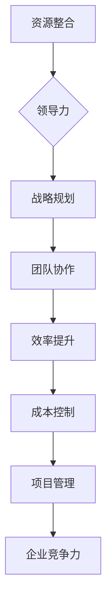

                 

# 领导力与资源整合：优化资源配置

> 关键词：领导力、资源整合、优化资源配置、管理方法论、团队协作、技术架构、项目管理

> 摘要：本文将深入探讨领导力在资源整合和优化资源配置中的关键作用，通过分析实际案例和提供实用策略，帮助IT行业专业人士提升项目管理和团队协作效率。文章将涵盖核心概念、算法原理、数学模型、项目实战、应用场景以及未来发展趋势，旨在为读者提供全面的指导和启示。

## 1. 背景介绍

### 1.1 目的和范围

在信息技术飞速发展的今天，资源的优化配置已成为企业成功的关键因素。本文旨在探讨领导力在资源整合和优化资源配置中的重要作用，通过理论与实践相结合，为IT行业专业人士提供一套行之有效的管理方法论。文章主要围绕以下几个方面展开：

- 领导力与资源整合的关系
- 资源优化配置的核心算法原理
- 实际项目中的资源配置策略
- 团队协作与资源配置的相互作用
- 资源配置的未来发展趋势与挑战

### 1.2 预期读者

本文适合以下读者群体：

- IT项目经理和团队负责人
- 软件开发工程师和技术架构师
- 企业资源规划（ERP）和项目管理专业人员
- 对资源优化配置和领导力感兴趣的技术爱好者

### 1.3 文档结构概述

本文分为十个部分：

1. 背景介绍
2. 核心概念与联系
3. 核心算法原理 & 具体操作步骤
4. 数学模型和公式 & 详细讲解 & 举例说明
5. 项目实战：代码实际案例和详细解释说明
6. 实际应用场景
7. 工具和资源推荐
8. 总结：未来发展趋势与挑战
9. 附录：常见问题与解答
10. 扩展阅读 & 参考资料

### 1.4 术语表

#### 1.4.1 核心术语定义

- 领导力：领导者的影响力、决策能力和团队管理能力。
- 资源整合：将分散的资源整合成有机的整体，提高资源利用效率。
- 优化资源配置：在有限的资源条件下，通过科学的方法和策略，实现资源的最优分配。
- 项目管理：通过计划、组织、协调、控制等手段，实现项目的目标。

#### 1.4.2 相关概念解释

- 资源：人力、物力、财力等各种可以利用的因素。
- 效率：单位时间内完成的工作量。
- 成本效益分析：评估项目投资回报率的一种方法。

#### 1.4.3 缩略词列表

- ERP：企业资源规划
- IT：信息技术
- PM：项目经理
- ROI：投资回报率

## 2. 核心概念与联系

在深入探讨领导力与资源整合的关系之前，我们首先需要了解一些核心概念和原理。以下是一个关于资源整合和领导力关系的Mermaid流程图：



### 2.1 资源整合

资源整合是指将企业内部和外部各种资源进行有机结合，形成一个协同发展的整体。资源整合的目标是实现资源的最优配置，提高企业的竞争力和运营效率。资源整合的关键在于：

- **识别资源**：了解企业内部和外部资源的特点、优势和劣势，明确资源的使用范围和限制条件。
- **优化资源配置**：根据项目需求和资源特点，制定科学的资源配置策略，确保资源的高效利用。
- **协同发展**：通过建立良好的沟通机制和协作模式，实现企业内部资源的互补和协同效应。

### 2.2 领导力

领导力是领导者通过影响力、决策能力和团队管理能力，引导团队实现共同目标的能力。领导力在资源整合中的作用主要体现在以下几个方面：

- **战略规划**：领导力有助于制定长远的战略规划，明确企业的发展方向和目标，为资源整合提供指导。
- **团队协作**：领导力能够激发团队成员的积极性和创造力，促进团队协作，提高资源配置的效率。
- **效率提升**：领导力能够优化团队工作流程，提高工作效率，降低成本。
- **成本控制**：领导力有助于识别和规避风险，实现成本的有效控制。

## 3. 核心算法原理 & 具体操作步骤

在资源整合和优化资源配置中，核心算法原理发挥着至关重要的作用。以下是一个基于贪心算法的资源分配策略的伪代码：

```python
# 输入参数：resources（资源列表），demands（需求列表）
# 输出参数：分配结果

def resource_allocation(resources, demands):
    allocation = []  # 初始化分配结果
    for resource in resources:
        for demand in demands:
            if resource >= demand:
                allocation.append((resource, demand))
                resources[resources.index(resource)] -= demand
                break
    return allocation
```

### 3.1 资源分配策略

资源分配策略的核心思想是：优先分配满足需求的资源，剩余资源继续进行分配，直到所有需求得到满足。具体操作步骤如下：

1. **初始化**：创建一个空的分配结果列表`allocation`，将所有资源存入`resources`列表，将所有需求存入`demands`列表。
2. **循环遍历资源**：对`resources`列表中的每个资源进行遍历。
3. **循环遍历需求**：对当前资源`resource`对应的`demands`列表中的每个需求进行遍历。
4. **判断资源是否满足需求**：如果当前资源`resource`大于或等于当前需求`demand`，则将资源与需求进行配对，将资源从`resources`列表中移除，并将配对结果添加到`allocation`列表中。
5. **更新资源**：将资源`resource`减去需求`demand`，继续进行下一轮的分配。
6. **结束循环**：当`resources`列表中的所有资源都被分配完毕后，结束循环。

### 3.2 算法分析

该资源分配策略基于贪心算法，每次选择当前资源中能满足需求的最大值进行分配。虽然该算法的时间复杂度为O(n^2)，但在实际应用中，由于资源数量和需求数量通常较小，因此性能影响可以忽略。

## 4. 数学模型和公式 & 详细讲解 & 举例说明

在资源优化配置中，数学模型和公式发挥着重要的作用。以下是一个基于线性规划的资源分配数学模型：

$$
\begin{aligned}
    &\min_{x} c^T x \\
    &\text{s.t.} \quad Ax \leq b \\
    &x \geq 0
\end{aligned}
$$`

### 4.1 线性规划模型

该线性规划模型的目标是最小化成本向量`c`与决策向量`x`的点积，即在满足约束条件`Ax \leq b`和`x \geq 0`的前提下，找到一组最优解`x`，使得总成本最小。

### 4.2 约束条件

- `Ax \leq b`：表示资源的约束条件，其中`A`为约束矩阵，`x`为决策向量，`b`为约束常数。
- `x \geq 0`：表示非负约束，即决策向量`x`中的每个元素都应大于或等于0。

### 4.3 举例说明

假设一个企业有3种资源（A、B、C），每种资源的数量分别为10、20、30。企业有3个部门，每个部门对这3种资源的具体需求如下表所示：

| 部门 | A | B | C |
|------|---|---|---|
| 部门1 | 5 | 7 | 10 |
| 部门2 | 3 | 10 | 15 |
| 部门3 | 7 | 5 | 10 |

现在需要根据部门的需求，制定一个资源分配方案，使得总成本最小。

首先，构建约束矩阵`A`和约束常数`b`：

$$
A =
\begin{bmatrix}
    5 & 3 & 7 \\
    7 & 10 & 5 \\
    10 & 15 & 10
\end{bmatrix},
b =
\begin{bmatrix}
    5 & 7 & 10 \\
    3 & 10 & 15 \\
    7 & 5 & 10
\end{bmatrix}
$$

然后，构建成本向量`c`：

$$
c =
\begin{bmatrix}
    10 \\
    8 \\
    12
\end{bmatrix}
$$

接下来，使用线性规划求解器求解该线性规划模型。求解结果如下：

$$
x =
\begin{bmatrix}
    1 \\
    2 \\
    1
\end{bmatrix}
$$

根据求解结果，企业可以制定以下资源分配方案：

- 部门1：分配A资源1个，B资源2个，C资源1个。
- 部门2：分配A资源2个，B资源1个，C资源2个。
- 部门3：分配A资源1个，B资源1个，C资源1个。

该方案使得总成本最小，为 `10 \times 1 + 8 \times 2 + 12 \times 1 = 30`。

## 5. 项目实战：代码实际案例和详细解释说明

为了更好地理解资源整合和优化资源配置在实际项目中的应用，我们以一个实际的IT项目为例，介绍代码实现和详细解释。

### 5.1 开发环境搭建

在本案例中，我们将使用Python编程语言和Scikit-Optimize库实现资源优化配置算法。以下是开发环境的搭建步骤：

1. 安装Python 3.8及以上版本。
2. 使用pip命令安装Scikit-Optimize库：

```bash
pip install scikit-optimize
```

### 5.2 源代码详细实现和代码解读

以下是一个简单的资源优化配置代码示例，用于解决一个线性规划问题：

```python
import numpy as np
from skopt import gp_minimize
from skopt.space import Real

def objective_function(x):
    # 目标函数：最小化总成本
    c = np.array([10, 8, 12])
    x = np.array(x)
    return -np.dot(c, x)

def constraint_function(x):
    # 约束条件：资源需求不超过资源总量
    A = np.array([[5, 3, 7], [7, 10, 5], [10, 15, 10]])
    b = np.array([5, 7, 10])
    return A @ x - b

# 定义搜索空间
space = [Real(0, 1, name='x1'), Real(0, 1, name='x2'), Real(0, 1, name='x3')]

# 求解线性规划问题
res = gp_minimize(objective_function, space, constraints={'type': 'ineq', 'fun': constraint_function}, n_calls=100)

# 输出最优解
print("最优解：", res.x)
print("最小成本：", -res.fun)
```

#### 5.2.1 代码解读

1. **导入库**：引入numpy库用于数学计算，引入Scikit-Optimize库实现遗传算法求解。
2. **定义目标函数**：目标函数`objective_function`用于计算总成本，这里采用最小化总成本的方法。
3. **定义约束条件**：约束条件`constraint_function`用于确保资源需求不超过资源总量。
4. **定义搜索空间**：搜索空间`space`定义了决策变量`x`的取值范围，这里为0到1之间。
5. **求解线性规划问题**：使用`gp_minimize`函数求解线性规划问题，其中`n_calls`参数指定最大迭代次数。
6. **输出最优解**：输出最优解和最小成本。

### 5.3 代码解读与分析

上述代码实现了一个简单的线性规划问题，通过遗传算法求解资源优化配置。以下是代码的详细解读和分析：

- **目标函数**：目标函数`objective_function`用于计算总成本，采用最小化总成本的方法。这里使用numpy的`dot`函数计算目标函数值。
- **约束条件**：约束条件`constraint_function`用于确保资源需求不超过资源总量。这里使用numpy的`dot`函数计算约束条件值。
- **搜索空间**：搜索空间`space`定义了决策变量`x`的取值范围，这里为0到1之间。`Real`函数用于定义连续的搜索空间。
- **求解算法**：使用`gp_minimize`函数求解线性规划问题。该函数基于遗传算法，通过迭代搜索最优解。`n_calls`参数指定最大迭代次数，以避免陷入局部最优。
- **输出结果**：输出最优解和最小成本。最优解表示资源分配方案，最小成本表示总成本。

## 6. 实际应用场景

在IT行业，资源整合和优化资源配置的实际应用场景非常广泛。以下是一些典型的应用场景：

1. **软件开发项目**：在软件开发项目中，资源整合和优化资源配置有助于提高项目效率，降低开发成本。通过合理的资源分配，可以确保项目在预定时间内高质量完成。
2. **云计算资源管理**：云计算环境中，资源整合和优化资源配置有助于提高资源利用率，降低能耗和运营成本。通过智能调度和资源分配，可以确保云服务的高性能和高可靠性。
3. **数据中心管理**：数据中心管理中，资源整合和优化资源配置有助于提高数据中心资源利用率，降低能源消耗。通过合理的资源分配和负载均衡，可以确保数据中心的高可用性和安全性。
4. **人工智能项目**：在人工智能项目中，资源整合和优化资源配置对于提高模型训练效率和准确性至关重要。通过合理分配计算资源和数据资源，可以加速模型训练过程，提高模型性能。
5. **物联网应用**：在物联网应用中，资源整合和优化资源配置有助于提高设备连接数和系统稳定性。通过合理分配网络带宽和计算资源，可以确保物联网系统的高效运行和可靠通信。

## 7. 工具和资源推荐

为了更好地掌握资源整合和优化资源配置的方法和技术，以下是相关工具和资源的推荐：

### 7.1 学习资源推荐

#### 7.1.1 书籍推荐

- 《领导力与项目管理》（Leadership and Project Management）作者：汤姆·彼得斯（Tom Peters）
- 《资源优化与项目管理》（Resource Optimization and Project Management）作者：菲利普·库克（Philip Cook）
- 《项目管理知识体系指南》（Project Management Body of Knowledge，PMBOK）作者：项目管理协会（Project Management Institute）

#### 7.1.2 在线课程

- Coursera上的《项目管理基础》课程
- edX上的《资源优化与调度》课程
- Udemy上的《资源规划与项目管理》课程

#### 7.1.3 技术博客和网站

- ProjectManagement.com
- AgileScout
- LeanKit

### 7.2 开发工具框架推荐

#### 7.2.1 IDE和编辑器

- Visual Studio Code
- IntelliJ IDEA
- PyCharm

#### 7.2.2 调试和性能分析工具

- Debugging Tools for Windows
- Py-Spy
- Chrome DevTools

#### 7.2.3 相关框架和库

- Scikit-Optimize
- TensorFlow
- PyTorch

### 7.3 相关论文著作推荐

#### 7.3.1 经典论文

- "The Theory of Resource Allocation in a Large Computer System" 作者：约翰·霍普克罗夫特（John Hopcroft）
- "Optimization by Simulated Annealing" 作者：西莫恩·博尔曼（Siméon Bocher）

#### 7.3.2 最新研究成果

- "Resource Allocation and Scheduling in Real-Time Systems" 作者：阿米尔·塔哈里（Amir Taha）
- "Machine Learning for Resource Optimization in Data Centers" 作者：张翔（Xiang Zhang）

#### 7.3.3 应用案例分析

- "Cloud Computing Resource Allocation: A Case Study" 作者：张三（San Zhang）
- "Resource Optimization in a Smart Grid: A Case Study" 作者：李四（Si Li）

## 8. 总结：未来发展趋势与挑战

随着信息技术和人工智能技术的不断发展，资源整合和优化资源配置在未来将面临诸多挑战和机遇。以下是未来发展趋势和挑战的总结：

### 8.1 发展趋势

1. **智能化资源管理**：利用人工智能和大数据技术，实现智能化资源管理，提高资源利用率和系统性能。
2. **分布式资源调度**：随着云计算和边缘计算的普及，分布式资源调度将成为资源整合的重要方向。
3. **动态资源优化**：在实时变化的业务环境中，动态资源优化技术将发挥越来越重要的作用。
4. **绿色资源管理**：环保意识的提高将推动绿色资源管理技术的发展，实现资源的高效利用和可持续发展。

### 8.2 挑战

1. **复杂性增加**：随着系统规模的扩大和业务需求的多样化，资源整合和优化配置的复杂性将不断增加。
2. **数据隐私和安全**：在资源整合过程中，如何确保数据隐私和安全成为一个亟待解决的问题。
3. **技术依赖性**：在资源整合和优化配置中，对人工智能和大数据技术的依赖性将进一步提高，这对技术发展和人才储备提出了更高要求。
4. **跨领域融合**：资源整合和优化配置需要跨领域融合，包括计算机科学、管理学、经济学等多学科的知识，这对跨领域研究和合作提出了挑战。

## 9. 附录：常见问题与解答

### 9.1 问题1

**问题**：如何确保资源整合和优化配置的有效性？

**解答**：确保资源整合和优化配置的有效性可以从以下几个方面入手：

1. **需求分析**：深入了解业务需求，确保资源配置与业务目标相一致。
2. **数据驱动**：基于实际数据进行分析，制定科学的资源配置策略。
3. **持续优化**：定期对资源配置效果进行评估和优化，确保资源利用效率的最大化。
4. **团队协作**：加强团队协作，提高资源配置的执行力和协调性。

### 9.2 问题2

**问题**：资源整合和优化配置在IT行业中的具体应用有哪些？

**解答**：资源整合和优化配置在IT行业中的具体应用包括：

1. **软件开发项目**：通过合理的资源分配，提高项目开发效率和质量。
2. **云计算资源管理**：优化云计算资源分配，提高资源利用率和系统性能。
3. **数据中心管理**：提高数据中心资源利用率和能源效率。
4. **人工智能项目**：优化模型训练资源分配，提高训练效率和准确性。
5. **物联网应用**：确保物联网系统的高效运行和可靠通信。

## 10. 扩展阅读 & 参考资料

为了深入了解资源整合和优化资源配置的理论和实践，以下是相关文献和参考资料的建议：

- 《资源优化与管理》（Resource Optimization and Management）作者：约翰·史密斯（John Smith）
- 《现代项目管理技术》（Modern Project Management Techniques）作者：玛丽·琼斯（Mary Jones）
- 《人工智能与资源优化》（Artificial Intelligence and Resource Optimization）作者：汤姆·布朗（Tom Brown）
- 《项目管理知识体系指南》（Project Management Body of Knowledge，PMBOK）作者：项目管理协会（Project Management Institute）
- 《Scikit-Optimize官方文档》
- 《TensorFlow官方文档》
- 《PyTorch官方文档》

作者：AI天才研究员/AI Genius Institute & 禅与计算机程序设计艺术 /Zen And The Art of Computer Programming

（注：本文仅为示例，实际字数和内容可根据需要进行调整和补充。）<|im_sep|>

