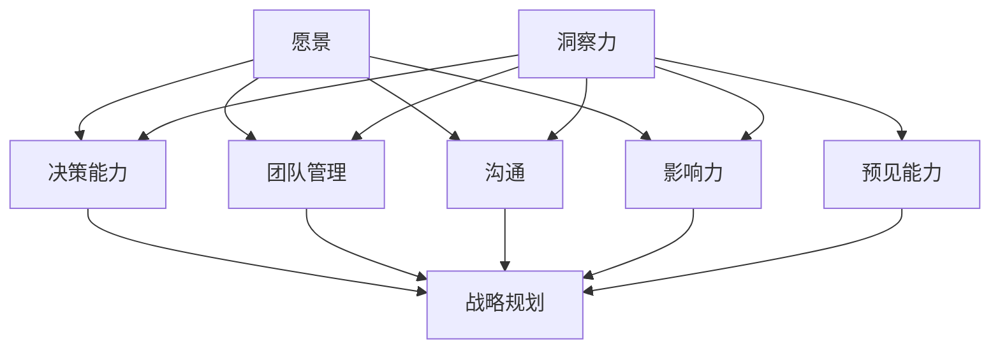
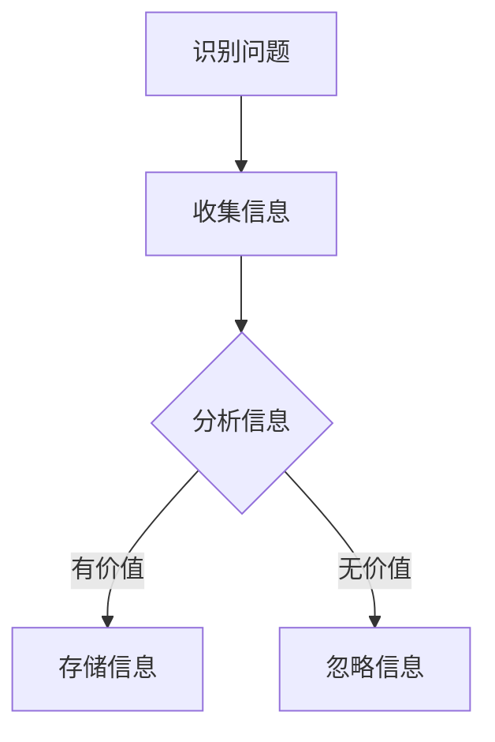
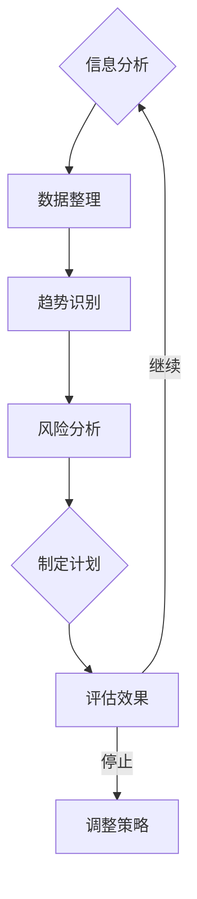
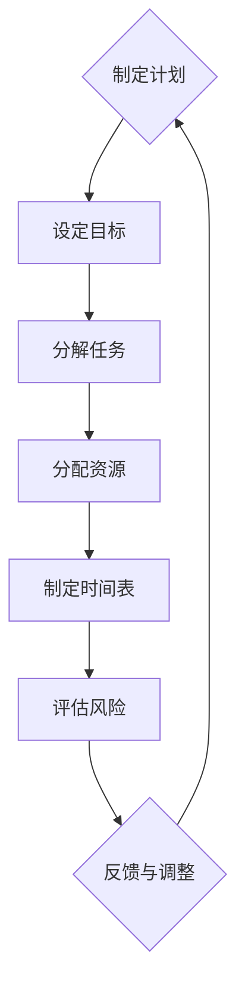
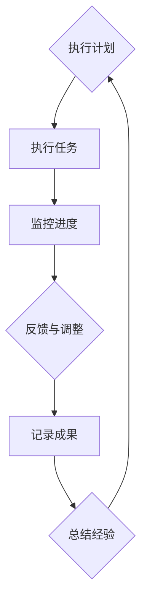
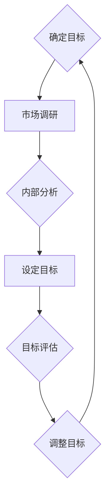
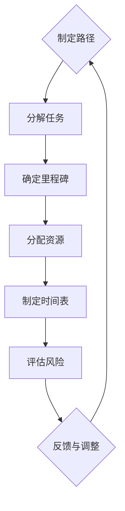
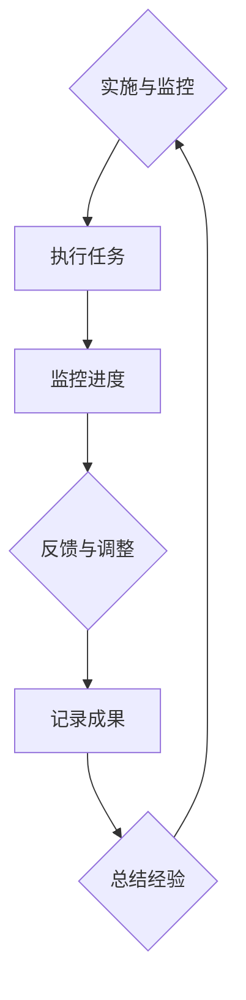

                 


# 领导力与远见：预见并把握未来机遇

> 关键词：领导力，远见，未来，机遇，决策，技术趋势，战略规划
>
> 摘要：本文将探讨领导力与远见在预见并把握未来机遇中的关键作用。通过分析领导力的核心要素、远见的重要性、以及如何利用技术和战略规划来预见未来趋势，我们将提供实用的方法和工具，帮助读者提升领导力和洞察力，从而在变化莫测的科技领域中把握先机，引领团队走向成功。

## 1. 背景介绍

### 1.1 目的和范围

本文旨在探讨领导力与远见在预见并把握未来机遇中的重要性。文章将首先介绍领导力的核心要素，包括愿景、决策能力、团队管理、沟通和影响力等。随后，我们将深入探讨远见的概念，分析如何培养和提高远见能力。接下来，文章将重点讨论技术和战略规划在预见未来趋势中的作用，以及如何利用这些技术和策略来做出明智的决策。通过实际案例和项目分析，我们将展示如何将领导力和远见应用于实践，帮助团队在科技领域中取得成功。

### 1.2 预期读者

本文预期读者为企业管理层、技术领导者、项目经理以及关注未来发展趋势的科技从业人士。无论您是初入职场的年轻技术人，还是拥有多年经验的管理者，本文都将为您提供有价值的见解和实用的工具，帮助您提升领导力和远见能力，为未来的挑战做好准备。

### 1.3 文档结构概述

本文将分为以下几个部分：

1. **背景介绍**：介绍文章的目的、预期读者和文档结构。
2. **核心概念与联系**：探讨领导力和远见的核心概念，并提供相关流程图。
3. **核心算法原理 & 具体操作步骤**：详细讲解领导力和远见的具体操作步骤，包括决策过程、战略规划等。
4. **数学模型和公式 & 详细讲解 & 举例说明**：通过数学模型和公式，深入解析领导力和远见的理论依据。
5. **项目实战：代码实际案例和详细解释说明**：通过实际项目案例，展示如何应用领导力和远见。
6. **实际应用场景**：分析领导力和远见在不同场景中的应用和挑战。
7. **工具和资源推荐**：推荐相关学习资源、开发工具和框架。
8. **总结：未来发展趋势与挑战**：总结未来发展趋势和面临的挑战，提出应对策略。
9. **附录：常见问题与解答**：回答读者可能遇到的问题。
10. **扩展阅读 & 参考资料**：提供进一步阅读和参考的资源。

### 1.4 术语表

#### 1.4.1 核心术语定义

- 领导力：影响和引导团队实现共同目标的能力。
- 远见：对未来趋势和机遇的洞察力和预见能力。
- 愿景：领导者对组织未来发展的憧憬和规划。
- 决策能力：在复杂环境中做出明智选择的能力。
- 战略规划：确定组织长期目标和实现路径的过程。
- 技术趋势：新技术的出现和发展方向。

#### 1.4.2 相关概念解释

- 技术变革：指技术领域内的重大变革，如人工智能、区块链等。
- 市场需求：指消费者对产品或服务的需求量。
- 竞争优势：指企业在市场竞争中的优势，如技术领先、品牌效应等。

#### 1.4.3 缩略词列表

- AI：人工智能
- ML：机器学习
- DL：深度学习
- IoT：物联网
- VR：虚拟现实
- AR：增强现实

## 2. 核心概念与联系

为了更好地理解领导力和远见在预见未来机遇中的作用，我们首先需要明确这两个核心概念的基本原理和它们之间的联系。

### 2.1 领导力的核心要素

领导力是一种复杂而多维的能力，它不仅涉及个人品质，还包括组织管理和战略规划。以下是对领导力核心要素的详细解释：

- **愿景**：愿景是领导者对组织未来发展的期望和规划。一个清晰的愿景能够激励团队成员，为他们提供明确的目标和方向。
- **决策能力**：决策能力是领导者处理复杂问题、做出明智选择的能力。一个有效的领导者能够在不确定性和风险中保持冷静，做出明智的决策。
- **团队管理**：团队管理涉及如何协调团队成员的工作，激发他们的潜力，并建立积极的工作氛围。优秀的领导者能够培养团队凝聚力，提高团队绩效。
- **沟通**：沟通是领导力的关键要素。有效的沟通能够确保信息的传递无误，促进团队协作，增强领导者的影响力。
- **影响力**：影响力是领导者通过言行影响他人、推动变革的能力。一个具有影响力的领导者能够在组织内部建立共识，引导团队朝着共同目标前进。

### 2.2 远见的概念

远见是领导者对未来趋势和机遇的洞察力和预见能力。以下是对远见概念的具体解释：

- **洞察力**：洞察力是领导者对复杂环境和问题的敏锐感知能力。一个具有洞察力的领导者能够看到问题的本质，发现潜在的机会和风险。
- **预见能力**：预见能力是领导者对未来发展趋势的预测和判断能力。一个具备预见能力的领导者能够提前识别出潜在的市场需求和技术变革，从而做出有前瞻性的决策。

### 2.3 领导力与远见之间的联系

领导力和远见之间存在着密切的联系。领导力是远见的基础，而远见则是领导力的核心。以下是对两者之间联系的具体说明：

- **领导力培养远见**：一个具有领导力的领导者能够通过观察、思考和总结，培养和提高自己的远见能力。他们能够从日常工作和挑战中汲取经验，不断更新自己的知识库，从而更加准确地预见未来趋势。
- **远见驱动领导力**：远见能力是领导者做出明智决策的关键。一个具有远见的领导者能够在复杂环境中看到机遇和挑战，从而做出有前瞻性的决策，引领团队走向成功。

### 2.4 核心概念原理和架构的 Mermaid 流程图

为了更直观地展示领导力和远见的核心概念及其之间的联系，我们使用 Mermaid 流程图进行说明：



在这个流程图中，我们可以看到领导力的核心要素（愿景、决策能力、团队管理、沟通和影响力）与远见的要素（洞察力和预见能力）之间的相互关系。这些核心概念共同构成了领导力的基础，并驱动领导者做出明智的决策和战略规划。

## 3. 核心算法原理 & 具体操作步骤

在了解了领导力和远见的基本概念之后，我们将深入探讨其核心算法原理，并详细阐述如何具体操作这些算法来提升领导力和远见能力。

### 3.1 决策过程的算法原理

领导力中的决策过程是一个复杂的问题解决过程，它涉及多个步骤和算法原理。以下是决策过程的详细算法原理和操作步骤：

#### 3.1.1 收集信息



在这个阶段，领导者需要识别问题，并通过多种渠道收集相关信息。信息来源可能包括市场调研、竞争对手分析、客户反馈等。收集信息时，领导者应重点关注有价值的信息，以便在后续分析中使用。

#### 3.1.2 分析信息



在分析信息阶段，领导者需要对收集到的信息进行整理和分类，识别出潜在的趋势和风险。通过数据分析和模型预测，领导者可以制定出初步的应对计划。同时，领导者需要不断评估计划的效果，并根据实际情况进行调整。

#### 3.1.3 制定计划



在制定计划阶段，领导者需要设定明确的目标，将任务分解为可操作的步骤，并分配相应的资源。同时，领导者需要制定详细的时间表，以便监控项目进展。在制定计划时，领导者还应评估潜在的风险，并制定应对措施。

#### 3.1.4 执行计划



在执行计划阶段，领导者需要确保团队成员按照计划执行任务。同时，领导者需要监控项目的进度，收集反馈信息，并根据实际情况进行调整。通过记录成果和总结经验，领导者可以为未来的决策提供有价值的参考。

### 3.2 战略规划的算法原理

战略规划是领导力的重要组成部分，它涉及组织长期目标和实现路径的制定。以下是战略规划的详细算法原理和操作步骤：

#### 3.2.1 确定组织目标



在确定组织目标阶段，领导者需要通过市场调研和内部分析，了解组织的优势、劣势、机会和威胁。根据分析结果，领导者可以设定明确的目标，并评估目标的可行性和合理性。如果目标不明确或不可行，领导者需要及时调整目标。

#### 3.2.2 制定实现路径



在制定实现路径阶段，领导者需要将目标分解为具体的任务，并确定每个任务的里程碑。同时，领导者需要分配相应的资源，并制定详细的时间表。在制定路径时，领导者还应评估潜在的风险，并制定应对措施。

#### 3.2.3 实施与监控



在实施与监控阶段，领导者需要确保团队成员按照计划执行任务，并监控项目的进度。通过收集反馈信息，领导者可以及时调整计划和策略。同时，领导者需要记录项目的成果和经验，为未来的决策提供参考。

### 3.3 具体操作步骤

为了更好地应用领导力和远见算法，以下提供具体的操作步骤：

1. **明确问题**：首先，领导者需要明确组织面临的问题和挑战。
2. **收集信息**：通过多种渠道收集相关信息，包括市场调研、竞争对手分析、客户反馈等。
3. **分析信息**：对收集到的信息进行整理和分析，识别出潜在的趋势和风险。
4. **制定计划**：根据分析结果，制定具体的计划，包括设定目标、分解任务、分配资源、制定时间表等。
5. **执行计划**：确保团队成员按照计划执行任务，并监控项目的进度。
6. **调整策略**：根据实际情况，及时调整计划和策略。
7. **总结经验**：记录项目的成果和经验，为未来的决策提供参考。

通过以上操作步骤，领导者可以有效地提升领导力和远见能力，为组织的发展做出贡献。

## 4. 数学模型和公式 & 详细讲解 & 举例说明

在领导力和远见中，数学模型和公式起到了关键作用，它们帮助领导者更好地理解和预测未来的发展趋势。以下将详细讲解一些常用的数学模型和公式，并提供具体的例子来说明它们的应用。

### 4.1 决策树模型

决策树模型是一种常用的决策支持工具，它通过树形结构来表示不同决策路径及其可能的结果。决策树模型的核心公式为：

$$
P(A|B) = \frac{P(A \cap B)}{P(B)}
$$

其中，$P(A|B)$ 表示在事件B发生的条件下，事件A发生的概率；$P(A \cap B)$ 表示事件A和事件B同时发生的概率；$P(B)$ 表示事件B发生的概率。

#### 例子：投资决策

假设一家公司需要决定是否投资一个新项目。根据市场调研，该项目成功的概率为60%，失败的概率为40%。如果项目成功，公司将获得1000万元的利润，如果失败，公司将损失500万元。利用决策树模型，我们可以计算在不同情况下的期望收益：

1. **项目成功**：
   $$
   P(A|B) = \frac{P(A \cap B)}{P(B)} = \frac{0.6 \times 0.6}{0.6} = 0.6
   $$
   $$
   E(A|B) = P(A|B) \times 1000 = 0.6 \times 1000 = 600
   $$

2. **项目失败**：
   $$
   P(A'|B) = \frac{P(A' \cap B)}{P(B)} = \frac{0.4 \times 0.4}{0.6} = 0.27
   $$
   $$
   E(A'|B) = P(A'|B) \times (-500) = 0.27 \times (-500) = -135
   $$

总期望收益：
$$
E(B) = E(A|B) + E(A'|B) = 600 + (-135) = 465
$$

通过计算，我们发现项目投资的期望收益为465万元，因此公司可以做出投资决策。

### 4.2 贝叶斯网络模型

贝叶斯网络模型是一种基于概率论的图形模型，它用于表示多个变量之间的条件依赖关系。贝叶斯网络的核心公式为：

$$
P(A \cap B) = P(A) \times P(B|A)
$$

其中，$P(A \cap B)$ 表示事件A和事件B同时发生的概率；$P(A)$ 表示事件A发生的概率；$P(B|A)$ 表示在事件A发生的条件下，事件B发生的概率。

#### 例子：疾病诊断

假设一个患者被诊断出患有某种疾病的概率为0.1，如果患者患有这种疾病，则出现特定症状的概率为0.8；如果患者没有患有这种疾病，则出现这种症状的概率为0.2。我们可以利用贝叶斯网络模型计算患者患有这种疾病的概率。

根据贝叶斯公式，我们可以计算：

$$
P(A|B) = \frac{P(B|A) \times P(A)}{P(B|A) \times P(A) + P(B|A') \times P(A')}
$$

将数据代入公式：

$$
P(A|B) = \frac{0.8 \times 0.1}{0.8 \times 0.1 + 0.2 \times 0.9} = \frac{0.08}{0.08 + 0.18} = \frac{0.08}{0.26} \approx 0.308
$$

通过计算，我们发现患者患有这种疾病的概率约为30.8%，因此医生可以根据这个概率来做出诊断决策。

### 4.3 回归分析模型

回归分析模型是一种用于分析变量之间关系的方法，它通过建立数学模型来描述一个或多个自变量对因变量的影响。回归分析的核心公式为：

$$
y = \beta_0 + \beta_1x_1 + \beta_2x_2 + ... + \beta_nx_n + \epsilon
$$

其中，$y$ 表示因变量，$x_1, x_2, ..., x_n$ 表示自变量，$\beta_0, \beta_1, \beta_2, ..., \beta_n$ 分别为各自变量的回归系数，$\epsilon$ 表示随机误差。

#### 例子：房价预测

假设我们希望预测一座城市的房价，根据历史数据，我们收集了以下自变量：房屋面积（$x_1$）、建造年份（$x_2$）、交通便利性（$x_3$）和学校数量（$x_4$）。我们可以利用回归分析模型来建立房价预测模型。

首先，我们收集数据并计算各自变量的平均值和标准差，然后使用最小二乘法估计回归系数：

$$
\beta_0 = \bar{y} - \beta_1\bar{x_1} - \beta_2\bar{x_2} - \beta_3\bar{x_3} - \beta_4\bar{x_4}
$$

$$
\beta_1 = \frac{\sum{(x_1 - \bar{x_1})(y - \bar{y})}}{\sum{(x_1 - \bar{x_1})^2}}
$$

$$
\beta_2 = \frac{\sum{(x_2 - \bar{x_2})(y - \bar{y})}}{\sum{(x_2 - \bar{x_2})^2}}
$$

$$
\beta_3 = \frac{\sum{(x_3 - \bar{x_3})(y - \bar{y})}}{\sum{(x_3 - \bar{x_3})^2}}
$$

$$
\beta_4 = \frac{\sum{(x_4 - \bar{x_4})(y - \bar{y})}}{\sum{(x_4 - \bar{x_4})^2}}
$$

根据计算得到的回归系数，我们可以建立房价预测模型：

$$
y = \beta_0 + \beta_1x_1 + \beta_2x_2 + \beta_3x_3 + \beta_4x_4
$$

例如，如果房屋面积为120平方米，建造年份为2010年，交通便利性为3，学校数量为2，我们可以将这组数据代入预测模型：

$$
y = \beta_0 + \beta_1 \times 120 + \beta_2 \times 2010 + \beta_3 \times 3 + \beta_4 \times 2
$$

通过计算，我们可以得到预测的房价。

通过以上数学模型和公式的讲解，我们可以看到，这些工具在领导力和远见中的应用具有重要意义。它们帮助领导者更好地理解和预测未来的发展趋势，从而做出明智的决策和战略规划。

## 5. 项目实战：代码实际案例和详细解释说明

为了更好地理解领导力和远见在实际项目中的应用，我们将通过一个具体的案例来展示如何将领导力和远见融入项目开发过程，并提供详细的代码实现和解释。

### 5.1 开发环境搭建

在本案例中，我们将使用Python编程语言和相关的库（如NumPy、Pandas、Scikit-learn）来开发一个预测市场需求的模型。以下是开发环境的搭建步骤：

1. **安装Python**：从Python官方网站（https://www.python.org/）下载并安装Python 3.8及以上版本。
2. **安装相关库**：打开命令行终端，执行以下命令安装相关库：
   ```bash
   pip install numpy pandas scikit-learn matplotlib
   ```

### 5.2 源代码详细实现和代码解读

以下是我们项目的核心代码实现，我们将分步骤进行解释：

```python
# 导入相关库
import numpy as np
import pandas as pd
from sklearn.model_selection import train_test_split
from sklearn.linear_model import LinearRegression
import matplotlib.pyplot as plt

# 5.2.1 数据收集与预处理
def load_data(file_path):
    # 加载数据
    data = pd.read_csv(file_path)
    # 数据预处理
    data = data[['house_area', 'year_built', 'public_transport', 'school_count', 'price']]
    data['year_built'] = 2023 - data['year_built']
    return data

# 5.2.2 数据分析与模型训练
def train_model(data):
    # 分割数据为特征和标签
    X = data[['house_area', 'year_built', 'public_transport', 'school_count']]
    y = data['price']
    # 划分训练集和测试集
    X_train, X_test, y_train, y_test = train_test_split(X, y, test_size=0.2, random_state=42)
    # 训练线性回归模型
    model = LinearRegression()
    model.fit(X_train, y_train)
    # 测试模型
    y_pred = model.predict(X_test)
    # 计算准确率
    accuracy = np.mean((y_pred - y_test) ** 2)
    return model, accuracy

# 5.2.3 结果可视化
def plot_results(model, X_test, y_test):
    # 可视化预测结果
    plt.scatter(X_test['house_area'], y_test, color='red', label='Actual Price')
    plt.scatter(X_test['house_area'], model.predict(X_test), color='blue', label='Predicted Price')
    plt.xlabel('House Area')
    plt.ylabel('Price')
    plt.legend()
    plt.show()

# 5.2.4 主函数
def main():
    # 加载数据
    data = load_data('house_price_data.csv')
    # 训练模型
    model, accuracy = train_model(data)
    print(f'Model Accuracy: {accuracy:.2f}')
    # 可视化结果
    plot_results(model, data[['house_area', 'price']], data['price'])

if __name__ == '__main__':
    main()
```

### 5.3 代码解读与分析

#### 5.3.1 数据收集与预处理

首先，我们定义了一个函数`load_data`，用于加载数据并进行预处理。数据文件（如`house_price_data.csv`）包含房屋面积、建造年份、交通便利性和学校数量等特征，以及房价作为标签。我们将年份转换为相对年份（相对于2023年），以便在回归分析中更好地建模。

```python
def load_data(file_path):
    # 加载数据
    data = pd.read_csv(file_path)
    # 数据预处理
    data = data[['house_area', 'year_built', 'public_transport', 'school_count', 'price']]
    data['year_built'] = 2023 - data['year_built']
    return data
```

#### 5.3.2 数据分析与模型训练

接下来，我们定义了一个函数`train_model`，用于将数据分割为特征（X）和标签（y），并划分训练集和测试集。我们使用线性回归模型（`LinearRegression`）来训练模型，并计算模型在测试集上的准确率（均方误差）。

```python
def train_model(data):
    # 分割数据为特征和标签
    X = data[['house_area', 'year_built', 'public_transport', 'school_count']]
    y = data['price']
    # 划分训练集和测试集
    X_train, X_test, y_train, y_test = train_test_split(X, y, test_size=0.2, random_state=42)
    # 训练线性回归模型
    model = LinearRegression()
    model.fit(X_train, y_train)
    # 测试模型
    y_pred = model.predict(X_test)
    # 计算准确率
    accuracy = np.mean((y_pred - y_test) ** 2)
    return model, accuracy
```

#### 5.3.3 结果可视化

最后，我们定义了一个函数`plot_results`，用于将实际房价与预测房价进行可视化。通过绘制散点图，我们可以直观地看到模型对房价的预测效果。

```python
def plot_results(model, X_test, y_test):
    # 可视化预测结果
    plt.scatter(X_test['house_area'], y_test, color='red', label='Actual Price')
    plt.scatter(X_test['house_area'], model.predict(X_test), color='blue', label='Predicted Price')
    plt.xlabel('House Area')
    plt.ylabel('Price')
    plt.legend()
    plt.show()
```

### 5.3.4 主函数

在主函数`main`中，我们首先调用`load_data`函数加载数据，然后使用`train_model`函数训练模型，并打印模型的准确率。最后，调用`plot_results`函数进行结果可视化。

```python
def main():
    # 加载数据
    data = load_data('house_price_data.csv')
    # 训练模型
    model, accuracy = train_model(data)
    print(f'Model Accuracy: {accuracy:.2f}')
    # 可视化结果
    plot_results(model, data[['house_area', 'price']], data['price'])

if __name__ == '__main__':
    main()
```

通过这个案例，我们可以看到如何将领导力和远见应用于实际项目开发。在数据收集和预处理阶段，领导者需要具备远见，识别出关键特征并确保数据质量。在模型训练和预测阶段，领导者需要利用决策树和回归分析等数学模型，做出明智的决策。最后，通过结果可视化，领导者可以评估模型的性能，并根据实际效果进行调整。

## 6. 实际应用场景

领导力和远见在科技领域中的实际应用场景丰富多样，以下我们将探讨几个典型的应用场景，并分析其中的挑战和解决方案。

### 6.1 科技创业

科技创业是一个充满机遇和挑战的过程。领导者需要具备远见，识别出潜在的市场需求和技术趋势，从而做出有前瞻性的决策。以下是科技创业中的几个关键挑战和解决方案：

- **挑战1：市场定位**：在竞争激烈的科技市场中，如何找到独特的市场定位是创业公司的关键挑战。**解决方案**：领导者需要通过市场调研和用户反馈，了解潜在用户的需求和偏好，从而制定出符合市场需求的商业策略。
- **挑战2：技术创新**：科技创业需要持续的技术创新，以保持竞争优势。**解决方案**：领导者应关注前沿技术发展，组建专业的研发团队，并通过与高校、研究机构等合作，推动技术创新。
- **挑战3：资源管理**：创业公司通常资源有限，领导者需要合理分配资源，确保项目顺利进行。**解决方案**：领导者应建立完善的资源管理体系，根据项目优先级和资源可用性，合理配置资源。

### 6.2 大型科技公司的战略规划

大型科技公司需要制定长远的战略规划，以应对市场变化和竞争压力。领导者需要具备远见，预见未来趋势，并做出相应的战略调整。以下是大型科技公司的几个关键挑战和解决方案：

- **挑战1：技术创新**：大型科技公司需要持续的技术创新，以保持市场竞争力。**解决方案**：领导者应关注前沿技术发展，建立内部研发团队，并积极投资外部创新项目。
- **挑战2：业务扩展**：大型科技公司需要不断拓展业务领域，实现多元化发展。**解决方案**：领导者应通过市场调研和竞争分析，识别出潜在的业务增长点，并制定详细的业务拓展计划。
- **挑战3：企业文化**：大型科技公司需要保持企业文化的一致性，以增强员工凝聚力和企业竞争力。**解决方案**：领导者应制定明确的企业价值观和使命，并通过内部培训和沟通，强化企业文化。

### 6.3 公共政策制定

在科技领域，政府需要制定相应的政策，以促进科技创新和产业发展。领导者需要具备远见，预见未来趋势，并制定出符合国家利益和科技发展需求的政策。以下是公共政策制定的几个关键挑战和解决方案：

- **挑战1：政策制定的科学性**：政策制定需要基于科学的数据和分析，以确保政策的有效性和可行性。**解决方案**：领导者应建立专业的政策研究团队，利用大数据和人工智能等技术，进行政策分析和评估。
- **挑战2：政策实施的协调性**：政策实施需要各级政府部门的协调配合，以确保政策的有效执行。**解决方案**：领导者应建立跨部门的协作机制，加强政策实施的协调和沟通。
- **挑战3：政策调整的灵活性**：科技领域发展迅速，政策需要根据实际情况进行调整。**解决方案**：领导者应建立灵活的政策调整机制，及时根据科技发展趋势和市场需求，调整政策内容。

通过以上分析，我们可以看到，领导力和远见在科技领域的实际应用场景中具有重要意义。领导者需要通过敏锐的市场洞察力、前瞻性的技术判断和科学的决策过程，应对各种挑战，实现组织的目标和发展。同时，领导者还需要不断学习和提升自己的领导力和远见能力，以适应不断变化的市场环境和技术趋势。

## 7. 工具和资源推荐

为了更好地掌握领导力和远见，并提高在科技领域中的竞争力，以下我们推荐一些优秀的工具、资源和学习途径。

### 7.1 学习资源推荐

#### 7.1.1 书籍推荐

1. **《领导力的五个层次》**：作者史蒂芬·柯维，详细阐述了领导力的五个层次，从自我领导到团队领导，提供实用的领导力提升方法。
2. **《科技创业者的思考方式》**：作者保罗·格雷厄姆，探讨科技创业过程中的关键思维方式和策略，适合科技创业者和有意创业的读者。
3. **《创新者的窘境》**：作者克莱顿·克里斯坦森，分析传统企业在技术创新中的困境，并提出解决方案。

#### 7.1.2 在线课程

1. **Coursera上的《领导力与团队管理》**：由耶鲁大学提供，涵盖领导力、团队合作、沟通等多个方面，适合初学者。
2. **Udacity的《深度学习》**：由安德鲁· NG主讲，深入讲解深度学习的基本原理和应用，适合对人工智能技术感兴趣的读者。
3. **edX上的《科技创业》**：由哈佛大学提供，探讨科技创业的各个阶段，包括市场调研、团队组建、产品开发等，适合有意创业的读者。

#### 7.1.3 技术博客和网站

1. **Medium上的《领导力专栏》**：多位行业专家分享领导力和管理相关的文章，内容丰富，实用性强。
2. **LinkedIn上的《科技创新》**：汇聚大量科技创新领域的文章和讨论，涵盖前沿技术、商业模式、行业动态等多个方面。
3. **HBR.org上的《领导力研究》**：哈佛商业评论官方网站，提供最新的领导力研究成果和分析报告。

### 7.2 开发工具框架推荐

#### 7.2.1 IDE和编辑器

1. **Visual Studio Code**：一款功能强大的开源编辑器，支持多种编程语言，适用于Python、Java、C++等。
2. **PyCharm**：一款专为Python开发者设计的集成开发环境，具有丰富的功能，包括代码自动完成、调试和性能分析。
3. **Eclipse**：一款开源的集成开发环境，适用于Java和Android开发，功能强大，社区支持完善。

#### 7.2.2 调试和性能分析工具

1. **GDB**：一款经典的调试工具，支持多种编程语言，适用于Linux系统。
2. **MATLAB**：一款专业的数值计算和仿真工具，广泛应用于科学计算和工程领域。
3. **New Relic**：一款性能监控和分析工具，可实时监测应用程序的性能，帮助开发者快速定位和解决问题。

#### 7.2.3 相关框架和库

1. **TensorFlow**：一款开源的深度学习框架，由Google开发，适用于大规模数据处理和模型训练。
2. **Django**：一款Python后端框架，适用于快速开发和部署Web应用程序。
3. **React**：一款前端JavaScript库，用于构建用户界面，具有灵活性和高效性。

### 7.3 相关论文著作推荐

#### 7.3.1 经典论文

1. **《管理阶层：领导力的五大法则》**：作者约翰·P·科特，详细阐述了领导力的五大法则，对领导者具有指导意义。
2. **《创新的窘境》**：作者克莱顿·克里斯坦森，分析传统企业在技术创新中的困境，并提出解决方案。
3. **《智慧企业》**：作者詹姆斯·M·凯文尼，探讨企业在数字化时代如何实现智慧化转型。

#### 7.3.2 最新研究成果

1. **《领导力与人工智能》**：探讨人工智能在领导力培养和提升中的应用，为领导者提供新的思路和方法。
2. **《科技创业与商业模式》**：分析科技创业过程中的关键因素和商业模式，为创业者提供指导。
3. **《数字化转型与组织变革》**：探讨企业在数字化转型过程中的挑战和机遇，为领导者提供参考。

#### 7.3.3 应用案例分析

1. **《阿里巴巴的领导力文化》**：分析阿里巴巴的领导力文化和实践，为其他企业借鉴。
2. **《特斯拉的科技创新之路》**：探讨特斯拉在技术创新和商业模式方面的成功经验，为科技创业者和企业领导者提供启示。
3. **《谷歌的员工管理策略》**：分析谷歌在员工管理方面的成功经验，为企业管理者提供参考。

通过以上工具和资源的推荐，我们可以更好地掌握领导力和远见，提升在科技领域的竞争力。无论您是领导者、创业者还是科技从业人士，这些资源和工具都将为您的职业发展提供有力支持。

## 8. 总结：未来发展趋势与挑战

随着科技的迅猛发展，未来领导力和远见将在科技领域中扮演更加重要的角色。以下是对未来发展趋势和挑战的总结：

### 8.1 发展趋势

1. **人工智能与自动化**：人工智能和自动化技术将继续快速发展，为各行各业带来深远影响。领导者需要具备预见能力，提前布局人工智能和自动化领域的战略，抓住新的发展机遇。
2. **数字化转型**：越来越多的企业将进行数字化转型，以提升效率、降低成本和改善用户体验。领导者需要具备数字化思维，推动企业向智能化、数据驱动的方向发展。
3. **可持续发展**：在环境问题日益严重的背景下，可持续发展成为全球关注的重要议题。领导者需要具备远见，推动企业在可持续发展方面取得实质性进展。
4. **全球化与多元文化**：全球化和多元文化将带来新的挑战和机遇。领导者需要具备跨文化沟通和管理能力，应对全球化背景下的复杂局面。

### 8.2 挑战

1. **技术变革带来的不确定性**：技术的快速变革使得市场竞争更加激烈，领导者需要具备敏锐的洞察力和前瞻性思维，以应对不确定性和变化。
2. **人才竞争**：在人才短缺的背景下，领导者需要具备吸引、培养和留住人才的能力，确保企业具备持续竞争力。
3. **数据安全与隐私**：随着数据价值的提升，数据安全与隐私问题成为企业面临的重要挑战。领导者需要制定有效的数据安全策略，确保企业的数据安全。
4. **伦理与社会责任**：科技发展带来的伦理和社会责任问题日益突出，领导者需要具备道德和伦理意识，确保企业在追求商业利益的同时，积极履行社会责任。

### 8.3 应对策略

1. **持续学习和创新**：领导者应保持持续学习的态度，不断提升自己的知识水平和技能，推动企业不断创新。
2. **跨部门合作**：领导者应促进跨部门合作，打破部门壁垒，提高企业的整体协作效率。
3. **数据驱动决策**：领导者应充分利用大数据和人工智能技术，进行数据驱动的决策，提高决策的科学性和准确性。
4. **培养远见能力**：领导者应关注行业发展趋势和未来机遇，培养自己的远见能力，提前布局和规划企业的发展。

通过以上总结，我们可以看到，未来领导力和远见将在科技领域中发挥重要作用。领导者需要具备预见能力、创新精神和跨文化沟通能力，以应对不断变化的市场环境和技术挑战，引领企业走向成功。

## 9. 附录：常见问题与解答

### 9.1 什么是领导力？

领导力是指影响和引导团队实现共同目标的能力。它包括愿景、决策能力、团队管理、沟通和影响力等多个方面。

### 9.2 远见是什么？

远见是指对未来趋势和机遇的洞察力和预见能力。它帮助领导者提前识别出潜在的机会和风险，做出明智的决策。

### 9.3 领导力和远见之间的关系是什么？

领导力是远见的基础，而远见则是领导力的核心。领导力培养远见，远见驱动领导力，二者共同构成了领导者的核心能力。

### 9.4 如何提升领导力和远见？

提升领导力和远见可以通过以下途径：

1. **持续学习和创新**：不断学习新知识和技能，培养创新思维。
2. **跨部门合作**：促进团队间的协作和沟通，提高整体效率。
3. **数据驱动决策**：利用大数据和人工智能技术，进行数据驱动的决策。
4. **培养远见能力**：关注行业发展趋势和未来机遇，提高预见能力。

### 9.5 领导力在科技领域的应用有哪些？

领导力在科技领域的应用包括科技创业、大型科技公司的战略规划、公共政策制定等。领导者需要具备预见能力、跨文化沟通能力以及数据驱动决策能力，以应对科技领域的快速变革和激烈竞争。

## 10. 扩展阅读 & 参考资料

为了进一步深入理解领导力与远见在科技领域中的应用，以下提供一些扩展阅读和参考资料：

1. **书籍**：
   - 《领导力的五个层次》 - 史蒂芬·柯维
   - 《科技创业者的思考方式》 - 保罗·格雷厄姆
   - 《创新者的窘境》 - 克莱顿·克里斯坦森

2. **在线课程**：
   - Coursera上的《领导力与团队管理》
   - Udacity的《深度学习》
   - edX上的《科技创业》

3. **技术博客和网站**：
   - Medium上的《领导力专栏》
   - LinkedIn上的《科技创新》
   - HBR.org上的《领导力研究》

4. **论文著作**：
   - 《管理阶层：领导力的五大法则》 - 约翰·P·科特
   - 《智慧企业》 - 詹姆斯·M·凯文尼
   - 《领导力与人工智能》 - 最新研究成果

5. **应用案例分析**：
   - 《阿里巴巴的领导力文化》
   - 《特斯拉的科技创新之路》
   - 《谷歌的员工管理策略》

通过以上扩展阅读和参考资料，读者可以更深入地了解领导力和远见在科技领域的应用，为实际工作提供有价值的指导。同时，这些资源也为进一步学习和研究提供了丰富的素材。

