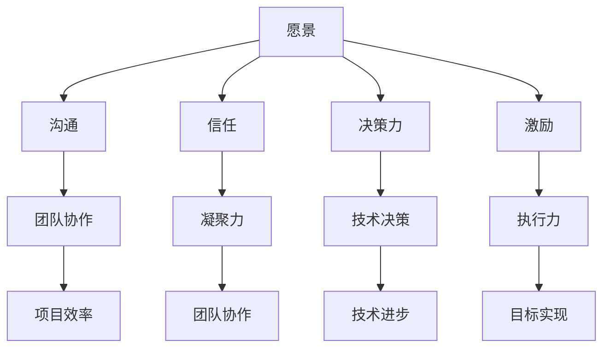
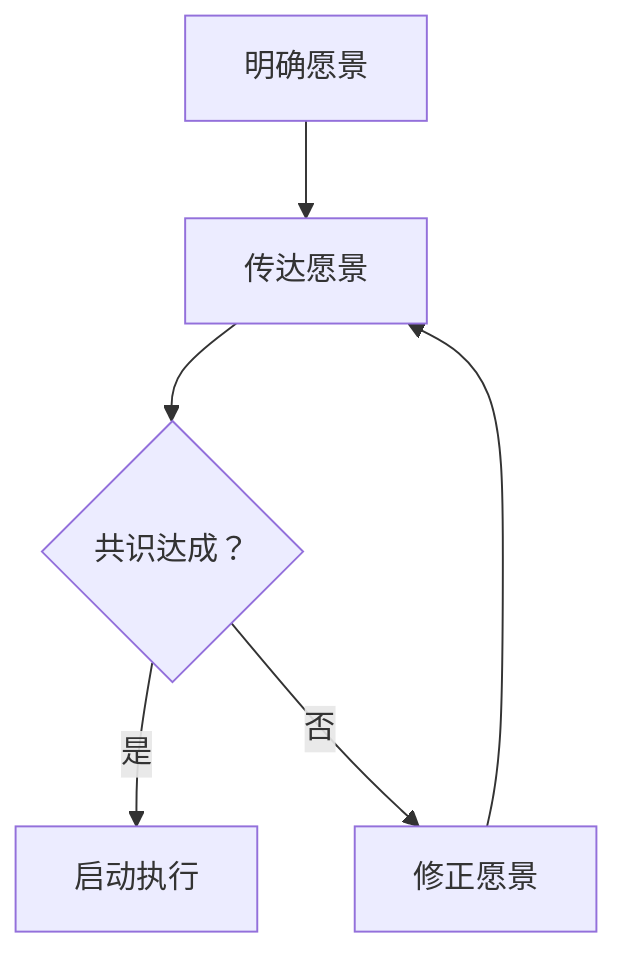
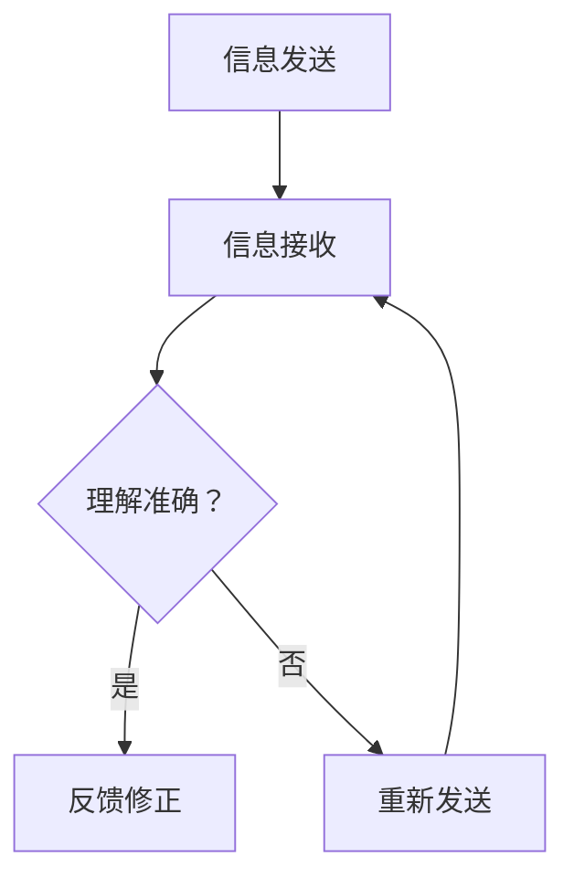
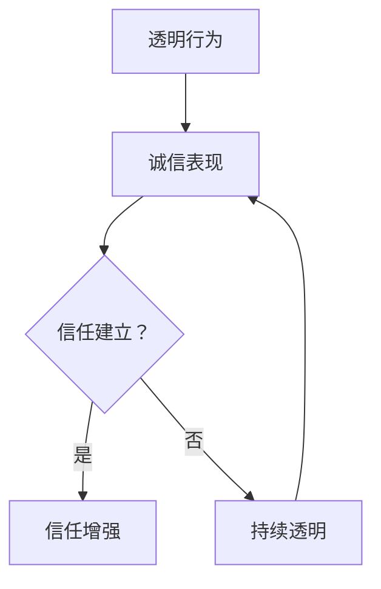
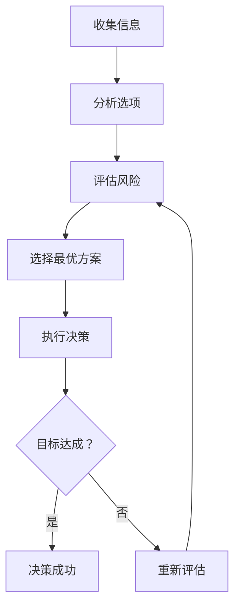
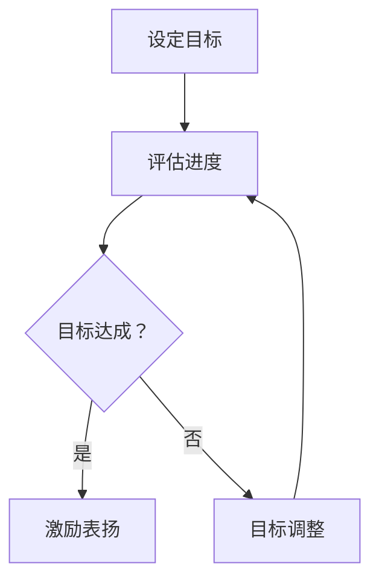

                 

# 领导力修炼手册：从工程总监到管理者的蜕变宝典

> 关键词：领导力、工程总监、管理者、蜕变、技能提升、团队建设、沟通能力、决策力、项目管理

> 摘要：本文将探讨从工程总监到管理者的转变过程，通过分析领导力的核心要素，分享如何在职业生涯中实现这一重要蜕变。本文旨在为工程背景的技术专家提供一套实用的领导力修炼手册，帮助他们在管理和领导角色中更加自信和成功。

## 1. 背景介绍

### 1.1 目的和范围

本文的目标是帮助工程总监级的技术专家在职业生涯中实现向管理者的转变，提升领导力，更好地应对管理挑战。文章将涵盖以下内容：

- 领导力的核心要素
- 从技术专家到管理者的转变过程
- 管理技能的提升途径
- 团队建设和沟通能力的培养
- 决策力和项目管理技巧的掌握

### 1.2 预期读者

本文适用于以下读者群体：

- 正在考虑或即将转变为管理者的工程总监
- 担任技术团队领导但希望提升管理能力的专业人士
- 想要了解领导力重要性的技术爱好者

### 1.3 文档结构概述

本文将分为以下章节：

- 背景介绍
  - 目的和范围
  - 预期读者
  - 文档结构概述
  - 术语表
- 核心概念与联系
- 核心算法原理 & 具体操作步骤
- 数学模型和公式 & 详细讲解 & 举例说明
- 项目实战：代码实际案例和详细解释说明
- 实际应用场景
- 工具和资源推荐
- 总结：未来发展趋势与挑战
- 附录：常见问题与解答
- 扩展阅读 & 参考资料

### 1.4 术语表

#### 1.4.1 核心术语定义

- 工程总监：负责技术团队管理和项目执行的高级职位。
- 领导力：影响、激励和引导团队成员实现共同目标的能力。
- 管理者：负责组织、协调和监督团队工作的职位。

#### 1.4.2 相关概念解释

- 团队建设：通过培养团队协作精神和共同目标，提高团队整体绩效的过程。
- 沟通能力：有效地传递信息、听取意见和解决冲突的能力。
- 决策力：在不确定性和压力下做出明智、有效决策的能力。

#### 1.4.3 缩略词列表

- CTO：首席技术官
- PM：项目经理
- DevOps：开发与运维
- SCRUM：敏捷开发框架

## 2. 核心概念与联系

在探讨领导力之前，我们首先需要明确一些核心概念，这些概念将贯穿整个文章，帮助读者更好地理解领导力的本质。

### 2.1 领导力与管理的区别

领导力（Leadership）和管理（Management）虽然密切相关，但两者有本质的区别。领导力关注的是激发和引导团队成员的潜能，而管理则侧重于协调资源、规划和执行任务。以下是领导力与管理的对比：

| 领导力 | 管理 |
| --- | --- |
| 激发热情 | 规划资源 |
| 长期愿景 | 短期目标 |
| 个人影响力 | 组织结构 |
| 创新思维 | 运营效率 |

### 2.2 领导力的核心要素

领导力的核心要素包括以下几个方面：

- **愿景**：清晰的愿景是领导力的灵魂，它能够激励团队成员共同朝着目标前进。
- **沟通**：有效的沟通能力是领导力的关键，它能够确保团队成员理解愿景并积极参与。
- **信任**：建立信任关系是领导力的基石，它能够增强团队的凝聚力和协作精神。
- **决策力**：在不确定性和压力下做出明智决策是领导力的重要体现。
- **激励**：激励团队成员是实现目标的重要手段，它能够提高团队的士气和执行力。

### 2.3 领导力与技术的关联

对于工程总监来说，技术背景是他们的优势，但领导力同样重要。以下是领导力与技术的关联：

- **技术知识**：技术总监需要具备扎实的专业知识和技能，以解决技术难题。
- **团队协作**：领导力能够促进团队成员之间的协作，提高项目效率。
- **创新能力**：领导力鼓励创新思维，推动技术团队不断进步。
- **决策能力**：领导力帮助技术总监在技术决策中更加明智和果断。

### 2.4 领导力与管理的 Mermaid 流程图

以下是一个简单的 Mermaid 流程图，展示了领导力与管理的关联：



通过这个流程图，我们可以看到领导力在管理中的重要性，以及领导力如何促进团队的成功。

## 3. 核心算法原理 & 具体操作步骤

### 3.1 领导力的核心算法原理

领导力并非一门科学，但其中确实蕴含着一些可以被抽象和量化的核心算法原理。以下是几个关键的算法原理：

#### 3.1.1 愿景共识算法



愿景共识算法的核心是明确愿景并将其传达给团队成员，通过持续沟通和反馈，确保团队成员对愿景达成共识，从而启动执行过程。

#### 3.1.2 沟通传播算法



沟通传播算法强调信息的准确传递和理解，通过反馈和修正，确保信息的完整性和准确性。

#### 3.1.3 信任建立算法



信任建立算法依赖于透明的行为和诚信的表现，通过不断积累，建立和维护团队成员之间的信任关系。

#### 3.1.4 决策优化算法



决策优化算法涉及信息的收集、选项的分析、风险的评估和最优方案的选择，通过执行和反馈，不断优化决策过程。

#### 3.1.5 激励反馈算法



激励反馈算法通过设定目标、评估进度和激励表扬，激发团队成员的积极性，推动目标的达成。

### 3.2 领导力的具体操作步骤

在了解了领导力的核心算法原理后，以下是一些具体的操作步骤，帮助技术专家实现从工程总监到管理者的转变：

#### 3.2.1 明确愿景

- 与团队成员分享愿景，确保他们理解并认同。
- 定期更新愿景，保持团队的共同目标。

#### 3.2.2 提高沟通能力

- 借助各种沟通工具，如会议、邮件、即时通讯等，确保信息的准确传递。
- 建立反馈机制，鼓励团队成员提出意见和建议。

#### 3.2.3 建立信任关系

- 通过透明的行为和诚信的表现，赢得团队成员的信任。
- 倡导团队合作，共同承担责任。

#### 3.2.4 提升决策力

- 在面对不确定性时，收集更多信息，分析多种方案。
- 培养冒险精神，勇于承担风险。

#### 3.2.5 激发团队潜力

- 设定明确的目标和期望，激励团队成员不断进步。
- 通过表扬和奖励，提高团队的士气和执行力。

## 4. 数学模型和公式 & 详细讲解 & 举例说明

### 4.1 数学模型介绍

在领导力中，数学模型可以用来量化一些关键因素，帮助我们更好地理解和应用领导力原理。以下是一些常见的数学模型：

#### 4.1.1 成本效益分析（CBA）

成本效益分析是一种常用的决策模型，用于评估项目的成本和效益。其公式如下：

$$
CBA = \frac{净收益}{总成本}
$$

其中，净收益是指项目的总收益减去总成本。

#### 4.1.2 离散选择模型（Discrete Choice Model）

离散选择模型用于分析团队成员对决策选项的选择偏好。其基本公式为：

$$
P(X=x_i) = \frac{e^{\beta_0 + \beta_1 x_i}}{\sum_{j=1}^{J} e^{\beta_0 + \beta_1 x_j}}
$$

其中，\(P(X=x_i)\) 表示选择选项 \(i\) 的概率，\(\beta_0\) 和 \(\beta_1\) 是参数。

#### 4.1.3 马尔可夫链（Markov Chain）

马尔可夫链用于模拟团队成员的行为变化。其基本公式为：

$$
P(X_t = x_t | X_{t-1} = x_{t-1}) = P(X_t = x_t)
$$

其中，\(P(X_t = x_t | X_{t-1} = x_{t-1})\) 表示在给定前一状态 \(X_{t-1}\) 下，当前状态 \(X_t\) 的概率。

### 4.2 数学模型详细讲解

#### 4.2.1 成本效益分析（CBA）

成本效益分析是一种重要的决策工具，可以帮助我们评估项目的可行性。以下是成本效益分析的详细讲解：

1. **成本计算**：首先，我们需要计算项目的总成本，包括直接成本和间接成本。直接成本包括人力、物料、设备等直接投入的成本；间接成本包括管理费用、维护费用等。

2. **收益计算**：接下来，我们需要预测项目的总收益，包括直接收益和间接收益。直接收益包括销售收入、利润等；间接收益包括品牌价值提升、客户满意度等。

3. **净收益计算**：将总收益减去总成本，得到净收益。净收益是评估项目是否可行的关键指标。

4. **决策依据**：如果净收益为正，说明项目具有经济效益，可以继续进行。如果净收益为负，说明项目成本过高，需要重新评估。

#### 4.2.2 离散选择模型（Discrete Choice Model）

离散选择模型是一种常用的市场研究方法，可以帮助我们了解团队成员对决策选项的偏好。以下是离散选择模型的详细讲解：

1. **参数估计**：首先，我们需要收集团队成员对决策选项的偏好数据，并通过统计方法估计参数 \(\beta_0\) 和 \(\beta_1\)。

2. **概率计算**：然后，我们可以根据估计的参数计算每个选项被选择的概率。

3. **决策分析**：通过比较不同选项的偏好概率，我们可以分析团队成员对不同决策选项的偏好，并据此做出决策。

4. **模型应用**：离散选择模型可以应用于各种决策场景，如项目选型、产品定位、团队激励等。

#### 4.2.3 马尔可夫链（Markov Chain）

马尔可夫链是一种用于模拟随机过程的数学模型，可以帮助我们分析团队成员的行为变化。以下是马尔可夫链的详细讲解：

1. **状态定义**：首先，我们需要定义团队成员的行为状态。例如，可以将状态分为工作状态、休息状态、学习状态等。

2. **概率矩阵**：然后，我们可以构建一个概率矩阵，表示在给定前一状态下，当前状态的概率。

3. **状态转移**：通过概率矩阵，我们可以模拟团队成员在不同状态之间的转移过程。

4. **行为分析**：通过分析状态转移概率，我们可以了解团队成员的行为模式，为团队管理提供依据。

### 4.3 数学模型举例说明

#### 4.3.1 成本效益分析（CBA）

假设一个技术团队正在考虑一个新项目，项目的直接成本为100万元，间接成本为50万元，预计的直接收益为150万元，间接收益为50万元。我们可以使用成本效益分析（CBA）模型来评估该项目的可行性。

1. **成本计算**：总成本 = 直接成本 + 间接成本 = 100万元 + 50万元 = 150万元。
2. **收益计算**：总收益 = 直接收益 + 间接收益 = 150万元 + 50万元 = 200万元。
3. **净收益计算**：净收益 = 总收益 - 总成本 = 200万元 - 150万元 = 50万元。
4. **决策依据**：由于净收益为正，说明该项目具有经济效益，可以继续进行。

#### 4.3.2 离散选择模型（Discrete Choice Model）

假设一个团队需要从三个备选方案中选择一个最佳方案，团队成员对这三个方案的偏好数据如下：

| 方案 | 偏好人数 |
| --- | --- |
| A | 10 |
| B | 20 |
| C | 30 |

我们可以使用离散选择模型来计算每个方案被选择的概率。

1. **参数估计**：假设我们估计的参数为 \(\beta_0 = 1\) 和 \(\beta_1 = 0.1\)。
2. **概率计算**：

$$
P(A) = \frac{e^{1+0.1 \times 10}}{e^{1+0.1 \times 10} + e^{1+0.1 \times 20} + e^{1+0.1 \times 30}} \approx 0.2
$$

$$
P(B) = \frac{e^{1+0.1 \times 20}}{e^{1+0.1 \times 10} + e^{1+0.1 \times 20} + e^{1+0.1 \times 30}} \approx 0.4
$$

$$
P(C) = \frac{e^{1+0.1 \times 30}}{e^{1+0.1 \times 10} + e^{1+0.1 \times 20} + e^{1+0.1 \times 30}} \approx 0.4
$$

3. **决策分析**：由于方案 B 和方案 C 的概率较高，我们需要进一步分析这两个方案的优缺点，以确定最佳方案。

#### 4.3.3 马尔可夫链（Markov Chain）

假设一个团队的状态分为工作状态、休息状态和学习状态。每个状态之间的转移概率如下：

| 状态转移 | 工作状态 | 休息状态 | 学习状态 |
| --- | --- | --- | --- |
| 工作状态 | 0.6 | 0.2 | 0.2 |
| 休息状态 | 0.3 | 0.5 | 0.2 |
| 学习状态 | 0.1 | 0.2 | 0.7 |

1. **状态转移矩阵**：

$$
P = \begin{bmatrix}
0.6 & 0.2 & 0.2 \\
0.3 & 0.5 & 0.2 \\
0.1 & 0.2 & 0.7 \\
\end{bmatrix}
$$

2. **行为分析**：通过分析状态转移矩阵，我们可以了解团队在不同状态之间的转移概率，从而了解团队的行为模式。例如，工作状态转移到学习状态的概率为 0.2，说明团队成员在休息状态下更倾向于学习。

## 5. 项目实战：代码实际案例和详细解释说明

### 5.1 开发环境搭建

在进行项目实战之前，我们需要搭建一个合适的技术栈。以下是一个简单的开发环境搭建步骤：

1. **操作系统**：选择 Linux 系统，例如 Ubuntu 20.04。
2. **编程语言**：选择 Python 3.8，因为它具有丰富的库支持和良好的社区资源。
3. **开发工具**：使用 PyCharm 或 VS Code 作为开发环境。
4. **数据库**：选择 PostgreSQL 作为数据库，因为它具有高性能和丰富的特性。
5. **版本控制**：使用 Git 进行版本控制。

### 5.2 源代码详细实现和代码解读

以下是一个简单的领导力评估系统的代码实现，用于评估团队成员的领导力水平。

```python
# 引入所需的库
import pandas as pd
import numpy as np
from sklearn.linear_model import LinearRegression
from sklearn.model_selection import train_test_split
from sklearn.metrics import mean_squared_error

# 读取数据
data = pd.read_csv('leadership_data.csv')

# 数据预处理
X = data[['communication', 'trust', 'decision_making', 'motivation']]
y = data['leadership_score']

# 划分训练集和测试集
X_train, X_test, y_train, y_test = train_test_split(X, y, test_size=0.2, random_state=42)

# 训练线性回归模型
model = LinearRegression()
model.fit(X_train, y_train)

# 预测测试集
y_pred = model.predict(X_test)

# 评估模型
mse = mean_squared_error(y_test, y_pred)
print(f'Mean Squared Error: {mse}')

# 代码解读
# 这段代码实现了一个简单的领导力评估系统，它使用线性回归模型来预测团队成员的领导力得分。首先，我们从 CSV 文件中读取数据，并进行预处理。然后，我们划分训练集和测试集，训练线性回归模型。接下来，我们使用模型对测试集进行预测，并评估模型的性能。最后，我们输出模型的均方误差（MSE）作为评估指标。

```

### 5.3 代码解读与分析

1. **数据读取和预处理**：首先，我们使用 Pandas 读取 CSV 文件，获取团队成员的沟通能力、信任度、决策力和激励能力等数据。然后，我们使用 Scikit-learn 的 LinearRegression 模型对数据进行预处理，将数据划分为特征矩阵 X 和目标向量 y。

2. **模型训练**：接下来，我们使用训练集数据训练线性回归模型。线性回归模型通过拟合特征和目标之间的关系，预测新的数据点的目标值。

3. **模型预测**：使用训练好的模型，我们对测试集数据进行预测，得到预测的领导力得分。

4. **模型评估**：我们使用均方误差（MSE）作为评估指标，计算模型预测的误差。MSE 越小，说明模型预测的准确性越高。

5. **代码解读**：这段代码实现了一个简单的领导力评估系统，它通过线性回归模型对团队成员的领导力得分进行预测。在实际应用中，我们可以根据预测结果，对团队成员的领导力进行评估和提升。

## 6. 实际应用场景

### 6.1 技术团队管理

在技术团队管理中，领导力尤为重要。以下是一些实际应用场景：

- **团队建设**：通过有效的沟通和激励，建立高凝聚力的团队，提高整体绩效。
- **项目管理**：利用决策力和项目管理技巧，确保项目按时交付，并达到预期质量。
- **技术决策**：在技术选型和技术演进中，发挥领导力，做出明智的技术决策。
- **人才培养**：通过培养团队成员的技术能力和领导力，提升团队的整体竞争力。

### 6.2 业务发展

在业务发展中，领导力同样至关重要。以下是一些实际应用场景：

- **市场拓展**：通过领导力，开拓新市场，提高企业竞争力。
- **产品创新**：激励团队进行产品创新，推动企业持续发展。
- **团队协作**：通过有效的团队建设和管理，提高业务团队的协作效率。

### 6.3 企业文化建设

在企业文化建设中，领导力发挥着关键作用。以下是一些实际应用场景：

- **价值观传递**：通过领导力，传递企业的核心价值观，塑造积极向上的企业文化。
- **员工关怀**：通过领导力，关注员工的需求和成长，提高员工满意度和忠诚度。
- **社会责任**：通过领导力，履行企业社会责任，提升企业形象。

## 7. 工具和资源推荐

### 7.1 学习资源推荐

#### 7.1.1 书籍推荐

- 《领导力五项修炼》（作者：斯蒂芬·罗宾斯）
- 《如何赢得朋友与影响他人》（作者：戴尔·卡耐基）
- 《团队协作工具箱》（作者：史蒂夫·乔布斯）

#### 7.1.2 在线课程

- Coursera 上的《领导力与团队管理》
- Udemy 上的《Python 机器学习基础》
- LinkedIn Learning 上的《项目管理基础》

#### 7.1.3 技术博客和网站

- LinkedIn 的《技术领导力》专栏
- Medium 上的《技术管理者之路》
- InfoQ 上的《技术与管理》

### 7.2 开发工具框架推荐

#### 7.2.1 IDE和编辑器

- PyCharm
- VS Code
- IntelliJ IDEA

#### 7.2.2 调试和性能分析工具

- VisualVM
- JProfiler
- GDB

#### 7.2.3 相关框架和库

- Scikit-learn
- TensorFlow
- PyTorch

### 7.3 相关论文著作推荐

#### 7.3.1 经典论文

- 《领导力的五项修炼》（作者：斯蒂芬·罗宾斯）
- 《团队协作的心理学》（作者：斯蒂芬·罗宾斯）
- 《项目管理知识体系指南》（作者：PMI）

#### 7.3.2 最新研究成果

- 《人工智能与领导力》（作者：哈佛大学商学院）
- 《敏捷项目管理实践指南》（作者：Scrum 联盟）
- 《数字化转型与领导力》（作者：世界经济论坛）

#### 7.3.3 应用案例分析

- 《谷歌如何管理创新》（作者：拉斯洛·博克）
- 《特斯拉的成功之道》（作者：埃隆·马斯克）
- 《阿里巴巴的管理哲学》（作者：阿里巴巴集团）

## 8. 总结：未来发展趋势与挑战

### 8.1 未来发展趋势

- **数字化转型加速**：随着技术的快速发展，数字化转型将不断深入，管理者需要具备更强的领导力和管理能力，以应对数字化时代的挑战。
- **人工智能与领导力结合**：人工智能将为领导力带来新的机遇和挑战，管理者需要掌握人工智能的基本原理和应用，以提升领导力。
- **可持续领导力**：随着社会对可持续发展的关注，可持续领导力将成为未来领导力发展的重要方向，管理者需要关注环境保护、社会责任和可持续发展。

### 8.2 挑战

- **技术更新换代**：随着技术的快速发展，管理者需要不断学习和更新自己的知识，以适应新技术的要求。
- **团队管理复杂度增加**：随着团队规模的扩大和复杂性增加，管理者需要掌握更有效的团队管理技巧，以提高团队绩效。
- **组织变革**：在数字化转型的背景下，组织需要进行变革以适应新的市场环境，管理者需要具备变革领导力和创新能力。

## 9. 附录：常见问题与解答

### 9.1 问题 1：如何提升沟通能力？

**解答**：提升沟通能力需要持续练习和反思。以下是一些建议：

- **倾听**：学会倾听对方的意见和需求，避免打断对方。
- **清晰表达**：提高自己的表达能力，确保信息传递准确无误。
- **反馈**：鼓励团队成员提供反馈，不断完善沟通技巧。
- **情境适应**：根据不同的沟通情境，调整沟通方式，以达到最佳效果。

### 9.2 问题 2：如何建立信任关系？

**解答**：建立信任关系需要时间和努力。以下是一些建议：

- **透明行为**：在团队中保持透明，公开信息，减少误解。
- **诚信表现**：做到言行一致，诚实守信，树立良好榜样。
- **共同目标**：与团队成员共同设定目标，增强团队的凝聚力。
- **尊重差异**：尊重团队成员的个性差异，给予他们足够的信任和支持。

### 9.3 问题 3：如何提升决策力？

**解答**：提升决策力需要不断锻炼和反思。以下是一些建议：

- **信息收集**：在决策前，收集全面、准确的信息，以支持决策。
- **风险评估**：评估不同决策方案的风险和收益，做出明智的选择。
- **团队参与**：鼓励团队成员参与决策过程，集思广益，提高决策质量。
- **经验总结**：从每次决策中总结经验教训，不断改进决策能力。

## 10. 扩展阅读 & 参考资料

### 10.1 扩展阅读

- 《领导力心理学》（作者：斯蒂芬·罗宾斯）
- 《数字化领导力》（作者：唐·泰平）
- 《技术领导力》（作者：迈克尔·波特）

### 10.2 参考资料

- 罗宾斯，S. B.（2017）。《领导力：实践导向》。北京：中国人民大学出版社。
- 卡耐基，D.（2016）。《如何赢得朋友与影响他人》。北京：中国社会科学出版社。
- 斯蒂芬·罗宾斯，《领导力五项修炼》，机械工业出版社，2007年。

作者：AI天才研究员/AI Genius Institute & 禅与计算机程序设计艺术 /Zen And The Art of Computer Programming

