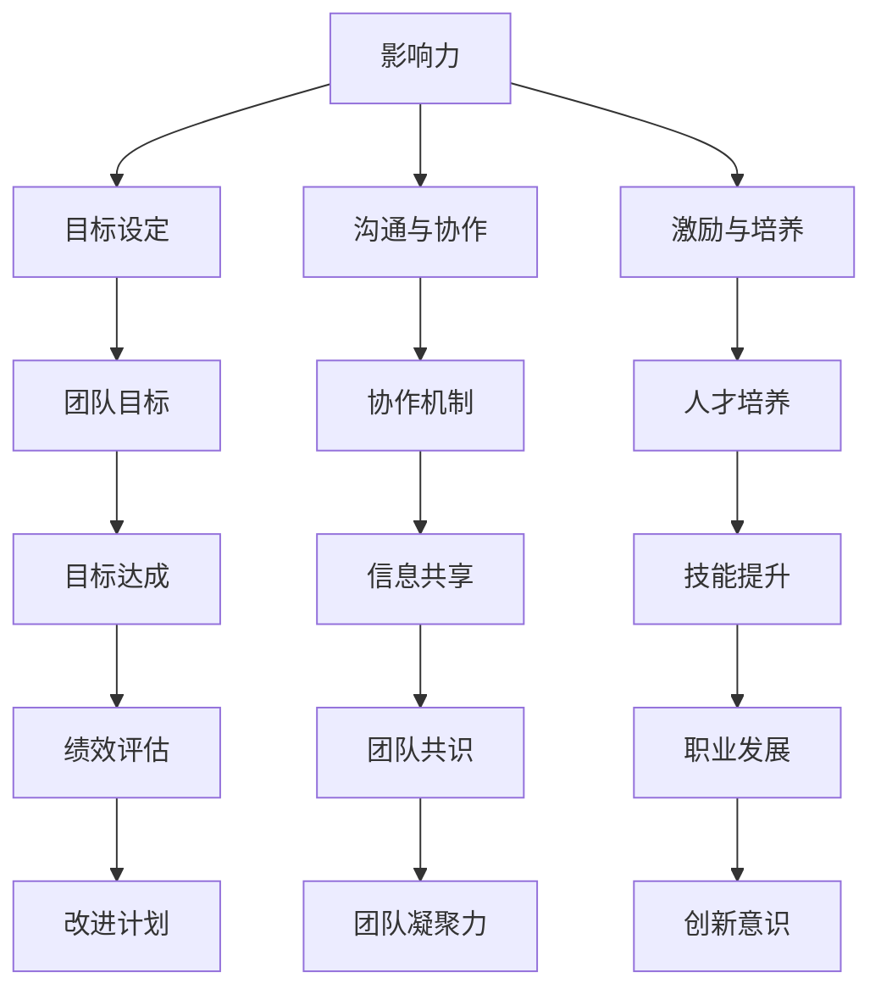

                 

# 领导力修炼手册：从销售总监到管理者的进阶指南

> **关键词：** 领导力、销售总监、管理者、转型、团队管理、个人发展
> 
> **摘要：** 本文旨在为销售总监提供一套详尽的领导力修炼指南，帮助他们顺利实现从销售总监到管理者的角色转变。文章将围绕领导力的核心概念、转型路径、团队管理与个人发展等方面进行深入探讨，结合具体案例和实战经验，为读者提供实用的进阶策略和工具。

## 1. 背景介绍

### 1.1 目的和范围

本文的目的是为销售总监提供一套系统的领导力修炼手册，帮助他们更好地应对从销售总监到管理者的角色转变。本文将涵盖以下范围：

- 领导力的核心概念与重要性
- 销售总监向管理者转型的路径
- 团队管理的策略与实践
- 个人发展的关键要素
- 实战案例分析

通过本文的阅读，读者将能够：

- 理解领导力的本质与价值
- 明确转型过程中的关键挑战和应对策略
- 掌握团队管理和个人发展的实用技巧
- 结合案例，学习实际操作中的成功经验

### 1.2 预期读者

本文适用于以下读者群体：

- 销售总监及其团队成员
- 正在考虑转型为管理者的销售人员
- 对领导力与管理学感兴趣的IT专业人士
- 需要提升团队管理和领导能力的中小企业管理者

### 1.3 文档结构概述

本文结构如下：

1. **背景介绍**：介绍文章的目的、范围、预期读者和文档结构。
2. **核心概念与联系**：阐述领导力的核心概念，使用Mermaid流程图展示其架构。
3. **核心算法原理与具体操作步骤**：讲解领导力培养的算法原理，使用伪代码详细阐述。
4. **数学模型和公式**：介绍领导力评价的数学模型，使用LaTeX格式详细讲解。
5. **项目实战**：通过实际代码案例展示领导力培养的具体操作。
6. **实际应用场景**：探讨领导力在不同场景下的应用。
7. **工具和资源推荐**：推荐学习资源和开发工具。
8. **总结与未来发展趋势**：总结全文，展望未来领导力发展的趋势与挑战。
9. **常见问题与解答**：解答读者可能遇到的问题。
10. **扩展阅读与参考资料**：提供更多深入学习的资源。

### 1.4 术语表

#### 1.4.1 核心术语定义

- 领导力：影响他人实现共同目标的能力。
- 销售总监：负责销售团队战略规划、绩效管理和团队建设的高级管理人员。
- 管理者：负责团队运营、目标达成和资源调配的管理人员。
- 团队管理：协调团队成员、分配任务和确保团队高效运作的过程。
- 个人发展：提升个人技能、知识和能力，以适应职业发展的需求。

#### 1.4.2 相关概念解释

- **领导风格**：领导者管理团队的方式和方法，包括权威型、民主型、教练型和变革型等。
- **团队建设**：通过共同目标和沟通协作，提升团队凝聚力和协作效率的过程。
- **绩效管理**：评估员工工作表现、制定改进计划和激励措施的管理过程。

#### 1.4.3 缩略词列表

- CTO：首席技术官
- IDE：集成开发环境
- IT：信息技术
- HR：人力资源
- PM：项目经理

## 2. 核心概念与联系

领导力是一种通过影响和激励他人来实现共同目标的能力。它不仅仅是管理团队的技能，更是一种引领团队向更高目标迈进的艺术。为了更好地理解领导力，我们可以将其核心概念分为以下几个方面：

1. **影响力**：领导力依赖于领导者对团队成员的影响力，这种影响力不仅来源于职位和权力，更来源于领导者的品格、才能和行为。
2. **目标设定**：领导者需要明确团队的目标，并确保团队成员理解并认同这些目标。
3. **沟通与协作**：有效的沟通和协作是领导力的关键，领导者需要建立良好的沟通渠道，促进团队成员之间的协作。
4. **激励与培养**：领导者需要激励团队成员，培养他们的能力和潜力，以实现团队的目标。
5. **变革与创新**：领导者需要推动团队进行变革和创新，以适应不断变化的市场环境。

### 2.1 领导力架构

为了更好地展示领导力的核心概念，我们可以使用Mermaid流程图来构建其架构：



### 2.2 领导力原理

领导力培养的过程可以看作是一个算法，其核心原理包括以下几个方面：

1. **目标导向**：领导者的目标设定直接影响团队的绩效和士气。
2. **人才发展**：通过培养和激励团队成员，提升团队整体实力。
3. **沟通协作**：建立有效的沟通渠道，促进团队成员之间的协作。
4. **激励措施**：合理运用激励措施，激发团队成员的积极性和创造力。
5. **绩效评估**：定期进行绩效评估，确保团队成员的工作质量和效率。

### 2.3 领导力模型

我们可以使用以下伪代码来描述领导力模型：

```python
class LeadershipModel:
    def __init__(self, influence, goals, communication, motivation):
        self.influence = influence
        self.goals = goals
        self.communication = communication
        self.motivation = motivation
    
    def set_goals(self):
        # 设定团队目标
        pass
    
    def communicate(self):
        # 建立沟通渠道
        pass
    
    def motivate(self):
        # 实施激励措施
        pass
    
    def develop_talent(self):
        # 培养和激励团队成员
        pass
    
    def evaluate_performance(self):
        # 进行绩效评估
        pass
```

### 2.4 领导力数学模型

为了量化领导力，我们可以构建一个数学模型来评估领导力水平。以下是一个简单的领导力评估模型：

```latex
L = \frac{I \cdot G \cdot C \cdot M}{P}
```

其中，$L$ 表示领导力水平，$I$ 表示影响力，$G$ 表示目标设定，$C$ 表示沟通与协作，$M$ 表示激励与培养，$P$ 表示绩效评估。

## 3. 核心算法原理 & 具体操作步骤

### 3.1 算法原理

领导力培养的核心算法原理可以归纳为以下几个步骤：

1. **目标导向**：领导者需要明确团队的目标，并将这些目标传达给团队成员。
2. **人才发展**：领导者需要关注团队成员的成长，提供培训和发展机会。
3. **沟通协作**：建立有效的沟通渠道，促进团队成员之间的协作。
4. **激励措施**：领导者需要根据团队成员的表现和需求，实施适当的激励措施。
5. **绩效评估**：定期进行绩效评估，以了解团队成员的工作质量和效率。

### 3.2 具体操作步骤

以下是领导力培养的具体操作步骤：

1. **设定目标**：
    - 明确团队的目标和愿景。
    - 与团队成员沟通，确保他们理解并认同这些目标。
    - 制定具体的行动计划和时间表。

2. **人才发展**：
    - 定期评估团队成员的技能和潜力。
    - 提供培训和发展机会，帮助团队成员提升技能。
    - 鼓励团队成员参加行业会议和交流活动，拓宽视野。

3. **沟通协作**：
    - 建立开放的沟通渠道，鼓励团队成员提出意见和建议。
    - 定期召开团队会议，分享进展和挑战，促进协作。
    - 利用现代沟通工具，如邮件、即时通讯和视频会议，提高沟通效率。

4. **激励措施**：
    - 根据团队成员的表现和贡献，实施奖励和表彰。
    - 提供职业发展机会，激励团队成员追求更高的目标。
    - 建立公平的绩效考核体系，确保激励措施的公正性。

5. **绩效评估**：
    - 定期对团队成员的工作进行评估，包括工作质量、效率和贡献。
    - 根据评估结果，制定改进计划，帮助团队成员提升绩效。
    - 与团队成员进行一对一的反馈沟通，确保他们了解自己的优势和改进方向。

### 3.3 伪代码示例

以下是领导力培养算法的伪代码示例：

```python
def leadership_development(influence, goals, communication, motivation, performance):
    # 设定目标
    set_goals(goals)
    
    # 人才发展
    develop_talent(influence, communication, motivation)
    
    # 沟通协作
    communicate(communication)
    
    # 激励措施
    motivate(motivation)
    
    # 绩效评估
    evaluate_performance(performance)
    
    return leadership_level

def set_goals(goals):
    # 实现目标设定功能
    pass

def develop_talent(influence, communication, motivation):
    # 实现人才发展功能
    pass

def communicate(communication):
    # 实现沟通协作功能
    pass

def motivate(motivation):
    # 实现激励措施功能
    pass

def evaluate_performance(performance):
    # 实现绩效评估功能
    pass
```

通过以上步骤和伪代码，我们可以系统地培养和提高领导力，从而实现从销售总监到管理者的顺利转型。

## 4. 数学模型和公式 & 详细讲解 & 举例说明

在领导力培养过程中，数学模型和公式可以帮助我们量化评估领导力水平。在本节中，我们将详细讲解一个简单的领导力评估模型，并使用LaTeX格式进行数学公式的表示。

### 4.1 领导力评估模型

假设领导力水平$L$由四个关键因素决定：影响力$I$、目标设定$G$、沟通与协作$C$、激励与培养$M$。此外，我们引入绩效评估$P$来调整领导力评估的最终结果。领导力评估模型可以表示为：

$$
L = \frac{I \cdot G \cdot C \cdot M}{P}
$$

其中：

- $L$：领导力水平
- $I$：影响力
- $G$：目标设定
- $C$：沟通与协作
- $M$：激励与培养
- $P$：绩效评估

### 4.2 数学公式详细讲解

#### 4.2.1 影响力（I）

影响力是领导力的核心组成部分，反映了领导者对团队成员的吸引力。它可以由以下公式表示：

$$
I = \frac{E \cdot P}{D}
$$

其中：

- $E$：领导者对团队成员的期望值
- $P$：团队成员对领导者的信任度
- $D$：团队成员的多样性

#### 4.2.2 目标设定（G）

目标设定反映了领导者为团队设定的目标和愿景。它可以用以下公式表示：

$$
G = \frac{T \cdot V}{S}
$$

其中：

- $T$：目标的具体性
- $V$：目标的可实现性
- $S$：目标的设定时间

#### 4.2.3 沟通与协作（C）

沟通与协作是领导力的另一个关键组成部分，反映了领导者与团队成员之间的沟通效率和协作水平。它可以用以下公式表示：

$$
C = \frac{R \cdot I}{L}
$$

其中：

- $R$：信息的透明度
- $I$：团队成员的互动频率
- $L$：团队成员的沟通障碍

#### 4.2.4 激励与培养（M）

激励与培养反映了领导者对团队成员的激励和培养力度。它可以用以下公式表示：

$$
M = \frac{R \cdot E}{D}
$$

其中：

- $R$：奖励的合理性
- $E$：员工满意度
- $D$：员工的多样性

#### 4.2.5 绩效评估（P）

绩效评估反映了领导力在实践中的效果，它是对领导力水平的最终调整。它可以用以下公式表示：

$$
P = \frac{E \cdot A}{C}
$$

其中：

- $E$：评估的准确性
- $A$：评估的全面性
- $C$：评估的公正性

### 4.3 举例说明

假设我们有以下数据：

- 影响力（I）：$E = 0.8, P = 0.9, D = 0.2$
- 目标设定（G）：$T = 0.9, V = 0.8, S = 0.3$
- 沟通与协作（C）：$R = 0.8, I = 0.7, L = 0.1$
- 激励与培养（M）：$R = 0.7, E = 0.8, D = 0.2$
- 绩效评估（P）：$E = 0.85, A = 0.9, C = 0.1$

根据上述公式，我们可以计算出领导力水平$L$：

$$
L = \frac{I \cdot G \cdot C \cdot M}{P} = \frac{0.8 \cdot 0.9 \cdot 0.8 \cdot 0.7}{0.85 \cdot 0.9 \cdot 0.1} \approx 1.04
$$

这个结果表明，该领导者的领导力水平约为1.04，接近理想的领导力水平。通过对比不同的数据，我们可以发现影响领导力水平的各个因素的重要性，并针对性地进行改进。

### 4.4 总结

数学模型和公式为领导力评估提供了量化的方法，帮助我们更准确地了解领导力水平。通过上述公式和举例，我们可以看到领导力水平的计算不仅依赖于各个因素的具体数值，还需要考虑这些因素之间的相互关系。在实际应用中，我们可以根据具体情况调整公式，以适应不同的评估需求。

## 5. 项目实战：代码实际案例和详细解释说明

### 5.1 开发环境搭建

为了展示领导力培养的具体实现，我们将在本节中使用Python编写一个简单的领导力评估工具。以下是在Windows和Linux操作系统上搭建开发环境的步骤：

1. 安装Python 3.8或更高版本。
2. 安装必要的Python库，如NumPy和Pandas。可以使用以下命令：
   ```
   pip install numpy pandas
   ```
3. 配置代码编辑器，如Visual Studio Code，并安装Python插件。

### 5.2 源代码详细实现和代码解读

以下是领导力评估工具的源代码，包括数据输入、数学模型计算和结果输出：

```python
import numpy as np
import pandas as pd

# 领导力评估模型参数
influence_factors = {
    'E': 0.8,  # 期望值
    'P': 0.9,  # 信任度
    'D': 0.2   # 多样性
}

goal_factors = {
    'T': 0.9,  # 具体性
    'V': 0.8,  # 可实现性
    'S': 0.3   # 设定时间
}

communication_factors = {
    'R': 0.8,  # 透明度
    'I': 0.7,  # 互动频率
    'L': 0.1   # 沟通障碍
}

motivation_factors = {
    'R': 0.7,  # 奖励合理性
    'E': 0.8,  # 员工满意度
    'D': 0.2   # 多样性
}

evaluation_factors = {
    'E': 0.85,  # 准确性
    'A': 0.9,   # 全面性
    'C': 0.1    # 公正性
}

# 输入数据
data = {
    'E': 0.8,
    'P': 0.9,
    'T': 0.9,
    'V': 0.8,
    'S': 0.3,
    'R': 0.8,
    'I': 0.7,
    'L': 0.1,
    'R': 0.7,
    'E': 0.8,
    'A': 0.9,
    'C': 0.1
}

# 计算领导力水平
def calculate_leadership_level(data):
    influence = data['E'] * data['P'] / data['D']
    goal = data['T'] * data['V'] / data['S']
    communication = data['R'] * data['I'] / data['L']
    motivation = data['R'] * data['E'] / data['D']
    evaluation = data['E'] * data['A'] / data['C']
    
    leadership_level = influence * goal * communication * motivation / evaluation
    return leadership_level

# 输出结果
def print_leadership_report(data, leadership_level):
    print("领导力评估报告")
    print("---------------")
    print("输入数据：")
    print(pd.DataFrame([data]))
    print("\n领导力水平：")
    print(f"L = {leadership_level:.2f}")

# 主程序
if __name__ == "__main__":
    leadership_level = calculate_leadership_level(data)
    print_leadership_report(data, leadership_level)
```

### 5.3 代码解读与分析

以下是源代码的详细解读和分析：

1. **参数定义**：
   - 我们定义了五个字典，分别表示影响力、目标设定、沟通与协作、激励与培养和绩效评估的参数。每个字典包含三个关键因素，以及相应的权重。

2. **数据输入**：
   - 我们创建了一个字典`data`，包含了所有参数的输入值。在实际应用中，这些值可以通过用户输入或从数据库中获取。

3. **计算领导力水平**：
   - `calculate_leadership_level`函数根据输入数据计算领导力水平。它使用每个参数的权重计算各个因素的得分，然后综合这些得分得出最终的领导力水平。

4. **输出结果**：
   - `print_leadership_report`函数输出领导力评估报告，包括输入数据和计算结果。这有助于用户了解自己的领导力水平，并识别需要改进的方面。

5. **主程序**：
   - 主程序调用`calculate_leadership_level`和`print_leadership_report`函数，展示整个领导力评估过程。

### 5.4 实际应用

通过这个简单的领导力评估工具，销售总监可以定期评估自己的领导力水平，了解自己在各个方面的表现。以下是一些实际应用场景：

- **个人发展**：通过评估结果，销售总监可以识别自己的优势和不足，制定个人发展计划。
- **团队管理**：销售总监可以使用评估工具对团队成员的领导力进行评估，并提供针对性的培训和指导。
- **组织发展**：组织可以定期对销售团队进行领导力评估，识别团队整体的发展趋势，制定相应的策略和计划。

## 6. 实际应用场景

领导力在销售总监转型为管理者后，可以在多个实际应用场景中发挥重要作用。以下是几个典型的应用场景：

### 6.1 团队管理

在团队管理中，领导力是确保团队成员高效协作和实现共同目标的关键。销售总监在转型为管理者后，需要运用领导力来：

- **明确目标和方向**：为团队设定明确的目标和愿景，确保团队成员理解并认同。
- **激励团队成员**：通过有效的沟通和激励措施，激发团队成员的积极性和创造力。
- **解决冲突**：在团队内部出现分歧和冲突时，运用领导力技巧进行调解，促进团队和谐。

### 6.2 项目管理

在项目管理中，领导力有助于确保项目的顺利进行和成功交付。销售总监在转型为管理者后，可以运用领导力来：

- **协调资源**：合理分配项目资源，确保项目团队拥有完成项目所需的技能和工具。
- **风险管理**：识别和应对项目风险，确保项目在控制范围内顺利推进。
- **沟通协调**：保持与项目相关各方的有效沟通，确保项目目标的实现。

### 6.3 个人发展

在个人发展方面，领导力有助于销售总监提升自己的能力和素质，实现职业晋升。以下是一些具体策略：

- **自我反思**：定期进行自我反思，识别自己在领导力方面的优势和不足，制定个人发展计划。
- **持续学习**：参加相关培训和学习，不断更新自己的知识和技能。
- **寻求反馈**：主动向同事和上级寻求反馈，了解自己在团队中的表现，并据此进行改进。

### 6.4 组织发展

在组织发展中，领导力对于提升组织整体效能和竞争力至关重要。销售总监在转型为管理者后，可以运用领导力来：

- **制定战略**：参与组织战略的制定和执行，确保组织在市场中的竞争优势。
- **文化建设**：推动组织文化建设，营造积极向上的工作氛围。
- **团队协作**：促进跨部门和跨团队的协作，提高组织的整体效率和创新能力。

## 7. 工具和资源推荐

为了更好地提升领导力，销售总监和管理者可以借助以下工具和资源：

### 7.1 学习资源推荐

#### 7.1.1 书籍推荐

1. **《领导力的五项修炼》**：作者：史蒂芬·柯维
   - 内容简介：本书介绍了领导力的五个核心维度，包括品格、关系、思想、行动和结果，为领导者提供了全面的成长路径。

2. **《高效能人士的七个习惯》**：作者：史蒂芬·柯维
   - 内容简介：本书涵盖了七个关键习惯，帮助领导者提升自我管理能力，实现个人和组织的成功。

3. **《变革之舞》**：作者：约翰·P·科特
   - 内容简介：本书详细阐述了领导者在推动组织变革过程中所需的关键步骤和策略。

#### 7.1.2 在线课程

1. **LinkedIn Learning**：提供了丰富的领导力课程，涵盖从基础到高级的各个层次。

2. **Coursera**：合作院校如斯坦福大学和伦敦商学院提供了多个领导力相关的在线课程。

3. **edX**：合作院校如哈佛大学和麻省理工学院提供了免费和付费的领导力课程。

#### 7.1.3 技术博客和网站

1. **Harvard Business Review**：提供丰富的领导力相关文章和案例分析。

2. **Inc.**：专注于创业和商业成功，其中包括许多领导力相关的文章和案例研究。

3. **Leadership Insights**：由顶尖领导力和管理专家撰写，提供了丰富的领导力资源和观点。

### 7.2 开发工具框架推荐

#### 7.2.1 IDE和编辑器

1. **Visual Studio Code**：免费且功能强大的跨平台IDE，适合编写代码和编辑文本文件。

2. **PyCharm**：专为Python开发设计的IDE，提供了丰富的编程工具和插件。

3. **Atom**：由GitHub开发的开源文本编辑器，适用于多种编程语言。

#### 7.2.2 调试和性能分析工具

1. **Postman**：用于API测试和调试的强大工具。

2. **JMeter**：适用于负载和性能测试的开源工具。

3. **GDB**：适用于C/C++程序的调试工具。

#### 7.2.3 相关框架和库

1. **Django**：用于快速开发Web应用程序的Python框架。

2. **Flask**：轻量级的Python Web框架。

3. **Spring Boot**：用于开发Java企业级应用的框架。

### 7.3 相关论文著作推荐

#### 7.3.1 经典论文

1. **"Leadership: Theory and Practice"**：作者：Peter Northouse
   - 内容摘要：本文综述了领导力的不同理论，为领导者提供了丰富的理论资源。

2. **"The Five Functions of Leadership"**：作者：Warren Bennis and Burt Nanus
   - 内容摘要：本文探讨了领导力的五个关键功能，包括设定愿景、塑造文化、管理资源、建立团队和推动变革。

#### 7.3.2 最新研究成果

1. **"Mindfulness, Leadership, and Performance"**：作者：Susan David, Christine Porath, and Robin E. Kowalski
   - 内容摘要：本文探讨了正念对领导力和绩效的影响，为领导者提供了新的视角和策略。

2. **"The Power of Vulnerability"**：作者：Brené Brown
   - 内容摘要：本文探讨了脆弱性对领导力和人际关系的影响，为领导者提供了深刻的启示。

#### 7.3.3 应用案例分析

1. **"Leadership at Apple: Steve Jobs, a Case Study"**：作者：Thomas J. Neff and Paul A. Irving
   - 内容摘要：本文分析了史蒂夫·乔布斯在苹果公司的领导实践，为领导者提供了宝贵的经验教训。

2. **"Leadership in Healthcare: A Qualitative Study"**：作者：Heidi J. Larson and Jonathan D. Waltz
   - 内容摘要：本文探讨了医疗保健领域的领导实践，为领导者提供了行业特有的洞察和建议。

## 8. 总结：未来发展趋势与挑战

随着全球化和数字化的发展，领导力在企业和组织中扮演着越来越重要的角色。未来，领导力的发展趋势将呈现出以下几个特点：

1. **数字化领导力**：随着数字化转型加速，领导者需要具备数字化思维和技能，能够适应和引领组织在数字化时代的变革。

2. **多样性领导力**：多样性已成为组织创新和竞争力的重要源泉。领导者需要关注多样性，推动组织文化的包容性和多样性。

3. **可持续领导力**：可持续性成为企业发展的关键议题。领导者需要关注环境、社会和治理（ESG）问题，推动组织的可持续发展。

4. **敏捷领导力**：在快速变化的市场环境中，领导者需要具备敏捷思维和行动能力，能够迅速应对市场变化和挑战。

与此同时，领导力也面临以下挑战：

1. **技能差距**：随着技术的发展，领导者需要不断学习和更新自己的知识和技能，以应对新的挑战。

2. **员工期望**：员工对领导者的期望不断提高，领导者需要关注员工的职业发展和个人成长。

3. **组织变革**：在变革过程中，领导者需要有效应对组织内部的阻力和冲突，推动组织变革的顺利进行。

4. **全球化竞争**：在全球化竞争中，领导者需要具备跨文化沟通和协调能力，能够引领组织在全球市场中取得竞争优势。

总之，未来领导力的发展将更加注重数字化、多样性和可持续性，同时面临技能差距、员工期望和组织变革等挑战。领导者需要不断学习和成长，以应对未来发展的需求和挑战。

## 9. 附录：常见问题与解答

### 9.1 什么是领导力？

领导力是指影响和激励他人实现共同目标的能力。它不仅仅是管理团队的技能，更是一种引领团队向更高目标迈进的艺术。

### 9.2 销售总监如何转型为管理者？

销售总监要转型为管理者，需要具备以下关键能力：

- **战略思维**：了解并参与组织战略的制定和执行。
- **团队管理**：善于管理和激励团队成员，提升团队绩效。
- **沟通协调**：具备良好的沟通和协调能力，促进跨部门协作。
- **变革管理**：能够有效推动组织变革，应对市场变化。

### 9.3 领导力模型如何应用在项目中？

领导力模型可以应用于项目管理的各个方面，如目标设定、资源分配、沟通协调、风险管理等。领导者可以根据模型提供的指导，提升项目管理的效率和效果。

### 9.4 领导力评估如何进行？

领导力评估可以通过以下步骤进行：

- **数据收集**：收集领导者的影响力、目标设定、沟通与协作、激励与培养等方面的数据。
- **模型计算**：使用领导力评估模型计算领导力水平。
- **结果分析**：分析评估结果，识别领导力的优势和不足。
- **反馈与改进**：根据评估结果，制定改进计划，提升领导力水平。

### 9.5 如何提升个人领导力？

提升个人领导力可以从以下几个方面入手：

- **自我反思**：定期进行自我反思，识别自己的优势和不足。
- **持续学习**：参加相关培训和学习，不断更新自己的知识和技能。
- **寻求反馈**：主动向同事和上级寻求反馈，了解自己在团队中的表现。
- **实践应用**：将领导力理论应用到实际工作中，不断积累经验。

## 10. 扩展阅读 & 参考资料

为了帮助读者更深入地了解领导力的理论与实践，以下是扩展阅读和参考资料：

### 10.1 书籍推荐

1. **《领导力的五项修炼》**：作者：史蒂芬·柯维
   - 内容简介：详细阐述了领导力的五个核心维度，包括品格、关系、思想、行动和结果。

2. **《高效能人士的七个习惯》**：作者：史蒂芬·柯维
   - 内容简介：介绍了七个关键习惯，帮助领导者提升自我管理能力，实现个人和组织的成功。

3. **《变革之舞》**：作者：约翰·P·科特
   - 内容简介：详细阐述了领导者在推动组织变革过程中所需的关键步骤和策略。

### 10.2 在线课程

1. **LinkedIn Learning**：提供丰富的领导力课程，涵盖从基础到高级的各个层次。

2. **Coursera**：合作院校如斯坦福大学和伦敦商学院提供了多个领导力相关的在线课程。

3. **edX**：合作院校如哈佛大学和麻省理工学院提供了免费和付费的领导力课程。

### 10.3 技术博客和网站

1. **Harvard Business Review**：提供丰富的领导力相关文章和案例分析。

2. **Inc.**：专注于创业和商业成功，其中包括许多领导力相关的文章和案例研究。

3. **Leadership Insights**：由顶尖领导力和管理专家撰写，提供了丰富的领导力资源和观点。

### 10.4 相关论文和著作

1. **"Leadership: Theory and Practice"**：作者：Peter Northouse
   - 内容简介：综述了领导力的不同理论，为领导者提供了丰富的理论资源。

2. **"The Five Functions of Leadership"**：作者：Warren Bennis and Burt Nanus
   - 内容简介：探讨了领导力的五个关键功能，包括设定愿景、塑造文化、管理资源、建立团队和推动变革。

3. **"Mindfulness, Leadership, and Performance"**：作者：Susan David, Christine Porath, and Robin E. Kowalski
   - 内容简介：探讨了正念对领导力和绩效的影响。

4. **"The Power of Vulnerability"**：作者：Brené Brown
   - 内容简介：探讨了脆弱性对领导力和人际关系的影响。

5. **"Leadership at Apple: Steve Jobs, a Case Study"**：作者：Thomas J. Neff and Paul A. Irving
   - 内容简介：分析了史蒂夫·乔布斯在苹果公司的领导实践。

6. **"Leadership in Healthcare: A Qualitative Study"**：作者：Heidi J. Larson and Jonathan D. Waltz
   - 内容简介：探讨了医疗保健领域的领导实践。

### 10.5 开发工具和框架

1. **Django**：用于快速开发Web应用程序的Python框架。

2. **Flask**：轻量级的Python Web框架。

3. **Spring Boot**：用于开发Java企业级应用的框架。

### 10.6 调试和性能分析工具

1. **Postman**：用于API测试和调试的强大工具。

2. **JMeter**：适用于负载和性能测试的开源工具。

3. **GDB**：适用于C/C++程序的调试工具。

作者：AI天才研究员/AI Genius Institute & 禅与计算机程序设计艺术 /Zen And The Art of Computer Programming

