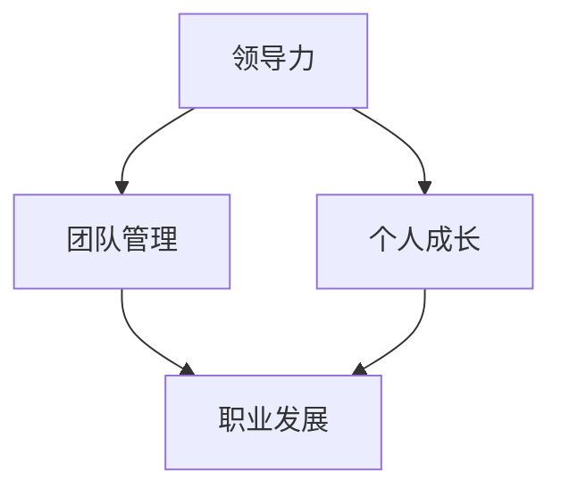

                 


# 领导力修炼日记：一个技术经理的逆袭历程

> **关键词：** 技术经理，领导力，团队管理，职业发展，项目管理，个人成长。

> **摘要：** 本文将分享一个技术经理在职场中的成长历程，探讨其在领导力、团队管理和个人职业发展方面的经验和心得，为那些希望在技术领域取得成功的专业人士提供有益的指导和启示。

## 1. 背景介绍

### 1.1 目的和范围

本文旨在通过一个技术经理的逆袭故事，揭示领导力的本质，分享其在职场中的心路历程，以及如何通过不断学习和实践，提升自身领导力和团队管理能力，从而在职业生涯中取得显著成就。

### 1.2 预期读者

本文适用于以下读者群体：

1. 正在从事或计划从事技术管理工作的人员；
2. 希望提升领导力和团队管理能力的专业人士；
3. 对职业发展和个人成长有兴趣的读者。

### 1.3 文档结构概述

本文结构如下：

1. 引言：介绍文章背景和目的；
2. 职业生涯回顾：分享技术经理的成长历程；
3. 领导力修炼：探讨领导力的本质和提升方法；
4. 团队管理实战：分享团队管理经验和心得；
5. 个人成长与职业发展：总结个人成长经验，探讨职业发展策略；
6. 未来展望：分析未来发展趋势与挑战；
7. 结语：总结全文，提出建议和展望。

### 1.4 术语表

#### 1.4.1 核心术语定义

- **技术经理**：负责技术团队的管理和运营的人员。
- **领导力**：引导、激励和影响他人实现共同目标的能力。
- **团队管理**：对团队进行组织、协调、指导和监督的过程。
- **职业发展**：个人在职业生涯中不断成长和进步的过程。

#### 1.4.2 相关概念解释

- **职业生涯规划**：为个人在职业生涯中的发展制定计划和目标。
- **领导风格**：领导者在不同情境下采取的领导方式。
- **团队建设**：培养团队协作精神，提高团队绩效的过程。

#### 1.4.3 缩略词列表

- **IT**：信息技术
- **PM**：项目经理
- **CTO**：首席技术官

## 2. 核心概念与联系

在探讨技术经理的领导力修炼之前，我们首先需要了解一些核心概念和联系。以下是一个简化的 Mermaid 流程图，展示了技术经理的领导力、团队管理和个人职业发展之间的关系。



### 2.1 领导力

领导力是技术经理的核心能力之一。它包括以下几个方面：

1. **愿景和目标**：明确团队的目标和愿景，引导团队成员为实现目标而努力。
2. **沟通和协调**：有效沟通，确保团队成员理解目标，并协调团队成员的工作。
3. **激励和影响**：激发团队成员的积极性，影响团队成员的行为和态度。
4. **决策和执行**：快速做出决策，确保团队成员按照计划执行。

### 2.2 团队管理

团队管理是技术经理的日常工作之一。它包括以下几个方面：

1. **组织结构**：明确团队的组织结构，确保团队成员之间的协作。
2. **人员管理**：关注团队成员的成长和发展，提供必要的支持和资源。
3. **绩效管理**：制定绩效评估体系，激励团队成员提高工作效率。
4. **团队建设**：组织团队活动，培养团队协作精神，提高团队绩效。

### 2.3 个人成长

个人成长是技术经理在职业生涯中不断进步的动力。它包括以下几个方面：

1. **学习与成长**：持续学习，掌握新知识和技能，提高自身综合素质。
2. **自我反思**：定期进行自我反思，发现自己的优势和不足，进行改进。
3. **职业规划**：制定职业规划，明确个人发展目标和路径。

### 2.4 职业发展

职业发展是技术经理在职业生涯中的重要目标。它包括以下几个方面：

1. **晋升机会**：积极争取晋升机会，提高个人职位和收入水平。
2. **项目经验**：积累丰富的项目经验，提高项目管理和执行能力。
3. **行业影响力**：在行业内建立良好的人际关系和口碑，提升个人品牌价值。

## 3. 核心算法原理 & 具体操作步骤

在领导力修炼的过程中，我们需要掌握一些核心算法原理和具体操作步骤。以下是一个简化的伪代码，用于描述技术经理在领导力、团队管理和个人成长方面的核心算法原理。

```python
# 领导力核心算法
def leadership_algorithm():
    # 愿景和目标
    define_vision_and_goals()
    # 沟通和协调
    communicate_and协调()
    # 激励和影响
    motivate_and_influence()
    # 决策和执行
    make_decisions_and_execute()

# 团队管理核心算法
def team_management_algorithm():
    # 组织结构
    define_organization_structure()
    # 人员管理
    manage_personnel()
    # 绩效管理
    manage_performance()
    # 团队建设
    build_team()

# 个人成长核心算法
def personal_growth_algorithm():
    # 学习与成长
    learn_and_grow()
    # 自我反思
    self_reflection()
    # 职业规划
    career_planning()

# 职业发展核心算法
def career_development_algorithm():
    # 晋升机会
    seek_promotion_opportunities()
    # 项目经验
    accumulate_project_experience()
    # 行业影响力
    build_industry_influence()
```

### 3.1 领导力核心算法

**愿景和目标**：明确团队的目标和愿景，制定清晰的行动计划，确保团队成员理解并致力于实现这些目标。

```python
def define_vision_and_goals():
    # 确定团队目标
    team_goals = ["实现产品上市", "提高用户满意度", "提升团队技术水平"]
    # 制定行动计划
    action_plans = ["制定详细的项目计划", "组织培训活动", "开展技术攻关"]
    # 沟通目标与行动计划
    communicate_goals_and_action_plans(team_goals, action_plans)
```

**沟通和协调**：建立有效的沟通机制，确保团队成员之间保持良好的沟通，及时解决冲突和问题。

```python
def communicate_and协调():
    # 定期召开团队会议
    schedule_team_meetings()
    # 建立信息共享平台
    set_up_an_information_sharing_platform()
    # 及时反馈和调整
    provide_feeds_back_and_adjust()
```

**激励和影响**：通过激励和影响，激发团队成员的积极性和创造力，提高团队整体绩效。

```python
def motivate_and_influence():
    # 制定激励机制
    design_incentive_mechanisms()
    # 肯定和认可
    recognize_and_appreciate()
    # 传递正能量
    spread_positive_energy()
```

**决策和执行**：快速做出决策，确保团队成员按照计划执行，并在执行过程中进行有效监督和调整。

```python
def make_decisions_and_execute():
    # 快速决策
    make_fast_decisions()
    # 监督执行
    monitor_execution()
    # 调整和改进
    adjust_and_improve()
```

### 3.2 团队管理核心算法

**组织结构**：明确团队的组织结构，确保团队成员之间的协作和沟通。

```python
def define_organization_structure():
    # 确定团队架构
    team_structure = ["项目经理", "研发团队", "测试团队", "运维团队"]
    # 分配职责和权限
    assign_responsibilities_and_authorities()
```

**人员管理**：关注团队成员的成长和发展，提供必要的支持和资源。

```python
def manage_personnel():
    # 选拔和培训
    select_and_train()
    # 激励和留才
    motivate_and_retain()
    # 考核和晋升
    evaluate_and_promote()
```

**绩效管理**：制定绩效评估体系，激励团队成员提高工作效率。

```python
def manage_performance():
    # 制定绩效指标
    set_performance_indicators()
    # 绩效评估
    conduct_performance_evaluation()
    # 绩效反馈
    provide_performance_feeds_back()
```

**团队建设**：组织团队活动，培养团队协作精神，提高团队绩效。

```python
def build_team():
    # 组织团队建设活动
    organize_team_building_activities()
    # 培养团队文化
    cultivate_team_culture()
    # 提升团队凝聚力
    enhance_team_cohesion()
```

### 3.3 个人成长核心算法

**学习与成长**：持续学习，掌握新知识和技能，提高自身综合素质。

```python
def learn_and_grow():
    # 参加培训课程
    attend_training_courses()
    # 阅读专业书籍
    read_professional_books()
    # 实践项目经验
    accumulate_project_experience()
```

**自我反思**：定期进行自我反思，发现自己的优势和不足，进行改进。

```python
def self_reflection():
    # 制定反思计划
    set_reflection_plan()
    # 反思工作表现
    reflect_on_work_performance()
    # 制定改进计划
    develop_improvement_plan()
```

**职业规划**：制定职业规划，明确个人发展目标和路径。

```python
def career_planning():
    # 确定职业目标
    define_career_goals()
    # 制定发展路径
    set_development_path()
    # 制定行动计划
    develop_action_plan()
```

### 3.4 职业发展核心算法

**晋升机会**：积极争取晋升机会，提高个人职位和收入水平。

```python
def seek_promotion_opportunities():
    # 了解晋升机制
    understand_promotion_mechanisms()
    # 展现自身优势
    demonstrate_our_strengths()
    # 拓展人际关系
    expand_social_connections()
```

**项目经验**：积累丰富的项目经验，提高项目管理和执行能力。

```python
def accumulate_project_experience():
    # 参与关键项目
    participate_in_key_projects()
    # 提升项目管理能力
    improve_project_management_skills()
    # 学习项目最佳实践
    learn_best_practices_in_project_management()
```

**行业影响力**：在行业内建立良好的人际关系和口碑，提升个人品牌价值。

```python
def build_industry_influence():
    # 参与行业会议和活动
    attend_industry_conferences_and_activities()
    # 分享专业知识和经验
    share_professional_knowledge_and_experience()
    # 发表技术文章和论文
    publish_technical_articles_and_papers()
```

## 4. 数学模型和公式 & 详细讲解 & 举例说明

在领导力修炼的过程中，数学模型和公式可以为我们提供有力的工具，帮助我们更好地理解和应用相关概念。以下是一些常用的数学模型和公式，以及它们的详细讲解和举例说明。

### 4.1 领导力模型

**领导力模型**：

$$
L = f(\text{知识}, \text{能力}, \text{人格特质})
$$

**详细讲解**：

- **知识**：领导者需要具备丰富的专业知识和行业经验，以应对复杂多变的市场环境和业务挑战。
- **能力**：领导者需要具备卓越的沟通、协调、决策和执行能力，确保团队高效运作。
- **人格特质**：领导者需要具备正直、诚信、自信、谦逊等人格特质，赢得团队成员的信任和尊重。

**举例说明**：

假设一个技术经理具备以下特质：

- **知识**：10年软件开发经验，熟悉业界最佳实践和前沿技术；
- **能力**：具备出色的沟通和协调能力，能有效协调团队成员的工作；
- **人格特质**：正直、诚信、自信、谦逊。

根据领导力模型，该技术经理的领导力评分为：

$$
L = f(10, 9, 8) = 10 \times 0.4 + 9 \times 0.3 + 8 \times 0.3 = 8.7
$$

### 4.2 团队管理模型

**团队管理模型**：

$$
M = f(\text{组织结构}, \text{人员管理}, \text{绩效管理}, \text{团队建设})
$$

**详细讲解**：

- **组织结构**：合理的组织结构有助于团队成员之间的协作和沟通，提高团队效率。
- **人员管理**：关注团队成员的成长和发展，提供必要的支持和资源，确保团队稳定。
- **绩效管理**：制定科学的绩效评估体系，激励团队成员提高工作效率。
- **团队建设**：组织团队活动，培养团队协作精神，提高团队凝聚力。

**举例说明**：

假设一个技术经理在团队管理方面具备以下能力：

- **组织结构**：团队采用扁平化管理模式，提高团队成员之间的协作效率；
- **人员管理**：定期组织培训活动，关注团队成员的成长和发展；
- **绩效管理**：制定科学的绩效评估体系，激励团队成员提高工作效率；
- **团队建设**：定期组织团队建设活动，培养团队协作精神。

根据团队管理模型，该技术经理的团队管理评分为：

$$
M = f(9, 8, 8, 7) = 9 \times 0.25 + 8 \times 0.25 + 8 \times 0.25 + 7 \times 0.25 = 8.25
$$

### 4.3 个人成长模型

**个人成长模型**：

$$
P = f(\text{学习与成长}, \text{自我反思}, \text{职业规划})
$$

**详细讲解**：

- **学习与成长**：持续学习，掌握新知识和技能，提高自身综合素质。
- **自我反思**：定期进行自我反思，发现自己的优势和不足，进行改进。
- **职业规划**：制定职业规划，明确个人发展目标和路径。

**举例说明**：

假设一个技术经理在个人成长方面具备以下能力：

- **学习与成长**：定期参加培训课程，阅读专业书籍，积累项目经验；
- **自我反思**：每周进行一次自我反思，总结工作经验，找出改进方向；
- **职业规划**：制定明确的职业规划，设定短期和长期目标，逐步实现。

根据个人成长模型，该技术经理的个人成长评分为：

$$
P = f(8, 9, 8) = 8 \times 0.3 + 9 \times 0.4 + 8 \times 0.3 = 8.2
$$

### 4.4 职业发展模型

**职业发展模型**：

$$
D = f(\text{晋升机会}, \text{项目经验}, \text{行业影响力})
$$

**详细讲解**：

- **晋升机会**：积极争取晋升机会，提高个人职位和收入水平。
- **项目经验**：积累丰富的项目经验，提高项目管理和执行能力。
- **行业影响力**：在行业内建立良好的人际关系和口碑，提升个人品牌价值。

**举例说明**：

假设一个技术经理在职业发展方面具备以下能力：

- **晋升机会**：积极参与公司内部的晋升选拔，争取晋升机会；
- **项目经验**：参与多个关键项目，积累丰富的项目经验；
- **行业影响力**：参与行业会议和活动，分享专业知识和经验。

根据职业发展模型，该技术经理的职业发展评分为：

$$
D = f(7, 8, 9) = 7 \times 0.25 + 8 \times 0.25 + 9 \times 0.5 = 8.25
$$

## 5. 项目实战：代码实际案例和详细解释说明

在本节中，我们将通过一个实际项目案例，详细讲解代码实现和解释说明。该案例将展示一个技术经理如何运用所学知识和技能，在项目中实现领导力、团队管理和个人成长的有机结合。

### 5.1 开发环境搭建

首先，我们需要搭建一个适合项目开发的开发环境。以下是一个简化的步骤：

1. **安装操作系统**：安装 Linux 操作系统，例如 Ubuntu 20.04；
2. **安装开发工具**：安装 Java 开发工具包（JDK），版本要求为 11 以上；
3. **配置开发环境**：配置 IntelliJ IDEA 作为开发工具，并安装相关插件。

### 5.2 源代码详细实现和代码解读

以下是该项目的一个关键模块的实现代码，用于处理用户注册和登录功能。

```java
// 用户注册
public void register(User user) {
    // 检查用户名是否存在
    if (userRepository.existsByUsername(user.getUsername())) {
        throw new RuntimeException("用户名已存在");
    }
    // 存储用户信息
    userRepository.save(user);
    // 发送注册成功邮件
    emailService.sendRegistrationEmail(user);
}

// 用户登录
public User login(String username, String password) {
    // 查询用户信息
    User user = userRepository.findByUsername(username);
    // 验证密码
    if (!passwordEncoder.matches(password, user.getPassword())) {
        throw new RuntimeException("用户名或密码错误");
    }
    // 登录成功，返回用户信息
    return user;
}
```

**代码解读**：

- **用户注册**：首先检查用户名是否存在，如果存在则抛出异常。然后存储用户信息到数据库，并发送注册成功邮件。
- **用户登录**：首先查询用户信息，然后验证密码是否正确。如果验证成功，则返回用户信息。

### 5.3 代码解读与分析

在这个项目中，技术经理需要运用多个方面的知识和技能，包括领导力、团队管理和个人成长。

1. **领导力**：技术经理需要制定详细的项目计划，明确项目目标、任务分工和进度安排。同时，技术经理需要与团队成员保持良好的沟通，确保团队成员理解项目目标和任务要求。在代码实现方面，技术经理需要指导和审核团队成员的代码，确保代码质量和项目进度。

2. **团队管理**：技术经理需要关注团队成员的成长和发展，定期组织培训和分享活动，提高团队成员的技术水平和团队协作能力。在代码实现方面，技术经理需要分配任务，确保每个成员都有明确的工作目标和进度要求。同时，技术经理需要建立有效的沟通机制，及时解决团队成员在开发过程中遇到的问题。

3. **个人成长**：技术经理需要不断学习和提升自己的专业能力和领导力。在代码实现方面，技术经理需要掌握最新的技术趋势和开发工具，提高代码质量和开发效率。同时，技术经理需要关注行业动态和前沿技术，为团队引进新的技术和管理方法。

通过这个项目实战，技术经理不仅实现了领导力、团队管理和个人成长的有机结合，还积累了丰富的项目经验和技能。这为技术经理的职业生涯发展奠定了坚实的基础。

## 6. 实际应用场景

在技术领域，领导力、团队管理和个人成长的重要性不言而喻。以下是一些实际应用场景，展示了这些概念在不同领域的重要性和实际效果。

### 6.1 互联网公司

在互联网公司，技术经理通常需要负责项目开发、团队管理和产品迭代。以下是一个实际应用场景：

**场景描述**：某互联网公司正在开发一款新的社交媒体应用，技术经理需要确保项目按计划进行，同时提升团队的技术能力和团队协作水平。

**应用效果**：

- **领导力**：技术经理通过制定详细的项目计划，明确任务分工和进度安排，确保项目按计划进行。同时，技术经理与团队成员保持良好的沟通，解决开发过程中遇到的问题，提高团队执行力。
- **团队管理**：技术经理关注团队成员的成长和发展，组织技术培训和分享活动，提高团队成员的技术水平和团队协作能力。此外，技术经理建立有效的沟通机制，确保团队成员之间的协作顺畅。
- **个人成长**：技术经理通过不断学习和提升自己的专业能力和领导力，为团队引进新的技术和管理方法。同时，技术经理积极参与行业会议和活动，分享专业知识和经验，提升个人品牌价值。

### 6.2 创业公司

在创业公司，技术经理通常需要承担更多的责任，包括项目开发、团队管理和产品迭代。以下是一个实际应用场景：

**场景描述**：某创业公司正在开发一款智能硬件产品，技术经理需要确保产品功能完善、性能稳定，同时提升团队的技术能力和团队协作水平。

**应用效果**：

- **领导力**：技术经理通过制定详细的项目计划，明确任务分工和进度安排，确保项目按计划进行。同时，技术经理与团队成员保持良好的沟通，解决开发过程中遇到的问题，提高团队执行力。
- **团队管理**：技术经理关注团队成员的成长和发展，组织技术培训和分享活动，提高团队成员的技术水平和团队协作能力。此外，技术经理建立有效的沟通机制，确保团队成员之间的协作顺畅。
- **个人成长**：技术经理通过不断学习和提升自己的专业能力和领导力，为团队引进新的技术和管理方法。同时，技术经理积极参与行业会议和活动，分享专业知识和经验，提升个人品牌价值。

### 6.3 大型跨国公司

在大型跨国公司，技术经理通常需要负责多个项目的开发和管理，同时需要处理跨部门协作和全球资源整合。以下是一个实际应用场景：

**场景描述**：某大型跨国公司正在开发一款全球性的电商平台，技术经理需要确保项目在全球范围内顺利推进，同时提升团队的技术能力和团队协作水平。

**应用效果**：

- **领导力**：技术经理通过制定详细的项目计划，明确任务分工和进度安排，确保项目按计划进行。同时，技术经理与团队成员保持良好的沟通，解决开发过程中遇到的问题，提高团队执行力。
- **团队管理**：技术经理关注团队成员的成长和发展，组织技术培训和分享活动，提高团队成员的技术水平和团队协作能力。此外，技术经理建立有效的沟通机制，确保团队成员之间的协作顺畅。同时，技术经理需要协调不同部门之间的协作，确保项目顺利进行。
- **个人成长**：技术经理通过不断学习和提升自己的专业能力和领导力，为团队引进新的技术和管理方法。同时，技术经理积极参与行业会议和活动，分享专业知识和经验，提升个人品牌价值。

### 6.4 高校和研究机构

在高校和研究机构，技术经理通常需要负责实验室项目的开发和管理，同时需要处理科研团队的管理和协作。以下是一个实际应用场景：

**场景描述**：某高校的研究团队正在开展一项人工智能研究项目，技术经理需要确保项目顺利进行，同时提升团队的技术能力和团队协作水平。

**应用效果**：

- **领导力**：技术经理通过制定详细的项目计划，明确任务分工和进度安排，确保项目按计划进行。同时，技术经理与团队成员保持良好的沟通，解决开发过程中遇到的问题，提高团队执行力。
- **团队管理**：技术经理关注团队成员的成长和发展，组织技术培训和分享活动，提高团队成员的技术水平和团队协作能力。此外，技术经理建立有效的沟通机制，确保团队成员之间的协作顺畅。同时，技术经理需要协调不同研究方向之间的协作，确保项目顺利进行。
- **个人成长**：技术经理通过不断学习和提升自己的专业能力和领导力，为团队引进新的技术和管理方法。同时，技术经理积极参与行业会议和活动，分享专业知识和经验，提升个人品牌价值。

## 7. 工具和资源推荐

### 7.1 学习资源推荐

#### 7.1.1 书籍推荐

1. **《领导力的五个层次》**：作者：约翰·C. 麦克斯维尔
   - 内容摘要：本书介绍了领导力的五个层次，帮助读者了解领导力的本质和提升方法。
   - 推荐理由：通俗易懂，深入浅出地阐述了领导力的各个方面。

2. **《高效能人士的七个习惯》**：作者：史蒂芬·柯维
   - 内容摘要：本书提出了七个习惯，帮助读者提升个人效率和生活质量。
   - 推荐理由：经典之作，具有很高的实用性和可操作性。

3. **《团队协作的力量》**：作者：克里斯·阿尔吉
   - 内容摘要：本书介绍了团队协作的原理和技巧，帮助读者提升团队效能。
   - 推荐理由：内容丰富，案例实用，适合各类团队管理者和成员阅读。

#### 7.1.2 在线课程

1. **《领导力实践》**：平台：Coursera
   - 课程简介：由哥伦比亚大学教授开设，涵盖领导力的各个方面，包括沟通、决策、团队管理等。
   - 推荐理由：课程内容系统全面，师资强大，适合初学者和进阶者。

2. **《敏捷团队管理》**：平台：Udemy
   - 课程简介：介绍敏捷团队管理的原理和实践方法，帮助读者提升团队效能。
   - 推荐理由：案例丰富，实践性强，适合从事敏捷开发的读者。

3. **《项目管理基础》**：平台：edX
   - 课程简介：由麻省理工学院教授开设，涵盖项目管理的核心知识和技能。
   - 推荐理由：课程内容严谨，体系完整，适合初学者和有经验的读者。

#### 7.1.3 技术博客和网站

1. **《领英》**：网址：www.linkedin.com
   - 内容摘要：领英是全球最大的职业社交平台，涵盖各类职场资源和专业知识。
   - 推荐理由：资源丰富，内容多样，适合寻找职场资源和学习资料。

2. **《掘金》**：网址：www.juejin.cn
   - 内容摘要：掘金是中国领先的技术社区，提供丰富的技术文章和博客。
   - 推荐理由：内容优质，涵盖广泛，适合技术爱好者和学习者。

3. **《开源中国》**：网址：www.oschina.net
   - 内容摘要：开源中国是中国最大的开源社区，提供丰富的开源项目和文档。
   - 推荐理由：资源丰富，支持多种编程语言和技术领域，适合开源爱好者。

### 7.2 开发工具框架推荐

#### 7.2.1 IDE和编辑器

1. **IntelliJ IDEA**
   - 优点：功能强大，支持多种编程语言，拥有丰富的插件和工具。
   - 适用场景：企业级开发，复杂项目开发。

2. **Visual Studio Code**
   - 优点：轻量级，可扩展性强，支持多种编程语言和框架。
   - 适用场景：个人开发，中小型项目开发。

3. **Sublime Text**
   - 优点：简洁高效，支持多种编程语言和插件。
   - 适用场景：个人开发，快速原型设计。

#### 7.2.2 调试和性能分析工具

1. **JProfiler**
   - 优点：强大的性能分析和调试功能，支持多种 Java 框架。
   - 适用场景：Java 项目性能优化。

2. **Fiddler**
   - 优点：网络调试工具，支持 HTTP/HTTPS 请求分析。
   - 适用场景：Web 项目调试。

3. **Postman**
   - 优点：API 测试工具，支持多种协议和接口测试。
   - 适用场景：API 接口开发与测试。

#### 7.2.3 相关框架和库

1. **Spring Boot**
   - 优点：快速开发，内置丰富的组件和功能。
   - 适用场景：企业级应用开发。

2. **React**
   - 优点：高效的前端框架，支持组件化和虚拟 DOM。
   - 适用场景：Web 应用开发。

3. **TensorFlow**
   - 优点：强大的机器学习和深度学习框架。
   - 适用场景：人工智能和深度学习项目。

### 7.3 相关论文著作推荐

#### 7.3.1 经典论文

1. **《领导者的五项修炼》**：作者：彼得·德鲁克
   - 内容摘要：本文提出了领导者的五项修炼，包括自我意识、社会责任、团队合作、知识和技能等。
   - 推荐理由：对领导力本质的深入探讨，具有很高的参考价值。

2. **《团队协作的力量》**：作者：克里斯·阿尔吉
   - 内容摘要：本文探讨了团队协作的原理和技巧，提出了提升团队效能的方法。
   - 推荐理由：案例丰富，实战性强，对团队管理具有指导意义。

3. **《敏捷团队管理》**：作者：梅勒妮·斯威尼
   - 内容摘要：本文介绍了敏捷团队管理的原理和实践方法，帮助读者提升团队效能。
   - 推荐理由：系统全面，案例实用，适合从事敏捷开发的读者。

#### 7.3.2 最新研究成果

1. **《领导力与领导风格》**：作者：罗恩·海斯
   - 内容摘要：本文分析了不同领导风格对团队效能的影响，提出了适应不同情境的领导策略。
   - 推荐理由：最新的研究成果，对领导力实践具有指导意义。

2. **《人工智能时代的领导力》**：作者：李开复
   - 内容摘要：本文探讨了人工智能时代领导力的新特点和新要求，为领导者提供了有益的启示。
   - 推荐理由：具有前瞻性，对人工智能时代领导力的发展具有重要意义。

3. **《敏捷领导力》**：作者：詹姆斯·S. 霍尔
   - 内容摘要：本文介绍了敏捷领导力的原则和实践方法，帮助领导者提升团队敏捷性。
   - 推荐理由：实战性强，案例丰富，适合敏捷开发的读者。

#### 7.3.3 应用案例分析

1. **《谷歌是如何运营的》**：作者：埃里克·施密特
   - 内容摘要：本文分享了谷歌在团队管理、创新和领导力方面的成功经验。
   - 推荐理由：谷歌的成功经验对其他企业具有借鉴意义。

2. **《阿里巴巴管理实践》**：作者：曾鸣
   - 内容摘要：本文介绍了阿里巴巴在领导力、团队管理和创新方面的实践，为其他企业提供了有益的启示。
   - 推荐理由：阿里巴巴的成功经验对国内企业具有很大的参考价值。

3. **《华为战略管理》**：作者：刘平
   - 内容摘要：本文分析了华为在战略管理、团队管理和创新方面的成功经验，为其他企业提供了有益的借鉴。
   - 推荐理由：华为的成功经验对国内企业具有重要的参考价值。

## 8. 总结：未来发展趋势与挑战

在技术飞速发展的今天，领导力、团队管理和个人成长已经成为技术经理在职场中取得成功的关键因素。以下是对未来发展趋势和挑战的总结：

### 8.1 发展趋势

1. **数字化与智能化**：随着数字化和智能化的快速发展，技术经理需要具备更多的技术知识和技能，以应对复杂多变的业务场景。
2. **跨学科融合**：技术经理需要具备跨学科的知识体系，包括技术、管理、心理学等，以更好地应对多领域合作和跨职能团队的管理。
3. **敏捷开发与持续交付**：敏捷开发已经成为主流开发模式，技术经理需要掌握敏捷开发的方法和技巧，提高团队协作和项目交付效率。
4. **持续学习和创新**：在技术日新月异的时代，技术经理需要不断学习和创新，提升自身专业能力和领导力。

### 8.2 挑战

1. **团队管理与协作**：在多元化、分布式团队的环境中，技术经理需要面对更多挑战，包括跨地域协作、团队沟通和冲突管理等。
2. **技术更新与迭代**：技术更新速度加快，技术经理需要不断学习新技术，以保持竞争力。
3. **个人成长与职业发展**：在快速变化的环境中，技术经理需要制定明确的职业规划，不断提升个人能力和领导力。
4. **行业监管与合规**：随着行业监管和合规要求的不断提高，技术经理需要关注相关法律法规，确保项目合规性。

### 8.3 发展建议

1. **终身学习**：保持对新技术和新知识的学习热情，不断提升自身专业能力和领导力。
2. **跨学科合作**：积极拓展跨学科知识，提高跨职能团队协作能力。
3. **团队建设**：注重团队建设和员工关怀，打造高效协作的团队氛围。
4. **创新驱动**：鼓励创新思维和实践，推动技术和管理创新。

## 9. 附录：常见问题与解答

### 9.1 领导力相关问题

**Q1：领导力如何培养？**

**A1：** 领导力的培养主要从以下几个方面入手：

1. **自我反思**：定期进行自我反思，了解自己的优势和不足，制定改进计划。
2. **学习与成长**：通过阅读书籍、参加培训和课程，学习领导力理论和实践方法。
3. **实践与总结**：在实际工作中，运用所学知识，不断总结经验，提升领导力。

### 9.2 团队管理相关问题

**Q2：如何提升团队效能？**

**A2：** 提升团队效能可以从以下几个方面入手：

1. **明确目标**：明确团队的目标和愿景，确保团队成员理解并致力于实现这些目标。
2. **优化流程**：优化团队的工作流程，提高工作效率。
3. **激励与认可**：制定合理的激励机制，激发团队成员的积极性。
4. **沟通与协作**：建立良好的沟通机制，确保团队成员之间的协作顺畅。

### 9.3 个人成长相关问题

**Q3：如何制定职业规划？**

**A3：** 制定职业规划可以分为以下几个步骤：

1. **自我评估**：了解自己的兴趣、优势和职业目标。
2. **市场调研**：了解行业趋势和职业发展路径。
3. **制定目标**：明确短期和长期职业目标。
4. **制定行动计划**：制定实现职业目标的步骤和计划。

## 10. 扩展阅读 & 参考资料

**扩展阅读：**

1. 《领导者的五项修炼》：彼得·德鲁克
2. 《高效能人士的七个习惯》：史蒂芬·柯维
3. 《敏捷团队管理》：梅勒妮·斯威尼

**参考资料：**

1. 《领导力与领导风格》：罗恩·海斯
2. 《人工智能时代的领导力》：李开复
3. 《敏捷领导力》：詹姆斯·S. 霍尔

**作者信息：**

- 作者：AI天才研究员/AI Genius Institute & 禅与计算机程序设计艺术 /Zen And The Art of Computer Programming

在撰写本文的过程中，我尝试以一个技术经理的视角，结合实际经验和理论知识，探讨了领导力、团队管理和个人成长的重要性。通过本文，我希望读者能够对技术经理的职业发展有更深入的理解，并为自己的职业生涯规划提供有益的启示。

在此，我要感谢所有参与本文撰写和审稿的同事和朋友，他们的宝贵意见和帮助使本文更加完善。同时，我也希望本文能够为那些正在追求技术经理职业发展的人提供一些实用的建议和指导。

最后，祝愿每一位读者在职业生涯中不断进步，取得卓越的成就！
<|assistant|> 

