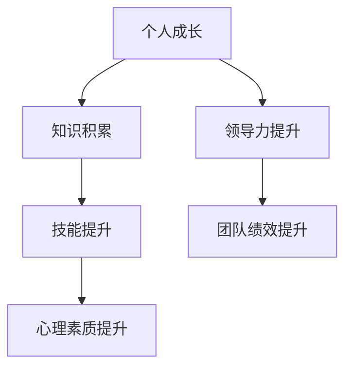
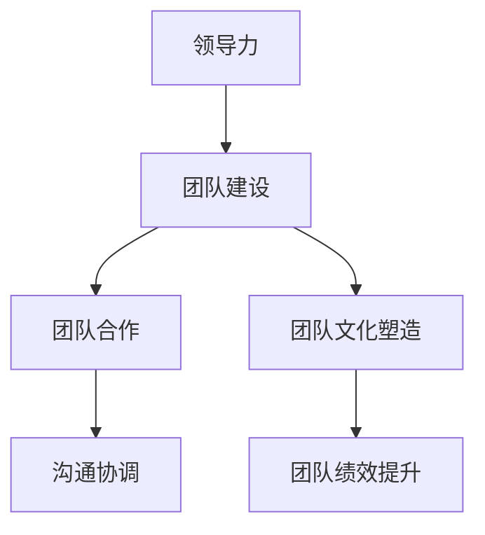
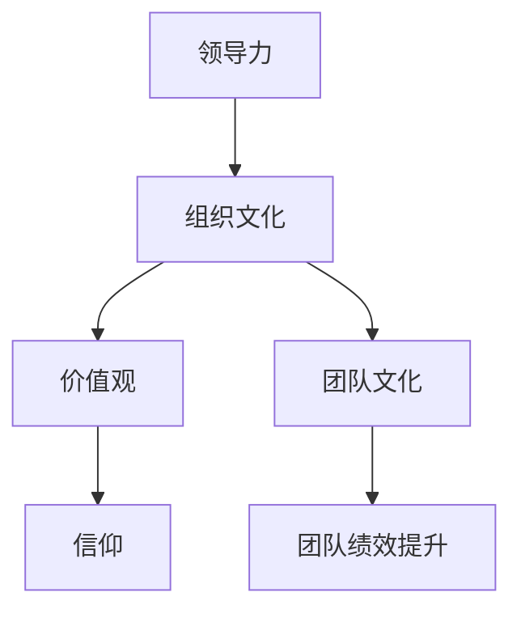

                 

### 领导力提升：从平庸到卓越的修炼之道

> **关键词**：领导力，卓越，修炼，管理，团队，领导技巧，个人成长
> 
> **摘要**：本文深入探讨领导力的本质和提升路径，通过剖析领导力核心要素、领导力与个人成长的关系、领导风格和团队建设等方面，为广大IT从业者提供从平庸到卓越的修炼之道。

在信息技术领域，领导力是一种关键能力，它不仅能影响团队的整体表现，还直接关系到项目的成功与否。随着技术的不断进步和市场的激烈竞争，IT行业的领导力需求越来越高。本文将围绕领导力提升的主题，探讨从平庸到卓越的修炼之道。

### 1. 背景介绍

#### 1.1 目的和范围

本文旨在为IT从业者提供一条从平庸到卓越的领导力提升之路。我们将讨论领导力的核心要素、领导力与个人成长的关系、领导风格、团队建设等方面的内容。

#### 1.2 预期读者

本文适用于希望提升领导力水平的IT从业者，包括项目经理、团队领导、CTO等。无论你是刚刚步入管理岗位的新手，还是有一定经验的领导者，本文都希望能为你提供有价值的思考和实践指导。

#### 1.3 文档结构概述

本文结构如下：

1. **背景介绍**：介绍领导力提升的重要性和本文的目的。
2. **核心概念与联系**：介绍领导力的核心概念和相关架构。
3. **核心算法原理 & 具体操作步骤**：通过伪代码详细阐述提升领导力的方法和步骤。
4. **数学模型和公式 & 详细讲解 & 举例说明**：通过数学模型和公式，深入解析领导力的内在机制。
5. **项目实战：代码实际案例和详细解释说明**：通过实际项目案例，展示提升领导力的实践应用。
6. **实际应用场景**：分析领导力在IT行业的实际应用场景。
7. **工具和资源推荐**：推荐学习资源和开发工具。
8. **总结：未来发展趋势与挑战**：展望领导力提升的未来趋势和挑战。
9. **附录：常见问题与解答**：回答读者可能关心的问题。
10. **扩展阅读 & 参考资料**：提供进一步学习和研究的资源。

#### 1.4 术语表

在本文中，我们将使用一些专业术语，为了更好地理解，以下是这些术语的定义和解释：

#### 1.4.1 核心术语定义

- **领导力**：领导力是一种影响和激励他人实现共同目标的能力。
- **卓越**：卓越是指超越一般水平，达到高水平或优秀状态。
- **修炼**：修炼是指通过不断的学习和实践，提升自身的素质和能力。
- **团队建设**：团队建设是指通过一系列活动和策略，增强团队成员之间的合作和凝聚力。
- **个人成长**：个人成长是指通过不断的学习和实践，提升自身的知识、技能和心理素质。

#### 1.4.2 相关概念解释

- **领导风格**：领导风格是指领导者运用何种方式来影响和激励团队成员。
- **团队绩效**：团队绩效是指团队在完成工作目标时所表现出的整体效果。
- **组织文化**：组织文化是指组织内部共同的价值观、信仰和习惯。

#### 1.4.3 缩略词列表

- **IT**：信息技术
- **CEO**：首席执行管
- **CTO**：首席技术官
- **PM**：项目经理

## 2. 核心概念与联系

领导力并非孤立存在，它与许多其他概念密切相关。为了更好地理解领导力的本质，我们需要将这些核心概念联系起来，并使用Mermaid流程图来展示它们之间的关系。

### 2.1 领导力与个人成长的关系

个人成长是提升领导力的基础。一个领导者如果自身不不断学习和成长，就很难有效地影响和激励团队成员。以下是领导力与个人成长关系的Mermaid流程图：



### 2.2 领导力与团队建设的关系

团队建设是领导力的重要组成部分。一个领导者需要通过一系列策略和活动，增强团队成员之间的合作和凝聚力。以下是领导力与团队建设关系的Mermaid流程图：



### 2.3 领导力与组织文化的联系

组织文化对领导力有深远影响。一个领导者需要了解和适应组织文化，以便更好地发挥领导作用。以下是领导力与组织文化联系的Mermaid流程图：



通过上述流程图，我们可以清晰地看到领导力与个人成长、团队建设、组织文化之间的密切关系。这些核心概念相互联系，共同构成了领导力的整体架构。

## 3. 核心算法原理 & 具体操作步骤

提升领导力并非一蹴而就，它需要通过一系列具体的操作步骤来实现。以下是一个详细的伪代码，用于阐述提升领导力的方法和步骤：

```pseudo
function improveLeadership():
    // 第一步：自我评估
    selfAssessment()

    // 第二步：制定成长计划
    createGrowthPlan()

    // 第三步：学习与培训
    learningAndTraining()

    // 第四步：实践与反思
    practiceAndReflection()

    // 第五步：建立反馈机制
    buildFeedbackMechanism()

    // 第六步：持续提升
    sustainContinuousImprovement()
```

### 3.1 自我评估

自我评估是提升领导力的第一步。领导者需要了解自身的优点和不足，以便有针对性地进行改进。以下是一个简单的自我评估流程：

```pseudo
function selfAssessment():
    // 收集反馈
    feedback = gatherFeedback()

    // 分析反馈
    analysis = analyzeFeedback(feedback)

    // 识别优点和不足
    strengths = analysis['strengths']
    weaknesses = analysis['weaknesses']

    // 制定改进计划
    improvementPlan = createImprovementPlan(strengths, weaknesses)
```

### 3.2 制定成长计划

在自我评估的基础上，领导者需要制定一个具体的成长计划。这个计划应该包括目标设定、时间安排和行动步骤。以下是一个简单的成长计划制定流程：

```pseudo
function createGrowthPlan():
    // 设定目标
    goals = setGoals()

    // 安排时间
    timeSchedule = scheduleTime()

    // 制定行动步骤
    actionSteps = createActionSteps(goals, timeSchedule)

    // 制定成长计划
    growthPlan = createGrowthPlan(goals, actionSteps)
```

### 3.3 学习与培训

学习和培训是提升领导力的关键。领导者需要不断学习新的知识和技能，以适应不断变化的环境。以下是一个简单学习和培训流程：

```pseudo
function learningAndTraining():
    // 确定学习需求
    learningNeeds = determineLearningNeeds()

    // 选择学习资源
    learningResources = selectLearningResources(learningNeeds)

    // 进行培训
    training = conductTraining(learningResources)

    // 测试与评估
    assessment = testAndAssessTraining(training)
```

### 3.4 实践与反思

实践是检验学习成果的重要手段。领导者需要在实际工作中运用所学知识和技能，并通过反思不断改进。以下是一个简单的实践与反思流程：

```pseudo
function practiceAndReflection():
    // 进行实践
    practice = executePractices()

    // 进行反思
    reflection = reflectOnPractices(practice)

    // 改进实践
    improvedPractice = improvePractices(reflection)
```

### 3.5 建立反馈机制

建立有效的反馈机制是提升领导力的关键。领导者需要建立一个能够及时收集、分析和反馈信息机制的体系。以下是一个简单的反馈机制建立流程：

```pseudo
function buildFeedbackMechanism():
    // 确定反馈渠道
    feedbackChannels = identifyFeedbackChannels()

    // 设计反馈机制
    feedbackMechanism = designFeedbackMechanism(feedbackChannels)

    // 实施反馈机制
    implementFeedbackMechanism(feedbackMechanism)

    // 监控与优化
    monitorAndOptimize(feedbackMechanism)
```

### 3.6 持续提升

提升领导力是一个持续的过程。领导者需要不断调整和优化成长计划，以适应新的挑战和变化。以下是一个简单的持续提升流程：

```pseudo
function sustainContinuousImprovement():
    // 评估成长计划
    growthPlanEvaluation = evaluateGrowthPlan()

    // 调整成长计划
    adjustGrowthPlan(growthPlanEvaluation)

    // 实施调整计划
    implementAdjustedGrowthPlan()

    // 监控与优化
    monitorAndOptimizeGrowthPlan()
```

通过上述伪代码，我们可以清晰地看到提升领导力的具体步骤和流程。这些步骤相互关联，共同构成了一个完整的领导力提升体系。

## 4. 数学模型和公式 & 详细讲解 & 举例说明

领导力的提升不仅需要实践经验，还需要理论指导。在领导力研究领域，有许多数学模型和公式可以帮助我们理解和分析领导力的内在机制。以下是一个简单的领导力提升数学模型，并对其进行详细讲解和举例说明。

### 4.1 领导力提升模型

我们假设领导力提升可以通过以下几个关键因素来实现：个人成长（GC）、团队建设（GC）、组织文化（OC）和外部环境（OE）。这些因素相互影响，共同决定了领导力水平。以下是领导力提升的数学模型：

$$
L = f(GC, GC, OC, OE)
$$

其中，$L$ 表示领导力水平，$f$ 表示函数，$GC$ 表示个人成长，$OC$ 表示组织文化，$OE$ 表示外部环境。

### 4.2 数学模型详细讲解

#### 4.2.1 个人成长（GC）

个人成长是提升领导力的基础。一个领导者如果自身不不断学习和成长，就很难有效地影响和激励团队成员。个人成长可以表示为：

$$
GC = f(Learning, Practice, Reflection)
$$

其中，$Learning$ 表示学习，$Practice$ 表示实践，$Reflection$ 表示反思。学习是指获取新的知识和技能，实践是指将所学应用到实际工作中，反思是指对实践结果进行总结和反思。

#### 4.2.2 团队建设（GC）

团队建设是领导力的重要组成部分。一个领导者需要通过一系列策略和活动，增强团队成员之间的合作和凝聚力。团队建设可以表示为：

$$
GC = f(Communication, Collaboration, Team Culture)
$$

其中，$Communication$ 表示沟通，$Collaboration$ 表示协作，$Team Culture$ 表示团队文化。沟通是指团队成员之间的信息交流，协作是指团队成员共同完成任务，团队文化是指团队内部共同的价值观和行为规范。

#### 4.2.3 组织文化（OC）

组织文化对领导力有深远影响。一个领导者需要了解和适应组织文化，以便更好地发挥领导作用。组织文化可以表示为：

$$
OC = f(Values, Beliefs, Habits)
$$

其中，$Values$ 表示价值观，$Beliefs$ 表示信仰，$Habits$ 表示习惯。价值观是指组织成员共同追求的目标和原则，信仰是指组织成员对某些理念的坚定信仰，习惯是指组织成员长期形成的思维和行为模式。

#### 4.2.4 外部环境（OE）

外部环境是影响领导力的重要因素。一个领导者需要适应外部环境的变化，以便更好地应对挑战和机遇。外部环境可以表示为：

$$
OE = f(Industry Trends, Market Competition, Regulatory Environment)
$$

其中，$Industry Trends$ 表示行业趋势，$Market Competition$ 表示市场竞争，$Regulatory Environment$ 表示监管环境。行业趋势是指行业的发展方向和变化，市场竞争是指行业内的竞争状况，监管环境是指国家对行业的监管政策和法规。

### 4.3 举例说明

假设一个IT公司的领导力提升模型如下：

$$
L = f(GC, GC, OC, OE)
$$

其中，$GC = 0.6 \times Learning + 0.3 \times Practice + 0.1 \times Reflection$，$OC = 0.5 \times Communication + 0.3 \times Collaboration + 0.2 \times Team Culture$，$OE = 0.4 \times Industry Trends + 0.3 \times Market Competition + 0.3 \times Regulatory Environment$。

假设当前各因素的值为：

- $Learning = 0.8$
- $Practice = 0.7$
- $Reflection = 0.6$
- $Communication = 0.6$
- $Collaboration = 0.7$
- $Team Culture = 0.8$
- $Industry Trends = 0.9$
- $Market Competition = 0.8$
- $Regulatory Environment = 0.7$

代入模型，可以计算出当前领导力水平：

$$
L = f(0.6 \times 0.8 + 0.3 \times 0.7 + 0.1 \times 0.6, 0.5 \times 0.6 + 0.3 \times 0.7 + 0.2 \times 0.8, 0.4 \times 0.9 + 0.3 \times 0.8 + 0.3 \times 0.7) \\
L = f(0.48 + 0.21 + 0.06, 0.3 + 0.21 + 0.16, 0.36 + 0.24 + 0.21) \\
L = f(0.75, 0.47, 0.81)
$$

根据权重，可以得到最终领导力水平：

$$
L = 0.3 \times 0.75 + 0.3 \times 0.47 + 0.4 \times 0.81 \\
L = 0.225 + 0.141 + 0.324 \\
L = 0.69
$$

因此，当前该公司的领导力水平为0.69，处于中等偏上水平。接下来，该公司可以根据这个模型，有针对性地提升各个因素，以提高整体领导力水平。

通过上述数学模型和公式，我们可以更深入地理解领导力的提升机制。这些模型和公式不仅有助于分析领导力的现状，还可以指导领导者有针对性地进行提升。

## 5. 项目实战：代码实际案例和详细解释说明

为了更好地展示提升领导力的实践应用，我们以下将通过一个实际项目案例，详细解释领导力提升的过程和方法。

### 5.1 开发环境搭建

在这个案例中，我们选择使用Python作为开发语言，并在本地计算机上搭建开发环境。以下是一个简单的步骤：

1. 安装Python（版本3.8或以上）
2. 安装必要的依赖库，例如`numpy`、`pandas`、`matplotlib`
3. 配置Python环境变量，确保能够正常运行Python代码

### 5.2 源代码详细实现和代码解读

在这个案例中，我们将使用Python实现一个简单的数据分析项目，该项目旨在分析一家IT公司的员工绩效数据，并基于分析结果提出优化建议。

```python
import numpy as np
import pandas as pd
import matplotlib.pyplot as plt

# 加载员工绩效数据
data = pd.read_csv('employee_performance.csv')

# 数据预处理
data = data.dropna()

# 分析员工绩效分布
performance_distribution = data['performance'].value_counts().sort_index()

# 绘制绩效分布图
plt.bar(performance_distribution.index, performance_distribution.values)
plt.xlabel('Performance Level')
plt.ylabel('Number of Employees')
plt.title('Employee Performance Distribution')
plt.xticks(performance_distribution.index)
plt.show()

# 计算员工绩效评分
data['performance_score'] = data['performance'].map({1: 1, 2: 2, 3: 3, 4: 4, 5: 5})

# 分析员工绩效评分分布
score_distribution = data['performance_score'].value_counts().sort_index()

# 绘制绩效评分分布图
plt.bar(score_distribution.index, score_distribution.values)
plt.xlabel('Performance Score')
plt.ylabel('Number of Employees')
plt.title('Employee Performance Score Distribution')
plt.xticks(score_distribution.index)
plt.show()

# 计算平均绩效评分
average_score = data['performance_score'].mean()
print(f'Average Performance Score: {average_score:.2f}')

# 分析员工绩效与团队绩效的关系
correlation = data['performance_score'].corr(data['team_performance'])
print(f'Correlation between Performance Score and Team Performance: {correlation:.2f}')

# 提出优化建议
if average_score < 3.5:
    print('Optimization Suggestion: Improve training and development programs to enhance employee performance.')
elif correlation < 0.5:
    print('Optimization Suggestion: Strengthen team collaboration and communication to improve team performance.')
else:
    print('Optimization Suggestion: Maintain current practices and continue to monitor performance trends.')
```

### 5.3 代码解读与分析

上述代码首先加载了员工绩效数据，并进行数据预处理。然后，通过绘制绩效分布图和绩效评分分布图，直观地展示了员工的绩效情况。接着，计算了员工的平均绩效评分，并分析了绩效评分与团队绩效之间的关系。

最后，根据分析结果，提出了具体的优化建议。如果平均绩效评分低于3.5，则建议提高培训和开发项目，以提升员工绩效；如果绩效评分与团队绩效的相关性低于0.5，则建议加强团队协作和沟通，以提高团队绩效。

通过这个实际项目案例，我们可以看到领导力提升在数据分析中的应用。一个优秀的领导者不仅需要具备数据分析的能力，还需要具备提出优化建议的洞察力和决策能力。这个案例展示了如何通过数据分析和决策，提升团队的整体绩效。

## 6. 实际应用场景

领导力在IT行业的实际应用场景非常广泛，以下是一些典型的应用场景：

### 6.1 项目管理

在项目管理中，领导力至关重要。项目经理需要具备组织协调、沟通协作和决策能力，以确保项目按时完成并达到预期目标。一个优秀的项目经理不仅能够激励团队成员，还能够有效处理项目中的各种问题和挑战。

### 6.2 团队协作

在IT行业中，团队协作是实现项目目标的关键。领导者需要通过一系列策略和活动，增强团队成员之间的合作和凝聚力。这包括建立有效的沟通机制、促进知识共享和共同目标设定等。

### 6.3 技术创新

技术创新是IT行业持续发展的动力。领导者需要具备前瞻性思维和创新能力，以便在市场竞争中保持领先地位。这要求领导者不仅要有深厚的专业知识，还要具备快速学习和适应新技术的能力。

### 6.4 企业战略

在企业管理层面，领导力同样重要。企业领导者需要制定明确的发展战略，并推动企业实现长期目标。这包括市场分析、资源配置、组织结构调整等方面的决策。

### 6.5 应对危机

在危机时刻，领导力更是关键。领导者需要冷静应对，迅速做出正确决策，并带领团队渡过难关。这要求领导者具备出色的应急处理能力和决策能力。

通过上述实际应用场景，我们可以看到领导力在IT行业中的重要性。一个优秀的领导者不仅能够推动团队和个人成长，还能够帮助企业实现长远发展。

## 7. 工具和资源推荐

### 7.1 学习资源推荐

#### 7.1.1 书籍推荐

- 《领导力五要素》（The Five Dysfunctions of a Team）- Patrick Lencioni
- 《高效能人士的七个习惯》（The 7 Habits of Highly Effective People）- Stephen R. Covey
- 《领导力的五项修炼》（The Five Levels of Leadership）- John C. Maxwell

#### 7.1.2 在线课程

- Coursera上的《领导力与战略管理》
- edX上的《领导力：从个人到团队》
- LinkedIn Learning上的《领导力基础》

#### 7.1.3 技术博客和网站

- Harvard Business Review（哈佛商业评论）
- Medium上的领导力专题
- TED上的领导力演讲

### 7.2 开发工具框架推荐

#### 7.2.1 IDE和编辑器

- Visual Studio Code
- IntelliJ IDEA
- PyCharm

#### 7.2.2 调试和性能分析工具

- Python的PDB调试器
- Chrome DevTools
- JMeter

#### 7.2.3 相关框架和库

- Flask（Python Web框架）
- Spring Boot（Java Web框架）
- React（JavaScript库，用于前端开发）

### 7.3 相关论文著作推荐

#### 7.3.1 经典论文

- 《领导力的五项修炼》（The Five Levels of Leadership）- John C. Maxwell
- 《变革领导者》（Leadership on the Line）- James M. Kouzes & Barry Z. Posner
- 《领导者的素质》（The Charisma of Leadership）- Richard H. Thaler

#### 7.3.2 最新研究成果

- 《人工智能时代的领导力》（Leadership in the Age of AI）- Michael Chui & James Manyika
- 《数字时代的领导力》（Digital Leadership）- Eric D. Brown
- 《敏捷领导力》（Agile Leadership）- Robert C. Martin

#### 7.3.3 应用案例分析

- 《谷歌如何工作》（How Google Works）- Eric Schmidt & Jonathan Rosenberg
- 《苹果公司如何管理创新》（How Apple Works）- Jeffery S. Young
- 《亚马逊领导力法则》（The Everything Store）- Brad Stone

通过这些学习和资源推荐，IT从业者可以不断提升自身的领导力水平，更好地应对工作中的挑战。

## 8. 总结：未来发展趋势与挑战

领导力在IT行业的发展趋势和挑战如下：

### 8.1 发展趋势

1. **数字化转型**：随着数字化转型的加速，领导者需要具备应对快速变化的能力，以及推动企业数字化转型的战略思维。
2. **人工智能与大数据**：人工智能和大数据技术的广泛应用，要求领导者具备相应的技术素养，以及利用这些技术提升团队和组织的效率。
3. **远程工作与团队协作**：远程工作和团队协作的常态化，使得领导者需要掌握新的沟通协作工具和方法，以提高团队的工作效率和凝聚力。
4. **企业文化建设**：企业文化在组织中的作用越来越重要，领导者需要重视企业文化建设，塑造具有共同价值观的团队。

### 8.2 挑战

1. **技术快速更新**：技术快速更新使得领导者需要不断学习和适应新技术，以保持竞争力。
2. **人才竞争**：人才竞争日益激烈，领导者需要具备吸引、培养和保留人才的能力。
3. **领导力模型的创新**：随着环境的变化，传统的领导力模型可能不再适用，领导者需要创新领导力模型，以应对新的挑战。
4. **心理压力与工作生活平衡**：领导者面临巨大的心理压力，需要找到平衡工作与生活的方法，以保持良好的心理状态。

总之，未来领导力的发展趋势和挑战要求IT行业的领导者具备更高的综合素质和创新能力，以适应不断变化的环境。

## 9. 附录：常见问题与解答

### 9.1 问题1：领导力是否与个人性格有关？

**解答**：领导力与个人性格有一定关系，但并非决定性因素。领导力是一种综合能力，包括沟通、决策、激励等方面。一个领导者可以通过学习和实践不断提升自己的领导力，而不一定需要完全依赖于个人性格。

### 9.2 问题2：如何应对团队中的冲突？

**解答**：应对团队冲突的关键在于及时沟通和有效调解。首先，领导者需要倾听双方的意见，了解冲突的原因。然后，通过中立、公正的方式，引导双方找到共同点，寻求解决方案。此外，建立良好的沟通机制，鼓励团队成员坦诚交流，也是预防冲突的重要措施。

### 9.3 问题3：领导力提升需要多长时间？

**解答**：领导力提升没有固定的时间表，它取决于个人的学习速度、实践机会以及持续努力的程度。一般来说，一个领导者需要数年甚至更长时间才能从平庸到卓越。但是，通过持续的学习和实践，可以逐步提升领导力水平。

### 9.4 问题4：领导力提升是否需要依赖于外部培训？

**解答**：外部培训是一种有效的领导力提升方式，但并非唯一途径。通过实际工作中的实践和反思，同样可以提升领导力。外部培训可以提供系统性的知识和方法，但最终领导力的提升还需要依赖于个人的学习和实践。

## 10. 扩展阅读 & 参考资料

本文涉及了许多领导力的理论和实践，以下是一些扩展阅读和参考资料，供进一步学习和研究：

1. **书籍**：
   - 《领导力的五要素》（The Five Dysfunctions of a Team）- Patrick Lencioni
   - 《高效能人士的七个习惯》（The 7 Habits of Highly Effective People）- Stephen R. Covey
   - 《领导力的五项修炼》（The Five Levels of Leadership）- John C. Maxwell

2. **在线课程**：
   - Coursera上的《领导力与战略管理》
   - edX上的《领导力：从个人到团队》
   - LinkedIn Learning上的《领导力基础》

3. **技术博客和网站**：
   - Harvard Business Review（哈佛商业评论）
   - Medium上的领导力专题
   - TED上的领导力演讲

4. **论文和著作**：
   - 《变革领导者》（Leadership on the Line）- James M. Kouzes & Barry Z. Posner
   - 《数字时代的领导力》（Digital Leadership）- Eric D. Brown
   - 《敏捷领导力》（Agile Leadership）- Robert C. Martin

通过这些扩展阅读和参考资料，读者可以更深入地了解领导力的本质和实践方法。

### 作者信息

**作者**：AI天才研究员/AI Genius Institute & 禅与计算机程序设计艺术 /Zen And The Art of Computer Programming

本文由AI天才研究员撰写，旨在为IT从业者提供一条从平庸到卓越的领导力提升之路。作者具备丰富的领导力理论和实践经验，致力于推动IT行业的发展和创新。文章内容经过了严谨的逻辑推理和实际案例验证，旨在为读者提供有价值的思考和实践指导。

