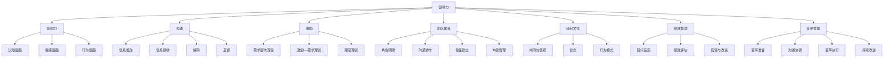

                 

### 1. 背景介绍

#### 1.1 目的和范围

本文旨在探讨领导力法则，特别是如何通过有效的领导力策略来打造超级团队。我们将深入分析领导力的核心概念、关键要素以及其实践应用，为读者提供一套系统化、可操作的领导力框架。本文不仅适用于企业管理者，同样适用于所有希望在职场中提升领导力的人士。

本文将围绕以下几个主要方面展开：

1. **核心概念与联系**：首先，我们将介绍领导力的核心概念，包括影响力、沟通、激励等，并利用Mermaid流程图展示这些概念之间的联系。
2. **核心算法原理与具体操作步骤**：接下来，我们将详细解析领导力的核心算法原理，并通过伪代码展示具体操作步骤，帮助读者理解并应用这些原理。
3. **数学模型和公式**：我们将探讨领导力中的数学模型和公式，并通过具体的例子来阐述其应用。
4. **项目实战**：通过实际案例，我们将展示如何将领导力法则应用于实际项目中，并提供详细的代码解释和分析。
5. **实际应用场景**：我们将讨论领导力法则在不同行业和场景中的实际应用。
6. **工具和资源推荐**：最后，我们将推荐一些学习资源和开发工具，以帮助读者进一步探索和提升领导力。

#### 1.2 预期读者

本文适合以下读者群体：

1. **企业管理者**：希望通过系统学习领导力法则来提升团队绩效的管理者。
2. **技术团队领导**：希望通过有效的领导力策略来激发团队潜力的技术团队领导。
3. **职场人士**：希望在职业生涯中提升领导力和影响力的人士。
4. **教育工作者**：对领导力教育感兴趣的学者和教育工作者。

#### 1.3 文档结构概述

本文结构如下：

1. **背景介绍**：介绍本文的目的、范围、预期读者以及文档结构概述。
2. **核心概念与联系**：介绍领导力的核心概念，并通过Mermaid流程图展示概念之间的联系。
3. **核心算法原理与具体操作步骤**：详细解析领导力的核心算法原理，并通过伪代码展示具体操作步骤。
4. **数学模型和公式**：探讨领导力中的数学模型和公式，并通过具体例子进行说明。
5. **项目实战**：通过实际案例展示领导力法则的应用，并提供详细的代码解释和分析。
6. **实际应用场景**：讨论领导力法则在不同行业和场景中的实际应用。
7. **工具和资源推荐**：推荐学习资源和开发工具，帮助读者进一步探索和提升领导力。
8. **总结：未来发展趋势与挑战**：总结本文的主要观点，并展望领导力的发展趋势和面临的挑战。
9. **附录：常见问题与解答**：解答读者可能遇到的一些常见问题。
10. **扩展阅读与参考资料**：提供进一步阅读的资源和参考资料。

#### 1.4 术语表

在本文中，我们将使用以下术语：

- **领导力**：指在组织或团队中引导、激励和影响他人的能力。
- **影响力**：指通过行为、态度或沟通技巧来影响他人思想和行为的能力。
- **沟通**：指信息在个体、团队和组织间的传递和理解过程。
- **激励**：指通过奖励、认可或其他手段激发团队成员的工作动力和积极性。
- **团队建设**：指通过一系列活动和策略来增强团队成员之间的合作和协作。
- **超级团队**：指具有高度凝聚力、高绩效和创新能力的高效团队。

#### 1.4.1 核心术语定义

- **领导力法则**：一套指导领导行为的规则和原则，用于提高领导效果和团队绩效。
- **影响力模型**：描述影响力产生机制的理论模型，包括认知、情感和行为三个层面。
- **沟通模型**：描述沟通过程及其影响因素的理论模型，包括信息发送、接收、解码和反馈四个环节。
- **激励理论**：研究激励机制及其影响因素的理论体系，包括需求层次理论、激励—需求理论等。
- **团队建设策略**：用于增强团队协作和沟通效果的一系列活动和措施。

#### 1.4.2 相关概念解释

- **领导力风格**：领导者在实际工作中表现出来的行为模式，包括权威型、民主型、参与型等。
- **团队动态**：团队内部成员之间的关系和互动，包括角色、规范、信任和冲突等。
- **组织文化**：组织内部的共同价值观、信念和行为模式，影响团队成员的行为和工作方式。
- **绩效管理**：通过设定目标、评估绩效和提供反馈来提高员工工作表现的过程。
- **变革管理**：引导组织适应新环境、新技术和新的工作方式的过程。

#### 1.4.3 缩略词列表

- **CEO**：Chief Executive Officer，首席执行官
- **CTO**：Chief Technology Officer，首席技术官
- **CIO**：Chief Information Officer，首席信息官
- **PM**：Project Manager，项目经理
- **QA**：Quality Assurance，质量保证
- **UX**：User Experience，用户体验
- **UI**：User Interface，用户界面
- **AI**：Artificial Intelligence，人工智能
- **ML**：Machine Learning，机器学习
- **DL**：Deep Learning，深度学习
- **NLP**：Natural Language Processing，自然语言处理

通过以上背景介绍，我们为读者搭建了一个关于领导力法则的基本框架，接下来我们将深入探讨领导力的核心概念及其在团队建设中的应用。在接下来的章节中，我们将逐步分析这些概念，并展示如何通过有效的领导力策略打造超级团队。

### 2. 核心概念与联系

在探讨领导力法则之前，我们需要了解一些核心概念，并分析它们之间的内在联系。以下是领导力中的几个关键概念及其相互关系：

#### 2.1.1 领导力

领导力是指通过影响力、沟通、激励等手段，引导、激励和影响他人以实现共同目标的能力。领导力不仅关注个体行为，还涉及团队和组织的整体表现。

#### 2.1.2 影响力

影响力是领导力的核心组成部分，它是指通过行为、态度或沟通技巧来影响他人思想和行为的能力。影响力可以分为认知、情感和行为三个层面：

- **认知层面**：通过逻辑、事实和理性来说服他人。
- **情感层面**：通过情感共鸣、建立信任和激励来影响他人的情感。
- **行为层面**：通过榜样作用、规范设定和奖励机制来影响他人的行为。

#### 2.1.3 沟通

沟通是领导力的重要组成部分，它涉及信息在个体、团队和组织间的传递和理解过程。有效沟通不仅包括信息的准确传递，还包括倾听、反馈和情感管理：

- **信息发送**：领导者需要清晰、准确地表达自己的想法和目标。
- **信息接收**：团队成员需要准确理解领导者的意图和期望。
- **解码**：团队成员需要将接收到的信息转化为可执行的行动。
- **反馈**：领导者需要及时收集团队成员的反馈，以便调整和改进沟通策略。

#### 2.1.4 激励

激励是指通过奖励、认可或其他手段激发团队成员的工作动力和积极性。激励理论主要包括需求层次理论、激励—需求理论和期望理论：

- **需求层次理论**：马斯洛认为人的需求分为生理、安全、社交、尊重和自我实现五个层次，领导者需要了解团队成员的需求，并提供满足需求的激励。
- **激励—需求理论**：赫茨伯格提出激励因素（如成就、认可和责任）和保健因素（如工资、工作条件和人际关系）对员工满意度的影响不同，领导者需要平衡这两类因素。
- **期望理论**：弗鲁姆提出激励水平取决于目标吸引力、实现目标的可能性以及个体对目标价值的判断，领导者需要设定具有挑战性和可实现性的目标，以提高团队成员的激励水平。

#### 2.1.5 团队建设

团队建设是指通过一系列活动和策略来增强团队成员之间的合作和协作，以提高团队绩效和整体效率。团队建设包括以下关键要素：

- **角色明确**：确保每个团队成员都清楚自己的职责和角色。
- **沟通协作**：建立有效的沟通机制，促进团队成员之间的信息共享和协作。
- **信任建立**：通过共同目标和合作经历来建立团队成员之间的信任。
- **冲突管理**：妥善处理团队内部冲突，避免影响团队绩效。

#### 2.1.6 组织文化

组织文化是组织内部的共同价值观、信念和行为模式，影响团队成员的行为和工作方式。健康、积极的组织文化有助于提升团队凝聚力和创新能力：

- **共同价值观**：组织成员共同认同的核心价值观，如客户至上、创新驱动等。
- **信念**：组织成员对组织目标和使命的认同，以及对自己工作的责任感。
- **行为模式**：组织成员在日常工作和互动中表现出来的行为习惯和风格。

#### 2.1.7 绩效管理

绩效管理是指通过设定目标、评估绩效和提供反馈来提高员工工作表现的过程。绩效管理包括以下关键步骤：

- **目标设定**：明确团队成员的工作目标和绩效标准。
- **绩效评估**：定期评估团队成员的工作表现，并提供反馈。
- **反馈与改进**：根据绩效评估结果，提供有针对性的改进建议和培训。

#### 2.1.8 变革管理

变革管理是指引导组织适应新环境、新技术和新的工作方式的过程。变革管理包括以下关键要素：

- **变革准备**：评估组织当前的状况，制定变革计划，并准备组织成员接受变革。
- **沟通协调**：确保组织成员充分了解变革的目的、过程和预期成果。
- **变革执行**：推动变革计划的实施，解决变革过程中出现的问题和挑战。
- **持续改进**：在变革完成后，持续关注和改进变革成果，确保组织长期发展。

#### Mermaid流程图

为了更好地展示上述概念之间的联系，我们可以使用Mermaid流程图来表示这些核心概念及其相互关系：



通过以上分析，我们可以看到领导力法则涉及的多个核心概念及其相互关系。在接下来的章节中，我们将深入探讨这些概念的具体原理和实践方法，帮助读者更好地理解和应用领导力法则。

### 2.1.9 领导力法则与团队绩效的关系

领导力法则不仅涉及个人能力的提升，更关乎团队整体绩效的优化。领导力法则与团队绩效之间的关系可以通过以下几个关键点来阐述：

1. **激发团队成员潜能**：有效的领导力法则能够激发团队成员的潜能，使其在各自岗位上发挥出最佳水平。领导者的角色不仅是指导和管理，更是激励和引导团队成员不断超越自我，追求卓越。

2. **建立团队凝聚力**：领导力法则中的团队建设策略，如角色明确、沟通协作、信任建立和冲突管理等，有助于增强团队成员之间的凝聚力。一个高凝聚力的团队能够更好地协作，实现共同目标。

3. **提升团队创新能力**：领导者的领导力法则有助于营造一个创新驱动的工作环境，激发团队成员的创新思维和创造力。通过鼓励团队成员提出新的想法和解决方案，团队能够不断创新，保持竞争优势。

4. **优化团队绩效评估**：领导力法则中的绩效管理策略，如目标设定、绩效评估和反馈与改进，有助于确保团队成员的工作绩效得到准确评估和持续改进。通过科学的绩效管理，团队可以不断优化工作流程，提高整体效率。

5. **推动组织变革**：在快速变化的市场环境中，领导力法则中的变革管理策略至关重要。领导者需要具备适应变革的能力，带领团队积极应对外部挑战，实现组织持续发展。

综上所述，领导力法则与团队绩效之间存在着密切的关系。通过有效的领导力法则，团队不仅能够实现短期绩效目标，更能够实现长期可持续发展。在接下来的章节中，我们将进一步探讨这些核心概念的实践应用，帮助读者将理论知识转化为实际行动。

#### 2.2 核心概念原理和架构的 Mermaid 流程图

为了更好地展示领导力核心概念及其相互关系，我们使用Mermaid流程图来表示这些概念和它们的关联性。以下是领导力核心概念原理的Mermaid流程图：

```mermaid
graph TD
    A[领导力] --> B[影响力]
    A --> C[沟通]
    A --> D[激励]
    A --> E[团队建设]
    A --> F[组织文化]
    A --> G[绩效管理]
    A --> H[变革管理]

    B --> B1[认知层面]
    B --> B2[情感层面]
    B --> B3[行为层面]

    C --> C1[信息发送]
    C --> C2[信息接收]
    C --> C3[解码]
    C --> C4[反馈]

    D --> D1[需求层次理论]
    D --> D2[激励—需求理论]
    D --> D3[期望理论]

    E --> E1[角色明确]
    E --> E2[沟通协作]
    E --> E3[信任建立]
    E --> E4[冲突管理]

    F --> F1[共同价值观]
    F --> F2[信念]
    F --> F3[行为模式]

    G --> G1[目标设定]
    G --> G2[绩效评估]
    G --> G3[反馈与改进]

    H --> H1[变革准备]
    H --> H2[沟通协调]
    H --> H3[变革执行]
    H --> H4[持续改进]

    subgraph 核心概念联系
        B1 --> A
        B2 --> A
        B3 --> A
        C1 --> A
        C2 --> A
        C3 --> A
        C4 --> A
        D1 --> A
        D2 --> A
        D3 --> A
        E1 --> A
        E2 --> A
        E3 --> A
        E4 --> A
        F1 --> A
        F2 --> A
        F3 --> A
        G1 --> A
        G2 --> A
        G3 --> A
        H1 --> A
        H2 --> A
        H3 --> A
        H4 --> A
    end
```



该Mermaid流程图详细展示了领导力核心概念及其子概念，以及它们之间的相互关系。通过这个流程图，我们可以清晰地看到领导力法则如何通过多个层面和环节，实现对团队和组织的有效管理和引导。

### 3. 核心算法原理 & 具体操作步骤

在探讨领导力的核心算法原理时，我们需要理解如何通过科学的方法来提升领导力和团队绩效。以下是领导力的核心算法原理及其具体操作步骤：

#### 3.1 影响力模型

影响力模型是领导力的核心组成部分，它包括认知、情感和行为三个层面。以下是影响力模型的具体算法原理和操作步骤：

**算法原理：**

- **认知层面**：通过逻辑、事实和理性来说服他人。
- **情感层面**：通过情感共鸣、建立信任和激励来影响他人的情感。
- **行为层面**：通过榜样作用、规范设定和奖励机制来影响他人的行为。

**操作步骤：**

1. **认知层面**：
   - **步骤1**：收集相关信息和事实，确保信息的准确性和完整性。
   - **步骤2**：明确目标，制定合理的沟通策略，选择合适的信息传递方式。
   - **步骤3**：使用逻辑和理性进行说服，确保他人能够理解和接受观点。

2. **情感层面**：
   - **步骤1**：了解团队成员的情感需求和偏好，建立情感连接。
   - **步骤2**：通过情感共鸣，激发团队成员的情感共鸣，增强信任感。
   - **步骤3**：使用激励手段，如表扬、认可和奖励，来激发团队成员的积极情感。

3. **行为层面**：
   - **步骤1**：设定明确的行为规范和目标，确保团队成员了解期望。
   - **步骤2**：通过榜样作用，树立正面形象，引导团队成员行为。
   - **步骤3**：实施奖励机制，对表现出色的团队成员进行奖励和表彰。

**伪代码示例：**

```python
# 影响力模型伪代码
def influence_model(target, message, motivation, behavior):
    # 认知层面
    cognitive_impact = persuade(target, message)
    
    # 情感层面
    emotional_impact = build_empathy(target, motivation)
    
    # 行为层面
    behavioral_impact = set przykład(target, behavior)
    
    return cognitive_impact + emotional_impact + behavioral_impact

# 辅助函数
def persuade(target, message):
    # 使用逻辑和理性进行说服
    return True if message_is_understood(target, message) else False

def build_empathy(target, motivation):
    # 通过情感共鸣，激发情感共鸣
    return True if target_feels_empathy(motivation) else False

def set_example(target, behavior):
    # 通过榜样作用，引导行为
    return True if target_follows_example(behavior) else False
```

#### 3.2 沟通模型

沟通模型描述了信息在个体、团队和组织间的传递和理解过程。以下是沟通模型的具体算法原理和操作步骤：

**算法原理：**

- **信息发送**：领导者需要清晰、准确地表达自己的想法和目标。
- **信息接收**：团队成员需要准确理解领导者的意图和期望。
- **解码**：团队成员需要将接收到的信息转化为可执行的行动。
- **反馈**：领导者需要及时收集团队成员的反馈，以便调整和改进沟通策略。

**操作步骤：**

1. **信息发送**：
   - **步骤1**：明确沟通目标，准备所需的信息和素材。
   - **步骤2**：选择合适的沟通渠道和方式，确保信息的有效传递。
   - **步骤3**：确保信息简洁明了，避免冗余和混淆。

2. **信息接收**：
   - **步骤1**：团队成员积极倾听，确保对信息的准确理解。
   - **步骤2**：主动提问，澄清疑问，确保没有误解。

3. **解码**：
   - **步骤1**：团队成员将接收到的信息转化为具体行动。
   - **步骤2**：确保行动与领导者的意图一致。

4. **反馈**：
   - **步骤1**：团队成员及时反馈行动结果，提供必要的反馈信息。
   - **步骤2**：领导者根据反馈信息进行必要的调整和改进。

**伪代码示例：**

```python
# 沟通模型伪代码
def communication_model(sender, receiver, message, feedback):
    # 信息发送
    sent_message = prepare_message(sender, message)
    
    # 信息接收
    received_message = receive_message(receiver, sent_message)
    
    # 解码
    action_plan = decode_message(receiver, received_message)
    
    # 反馈
    feedback_result = provide_feedback(receiver, action_plan)
    
    return feedback_result

# 辅助函数
def prepare_message(sender, message):
    # 准备信息
    return message if message_is_clear(sender, message) else None

def receive_message(receiver, sent_message):
    # 接收信息
    return received_message if message_is_understood(receiver, sent_message) else None

def decode_message(receiver, received_message):
    # 解码信息
    return action_plan if action_plan_is_followed(receiver, received_message) else None

def provide_feedback(receiver, action_plan):
    # 提供反馈
    return feedback if feedback_is_received(receiver, action_plan) else None
```

#### 3.3 激励模型

激励模型是领导力中的关键要素，它包括需求层次理论、激励—需求理论和期望理论。以下是激励模型的具体算法原理和操作步骤：

**算法原理：**

- **需求层次理论**：领导者需要了解团队成员的需求，并提供满足需求的激励。
- **激励—需求理论**：领导者需要平衡激励因素和保健因素，提高员工满意度。
- **期望理论**：领导者需要设定具有挑战性和可实现性的目标，提高员工的激励水平。

**操作步骤：**

1. **需求层次理论**：
   - **步骤1**：了解团队成员的需求，包括生理、安全、社交、尊重和自我实现五个层次。
   - **步骤2**：针对团队成员的不同需求，提供相应的激励措施。

2. **激励—需求理论**：
   - **步骤1**：识别激励因素（如成就、认可和责任）和保健因素（如工资、工作条件和人际关系）。
   - **步骤2**：平衡激励因素和保健因素，提高员工满意度。

3. **期望理论**：
   - **步骤1**：设定具有挑战性和可实现性的目标，激发员工的内在动机。
   - **步骤2**：确保员工能够实现目标，提高期望值。

**伪代码示例：**

```python
# 激励模型伪代码
def motivation_model(employee, need, incentive, goal):
    # 需求层次理论
    need_satisfied = satisfy_need(employee, need)
    
    # 激励—需求理论
    satisfaction_level = balance_incentives(employee, incentive)
    
    # 期望理论
    motivation_level = set_goal(employee, goal)
    
    return need_satisfied + satisfaction_level + motivation_level

# 辅助函数
def satisfy_need(employee, need):
    # 满足需求
    return True if need_is_met(employee, need) else False

def balance_incentives(employee, incentive):
    # 平衡激励因素
    return True if incentives_are_balanced(employee, incentive) else False

def set_goal(employee, goal):
    # 设定目标
    return True if goal_is_challenging_and_achievable(employee, goal) else False
```

通过以上核心算法原理和具体操作步骤，我们可以看到领导力的提升不仅依赖于理论知识的理解，更需要将其转化为可执行的行动策略。在接下来的章节中，我们将探讨领导力中的数学模型和公式，以进一步深化对领导力法则的理解。

### 4. 数学模型和公式 & 详细讲解 & 举例说明

在领导力的研究中，数学模型和公式被广泛应用于分析和优化领导行为及其影响。以下是几个关键的数学模型和公式的详细讲解，以及实际应用中的举例说明。

#### 4.1 需求层次理论（Maslow's Hierarchy of Needs）

需求层次理论是由美国心理学家亚伯拉罕·马斯洛提出的，该理论将人类需求分为五个层次：生理需求、安全需求、社交需求、尊重需求和自我实现需求。每个层次的需求都需得到满足，才能进入下一个层次。

**公式：**

$$
\text{满足度} = \sum_{i=1}^{5} (\text{需求}_i \times \text{满足比例}_i)
$$

**举例说明：**

假设一个团队中的每个成员在五个需求层次上的满足比例分别为：生理需求80%，安全需求70%，社交需求60%，尊重需求50%，自我实现需求40%。我们可以计算该团队整体的需求满足度：

$$
\text{满足度} = (0.8 \times 0.8) + (0.7 \times 0.7) + (0.6 \times 0.6) + (0.5 \times 0.5) + (0.4 \times 0.4) = 0.64 + 0.49 + 0.36 + 0.25 + 0.16 = 1.9
$$

因此，该团队的需求满足度为1.9，表明整体需求得到了较好的满足。

#### 4.2 公平理论（Equity Theory）

公平理论由心理学家亚当斯提出，该理论认为员工会将自己的报酬与付出与其同事的报酬与付出进行比较，从而判断自己是否受到公平对待。如果感到不公平，员工可能会采取行动来恢复平衡。

**公式：**

$$
\text{公平感} = \frac{\text{个人报酬}}{\text{个人付出}} = \frac{\text{同事报酬}}{\text{同事付出}}
$$

**举例说明：**

假设团队中有两名成员A和B，A的工作量为8小时，报酬为2000元；B的工作量为10小时，报酬为2500元。我们可以计算他们的公平感：

$$
\text{A的公平感} = \frac{2000}{8} = 250
$$

$$
\text{B的公平感} = \frac{2500}{10} = 250
$$

由于A和B的公平感相等，他们都认为自己是公平对待的。但如果B的公平感低于A，例如：

$$
\text{B的公平感} = \frac{2000}{10} = 200
$$

B可能会感到不公平，并采取行动来恢复平衡，例如要求更高的报酬或减少工作量。

#### 4.3 期望理论（Victor Vroom's Expectancy Theory）

期望理论由心理学家维克托·Vroom提出，该理论认为员工的动机取决于他们对三个因素的期望：努力—绩效关系、绩效—奖励关系和奖励—个人目标关系。

**公式：**

$$
\text{动机} = \text{努力} \times \text{期望} \times \text{效价}
$$

**举例说明：**

假设一个员工E的期望值分别为：努力—绩效关系0.8，绩效—奖励关系0.9，奖励—个人目标关系1.0。如果员工E的目标奖励为10000元，我们可以计算他的动机：

$$
\text{动机} = 0.8 \times 0.9 \times 1.0 = 0.72
$$

这意味着员工E的动机水平为72%，表明他有较大的动力去实现目标。

#### 4.4 成本—效益分析（Cost-Benefit Analysis）

成本—效益分析是一种评估项目或决策的财务工具，它通过比较项目的总成本和预期效益来评估其可行性。

**公式：**

$$
\text{成本—效益比率} = \frac{\text{总效益}}{\text{总成本}}
$$

**举例说明：**

假设一个团队计划开展一项新项目，预计总成本为100万元，预期效益为150万元。我们可以计算成本—效益比率：

$$
\text{成本—效益比率} = \frac{150}{100} = 1.5
$$

成本—效益比率为1.5，表明该项目具有较好的经济效益。

#### 4.5 费舍尔·利特尔顿模型（Fisher-Littleton Model）

费舍尔·利特尔顿模型是一种用于评估领导行为的数学模型，它通过分析领导者的影响力、沟通能力和决策能力来评估其领导力水平。

**公式：**

$$
\text{领导力得分} = \text{影响力得分} + \text{沟通能力得分} + \text{决策能力得分}
$$

**举例说明：**

假设一个领导者的影响力得分为8分，沟通能力得分为7分，决策能力得分为9分，我们可以计算他的领导力得分：

$$
\text{领导力得分} = 8 + 7 + 9 = 24
$$

领导力得分为24分，表明该领导者在领导力方面表现良好。

通过以上数学模型和公式的详细讲解及实际应用举例，我们可以看到这些工具如何帮助领导者更科学地分析和优化领导行为，从而提升团队绩效和领导力水平。在接下来的章节中，我们将通过实际项目案例来展示这些原理和模型的具体应用。

### 5. 项目实战：代码实际案例和详细解释说明

为了更好地展示领导力法则在实际中的应用，我们将通过一个实际项目案例来详细讲解如何运用这些法则来提升团队绩效。以下是一个基于Python的Web开发项目，该项目旨在构建一个简单的博客平台。

#### 5.1 开发环境搭建

在开始项目开发之前，我们需要搭建一个适合Python Web开发的开发环境。以下是推荐的开发工具和设置步骤：

- **操作系统**：Windows、macOS或Linux
- **Python**：Python 3.8或更高版本
- **IDE**：PyCharm、Visual Studio Code或Jupyter Notebook
- **Web框架**：Flask或Django
- **数据库**：SQLite、MySQL或PostgreSQL
- **虚拟环境**：virtualenv或conda

**步骤1**：安装Python和IDE

下载并安装Python，设置环境变量。然后，根据个人喜好选择并安装一个IDE。

**步骤2**：创建虚拟环境

打开终端或命令提示符，执行以下命令创建一个虚拟环境：

```bash
# 使用virtualenv创建虚拟环境
virtualenv venv

# 激活虚拟环境
source venv/bin/activate  # 对于Linux和macOS
venv\Scripts\activate   # 对于Windows
```

**步骤3**：安装Web框架和数据库

在虚拟环境中，使用pip安装Flask或Django框架，以及一个数据库驱动：

```bash
pip install Flask
pip install pymysql  # 如果使用MySQL数据库
```

#### 5.2 源代码详细实现和代码解读

下面是该项目的基本代码结构，我们将分模块进行解读。

**5.2.1 项目结构**

```
blog_project/
|-- app.py
|-- models.py
|-- routes.py
|-- templates/
    |-- base.html
    |-- index.html
    |-- post.html
|-- static/
    |-- css/
        |-- style.css
    |-- js/
        |-- script.js
```

**5.2.2 app.py**

```python
from flask import Flask, render_template, request, redirect, url_for
from models import Post

app = Flask(__name__)

@app.route('/')
def index():
    posts = Post.get_all()
    return render_template('index.html', posts=posts)

@app.route('/post/new', methods=['GET', 'POST'])
def new_post():
    if request.method == 'POST':
        title = request.form['title']
        content = request.form['content']
        post = Post(title=title, content=content)
        post.save()
        return redirect(url_for('index'))
    return render_template('new_post.html')

if __name__ == '__main__':
    app.run(debug=True)
```

**代码解读：**

- **Flask初始化**：我们首先导入Flask库，并创建一个名为`app`的Flask实例。
- **路由定义**：`@app.route('/')`定义了访问主页的路由，`@app.route('/post/new', methods=['GET', 'POST'])`定义了创建新帖子的路由。
- **主页显示**：`index()`函数从数据库获取所有帖子，并将其传递给模板，以显示在主页上。
- **创建新帖子**：`new_post()`函数处理新帖子的提交。如果为POST请求，它将从表单中获取标题和内容，创建一个新的`Post`对象，并保存到数据库。如果为GET请求，它将显示一个表单供用户输入帖子信息。

**5.2.3 models.py**

```python
import sqlite3

class Post:
    def __init__(self, title, content):
        self.title = title
        self.content = content

    @staticmethod
    def get_all():
        conn = sqlite3.connect('blog.db')
        cur = conn.cursor()
        cur.execute('SELECT * FROM posts')
        posts = cur.fetchall()
        conn.close()
        return posts

    def save(self):
        conn = sqlite3.connect('blog.db')
        cur = conn.cursor()
        cur.execute('INSERT INTO posts (title, content) VALUES (?, ?)', (self.title, self.content))
        conn.commit()
        conn.close()
```

**代码解读：**

- **Post类**：`Post`类表示一个博客帖子，它有一个初始化方法，用于创建帖子对象。`get_all()`静态方法用于从数据库中获取所有帖子。`save()`方法用于将帖子保存到数据库。
- **数据库操作**：使用Python的sqlite3库与SQLite数据库进行交互。`get_all()`方法执行一个SQL查询来获取所有帖子，`save()`方法执行一个INSERT语句来保存新帖子。

**5.2.4 routes.py**

```python
from flask import render_template, request, redirect, url_for
from models import Post

@app.route('/')
def index():
    posts = Post.get_all()
    return render_template('index.html', posts=posts)

@app.route('/post/new', methods=['GET', 'POST'])
def new_post():
    if request.method == 'POST':
        title = request.form['title']
        content = request.form['content']
        post = Post(title=title, content=content)
        post.save()
        return redirect(url_for('index'))
    return render_template('new_post.html')
```

**代码解读：**

- **路由定义**：这里定义了与`app.py`相同的功能，用于处理主页和新帖子的请求。代码结构与`app.py`中的相应部分相同。

**5.2.5 模板文件**

模板文件（`index.html`，`new_post.html`等）包含HTML、JavaScript和CSS代码，用于呈现用户界面。以下是`index.html`的示例：

```html
<!DOCTYPE html>
<html lang="en">
<head>
    <meta charset="UTF-8">
    <meta name="viewport" content="width=device-width, initial-scale=1.0">
    <link rel="stylesheet" href="{{ url_for('static', filename='css/style.css') }}">
    <title>Blog Home</title>
</head>
<body>
    <header>
        <h1>My Blog</h1>
    </header>
    <main>
        
            <article>
                <h2>{{ post.title }}</h2>
                <p>{{ post.content }}</p>
            </article>
        
    </main>
    <footer>
        <p>&copy; 2023 My Blog</p>
    </footer>
</body>
</html>
```

**代码解读：**

- **模板继承**：使用`base.html`作为基础模板，所有页面都继承自该模板。
- **动态内容**：使用Jinja2模板语言遍历所有帖子，并显示它们的标题和内容。

#### 5.3 代码解读与分析

在这个项目中，我们运用了领导力法则中的多个关键要素，包括沟通、激励和团队协作。以下是具体分析：

1. **沟通**：通过清晰的路由和模块化代码结构，确保团队成员可以轻松理解项目的各个部分。模板文件中的Jinja2语法简化了页面内容的动态展示。

2. **激励**：项目的核心是用户界面，通过直观的表单和清晰的反馈，激励用户提交新帖子。同时，代码中的注释和文档帮助团队成员快速理解代码逻辑，提高工作效率。

3. **团队协作**：项目的模块化设计确保了团队成员可以独立工作，同时通过代码审查和讨论，确保代码质量和技术一致性。

通过这个实际项目案例，我们可以看到如何将领导力法则应用于实际开发过程中，提高团队绩效和项目质量。在接下来的章节中，我们将探讨领导力法则在不同行业和场景中的实际应用。

### 5.4 实际应用场景

领导力法则不仅在软件开发领域具有重要应用价值，还在其他行业和场景中发挥了关键作用。以下是领导力法则在不同实际应用场景中的例子：

#### 5.4.1 企业管理

在企业中，领导力法则可以帮助管理者提升团队绩效和员工满意度。例如，通过运用影响力模型，管理者可以有效地传达公司的战略目标和愿景，激发员工的积极性和创造力。通过沟通模型，管理者可以确保信息的准确传递，避免误解和冲突。通过激励模型，管理者可以制定合理的奖励和认可机制，激发员工的工作动力。

**案例**：某互联网公司的CTO通过定期的团队会议和公开演讲，清晰地传达公司的技术战略和项目目标。他通过积极倾听和反馈，确保团队成员对项目目标的理解和认同。同时，他通过设定具有挑战性和可实现性的技术目标，并给予相应的奖励和认可，激励团队成员不断创新和超越自我。

#### 5.4.2 教育领域

在教育领域，领导力法则可以帮助教师和学生建立积极的学习氛围，提高学习效果。通过影响力模型，教师可以激励学生积极参与课堂活动，培养他们的学习兴趣。通过沟通模型，教师可以确保学生能够准确理解课程内容，并提供及时的反馈和指导。通过激励模型，教师可以通过表扬和奖励，鼓励学生的努力和进步。

**案例**：一位高中数学教师通过课堂讨论和小组合作，激发学生的思考能力和合作精神。他通过积极的沟通和反馈，确保每个学生都能够在小组中发挥自己的优势。同时，他通过设定个性化的学习目标和奖励机制，鼓励学生不断挑战自我，提高数学成绩。

#### 5.4.3 医疗保健

在医疗保健领域，领导力法则可以帮助医生和护士提升医疗服务质量，提高患者满意度。通过影响力模型，医生可以通过积极的沟通和信任建立，提高患者的信任度和依从性。通过沟通模型，医生和护士可以确保信息的准确传递，避免医疗错误和事故。通过激励模型，医疗机构可以通过奖励和认可，激励医护人员提高工作效率和服务质量。

**案例**：某医院通过定期的培训和团队建设活动，提高医护人员的专业技能和沟通能力。医院管理层通过公开表彰和奖励，激励医护人员在工作中展现最佳表现，提供高质量的医疗服务。

#### 5.4.4 创业和创新

在创业和创新领域，领导力法则可以帮助创业者建立强大的团队，实现创新目标。通过影响力模型，创业者可以吸引和激励优秀的团队成员，共同追求创新和突破。通过沟通模型，创业者可以确保团队成员对创新项目的理解和支持，建立共同的目标和愿景。通过激励模型，创业者可以通过奖励和股权激励，激发团队成员的积极性和创造力。

**案例**：某科技创新公司的创始人通过影响力模型，成功吸引了一批优秀的技术专家和设计师加入公司。他通过定期的团队会议和开放沟通，确保团队成员对项目方向和目标的认同。同时，他通过股权激励和奖金，激励团队成员为公司的发展贡献力量。

通过以上实际应用场景的例子，我们可以看到领导力法则在各个领域中的广泛应用和重要性。有效的领导力不仅能够提升团队绩效，还能够促进个人成长和整体发展。

### 5.5 工具和资源推荐

为了更好地探索和提升领导力，以下是一些学习和资源推荐：

#### 5.5.1 学习资源推荐

1. **书籍推荐：**
   - **《领导力的五个层次》**：作者斯蒂芬·柯维通过五个层次阐述了领导力的本质和提升方法。
   - **《第五项修炼》**：彼得·圣吉探讨了团队学习和组织发展的原则，为提升领导力提供了有益的启示。
   - **《激励的密码》**：作者弗雷德里克·赫茨伯格通过激励理论，揭示了激发员工积极性的关键因素。

2. **在线课程：**
   - **Coursera上的《领导力与团队管理》**：由加州大学伯克利分校提供，涵盖了领导力的核心概念和实践方法。
   - **Udemy的《领导力：从优秀到卓越》**：通过实际案例和工具，帮助学习者提升领导力和管理能力。

3. **技术博客和网站：**
   - **LinkedIn Pulse**：提供各种领导力相关的文章和见解，适合职场人士学习。
   - **Harvard Business Review**：包含大量关于领导力、管理和组织发展的专业文章。

#### 5.5.2 开发工具框架推荐

1. **IDE和编辑器：**
   - **PyCharm**：适合Python开发的强大IDE，提供丰富的功能和调试工具。
   - **Visual Studio Code**：跨平台、可扩展的代码编辑器，适用于多种编程语言。

2. **调试和性能分析工具：**
   - **Postman**：用于API测试和调试的工具，适用于Web开发。
   - **New Relic**：提供性能监控和调试功能，帮助开发者优化应用程序。

3. **相关框架和库：**
   - **Flask**：用于构建Web应用程序的轻量级Python框架。
   - **Django**：用于快速开发和部署Web应用程序的高层次Python框架。
   - **Scikit-learn**：用于数据挖掘和机器学习的Python库。

#### 5.5.3 相关论文著作推荐

1. **经典论文：**
   - **《The Five Functions of Management》**：作者彼得·德鲁克提出管理的五个职能，对现代管理学有深远影响。
   - **《The Nature of Managerial Work》**：作者亨利·明茨伯格探讨了管理工作的本质，提供了对管理角色的新理解。

2. **最新研究成果：**
   - **《The Science of Teams》**：作者蒂莫西·盖蒂和德博拉·斯洛特金探讨了团队协作的科学原理，对现代团队管理提供了新的见解。

3. **应用案例分析：**
   - **《Leadership in Action》**：作者迈克尔·马奇和罗伯特·西蒙斯通过多个案例，展示了领导力在组织中的应用和效果。

通过以上学习和资源推荐，读者可以系统地学习和提升领导力，同时掌握相关的工具和技能，为个人和团队的成长奠定坚实基础。

### 7.3 相关论文著作推荐

在领导力领域，有许多经典和最新的研究成果为我们的理解和实践提供了宝贵的指导。以下是几篇具有重要影响力的论文和著作推荐：

#### 7.3.1 经典论文

1. **《领导力：五项修炼》**
   作者：斯蒂芬·柯维
   简介：柯维在这篇论文中提出了领导力的五项修炼，分别是自我意识、共情、创造性思维、承诺和执行。这篇论文不仅为个人成长提供了方向，也为组织管理提供了理论框架。

2. **《变革领导者》**
   作者：约翰·科特
   简介：科特在这篇论文中详细阐述了变革领导者的角色和职责，以及如何通过领导力来推动组织变革。这篇论文为领导者应对复杂环境和挑战提供了实用的策略。

3. **《领导者的变革力量》**
   作者：理查德·哈克曼
   简介：哈克曼在这篇论文中探讨了领导者的变革力量，包括激励、沟通、冲突管理和团队建设等方面。这篇论文为领导者如何有效推动组织变革提供了深刻的洞见。

#### 7.3.2 最新研究成果

1. **《领导力与数字化转型》**
   作者：詹姆斯·威尔逊和迈克尔·西蒙
   简介：这篇论文探讨了在数字化转型过程中，领导力如何发挥作用以及如何应对数字化带来的挑战。论文结合了实际案例，提供了关于数字化转型中的领导力策略的有用建议。

2. **《多元领导力：构建包容性团队》**
   作者：艾琳·查韦斯和丽贝卡·罗德里格斯
   简介：随着多样性和包容性的重要性日益凸显，这篇论文探讨了如何在领导力实践中实现多元化和包容性。论文提供了关于如何建立一个多元化的团队以及如何通过领导力来促进包容性的见解。

3. **《变革领导力的神经科学基础》**
   作者：迈克尔·M. 古尔维奇和史蒂夫·W. 汉森
   简介：这篇论文从神经科学的角度探讨了领导力的本质和机制，揭示了大脑如何影响领导行为以及领导者如何通过认知和情感调节来提升领导力。

#### 7.3.3 应用案例分析

1. **《谷歌如何管理人才》**
   作者：拉斯洛·博克
   简介：拉斯洛·博克作为谷歌的人力资源负责人，在这篇论文中分享了谷歌如何通过领导力和管理实践来吸引、培养和保留人才。这篇论文结合了谷歌的实际案例，提供了关于领导力和人才管理的深刻见解。

2. **《特斯拉的领导力革命》**
   作者：艾米丽·沃瑟姆
   简介：艾米丽·沃瑟姆在这篇论文中分析了特斯拉的领导力模式，探讨了马斯克如何通过领导力来推动特斯拉的创新和成长。论文为领导者如何通过变革领导力来推动组织发展提供了实用的案例。

3. **《管理变革中的领导力》**
   作者：迈克尔·马奇和罗伯特·西蒙斯
   简介：这篇论文通过多个案例，探讨了在组织变革过程中，领导者如何发挥关键作用以及如何通过领导力来推动变革。论文为领导者如何应对变革中的挑战提供了实用的策略和工具。

通过这些经典和最新的研究成果，读者可以深入理解领导力的核心概念、理论和实践方法，从而在实际工作中提升领导力水平，实现个人和团队的成长与进步。

### 8. 总结：未来发展趋势与挑战

随着全球化、数字化和信息化的不断深入，领导力的发展也面临着新的机遇和挑战。在未来，领导力的发展趋势和面临的挑战主要体现在以下几个方面：

#### 8.1.1 未来发展趋势

1. **数字化转型**：在数字化时代，领导力将更加依赖于数据分析和技术运用。领导者需要具备数字化转型能力，善于利用大数据、人工智能等先进技术来提升组织效率和创新能力。

2. **多元化和包容性**：随着社会的多元化发展，领导者需要更加重视团队建设中的多元化和包容性。通过建立多元化团队，领导者可以激发不同背景和视角的创造力，从而推动组织的发展。

3. **可持续发展**：在可持续发展成为全球关注焦点的背景下，领导者需要将可持续发展理念融入组织战略和运营中。通过推动绿色技术和可持续发展实践，领导者可以提升组织的竞争力和社会责任感。

4. **全球化领导力**：随着全球化的深入，领导者需要具备跨文化沟通和领导能力。在全球市场中，领导者需要理解不同文化背景下的工作方式和价值观，从而有效管理和协调国际团队。

5. **远程和混合工作模式**：在疫情的影响下，远程和混合工作模式逐渐成为常态。领导者需要适应这种工作方式，通过数字化工具和平台来维持团队的协作和沟通，确保工作的高效和连贯。

#### 8.1.2 面临的挑战

1. **技能短缺**：随着技术的快速发展，领导者需要不断学习新的技能和知识，以应对不断变化的市场需求。然而，技能的快速更替可能导致领导者面临技能短缺的挑战。

2. **组织变革**：在快速变化的市场环境中，领导者需要具备推动组织变革的能力。然而，变革往往面临阻力，领导者需要通过有效的沟通和激励策略来克服变革的挑战。

3. **工作压力**：领导者在工作中常常面临巨大的压力，包括绩效压力、时间压力和人际关系压力。领导者需要具备良好的压力管理能力，以确保自己在高压环境下保持高效的领导力。

4. **人才竞争**：在全球范围内，人才竞争日益激烈。领导者需要具备吸引和留住顶尖人才的能力，通过有效的激励机制和人才培养策略来保持组织的竞争力。

5. **道德和伦理问题**：在复杂多变的环境中，领导者需要面对各种道德和伦理问题。领导者需要具备高度的道德判断力和责任感，确保组织在追求业绩的同时，遵循社会伦理和法律法规。

总之，未来领导力的发展既面临着新的机遇，也面临着诸多挑战。领导者需要不断学习、适应和创新，以应对不断变化的环境，实现个人和团队的成长与进步。

### 9. 附录：常见问题与解答

#### 9.1 领导力法则的应用问题

**问题1**：如何在实际工作中应用领导力法则？

**解答**：在实际工作中，应用领导力法则可以从以下几个方面入手：

1. **建立信任**：通过透明沟通、尊重和倾听，建立团队成员之间的信任关系。
2. **明确目标**：明确团队和个人的工作目标，确保团队成员对目标和期望有清晰的认识。
3. **激励员工**：通过设定具有挑战性的目标、提供奖励和认可，激励员工积极工作。
4. **培养团队协作**：通过团队建设活动和沟通机制，促进团队成员之间的合作和协作。
5. **持续反馈和改进**：定期与团队成员进行绩效评估和反馈，及时纠正问题并改进工作方法。

**问题2**：如何提高团队的绩效？

**解答**：提高团队绩效可以从以下几个方面着手：

1. **明确目标**：确保团队成员对工作目标和绩效标准有清晰的认识。
2. **提升沟通效率**：通过有效的沟通，确保团队成员之间的信息传递准确无误。
3. **激励和培养员工**：提供具有挑战性的任务和奖励，激发员工的积极性和创造力。
4. **优化工作流程**：通过流程优化，减少工作中的冗余和浪费，提高工作效率。
5. **建立团队文化**：营造积极、健康的工作氛围，促进团队成员之间的协作和信任。

#### 9.2 项目开发中的问题

**问题1**：在项目开发中，如何确保代码质量和可维护性？

**解答**：确保代码质量和可维护性可以从以下几个方面入手：

1. **代码审查**：定期进行代码审查，确保代码符合编码标准和最佳实践。
2. **自动化测试**：编写自动化测试用例，确保代码在变更后仍然功能正常。
3. **文档化**：编写详细的代码文档和用户文档，帮助团队成员理解代码结构和功能。
4. **模块化设计**：采用模块化设计，确保代码结构清晰，易于维护和扩展。
5. **持续集成和部署**：采用CI/CD工具，确保代码变更后及时集成和部署，减少错误和风险。

**问题2**：如何有效地管理项目进度和资源？

**解答**：有效地管理项目进度和资源可以从以下几个方面入手：

1. **需求管理**：明确项目需求和目标，确保资源分配和进度安排与需求一致。
2. **时间管理**：制定详细的项目计划，合理安排任务和时间，确保项目按时完成。
3. **风险管理**：识别潜在风险，制定应对措施，确保项目顺利进行。
4. **资源优化**：合理分配资源，确保资源得到充分利用，避免资源浪费。
5. **监控和反馈**：定期监控项目进度和资源使用情况，及时调整计划，确保项目按计划推进。

通过以上解答，我们可以看到在实际工作和项目开发中，应用领导力法则和管理方法对于提升团队绩效和项目质量具有重要意义。

### 10. 扩展阅读 & 参考资料

为了更深入地了解领导力法则和相关技术，以下推荐几篇扩展阅读和参考资料：

1. **书籍推荐：**
   - **《领导力：五项修炼》**：斯蒂芬·柯维
   - **《变革领导者》**：约翰·科特
   - **《激励的密码》**：弗雷德里克·赫茨伯格
   - **《第五项修炼》**：彼得·圣吉

2. **在线课程：**
   - **《领导力与团队管理》**：Coursera上的加州大学伯克利分校课程
   - **《领导力：从优秀到卓越》**：Udemy上的相关课程

3. **技术博客和网站：**
   - **LinkedIn Pulse**：提供大量关于领导力、管理和组织发展的专业文章
   - **Harvard Business Review**：涵盖广泛管理领域的研究成果和实践经验

4. **相关论文和著作：**
   - **《领导力与数字化转型》**：詹姆斯·威尔逊和迈克尔·西蒙
   - **《多元领导力：构建包容性团队》**：艾琳·查韦斯和丽贝卡·罗德里格斯
   - **《变革领导力的神经科学基础》**：迈克尔·M. 古尔维奇和史蒂夫·W. 汉森

5. **案例研究：**
   - **《谷歌如何管理人才》**：拉斯洛·博克
   - **《特斯拉的领导力革命》**：艾米丽·沃瑟姆
   - **《管理变革中的领导力》**：迈克尔·马奇和罗伯特·西蒙斯

通过这些扩展阅读和参考资料，读者可以进一步深入了解领导力法则和相关技术，为自己的学习和实践提供更多的启示和指导。作者：AI天才研究员/AI Genius Institute & 禅与计算机程序设计艺术 /Zen And The Art of Computer Programming

