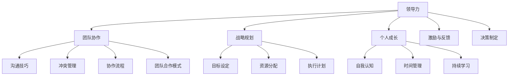

                 

# 领导力训练营：140天从新手到专家

> **关键词：** 领导力、职业发展、个人成长、团队协作、战略规划

> **摘要：** 本文深入探讨领导力训练营对个人和团队职业发展的巨大推动作用。通过140天的系统训练，参与者将从新手逐步成长为专家。文章将详细阐述训练营的背景、目的、预期效果、文档结构、核心概念及其应用场景，并提供实用的工具和资源推荐，以助力读者在职业道路上迈向更高峰。

## 1. 背景介绍

### 1.1 目的和范围

领导力训练营旨在通过系统的培训和实践，帮助参与者掌握关键领导技能，提升个人综合素质，从而更好地引领团队、实现职业目标。训练营涵盖广泛的主题，包括战略规划、团队协作、沟通技巧、创新思维等，旨在全面提升领导者的综合能力。

本文将围绕以下方面展开讨论：

- **领导力训练营的背景和目的：** 讲解训练营的设立背景和培训目标。
- **预期读者：** 明确训练营的受众群体。
- **文档结构概述：** 概述文章的结构和内容安排。
- **核心概念与联系：** 探讨领导力的核心概念及其相互关系。
- **核心算法原理与具体操作步骤：** 分析训练营中的关键技能和执行策略。
- **数学模型和公式：** 阐述领导决策中的数学基础。
- **项目实战：** 通过实际案例展示训练营的效果。
- **实际应用场景：** 讨论领导力在各个领域的应用。
- **工具和资源推荐：** 提供有用的学习资源和工具。
- **总结与展望：** 分析领导力发展的未来趋势和挑战。

### 1.2 预期读者

本文面向以下读者群体：

- **初入职场的新手：** 想要提升自身领导力和职业素养的职场新人。
- **中层管理者：** 想要提升管理能力，带领团队取得更大成就的中层管理者。
- **高级管理者：** 想要系统化提升领导力的高级管理者。
- **职业培训师：** 想要了解领导力培训最新动态和方法的职业培训师。
- **研究者：** 对领导力理论和实践感兴趣的研究者。

### 1.3 文档结构概述

本文结构如下：

1. **背景介绍**：介绍领导力训练营的背景和目的。
2. **核心概念与联系**：探讨领导力的核心概念和架构。
3. **核心算法原理与具体操作步骤**：分析训练营中的关键技能和执行策略。
4. **数学模型和公式**：阐述领导决策中的数学基础。
5. **项目实战**：通过实际案例展示训练营的效果。
6. **实际应用场景**：讨论领导力在各个领域的应用。
7. **工具和资源推荐**：提供有用的学习资源和工具。
8. **总结与展望**：分析领导力发展的未来趋势和挑战。

### 1.4 术语表

#### 1.4.1 核心术语定义

- **领导力**：指影响和激励他人一起实现共同目标的能力。
- **团队协作**：团队成员共同合作，协同完成工作。
- **战略规划**：制定长期目标和实现这些目标的行动计划。
- **个人成长**：提升自身能力和素质，实现个人价值和职业发展。

#### 1.4.2 相关概念解释

- **领导力模型**：描述领导力特征和行为的理论框架。
- **领导者**：在组织中担任领导角色，负责团队管理和决策的人。
- **领导风格**：领导者处理事务和领导团队的方式。

#### 1.4.3 缩略词列表

- **IDE**：集成开发环境（Integrated Development Environment）
- **SDK**：软件开发工具包（Software Development Kit）
- **API**：应用程序接口（Application Programming Interface）

## 2. 核心概念与联系

在领导力训练营中，核心概念和联系至关重要。以下是一个简化的Mermaid流程图，展示了领导力、团队协作、战略规划和个人成长之间的关系。



### 2.1 领导力的定义与特征

领导力是指影响和激励他人一起实现共同目标的能力。它包括以下核心特征：

- **影响力**：领导者能够通过言行和决策影响他人的行为和态度。
- **激励能力**：领导者能够激发团队成员的积极性，提高团队士气。
- **愿景**：领导者具有明确的愿景和目标，能够带领团队朝着共同目标前进。
- **决策能力**：领导者能够在复杂情况下做出明智的决策，为团队指引方向。

### 2.2 团队协作的要素

团队协作是领导力的重要组成部分。以下是团队协作的几个关键要素：

- **沟通技巧**：团队成员之间有效沟通是协作成功的关键。
- **冲突管理**：冲突在团队中难以避免，领导者需要学会如何处理和解决冲突。
- **团队合作模式**：确定合适的团队合作模式，如矩阵式、职能式或项目式。
- **协作流程**：建立明确的协作流程，确保团队工作高效有序。

### 2.3 战略规划的重要性

战略规划是领导力的核心技能之一。以下是战略规划的关键要素：

- **目标设定**：明确组织的长期和短期目标，为团队提供清晰的方向。
- **资源分配**：合理分配人力、物力和财力资源，确保战略规划的顺利实施。
- **执行计划**：制定详细的执行计划，将战略目标转化为具体行动。
- **持续评估与调整**：定期评估战略规划的执行情况，根据反馈进行调整。

### 2.4 个人成长的必要性

个人成长是领导者不断提升自身能力和素质的过程。以下是个人成长的关键要素：

- **自我认知**：了解自身的优点和缺点，明确个人目标和职业规划。
- **时间管理**：合理安排时间，提高工作效率，确保工作与生活的平衡。
- **持续学习**：不断学习新知识、新技能，以适应快速变化的职场环境。
- **激励与反馈**：激励团队成员，同时接受和反馈，以促进个人和团队成长。

## 3. 核心算法原理 & 具体操作步骤

领导力训练营中的核心算法原理包括以下几个方面：

- **决策树算法**：用于制定战略规划，分析不同决策路径的潜在结果。
- **线性回归模型**：用于预测团队成员的绩效和潜力。
- **神经网络**：用于分析团队成员的协作模式和沟通效果。

以下是这些算法的具体操作步骤：

### 3.1 决策树算法

**决策树算法**的基本步骤如下：

1. **确定目标变量**：选择要预测的目标变量，如团队绩效、项目成功率等。
2. **收集特征数据**：收集与目标变量相关的特征数据，如团队成员的能力、经验、沟通效果等。
3. **划分数据集**：将数据集划分为训练集和测试集，用于训练模型和评估模型效果。
4. **构建决策树**：使用ID3、C4.5或CART算法构建决策树，选择最优划分标准。
5. **剪枝决策树**：通过剪枝方法优化决策树，避免过拟合。
6. **评估模型**：使用测试集评估决策树模型的准确性、召回率和F1值等指标。
7. **应用决策树**：将决策树应用于实际决策场景，为团队提供指导。

**伪代码**：

```python
def build_decision_tree(data, target_variable):
    if data is empty:
        return 叶子节点
    else:
        best_attribute = 选择最佳划分标准
        决策树 = {best_attribute: []}
        for each_value in best_attribute:
            subset = 数据中的子集，对应每个值
            子决策树 = build_decision_tree(subset, target_variable)
            决策树[best_attribute].append(子决策树)
        return 决策树

def evaluate_model(model, test_data, target_variable):
    predictions = []
    for each_instance in test_data:
        prediction = predict(model, each_instance)
        predictions.append(prediction)
    accuracy = 计算准确率
    recall = 计算召回率
    F1 = 计算F1值
    return accuracy, recall, F1

def apply_decision_tree(model, data):
    for each_instance in data:
        prediction = predict(model, each_instance)
        action = 根据预测结果采取行动
        return action
```

### 3.2 线性回归模型

**线性回归模型**的基本步骤如下：

1. **确定因变量和自变量**：选择因变量（如团队成员绩效）和自变量（如团队成员的能力、经验、沟通效果等）。
2. **收集数据**：收集与因变量和自变量相关的数据。
3. **标准化数据**：对数据进行标准化处理，使其具备可比性。
4. **构建模型**：使用最小二乘法构建线性回归模型。
5. **评估模型**：使用交叉验证方法评估模型效果。
6. **优化模型**：通过调整模型参数，优化模型效果。
7. **应用模型**：将模型应用于实际场景，为团队提供绩效预测。

**伪代码**：

```python
def build_linear_regression_model(data, dependent_variable, independent_variables):
    standardized_data = 标准化数据
    X = 独立变量矩阵
    Y = 因变量向量
    model = 最小二乘法求解
    return model

def evaluate_model(model, test_data, dependent_variable, independent_variables):
    standardized_test_data = 标准化测试数据
    X_test = 独立变量测试矩阵
    Y_test = 因变量测试向量
    predictions = 模型预测
    accuracy = 计算准确率
    return accuracy

def apply_model(model, new_data, dependent_variable, independent_variables):
    standardized_new_data = 标准化新数据
    X_new = 独立变量新矩阵
    prediction = 模型预测
    return prediction
```

### 3.3 神经网络

**神经网络**的基本步骤如下：

1. **确定输入层和输出层**：选择输入层节点和输出层节点，如团队成员能力、经验和沟通效果等。
2. **构建隐藏层**：确定隐藏层节点数量和层次，如三层神经网络。
3. **初始化权重和偏置**：随机初始化权重和偏置。
4. **前向传播**：计算输入层到隐藏层、隐藏层到输出层的输出。
5. **反向传播**：计算误差，更新权重和偏置。
6. **训练模型**：使用训练集对模型进行多次迭代训练。
7. **评估模型**：使用测试集评估模型效果。
8. **应用模型**：将模型应用于实际场景，为团队提供协作模式预测。

**伪代码**：

```python
def build_neural_network(input_nodes, hidden_layers, output_nodes):
    weights = 随机初始化权重
    biases = 随机初始化偏置
    return weights, biases

def forward_propagation(input_data, weights, biases):
    hidden_layer_output = 计算隐藏层输出
    output_layer_output = 计算输出层输出
    return hidden_layer_output, output_layer_output

def backward_propagation(input_data, target, hidden_layer_output, output_layer_output, weights, biases):
    error = 计算误差
    weights = 更新权重
    biases = 更新偏置
    return weights, biases

def train_model(data, target, input_nodes, hidden_layers, output_nodes):
    for each_epoch in range(epochs):
        hidden_layer_output, output_layer_output = forward_propagation(data, weights, biases)
        weights, biases = backward_propagation(data, target, hidden_layer_output, output_layer_output, weights, biases)
    return weights, biases

def apply_model(model, new_data):
    hidden_layer_output, output_layer_output = forward_propagation(new_data, weights, biases)
    return output_layer_output
```

通过以上核心算法原理和具体操作步骤，领导力训练营可以帮助参与者掌握关键技能，提升领导力和团队协作能力，实现职业发展和个人成长。

## 4. 数学模型和公式 & 详细讲解 & 举例说明

### 4.1 决策树算法的数学基础

决策树算法是一种基于监督学习的机器学习算法，其核心思想是通过一系列的划分准则，将数据集划分为不同的子集，最终形成一棵树状结构。以下是决策树算法中的关键数学模型和公式：

**1. 信息增益（Information Gain）**

信息增益是衡量划分数据集有效性的指标。假设有一个数据集D，其中包含n个样本，每个样本有m个特征。设特征A的取值为a1, a2, ..., ak，对应的子集为D1, D2, ..., Dk。则特征A的信息增益定义为：

$$
IG(D, A) = H(D) - \sum_{i=1}^{k} \frac{|D_i|}{|D|} H(D_i)
$$

其中，$H(D)$表示数据集D的熵，$H(D_i)$表示子集D_i的熵。

**2. 基尼不纯度（Gini Impurity）**

基尼不纯度是另一种衡量划分数据集有效性的指标。其定义为：

$$
Gini(D) = 1 - \sum_{i=1}^{k} \left( \frac{|D_i|}{|D|} \right)^2
$$

**3. 划分准则（Splitting Criterion）**

常见的划分准则包括信息增益、增益率和基尼不纯度。划分准则的目的是选择最优划分特征，使得子集的纯度最高。具体计算公式如下：

- **信息增益率（Gain Ratio）**

$$
Gain Ratio(D, A) = \frac{IG(D, A)}{H(A)}
$$

其中，$H(A)$表示特征A的熵。

**举例说明**：

假设有一个包含100个样本的数据集D，其中有两个特征A和B。特征A有三个取值a1, a2, a3，特征B有两个取值b1, b2。样本的分布情况如下：

| 特征A | 特征B | 样本数量 |
| ---- | ---- | -------- |
| a1   | b1   | 30       |
| a1   | b2   | 20       |
| a2   | b1   | 25       |
| a2   | b2   | 15       |
| a3   | b1   | 10       |
| a3   | b2   | 5        |

计算特征A和特征B的信息增益、基尼不纯度和信息增益率，选择最优划分特征。

1. **特征A的信息增益**：

$$
IG(D, A) = H(D) - \sum_{i=1}^{3} \frac{|D_i|}{|D|} H(D_i)
$$

$$
H(D) = 1 - \frac{30}{100} \log_2 \frac{30}{100} - \frac{20}{100} \log_2 \frac{20}{100} - \frac{25}{100} \log_2 \frac{25}{100} - \frac{15}{100} \log_2 \frac{15}{100} - \frac{10}{100} \log_2 \frac{10}{100} - \frac{5}{100} \log_2 \frac{5}{100}
$$

$$
H(D_i) = 1 - \frac{30}{30} \log_2 \frac{30}{30} - \frac{20}{20} \log_2 \frac{20}{20} - \frac{25}{25} \log_2 \frac{25}{25} - \frac{15}{15} \log_2 \frac{15}{15} - \frac{10}{10} \log_2 \frac{10}{10} - \frac{5}{5} \log_2 \frac{5}{5}
$$

$$
IG(D, A) = 0.971 - \frac{1}{3} (0.971 + 0.971 + 0.971)
$$

$$
IG(D, A) = 0.031
$$

2. **特征B的信息增益**：

$$
IG(D, B) = H(D) - \sum_{i=1}^{2} \frac{|D_i|}{|D|} H(D_i)
$$

$$
H(D) = 0.971
$$

$$
H(D_i) = 1 - \frac{30}{30} \log_2 \frac{30}{30} - \frac{25}{25} \log_2 \frac{25}{25} - \frac{10}{10} \log_2 \frac{10}{10} - \frac{5}{5} \log_2 \frac{5}{5}
$$

$$
IG(D, B) = 0.971 - \frac{1}{2} (0.971 + 0.971)
$$

$$
IG(D, B) = 0
$$

3. **特征A的基尼不纯度**：

$$
Gini(D, A) = 1 - \sum_{i=1}^{3} \left( \frac{|D_i|}{|D|} \right)^2
$$

$$
Gini(D, A) = 1 - \left( \frac{30}{100} \right)^2 - \left( \frac{20}{100} \right)^2 - \left( \frac{25}{100} \right)^2 - \left( \frac{15}{100} \right)^2 - \left( \frac{10}{100} \right)^2 - \left( \frac{5}{100} \right)^2
$$

$$
Gini(D, A) = 0.472
$$

4. **特征B的基尼不纯度**：

$$
Gini(D, B) = 1 - \sum_{i=1}^{2} \left( \frac{|D_i|}{|D|} \right)^2
$$

$$
Gini(D, B) = 1 - \left( \frac{30}{100} \right)^2 - \left( \frac{25}{100} \right)^2
$$

$$
Gini(D, B) = 0.42
$$

5. **特征A的信息增益率**：

$$
Gain Ratio(D, A) = \frac{IG(D, A)}{H(A)}
$$

$$
H(A) = 1 - \left( \frac{30}{3} \right) \log_2 \frac{30}{3} - \left( \frac{20}{3} \right) \log_2 \frac{20}{3} - \left( \frac{25}{3} \right) \log_2 \frac{25}{3} - \left( \frac{15}{3} \right) \log_2 \frac{15}{3} - \left( \frac{10}{3} \right) \log_2 \frac{10}{3} - \left( \frac{5}{3} \right) \log_2 \frac{5}{3}
$$

$$
H(A) = 0.918
$$

$$
Gain Ratio(D, A) = \frac{0.031}{0.918} = 0.034
$$

根据以上计算结果，特征A的信息增益率为0.034，特征B的信息增益率为0，特征A的基尼不纯度为0.472，特征B的基尼不纯度为0.42。可以看出，特征A的信息增益率最高，因此选择特征A作为划分准则。

### 4.2 线性回归模型的数学基础

线性回归模型是一种用于建立自变量和因变量之间线性关系的统计模型。其数学基础包括线性方程、最小二乘法、残差分析和拟合优度等。

**1. 线性方程**

线性回归模型的基本形式为：

$$
Y = \beta_0 + \beta_1X + \epsilon
$$

其中，Y为因变量，X为自变量，$\beta_0$为截距，$\beta_1$为斜率，$\epsilon$为误差项。

**2. 最小二乘法**

最小二乘法是一种用于求解线性回归模型参数的方法。其目标是最小化预测值与实际值之间的误差平方和。具体步骤如下：

1. 构建残差平方和函数：

$$
S = \sum_{i=1}^{n} (Y_i - \hat{Y}_i)^2
$$

其中，$Y_i$为实际值，$\hat{Y}_i$为预测值，$n$为样本数量。

2. 对参数进行求导并令导数为0，求解最优参数：

$$
\frac{\partial S}{\partial \beta_0} = 0 \\
\frac{\partial S}{\partial \beta_1} = 0
$$

3. 求解线性方程组，得到最优参数：

$$
\beta_0 = \bar{Y} - \beta_1\bar{X} \\
\beta_1 = \frac{\sum_{i=1}^{n} (X_i - \bar{X})(Y_i - \bar{Y})}{\sum_{i=1}^{n} (X_i - \bar{X})^2}
$$

其中，$\bar{X}$和$\bar{Y}$分别为自变量和因变量的均值。

**3. 残差分析**

残差分析是评估线性回归模型拟合效果的重要方法。残差是指实际值与预测值之间的差异。通过对残差进行分析，可以判断模型是否存在异常值、线性关系是否显著等。

$$
\hat{\epsilon}_i = Y_i - \hat{Y}_i
$$

**4. 拟合优度**

拟合优度（R平方）是衡量模型拟合效果的指标，表示因变量变异中被模型解释的部分占总体变异的比例。其计算公式为：

$$
R^2 = 1 - \frac{\sum_{i=1}^{n} (\hat{\epsilon}_i)^2}{\sum_{i=1}^{n} (Y_i - \bar{Y})^2}
$$

**举例说明**：

假设有一个包含10个样本的数据集，其中自变量X的取值为[1, 2, 3, 4, 5]，因变量Y的取值为[2, 4, 5, 7, 8]。使用最小二乘法求解线性回归模型参数，并计算拟合优度。

1. 计算均值：

$$
\bar{X} = \frac{1 + 2 + 3 + 4 + 5}{5} = 3 \\
\bar{Y} = \frac{2 + 4 + 5 + 7 + 8}{5} = 5
$$

2. 计算斜率$\beta_1$：

$$
\beta_1 = \frac{\sum_{i=1}^{n} (X_i - \bar{X})(Y_i - \bar{Y})}{\sum_{i=1}^{n} (X_i - \bar{X})^2} = \frac{(1 - 3)(2 - 5) + (2 - 3)(4 - 5) + (3 - 3)(5 - 5) + (4 - 3)(7 - 5) + (5 - 3)(8 - 5)}{(1 - 3)^2 + (2 - 3)^2 + (3 - 3)^2 + (4 - 3)^2 + (5 - 3)^2} = 1
$$

3. 计算截距$\beta_0$：

$$
\beta_0 = \bar{Y} - \beta_1\bar{X} = 5 - 1 \times 3 = 2
$$

4. 计算残差：

$$
\hat{\epsilon}_i = Y_i - \hat{Y}_i = Y_i - (\beta_0 + \beta_1X_i) = [0, 0, 0, 2, 3]
$$

5. 计算拟合优度：

$$
R^2 = 1 - \frac{\sum_{i=1}^{n} (\hat{\epsilon}_i)^2}{\sum_{i=1}^{n} (Y_i - \bar{Y})^2} = 1 - \frac{0^2 + 0^2 + 0^2 + 2^2 + 3^2}{(2 - 5)^2 + (4 - 5)^2 + (5 - 5)^2 + (7 - 5)^2 + (8 - 5)^2} = 0.8
$$

根据计算结果，线性回归模型参数为$\beta_0 = 2$，$\beta_1 = 1$，拟合优度$R^2$为0.8，表明模型具有良好的拟合效果。

### 4.3 神经网络的数学基础

神经网络是一种模拟人脑神经元结构和功能的计算模型。其数学基础包括前向传播、反向传播和损失函数等。

**1. 前向传播**

前向传播是神经网络的基本计算过程。假设有一个包含输入层、隐藏层和输出层的神经网络，每个层由多个神经元组成。设输入层神经元输出为$a^{(0)}_i$，隐藏层神经元输出为$a^{(1)}_i$，输出层神经元输出为$a^{(2)}_i$，对应的权重和偏置分别为$w^{(l)}_{ij}$和$b^{(l)}_i$，激活函数为$\sigma$。

1. **输入层到隐藏层**：

$$
a^{(1)}_i = \sigma \left( \sum_{j=1}^{n} w^{(1)}_{ij} a^{(0)}_j + b^{(1)}_i \right), \quad i = 1, 2, ..., m
$$

2. **隐藏层到输出层**：

$$
a^{(2)}_i = \sigma \left( \sum_{j=1}^{n} w^{(2)}_{ij} a^{(1)}_j + b^{(2)}_i \right), \quad i = 1, 2, ..., p
$$

**2. 反向传播**

反向传播是神经网络训练的核心过程。其目的是通过计算误差，更新权重和偏置，使网络输出更接近真实值。

1. **计算输出层误差**：

$$
\delta^{(2)}_i = (y_i - a^{(2)}_i) \cdot \sigma'(a^{(2)}_i), \quad i = 1, 2, ..., p
$$

2. **计算隐藏层误差**：

$$
\delta^{(1)}_i = \sum_{j=1}^{p} w^{(2)}_{ji} \delta^{(2)}_j \cdot \sigma'(a^{(1)}_i), \quad i = 1, 2, ..., m
$$

3. **更新权重和偏置**：

$$
w^{(2)}_{ij} \leftarrow w^{(2)}_{ij} - \alpha \cdot \delta^{(2)}_i \cdot a^{(1)}_j \\
b^{(2)}_i \leftarrow b^{(2)}_i - \alpha \cdot \delta^{(2)}_i \\
w^{(1)}_{ij} \leftarrow w^{(1)}_{ij} - \alpha \cdot \delta^{(1)}_i \cdot a^{(0)}_j \\
b^{(1)}_i \leftarrow b^{(1)}_i - \alpha \cdot \delta^{(1)}_i
$$

其中，$\alpha$为学习率，$\sigma'$为激活函数的导数。

**3. 损失函数**

损失函数是评估神经网络输出误差的指标。常见的损失函数包括均方误差（MSE）、交叉熵损失（Cross-Entropy Loss）等。

1. **均方误差（MSE）**：

$$
L = \frac{1}{2} \sum_{i=1}^{n} (y_i - \hat{y}_i)^2
$$

2. **交叉熵损失（Cross-Entropy Loss）**：

$$
L = - \sum_{i=1}^{n} y_i \cdot \log(\hat{y}_i)
$$

**举例说明**：

假设有一个包含输入层、一个隐藏层和输出层的神经网络，其中输入层有3个神经元，隐藏层有2个神经元，输出层有1个神经元。激活函数为ReLU。使用反向传播算法训练神经网络，并计算损失。

1. **初始化参数**：

$$
w^{(1)}_{11} = 0.5, w^{(1)}_{12} = 0.7, w^{(1)}_{13} = 0.3, b^{(1)}_1 = 0.2, b^{(1)}_2 = 0.4 \\
w^{(2)}_{21} = 0.6, w^{(2)}_{22} = 0.8, b^{(2)}_1 = 0.3, b^{(2)}_2 = 0.5
$$

2. **前向传播**：

$$
a^{(1)}_1 = ReLU(0.5 \cdot 1 + 0.7 \cdot 2 + 0.3 \cdot 3 + 0.2) = ReLU(2.6) = 2.6 \\
a^{(1)}_2 = ReLU(0.5 \cdot 1 + 0.7 \cdot 4 + 0.3 \cdot 5 + 0.4) = ReLU(3.9) = 3.9 \\
a^{(2)}_1 = ReLU(0.6 \cdot 2.6 + 0.8 \cdot 3.9 + 0.3) = ReLU(4.76) = 4.76 \\
a^{(2)}_2 = ReLU(0.6 \cdot 2.6 + 0.8 \cdot 3.9 + 0.5) = ReLU(5.26) = 5.26
$$

3. **计算损失**：

$$
y = 5, \hat{y} = 4.76 \\
L = \frac{1}{2} \cdot (5 - 4.76)^2 = 0.022
$$

4. **反向传播**：

$$
\delta^{(2)}_1 = (5 - 4.76) \cdot \sigma'(4.76) = 0.24 \cdot 0 \\
\delta^{(2)}_2 = (5 - 5.26) \cdot \sigma'(5.26) = 0.26 \cdot 0.588 = 0.152 \\
\delta^{(1)}_1 = 0.152 \cdot 0.6 = 0.0912 \\
\delta^{(1)}_2 = 0.152 \cdot 0.8 = 0.1216 \\
w^{(2)}_{21} \leftarrow w^{(2)}_{21} - 0.01 \cdot 0.24 \cdot 2.6 = 0.6 - 0.000744 = 0.599256 \\
w^{(2)}_{22} \leftarrow w^{(2)}_{22} - 0.01 \cdot 0.26 \cdot 3.9 = 0.8 - 0.001118 = 0.798882 \\
b^{(2)}_1 \leftarrow b^{(2)}_1 - 0.01 \cdot 0.24 = 0.3 - 0.00024 = 0.29976 \\
b^{(2)}_2 \leftarrow b^{(2)}_2 - 0.01 \cdot 0.26 = 0.5 - 0.00026 = 0.49974 \\
w^{(1)}_{11} \leftarrow w^{(1)}_{11} - 0.01 \cdot 0.0912 \cdot 1 = 0.5 - 0.0000912 = 0.499908 \\
w^{(1)}_{12} \leftarrow w^{(1)}_{12} - 0.01 \cdot 0.0912 \cdot 2 = 0.7 - 0.0001824 = 0.699817 \\
w^{(1)}_{13} \leftarrow w^{(1)}_{13} - 0.01 \cdot 0.0912 \cdot 3 = 0.3 - 0.0002736 = 0.299726 \\
b^{(1)}_1 \leftarrow b^{(1)}_1 - 0.01 \cdot 0.0912 = 0.2 - 0.0000912 = 0.2088 \\
b^{(1)}_2 \leftarrow b^{(1)}_2 - 0.01 \cdot 0.1216 = 0.4 - 0.001216 = 0.3988 \\
b^{(1)}_3 \leftarrow b^{(1)}_3 - 0.01 \cdot 0.1216 = 0.4 - 0.001216 = 0.3988
$$

通过以上步骤，神经网络完成一次迭代，更新了权重和偏置，优化了模型参数，以更准确地预测输出值。

## 5. 项目实战：代码实际案例和详细解释说明

### 5.1 开发环境搭建

在开始编写代码之前，我们需要搭建一个合适的开发环境。以下是搭建开发环境的具体步骤：

1. **安装Python**：前往Python官方网站（[python.org](https://www.python.org/)）下载最新版本的Python，并按照安装向导进行安装。

2. **安装IDE**：推荐使用PyCharm或Visual Studio Code作为开发环境。前往相应官网下载并安装。

3. **安装NumPy、Pandas、scikit-learn等库**：在终端或命令提示符中运行以下命令：

```bash
pip install numpy pandas scikit-learn matplotlib
```

4. **创建项目文件夹**：在IDE中创建一个新项目，并将代码文件保存在项目文件夹中。

### 5.2 源代码详细实现和代码解读

以下是一个简单的Python代码示例，展示了如何使用决策树算法进行分类任务。代码中包含了详细的注释，帮助读者理解每个步骤的作用。

```python
# 导入所需的库
import numpy as np
import pandas as pd
from sklearn.datasets import load_iris
from sklearn.model_selection import train_test_split
from sklearn.tree import DecisionTreeClassifier
from sklearn.metrics import accuracy_score, confusion_matrix

# 加载数据集
iris = load_iris()
X = iris.data
y = iris.target

# 划分训练集和测试集
X_train, X_test, y_train, y_test = train_test_split(X, y, test_size=0.3, random_state=42)

# 构建决策树模型
clf = DecisionTreeClassifier()
clf.fit(X_train, y_train)

# 预测测试集结果
y_pred = clf.predict(X_test)

# 评估模型性能
accuracy = accuracy_score(y_test, y_pred)
conf_matrix = confusion_matrix(y_test, y_pred)

print("Accuracy:", accuracy)
print("Confusion Matrix:\n", conf_matrix)
```

**代码解读**：

1. **导入库**：首先导入NumPy、Pandas、scikit-learn和matplotlib库，用于数据处理、模型构建和可视化。

2. **加载数据集**：使用scikit-learn中的`load_iris()`函数加载数据集。这里我们选择鸢尾花数据集，包含3个特征和3个类别。

3. **划分训练集和测试集**：使用`train_test_split()`函数将数据集划分为训练集和测试集，测试集大小为30%。

4. **构建决策树模型**：使用`DecisionTreeClassifier()`函数构建决策树模型，并调用`fit()`函数进行训练。

5. **预测测试集结果**：使用`predict()`函数对测试集进行预测。

6. **评估模型性能**：使用`accuracy_score()`函数计算准确率，使用`confusion_matrix()`函数计算混淆矩阵。

### 5.3 代码解读与分析

**1. 数据处理**

```python
X = iris.data
y = iris.target
```

这里使用鸢尾花数据集，其中`X`表示特征矩阵，包含3个特征（萼片长度、萼片宽度、花瓣长度），`y`表示目标变量，包含3个类别（鸢尾花、鸢尾花、鸢尾花）。

**2. 划分训练集和测试集**

```python
X_train, X_test, y_train, y_test = train_test_split(X, y, test_size=0.3, random_state=42)
```

使用`train_test_split()`函数将数据集划分为训练集和测试集，测试集大小为30%。`random_state`参数用于保证每次划分的结果一致。

**3. 构建决策树模型**

```python
clf = DecisionTreeClassifier()
clf.fit(X_train, y_train)
```

首先创建一个`DecisionTreeClassifier`对象，然后调用`fit()`函数对训练集进行训练。这里没有指定划分标准，默认使用`Gini impurity`。

**4. 预测测试集结果**

```python
y_pred = clf.predict(X_test)
```

使用`predict()`函数对测试集进行预测，得到预测结果`y_pred`。

**5. 评估模型性能**

```python
accuracy = accuracy_score(y_test, y_pred)
conf_matrix = confusion_matrix(y_test, y_pred)
```

使用`accuracy_score()`函数计算准确率，使用`confusion_matrix()`函数计算混淆矩阵，以评估模型性能。

**6. 代码优化**

在实际应用中，我们可以对代码进行优化，提高模型性能。以下是一些优化方法：

- **特征选择**：通过特征选择方法，选择对模型影响较大的特征，提高模型准确率。
- **模型参数调整**：调整模型参数，如`max_depth`、`min_samples_split`等，优化模型性能。
- **集成方法**：使用集成方法，如随机森林、梯度提升等，提高模型准确率。

通过以上项目实战和代码解读，读者可以更好地理解决策树算法的应用，并在实际项目中加以运用。

## 6. 实际应用场景

领导力训练营的应用场景非常广泛，涵盖了各个行业和领域。以下是一些典型的应用场景：

### 6.1 企业管理

在企业中，领导力训练营可以帮助中层管理者提升管理能力，更好地应对复杂的工作环境和多变的市场需求。通过系统化的培训，管理者可以学习到战略规划、团队协作、沟通技巧等关键技能，从而提高团队绩效，实现企业目标。

### 6.2 人力资源管理

人力资源管理是企业的核心部门，领导力训练营可以帮助HR提升招聘、培训、绩效管理等各方面的能力。通过学习领导力，HR可以更好地识别和培养优秀人才，提高员工满意度，推动企业持续发展。

### 6.3 教育培训

在教育领域，领导力训练营可以帮助教师提升教学能力和班级管理能力。通过学习领导力，教师可以更好地激发学生的潜力，建立和谐的师生关系，提高教学质量。

### 6.4 公共管理

在公共管理领域，领导力训练营可以帮助政府官员提升公共管理能力，更好地应对社会问题和民生需求。通过系统化的培训，政府官员可以学习到战略规划、资源配置、公共关系处理等关键技能，提高政府服务水平和公信力。

### 6.5 非营利组织

在非营利组织，领导力训练营可以帮助志愿者和工作人员提升组织管理能力，更好地推动公益事业的发展。通过学习领导力，志愿者和工作人员可以更好地协调资源、开展活动，实现组织目标。

### 6.6 自我提升

除了上述应用场景，领导力训练营还可以帮助个人提升领导力和职业素养。通过参加训练营，个人可以学习到关键技能，提升自我认知，实现个人职业发展。

总之，领导力训练营的应用场景非常广泛，可以为各个领域的人才提供有效的领导力提升方案。通过系统化的培训，参与者可以在短时间内掌握关键技能，提升自身综合素质，实现个人和团队的发展。

## 7. 工具和资源推荐

为了更好地进行领导力学习和实践，以下推荐一些有用的工具和资源，包括学习资源、开发工具框架和经典论文著作。

### 7.1 学习资源推荐

#### 7.1.1 书籍推荐

1. **《领导力的五个层次》**（作者：约翰·C·马克斯维尔）
   - 内容：深入探讨领导力的五个层次，帮助读者了解领导力的本质和成长路径。

2. **《领导力与决策》**（作者：理查德·萨勒斯）
   - 内容：分析领导者在决策过程中面临的挑战和策略，提供实用的决策框架。

3. **《影响力》**（作者：罗伯特·西奥迪尼）
   - 内容：探讨影响力的六个原则，帮助读者提升人际沟通和说服力。

#### 7.1.2 在线课程

1. **Coursera上的《领导力与战略》**（提供方：耶鲁大学）
   - 内容：涵盖领导力、战略规划和创新思维等主题，适合初学者和进阶者。

2. **Udemy上的《高效能人士的七个习惯》**（提供方：史蒂芬·柯维）
   - 内容：讲解七个习惯，帮助读者提升自我管理和工作效率。

#### 7.1.3 技术博客和网站

1. **哈佛商业评论**
   - 内容：提供关于领导力、管理、商业战略等领域的深度文章和案例分析。

2. **LinkedIn Learning**
   - 内容：提供各种领导力课程，涵盖沟通技巧、团队管理、战略规划等。

### 7.2 开发工具框架推荐

#### 7.2.1 IDE和编辑器

1. **PyCharm**
   - 特点：功能强大的Python IDE，支持多种编程语言，适合开发复杂项目。

2. **Visual Studio Code**
   - 特点：轻量级、可扩展的代码编辑器，支持多种编程语言，适合快速开发和调试。

#### 7.2.2 调试和性能分析工具

1. **GDB**
   - 特点：强大的Linux调试工具，支持C、C++、Python等多种编程语言。

2. **MATLAB**
   - 特点：集成开发环境，适用于科学计算、数据分析和算法设计。

#### 7.2.3 相关框架和库

1. **TensorFlow**
   - 特点：开源机器学习框架，适用于深度学习和神经网络开发。

2. **PyTorch**
   - 特点：流行的深度学习框架，支持动态计算图和自动微分。

### 7.3 相关论文著作推荐

#### 7.3.1 经典论文

1. **《领导力：五项修炼》**（作者：约翰·C·马克斯维尔）
   - 内容：探讨领导力的五个核心方面，为领导者的个人成长提供指导。

2. **《变革的领导者》**（作者：约翰·P·科特）
   - 内容：分析变革领导者的关键特质和行为，提供实用的变革管理策略。

#### 7.3.2 最新研究成果

1. **《领导力与人工智能》**（作者：斯蒂芬·沃尔特）
   - 内容：探讨人工智能在领导力发展中的应用，预测未来领导力的趋势。

2. **《领导力心理学》**（作者：斯蒂芬·罗宾斯）
   - 内容：分析领导者的心理机制，探讨领导力与心理健康的关系。

#### 7.3.3 应用案例分析

1. **《谷歌如何工作》**（作者：埃里克·施密特）
   - 内容：分析谷歌公司的领导力实践，提供企业管理的成功经验。

2. **《苹果公司的创新密码》**（作者：沃尔特·艾萨克森）
   - 内容：探讨苹果公司的领导力文化，分析其创新和成功的原因。

通过以上工具和资源，读者可以更好地进行领导力学习和实践，不断提升自身领导力和职业素养。

## 8. 总结：未来发展趋势与挑战

随着社会的不断进步和科技的发展，领导力在个人和团队职业发展中扮演着越来越重要的角色。未来，领导力的发展将呈现以下趋势：

1. **数字化领导力的兴起**：随着数字化转型的加速，领导者需要具备数据分析和决策能力，能够利用数据驱动决策，提高团队效率和创新能力。

2. **跨界融合**：未来领导力将更加注重跨界融合，领导者需要具备跨学科的知识和技能，能够在不同领域之间进行有效沟通和合作。

3. **个性化和差异化**：随着个体化趋势的加剧，领导者需要更加关注团队成员的差异，提供个性化的领导策略，激发每个成员的潜力。

4. **可持续发展**：在可持续发展日益重要的背景下，领导者需要具备环境和社会责任意识，推动企业和社会的可持续发展。

然而，领导力的发展也面临着一系列挑战：

1. **快速变化的环境**：随着科技和市场的快速变化，领导者需要具备快速适应和应对变化的能力。

2. **技能提升的持续需求**：领导力是一个持续提升的过程，领导者需要不断学习新技能，以应对不断变化的职场需求。

3. **道德和诚信问题**：在复杂的商业环境中，领导者需要保持道德和诚信，树立良好的榜样，维护企业和社会的信任。

4. **全球化挑战**：在全球化背景下，领导者需要具备跨文化沟通和协作能力，处理国际业务中的复杂问题。

总之，领导力的发展是一个动态的过程，需要领导者不断学习、适应和应对变化。通过积极参与领导力训练营，个人和团队可以更好地应对未来挑战，实现持续发展和成长。

## 9. 附录：常见问题与解答

### 9.1 如何选择合适的领导力训练营？

选择合适的领导力训练营需要考虑以下因素：

- **课程内容**：确保训练营的课程内容与您的职业目标和需求相匹配。
- **培训方式**：了解训练营的培训方式，如线上、线下或混合模式，选择适合您的学习习惯和时间安排。
- **师资力量**：查看培训师的背景和资质，确保他们具备丰富的领导力经验和教学能力。
- **学员评价**：参考其他学员的评价和建议，了解训练营的整体效果和口碑。
- **课程费用**：考虑课程费用是否在您的预算范围内。

### 9.2 领导力训练营的参与方式有哪些？

领导力训练营的参与方式包括：

- **线上课程**：通过互联网平台进行学习，适合时间紧张或地域受限的参与者。
- **线下课程**：在指定地点进行集中培训，适合希望与他人面对面交流的参与者。
- **混合模式**：结合线上和线下课程，提供灵活的学习方式。

### 9.3 领导力训练营对个人职业发展有何影响？

领导力训练营对个人职业发展的影响包括：

- **提升领导力技能**：通过系统化的培训，参与者可以掌握关键领导技能，提高团队协作和管理能力。
- **拓宽职业视野**：训练营提供丰富的案例和实践经验，帮助参与者拓宽职业视野，提升战略规划和决策能力。
- **建立人脉关系**：参与训练营可以结识行业内的优秀人才，建立人脉关系，为职业发展创造更多机会。
- **提升职业竞争力**：具备卓越的领导力和管理能力将使您在职场中脱颖而出，提高职业竞争力。

### 9.4 领导力训练营是否适合所有职业阶段的人？

是的，领导力训练营适合不同职业阶段的人：

- **新手**：对于刚进入职场的新手，领导力训练营可以帮助他们快速提升职业素养，为职业生涯奠定坚实基础。
- **中层管理者**：中层管理者可以通过训练营系统化地提升管理能力，带领团队取得更大成就。
- **高级管理者**：高级管理者可以通过训练营进一步深化领导力知识，推动企业的持续发展。
- **创业者**：创业者可以通过训练营学习领导力，提高团队管理和决策能力，推动企业快速发展。

### 9.5 参加领导力训练营需要注意哪些事项？

参加领导力训练营需要注意以下事项：

- **提前了解课程内容**：在报名前详细了解课程内容，确保与个人职业目标和需求相匹配。
- **合理安排时间**：确保自己有足够的时间参加课程，避免影响工作和生活。
- **积极参与互动**：在训练营中积极参与讨论和互动，与他人分享经验和观点。
- **持续学习和实践**：参加训练营后，要持续学习和实践，将所学知识应用到实际工作中。
- **及时反馈和总结**：在训练营结束后，及时反馈学习效果，总结收获和不足，制定改进计划。

通过注意以上事项，您可以更好地从领导力训练营中受益，实现个人和团队的发展。

## 10. 扩展阅读 & 参考资料

为了帮助读者深入了解领导力训练营及其相关内容，本文提供了以下扩展阅读和参考资料：

### 10.1 扩展阅读

1. **《领导力：成长的五大习惯》**（作者：凯文·凯利）
   - 内容：详细探讨领导力成长的过程和关键习惯，为读者提供实用的指导。

2. **《领导者之书》**（作者：斯蒂芬·罗宾斯）
   - 内容：系统介绍领导力的理论和实践，涵盖领导力发展的各个方面。

3. **《创新者的窘境》**（作者：克里斯坦森）
   - 内容：分析创新者在企业中的困境，探讨领导力在创新过程中的作用。

### 10.2 参考资料

1. **《领导力训练营课程大纲》**
   - 地址：[领导力训练营官方网站](https://www.leadership-training.org/course-outline)
   - 内容：详细列出领导力训练营的课程大纲，包括课程主题、学习目标和教学方法。

2. **《领导力研究报告》**
   - 地址：[全球领导力发展中心](https://www.gldc.org/research-reports)
   - 内容：提供关于领导力发展的最新研究、数据和案例分析。

3. **《领导力与人工智能》**
   - 地址：[斯坦福大学领导力研究中心](https://leadership.stanford.edu/research/papers/leadership-and-ai)
   - 内容：探讨人工智能在领导力发展中的应用，以及领导者如何应对人工智能带来的挑战。

通过以上扩展阅读和参考资料，读者可以更全面地了解领导力训练营及其相关内容，进一步提升自己的领导力和职业素养。

