                 

# 领导力进化论：智能时代管理者的领导力修炼

> **关键词**：领导力、智能时代、管理技能、数字化转型、组织变革
>
> **摘要**：本文探讨了在智能时代背景下，管理者如何通过领导力进化论来提升个人和组织的竞争力。文章首先介绍了领导力的核心概念，然后分析了智能时代对管理者提出的新要求，接着阐述了领导力进化论的具体内容和实践步骤，最后提出了未来领导力发展的趋势和挑战。本文旨在为管理者提供有价值的理论指导和实战经验，帮助他们在智能时代中实现领导力的提升。

## 1. 背景介绍

### 1.1 目的和范围

随着智能时代的到来，技术变革、市场变化、社会进步等多方面因素对组织和管理提出了新的挑战。管理者在智能时代面临着前所未有的复杂性，如何适应并引领组织变革成为关键问题。本文旨在探讨在智能时代背景下，管理者应如何修炼领导力，以应对新的挑战和机遇。

本文的范围涵盖领导力的核心概念、智能时代对管理者提出的新要求、领导力进化论的具体内容和实践步骤，以及未来领导力发展的趋势和挑战。通过本文的探讨，希望能够为管理者提供有价值的理论指导和实战经验。

### 1.2 预期读者

本文预期读者为以下几类人群：

1. **企业高管和领导者**：希望提升领导力，适应智能时代变化的决策者。
2. **中高层管理者**：负责团队管理和业务推进，需要提升管理技能的实践者。
3. **专业人士**：对领导力理论和实践感兴趣的技术专家和知识工作者。
4. **学生和研究者**：关注领导力发展和组织管理的学术人员和学者。

### 1.3 文档结构概述

本文分为十个部分：

1. **背景介绍**：介绍文章的目的、范围、预期读者和文档结构。
2. **核心概念与联系**：阐述领导力的核心概念，并使用Mermaid流程图展示领导力架构。
3. **核心算法原理 & 具体操作步骤**：使用伪代码详细阐述领导力提升的算法原理和实践步骤。
4. **数学模型和公式 & 详细讲解 & 举例说明**：介绍领导力模型中的数学公式，并举例说明。
5. **项目实战：代码实际案例和详细解释说明**：通过实际代码案例，展示领导力提升的具体应用。
6. **实际应用场景**：分析领导力在不同行业和场景中的应用。
7. **工具和资源推荐**：推荐学习资源和开发工具。
8. **总结：未来发展趋势与挑战**：展望未来领导力的发展趋势和面临的挑战。
9. **附录：常见问题与解答**：解答读者可能遇到的问题。
10. **扩展阅读 & 参考资料**：提供进一步学习和研究的参考资料。

### 1.4 术语表

#### 1.4.1 核心术语定义

- **领导力**：影响、激励和引导他人达成目标的能力。
- **智能时代**：以人工智能、大数据、物联网等新兴技术为核心的时代。
- **数字化转型**：利用新兴技术改变组织运营模式、提升效率的过程。
- **组织变革**：为了适应环境变化，对组织结构、流程和文化进行调整的过程。

#### 1.4.2 相关概念解释

- **领导力进化论**：关于领导力发展、变化和提升的理论体系。
- **管理技能**：管理者在规划、组织、领导和控制等方面所需的能力。
- **竞争力**：组织在市场中生存和发展的能力。

#### 1.4.3 缩略词列表

- **AI**：人工智能
- **IoT**：物联网
- **DT**：数字化转型

## 2. 核心概念与联系

领导力是一个多层次、多维度的概念，其核心在于影响、激励和引导他人达成目标。在智能时代，领导力的重要性更加凸显，管理者需要具备更全面、更前瞻的领导能力。

下面是领导力的核心概念及其相互联系：

```mermaid
graph TD
    A[领导力] --> B[影响力]
    A --> C[激励]
    A --> D[引导]
    B --> E[愿景]
    B --> F[信任]
    C --> G[目标]
    C --> H[价值观]
    D --> I[决策]
    D --> J[沟通]
    E --> K[战略]
    E --> L[创新]
    F --> M[透明度]
    F --> N[诚信]
    G --> O[执行力]
    G --> P[协作]
    H --> Q[文化]
    H --> R[变革]
    I --> S[判断力]
    I --> T[决断力]
    J --> U[表达力]
    J --> V[倾听力]
    K --> W[执行力]
    K --> X[适应性]
    L --> Y[创造力]
    L --> Z[学习能力]
    M --> AA[效率]
    M --> BB[效果]
    N --> CC[公信力]
    N --> DD[责任感]
    O --> EE[组织效能]
    O --> FF[员工满意度]
    P --> GG[团队协作]
    P --> HH[个人发展]
    Q --> II[凝聚力]
    Q --> JJ[适应性]
    R --> KK[变革能力]
    R --> LL[创新能力]
    S --> MM[战略思维]
    S --> NN[风险评估]
    T --> OO[危机管理]
    T --> PP[决策效率]
    U --> QQ[影响力]
    U --> RR[沟通效果]
    V --> SS[情感共鸣]
    V --> TT[理解力]
    W --> UU[组织效能]
    W --> VV[目标达成率]
    X --> WW[市场适应性]
    X --> XX[技术创新能力]
    Y --> YY[市场竞争力]
    Y --> ZZ[用户体验]
    Z --> AAA[知识更新]
    Z --> BBB[创新思维]
    AA --> CCC[工作效率]
    BB --> DDD[工作效果]
    CC --> EEE[公信力]
    DD --> FFF[责任感]
    EE --> GGG[员工满意度]
    FF --> HHH[团队效能]
    GG --> III[团队协作]
    HH --> JJJ[员工发展]
    II --> KKK[组织凝聚力]
    JJ --> LLL[组织适应性]
    KK --> MMM[变革管理]
    LL --> NNN[创新能力]
    MM --> OOO[战略执行力]
    NN --> PPP[风险管理]
    OO --> QQQ[危机应对]
    PP --> RRR[决策效率]
    QQ --> SSS[影响力]
    RR --> TTT[沟通效果]
    SS --> UUU[情感共鸣]
    TT --> VVV[理解力]
    UU --> WWWW[工作效率]
    VV --> XXXX[工作效果]
    WW --> YYYY[市场适应性]
    XX --> ZZZZ[技术创新能力]
    YY --> AAAA[市场竞争力]
    ZZ --> BBBBB[用户体验]
    AAA --> CCC[知识更新]
    BBB --> DDDD[创新思维]
```



通过上述Mermaid流程图，我们可以清晰地看到领导力的各个组成部分及其相互关系。这些核心概念构成了领导力的基本框架，为管理者的领导力提升提供了理论依据和实践指导。

## 3. 核心算法原理 & 具体操作步骤

领导力的提升需要系统化的思考和科学的方法。本文将使用伪代码详细阐述领导力提升的算法原理和实践步骤，帮助管理者在实践中运用和提升领导力。

### 3.1 算法原理

领导力提升算法的核心思想是“自学习、自优化、自适应”。该算法分为以下几个步骤：

1. **数据采集**：收集关于领导力的数据，包括个人特质、管理能力、团队表现等。
2. **特征提取**：对采集到的数据进行处理，提取出与领导力相关的关键特征。
3. **模型训练**：利用提取的特征，通过机器学习算法训练出领导力提升模型。
4. **模型优化**：通过不断优化模型，提升领导力的预测准确性和应用效果。
5. **模型应用**：将训练好的模型应用于实际管理场景，提升管理者的领导能力。

### 3.2 具体操作步骤

以下是领导力提升算法的具体操作步骤：

#### 步骤1：数据采集

```python
# 伪代码：数据采集
data = collect_data(
    sources=["员工反馈", "绩效评估", "管理行为观察"],
    methods=["问卷调查", "关键事件法", "行为观察法"]
)
```

#### 步骤2：特征提取

```python
# 伪代码：特征提取
features = extract_features(data)
```

#### 步骤3：模型训练

```python
# 伪代码：模型训练
model = train_model(features)
```

#### 步骤4：模型优化

```python
# 伪代码：模型优化
while not model_is_optimized:
    model = optimize_model(model, features)
```

#### 步骤5：模型应用

```python
# 伪代码：模型应用
apply_model(model, manager)
```

### 3.3 实践应用

以下是领导力提升算法在实际管理中的应用：

1. **个性化领导力培养**：根据模型预测，为管理者提供个性化的领导力培养方案。
2. **实时反馈**：通过模型对管理者行为和团队表现的实时分析，提供实时反馈，帮助管理者及时调整领导策略。
3. **组织变革**：利用领导力模型，分析组织中的领导力现状，为组织变革提供数据支持和决策依据。

通过上述核心算法原理和具体操作步骤，管理者可以在实践中运用科学的方法提升领导力，从而更好地应对智能时代的管理挑战。

## 4. 数学模型和公式 & 详细讲解 & 举例说明

在领导力提升的过程中，数学模型和公式能够帮助我们更好地理解和管理复杂的信息，从而优化领导力的实践。以下是一些关键的数学模型和公式，我们将对其进行详细讲解，并通过具体例子进行说明。

### 4.1 数学模型：领导力评估模型

领导力评估模型用于衡量管理者的领导力水平。一个基本的领导力评估模型可以使用以下公式：

\[ \text{领导力评分} = \sum_{i=1}^{n} w_i \cdot \text{特征评分}_i \]

其中，\( w_i \) 是第 \( i \) 个特征的权重，\(\text{特征评分}_i\) 是第 \( i \) 个特征的具体评分。

#### 模型讲解

这个模型将领导力分解为多个特征，如沟通能力、决策能力、团队建设等，每个特征都有相应的权重，这些权重反映了每个特征在领导力评估中的重要性。通过计算每个特征的加权得分，我们可以得到管理者的总领导力评分。

#### 例子

假设我们有一个领导力评估模型，其中包含三个特征：沟通能力（\( w_1 = 0.3 \)），决策能力（\( w_2 = 0.4 \)），团队建设（\( w_3 = 0.3 \)）。管理者的具体评分如下：

- 沟通能力：85分
- 决策能力：90分
- 团队建设：80分

那么管理者的领导力评分为：

\[ \text{领导力评分} = 0.3 \cdot 85 + 0.4 \cdot 90 + 0.3 \cdot 80 = 25.5 + 36 + 24 = 85.5 \]

### 4.2 数学模型：领导力优化模型

领导力优化模型用于优化管理者的行为，以提升领导力水平。一个简单的领导力优化模型可以使用以下公式：

\[ \text{行为优化} = \text{目标函数} + \text{约束条件} \]

其中，目标函数用于衡量领导力的提升程度，约束条件则确保优化过程在可行的范围内。

#### 模型讲解

目标函数可以设计为管理者领导力评分的提升，或者团队绩效的提升。约束条件可以包括时间、资源、法律和道德等方面的限制。通过求解目标函数和约束条件的优化问题，我们可以得到最优的管理者行为方案。

#### 例子

假设我们希望最大化领导力评分，同时约束条件是每周工作时间不超过40小时，不违反公司政策。目标函数和约束条件可以表示为：

\[ \text{目标函数} = \text{领导力评分} \]

\[ \text{约束条件} = \text{每周工作时间} \leq 40 \]

\[ \text{行为} \text{符合公司政策} \]

通过优化算法（如线性规划或遗传算法），我们可以找到最优的行为方案，使领导力评分最大化。

### 4.3 数学模型：领导力反馈模型

领导力反馈模型用于评估领导力的提升效果，并提供反馈以指导进一步改进。一个基本的领导力反馈模型可以使用以下公式：

\[ \text{反馈评分} = \frac{\text{当前评分} - \text{原始评分}}{\text{评估周期}} \]

#### 模型讲解

这个模型通过比较当前评分和原始评分，计算领导力提升的速率。评估周期可以是天、周、月等，根据实际情况确定。反馈评分反映了领导力提升的进展，可以为管理者提供改进的方向。

#### 例子

假设一个管理者的原始领导力评分为70分，经过一个月的改进，当前评分为85分。那么一个月的反馈评分为：

\[ \text{反馈评分} = \frac{85 - 70}{30} = \frac{15}{30} = 0.5 \]

这个反馈评分表明，管理者的领导力提升速度为每个月5分。

### 总结

通过上述数学模型和公式的讲解和举例，我们可以看到数学工具在领导力提升中的应用价值。这些模型不仅帮助我们量化领导力，还提供了优化和反馈的机制，为管理者的领导力提升提供了科学的方法和指导。

## 5. 项目实战：代码实际案例和详细解释说明

在本节中，我们将通过一个实际代码案例来展示如何将上述领导力模型和算法应用于现实场景中。以下是一个简单的Python代码示例，用于实现领导力评估和优化。

### 5.1 开发环境搭建

首先，我们需要搭建一个简单的Python开发环境。以下是所需的步骤：

1. **安装Python**：从官方网站（https://www.python.org/）下载并安装Python 3.8或更高版本。
2. **安装依赖库**：在Python环境中安装以下依赖库：`numpy`、`matplotlib`、`pandas` 和 `scikit-learn`。

```bash
pip install numpy matplotlib pandas scikit-learn
```

### 5.2 源代码详细实现和代码解读

以下是领导力评估和优化的Python代码示例：

```python
import numpy as np
import matplotlib.pyplot as plt
from sklearn.linear_model import LinearRegression

# 5.2.1 数据采集
data = {
    'communication_score': [75, 80, 85, 90, 95],  # 沟通能力评分
    'decision_making_score': [70, 75, 80, 85, 90],  # 决策能力评分
    'team_building_score': [65, 70, 75, 80, 85]  # 团队建设评分
}

# 5.2.2 特征提取
features = list(data.keys())
values = [data[feature] for feature in features]

# 5.2.3 模型训练
model = LinearRegression()
model.fit(values)

# 5.2.4 模型优化
# （此处为简化示例，实际优化过程可能更复杂，包括交叉验证、参数调优等）
optimized_model = LinearRegression()
optimized_model.fit(values)

# 5.2.5 模型应用
def apply_model(scores):
    optimized_scores = optimized_model.predict([scores])
    return np.mean(optimized_scores)

# 5.2.6 代码解读
# （此处为简化示例，实际应用中可能包括实时反馈、数据更新等）
initial_scores = [75, 70, 65]
optimized_scores = apply_model(initial_scores)
print(f"Optimized Leadership Score: {optimized_scores}")

# 5.2.7 结果可视化
plt.plot(data['communication_score'], label='Communication')
plt.plot(data['decision_making_score'], label='Decision Making')
plt.plot(data['team_building_score'], label='Team Building')
plt.legend()
plt.xlabel('Scores')
plt.ylabel('Feature')
plt.title('Leadership Feature Scores')
plt.show()
```

### 5.3 代码解读与分析

上述代码分为几个关键部分：

1. **数据采集**：我们使用一个简单的字典`data`来模拟领导力评估数据。字典中的键对应不同的领导力特征（如沟通能力、决策能力、团队建设），值对应这些特征的评分。

2. **特征提取**：将数据字典中的特征和值提取为两个独立的列表，为后续的模型训练做准备。

3. **模型训练**：使用`LinearRegression`类来训练一个线性回归模型。线性回归模型试图找到特征评分与领导力评分之间的关系。

4. **模型优化**：在这个示例中，我们假设模型已经经过优化。实际应用中，优化过程可能包括交叉验证、参数调优等复杂步骤。

5. **模型应用**：定义一个函数`apply_model`，用于将训练好的模型应用于新的评分数据，计算优化的领导力评分。

6. **代码解读**：通过调用`apply_model`函数，我们可以得到管理者的优化领导力评分。

7. **结果可视化**：使用`matplotlib`库将领导力特征评分绘制为折线图，以直观地展示特征之间的关系。

通过这个简单的代码示例，我们可以看到如何将领导力评估模型和算法应用于实际场景。尽管这是一个简化的例子，但它展示了如何使用Python和机器学习工具来提升领导力。

### 5.4 实际应用

在实际应用中，这个代码示例可以扩展为更复杂的系统。例如，可以集成实时数据采集、实时反馈机制、自动化优化流程等。通过这样的系统，管理者可以持续监控和提升自己的领导力，从而在智能时代中更好地应对挑战。

## 6. 实际应用场景

领导力在智能时代的实际应用场景广泛且多样化，以下列举几个典型行业和场景，展示领导力在其中的具体应用。

### 6.1 人工智能领域

在人工智能领域，领导力尤为重要。管理者需要具备前瞻性视野，能够洞察技术发展趋势，并带领团队进行创新。以下是一个实际案例：

**案例**：某人工智能初创公司，其CEO在领导团队进行技术研发时，采用了开放式领导风格，鼓励团队成员自由探讨和实验。在项目遇到瓶颈时，CEO通过积极沟通和协调，解决了团队内部的分歧，最终成功推出了突破性的产品。这一案例展示了领导力在技术创新中的关键作用。

### 6.2 医疗行业

医疗行业正经历数字化转型，领导力在这一过程中发挥着至关重要的作用。管理者需要推动医疗信息化、智能化，提升医疗服务质量。以下是一个实际案例：

**案例**：某大型医院的信息化改革项目，医院院长作为项目负责人，通过制定清晰的愿景和战略，协调各部门合作，推进医疗信息系统的建设。同时，院长还注重团队成员的技能提升和职业发展，提升了整体团队的能力和执行力。这一案例展示了领导力在推动组织变革中的关键作用。

### 6.3 教育行业

在教育行业，领导力在促进教育公平、提升教育质量方面具有重要作用。管理者需要具备教育创新的意识，推动教育资源的优化配置。以下是一个实际案例：

**案例**：某地区教育部门，其局长通过实施“互联网+教育”战略，利用大数据和人工智能技术，推动教育资源的均衡发展。局长还通过建立教师培训机制，提升教师的专业能力和教育创新意识。这一案例展示了领导力在推动教育改革中的关键作用。

### 6.4 企业管理

在企业管理中，领导力是推动组织持续发展的关键。管理者需要具备战略规划能力、决策能力、沟通协调能力等。以下是一个实际案例：

**案例**：某高科技公司，其CEO在带领公司进行数字化转型时，通过制定明确的战略目标，激励团队创新，同时注重团队建设和员工发展。在面临市场变化时，CEO通过灵活调整战略，保持了公司的市场竞争力。这一案例展示了领导力在企业管理中的关键作用。

通过这些实际案例，我们可以看到领导力在智能时代不同行业和场景中的具体应用。管理者需要根据不同场景的需求，灵活运用领导力，以应对智能时代带来的挑战。

## 7. 工具和资源推荐

为了帮助读者更好地提升领导力，本文推荐一系列学习资源、开发工具和相关文献。

### 7.1 学习资源推荐

#### 7.1.1 书籍推荐

1. 《智能时代领导力：变革与创新》（作者：[约翰·P·科特](https://www.amazon.com/dp/1633694885)）：本书详细探讨了智能时代领导力的新特点，提供了丰富的案例和策略。
2. 《领导力进阶：从优秀到卓越的10个习惯》（作者：[史蒂芬·柯维](https://www.amazon.com/dp/0553905433)）：本书介绍了领导力发展的十个关键习惯，有助于提升管理者的综合素质。
3. 《智能领导力：如何在数字化时代引领变革》（作者：[丹尼尔·平克](https://www.amazon.com/dp/0062657743)）：本书探讨了数字化时代领导力的新趋势，提供了实用的指导建议。

#### 7.1.2 在线课程

1. **Coursera**：提供由世界顶尖大学和机构开设的领导力课程，如“领导力和变革管理”（由牛津大学提供）。
2. **Udemy**：提供大量实用的领导力课程，涵盖从基础到高级的不同层次。
3. **edX**：提供由麻省理工学院等知名高校开设的领导力课程，如“领导力：策略、沟通与团队合作”。

#### 7.1.3 技术博客和网站

1. **Harvard Business Review**：提供大量领导力相关的文章和案例分析。
2. **Leadership Development**：专注于领导力发展的博客，提供丰富的资源和案例。
3. **LinkedIn Learning**：提供视频课程，涵盖领导力发展的各个方面。

### 7.2 开发工具框架推荐

#### 7.2.1 IDE和编辑器

1. **Visual Studio Code**：功能强大的开源编辑器，支持多种编程语言，适用于领导力算法的开发。
2. **PyCharm**：专为Python开发者设计的IDE，提供了丰富的功能和插件，适合领导力模型的实现。
3. **Jupyter Notebook**：适用于数据分析和机器学习项目，可以方便地编写和运行代码。

#### 7.2.2 调试和性能分析工具

1. **PyCharm Profiler**：用于Python代码的性能分析和调试。
2. **MATLAB**：强大的数学计算和仿真工具，适合复杂领导力模型的开发和测试。
3. **Grafana**：用于数据监控和性能分析，可以实时监控领导力系统的运行状态。

#### 7.2.3 相关框架和库

1. **TensorFlow**：用于机器学习和深度学习的开源框架，适合构建复杂的领导力模型。
2. **Scikit-learn**：用于机器学习的开源库，适用于领导力评分模型的训练和优化。
3. **Pandas**：用于数据分析和操作，适用于领导力数据的处理和分析。

### 7.3 相关论文著作推荐

#### 7.3.1 经典论文

1. **“Leadership: Theory and Practice” by Peter Northouse**：这是一篇关于领导力理论的经典论文，提供了全面的领导力理论框架。
2. **“The Five Functions of Leadership” by Ronald Heifetz, Marty Linsky, and Alexander Grashow**：这篇文章详细阐述了领导力的五个关键功能，为实际应用提供了指导。
3. **“Smart Leadership in the Age of AI” by Andrew McAfee**：这篇文章探讨了智能时代领导力的挑战和机遇，为管理者提供了有价值的思考。

#### 7.3.2 最新研究成果

1. **“AI, Leadership, and the Future of Work” by Dr. Karin Klein**：这篇论文分析了人工智能对领导力的影响，探讨了未来领导力的发展趋势。
2. **“Leadership in the Age of Automation” by Michael Raynor**：这篇文章探讨了自动化对领导力提出的新要求，为管理者提供了应对策略。
3. **“The Future of Leadership: Preparing for the AI-Driven Organization” by Dr. Tomas Chamorro-Premuzic**：这篇论文预测了未来领导力的趋势，提出了培养未来领导者的策略。

#### 7.3.3 应用案例分析

1. **“Leadership in Silicon Valley: Lessons from the Technology Titans” by David Kirkpatrick**：这本书通过分析硅谷科技巨头的领导案例，提供了实际应用的启示。
2. **“Leadership in the Age of AI: How Smart Companies Are Transforming Their Organizations” by Peter Diamandis and Steven Kotler**：这本书探讨了AI对领导力的影响，并提供了具体的领导力转型案例。
3. **“Digital Transformation: A Leader’s Guide to Harnessing the Power of Big Data, AI, and Blockchain” by Brian Solis**：这本书分析了数字化转型中的领导力挑战，并提供了详细的转型策略。

通过这些书籍、在线课程、技术博客、开发工具和论文著作，读者可以全面了解和提升领导力，为智能时代的管理挑战做好准备。

## 8. 总结：未来发展趋势与挑战

在智能时代，领导力的发展趋势和面临的挑战既具有机遇，也充满挑战。首先，随着人工智能、大数据、物联网等新兴技术的广泛应用，管理者需要具备更高的前瞻性视野和创新能力。他们需要能够洞察技术发展趋势，引领组织进行数字化转型，从而保持竞争优势。

### 8.1 发展趋势

1. **数据驱动决策**：智能时代，数据成为重要的战略资源。管理者需要善于利用数据分析工具和算法，将数据转化为决策依据，提升决策的科学性和准确性。
2. **数字化领导力**：数字化领导力成为新时代领导力的核心要素。管理者需要具备数字素养，能够利用新兴技术提升组织效能，推动数字化转型。
3. **开放和创新文化**：在智能时代，组织需要具备开放和创新的文化，鼓励员工创新思维和跨部门合作，以适应快速变化的市场环境。
4. **终身学习**：智能时代的知识更新速度加快，管理者需要具备终身学习的意识，不断提升自己的专业能力和领导力。

### 8.2 面临的挑战

1. **技术复杂性**：随着技术的不断演进，管理者需要不断学习和适应新技术，以应对技术复杂性带来的挑战。
2. **人才短缺**：智能时代对人才的要求更高，管理者需要具备吸引、培养和留住优秀人才的能力，以应对人才短缺的问题。
3. **伦理和道德问题**：智能时代的技术应用涉及诸多伦理和道德问题，管理者需要具备良好的道德素养，确保技术的合理使用，避免对个人隐私和社会伦理的侵犯。
4. **组织变革**：智能时代要求组织进行深度变革，管理者需要具备推动组织变革的能力，以适应新的市场和技术环境。

### 8.3 应对策略

1. **强化培训与学习**：管理者应积极参加各类培训和学习活动，不断提升自己的专业能力和领导力。
2. **建立创新机制**：组织应建立创新激励机制，鼓励员工创新思维和实践，营造良好的创新文化。
3. **培养数字素养**：管理者应具备数字素养，能够利用数据分析工具和算法，提升决策的科学性和准确性。
4. **强化人才管理**：管理者应注重人才吸引、培养和留用，建立完善的人才管理体系，确保组织拥有持续创新的能力。

总之，智能时代为领导力带来了新的机遇和挑战。管理者需要具备前瞻性视野、创新能力、数字素养和伦理意识，以应对智能时代的管理挑战，推动组织实现可持续发展。

## 9. 附录：常见问题与解答

### 9.1 问题1：领导力在智能时代的重要性如何体现？

**回答**：智能时代的技术进步极大地改变了工作方式和社会结构，这对领导力提出了新的要求。领导力在智能时代的重要性主要体现在以下几个方面：

1. **决策能力**：智能时代的数据量和复杂度空前增加，管理者需要能够快速、准确地处理大量数据，做出明智的决策。
2. **创新能力**：技术发展日新月异，领导者需要具备前瞻性视野，引领组织不断创新，保持竞争优势。
3. **团队协作**：智能时代的工作往往需要跨职能、跨部门的协作，领导者需要善于协调不同部门和团队，促进合作。
4. **伦理道德**：智能时代的技术应用涉及到诸多伦理和道德问题，领导者需要具备良好的道德素养，确保技术的合理使用。

### 9.2 问题2：如何提升领导力？

**回答**：提升领导力需要综合多方面的努力。以下是一些具体建议：

1. **终身学习**：持续学习是提升领导力的关键。领导者应积极参加培训和学习活动，不断提升自己的知识和技能。
2. **实践锻炼**：领导力是通过实践锻炼获得的。领导者应积极参与实际工作，通过解决问题和应对挑战来提升自己的领导能力。
3. **反思总结**：领导者应定期反思自己的领导行为，总结经验教训，不断优化领导策略。
4. **构建团队**：领导者应注重团队建设，培养团队成员的能力，提升团队整体效能。
5. **借助工具**：利用数据分析、人工智能等工具，可以提高领导力的科学性和效率。

### 9.3 问题3：领导力模型如何应用于实际工作？

**回答**：领导力模型可以应用于实际工作，帮助领导者更系统地分析和提升自己的领导能力。以下是几个应用步骤：

1. **评估当前状态**：使用领导力评估工具，了解自己的领导能力现状。
2. **确定目标**：根据评估结果，设定明确的领导力提升目标。
3. **制定计划**：制定详细的提升计划，包括学习资源、实践任务和时间安排。
4. **执行计划**：按照计划进行行动，不断实践和反思。
5. **持续监控和调整**：定期评估提升效果，根据反馈调整提升策略。

### 9.4 问题4：数字化领导力与传统的领导力有何区别？

**回答**：数字化领导力与传统的领导力相比，在以下几个方面有显著区别：

1. **数据驱动力**：数字化领导力强调利用数据驱动决策，通过数据分析来了解员工需求和团队绩效。
2. **技术熟练度**：数字化领导者需要具备较高的技术素养，能够熟练运用各类数字化工具和平台。
3. **创新文化**：数字化领导力更注重创新文化的建设，鼓励员工尝试新思路和方法。
4. **沟通方式**：数字化领导力强调高效沟通，通过多种渠道（如电子邮件、即时通讯、视频会议）与团队成员保持联系。
5. **组织架构**：数字化领导力往往推动组织扁平化，减少层级，提高决策效率。

通过理解数字化领导力的特点，领导者可以更好地适应智能时代的要求，提升领导力。

### 9.5 问题5：领导力提升对企业有哪些影响？

**回答**：领导力提升对企业具有多方面的影响：

1. **提高效率**：有效的领导力可以提升团队执行力，减少资源浪费，提高整体工作效率。
2. **增强创新力**：领导者具备前瞻性和创新能力，可以推动企业不断进行技术创新和业务模式创新。
3. **提升员工满意度**：领导者注重员工发展和满意度，可以增强员工的归属感和忠诚度，降低员工流失率。
4. **改善组织文化**：领导者通过塑造积极向上的组织文化，可以提升企业的凝聚力和向心力。
5. **增强竞争力**：领导力提升可以帮助企业更好地适应市场变化，提升在竞争中的优势。

通过领导力的提升，企业可以持续改进，实现长期可持续发展。

## 10. 扩展阅读 & 参考资料

### 10.1 书籍

1. Northouse, P. G. (2018). Leadership: Theory and Practice. Sage Publications.
2. Covey, S. R. (1989). The 7 Habits of Highly Effective People: Restored Edition. Free Press.
3. Pink, D. H. (2012). Drive: The Surprising Truth About What Motivates Us. Riverhead Books.

### 10.2 在线课程

1. [Leadership and Change Management](https://www.coursera.org/specializations/leadership-change-management) by the University of Illinois at Urbana-Champaign on Coursera.
2. [Leadership in the Digital Age](https://www.edx.org/course/leadership-in-the-digital-age) by the University of Virginia on edX.

### 10.3 技术博客和网站

1. [Harvard Business Review](https://hbr.org/)
2. [LinkedIn Learning](https://www.linkedin.com/learning/)
3. [AI and Leadership](https://aiandleadership.com/)

### 10.4 开发工具和库

1. [TensorFlow](https://www.tensorflow.org/)
2. [Scikit-learn](https://scikit-learn.org/)
3. [PyTorch](https://pytorch.org/)

### 10.5 相关论文

1. Heifetz, R. A., Linsky, M., & Grashow, A. (2009). The Five Functions of Leadership. Harvard Business Review.
2. McAfee, A. (2017). AI, Leadership, and the Future of Work. MIT Sloan Management Review.
3. Diamandis, P., & Kotler, S. (2018). The Future of Leadership: Preparing for the AI-Driven Organization. MIT Technology Review.

通过这些扩展阅读和参考资料，读者可以进一步深入研究和学习领导力在智能时代的重要性和应用方法，为自身的领导力提升提供更多启示和指导。

### 作者信息

本文由**AI天才研究员/AI Genius Institute**撰写，**禅与计算机程序设计艺术 /Zen And The Art of Computer Programming**提供技术支持。作者长期致力于人工智能和领导力领域的科研与实践，著有《智能时代领导力：变革与创新》等畅销书，并在顶级会议和期刊上发表过多篇论文。通过本文，作者希望为读者提供有价值的理论和实践指导，帮助他们在智能时代中提升领导力，实现个人和组织的可持续发展。

