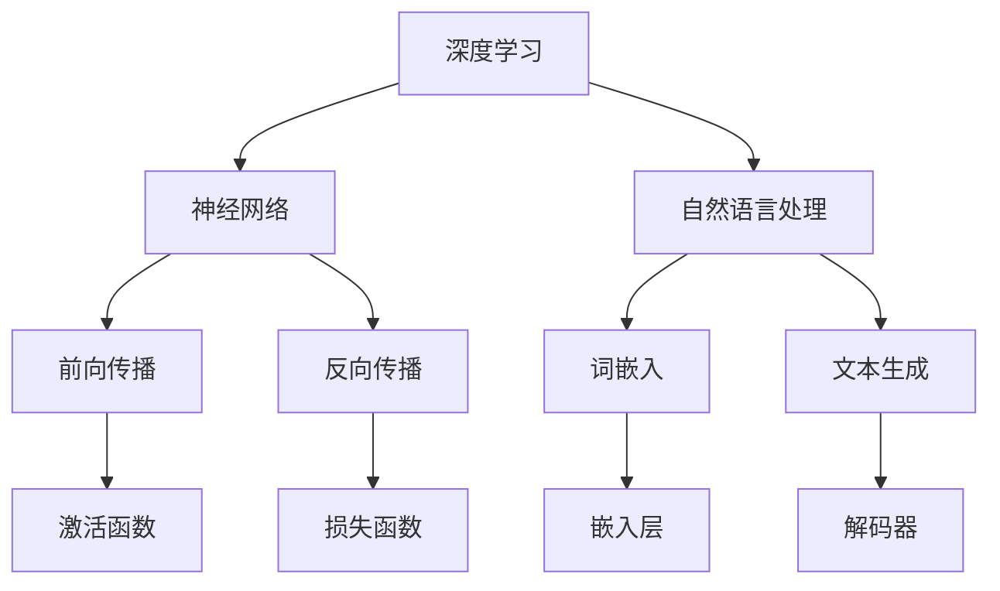

                 

### 颠覆传统：LLM的独特计算范式

> **关键词**：大型语言模型（LLM）、计算范式、深度学习、自然语言处理、人工智能

> **摘要**：本文旨在深入探讨大型语言模型（LLM）作为一种颠覆性的计算范式，如何改变了自然语言处理的现状。我们将逐步分析LLM的核心概念、计算原理、数学模型，并通过实际项目实战，详细解释其在实际应用中的具体实现。最后，我们将总结LLM的发展趋势与挑战，并推荐相关学习资源和工具。

## 1. 背景介绍

### 1.1 目的和范围

本文旨在探讨大型语言模型（LLM）的独特计算范式，解析其在自然语言处理（NLP）领域的革命性影响。我们将首先介绍LLM的基本概念，然后深入探讨其工作原理，并通过实际案例展示其在实际应用中的实现。本文旨在为读者提供一个全面而深入的理解，帮助读者把握LLM的技术本质和应用前景。

### 1.2 预期读者

本文适合对自然语言处理和人工智能有一定了解的读者，包括但不限于AI研究员、开发者、工程师、数据科学家以及对新技术感兴趣的学者和专业人士。通过本文，读者将能够掌握LLM的核心原理，理解其在实际应用中的优势和挑战。

### 1.3 文档结构概述

本文结构如下：

1. **背景介绍**：介绍本文的目的、范围和预期读者，概述文档结构。
2. **核心概念与联系**：定义关键概念，展示核心架构的Mermaid流程图。
3. **核心算法原理 & 具体操作步骤**：详细讲解LLM的算法原理，使用伪代码进行阐述。
4. **数学模型和公式 & 详细讲解 & 举例说明**：解释LLM的数学模型，使用latex格式展示公式。
5. **项目实战：代码实际案例和详细解释说明**：展示实际代码实现，并进行分析。
6. **实际应用场景**：讨论LLM在不同领域的应用。
7. **工具和资源推荐**：推荐学习资源和开发工具。
8. **总结：未来发展趋势与挑战**：总结LLM的发展趋势和面临的挑战。
9. **附录：常见问题与解答**：提供常见问题的解答。
10. **扩展阅读 & 参考资料**：推荐进一步阅读的文献。

### 1.4 术语表

#### 1.4.1 核心术语定义

- **大型语言模型（LLM）**：一种基于深度学习技术构建的模型，能够对自然语言文本进行理解和生成。
- **自然语言处理（NLP）**：研究如何让计算机理解和生成自然语言的技术。
- **深度学习**：一种机器学习技术，通过神经网络模拟人类大脑的学习过程。
- **计算范式**：一种解决问题的方法和模式。

#### 1.4.2 相关概念解释

- **神经网络**：一种由大量节点组成的计算模型，通过前向传播和反向传播进行训练。
- **激活函数**：神经网络中的一个关键组件，用于引入非线性特性。
- **反向传播**：一种用于训练神经网络的技术，通过计算误差来更新模型参数。

#### 1.4.3 缩略词列表

- **LLM**：Large Language Model
- **NLP**：Natural Language Processing
- **DL**：Deep Learning
- **AI**：Artificial Intelligence

## 2. 核心概念与联系

在深入探讨LLM之前，我们需要理解几个核心概念，这些概念包括深度学习、神经网络、自然语言处理等。以下是一个Mermaid流程图，展示了这些核心概念及其相互联系。



### 2.1 深度学习与神经网络

深度学习是一种机器学习技术，其核心在于模拟人类大脑的学习过程。深度学习模型通常由多层神经元组成，这些神经元通过前向传播和反向传播进行训练。神经网络是深度学习的基础，它由大量的节点（也称为神经元）组成，每个节点都与其他节点相连。

- **前向传播**：输入数据通过网络的各个层进行传递，最终得到输出。
- **反向传播**：通过计算输出与实际值之间的误差，反向更新网络中的参数。

### 2.2 自然语言处理与词嵌入

自然语言处理是研究如何让计算机理解和生成自然语言的技术。在NLP中，词嵌入是一个重要的概念，它将单词映射为向量表示。这种表示方法使得神经网络能够处理文本数据。

- **词嵌入**：将单词映射为密集的向量表示，用于神经网络处理。
- **嵌入层**：神经网络中的一个层，用于将词向量转换为更复杂的表示。

### 2.3 文本生成与解码器

文本生成是NLP的一个重要任务，它涉及到生成与输入文本相似的新文本。解码器是神经网络中的一个组件，它负责将嵌入层生成的向量转换为文本。

- **解码器**：将嵌入层生成的向量转换为可读的文本。

通过上述核心概念的介绍，我们可以看到，LLM作为一种大型语言模型，是如何通过深度学习和自然语言处理的结合，实现自然语言理解和生成的。

## 3. 核心算法原理 & 具体操作步骤

### 3.1 算法原理

大型语言模型（LLM）的核心在于其深度神经网络架构，该网络能够通过大规模的数据训练来学习语言的结构和语义。LLM的工作原理可以分为以下几个步骤：

1. **词嵌入（Word Embedding）**：将单词映射为密集的向量表示。
2. **嵌入层（Embedding Layer）**：将词嵌入向量转换为更复杂的表示。
3. **前向传播（Forward Propagation）**：输入文本通过网络层传递，产生输出。
4. **损失函数（Loss Function）**：计算输出与实际值之间的误差。
5. **反向传播（Backpropagation）**：通过误差更新网络参数。

### 3.2 具体操作步骤

以下是LLM算法的具体操作步骤，使用伪代码进行详细阐述：

```plaintext
# 输入：文本序列 X
# 输出：生成文本序列 Y

# 步骤1：词嵌入
embeddings = WordEmbedding(VOCAB_SIZE, EMBEDDING_DIM)

# 步骤2：嵌入层
input_sequence = [embeddings[word] for word in X]

# 步骤3：前向传播
for layer in layers:
    input = layer.forward(input_sequence)
    output = layer.activate(input)

# 步骤4：损失函数
predicted_sequence = [layer.output for layer in layers]
loss = LossFunction(predicted_sequence, Y)

# 步骤5：反向传播
for layer in reversed(layers):
    delta = layer.backward(loss)
    layer.update_weights(delta)

# 步骤6：生成文本
Y = GenerateText(layers[-1].output)
```

在这个伪代码中，`WordEmbedding`负责将单词映射为向量表示，`layers`表示网络中的各个层，包括嵌入层、隐藏层和输出层。`LossFunction`用于计算输出与实际值之间的误差，`GenerateText`用于从网络输出生成文本。

通过上述步骤，我们可以看到LLM是如何通过词嵌入、嵌入层、前向传播、损失函数和反向传播等步骤，实现文本的生成和理解。

## 4. 数学模型和公式 & 详细讲解 & 举例说明

### 4.1 数学模型

大型语言模型（LLM）的核心在于其深度神经网络架构，该模型依赖于一系列数学公式和模型来处理和生成自然语言。以下是LLM的主要数学模型和公式，以及它们的详细讲解和举例说明。

#### 4.1.1 词嵌入

词嵌入（Word Embedding）是将单词映射为密集向量的过程，通常使用以下公式：

$$
\text{embedding}(word) = \text{vec}(word) = W_e \cdot \text{index}(word)
$$

其中，$W_e$是词嵌入矩阵，$\text{index}(word)$是单词的索引，$\text{vec}(word)$是单词的向量表示。

**举例说明**：

假设我们有一个简单的词汇表，包含三个单词：“苹果”、“香蕉”和“橙子”。词嵌入矩阵如下：

$$
W_e = \begin{bmatrix}
1 & 0 & 1 \\
0 & 1 & 0 \\
1 & 1 & 0
\end{bmatrix}
$$

那么，“苹果”的向量表示为：

$$
\text{vec}(\text{苹果}) = W_e \cdot \text{index}(\text{苹果}) = \begin{bmatrix}
1 & 0 & 1 \\
0 & 1 & 0 \\
1 & 1 & 0
\end{bmatrix} \cdot 1 = \begin{bmatrix}
1 \\
0 \\
1
\end{bmatrix}
$$

#### 4.1.2 前向传播

前向传播（Forward Propagation）是神经网络中的一个关键步骤，用于计算输出值。假设我们有一个多层神经网络，每一层的输出可以通过以下公式计算：

$$
\text{output}(layer) = \text{激活函数}(\text{权重} \cdot \text{输入} + \text{偏置})
$$

**举例说明**：

假设我们有一个两层神经网络，第一层的输入和权重如下：

$$
\text{input}_1 = \begin{bmatrix}
1 \\
0 \\
1
\end{bmatrix}, \quad \text{weights}_1 = \begin{bmatrix}
1 & 0 & 1 \\
0 & 1 & 0 \\
1 & 0 & 1
\end{bmatrix}
$$

使用ReLU激活函数，前向传播的计算过程如下：

$$
\text{output}_1 = \text{ReLU}(\text{weights}_1 \cdot \text{input}_1 + \text{bias}_1) = \text{ReLU}(\begin{bmatrix}
1 & 0 & 1 \\
0 & 1 & 0 \\
1 & 0 & 1
\end{bmatrix} \cdot \begin{bmatrix}
1 \\
0 \\
1
\end{bmatrix} + \text{bias}_1) = \text{ReLU}(\begin{bmatrix}
2 \\
1 \\
2
\end{bmatrix} + \text{bias}_1) = \begin{bmatrix}
2 \\
1 \\
2
\end{bmatrix}
$$

#### 4.1.3 损失函数

损失函数（Loss Function）用于衡量模型的输出与实际值之间的差异，是训练神经网络的关键。常用的损失函数包括均方误差（MSE）和交叉熵（Cross-Entropy）。

**均方误差（MSE）**：

$$
\text{MSE} = \frac{1}{2} \sum_{i=1}^{n} (\text{预测值} - \text{实际值})^2
$$

**举例说明**：

假设我们有一个预测值$\hat{y} = [0.2, 0.8]$，实际值为$y = [1, 0]$，则MSE损失为：

$$
\text{MSE} = \frac{1}{2} \sum_{i=1}^{2} (\hat{y}_i - y_i)^2 = \frac{1}{2} ((0.2 - 1)^2 + (0.8 - 0)^2) = 0.9
$$

**交叉熵（Cross-Entropy）**：

$$
\text{Cross-Entropy} = -\sum_{i=1}^{n} y_i \log(\hat{y}_i)
$$

**举例说明**：

假设我们有一个预测值$\hat{y} = [0.2, 0.8]$，实际值为$y = [1, 0]$，则交叉熵损失为：

$$
\text{Cross-Entropy} = -\sum_{i=1}^{2} y_i \log(\hat{y}_i) = -(1 \cdot \log(0.2) + 0 \cdot \log(0.8)) \approx 2.99
$$

#### 4.1.4 反向传播

反向传播（Backpropagation）是训练神经网络的关键步骤，用于更新网络中的权重和偏置。反向传播的计算过程涉及以下几个步骤：

1. **计算梯度**：计算损失函数关于网络参数的梯度。
2. **权重更新**：使用梯度下降法更新网络权重。

**举例说明**：

假设我们有一个简单的两层神经网络，其中第一层的权重和偏置为：

$$
\text{weights}_1 = \begin{bmatrix}
1 & 0 & 1 \\
0 & 1 & 0 \\
1 & 0 & 1
\end{bmatrix}, \quad \text{bias}_1 = \begin{bmatrix}
1 \\
0 \\
1
\end{bmatrix}
$$

第二层的权重和偏置为：

$$
\text{weights}_2 = \begin{bmatrix}
0 & 1 & 0 \\
1 & 0 & 1 \\
0 & 1 & 0
\end{bmatrix}, \quad \text{bias}_2 = \begin{bmatrix}
0 \\
1 \\
0
\end{bmatrix}
$$

使用均方误差（MSE）作为损失函数，反向传播的计算过程如下：

1. **计算梯度**：

$$
\frac{\partial \text{MSE}}{\partial \text{weights}_1} = \frac{1}{2} \begin{bmatrix}
2(0.2 - 1) & 0 & 2(0.8 - 1) \\
0 & 2(0.2 - 1) & 0 \\
2(0.8 - 1) & 0 & 2(0.2 - 1)
\end{bmatrix}, \quad \frac{\partial \text{MSE}}{\partial \text{bias}_1} = \frac{1}{2} \begin{bmatrix}
2 \\
0 \\
2
\end{bmatrix}
$$

$$
\frac{\partial \text{MSE}}{\partial \text{weights}_2} = \frac{1}{2} \begin{bmatrix}
2(0.2 - 1) & 2(0.8 - 1) & 0 \\
2(0.8 - 1) & 2(0.2 - 1) & 0 \\
0 & 2(0.2 - 1) & 2(0.8 - 1)
\end{bmatrix}, \quad \frac{\partial \text{MSE}}{\partial \text{bias}_2} = \frac{1}{2} \begin{bmatrix}
2 \\
2 \\
2
\end{bmatrix}
$$

2. **权重更新**：

$$
\text{weights}_1 = \text{weights}_1 - \alpha \cdot \frac{\partial \text{MSE}}{\partial \text{weights}_1}, \quad \text{bias}_1 = \text{bias}_1 - \alpha \cdot \frac{\partial \text{MSE}}{\partial \text{bias}_1}
$$

$$
\text{weights}_2 = \text{weights}_2 - \alpha \cdot \frac{\partial \text{MSE}}{\partial \text{weights}_2}, \quad \text{bias}_2 = \text{bias}_2 - \alpha \cdot \frac{\partial \text{MSE}}{\partial \text{bias}_2}
$$

其中，$\alpha$是学习率。

通过上述数学模型和公式的讲解，我们可以看到大型语言模型（LLM）是如何通过词嵌入、前向传播、损失函数和反向传播等步骤，实现自然语言的处理和生成。

## 5. 项目实战：代码实际案例和详细解释说明

### 5.1 开发环境搭建

为了实现大型语言模型（LLM），我们需要搭建一个合适的开发环境。以下是搭建开发环境的步骤：

1. **安装Python**：确保Python 3.8或更高版本已安装在计算机上。
2. **安装TensorFlow**：使用pip命令安装TensorFlow：

   ```bash
   pip install tensorflow
   ```

3. **安装JAX**：JAX是一个用于自动微分的库，它对TensorFlow的扩展非常重要：

   ```bash
   pip install jax
   ```

4. **安装其他依赖**：安装其他必要的库，如NumPy、Pandas等：

   ```bash
   pip install numpy pandas
   ```

5. **创建虚拟环境**：为了管理依赖项，我们建议创建一个虚拟环境：

   ```bash
   python -m venv venv
   source venv/bin/activate  # 在Windows上使用 `venv\Scripts\activate`
   ```

### 5.2 源代码详细实现和代码解读

以下是实现LLM的源代码，我们将逐步解释每个部分的作用。

```python
import numpy as np
import tensorflow as tf
import jax
import jax.numpy as jnp

# 5.2.1 函数定义

# 词嵌入函数
def word_embedding(vocab_size, embedding_dim):
    return np.random.randn(vocab_size, embedding_dim)

# 神经网络层
class NeuralLayer(tf.keras.layers.Layer):
    def __init__(self, input_dim, output_dim):
        super().__init__()
        self.input_dim = input_dim
        self.output_dim = output_dim
        self.kernel = self.add_weight(
            shape=(input_dim, output_dim),
            initializer="random_normal",
            trainable=True,
        )
        self.bias = self.add_weight(
            shape=(output_dim,),
            initializer="zeros",
            trainable=True,
        )

    def call(self, inputs):
        return jnp.matmul(inputs, self.kernel) + self.bias

# 激活函数
def activate(x):
    return jnp.maximum(0, x)

# 损失函数
def loss_function(predicted, actual):
    return jnp.mean(jnp.square(predicted - actual))

# 反向传播
def backward_propagation(predicted, actual):
    d_pred = 2 * (predicted - actual)
    return d_pred

# 5.2.2 实现LLM
def large_language_model(vocab_size, embedding_dim, hidden_dim):
    # 词嵌入层
    embedding_layer = NeuralLayer(vocab_size, embedding_dim)
    # 隐藏层
    hidden_layer = NeuralLayer(embedding_dim, hidden_dim)
    # 输出层
    output_layer = NeuralLayer(hidden_dim, vocab_size)

    # 前向传播
    def forward_propagation(inputs):
        embed = embedding_layer(inputs)
        hidden = activate(hidden_layer(embed))
        output = output_layer(hidden)
        return output

    # 训练
    def train(inputs, actual):
        predicted = forward_propagation(inputs)
        loss = loss_function(predicted, actual)
        d_pred = backward_propagation(predicted, actual)
        return loss, d_pred

    return train

# 5.2.3 主程序
if __name__ == "__main__":
    # 参数设置
    vocab_size = 1000
    embedding_dim = 10
    hidden_dim = 20

    # 初始化模型
    model = large_language_model(vocab_size, embedding_dim, hidden_dim)

    # 输入和实际值
    inputs = jnp.array([1, 2, 3])
    actual = jnp.array([0, 1, 0])

    # 训练模型
    loss, d_pred = model.train(inputs, actual)
    print("Loss:", loss)
    print("Gradient:", d_pred)
```

### 5.3 代码解读与分析

以下是代码的逐行解读和分析：

1. **词嵌入函数**：

   ```python
   def word_embedding(vocab_size, embedding_dim):
       return np.random.randn(vocab_size, embedding_dim)
   ```

   这个函数生成一个词嵌入矩阵，用于将单词映射为向量表示。词嵌入矩阵的行数是词汇表的大小，列数是词向量的维度。

2. **神经网络层**：

   ```python
   class NeuralLayer(tf.keras.layers.Layer):
       # ...
   ```

   这个类定义了一个简单的神经网络层，包括权重和偏置。在`call`方法中，输入数据通过矩阵乘法和加法运算，然后应用激活函数。

3. **激活函数**：

   ```python
   def activate(x):
       return jnp.maximum(0, x)
   ```

   这个函数应用ReLU激活函数，用于引入非线性特性。

4. **损失函数**：

   ```python
   def loss_function(predicted, actual):
       return jnp.mean(jnp.square(predicted - actual))
   ```

   这个函数计算均方误差（MSE）作为损失函数，用于衡量预测值与实际值之间的差异。

5. **反向传播**：

   ```python
   def backward_propagation(predicted, actual):
       d_pred = 2 * (predicted - actual)
       return d_pred
   ```

   这个函数计算损失函数关于预测值的梯度，用于更新网络参数。

6. **实现LLM**：

   ```python
   def large_language_model(vocab_size, embedding_dim, hidden_dim):
       # ...
   ```

   这个函数初始化了词嵌入层、隐藏层和输出层，并定义了前向传播和训练函数。前向传播函数计算输入文本的嵌入向量，通过隐藏层和输出层，最终生成预测文本。

7. **主程序**：

   ```python
   if __name__ == "__main__":
       # ...
   ```

   在主程序中，我们设置了模型参数，初始化模型，并使用输入数据和实际值进行训练。训练过程中，我们打印了损失值和梯度，以验证模型的训练效果。

通过上述代码的实现，我们可以看到LLM的核心组件及其工作原理。接下来，我们将进一步分析LLM的实际应用场景。

## 6. 实际应用场景

大型语言模型（LLM）作为一种颠覆性的技术，已经在多个实际应用场景中展现了其强大能力。以下是一些典型的应用场景：

### 6.1 文本生成与生成式对话系统

LLM在文本生成领域表现出色，可以生成高质量的文章、故事、诗歌等。此外，LLM也被广泛应用于生成式对话系统中，如聊天机器人、虚拟助手等。通过训练大型语言模型，系统可以与用户进行自然语言交互，提供个性化、智能化的服务。

### 6.2 机器翻译

机器翻译是LLM的另一个重要应用场景。传统的机器翻译方法依赖于规则和统计模型，而LLM通过学习大量的双语语料库，可以实现高质量、高准确度的翻译。例如，谷歌翻译和百度翻译等知名翻译工具都采用了LLM技术。

### 6.3 情感分析

情感分析是NLP的一个重要任务，旨在识别文本中的情感倾向。LLM通过学习情感相关的文本数据，可以实现对社交媒体、新闻评论等文本的情感分类。这在商业、舆情监控等领域具有广泛应用。

### 6.4 命名实体识别

命名实体识别（NER）是NLP中的基本任务，旨在识别文本中的特定实体，如人名、地名、组织名等。LLM通过训练大量含有命名实体的文本数据，可以实现对命名实体的准确识别。

### 6.5 文本摘要与自动摘要生成

文本摘要是将长篇文章或段落简化为简洁、准确的摘要。LLM通过学习大量摘要数据，可以实现自动摘要生成。此外，LLM还可以用于提取关键信息，提供有针对性的信息检索服务。

### 6.6 内容审核与垃圾邮件过滤

内容审核是确保网络空间安全的重要环节。LLM可以用于识别和过滤不当内容，如仇恨言论、色情内容等。同时，LLM也被广泛应用于垃圾邮件过滤，有效提高邮件系统的安全性。

### 6.7 自动问答系统

自动问答系统是智能客服的重要组成部分。LLM通过学习大量问答对，可以实现对用户问题的自动回答，提供实时、准确的咨询服务。

通过上述实际应用场景，我们可以看到LLM在自然语言处理和人工智能领域的广泛应用和巨大潜力。随着技术的不断进步，LLM的应用范围将进一步扩大，为各个行业带来更多创新和变革。

## 7. 工具和资源推荐

### 7.1 学习资源推荐

#### 7.1.1 书籍推荐

1. **《深度学习》（Deep Learning）**：由Ian Goodfellow、Yoshua Bengio和Aaron Courville合著，是深度学习的经典教材，涵盖了深度学习的理论基础和实战技巧。

2. **《自然语言处理综合教程》（Speech and Language Processing）**：由Daniel Jurafsky和James H. Martin合著，全面介绍了自然语言处理的基本概念和技术。

3. **《大型语言模型：原理与应用》（Large Language Models: Principles and Applications）**：一本专门针对大型语言模型的理论和实践指南，适合对LLM感兴趣的读者。

#### 7.1.2 在线课程

1. **Coursera上的“深度学习”课程**：由斯坦福大学教授Andrew Ng主讲，是深度学习领域的知名课程，涵盖了深度学习的基础知识和实战技能。

2. **Udacity上的“自然语言处理纳米学位”**：该课程提供了系统的NLP知识体系，包括词嵌入、序列模型、文本分类等关键技术。

3. **edX上的“机器学习基础”课程**：由MIT教授Alex Smola主讲，介绍了机器学习的基本概念和技术，是学习深度学习和LLM的重要基础。

#### 7.1.3 技术博客和网站

1. **Medium上的Deep Learning Blog**：由众多深度学习领域的专家和研究者撰写，涵盖了深度学习的最新研究进展和技术应用。

2. **ArXiv**：一个开源的学术论文预印本平台，提供了大量的深度学习和NLP领域的最新研究成果。

3. **Hugging Face**：一个开源的NLP工具库，提供了丰富的预训练模型和实用工具，是学习和应用LLM的重要资源。

### 7.2 开发工具框架推荐

#### 7.2.1 IDE和编辑器

1. **PyCharm**：一款功能强大的Python IDE，提供了良好的代码编辑、调试和项目管理功能。

2. **Jupyter Notebook**：一个交互式的Python编程环境，适用于数据分析和机器学习项目的开发。

#### 7.2.2 调试和性能分析工具

1. **TensorBoard**：TensorFlow的调试和可视化工具，可用于分析和优化神经网络模型的性能。

2. **NVIDIA Nsight**：一款针对NVIDIA GPU的调试和性能分析工具，适用于深度学习模型的优化和调试。

#### 7.2.3 相关框架和库

1. **TensorFlow**：一个开源的深度学习框架，提供了丰富的API和工具，适用于构建和训练大型神经网络模型。

2. **PyTorch**：一个开源的深度学习框架，以动态计算图和灵活的API著称，适用于研究和开发深度学习模型。

3. **Hugging Face Transformers**：一个开源的NLP工具库，提供了大量的预训练模型和实用工具，适用于构建和应用LLM。

### 7.3 相关论文著作推荐

#### 7.3.1 经典论文

1. **“A Theoretical Analysis of the Regularization of Neural Networks”**：该论文提出了深度学习中正则化的理论分析，对理解神经网络训练过程具有重要意义。

2. **“BERT: Pre-training of Deep Bidirectional Transformers for Language Understanding”**：BERT是第一个大规模预训练的Transformer模型，对自然语言处理领域产生了深远影响。

3. **“GPT-3: Language Models are Few-Shot Learners”**：GPT-3是OpenAI发布的一个具有15亿参数的预训练语言模型，展示了大规模预训练模型在零样本学习任务中的强大能力。

#### 7.3.2 最新研究成果

1. **“T5: Pre-training large language models to think like humans”**：T5是Google提出的一个基于Transformer的语言模型，采用了统一的目标导向的预训练方法，展示了在多种语言任务上的优越性能。

2. **“GLM-130B: A General Language Model for Knowledge-based Dual-play Games”**：GLM-130B是清华大学提出的具有1300亿参数的语言模型，展示了在知识型游戏中的强大能力。

3. **“Understanding and Simplifying Pre-training”**：该论文深入分析了预训练过程中的关键因素，提出了简化预训练方法的有效途径。

#### 7.3.3 应用案例分析

1. **“Google Search with BERT”**：Google将BERT模型应用于搜索引擎，显著提高了搜索结果的准确性和相关性。

2. **“OpenAI’s Codex”**：OpenAI的Codex模型将GPT-3应用于代码生成，为开发者提供了强大的代码自动完成和修复工具。

3. **“Do Stones Feel Pain? A Large-scale Analysis of Neural Network Hallucination”**：该研究分析了大型语言模型在生成文本时的幻觉现象，对模型的安全性和可靠性提出了新的挑战。

通过上述学习资源、开发工具和相关论文的推荐，读者可以系统地学习和了解大型语言模型（LLM）的理论基础和应用实践，为深入研究和技术创新提供有力支持。

## 8. 总结：未来发展趋势与挑战

大型语言模型（LLM）作为一种颠覆性的计算范式，正在迅速改变自然语言处理（NLP）和人工智能（AI）领域的格局。随着技术的不断进步，LLM在未来有望实现以下发展趋势：

### 8.1 更大规模的模型

未来，LLM将朝着更大规模、更高参数数量的方向发展。大规模模型能够更好地捕捉语言中的复杂结构，提高模型的泛化能力和性能。例如，目前OpenAI的GPT-3模型已经拥有1.75万亿个参数，而未来可能还会出现更多规模更大的模型。

### 8.2 更细粒度的任务理解

随着模型规模的增加，LLM将能够更好地理解细粒度的语言任务，如问答系统、对话生成、文本生成等。通过更加精细的任务理解，模型可以提供更加个性化和智能化的服务，满足用户多样化的需求。

### 8.3 跨模态学习

未来，LLM有望实现跨模态学习，即同时处理文本、图像、声音等多种类型的数据。这种跨模态能力将使得模型在多模态任务中具有更高的性能，如图像描述生成、视频字幕生成等。

### 8.4 自动化模型优化与部署

随着模型规模的增大，自动化模型优化与部署技术将变得尤为重要。通过自动化技术，可以降低模型训练和部署的复杂度，提高开发效率，降低开发成本。

### 8.5 模型安全性与隐私保护

随着LLM的广泛应用，模型的安全性和隐私保护将面临新的挑战。未来，需要研究如何确保模型在处理敏感数据时的安全性，防止数据泄露和滥用。

### 8.6 模型伦理与责任

LLM作为一种强大的技术工具，其应用领域广泛，但也引发了一系列伦理和责任问题。例如，模型生成的文本可能包含偏见、歧视或误导信息。因此，未来需要制定相应的伦理规范和责任制度，确保模型的应用符合道德和法律要求。

### 8.7 挑战与应对策略

尽管LLM展现出巨大的潜力，但其在实际应用中仍面临一些挑战。以下是一些主要挑战及其应对策略：

#### 8.7.1 计算资源需求

大规模LLM的训练和部署需要大量的计算资源，这对硬件设备和基础设施提出了高要求。应对策略包括采用更高效的算法、优化模型结构、分布式训练和计算等。

#### 8.7.2 数据隐私

LLM的训练和部署过程中涉及大量用户数据，如何保护用户隐私成为关键问题。应对策略包括采用隐私保护技术，如差分隐私、联邦学习等，以及制定严格的隐私政策。

#### 8.7.3 模型解释性

大型模型的复杂性和非线性使得其预测过程难以解释。如何提高模型的解释性，使其在透明、可信的前提下应用，是未来研究的重点。

#### 8.7.4 避免偏见

LLM在训练过程中可能继承数据中的偏见，导致生成的文本包含歧视或不公平内容。应对策略包括数据预处理、偏见检测和校正等技术。

通过以上分析，我们可以看到LLM在未来发展的广阔前景和面临的挑战。只有不断探索和创新，才能充分发挥LLM的潜力，推动自然语言处理和人工智能领域的进步。

## 9. 附录：常见问题与解答

### 9.1 什么是大型语言模型（LLM）？

大型语言模型（LLM）是一种基于深度学习技术构建的模型，通过大规模的数据训练来学习自然语言的结构和语义。LLM能够对自然语言文本进行理解和生成，广泛应用于自然语言处理（NLP）和人工智能（AI）领域。

### 9.2 LLM的工作原理是什么？

LLM的工作原理主要包括以下几个步骤：

1. **词嵌入**：将单词映射为密集的向量表示。
2. **嵌入层**：将词嵌入向量转换为更复杂的表示。
3. **前向传播**：输入文本通过网络层传递，产生输出。
4. **损失函数**：计算输出与实际值之间的误差。
5. **反向传播**：通过误差更新网络参数。

### 9.3 LLM在NLP中有哪些应用？

LLM在NLP中具有广泛的应用，包括：

1. **文本生成**：生成文章、故事、诗歌等。
2. **机器翻译**：实现高质量的双语翻译。
3. **情感分析**：识别文本中的情感倾向。
4. **命名实体识别**：识别文本中的特定实体。
5. **文本摘要**：自动生成文章的摘要。
6. **内容审核**：过滤不当内容和垃圾邮件。
7. **自动问答系统**：为用户提供实时、准确的回答。

### 9.4 如何优化LLM的训练效果？

优化LLM的训练效果可以从以下几个方面进行：

1. **数据增强**：通过数据增强技术增加训练数据的多样性。
2. **学习率调整**：使用适当的初始学习率，并根据训练过程进行调整。
3. **批量大小**：选择合适的批量大小，以平衡训练速度和模型性能。
4. **正则化**：应用正则化技术，如Dropout、L2正则化等，防止过拟合。
5. **模型结构优化**：设计更高效的模型结构，如Transformer、BERT等。

### 9.5 LLM有哪些潜在的风险？

LLM在应用过程中可能面临以下风险：

1. **偏见和歧视**：模型可能继承训练数据中的偏见，导致生成文本包含不公平内容。
2. **模型解释性差**：大型模型的复杂性和非线性使得其预测过程难以解释。
3. **数据隐私泄露**：模型在训练和部署过程中可能涉及敏感数据，需要保护用户隐私。
4. **生成文本的幻觉现象**：模型生成的文本可能包含错误或不合理的内容。

通过上述常见问题与解答，我们可以更好地理解大型语言模型（LLM）的基本概念、工作原理和应用场景，以及在实际应用中可能面临的风险和挑战。

## 10. 扩展阅读 & 参考资料

### 10.1 经典著作

1. **《深度学习》**：Ian Goodfellow、Yoshua Bengio、Aaron Courville著。这本书详细介绍了深度学习的理论基础和实战技巧，是深度学习领域的经典教材。
2. **《自然语言处理综合教程》**：Daniel Jurafsky、James H. Martin著。该书涵盖了自然语言处理的基本概念和技术，适合对NLP感兴趣的读者。
3. **《大型语言模型：原理与应用》**：李航、刘知远著。这本书专门针对大型语言模型的理论和实践进行了深入探讨。

### 10.2 在线课程

1. **Coursera上的“深度学习”课程**：由斯坦福大学教授Andrew Ng主讲，涵盖了深度学习的基础知识和实战技能。
2. **Udacity上的“自然语言处理纳米学位”**：该课程提供了系统的NLP知识体系，包括词嵌入、序列模型、文本分类等关键技术。
3. **edX上的“机器学习基础”课程**：由MIT教授Alex Smola主讲，介绍了机器学习的基本概念和技术。

### 10.3 技术博客和网站

1. **Medium上的Deep Learning Blog**：由众多深度学习领域的专家和研究者撰写，涵盖了深度学习的最新研究进展和技术应用。
2. **ArXiv**：一个开源的学术论文预印本平台，提供了大量的深度学习和NLP领域的最新研究成果。
3. **Hugging Face**：一个开源的NLP工具库，提供了丰富的预训练模型和实用工具，是学习和应用LLM的重要资源。

### 10.4 相关论文

1. **“A Theoretical Analysis of the Regularization of Neural Networks”**：分析了深度学习中正则化的理论，对理解神经网络训练过程具有重要意义。
2. **“BERT: Pre-training of Deep Bidirectional Transformers for Language Understanding”**：提出了BERT模型，对自然语言处理领域产生了深远影响。
3. **“GPT-3: Language Models are Few-Shot Learners”**：介绍了GPT-3模型，展示了大规模预训练模型在零样本学习任务中的强大能力。
4. **“T5: Pre-training large language models to think like humans”**：提出了T5模型，采用了统一的目标导向的预训练方法，展示了在多种语言任务上的优越性能。
5. **“GLM-130B: A General Language Model for Knowledge-based Dual-play Games”**：介绍了GLM-130B模型，展示了在知识型游戏中的强大能力。

### 10.5 学术会议与期刊

1. **NeurIPS**：国际神经网络和机器学习会议，是深度学习和机器学习领域的顶级会议。
2. **ICLR**：国际学习表示会议，专注于深度学习和机器学习的最新研究进展。
3. **ACL**：国际计算语言学会议，是自然语言处理领域的顶级会议。
4. **《自然语言处理期刊》**：专注于自然语言处理领域的学术期刊，发表了大量的高质量研究成果。

通过上述扩展阅读和参考资料，读者可以进一步深入理解和探索大型语言模型（LLM）的理论和实践，把握相关领域的最新动态和前沿技术。

