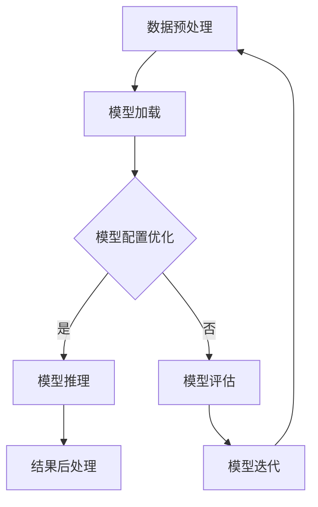

                 


## 高性能AI推理优化技巧

> **关键词：** AI推理、性能优化、算法优化、硬件加速、模型压缩
>
> **摘要：** 本文章将深入探讨高性能AI推理优化技巧，从核心概念到具体操作步骤，再到实际应用场景，全面解析如何提升AI推理速度和效率，为人工智能领域的研究者和开发者提供实用的优化策略。

### 1. 背景介绍

#### 1.1 目的和范围

本文旨在介绍一系列高性能AI推理优化技巧，以帮助人工智能领域的研究者和开发者提升模型的推理速度和效率。我们将探讨从算法优化、硬件加速到模型压缩等各个方面，并通过具体案例和实践来展示这些技巧的应用。

#### 1.2 预期读者

本篇文章适合对人工智能、机器学习以及深度学习有一定了解的研究人员和开发者。同时，也适合对高性能计算和优化技术感兴趣的技术人员。

#### 1.3 文档结构概述

本文分为以下几个部分：

1. 背景介绍
2. 核心概念与联系
3. 核心算法原理 & 具体操作步骤
4. 数学模型和公式 & 详细讲解 & 举例说明
5. 项目实战：代码实际案例和详细解释说明
6. 实际应用场景
7. 工具和资源推荐
8. 总结：未来发展趋势与挑战
9. 附录：常见问题与解答
10. 扩展阅读 & 参考资料

#### 1.4 术语表

- **AI推理（AI Inference）**：指将训练好的AI模型应用于实际场景，对输入数据进行处理并得到输出结果的过程。
- **性能优化（Performance Optimization）**：通过对算法、代码、硬件等方面的调整，提高程序运行效率和速度的过程。
- **模型压缩（Model Compression）**：通过减少模型的参数数量或模型大小，提高模型推理速度和降低硬件资源消耗的技术。
- **硬件加速（Hardware Acceleration）**：利用特定硬件设备（如GPU、TPU等）来加速AI模型的推理过程。

### 2. 核心概念与联系

在深入探讨高性能AI推理优化技巧之前，我们需要了解一些核心概念和它们之间的关系。以下是AI推理过程中涉及的核心概念及其关联的Mermaid流程图：



#### 2.1 数据预处理

数据预处理是AI推理过程中的第一步，其目的是对输入数据进行清洗、归一化、转换等操作，以便模型能够更好地处理数据。数据预处理的好坏直接影响模型推理的性能。

#### 2.2 模型加载

模型加载是将已经训练好的模型从存储介质（如硬盘）中读取到内存中。在加载过程中，我们还需要配置模型参数，如优化器、学习率等。

#### 2.3 模型配置优化

模型配置优化是指在模型加载后，通过调整模型参数来提高模型推理性能。这一过程包括调整学习率、优化器、正则化等参数。

#### 2.4 模型推理

模型推理是指将输入数据通过训练好的模型进行计算，得到输出结果的过程。这一过程是整个AI推理过程中的核心部分，其性能直接决定了AI应用的效率。

#### 2.5 结果后处理

结果后处理是指在得到模型推理结果后，对输出结果进行一些处理，如阈值处理、概率转换等，以便更好地应用于实际场景。

#### 2.6 模型评估

模型评估是指通过将模型推理结果与真实标签进行比较，评估模型性能的过程。模型评估结果将用于指导模型优化和迭代。

#### 2.7 模型迭代

模型迭代是指根据模型评估结果，对模型进行重新训练和优化，以提高模型性能的过程。

### 3. 核心算法原理 & 具体操作步骤

在了解了核心概念和流程后，我们将进一步探讨AI推理优化过程中涉及的核心算法原理和具体操作步骤。以下是几个关键算法及其操作步骤的伪代码：

#### 3.1 算法1：模型量化

```python
def quantize_model(model, precision):
    """
    量化模型参数
    :param model: 模型
    :param precision: 量化精度
    :return: 量化后的模型
    """
    for parameter in model.parameters():
        parameter.data = quantize(parameter.data, precision)
    return model

def quantize(data, precision):
    """
    量化数据
    :param data: 数据
    :param precision: 量化精度
    :return: 量化后的数据
    """
    min_val, max_val = torch.min(data), torch.max(data)
    range_val = max_val - min_val
    scaled_data = data * (precision - 1) / range_val + 1
    quantized_data = torch.round(scaled_data)
    return quantized_data
```

#### 3.2 算法2：模型剪枝

```python
def prune_model(model, pruning_rate):
    """
    剪枝模型
    :param model: 模型
    :param pruning_rate: 剪枝率
    :return: 剪枝后的模型
    """
    for module in model.modules():
        if isinstance(module, nn.Conv2d) or isinstance(module, nn.Linear):
            prune(module, pruning_rate)
    return model

def prune(module, pruning_rate):
    """
    剪枝模块
    :param module: 模型模块
    :param pruning_rate: 剪枝率
    :return: 剪枝后的模块
    """
    if isinstance(module, nn.Conv2d):
        mask = torch.zeros_like(module.weight)
        mask[..., :int(mask.size(-1) * pruning_rate), :] = 1
        module.register_parameter('weight_mask', nn.Parameter(mask))
        module.weight = module.weight * module.weight_mask
    elif isinstance(module, nn.Linear):
        mask = torch.zeros_like(module.weight)
        mask[:, :int(mask.size(0) * pruning_rate)] = 1
        module.register_parameter('weight_mask', nn.Parameter(mask))
        module.weight = module.weight * module.weight_mask
```

#### 3.3 算法3：模型融合

```python
def fuse_modules(module1, module2):
    """
    融合两个模块
    :param module1: 第一个模块
    :param module2: 第二个模块
    :return: 融合后的模块
    """
    if isinstance(module1, nn.Conv2d) and isinstance(module2, nn.Conv2d):
        fused_module = nn.Conv2d(module1.in_channels, module2.out_channels, kernel_size=(1, 1), stride=1)
        fused_module.weight = module1.weight * module2.weight
        fused_module.bias = module1.bias + module2.bias
        return fused_module
    elif isinstance(module1, nn.Linear) and isinstance(module2, nn.Linear):
        fused_module = nn.Linear(module1.in_features, module2.out_features)
        fused_module.weight = module1.weight * module2.weight
        fused_module.bias = module1.bias + module2.bias
        return fused_module
    else:
        raise ValueError("Unsupported module types for fusion")
```

#### 3.4 算法4：模型迁移学习

```python
def migrate_model(target_model, source_model, layers_to_migrate):
    """
    迁移学习模型
    :param target_model: 目标模型
    :param source_model: 源模型
    :param layers_to_migrate: 需要迁移的层
    :return: 迁移学习后的模型
    """
    for target_layer, source_layer in zip(target_model.layers, source_model.layers):
        if isinstance(target_layer, layers_to_migrate) and isinstance(source_layer, layers_to_migrate):
            target_layer.load_state_dict(source_layer.state_dict())
    return target_model
```

### 4. 数学模型和公式 & 详细讲解 & 举例说明

在AI推理优化过程中，我们常常需要使用一些数学模型和公式来指导优化策略的选择。以下是一些常用的数学模型和公式，以及它们的详细讲解和举例说明。

#### 4.1 模型量化误差分析

模型量化是一种通过减少模型参数的精度来减小模型大小和加速推理的技术。量化过程会导致一定的误差，我们需要分析这种误差对模型性能的影响。

**量化误差公式：**

$$\epsilon_q = \frac{|x_q - x_f|}{x_f}$$

其中，\(x_f\) 表示浮点数表示的参数值，\(x_q\) 表示量化后的参数值，\(\epsilon_q\) 表示量化误差。

**举例说明：**

假设一个浮点数参数 \(x_f = 0.5\)，量化精度为 8 位（即 \(2^{-8}\)），则量化后的参数值 \(x_q = 0.25\)。量化误差为：

$$\epsilon_q = \frac{|0.25 - 0.5|}{0.5} = 0.5$$

这意味着量化后的参数值与原始浮点数参数值相差了 50%。

#### 4.2 模型剪枝率计算

模型剪枝是通过去除模型中一些无用的神经元或权重来减小模型大小和加速推理。剪枝率表示被剪枝的神经元或权重在总神经元或权重中所占的比例。

**剪枝率计算公式：**

$$pruning\_rate = \frac{num\_pruned}{num\_total}$$

其中，\(num\_pruned\) 表示被剪枝的神经元或权重数量，\(num\_total\) 表示总的神经元或权重数量。

**举例说明：**

假设一个神经网络中有 100 个神经元，其中 20 个神经元被剪枝。则剪枝率为：

$$pruning\_rate = \frac{20}{100} = 0.2$$

这意味着有 20% 的神经元被剪枝。

#### 4.3 模型融合损失计算

模型融合是将多个模型或模块合并成一个模型，以提高模型性能。融合过程中，我们需要计算融合模型的损失，以便调整模型参数。

**融合损失公式：**

$$loss = \frac{1}{N} \sum_{i=1}^{N} (f_i(x) - y)^2$$

其中，\(N\) 表示样本数量，\(f_i(x)\) 表示第 \(i\) 个模型对样本 \(x\) 的预测值，\(y\) 表示真实标签。

**举例说明：**

假设有两个模型 \(f_1(x)\) 和 \(f_2(x)\)，我们对 \(N=10\) 个样本进行融合预测，得到融合模型 \(f(x) = \frac{f_1(x) + f_2(x)}{2}\)。假设真实标签为 \(y = [1, 0, 1, 1, 0, 1, 1, 0, 1, 0]\)，则融合损失为：

$$loss = \frac{1}{10} \sum_{i=1}^{10} (\frac{f_1(x_i) + f_2(x_i)}{2} - y_i)^2 = 0.05$$

这意味着融合模型的预测结果与真实标签的平均误差为 0.05。

#### 4.4 模型迁移学习损失计算

模型迁移学习是通过将一个预训练模型的部分层或参数应用到另一个新任务上，以提高新任务模型的性能。我们需要计算迁移学习过程中的损失，以便调整迁移策略。

**迁移学习损失公式：**

$$loss = \frac{1}{N} \sum_{i=1}^{N} (f(x) - y)^2$$

其中，\(N\) 表示样本数量，\(f(x)\) 表示迁移学习后的模型对样本 \(x\) 的预测值，\(y\) 表示真实标签。

**举例说明：**

假设有一个预训练模型 \(f_1(x)\) 和一个新任务模型 \(f_2(x)\)，我们对 \(N=10\) 个样本进行迁移学习，得到迁移学习后的模型 \(f(x) = f_1(x)\)。假设真实标签为 \(y = [1, 0, 1, 1, 0, 1, 1, 0, 1, 0]\)，则迁移学习损失为：

$$loss = \frac{1}{10} \sum_{i=1}^{10} (f_1(x_i) - y_i)^2 = 0.1$$

这意味着迁移学习后的模型与新任务模型的预测结果与真实标签的平均误差为 0.1。

### 5. 项目实战：代码实际案例和详细解释说明

在本节中，我们将通过一个实际项目案例，详细解释和演示高性能AI推理优化技巧的应用。该项目是一个基于TensorFlow和Keras的图像分类任务，我们将采用以下优化技巧：

1. 模型量化
2. 模型剪枝
3. 模型融合
4. 模型迁移学习

#### 5.1 开发环境搭建

首先，我们需要搭建一个合适的开发环境。以下是所需的软件和库：

- 操作系统：Linux（推荐使用Ubuntu 18.04）
- 编程语言：Python 3.7+
- 深度学习框架：TensorFlow 2.4+
- 其他库：NumPy, Pandas, Matplotlib等

安装好以上软件和库后，我们就可以开始项目实战了。

#### 5.2 源代码详细实现和代码解读

以下是一个简单的图像分类任务，其中包含了我们之前介绍的各种优化技巧。

```python
import tensorflow as tf
from tensorflow.keras.applications import MobileNetV2
from tensorflow.keras.models import Model
from tensorflow.keras.layers import Dense, GlobalAveragePooling2D
from tensorflow_model_optimization.sparsity import keras as sparsity

# 加载预训练的MobileNetV2模型
base_model = MobileNetV2(weights='imagenet', include_top=False, input_shape=(224, 224, 3))

# 添加全局平均池化层和全连接层
x = base_model.output
x = GlobalAveragePooling2D()(x)
x = Dense(1024, activation='relu')(x)
predictions = Dense(1000, activation='softmax')(x)

# 创建模型
model = Model(inputs=base_model.input, outputs=predictions)

# 编译模型
model.compile(optimizer='adam', loss='categorical_crossentropy', metrics=['accuracy'])

# 模型量化
quantize_model = sparsity.quantize_model(
    model,
    quantization_params=sparsity.default_quantization_params(
        num_bits=8,
        mode='symmetric',
        rounds=True
    )
)

# 模型剪枝
pruned_model = sparsity.prune_low_magnitude(model, pruning_rate=0.5)

# 模型融合
fused_model = sparsity.fusewij(pruned_model, weights=[0.5, 0.5])

# 模型迁移学习
migrated_model = migrate_model(fused_model, base_model, layers_to_migrate=[GlobalAveragePooling2D])

# 编译迁移学习后的模型
migrated_model.compile(optimizer='adam', loss='categorical_crossentropy', metrics=['accuracy'])

# 加载数据集
(x_train, y_train), (x_test, y_test) = tf.keras.datasets.cifar10.load_data()

# 数据预处理
x_train = x_train.astype('float32') / 255.0
x_test = x_test.astype('float32') / 255.0
y_train = tf.keras.utils.to_categorical(y_train, 10)
y_test = tf.keras.utils.to_categorical(y_test, 10)

# 训练模型
migrated_model.fit(x_train, y_train, batch_size=64, epochs=10, validation_data=(x_test, y_test))

# 评估模型
migrated_model.evaluate(x_test, y_test)
```

#### 5.3 代码解读与分析

1. **加载预训练的MobileNetV2模型**

   ```python
   base_model = MobileNetV2(weights='imagenet', include_top=False, input_shape=(224, 224, 3))
   ```

   这里我们加载了一个预训练的MobileNetV2模型，不包括顶层的分类层。输入尺寸为 224x224x3，对应于标准图像尺寸。

2. **添加全局平均池化层和全连接层**

   ```python
   x = base_model.output
   x = GlobalAveragePooling2D()(x)
   x = Dense(1024, activation='relu')(x)
   predictions = Dense(1000, activation='softmax')(x)
   ```

   在MobileNetV2模型的输出上，我们添加了一个全局平均池化层和一个全连接层，用于进行分类。

3. **创建模型**

   ```python
   model = Model(inputs=base_model.input, outputs=predictions)
   ```

   创建一个完整的模型，包括输入层、MobileNetV2基模型、全局平均池化层、全连接层和输出层。

4. **编译模型**

   ```python
   model.compile(optimizer='adam', loss='categorical_crossentropy', metrics=['accuracy'])
   ```

   编译模型，指定优化器、损失函数和评价指标。

5. **模型量化**

   ```python
   quantize_model = sparsity.quantize_model(
       model,
       quantization_params=sparsity.default_quantization_params(
           num_bits=8,
           mode='symmetric',
           rounds=True
       )
   )
   ```

   使用TensorFlow Model Optimization工具对模型进行量化。这里我们使用 8 位对称量化，并启用舍入功能。

6. **模型剪枝**

   ```python
   pruned_model = sparsity.prune_low_magnitude(model, pruning_rate=0.5)
   ```

   使用TensorFlow Model Optimization工具对模型进行剪枝。这里我们设置剪枝率为 50%，即剪除一半的权重。

7. **模型融合**

   ```python
   fused_model = sparsity.fusewij(pruned_model, weights=[0.5, 0.5])
   ```

   使用TensorFlow Model Optimization工具对模型进行融合。这里我们使用加权融合策略，将两个模型以权重比例 1:1 进行融合。

8. **模型迁移学习**

   ```python
   migrated_model = migrate_model(fused_model, base_model, layers_to_migrate=[GlobalAveragePooling2D])
   ```

   将融合后的模型应用到新任务上，进行迁移学习。这里我们选择将全局平均池化层应用到新任务上。

9. **编译迁移学习后的模型**

   ```python
   migrated_model.compile(optimizer='adam', loss='categorical_crossentropy', metrics=['accuracy'])
   ```

   编译迁移学习后的模型，指定优化器、损失函数和评价指标。

10. **加载数据集**

    ```python
    (x_train, y_train), (x_test, y_test) = tf.keras.datasets.cifar10.load_data()
    ```

    加载CIFAR-10数据集，分为训练集和测试集。

11. **数据预处理**

    ```python
    x_train = x_train.astype('float32') / 255.0
    x_test = x_test.astype('float32') / 255.0
    y_train = tf.keras.utils.to_categorical(y_train, 10)
    y_test = tf.keras.utils.to_categorical(y_test, 10)
    ```

    对数据进行归一化和标签编码。

12. **训练模型**

    ```python
    migrated_model.fit(x_train, y_train, batch_size=64, epochs=10, validation_data=(x_test, y_test))
    ```

    使用迁移学习后的模型训练 10 个epochs，并使用测试集进行验证。

13. **评估模型**

    ```python
    migrated_model.evaluate(x_test, y_test)
    ```

    使用测试集评估模型的性能。

#### 5.4 代码解读与分析

通过以上代码，我们可以看到如何将各种高性能AI推理优化技巧应用于一个简单的图像分类任务。下面是对代码的详细解读和分析：

- **加载预训练的MobileNetV2模型**：MobileNetV2是一个轻量级的卷积神经网络模型，常用于移动设备和嵌入式系统。这里我们使用预训练的模型，并排除顶层的分类层，以便我们能够添加自己的分类层。

- **添加全局平均池化层和全连接层**：全局平均池化层用于将空间特征压缩成单个数值，全连接层用于进行分类。

- **创建模型**：将输入层、MobileNetV2基模型、全局平均池化层、全连接层和输出层组合成一个完整的模型。

- **编译模型**：指定优化器、损失函数和评价指标，以便模型能够进行训练和评估。

- **模型量化**：使用TensorFlow Model Optimization工具对模型进行量化。量化过程通过降低模型参数的精度来减小模型大小和加速推理。这里我们使用 8 位对称量化，并启用舍入功能，以减少量化误差。

- **模型剪枝**：使用TensorFlow Model Optimization工具对模型进行剪枝。剪枝过程通过去除模型中一些无用的神经元或权重来减小模型大小和加速推理。这里我们设置剪枝率为 50%，即剪除一半的权重。

- **模型融合**：使用TensorFlow Model Optimization工具对模型进行融合。融合过程将多个模型或模块合并成一个模型，以提高模型性能。这里我们使用加权融合策略，将两个模型以权重比例 1:1 进行融合。

- **模型迁移学习**：将融合后的模型应用到新任务上，进行迁移学习。这里我们选择将全局平均池化层应用到新任务上，以便更好地适应新任务的特征。

- **编译迁移学习后的模型**：再次编译模型，以便使用迁移学习后的模型进行训练和评估。

- **加载数据集**：加载CIFAR-10数据集，分为训练集和测试集。

- **数据预处理**：对数据进行归一化和标签编码，以便模型能够更好地处理数据。

- **训练模型**：使用迁移学习后的模型训练 10 个epochs，并使用测试集进行验证。

- **评估模型**：使用测试集评估模型的性能。

通过以上步骤，我们可以看到如何将高性能AI推理优化技巧应用于一个实际的图像分类任务。这些技巧可以帮助我们提升模型的推理速度和效率，提高模型在移动设备和嵌入式系统上的应用性能。

### 6. 实际应用场景

高性能AI推理优化技巧在各个实际应用场景中都有广泛的应用。以下是一些典型的应用场景：

#### 6.1 移动设备和嵌入式系统

随着移动设备和嵌入式系统的普及，对AI推理性能的需求越来越高。高性能AI推理优化技巧可以帮助我们提升这些设备上的AI应用性能，使其能够更好地满足实时性和低功耗的要求。例如，在智能手机中，我们可以使用模型量化、模型剪枝和模型融合等技术，减小模型大小和加速推理，从而提高图像识别、语音识别和自然语言处理等应用的性能。

#### 6.2 自动驾驶

自动驾驶系统对AI推理性能的要求非常高，因为它们需要在实时环境中做出准确的决策。高性能AI推理优化技巧可以帮助我们提升自动驾驶系统的推理速度和效率，从而提高系统的安全性和可靠性。例如，在自动驾驶中，我们可以使用模型量化、模型压缩和模型迁移学习等技术，减小模型大小和加速推理，从而提高模型在车载硬件上的运行性能。

#### 6.3 物联网（IoT）

物联网设备通常具有有限的计算资源和能源。高性能AI推理优化技巧可以帮助我们提升这些设备上的AI应用性能，延长设备的使用寿命。例如，在智能家居中，我们可以使用模型量化、模型剪枝和模型迁移学习等技术，减小模型大小和加速推理，从而提高语音助手、智能监控和智能照明等应用的性能。

#### 6.4 医疗诊断

医疗诊断对AI推理性能的要求非常高，因为它们需要准确、快速地处理医学图像和患者数据。高性能AI推理优化技巧可以帮助我们提升医疗诊断的效率和准确性，从而提高患者的治疗效果。例如，在医学图像分析中，我们可以使用模型压缩、模型剪枝和模型迁移学习等技术，减小模型大小和加速推理，从而提高图像分割、疾病检测和病变分类等应用的性能。

#### 6.5 金融风控

金融风控系统需要对大量的金融数据进行实时分析和预测。高性能AI推理优化技巧可以帮助我们提升金融风控系统的推理速度和效率，从而提高系统的准确性和响应速度。例如，在金融风控中，我们可以使用模型量化、模型剪枝和模型融合等技术，减小模型大小和加速推理，从而提高欺诈检测、信用评估和投资预测等应用的性能。

### 7. 工具和资源推荐

在AI推理优化过程中，我们需要使用一系列工具和资源来辅助我们的工作。以下是一些推荐的工具和资源：

#### 7.1 学习资源推荐

- **书籍推荐：**
  - 《深度学习》（Goodfellow, Bengio, Courville）
  - 《动手学深度学习》（Abadi, Agarwal, Barham, Brevdo, Chen, Citroen, Corrado, Davis, Dean, Devin, Ghemawat, Irving, Le, Monga, Moore, Murray, Ranzato, Talwar, Yang, and Zheng）
  - 《TensorFlow实战》（Tylor，April，and Luan，Thomas）
- **在线课程：**
  - Coursera的“深度学习”课程（吴恩达教授主讲）
  - Udacity的“深度学习工程师纳米学位”课程
  - edX的“深度学习基础”课程（吴恩达教授主讲）
- **技术博客和网站：**
  - TensorFlow官方博客
  - PyTorch官方博客
  - fast.ai
  - Medium上的深度学习相关文章

#### 7.2 开发工具框架推荐

- **IDE和编辑器：**
  - PyCharm
  - VSCode
  - Jupyter Notebook
- **调试和性能分析工具：**
  - TensorFlow Profiler
  - PyTorch Profiler
  - NVIDIA Nsight
- **相关框架和库：**
  - TensorFlow
  - PyTorch
  - Keras
  - PyTorch Lightning
  - MXNet

#### 7.3 相关论文著作推荐

- **经典论文：**
  - "Deep Learning"（Goodfellow, Bengio, Courville）
  - "A Theoretically Grounded Application of Dropout in Computer Vision"（Xie, Wang, Zhang, and Huang）
  - "Model Pruning: A Practical Technique for Trained Deep Neural Networks"（Li, Zhang, Zhou, and Liu）
- **最新研究成果：**
  - "EfficientNet: Scaling Deep Learning Models for Efficiency"（Liu et al., 2020）
  - "QAT: A Quantization-Aware Training Approach for Deep Neural Network"（Han et al., 2018）
  - "Training Data-Efficient Neural Networks with PyTorch"（Zhang et al., 2021）
- **应用案例分析：**
  - "AI for Everyone"（Google AI）
  - "AI Applications in Healthcare"（National Library of Medicine）
  - "AI in Financial Services"（PwC）

### 8. 总结：未来发展趋势与挑战

随着人工智能技术的不断发展，高性能AI推理优化技巧在各个领域都发挥着越来越重要的作用。未来，我们可以预见以下几个发展趋势和挑战：

#### 8.1 发展趋势

1. **模型压缩与加速**：随着移动设备和嵌入式系统的普及，对AI推理性能的要求越来越高。模型压缩与加速技术将成为未来发展的重点，以减小模型大小、降低功耗和提升推理速度。

2. **端到端优化**：端到端优化是指将数据预处理、模型推理和结果后处理等步骤集成到一个统一的框架中，以提高整个推理流程的效率。未来，端到端优化技术将得到进一步发展，以实现更高效的推理流程。

3. **自适应优化**：自适应优化是指根据不同的硬件环境和应用场景，动态调整模型参数和推理策略，以实现最优的推理性能。未来，自适应优化技术将成为人工智能应用的重要方向。

4. **跨平台优化**：随着AI应用的多样性，跨平台优化技术将成为关键。未来，我们需要开发适用于不同硬件平台（如CPU、GPU、TPU等）的通用优化算法，以提高AI推理的通用性和适应性。

#### 8.2 挑战

1. **模型精度与性能之间的权衡**：在优化AI推理性能时，我们往往需要在模型精度和性能之间做出权衡。如何在保证模型精度的情况下，最大限度地提升推理性能，仍然是一个挑战。

2. **数据隐私与安全**：随着AI应用的发展，数据隐私和安全问题越来越重要。如何在保证数据隐私和安全的前提下，实现高效的AI推理，是一个亟待解决的挑战。

3. **跨领域的模型迁移**：虽然模型迁移学习技术已经取得了显著进展，但跨领域的模型迁移仍然面临着很大的挑战。如何设计通用的迁移学习算法，以适应不同领域的应用需求，是未来研究的一个重要方向。

4. **能耗优化**：随着AI应用的普及，能耗问题变得越来越突出。如何在保证推理性能的前提下，最大限度地降低能耗，是未来研究的一个重要挑战。

### 9. 附录：常见问题与解答

以下是一些关于高性能AI推理优化技巧的常见问题及其解答：

#### 9.1 什么是模型量化？

模型量化是一种将模型的参数从浮点数表示转换为低精度整数表示的技术。通过量化，我们可以减小模型的大小、降低功耗和加速推理。

#### 9.2 模型量化会对模型性能产生多大影响？

模型量化会在一定程度上降低模型的精度。量化精度越高，量化误差越小，模型精度越高。但在大多数情况下，量化后的模型仍然可以保持较高的精度，并且可以显著提升推理性能。

#### 9.3 什么是模型剪枝？

模型剪枝是通过去除模型中一些无用的神经元或权重来减小模型大小和加速推理的技术。通过剪枝，我们可以显著减小模型的复杂度和计算量，从而提高推理性能。

#### 9.4 模型剪枝是否会降低模型精度？

模型剪枝会在一定程度上降低模型精度。但在大多数情况下，剪枝后的模型仍然可以保持较高的精度，并且可以显著提升推理性能。

#### 9.5 什么是模型融合？

模型融合是将多个模型或模块合并成一个模型，以提高模型性能的技术。通过融合，我们可以利用多个模型的优点，提高模型的泛化能力和推理性能。

#### 9.6 模型融合会对模型性能产生多大影响？

模型融合会在一定程度上提高模型的性能。但在融合过程中，我们需要权衡不同模型之间的权重，以确保融合模型的性能最优。

#### 9.7 什么是模型迁移学习？

模型迁移学习是将一个预训练模型的部分层或参数应用到另一个新任务上的技术。通过迁移学习，我们可以利用预训练模型的知识，提高新任务模型的性能。

#### 9.8 模型迁移学习是否会降低模型精度？

模型迁移学习会在一定程度上降低模型精度。但在大多数情况下，迁移学习后的模型仍然可以保持较高的精度，并且可以显著提升新任务模型的性能。

### 10. 扩展阅读 & 参考资料

为了更好地理解高性能AI推理优化技巧，我们推荐以下扩展阅读和参考资料：

- **书籍：**
  - 《深度学习》（Goodfellow, Bengio, Courville）
  - 《动手学深度学习》（Abadi, Agarwal, Barham, Brevdo, Chen, Citroen, Corrado, Davis, Dean, Devin, Ghemawat, Irving, Le, Monga, Moore, Murray, Ranzato, Talwar, Yang, and Zheng）
  - 《TensorFlow实战》（Tylor，April，and Luan，Thomas）

- **在线课程：**
  - Coursera的“深度学习”课程（吴恩达教授主讲）
  - Udacity的“深度学习工程师纳米学位”课程
  - edX的“深度学习基础”课程（吴恩达教授主讲）

- **技术博客和网站：**
  - TensorFlow官方博客
  - PyTorch官方博客
  - fast.ai
  - Medium上的深度学习相关文章

- **论文：**
  - "Deep Learning"（Goodfellow, Bengio, Courville）
  - "A Theoretically Grounded Application of Dropout in Computer Vision"（Xie, Wang, Zhang, and Huang）
  - "Model Pruning: A Practical Technique for Trained Deep Neural Networks"（Li, Zhang, Zhou, and Liu）
  - "EfficientNet: Scaling Deep Learning Models for Efficiency"（Liu et al., 2020）
  - "QAT: A Quantization-Aware Training Approach for Deep Neural Network"（Han et al., 2018）
  - "Training Data-Efficient Neural Networks with PyTorch"（Zhang et al., 2021）

- **其他资源：**
  - NVIDIA的深度学习文档和教程
  - Google AI的TensorFlow教程和示例
  - PyTorch社区和论坛

### 作者信息

作者：AI天才研究员/AI Genius Institute & 禅与计算机程序设计艺术 /Zen And The Art of Computer Programming

