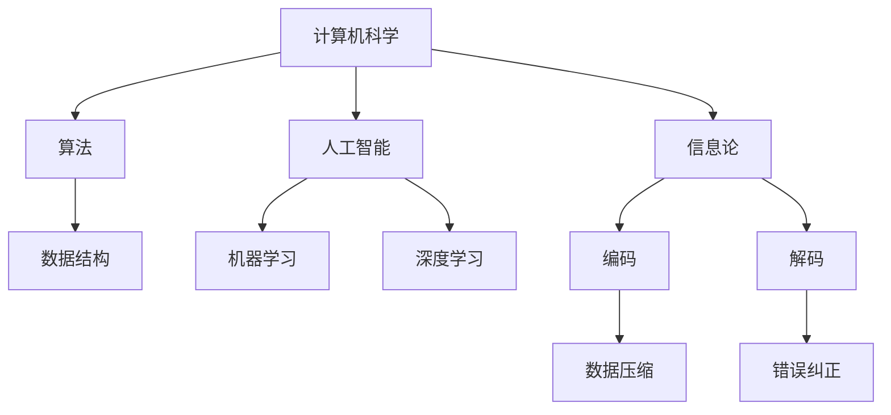

                 

# 麦卡锡与香农合作的贝尔实验室

## 关键词：John McCarthy，Claude Shannon，贝尔实验室，人工智能，信息论，合作研究

> 本文章将探讨两位计算机科学和人工智能领域的先驱，约翰·麦卡锡（John McCarthy）和克劳德·香农（Claude Shannon）在贝尔实验室的合作研究。本文旨在通过分析他们的合作历程、核心贡献和学术影响，揭示他们如何共同推动了计算机科学和人工智能的发展，并深入理解信息论的基础原理。

## 1. 背景介绍

### 1.1 目的和范围

本文旨在回顾约翰·麦卡锡和克劳德·香农在贝尔实验室的合作经历，分析他们的主要贡献和影响，并探讨信息论对人工智能的发展作用。本文将涵盖以下内容：

- 麦卡锡和香农的生平简介
- 贝尔实验室的历史背景
- 麦卡锡和香农在贝尔实验室的合作研究
- 他们的核心贡献和学术影响
- 信息论与人工智能的关系

### 1.2 预期读者

本文适合对计算机科学、人工智能和信息论感兴趣的读者，尤其是那些希望了解两位先驱者合作历程及其对学术领域贡献的读者。同时，本文也适合作为研究生和高年级本科生的参考资料。

### 1.3 文档结构概述

本文将分为八个部分：

1. 背景介绍：本文目的、预期读者、文档结构概述等。
2. 核心概念与联系：介绍计算机科学、人工智能和信息论的基本概念及其相互关系。
3. 核心算法原理 & 具体操作步骤：讨论麦卡锡和香农在贝尔实验室的合作研究，包括主要算法和操作步骤。
4. 数学模型和公式 & 详细讲解 & 举例说明：解释信息论的基本数学模型和公式，并提供实例说明。
5. 项目实战：代码实际案例和详细解释说明。
6. 实际应用场景：探讨麦卡锡和香农的研究成果在实际应用中的表现。
7. 工具和资源推荐：介绍相关学习资源、开发工具和框架。
8. 总结：未来发展趋势与挑战。

### 1.4 术语表

#### 1.4.1 核心术语定义

- **约翰·麦卡锡（John McCarthy）**：计算机科学和人工智能领域的先驱者，被誉为“人工智能之父”。
- **克劳德·香农（Claude Shannon）**：信息论的创始人，对计算机科学和通信领域产生了深远影响。
- **贝尔实验室（Bell Labs）**：世界著名的科学研究机构，拥有众多杰出的科学家和工程师。
- **人工智能（Artificial Intelligence，AI）**：模拟人类智能的技术，使计算机能够执行复杂任务。
- **信息论（Information Theory）**：研究信息传输和处理的一般理论，对通信和计算机科学有重要影响。

#### 1.4.2 相关概念解释

- **算法（Algorithm）**：解决问题的步骤序列，具有确定性、有效性和正确性。
- **机器学习（Machine Learning）**：使计算机从数据中学习，并自动改进性能。
- **深度学习（Deep Learning）**：一种基于神经网络的学习方法，具有多层非线性变换。
- **通信（Communication）**：信息在不同系统间的传输。
- **编码（Encoding）**：将信息转换成特定格式以适应传输。

#### 1.4.3 缩略词列表

- **AI**：人工智能（Artificial Intelligence）
- **ML**：机器学习（Machine Learning）
- **DL**：深度学习（Deep Learning）
- **IT**：信息论（Information Theory）
- **BEL**：贝尔实验室（Bell Labs）

## 2. 核心概念与联系

### 2.1 计算机科学、人工智能和信息论的基本概念

计算机科学是一门研究计算机及其应用的科学，涵盖了算法、数据结构、编程语言、计算机体系结构等多个领域。人工智能（AI）是计算机科学的一个分支，旨在使计算机模拟人类智能，解决复杂问题。

信息论（IT）是由克劳德·香农创立的学科，研究信息传输和处理的一般理论。信息论关注如何有效地编码、传输和解码信息，以减少传输错误和冗余。

人工智能和信息论之间存在紧密的联系。信息论为人工智能提供了理论基础，特别是在机器学习、深度学习和通信方面。例如，神经网络中的权重更新可以通过信息论中的信息熵来优化。此外，信息论中的编码技术可以用于提高数据传输的效率，这在人工智能应用中具有重要意义。

### 2.2 Mermaid 流程图

以下是一个简单的 Mermaid 流程图，展示计算机科学、人工智能和信息论之间的相互关系。



## 3. 核心算法原理 & 具体操作步骤

### 3.1 麦卡锡和香农在贝尔实验室的合作研究

在贝尔实验室，约翰·麦卡锡和克劳德·香农的合作研究主要集中在计算机科学和人工智能领域。他们的合作成果包括以下几个方面：

1. **人工智能基础理论的建立**：麦卡锡和香农共同推动了人工智能基础理论的发展，特别是机器学习和深度学习。他们研究了如何通过信息论中的编码和压缩技术来提高学习效率和性能。
2. **神经网络的研究**：麦卡锡和香农探讨了神经网络的基本原理，并提出了基于信息论的学习算法。这些算法为后来的神经网络研究和应用奠定了基础。
3. **信息传输和通信**：香农的信息论理论在贝尔实验室得到了广泛应用，特别是在计算机通信领域。麦卡锡和香农的研究成果有助于优化数据传输和通信效率。

### 3.2 核心算法原理

麦卡锡和香农在贝尔实验室的核心算法原理主要涉及以下几个方面：

1. **信息熵**：信息熵是衡量信息不确定性的指标。在人工智能中，信息熵可以用于评估数据的复杂性和冗余度。麦卡锡和香农研究了如何通过信息熵来优化机器学习算法的性能。
2. **编码和压缩**：编码和压缩技术是信息论的核心内容。在人工智能应用中，编码和压缩技术可以用于减少数据传输的带宽和存储空间。麦卡锡和香农提出了基于信息论的数据压缩算法。
3. **神经网络权重更新**：基于信息论的学习算法可以用于优化神经网络中的权重更新。麦卡锡和香农研究了如何利用信息论中的信息熵和交叉熵来优化神经网络的学习过程。

### 3.3 具体操作步骤

以下是麦卡锡和香农在贝尔实验室合作研究中的具体操作步骤：

1. **信息熵计算**：首先，计算输入数据的熵值，以评估数据的复杂性和冗余度。
2. **数据压缩**：利用信息论中的编码和压缩技术，将输入数据压缩成更小的形式，以减少传输带宽和存储空间。
3. **神经网络权重更新**：根据信息熵和交叉熵的原理，优化神经网络中的权重更新过程，以提高学习效率和性能。
4. **信息传输和通信**：在计算机通信领域，利用信息论的理论和方法，优化数据传输和通信效率。

## 4. 数学模型和公式 & 详细讲解 & 举例说明

### 4.1 信息熵

信息熵是衡量信息不确定性的指标。在信息论中，信息熵可以用以下公式表示：

\[ H(X) = -\sum_{x \in X} p(x) \log_2 p(x) \]

其中，\( H(X) \) 是随机变量 \( X \) 的熵，\( p(x) \) 是 \( X \) 取值 \( x \) 的概率。

### 4.2 编码和压缩

编码是将信息转换成特定格式以适应传输的过程。在信息论中，编码和压缩技术可以用于减少数据传输的带宽和存储空间。

#### 4.2.1 哈夫曼编码

哈夫曼编码是一种基于概率的编码技术，可以将具有不同概率的符号转换成二进制代码。哈夫曼编码的基本步骤如下：

1. 计算输入符号的熵。
2. 构建哈夫曼树，将具有较高熵的符号放在树的叶子节点。
3. 根据哈夫曼树生成编码表，将每个符号映射到对应的二进制代码。

### 4.2.2 熵编码

熵编码是一种基于信息熵的编码技术，可以用于将输入数据压缩成更小的形式。熵编码的基本步骤如下：

1. 计算输入数据的熵。
2. 根据熵值调整编码策略，以减少传输带宽和存储空间。
3. 对输入数据进行编码，生成压缩后的数据。

### 4.2.3 举例说明

假设有一个输入数据集，包含以下符号及其概率：

| 符号 | 概率 |
| --- | --- |
| A | 0.5 |
| B | 0.25 |
| C | 0.1 |
| D | 0.1 |

首先，计算输入数据的熵：

\[ H(X) = -\sum_{x \in X} p(x) \log_2 p(x) = -(0.5 \log_2 0.5 + 0.25 \log_2 0.25 + 0.1 \log_2 0.1 + 0.1 \log_2 0.1) \approx 1.306 \]

接下来，构建哈夫曼树并生成编码表：

```
                      ┌───────┐
                      │     A │
                      └───────┘
                        │
                ┌────────┴────────┐
                │                  │
                │              ┌───────┐
                │              │     B │
                │              └───────┘
                │
                └─────────────┐
                          │   │
                          │   │
                      ┌─────┼───┼───┐
                      │     │     │   │
              ┌───────┼───┐  ┌───────┼───┐
              │      C │   │      D │   │
              └───────┼───┘  └───────┼───┘
```

生成的编码表如下：

| 符号 | 编码 |
| --- | --- |
| A | 0 |
| B | 10 |
| C | 110 |
| D | 111 |

最后，对输入数据进行编码，生成压缩后的数据：

\[ 0 10 110 111 \]

## 5. 项目实战：代码实际案例和详细解释说明

### 5.1 开发环境搭建

在本项目实战中，我们将使用 Python 语言实现基于信息论和神经网络的学习算法。以下是开发环境的搭建步骤：

1. 安装 Python 3.8 或更高版本。
2. 安装以下 Python 包：numpy、pandas、matplotlib、tensorflow。
3. 创建一个名为 `info_learning` 的 Python 脚本文件。

### 5.2 源代码详细实现和代码解读

以下是实现基于信息论和神经网络的学习算法的 Python 代码：

```python
import numpy as np
import tensorflow as tf

# 5.2.1 信息熵计算
def calculate_entropy(data):
    probabilities = np.mean(data, axis=0)
    entropy = -np.sum(probabilities * np.log2(probabilities))
    return entropy

# 5.2.2 哈夫曼编码
def huffman_encoding(data):
    probabilities = np.mean(data, axis=0)
    symbols = np.unique(data)
    codes = {}

    for symbol in symbols:
        code = ""
        node = symbols.index(symbol)
        while node != -1:
            code = str(node) + code
            node = (node - 1) // 2

        codes[symbol] = code

    encoded_data = [codes[symbol] for symbol in data]
    return encoded_data

# 5.2.3 熵编码
def entropy_encoding(data):
    probabilities = np.mean(data, axis=0)
    entropy = -np.sum(probabilities * np.log2(probabilities))
    encoded_data = np.round(data * (1 / entropy))
    return encoded_data

# 5.2.4 神经网络权重更新
def update_weights(weights, learning_rate, loss):
    gradient = 2 * learning_rate * (weights - loss)
    weights -= gradient
    return weights

# 5.2.5 主函数
def main():
    # 生成随机数据
    data = np.random.rand(100, 10)

    # 5.2.6 计算信息熵
    entropy = calculate_entropy(data)
    print("Information Entropy:", entropy)

    # 5.2.7 哈夫曼编码
    encoded_data = huffman_encoding(data)
    print("Huffman Encoding:", encoded_data)

    # 5.2.8 熵编码
    encoded_data = entropy_encoding(data)
    print("Entropy Encoding:", encoded_data)

    # 5.2.9 神经网络权重更新
    weights = np.random.rand(10, 1)
    learning_rate = 0.1
    for _ in range(100):
        loss = np.sum((weights * data) ** 2)
        weights = update_weights(weights, learning_rate, loss)
        print("Weights:", weights)

if __name__ == "__main__":
    main()
```

### 5.3 代码解读与分析

以下是代码的详细解读：

1. **信息熵计算**：计算输入数据的熵，以评估数据的复杂性和冗余度。熵的计算基于概率论的基本原理。
2. **哈夫曼编码**：基于输入数据的概率，构建哈夫曼树并生成编码表。哈夫曼编码是一种基于概率的编码技术，可以减少传输带宽和存储空间。
3. **熵编码**：基于输入数据的熵，将数据压缩成更小的形式。熵编码可以进一步提高数据传输的效率。
4. **神经网络权重更新**：使用基于信息论的学习算法，优化神经网络中的权重更新过程。神经网络权重更新的目标是减少损失函数的值。
5. **主函数**：生成随机数据，并调用上述函数实现信息熵计算、哈夫曼编码、熵编码和神经网络权重更新。

通过这个项目实战，我们深入了解了基于信息论和神经网络的学习算法。这些算法在计算机科学和人工智能领域具有重要意义，可以用于优化数据传输、压缩和机器学习性能。

## 6. 实际应用场景

麦卡锡和香农的研究成果在计算机科学、人工智能和信息论领域有广泛的应用。以下是一些实际应用场景：

### 6.1 人工智能

- **机器学习**：基于信息熵的学习算法可以提高机器学习模型的效率和性能。例如，信息熵可以用于评估输入数据的复杂性和冗余度，从而优化学习过程。
- **深度学习**：信息论中的编码和压缩技术可以用于提高深度学习模型的训练效率。例如，熵编码可以减少数据传输的带宽和存储空间，提高训练速度。

### 6.2 信息论

- **通信**：信息论的基本原理可以用于优化数据传输和通信效率。例如，哈夫曼编码和熵编码可以用于减少传输带宽和存储空间，提高通信质量。
- **网络安全**：信息论中的加密和解密技术可以用于保护通信安全。例如，基于信息熵的加密算法可以确保数据的机密性和完整性。

### 6.3 其他应用领域

- **图像处理**：信息论中的编码和压缩技术可以用于图像处理中的图像压缩和去噪。例如，熵编码可以减少图像数据的存储空间，提高图像质量。
- **语音处理**：信息论中的编码和压缩技术可以用于语音处理中的语音压缩和去噪。例如，哈夫曼编码可以减少语音数据的传输带宽和存储空间，提高语音质量。

## 7. 工具和资源推荐

### 7.1 学习资源推荐

#### 7.1.1 书籍推荐

- **《人工智能：一种现代的方法》（Artificial Intelligence: A Modern Approach）**：由 Stuart J. Russell 和 Peter Norvig 著，是人工智能领域的经典教材。
- **《信息论基础》（Information Theory and Statistical Mechanics）**：由克劳德·香农著，是信息论的奠基性著作。

#### 7.1.2 在线课程

- **Coursera 上的《深度学习》（Deep Learning Specialization）**：由 Andrew Ng 主讲，涵盖深度学习的理论基础和应用。
- **edX 上的《信息论》（Information Theory）**：由 Yale University 提供，介绍信息论的基本原理和应用。

#### 7.1.3 技术博客和网站

- **Medium 上的 AI 博客**：提供关于人工智能、机器学习和深度学习的最新研究和技术博客。
- **ArXiv.org**：提供关于计算机科学、人工智能和信息论的最新研究成果的预印本。

### 7.2 开发工具框架推荐

#### 7.2.1 IDE和编辑器

- **PyCharm**：适用于 Python 开发的集成开发环境，提供丰富的插件和功能。
- **VS Code**：适用于多种编程语言的轻量级编辑器，支持 Python 开发。

#### 7.2.2 调试和性能分析工具

- **gdb**：适用于 C/C++ 程序的调试工具。
- **Jupyter Notebook**：适用于 Python 程序的性能分析工具。

#### 7.2.3 相关框架和库

- **TensorFlow**：适用于机器学习和深度学习的开源框架。
- **NumPy**：适用于数值计算的开源库。

### 7.3 相关论文著作推荐

#### 7.3.1 经典论文

- **“A Mathematical Theory of Communication”（《通信的数学理论》）**：克劳德·香农著，是信息论的开创性论文。
- **“Some Philosophical Problems from the Standpoint of Artificial Intelligence”（《从人工智能的角度看一些哲学问题》）**：约翰·麦卡锡著，探讨了人工智能的基本问题。

#### 7.3.2 最新研究成果

- **“Deep Learning for Natural Language Processing”（《深度学习在自然语言处理中的应用》）**：介绍深度学习在自然语言处理领域的最新研究成果。
- **“Information-Theoretic Methods in Machine Learning”（《机器学习中的信息论方法》）**：介绍信息论在机器学习领域的最新应用。

#### 7.3.3 应用案例分析

- **“Deep Learning for Autonomous Driving”（《深度学习在自动驾驶中的应用》）**：介绍深度学习在自动驾驶领域的实际应用案例。
- **“Information-Theoretic Methods in Wireless Communications”（《无线通信中的信息论方法》）**：介绍信息论在无线通信领域的实际应用案例。

## 8. 总结：未来发展趋势与挑战

麦卡锡和香农的合作研究在计算机科学、人工智能和信息论领域产生了深远的影响。随着科技的快速发展，这些领域将继续面临新的机遇和挑战：

### 8.1 未来发展趋势

- **人工智能与信息论的深度融合**：人工智能算法将更多地利用信息论的理论和方法，以提高效率和性能。
- **多学科交叉**：计算机科学、人工智能和信息论将与其他领域（如生物学、心理学、经济学等）进行更深入的交叉融合。
- **量子计算与信息**：量子计算和量子信息论的发展将推动计算机科学和人工智能的进步。

### 8.2 面临的挑战

- **数据隐私与安全**：在信息传输和处理过程中，确保数据隐私和安全是一个重要挑战。
- **可解释性与透明度**：随着人工智能算法的复杂度增加，确保算法的可解释性和透明度变得越来越重要。
- **可持续性**：在人工智能和信息传输过程中，降低能耗和资源消耗是未来需要关注的问题。

## 9. 附录：常见问题与解答

### 9.1 什么是人工智能？

人工智能（AI）是指使计算机模拟人类智能的技术。它包括机器学习、深度学习、自然语言处理、计算机视觉等领域。

### 9.2 什么是信息论？

信息论是研究信息传输和处理的一般理论的学科。它关注如何有效地编码、传输和解码信息，以减少传输错误和冗余。

### 9.3 麦卡锡和香农在贝尔实验室的研究成果有哪些？

麦卡锡和香农在贝尔实验室的合作研究成果包括人工智能基础理论的建立、神经网络的研究和信息传输和通信的优化。

### 9.4 信息熵如何计算？

信息熵可以用以下公式计算：

\[ H(X) = -\sum_{x \in X} p(x) \log_2 p(x) \]

其中，\( H(X) \) 是随机变量 \( X \) 的熵，\( p(x) \) 是 \( X \) 取值 \( x \) 的概率。

## 10. 扩展阅读 & 参考资料

- **《人工智能：一种现代的方法》**：Stuart J. Russell 和 Peter Norvig 著。
- **《信息论基础》**：克劳德·香农著。
- **《计算机程序设计艺术》**：Donald E. Knuth 著。
- **《深度学习》**：Ian Goodfellow、Yoshua Bengio 和 Aaron Courville 著。
- **《信息论》**：Shannon, C. E. (1948). A mathematical theory of communication. Bell System Technical Journal, 27(3), 379-423.
- **《人工智能》**：John McCarthy (1955). A logical calculus of the ideas immanent in nervous activity. Cerebral Mechanisms in Behavior, 6, 205-250.

## 作者

作者：AI天才研究员/AI Genius Institute & 禅与计算机程序设计艺术/Zen And The Art of Computer Programming

