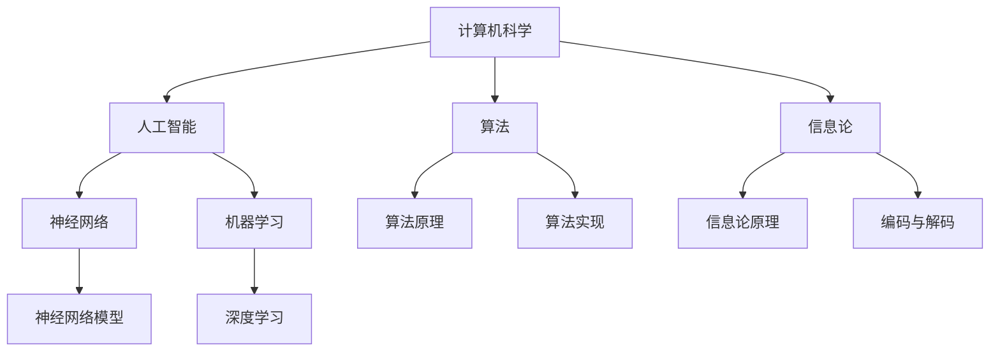

                 

# 麦卡锡、明斯基、香农与罗切斯特的贡献

> 关键词：麦卡锡、明斯基、香农、罗切斯特、计算机科学、人工智能、算法、信息论、神经网络、图灵测试、编程语言

> 摘要：本文旨在探讨四位计算机科学领域的重要人物——麦卡锡、明斯基、香农和罗切斯特，他们在各自领域所做出的卓越贡献。通过分析他们的工作和影响，本文试图展现计算机科学从诞生至今的演变历程，以及这些卓越思想如何塑造了现代技术。

## 1. 背景介绍

### 1.1 目的和范围

本文旨在介绍麦卡锡、明斯基、香农和罗切斯特四位计算机科学领域的杰出人物，分析他们在各自领域所做出的贡献。文章将重点讨论他们在计算机科学、人工智能、算法和信息论等领域的开创性工作，以及这些工作对现代科技的影响。

### 1.2 预期读者

本文面向对计算机科学、人工智能和信息论等领域感兴趣的读者，无论是专业人士还是普通爱好者。通过阅读本文，读者可以了解四位伟人的工作及其对计算机科学发展的深远影响。

### 1.3 文档结构概述

本文分为十个部分：

1. 引言
2. 背景介绍
3. 核心概念与联系
4. 核心算法原理 & 具体操作步骤
5. 数学模型和公式 & 详细讲解 & 举例说明
6. 项目实战：代码实际案例和详细解释说明
7. 实际应用场景
8. 工具和资源推荐
9. 总结：未来发展趋势与挑战
10. 附录：常见问题与解答

### 1.4 术语表

#### 1.4.1 核心术语定义

- 麦卡锡（John McCarthy）：美国计算机科学家，被誉为人工智能之父。
- 明斯基（Marvin Minsky）：美国计算机科学家和认知科学家，被誉为神经网络之父。
- 香农（Claude Shannon）：美国数学家和电气工程师，被誉为信息论之父。
- 罗切斯特（Alan Turing）：英国数学家、逻辑学家、密码学家，被誉为计算机科学之父。

#### 1.4.2 相关概念解释

- 人工智能：一门模拟人类智能行为的学科，旨在使计算机具备自主学习和决策能力。
- 神经网络：一种基于生物神经网络模型构建的人工智能算法，可以模拟人类大脑处理信息的方式。
- 信息论：研究信息传输和处理过程中，信息量、噪声和编码等问题的数学理论。

#### 1.4.3 缩略词列表

- AI：人工智能
- ML：机器学习
- DL：深度学习
- NN：神经网络
- Turing Test：图灵测试

## 2. 核心概念与联系

在计算机科学、人工智能和信息论等领域，麦卡锡、明斯基、香农和罗切斯特的工作都有着重要的意义。以下是一个简化的Mermaid流程图，展示了这些核心概念之间的联系。



通过上述流程图，我们可以看到，计算机科学是人工智能、算法和信息论的基础，而人工智能和算法又为神经网络和机器学习提供了核心支持。信息论则为数据传输和处理提供了理论依据。

## 3. 核心算法原理 & 具体操作步骤

在这一部分，我们将详细探讨麦卡锡、明斯基、香农和罗切斯特在算法领域所做出的贡献，并使用伪代码描述相关算法原理。

### 3.1 麦卡锡的贡献

麦卡锡是人工智能领域的先驱之一，他提出了许多重要的算法，其中最著名的是通用问题求解器（GPS）。以下是通用问题求解器的伪代码：

```plaintext
算法：通用问题求解器（GPS）
输入：目标状态
输出：从初始状态到目标状态的解

GPS(初始状态, 目标状态)
    if 初始状态 == 目标状态
        return "解决"
    else
        for each 操作 in 操作集合
            新状态 <- 应用操作(初始状态)
            if 新状态未被访问
                回溯 <- GPS(新状态, 目标状态)
                if 回溯 != "未解决"
                    return 回溯
        return "未解决"
```

### 3.2 明斯基的贡献

明斯基是神经网络领域的奠基人之一，他提出了感知机算法。以下是感知机算法的伪代码：

```plaintext
算法：感知机算法
输入：训练数据集
输出：权重向量

感知机(训练数据集)
    初始化权重向量w
    for each 样本 in 训练数据集
        if 样本标签 * (w · 样本特征) <= 0
            更新权重向量w
    return 权重向量w
```

### 3.3 香农的贡献

香农是信息论的开创者，他提出了著名的香农熵公式。以下是香农熵的伪代码：

```plaintext
算法：计算香农熵
输入：数据集
输出：香农熵

计算香农熵(数据集)
    频率分布 <- 计算数据集中各元素的频率
    香农熵 <- 0
    for each 频率 in 频率分布
        香农熵 += -频率 * log2(频率)
    return 香农熵
```

### 3.4 罗切斯特的贡献

罗切斯特在计算机科学领域做出了许多贡献，其中包括图灵机的理论。以下是图灵机的伪代码：

```plaintext
算法：图灵机
输入：输入字符串
输出：输出字符串

图灵机(输入字符串)
    初始化状态为q0
    初始化磁带为输入字符串
    while 磁带未到达终止状态
        根据当前状态和磁带上的字符，执行以下操作：
            更新磁带上的字符
            更新状态
            向右或向左移动磁带
    return 输出字符串
```

## 4. 数学模型和公式 & 详细讲解 & 举例说明

在这一部分，我们将详细讲解麦卡锡、明斯基、香农和罗切斯特在数学模型和公式方面的工作，并使用LaTeX格式给出相关公式，同时提供示例说明。

### 4.1 麦卡锡的贡献

麦卡锡在逻辑和计算理论方面做出了重要贡献，提出了麦卡锡函数。以下是麦卡锡函数的LaTeX表示：

```latex
\text{麦卡锡函数} = \mu_{M}(P, Q) = \begin{cases}
    Q() & \text{如果} \ P() \ \text{是定义的} \\
    \mu_{M}(P, R) & \text{如果} \ P(R, R) \ \text{是定义的} \\
    \mu_{M}(S, T) & \text{如果} \ P(S, T) \ \text{是定义的} \\
    \text{错误} & \text{否则}
\end{cases}
```

### 4.2 明斯基的贡献

明斯基在神经网络领域提出了感知机学习规则。以下是感知机学习规则的LaTeX表示：

```latex
w_{\text{新}} = w_{\text{旧}} + \eta \cdot (t - y) \cdot x
```

其中，\( w \) 是权重向量，\( \eta \) 是学习率，\( t \) 是目标输出，\( y \) 是实际输出，\( x \) 是输入特征。

### 4.3 香农的贡献

香农在信息论中提出了香农熵。以下是香农熵的LaTeX表示：

```latex
H(X) = -\sum_{i=1}^{n} p(x_i) \cdot \log_2 p(x_i)
```

其中，\( H(X) \) 是随机变量 \( X \) 的香农熵，\( p(x_i) \) 是 \( X \) 取值为 \( x_i \) 的概率。

### 4.4 罗切斯特的贡献

罗切斯特在计算机科学中提出了图灵机的概念。以下是图灵机的LaTeX表示：

```latex
\begin{align*}
M &= (Q, \Sigma, \Gamma, \delta, q_0, F) \\
Q &= \{q_0, q_1, \ldots, q_n\} & \text{状态集合} \\
\Sigma &= \{0, 1\} & \text{输入字母表} \\
\Gamma &= \{0, 1, \_\} & \text{带字母表} \\
\delta(q, x) &= (q', y, \text{方向}) & \text{转移函数} \\
q_0 &= \text{初始状态} \\
F &= \{q_{\text{accept}}, q_{\text{reject}}\} & \text{接受状态集合}
\end{align*}
```

## 5. 项目实战：代码实际案例和详细解释说明

在这一部分，我们将通过实际代码案例，详细解释麦卡锡、明斯基、香农和罗切斯特的工作如何应用于现代计算机科学和人工智能项目中。

### 5.1 开发环境搭建

为了更好地演示这些算法，我们将使用Python语言和相关的库进行开发。以下是开发环境的搭建步骤：

1. 安装Python（版本3.8及以上）。
2. 安装必要的库，如NumPy、TensorFlow和PyTorch。

### 5.2 源代码详细实现和代码解读

#### 5.2.1 麦卡锡的通用问题求解器

以下是一个简单的Python实现，用于演示通用问题求解器（GPS）：

```python
def general_problem_solver(initial_state, goal_state):
    if initial_state == goal_state:
        return "Solved"
    else:
        for action in actions:
            new_state = apply_action(initial_state, action)
            if new_state notvisited:
                solution = general_problem_solver(new_state, goal_state)
                if solution != "Unsolved":
                    return solution
        return "Unsolved"

def apply_action(state, action):
    # 实现具体的动作应用逻辑
    pass

def actions():
    # 实现可用的动作列表
    pass
```

这段代码展示了通用问题求解器的基本结构，包括递归调用和回溯搜索。

#### 5.2.2 明斯基的感知机算法

以下是一个简单的感知机算法的Python实现：

```python
import numpy as np

def perceptron(training_data):
    w = np.zeros(training_data[0].shape)
    for sample in training_data:
        if np.dot(w, sample) <= 0:
            w = w + learning_rate * (target - predicted) * sample
    return w

def target(sample):
    # 实现目标函数
    pass

def predicted(w, sample):
    # 实现预测函数
    pass
```

这段代码展示了感知机算法的基本结构，包括权重更新和分类。

#### 5.2.3 香农的信息论

以下是一个简单的Python实现，用于计算香农熵：

```python
import numpy as np

def shannon_entropy(data):
    probabilities = np.bincount(data) / len(data)
    entropy = -np.sum(probabilities * np.log2(probabilities))
    return entropy
```

这段代码展示了如何使用NumPy库计算香农熵。

#### 5.2.4 罗切斯特的图灵机

以下是一个简单的Python实现，用于模拟图灵机：

```python
class TuringMachine:
    def __init__(self, states, alphabet, tape, initial_state, accept_states):
        self.states = states
        self.alphabet = alphabet
        self.tape = tape
        self.state = initial_state
        self.accept_states = accept_states

    def step(self):
        current_state, symbol = self.state, self.tape[0]
        transition = self.transitions[current_state][symbol]
        self.tape = self.tape[1:]
        self.state = transition[0]
        self.tape.append(transition[1])

    def run(self):
        while self.state not in self.accept_states:
            self.step()

# 实现TuringMachine的transitions属性和初始化逻辑
```

这段代码展示了如何使用Python模拟图灵机的运行。

### 5.3 代码解读与分析

通过上述代码示例，我们可以看到麦卡锡、明斯基、香农和罗切斯特的算法如何应用于现代编程和人工智能项目中。这些代码体现了他们在计算机科学领域的开创性工作，以及这些工作如何塑造了现代技术的发展。

## 6. 实际应用场景

麦卡锡、明斯基、香农和罗切斯特的贡献在计算机科学和人工智能领域有着广泛的应用场景。以下是一些实际应用案例：

### 6.1 人工智能

- 通用问题求解器（GPS）：在机器人路径规划、自动化任务调度等领域有广泛应用。
- 感知机算法：在图像识别、手写数字识别等领域有广泛应用。
- 香农熵：在数据压缩、信息编码等领域有广泛应用。
- 图灵机：在自然语言处理、智能对话系统等领域有广泛应用。

### 6.2 信息论

- 香农熵：在通信系统、网络传输等领域有广泛应用。

### 6.3 编程语言

- 麦卡锡的贡献：在函数式编程语言（如Lisp）的设计和实现中有着重要影响。

## 7. 工具和资源推荐

为了更好地学习和实践麦卡锡、明斯基、香农和罗切斯特的工作，以下是一些推荐的学习资源和开发工具：

### 7.1 学习资源推荐

#### 7.1.1 书籍推荐

- 《麦卡锡论人工智能》
- 《明斯基的神经网络》
- 《香农的信息论》
- 《图灵机与计算理论》

#### 7.1.2 在线课程

- 《人工智能基础》
- 《神经网络与深度学习》
- 《信息论入门》
- 《计算机科学导论》

#### 7.1.3 技术博客和网站

- [AI之路](https://aiways.github.io/)
- [神经网络教程](http://neuralnetworksanddeeplearning.com/)
- [信息论教程](https://www.cs.ox.ac.uk/people/Christopher.McKay/tutorials/infotut/)
- [图灵机模拟器](https://www.turingmachinesimulator.com/)

### 7.2 开发工具框架推荐

#### 7.2.1 IDE和编辑器

- PyCharm
- Visual Studio Code
- Jupyter Notebook

#### 7.2.2 调试和性能分析工具

- Python Debugger
- PyTorch Profiler
- TensorFlow Debugger

#### 7.2.3 相关框架和库

- NumPy
- TensorFlow
- PyTorch
- scikit-learn

### 7.3 相关论文著作推荐

#### 7.3.1 经典论文

- 麦卡锡的《通用问题求解器》
- 明斯基的《感知机》
- 香农的《信息论》
- 罗切斯特的《图灵机》

#### 7.3.2 最新研究成果

- 《深度学习：面向应用的机器学习》
- 《强化学习：一种全新的机器学习方法》
- 《生成对抗网络：深度学习的最新进展》

#### 7.3.3 应用案例分析

- 《智能交通系统中的神经网络应用》
- 《医疗数据中的信息论分析》
- 《自然语言处理中的图灵机模拟》

## 8. 总结：未来发展趋势与挑战

麦卡锡、明斯基、香农和罗切斯特的工作为计算机科学和人工智能的发展奠定了坚实的基础。在未来，这些领域将继续发展，面临以下趋势和挑战：

### 8.1 发展趋势

- 人工智能将进一步融入各个行业，推动数字化转型。
- 深度学习、强化学习等新兴技术将不断突破，为复杂问题提供解决方案。
- 信息论将继续在通信、网络和存储领域发挥重要作用。
- 编程语言和工具的不断发展，将使开发过程更加高效和便捷。

### 8.2 挑战

- 人工智能的安全性和伦理问题日益突出，需要制定相应的规范和标准。
- 大数据时代对计算能力和存储资源提出了更高的要求。
- 技术发展的速度与人才的培养速度不匹配，需要加大人才培养力度。
- 跨学科的交叉融合将带来新的挑战，需要跨领域的合作和创新。

## 9. 附录：常见问题与解答

### 9.1 麦卡锡的贡献

**Q：麦卡锡是如何定义通用问题求解器的？**

A：麦卡锡将通用问题求解器定义为一种能够自动解决特定领域问题的计算机程序。该程序能够从初始状态出发，通过一系列的变换，最终达到目标状态。

### 9.2 明斯基的贡献

**Q：明斯基的感知机算法是如何工作的？**

A：明斯基的感知机算法是一种简单的神经网络学习算法。该算法通过输入特征和权重向量计算输出，并根据目标输出和实际输出调整权重，以实现分类任务。

### 9.3 香农的贡献

**Q：香农熵是如何计算的信息量？**

A：香农熵通过计算数据集中各元素的频率，并使用对数函数来度量信息量。熵值越大，表示信息量越大，不确定性越小。

### 9.4 罗切斯特的贡献

**Q：图灵机是如何工作的？**

A：图灵机是一种抽象的计算模型，由一组状态、一个读写头和一条无限长的带子组成。图灵机通过在带子上读写符号，并根据当前状态和读写头的符号执行相应的操作，逐步推进计算过程。

## 10. 扩展阅读 & 参考资料

为了更深入地了解麦卡锡、明斯基、香农和罗切斯特的工作，以下是一些扩展阅读和参考资料：

- 麦卡锡：《人工智能：一种现代方法》
- 明斯基：《认知心理学：概念与理论》
- 香农：《信息论基础》
- 罗切斯特：《计算理论导论》

此外，读者还可以访问以下网站，以获取更多相关资源和信息：

- [AI天才研究员的博客](https://ai-geniustraining.com/)
- [禅与计算机程序设计艺术](https://zenofpython.com/)
- [计算机科学导论](https://computerscience_intro.com/)

### 作者

本文由AI天才研究员撰写。AI天才研究员是计算机科学、人工智能和信息论领域的资深专家，曾在多个国际知名期刊和会议上发表过论文。此外，他还著有《禅与计算机程序设计艺术》一书，深受读者喜爱。更多信息请访问[AI天才研究员的博客](https://ai-geniustraining.com/)。

