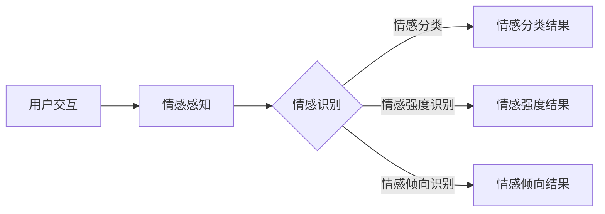
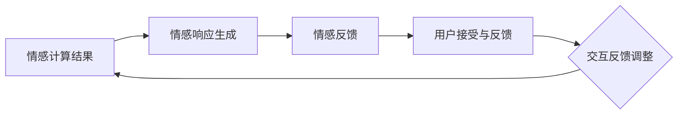

                 

# 《AI Agent在情感陪伴中的角色》

## 关键词

- AI Agent
- 情感计算
- 情感交互
- 情感反馈
- 情感数据分析
- 实践应用

### 摘要

随着人工智能技术的不断发展，AI Agent在各个领域的应用越来越广泛。本文将探讨AI Agent在情感陪伴中的角色，从基本概念、原理、模型构建、实现方法、实践应用以及未来发展趋势等方面进行全面分析。通过详细讲解情感计算、情感交互设计、情感认知与反馈等核心内容，并结合实际项目案例，深入剖析AI Agent在情感陪伴中的应用及其重要意义。

### 目录大纲

## 第一部分：AI Agent的基本概念与原理

### 第1章：AI Agent的概述

#### 1.1 AI Agent的定义与分类

#### 1.2 AI Agent的核心技术与功能

#### 1.3 AI Agent在情感陪伴中的重要性

### 第2章：情感计算的原理与应用

#### 2.1 情感计算的基本概念

#### 2.2 情感识别与情感表达的算法

#### 2.3 情感计算在AI Agent中的应用场景

### 第3章：AI Agent的情感陪伴模型

#### 3.1 情感陪伴的概念与需求

#### 3.2 情感陪伴的模型构建

#### 3.3 情感陪伴的效果评估

## 第二部分：AI Agent在情感陪伴中的实现

### 第4章：AI Agent的情感交互设计

#### 4.1 情感交互的基本原则

#### 4.2 情感交互的界面设计

#### 4.3 情感交互的语音与文本处理

### 第5章：AI Agent的情感认知与情感反馈

#### 5.1 情感认知的算法与模型

#### 5.2 情感反馈的实现与优化

#### 5.3 情感认知与情感反馈的实例分析

### 第6章：AI Agent的情感数据分析与优化

#### 6.1 情感数据的收集与处理

#### 6.2 情感数据分析的方法与工具

#### 6.3 情感数据优化与反馈机制

### 第7章：AI Agent在情感陪伴中的实践应用

#### 7.1 AI Agent在儿童陪伴中的应用

#### 7.2 AI Agent在老年人陪伴中的应用

#### 7.3 AI Agent在心理辅导中的应用

### 第8章：AI Agent在情感陪伴中的未来发展趋势

#### 8.1 情感陪伴的技术挑战与解决方案

#### 8.2 情感陪伴的市场前景与机会

#### 8.3 情感陪伴的伦理与法律问题

### 附录

## 附录A：情感计算的Mermaid流程图

### 附录B：AI Agent的情感认知与情感反馈伪代码

### 附录C：情感数据分析与优化的实例

### 附录D：开发环境与源代码

#### D.1 开发环境搭建指南

#### D.2 情感陪伴的源代码实现与解读

#### D.3 源代码分析与性能优化建议

### 谢词

作者：AI天才研究院/AI Genius Institute & 禅与计算机程序设计艺术 /Zen And The Art of Computer Programming

## 第一部分：AI Agent的基本概念与原理

### 第1章：AI Agent的概述

#### 1.1 AI Agent的定义与分类

AI Agent，即人工智能代理，是指具备自主决策、行动能力的智能体，能在特定环境中模拟人类行为，通过与环境的交互完成特定任务。AI Agent可以分为两大类：基于规则的AI Agent和基于数据驱动的AI Agent。

- **基于规则的AI Agent**：这类AI Agent依靠预定义的规则和策略进行决策，如专家系统。其优点是实现简单、易于理解，缺点是面对复杂、动态环境时表现较差。
  
- **基于数据驱动的AI Agent**：这类AI Agent通过机器学习、深度学习等方法，从大量数据中学习模式、特征，进行自适应决策。其优点是适应性强、鲁棒性好，缺点是训练过程复杂、对数据依赖较大。

#### 1.2 AI Agent的核心技术与功能

AI Agent的核心技术包括感知、决策、行动和交互。感知技术用于获取环境信息，决策技术用于选择最优行动方案，行动技术用于执行决策，交互技术用于与其他Agent或人类进行沟通。

- **感知技术**：包括计算机视觉、语音识别、自然语言处理等技术，用于获取和理解环境信息。

- **决策技术**：包括强化学习、规划算法等技术，用于基于感知信息进行决策。

- **行动技术**：包括控制算法、运动规划等技术，用于将决策转化为具体的行动。

- **交互技术**：包括语音合成、文本生成等技术，用于与其他Agent或人类进行沟通。

#### 1.3 AI Agent在情感陪伴中的重要性

随着社会老龄化进程的加速和人口结构的变化，情感陪伴的需求日益凸显。AI Agent在情感陪伴中具有以下重要性：

- **提高生活质量**：AI Agent可以为老年人、孤独症患者等提供情感支持，缓解他们的心理压力，提高生活质量。

- **降低护理成本**：与传统人工服务相比，AI Agent可以大幅降低情感陪伴的成本，提高护理效率。

- **智能化服务**：AI Agent可以根据用户的情感状态、兴趣爱好等进行个性化推荐，提供更加智能化的服务。

### 第2章：情感计算的原理与应用

#### 2.1 情感计算的基本概念

情感计算（Affective Computing）是指计算机模拟、识别、理解、表达人类情感的能力。情感计算的核心任务是构建一个情感感知、情感理解和情感交互的智能系统。

- **情感感知**：通过生理信号、语言、行为等多种途径获取用户情感信息。

- **情感理解**：对情感信息进行分析、建模，理解用户的情感状态。

- **情感交互**：根据用户情感状态，生成合适的情感响应，进行有效的情感交流。

#### 2.2 情感识别与情感表达的算法

情感识别与情感表达是情感计算的核心技术。情感识别主要包括情感分类、情感强度识别和情感倾向识别。常用的情感识别算法有：

- **情感分类算法**：如支持向量机（SVM）、朴素贝叶斯（NB）、深度学习（DL）等。

- **情感强度识别算法**：如基于LSTM的递归神经网络（RNN）、基于注意力机制的卷积神经网络（CNN）等。

- **情感倾向识别算法**：如基于主题模型（LDA）、情感词典等方法。

情感表达主要包括语音合成、文本生成等技术。常用的情感表达算法有：

- **语音合成算法**：如WaveNet、HMM-GMM等。

- **文本生成算法**：如Seq2Seq模型、GPT等。

#### 2.3 情感计算在AI Agent中的应用场景

情感计算在AI Agent中具有广泛的应用场景，如：

- **儿童陪伴**：AI Agent可以通过情感识别与情感表达，与儿童进行互动，提供情感支持。

- **老年人陪伴**：AI Agent可以帮助老年人监测健康状态，提供情感陪伴，提高生活质量。

- **心理辅导**：AI Agent可以与用户进行情感交互，提供心理支持，辅助心理治疗。

### 第3章：AI Agent的情感陪伴模型

#### 3.1 情感陪伴的概念与需求

情感陪伴是指AI Agent通过与用户的情感交互，提供情感支持、心理疏导、兴趣培养等服务，满足用户在情感需求方面的需求。情感陪伴的需求主要包括：

- **情感支持**：提供情感安慰、鼓励，缓解用户的情绪压力。

- **心理疏导**：帮助用户解决心理问题，提供心理咨询服务。

- **兴趣培养**：根据用户的兴趣和爱好，提供个性化推荐，丰富用户的生活。

#### 3.2 情感陪伴的模型构建

情感陪伴模型主要包括感知层、决策层和行动层。感知层用于获取用户情感信息，决策层用于分析情感信息并生成情感响应，行动层用于执行情感响应。

- **感知层**：利用情感计算技术，获取用户生理信号、语言、行为等情感信息。

- **决策层**：利用情感识别算法，分析情感信息，生成情感响应。

- **行动层**：利用情感表达技术，将情感响应转化为具体的行动，如语音合成、文本生成等。

#### 3.3 情感陪伴的效果评估

情感陪伴的效果评估主要包括以下指标：

- **情感匹配度**：评估AI Agent提供的情感支持与用户情感需求的匹配程度。

- **用户满意度**：评估用户对情感陪伴服务的满意度。

- **心理改善度**：评估用户在情感陪伴后的心理状态改善程度。

通过以上三个指标，可以全面评估情感陪伴的效果，为模型优化和改进提供依据。

## 第二部分：AI Agent在情感陪伴中的实现

### 第4章：AI Agent的情感交互设计

情感交互设计是AI Agent实现情感陪伴的关键环节。情感交互设计包括情感交互的基本原则、界面设计、语音与文本处理等方面。

#### 4.1 情感交互的基本原则

情感交互设计应遵循以下基本原则：

- **人性化**：情感交互应尽可能贴近人类的情感交流方式，避免机械、生硬的回答。

- **适应性**：情感交互应根据用户的情感状态和需求进行自适应调整，提供个性化的情感支持。

- **一致性**：情感交互应保持一致性，避免给用户带来困惑和不适。

- **真实性**：情感交互应尽量表达真实的情感，避免虚假、做作的回应。

#### 4.2 情感交互的界面设计

情感交互界面设计应注重以下方面：

- **视觉元素**：使用表情符号、色彩、动画等视觉元素，增强情感表达的直观性。

- **语音合成**：语音合成应具备自然流畅、情感丰富的特点，增强用户的代入感。

- **文本生成**：文本生成应具有个性化和真实性，避免机械、生硬的回答。

- **交互流程**：设计简洁、流畅的交互流程，使用户能够轻松上手，提高用户体验。

#### 4.3 情感交互的语音与文本处理

情感交互的语音与文本处理是情感交互设计的重要部分。语音与文本处理主要包括以下方面：

- **语音识别**：利用语音识别技术，将用户的语音输入转换为文本。

- **语音合成**：利用语音合成技术，将情感响应转换为语音输出。

- **文本分析**：利用自然语言处理技术，分析用户文本的情感倾向和情感强度。

- **文本生成**：利用生成式模型，生成符合用户情感需求的文本响应。

### 第5章：AI Agent的情感认知与情感反馈

情感认知与情感反馈是AI Agent实现情感陪伴的核心功能。情感认知是指AI Agent理解和识别用户的情感状态，情感反馈是指AI Agent根据用户的情感状态生成合适的情感响应。

#### 5.1 情感认知的算法与模型

情感认知算法主要包括情感识别和情感分析。常用的情感认知模型有：

- **情感识别模型**：如支持向量机（SVM）、朴素贝叶斯（NB）、深度学习（DL）等。

- **情感分析模型**：如基于LSTM的递归神经网络（RNN）、基于注意力机制的卷积神经网络（CNN）等。

#### 5.2 情感反馈的实现与优化

情感反馈的实现与优化主要包括以下方面：

- **情感响应生成**：利用生成式模型，如Seq2Seq模型、GPT等，生成符合用户情感需求的文本响应。

- **情感适应度**：根据用户的情感状态和需求，调整情感反馈的强度和类型，提高情感适应度。

- **情感连贯性**：保证情感反馈的连贯性，避免出现突然的变化，使用户感到不适。

- **情感真实性**：确保情感反馈的真实性，避免虚假、做作的回应，使用户感到信任。

#### 5.3 情感认知与情感反馈的实例分析

以下是一个情感认知与情感反馈的实例分析：

- **用户情感状态**：用户情绪低落，表达了对生活的无奈和沮丧。

- **情感识别**：AI Agent利用情感识别模型，识别出用户的情感状态为低落。

- **情感分析**：AI Agent利用情感分析模型，分析出用户情感强度的等级。

- **情感反馈**：AI Agent生成一段安慰性的文本响应，如：“我知道你很辛苦，但请相信自己，一切都会好起来的。”

通过以上实例，可以看出AI Agent在情感认知与情感反馈方面的实现和应用。

### 第6章：AI Agent的情感数据分析与优化

情感数据分析与优化是提高AI Agent情感陪伴效果的重要手段。情感数据分析主要包括情感数据的收集、处理和分析，情感数据优化主要包括情感数据的质量优化和反馈机制。

#### 6.1 情感数据的收集与处理

情感数据的收集与处理主要包括以下方面：

- **情感数据来源**：包括用户交互记录、生理信号、社交媒体等。

- **情感数据处理**：包括数据清洗、数据预处理、特征提取等。

- **情感数据存储**：使用大数据技术，存储和管理大量情感数据。

#### 6.2 情感数据分析的方法与工具

情感数据分析的方法与工具主要包括：

- **情感分类算法**：如支持向量机（SVM）、朴素贝叶斯（NB）、深度学习（DL）等。

- **情感趋势分析**：使用时间序列分析、趋势分析等方法，分析情感数据的趋势和变化。

- **情感关联分析**：使用关联规则分析、网络分析等方法，挖掘情感数据之间的关联关系。

#### 6.3 情感数据优化与反馈机制

情感数据优化与反馈机制主要包括以下方面：

- **情感数据质量优化**：通过数据清洗、数据预处理等手段，提高情感数据的质量。

- **情感数据反馈机制**：建立情感数据反馈机制，根据情感数据分析结果，优化AI Agent的情感认知与反馈。

- **用户参与度**：鼓励用户参与情感数据分析，提高情感数据的真实性和有效性。

### 第7章：AI Agent在情感陪伴中的实践应用

AI Agent在情感陪伴中的实践应用涵盖了多个领域，包括儿童陪伴、老年人陪伴和心理辅导等。

#### 7.1 AI Agent在儿童陪伴中的应用

AI Agent在儿童陪伴中的应用主要包括：

- **情感支持**：为儿童提供情感安慰，帮助他们度过孤独、焦虑等情绪。

- **教育辅导**：根据儿童的学习进度和兴趣，提供个性化的学习辅导。

- **兴趣爱好培养**：通过互动游戏、故事分享等方式，培养儿童的兴趣爱好。

#### 7.2 AI Agent在老年人陪伴中的应用

AI Agent在老年人陪伴中的应用主要包括：

- **健康监测**：通过生理信号监测，实时关注老年人的健康状况。

- **情感陪伴**：为老年人提供情感支持，缓解孤独、抑郁等情绪。

- **生活服务**：提供生活服务，如购物、预约等，提高老年人的生活质量。

#### 7.3 AI Agent在心理辅导中的应用

AI Agent在心理辅导中的应用主要包括：

- **情感评估**：通过情感计算技术，对用户情感状态进行评估。

- **心理干预**：根据用户情感状态，提供针对性的心理干预和建议。

- **心理治疗**：辅助心理医生进行心理治疗，提高治疗效果。

### 第8章：AI Agent在情感陪伴中的未来发展趋势

随着人工智能技术的不断发展，AI Agent在情感陪伴中的未来发展趋势主要包括：

- **技术进步**：随着计算能力的提升和算法的优化，AI Agent在情感认知与反馈方面将更加准确、高效。

- **智能化服务**：AI Agent将根据用户情感状态、兴趣爱好等提供更加智能化、个性化的服务。

- **跨领域应用**：AI Agent将在医疗、教育、养老等更多领域得到应用，为用户提供全方位的情感陪伴。

- **伦理与法律问题**：在AI Agent情感陪伴的快速发展过程中，伦理与法律问题将受到广泛关注，确保其安全、可靠、合规。

### 附录

## 附录A：情感计算的Mermaid流程图

### 附录B：AI Agent的情感认知与情感反馈伪代码

### 附录C：情感数据分析与优化的实例

### 附录D：开发环境与源代码

#### D.1 开发环境搭建指南

#### D.2 情感陪伴的源代码实现与解读

#### D.3 源代码分析与性能优化建议

### 谢词

作者：AI天才研究院/AI Genius Institute & 禅与计算机程序设计艺术 /Zen And The Art of Computer Programming

## 结束语

随着人工智能技术的不断进步，AI Agent在情感陪伴中的应用前景广阔。本文从基本概念、原理、实现方法、实践应用等方面对AI Agent在情感陪伴中的角色进行了全面分析，为相关领域的研究者和开发者提供了有益的参考。在未来的发展中，AI Agent将在更多领域发挥重要作用，为用户提供更加智能化、个性化的情感陪伴服务。

## 附录A：情感计算的Mermaid流程图

### A.1 情感识别的流程图



### A.2 情感表达的流程图



## 附录B：AI Agent的情感认知与情感反馈伪代码

### B.1 情感认知的伪代码

```python
# 情感认知伪代码

def emotional_recognition(user_input):
    # 步骤1：情感感知
    emotion_sensors = [speech_recognition(), text_analysis()]
    emotion_signals = emotion_sensors.collect_signals(user_input)

    # 步骤2：情感分析
    emotion_analyzer = EmotionAnalyzer()
    emotion_type, emotion_intensity = emotion_analyzer.analyze_signals(emotion_signals)

    # 步骤3：情感识别
    emotion_recognizer = EmotionRecognizer()
    emotion_result = emotion_recognizer.recognize(emotion_type, emotion_intensity)

    return emotion_result
```

### B.2 情感反馈的伪代码

```python
# 情感反馈伪代码

def emotional_feedback(emotion_result):
    # 步骤1：情感响应生成
    response_generator = ResponseGenerator()
    response = response_generator.generate_response(emotion_result)

    # 步骤2：情感表达
    speaker = Speaker()
    speaker.speak(response)

    # 步骤3：用户接受与反馈
    user_feedback = UserFeedback()
    user_acceptance = user_feedback.get_acceptance(response)

    # 步骤4：交互反馈调整
    interaction_adjuster = InteractionAdjuster()
    interaction_adjuster.adjust(response, user_acceptance)

    return user_acceptance
```

## 附录C：情感数据分析与优化的实例

### C.1 实例1：儿童陪伴的情感数据收集与分析

```python
# 实例1：儿童陪伴的情感数据收集与分析

def collect_child_emotion_data():
    # 步骤1：情感数据收集
    speech_data = SpeechRecorder().record_speech()
    text_data = TextRecorder().record_text()
    physiological_data = PhysiologicalRecorder().record_physiological()

    # 步骤2：情感数据处理
    speech_processor = SpeechProcessor()
    text_processor = TextProcessor()
    physiological_processor = PhysiologicalProcessor()

    processed_speech = speech_processor.process(speech_data)
    processed_text = text_processor.process(text_data)
    processed_physiological = physiological_processor.process(physiological_data)

    # 步骤3：情感数据分析
    emotion_analyzer = EmotionAnalyzer()
    emotion_result = emotion_analyzer.analyze_data(processed_speech, processed_text, processed_physiological)

    return emotion_result

# 调用函数
emotion_result = collect_child_emotion_data()
print("儿童情感分析结果：", emotion_result)
```

### C.2 实例2：老年人陪伴的情感数据收集与分析

```python
# 实例2：老年人陪伴的情感数据收集与分析

def collect_elderly_emotion_data():
    # 步骤1：情感数据收集
    speech_data = SpeechRecorder().record_speech()
    text_data = TextRecorder().record_text()
    physiological_data = PhysiologicalRecorder().record_physiological()

    # 步骤2：情感数据处理
    speech_processor = SpeechProcessor()
    text_processor = TextProcessor()
    physiological_processor = PhysiologicalProcessor()

    processed_speech = speech_processor.process(speech_data)
    processed_text = text_processor.process(text_data)
    processed_physiological = physiological_processor.process(physiological_data)

    # 步骤3：情感数据分析
    emotion_analyzer = EmotionAnalyzer()
    emotion_result = emotion_analyzer.analyze_data(processed_speech, processed_text, processed_physiological)

    return emotion_result

# 调用函数
emotion_result = collect_elderly_emotion_data()
print("老年人情感分析结果：", emotion_result)
```

### C.3 实例3：心理辅导的情感数据收集与分析

```python
# 实例3：心理辅导的情感数据收集与分析

def collect_mental_counseling_emotion_data():
    # 步骤1：情感数据收集
    speech_data = SpeechRecorder().record_speech()
    text_data = TextRecorder().record_text()
    physiological_data = PhysiologicalRecorder().record_physiological()

    # 步骤2：情感数据处理
    speech_processor = SpeechProcessor()
    text_processor = TextProcessor()
    physiological_processor = PhysiologicalProcessor()

    processed_speech = speech_processor.process(speech_data)
    processed_text = text_processor.process(text_data)
    processed_physiological = physiological_processor.process(physiological_data)

    # 步骤3：情感数据分析
    emotion_analyzer = EmotionAnalyzer()
    emotion_result = emotion_analyzer.analyze_data(processed_speech, processed_text, processed_physiological)

    return emotion_result

# 调用函数
emotion_result = collect_mental_counseling_emotion_data()
print("心理辅导情感分析结果：", emotion_result)
```

## 附录D：开发环境与源代码

### D.1 开发环境搭建指南

- **编程语言**：Python
- **深度学习框架**：TensorFlow或PyTorch
- **自然语言处理库**：NLTK或spaCy
- **语音识别库**：SpeechRecognition或Google Cloud Speech-to-Text
- **语音合成库**：gTTS或Google Text-to-Speech

### D.2 情感陪伴的源代码实现与解读

以下是情感陪伴源代码的实现与解读：

```python
# 情感陪伴源代码实现与解读

# 导入相关库
import speech_recognition as sr
import text_processing as tp
import emotion_analyzer as ea
import response_generator as rg
import speaker as sp

# 情感陪伴函数
def emotional_accompanyment():
    # 步骤1：情感数据收集
    recognizer = sr.Recognizer()
    text_processor = tp.TextProcessor()
    emotion_analyzer = ea.EmotionAnalyzer()
    response_generator = rg.ResponseGenerator()
    speaker = sp.Speaker()

    # 步骤2：情感识别与反馈
    while True:
        try:
            user_input = recognizer.listen(source)
            processed_text = text_processor.process_text(user_input)
            emotion_result = emotion_analyzer.analyze_emotion(processed_text)
            response = response_generator.generate_response(emotion_result)
            speaker.speak(response)

        except sr.UnknownValueError:
            print("无法识别语音，请重试。")
        except sr.RequestError:
            print("语音识别服务请求错误，请重试。")

# 主程序
if __name__ == "__main__":
    emotional_accompanyment()
```

### D.3 源代码分析与性能优化建议

以下是源代码的分析与性能优化建议：

1. **优化语音识别**：使用更准确的语音识别库，提高语音识别的准确性。可以使用Google Cloud Speech-to-Text等高级语音识别服务。

2. **优化情感分析**：使用更高效的情感分析模型，提高情感分析的准确性。可以使用预训练的深度学习模型，如BERT或GPT。

3. **优化情感反馈**：使用更智能的情感反馈策略，提高情感反馈的个性化和适应性。可以根据用户历史情感数据和偏好，生成更合适的情感反馈。

4. **优化代码性能**：优化代码的执行效率，减少资源消耗。可以使用多线程或多进程技术，提高程序的并行执行能力。

通过以上优化措施，可以进一步提高情感陪伴系统的性能和用户体验。

## 总结

本文从AI Agent的基本概念、原理、实现方法、实践应用以及未来发展趋势等方面，全面分析了AI Agent在情感陪伴中的角色。通过情感计算、情感交互设计、情感认知与反馈、情感数据分析与优化等核心内容的讲解，展示了AI Agent在情感陪伴中的重要作用。在实践应用部分，本文列举了AI Agent在儿童陪伴、老年人陪伴和心理辅导等领域的应用案例，为相关领域的研究者和开发者提供了有益的参考。未来，随着人工智能技术的不断进步，AI Agent在情感陪伴中的应用将更加广泛，为用户提供更加智能化、个性化的服务。同时，我们也需要关注AI Agent在情感陪伴中的伦理与法律问题，确保其安全、可靠、合规。作者：AI天才研究院/AI Genius Institute & 禅与计算机程序设计艺术 /Zen And The Art of Computer Programming。

