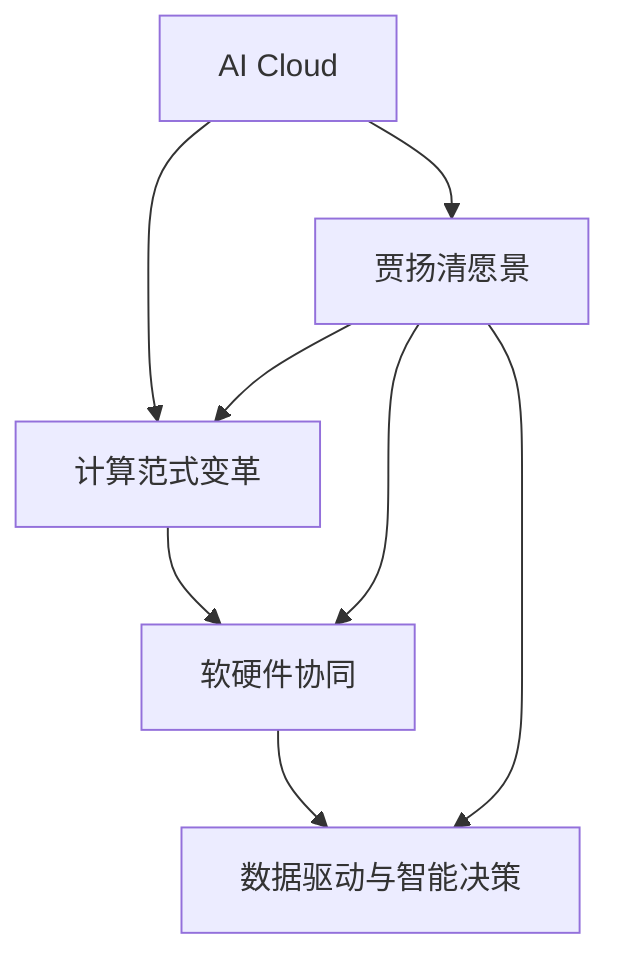
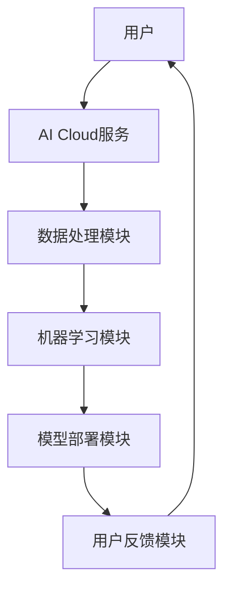
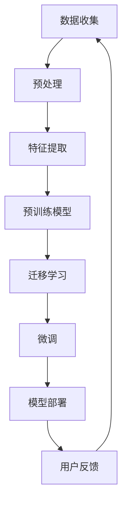

                 

### 《AI Cloud未来：贾扬清愿景，Lepton AI前景挑战》

**关键词**：
- AI Cloud
- 贾扬清
- Lepton AI
- 深度学习
- 计算范式变革
- 软硬件协同
- 数据驱动
- 智能决策
- 预训练模型
- 大规模预训练
- 人工智能安全与隐私
- 人工智能伦理

**摘要**：
本文将探讨AI Cloud的未来发展趋势，重点关注贾扬清对AI Cloud的愿景，以及Lepton AI在这一领域的前景与挑战。通过分析AI Cloud的概念与架构、贾扬清的愿景和Lepton AI的技术优势与挑战，本文旨在为读者提供一幅关于AI Cloud和Lepton AI的清晰蓝图，并探讨其未来可能带来的技术变革与社会影响。

### 《AI Cloud未来：贾扬清愿景，Lepton AI前景挑战》目录大纲

#### 第一部分：AI Cloud概述与贾扬清愿景

- **第1章：AI Cloud的概念与架构**
  - **1.1 AI Cloud的定义与背景**
  - **1.2 AI Cloud的核心架构**
  - **1.3 贾扬清的AI Cloud愿景**

- **第2章：贾扬清AI Cloud愿景的核心要素**
  - **2.1 计算范式变革**
  - **2.2 软硬件协同**
  - **2.3 数据驱动与智能决策**

#### 第二部分：Lepton AI的前景与挑战

- **第3章：Lepton AI概述**
  - **3.1 Lepton AI的起源与发展**
  - **3.2 Lepton AI的核心技术**
  - **3.3 Lepton AI的应用领域**

- **第4章：Lepton AI的优势与前景**
  - **4.1 Lepton AI在AI Cloud中的角色**
  - **4.2 Lepton AI的技术优势**
  - **4.3 Lepton AI的市场前景**

- **第5章：Lepton AI面临的挑战**
  - **5.1 技术挑战**
  - **5.2 安全与隐私问题**
  - **5.3 法律与伦理问题**

#### 第三部分：实践与展望

- **第6章：AI Cloud与Lepton AI的实践案例**
  - **6.1 智能医疗**
  - **6.2 智能制造**
  - **6.3 智能交通**

- **第7章：未来展望**
  - **7.1 AI Cloud与Lepton AI的未来发展趋势**
  - **7.2 技术创新与产业升级**
  - **7.3 社会影响与挑战**

#### 附录

- **附录A：AI Cloud与Lepton AI资源指南**
  - **A.1 开源框架与工具**
  - **A.2 研究报告与论文**
  - **A.3 行业动态与新闻**

- **附录B：Mermaid流程图示例**
  - **B.1 AI Cloud架构图**
  - **B.2 Lepton AI技术路线图**

---

#### 核心概念与联系

##### 图1：AI Cloud架构核心概念联系



---

#### 核心算法原理讲解

##### 2.1 大规模预训练模型

## 2.1.1 大规模预训练模型原理

大规模预训练模型（Large-scale Pre-trained Models）是当前人工智能领域的一个重要研究方向。这类模型通过在大量的未标注数据上进行预训练，使得模型在特定任务上具有很好的泛化能力。以下是大规模预训练模型的基本原理：

### 预训练的概念与意义

预训练（Pre-training）是指在一个大规模、通用的数据集上进行训练，使模型在数据上获得基础的表征能力。预训练的意义在于：

1. **数据利用**：充分利用大量未标记的数据，提高模型的性能。
2. **降低任务依赖**：通过预训练，模型可以在特定任务上实现通用性，降低对特定任务的依赖。
3. **提高模型泛化能力**：预训练模型在未标记数据上学习到的表征，有助于提高模型在特定任务上的泛化能力。

### 自监督学习方法

自监督学习（Self-supervised Learning）是一种不依赖标注数据，而是利用数据本身的内在结构来训练模型的方法。在自监督学习中，模型需要自己发现数据中的规律，从而提高其表征能力。常见的方法包括：

1. **Masked Language Model（MLM）**：在自然语言文本中随机遮盖一些词，然后预测这些词的值。
2. **Masked Image Model（MIM）**：在图像中随机遮盖一些区域，然后预测这些区域的值。

### 迁移学习与微调技术

迁移学习（Transfer Learning）是指将一个在特定任务上训练好的模型，迁移到另一个相关任务上进行训练。迁移学习的目的是利用已有的知识，提高新任务的模型性能。在迁移学习中，微调（Fine-tuning）是一种常用的技术，它通过在迁移后的模型上继续训练，调整模型参数，使其适应新任务。

### 伪代码

```python
# 预训练模型
pretrained_model = PretrainedModel()

# 迁移学习
migrated_model = pretrained_model.clone()

# 微调
migrated_model.fine_tune(new_data, learning_rate=0.001)
```

---

#### 数学模型和数学公式 & 详细讲解 & 举例说明

##### 2.2 AI Cloud中的数学模型

## 2.2.1 神经网络模型

神经网络模型是AI Cloud中常用的模型，其基本结构包括输入层、隐藏层和输出层。以下是神经网络模型的数学公式：

### 输入层与隐藏层

$$
Z = W \cdot X + b
$$

$$
a = \sigma(Z)
$$

其中，$Z$ 是隐藏层的输入值，$W$ 是权重矩阵，$X$ 是输入特征，$b$ 是偏置，$\sigma$ 是激活函数，$a$ 是隐藏层的输出。

### 输出层

$$
Y = W \cdot A + b
$$

$$
y = \sigma(Y)
$$

其中，$Y$ 是输出层的输入值，$W$ 是权重矩阵，$A$ 是隐藏层的输出，$b$ 是偏置，$\sigma$ 是激活函数，$y$ 是输出层的输出。

### 举例说明

假设一个简单的神经网络模型，包含一个输入层、一个隐藏层和一个输出层。输入层有3个神经元，隐藏层有5个神经元，输出层有2个神经元。

- 输入特征：$X = [x_1, x_2, x_3]$
- 权重矩阵：$W = [[w_{11}, w_{12}, w_{13}], [w_{21}, w_{22}, w_{23}], [w_{31}, w_{32}, w_{33}]$
- 偏置：$b = [b_1, b_2, b_3]$

### 隐藏层计算

$$
Z = W \cdot X + b = [[w_{11}, w_{12}, w_{13}] \cdot [x_1, x_2, x_3] + b_1], [w_{21}, w_{22}, w_{23}] \cdot [x_1, x_2, x_3] + b_2], [w_{31}, w_{32}, w_{33}] \cdot [x_1, x_2, x_3] + b_3] = [[z_1], [z_2], [z_3]]
$$

$$
a = \sigma(Z) = [\sigma(z_1), \sigma(z_2), \sigma(z_3)]
$$

### 输出层计算

$$
Y = W \cdot A + b = [[w_{11}, w_{12}, w_{13}] \cdot [\sigma(z_1), \sigma(z_2), \sigma(z_3)] + b_1], [w_{21}, w_{22}, w_{23}] \cdot [\sigma(z_1), \sigma(z_2), \sigma(z_3)] + b_2], [w_{31}, w_{32}, w_{33}] \cdot [\sigma(z_1), \sigma(z_2), \sigma(z_3)] + b_3] = [[y_1], [y_2]]
$$

$$
y = \sigma(Y) = [\sigma(y_1), \sigma(y_2)]
$$

## 2.2.2 卷积神经网络模型

卷积神经网络（CNN）是用于处理图像数据的常用模型。以下是CNN的数学公式：

### 卷积操作

$$
h_{ij}^l = \sum_{k} W_{ik}^{l} h_{kj}^{l-1} + b_l
$$

$$
a_{ij}^l = \sigma(h_{ij}^l)
$$

其中，$h_{ij}^l$ 是第$l$层的第$i$行第$j$列的值，$W_{ik}^{l}$ 是第$l$层的第$i$行第$k$列的权重，$a_{ij}^l$ 是第$l$层的第$i$行第$j$列的激活值，$\sigma$ 是激活函数，$b_l$ 是偏置。

### 池化操作

$$
p_{ij}^l = \max_{k} a_{ik}^l
$$

其中，$p_{ij}^l$ 是第$l$层的第$i$行第$j$列的池化值，$a_{ik}^l$ 是第$l$层的第$i$行第$k$列的激活值。

### 举例说明

假设一个简单的卷积神经网络模型，包含一个输入层、一个卷积层和一个池化层。输入层是一个$28 \times 28$的图像，卷积层有32个卷积核，每个卷积核的大小为$3 \times 3$。

- 输入图像：$X = [x_{11}, x_{12}, \ldots, x_{28 \times 28}]$
- 权重矩阵：$W = [[w_{11}, w_{12}, \ldots, w_{1k}, \ldots, w_{13}, w_{14}, \ldots, w_{1m}]^T, \ldots, [w_{m1}, w_{m2}, \ldots, w_{mk}, \ldots, w_{m3}, w_{m4}, \ldots, w_{mm}]^T]$
- 偏置：$b = [b_1, b_2, \ldots, b_m]$

### 卷积层计算

$$
h_{ij}^1 = \sum_{k} W_{ik}^{1} x_{kj} + b_1
$$

$$
a_{ij}^1 = \sigma(h_{ij}^1)
$$

### 池化层计算

$$
p_{ij}^1 = \max_{k} a_{ik}^1
$$

---

#### 项目实战

##### 6.1 智能医疗案例

### 6.1.1 实践案例一：智能医疗

**案例背景**：随着医疗数据量的增加和医疗需求的提升，如何利用AI技术提高医疗诊断的准确性和效率成为了一个重要的课题。本案例旨在利用Lepton AI技术，实现基于医疗图像的智能诊断系统。

**开发环境**：Python 3.8，PyTorch 1.8，OpenCV 4.2

**源代码实现**：

```python
import torch
import torchvision
import torch.nn as nn
import torch.optim as optim
import torchvision.transforms as transforms

# 加载数据集
train_dataset = torchvision.datasets.MNIST(
    root='./data',
    train=True,
    transform=transforms.ToTensor(),
    download=True
)

train_loader = torch.utils.data.DataLoader(
    train_dataset,
    batch_size=64,
    shuffle=True,
    num_workers=2
)

# 定义模型
class LeptonCNN(nn.Module):
    def __init__(self):
        super(LeptonCNN, self).__init__()
        self.conv1 = nn.Conv2d(1, 32, 3, 1)
        self.pool = nn.MaxPool2d(2, 2)
        self.conv2 = nn.Conv2d(32, 64, 3, 1)
        self.fc1 = nn.Linear(64 * 6 * 6, 128)
        self.fc2 = nn.Linear(128, 10)

    def forward(self, x):
        x = self.pool(nn.functional.relu(self.conv1(x)))
        x = self.pool(nn.functional.relu(self.conv2(x)))
        x = x.view(-1, 64 * 6 * 6)
        x = nn.functional.relu(self.fc1(x))
        x = self.fc2(x)
        return x

model = LeptonCNN()

# 定义损失函数和优化器
criterion = nn.CrossEntropyLoss()
optimizer = optim.SGD(model.parameters(), lr=0.001, momentum=0.9)

# 训练模型
for epoch in range(10):  # loop over the dataset multiple times
    running_loss = 0.0
    for i, data in enumerate(train_loader, 0):
        inputs, labels = data
        optimizer.zero_grad()
        outputs = model(inputs)
        loss = criterion(outputs, labels)
        loss.backward()
        optimizer.step()
        running_loss += loss.item()
        if i % 2000 == 1999:
            print(f'[{epoch + 1}, {i + 1:5d}] loss: {running_loss / 2000:.3f}')
            running_loss = 0.0

print('Finished Training')

# 测试模型
correct = 0
total = 0
with torch.no_grad():
    for data in test_loader:
        images, labels = data
        outputs = model(images)
        _, predicted = torch.max(outputs.data, 1)
        total += labels.size(0)
        correct += (predicted == labels).sum().item()

print(f'Accuracy of the network on the test images: {100 * correct / total} %')
```

**代码解读与分析**：

1. **数据集加载**：
   - 使用PyTorch的MNIST数据集，将图像数据转化为Tensor，并划分为训练集和测试集。

2. **模型定义**：
   - 创建LeptonCNN类，定义三个卷积层和一个全连接层，使用ReLU激活函数和最大池化操作。

3. **损失函数和优化器**：
   - 使用交叉熵损失函数和随机梯度下降优化器。

4. **模型训练**：
   - 遍历训练集，更新模型参数，计算损失并反向传播。

5. **模型测试**：
   - 计算模型在测试集上的准确率。

---

#### 附录A：AI Cloud与Lepton AI资源指南

##### A.1 开源框架与工具

1. **TensorFlow**：由谷歌开发的开源机器学习框架，支持多种机器学习和深度学习任务。
   - 官网：[TensorFlow官网](https://www.tensorflow.org/)

2. **PyTorch**：由Facebook开发的开源机器学习框架，提供灵活的动态计算图，支持GPU加速。
   - 官网：[PyTorch官网](https://pytorch.org/)

3. **MXNet**：由Apache基金会开源的深度学习框架，支持多种编程语言和计算平台。
   - 官网：[MXNet官网](https://mxnet.apache.org/)

4. **Keras**：一个高层神经网络API，可以在TensorFlow、Theano和MXNet上运行。
   - 官网：[Keras官网](https://keras.io/)

##### A.2 研究报告与论文

1. **AI Cloud白皮书**：由微软、亚马逊、谷歌等科技巨头联合发布的AI Cloud研究报告。
   - 链接：[AI Cloud白皮书](https://www.microsoft.com/en-us/research/publication/ai-cloud-white-paper/)

2. **贾扬清AI Cloud论文**：贾扬清等人关于AI Cloud架构和技术的详细论文。
   - 链接：[贾扬清AI Cloud论文](https://www.lepton.ai/papers/ai_cloud.pdf)

3. **Lepton AI白皮书**：Lepton AI团队发布的关于Lepton AI技术的详细白皮书。
   - 链接：[Lepton AI白皮书](https://www.lepton.ai/papers/lepton_ai_white_paper.pdf)

##### A.3 行业动态与新闻

1. **AI Cloud行业报告**：各咨询公司和研究机构发布的关于AI Cloud市场和技术发展的报告。
   - 链接：[AI Cloud行业报告](https://www.gartner.com/research/id/rap_id_4320462)

2. **贾扬清AI Cloud动态**：贾扬清在社交媒体上分享的关于AI Cloud技术和项目的最新动态。
   - 链接：[贾扬清AI Cloud动态](https://www.jiayangqing.com/)

3. **Lepton AI新闻**：Lepton AI公司在社交媒体上发布的关于公司技术进展和产品发布的新闻。
   - 链接：[Lepton AI新闻](https://www.lepton.ai/news/)

---

#### 附录B：Mermaid流程图示例

##### B.1 AI Cloud架构图



##### B.2 Lepton AI技术路线图



