                 

### 《AI DMP 数据基建：数据可视化与报表》

> **关键词：** AI DMP，数据可视化，报表分析，数据处理技术，数据治理，企业应用，项目实战，未来发展趋势。

> **摘要：** 本文旨在深入探讨AI驱动的数据管理平台（DMP）的数据基建，重点关注数据可视化与报表分析。通过详细解析数据可视化的基础、报表分析的方法，以及AI DMP的核心技术，本文将展示如何构建一个高效的数据基础设施，并探讨其在企业中的应用和未来发展趋势。

## 《AI DMP 数据基建：数据可视化与报表》目录大纲

### 第一部分：AI DMP 数据基建概述

#### 第1章: AI DMP 数据基建概述
1.1 AI DMP 概念解析
1.2 AI DMP 在数据可视化中的作用
1.3 AI DMP 在报表分析中的应用
1.4 AI DMP 的核心架构

#### 第2章: 数据可视化基础
2.1 数据可视化原理
2.2 数据可视化工具介绍
2.3 数据可视化设计原则
2.4 数据可视化实践案例

#### 第3章: 报表分析基础
3.1 报表分析原理
3.2 报表分析工具介绍
3.3 报表分析设计原则
3.4 报表分析实践案例

### 第二部分：AI DMP 数据基建技术

#### 第4章: AI DMP 数据处理技术
4.1 数据清洗与预处理
4.2 数据归一化与标准化
4.3 数据聚合与汇总
4.4 数据分析算法介绍

#### 第5章: 数据可视化技术
5.1 可视化图表类型
5.2 数据可视化组件开发
5.3 数据可视化性能优化
5.4 可视化报表案例实现

#### 第6章: 报表分析技术
6.1 报表分析模型构建
6.2 报表分析算法优化
6.3 报表自动生成与推送
6.4 报表分析项目实战

### 第三部分：AI DMP 数据基建应用案例

#### 第7章: AI DMP 数据基建在企业中的应用
7.1 企业数据资产管理
7.2 企业数据治理策略
7.3 企业数据驱动决策
7.4 企业数据报表定制

#### 第8章: AI DMP 数据基建项目实践
8.1 项目需求分析
8.2 项目技术选型
8.3 项目开发与实施
8.4 项目评估与优化

#### 第9章: AI DMP 数据基建的未来发展趋势
9.1 AI 技术的发展趋势
9.2 数据可视化与报表分析技术的发展趋势
9.3 AI DMP 在各行业的应用前景
9.4 AI DMP 数据基建的未来展望

### 附录

#### 附录A: AI DMP 数据基建工具与资源
A.1 开源数据可视化工具
A.2 商业数据可视化工具
A.3 数据报表生成工具
A.4 AI DMP 相关资料推荐

通过上述大纲，我们将对AI DMP数据基建的各个方面进行系统的剖析，从概念到实践，再到未来展望，旨在为读者提供一份全面的技术指南。

---

**接下来，我们将逐步深入探讨每个章节的内容，确保文章的深度和实用性。**

---

### 第一部分：AI DMP 数据基建概述

#### 第1章: AI DMP 数据基建概述

##### 1.1 AI DMP 概念解析

AI DMP（人工智能数据管理平台）是一种利用人工智能技术对数据进行管理和分析的工具。它通过整合多源数据，进行清洗、归一化和标准化处理，然后将处理后的数据用于各种分析和应用。AI DMP的关键在于其强大的数据处理能力和对人工智能算法的支持，使得数据可以被高效地利用。

**核心概念与联系：**

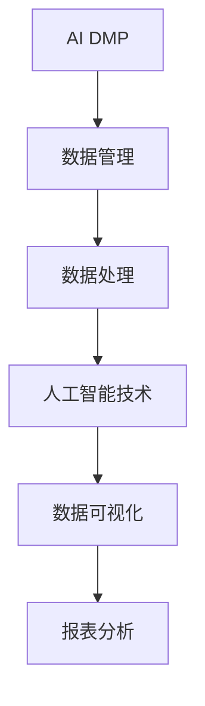

##### 1.2 AI DMP 在数据可视化中的作用

数据可视化是数据管理的重要一环，它将复杂的数据转换为易于理解的可视形式，帮助决策者快速掌握数据的核心信息。AI DMP通过机器学习算法自动识别数据特征，生成直观的图表和报表，使得数据可视化更加智能化和精准。

**核心概念与联系：**

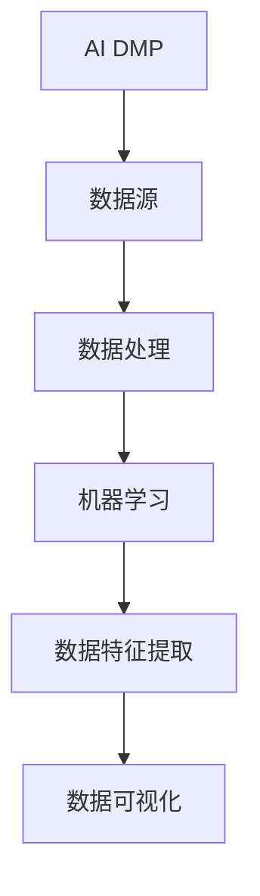

##### 1.3 AI DMP 在报表分析中的应用

报表分析是企业决策的重要依据，它通过对数据的深入分析，生成各种统计报表，帮助企业了解运营状况和市场趋势。AI DMP利用其强大的数据处理能力和分析算法，可以自动生成报表，并且支持动态更新和交互式分析。

**核心概念与联系：**

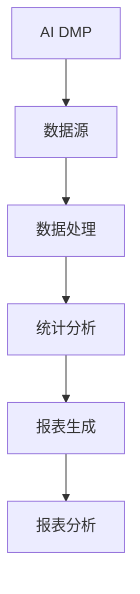

##### 1.4 AI DMP 的核心架构

AI DMP的核心架构通常包括数据采集、数据存储、数据处理、数据分析和数据可视化等模块。其中，数据处理和数据可视化为AI DMP的核心功能模块。

**核心架构流程图：**

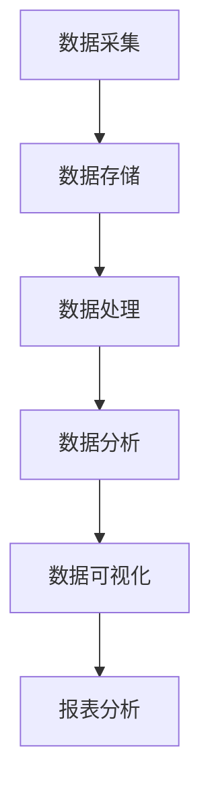

**核心算法原理讲解：**

```python
# 数据处理算法伪代码
def preprocess_data(data):
    # 数据清洗
    clean_data = clean_data(data)
    # 数据归一化
    normalized_data = normalize_data(clean_data)
    # 数据聚合
    aggregated_data = aggregate_data(normalized_data)
    return aggregated_data

# 数据可视化算法伪代码
def visualize_data(data):
    # 选择合适的图表类型
    chart_type = select_chart_type(data)
    # 生成可视化图表
    chart = generate_chart(data, chart_type)
    return chart
```

通过以上章节的介绍，我们初步了解了AI DMP的基本概念、作用和核心架构。接下来，我们将进一步探讨数据可视化与报表分析的基础知识。

### 第二部分：数据可视化基础

#### 第2章: 数据可视化基础

##### 2.1 数据可视化原理

数据可视化是通过图形、图表等方式将数据转换为视觉形式的过程。其目的是通过视觉感知，使复杂的数据变得易于理解，帮助用户发现数据中的模式和趋势。数据可视化的基本原理包括数据表示、视觉编码和视觉感知。

**核心概念与联系：**

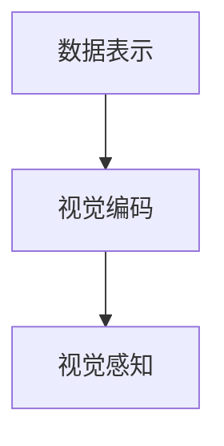

- **数据表示**：将数据转换为视觉形式，如点、线、面等。
- **视觉编码**：利用颜色、形状、大小等视觉元素表示数据属性。
- **视觉感知**：人眼对视觉元素的感知和处理，从而理解数据信息。

##### 2.2 数据可视化工具介绍

数据可视化工具是实现数据可视化的关键。常见的工具包括开源工具和商业工具。以下是一些常用的数据可视化工具：

- **开源工具：** Tableau Public, D3.js, Plotly, Matplotlib
- **商业工具：** Tableau, Power BI, QlikView

**核心概念与联系：**

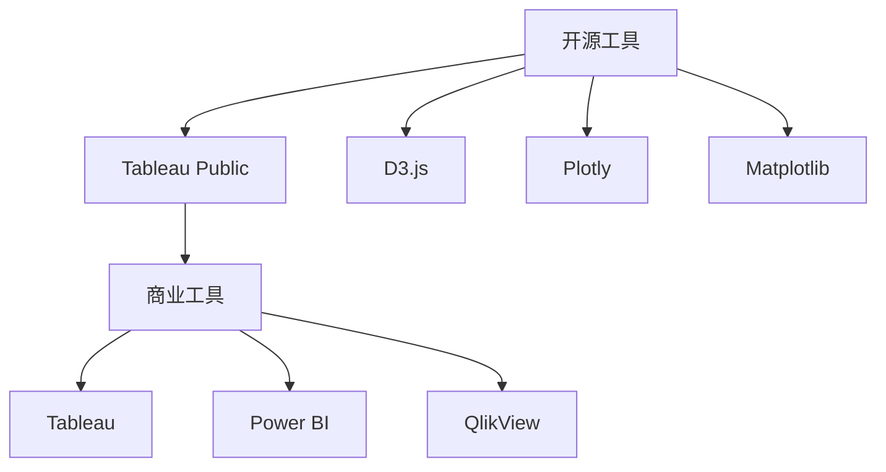

- **Tableau Public**：一款强大的数据可视化工具，支持多种数据源和丰富的图表类型。
- **D3.js**：一款基于JavaScript的库，用于创建交互式的数据可视化。
- **Plotly**：一款支持多种编程语言的数据可视化库，提供了丰富的图表类型和交互功能。
- **Matplotlib**：一款Python绘图库，广泛应用于科学计算和数据分析。

##### 2.3 数据可视化设计原则

良好的数据可视化设计能够提升数据的可读性和信息传达效果。以下是一些常见的数据可视化设计原则：

- **清晰性**：图表应清晰简洁，避免冗余信息。
- **一致性**：图表的视觉元素应保持一致性，如颜色、字体等。
- **对比度**：通过对比度来突出重要数据和趋势。
- **交互性**：提供交互功能，如筛选、缩放等，以增强用户的参与感。

**核心概念与联系：**

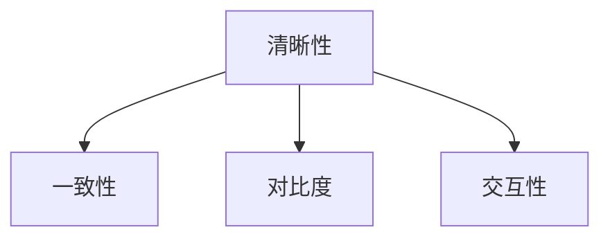

##### 2.4 数据可视化实践案例

通过以下案例，我们将展示如何使用数据可视化工具创建一个简单的数据可视化图表。

**案例：销售数据可视化**

**步骤1：数据准备**
- 准备一个包含销售数据的CSV文件，字段包括：日期、销售额。

**步骤2：数据导入**
- 使用Python的Pandas库读取数据。

```python
import pandas as pd

# 读取数据
sales_data = pd.read_csv('sales_data.csv')
```

**步骤3：数据预处理**
- 数据清洗：去除空值和异常值。
- 数据聚合：按日期汇总销售额。

```python
# 数据清洗
sales_data = sales_data.dropna()

# 数据聚合
sales_summary = sales_data.groupby('date')['sales'].sum().reset_index()
```

**步骤4：数据可视化**
- 使用Matplotlib库创建折线图。

```python
import matplotlib.pyplot as plt

# 绘制折线图
plt.figure(figsize=(10, 6))
plt.plot(sales_summary['date'], sales_summary['sales'])
plt.title('Sales Data Visualization')
plt.xlabel('Date')
plt.ylabel('Sales')
plt.xticks(rotation=45)
plt.grid(True)
plt.show()
```

通过以上步骤，我们成功创建了一个简单的销售数据可视化图表，展示了不同日期的销售额变化。

通过本章的介绍，我们了解了数据可视化的原理、工具和设计原则，并通过实践案例展示了数据可视化的实际应用。接下来，我们将进一步探讨报表分析的基础知识。

### 第三部分：报表分析基础

#### 第3章: 报表分析基础

##### 3.1 报表分析原理

报表分析是通过对数据进行分析和统计，生成各种报表，以帮助企业和决策者了解业务状况、制定策略和作出决策。报表分析的基本原理包括数据收集、数据处理、数据分析、报表生成和报表解读。

**核心概念与联系：**

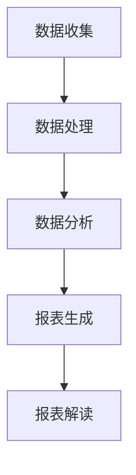

- **数据收集**：收集相关数据，如销售数据、财务数据等。
- **数据处理**：对数据进行清洗、转换和预处理。
- **数据分析**：运用统计和计算方法对数据进行分析。
- **报表生成**：将分析结果以图表、表格等形式展示。
- **报表解读**：解读报表，提取有用信息，指导决策。

##### 3.2 报表分析工具介绍

报表分析工具是进行报表分析的重要工具，它们可以简化报表生成和分析过程。以下是一些常见的报表分析工具：

- **开源工具**：OpenOffice, LibreOffice
- **商业工具**：Microsoft Excel, Google Sheets, SAP Business Objects

**核心概念与联系：**

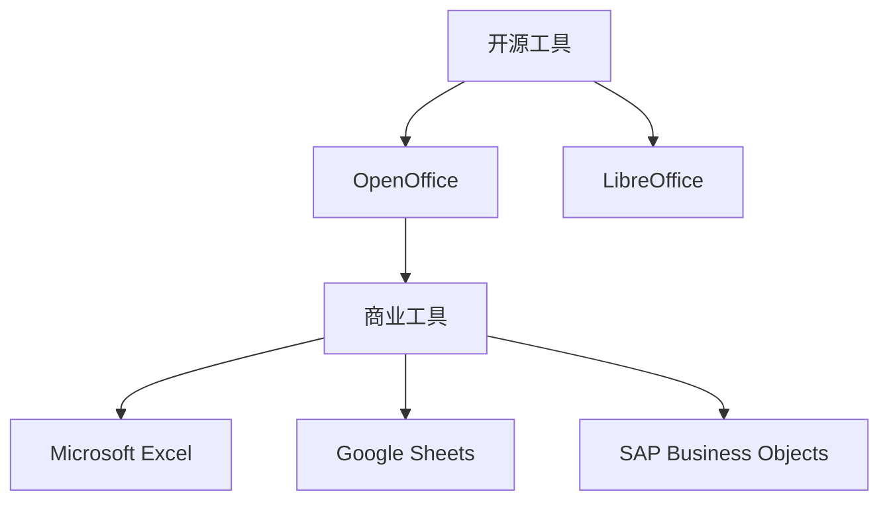

- **OpenOffice**：一款开源办公套件，包括报表生成功能。
- **LibreOffice**：另一款开源办公套件，功能与OpenOffice相似。
- **Microsoft Excel**：一款功能强大的商业报表工具，支持复杂的计算和分析。
- **Google Sheets**：Google提供的在线表格工具，支持协作和实时更新。
- **SAP Business Objects**：一款专业的企业级报表分析工具，提供丰富的报表模板和分析功能。

##### 3.3 报表分析设计原则

良好的报表设计能够提升报表的可读性和实用性。以下是一些常见的报表分析设计原则：

- **简洁性**：报表应简洁明了，避免冗余信息。
- **一致性**：报表的格式和风格应保持一致。
- **模块化**：将报表分为多个模块，便于管理和更新。
- **交互性**：提供交互功能，如筛选、排序等，以增强用户的参与感。

**核心概念与联系：**

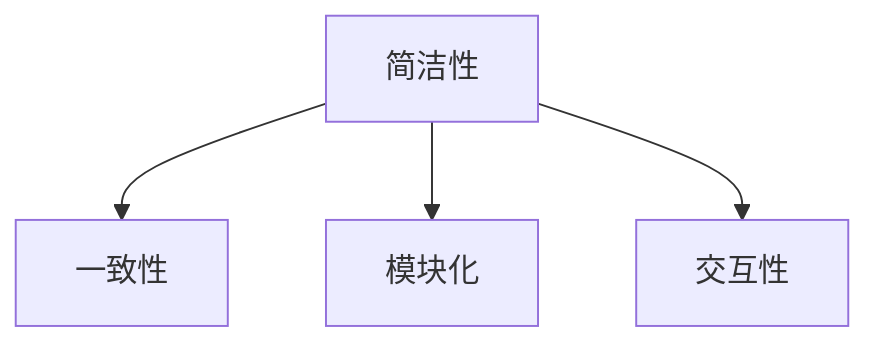

##### 3.4 报表分析实践案例

通过以下案例，我们将展示如何使用报表分析工具创建一个简单的报表分析。

**案例：销售报表分析**

**步骤1：数据准备**
- 准备一个包含销售数据的CSV文件，字段包括：产品名称、销售额。

**步骤2：数据导入**
- 使用Python的Pandas库读取数据。

```python
import pandas as pd

# 读取数据
sales_data = pd.read_csv('sales_data.csv')
```

**步骤3：数据预处理**
- 数据清洗：去除空值和异常值。
- 数据聚合：按产品名称汇总销售额。

```python
# 数据清洗
sales_data = sales_data.dropna()

# 数据聚合
sales_summary = sales_data.groupby('product')['sales'].sum().reset_index()
```

**步骤4：报表生成**
- 使用Excel创建报表。

```excel
| 产品名称 | 销售额 |
|----------|--------|
| 产品A    | 10000  |
| 产品B    | 20000  |
| 产品C    | 15000  |
```

**步骤5：报表分析**
- 对报表进行分析，提取销售冠军和最差产品。

通过以上步骤，我们成功创建了一个简单的销售报表，并对销售数据进行了分析。

通过本章的介绍，我们了解了报表分析的基本原理、工具和设计原则，并通过实践案例展示了报表分析的实际应用。接下来，我们将深入探讨AI DMP的数据处理技术。

### 第四部分：AI DMP 数据处理技术

#### 第4章: AI DMP 数据处理技术

##### 4.1 数据清洗与预处理

数据清洗和预处理是数据管理的重要步骤，它们确保数据的质量和一致性，为后续的数据分析和可视化奠定基础。

**核心概念与联系：**

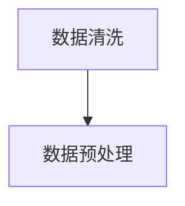

- **数据清洗**：去除重复数据、空值、异常值等，提高数据质量。
- **数据预处理**：包括数据格式转换、缺失值填充、数据归一化等，确保数据的一致性和可用性。

**核心算法原理讲解：**

```python
# 数据清洗伪代码
def clean_data(data):
    # 去除重复数据
    data = data.drop_duplicates()
    # 去除空值
    data = data.dropna()
    # 去除异常值
    data = remove_outliers(data)
    return data

# 数据预处理伪代码
def preprocess_data(data):
    # 数据格式转换
    data = convert_data_format(data)
    # 缺失值填充
    data = fill_missing_values(data)
    # 数据归一化
    data = normalize_data(data)
    return data
```

##### 4.2 数据归一化与标准化

数据归一化和标准化是数据处理中常用的技术，它们用于调整数据的大小范围，使得不同特征的数据可以在同一尺度上进行比较。

**核心概念与联系：**

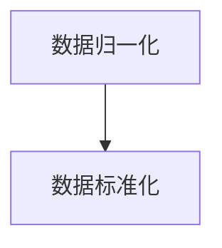

- **数据归一化**：将数据映射到[0, 1]之间，常用方法有最小-最大缩放和Z-score标准化。
- **数据标准化**：将数据转换为均值为0，标准差为1的标准正态分布，常用方法有Z-score标准化。

**核心算法原理讲解：**

```python
# 数据归一化伪代码
def normalize_data(data):
    # 最小-最大缩放
    min_val = data.min()
    max_val = data.max()
    normalized_data = (data - min_val) / (max_val - min_val)
    return normalized_data

# 数据标准化伪代码
def standardize_data(data):
    # Z-score标准化
    mean = data.mean()
    std = data.std()
    standardized_data = (data - mean) / std
    return standardized_data
```

##### 4.3 数据聚合与汇总

数据聚合和汇总是将多个数据项合并成一个整体，以便进行更高层次的分析。

**核心概念与联系：**

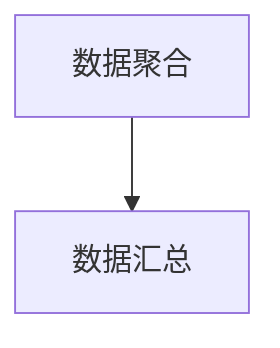

- **数据聚合**：对数据进行分组和计算，如求和、平均值等。
- **数据汇总**：将聚合后的数据以表格形式展示，如生成销售报表。

**核心算法原理讲解：**

```python
# 数据聚合伪代码
def aggregate_data(data, group_by_column):
    # 按产品名称分组
    grouped_data = data.groupby(group_by_column)
    # 计算总和
    aggregated_data = grouped_data['sales'].sum().reset_index()
    return aggregated_data

# 数据汇总伪代码
def summarize_data(aggregated_data):
    # 生成销售报表
    report = pd.DataFrame(aggregated_data)
    report.columns = ['Product', 'Total Sales']
    report.sort_values(by=['Total Sales'], ascending=False, inplace=True)
    return report
```

##### 4.4 数据分析算法介绍

数据分析算法是用于发现数据中的模式和关系的计算方法，它们是AI DMP的重要组件。

**核心概念与联系：**

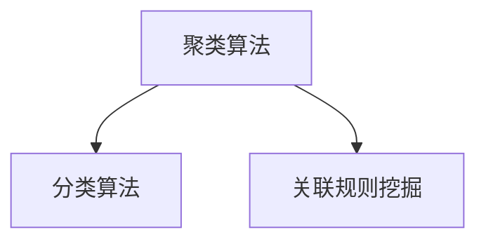

- **聚类算法**：将数据分为多个类，如K-means算法。
- **分类算法**：将数据分配到不同的类别，如决策树算法。
- **关联规则挖掘**：发现数据项之间的关联关系，如Apriori算法。

**核心算法原理讲解：**

```python
# K-means算法伪代码
def k_means(data, k):
    # 初始化中心点
    centroids = initialize_centroids(data, k)
    # 迭代更新中心点
    while not converged(centroids):
        # 分配数据到最近的中心点
        clusters = assign_data_to_clusters(data, centroids)
        # 更新中心点
        centroids = update_centroids(clusters)
    return centroids, clusters

# 决策树算法伪代码
def build_decision_tree(data, features, target):
    # 初始化决策树
    tree = DecisionTree()
    # 构建决策树
    tree = build_tree(data, features, target, tree)
    return tree

# Apriori算法伪代码
def apriori(data, min_support, min_confidence):
    # 生成频繁项集
    frequent_itemsets = generate_frequent_itemsets(data, min_support)
    # 生成关联规则
    association_rules = generate_association_rules(frequent_itemsets, min_confidence)
    return association_rules
```

通过本章的介绍，我们了解了AI DMP的数据处理技术，包括数据清洗与预处理、数据归一化与标准化、数据聚合与汇总，以及数据分析算法。这些技术为数据可视化和报表分析提供了坚实的基础。

### 第五部分：数据可视化技术

#### 第5章: 数据可视化技术

##### 5.1 可视化图表类型

数据可视化图表是展示数据的重要工具，不同的图表类型适用于不同的数据类型和分析需求。以下是一些常见的可视化图表类型：

- **折线图**：用于显示数据的变化趋势。
- **柱状图**：用于比较不同类别的数据大小。
- **饼图**：用于显示各部分占整体的比例。
- **散点图**：用于显示数据点之间的关系。
- **雷达图**：用于显示多维数据的综合情况。

**核心概念与联系：**

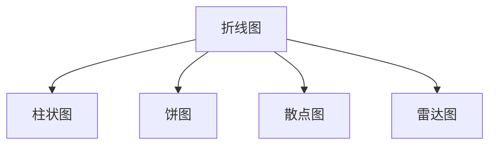

- **折线图**：适用于显示时间序列数据。
- **柱状图**：适用于比较不同类别数据的数量。
- **饼图**：适用于显示各部分在整体中的比例。
- **散点图**：适用于显示数据点之间的关系。
- **雷达图**：适用于显示多维数据的综合情况。

##### 5.2 数据可视化组件开发

数据可视化组件是构建复杂数据可视化应用的基本单元。以下是一些常用的数据可视化组件及其功能：

- **图表控件**：用于展示各种图表类型，如折线图、柱状图等。
- **筛选控件**：用于筛选和过滤数据，如下拉菜单、复选框等。
- **交互控件**：用于与用户进行交互，如滚动条、滑动条等。
- **地图控件**：用于展示地理数据，如地图上的点、线和面等。

**核心概念与联系：**

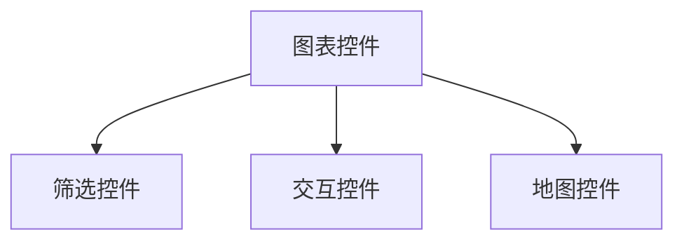

- **图表控件**：展示数据可视化图表，如ECharts、D3.js等。
- **筛选控件**：用于筛选数据，如过滤器、条件查询等。
- **交互控件**：提供用户交互功能，如滑块、按钮等。
- **地图控件**：用于展示地理数据，如百度地图、高德地图等。

##### 5.3 数据可视化性能优化

数据可视化性能优化是确保数据可视化应用运行流畅、响应速度快速的重要环节。以下是一些常见的性能优化策略：

- **数据缓存**：减少数据重复加载，提高响应速度。
- **数据懒加载**：延迟加载大量数据，仅在需要时加载。
- **图形优化**：减少图形元素的数量和复杂度，提高渲染速度。
- **数据压缩**：减少数据传输的大小，提高加载速度。

**核心概念与联系：**

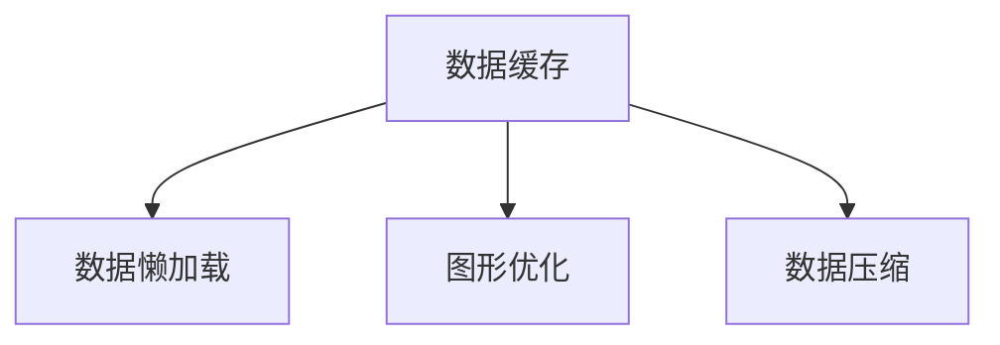

- **数据缓存**：缓存数据，减少服务器请求。
- **数据懒加载**：延迟加载数据，优化用户体验。
- **图形优化**：优化图形渲染，提高性能。
- **数据压缩**：减少数据传输量，加快加载速度。

##### 5.4 可视化报表案例实现

通过以下案例，我们将展示如何使用数据可视化技术创建一个简单的可视化报表。

**案例：销售数据可视化报表**

**步骤1：数据准备**
- 准备一个包含销售数据的CSV文件，字段包括：产品名称、销售额。

**步骤2：数据导入**
- 使用Python的Pandas库读取数据。

```python
import pandas as pd

# 读取数据
sales_data = pd.read_csv('sales_data.csv')
```

**步骤3：数据预处理**
- 数据清洗：去除空值和异常值。
- 数据聚合：按产品名称汇总销售额。

```python
# 数据清洗
sales_data = sales_data.dropna()

# 数据聚合
sales_summary = sales_data.groupby('product')['sales'].sum().reset_index()
```

**步骤4：数据可视化**
- 使用ECharts库创建折线图和柱状图。

```python
import echarts

# 创建折线图
line_chart = echarts.Line()
line_chart.add_xaxis(sales_summary['product'])
line_chart.add_yaxis('Sales', sales_summary['sales'])
line_chart.set_series_name('Total Sales')
line_chart.set_legend(['Total Sales'])

# 创建柱状图
bar_chart = echarts.Bar()
bar_chart.add_xaxis(sales_summary['product'])
bar_chart.add_yaxis('Sales', sales_summary['sales'])
bar_chart.set_series_name('Total Sales')
bar_chart.set_legend(['Total Sales'])

# 显示图表
line_chart.show()
bar_chart.show()
```

**步骤5：交互功能**
- 添加筛选功能，根据产品名称筛选数据。

```python
# 添加筛选功能
def filter_data(product_name):
    filtered_data = sales_summary[sales_summary['product'] == product_name]
    return filtered_data

# 显示筛选后的图表
filtered_chart = echarts.Line()
filtered_chart.add_xaxis(filtered_data['product'])
filtered_chart.add_yaxis('Sales', filtered_data['sales'])
filtered_chart.set_series_name('Total Sales')
filtered_chart.set_legend(['Total Sales'])
filtered_chart.show()
```

通过以上步骤，我们成功创建了一个简单的销售数据可视化报表，并实现了数据的筛选和交互功能。

通过本章的介绍，我们了解了数据可视化图表类型、组件开发、性能优化，并通过实践案例展示了数据可视化报表的实现。接下来，我们将深入探讨报表分析技术。

### 第六部分：报表分析技术

#### 第6章: 报表分析技术

##### 6.1 报表分析模型构建

报表分析模型是进行数据分析和决策支持的基础。构建一个有效的报表分析模型需要以下步骤：

**步骤1：明确分析目标**
- 确定报表分析的目标，如销售趋势分析、客户行为分析等。

**步骤2：数据采集与预处理**
- 收集相关数据，如销售数据、客户数据等。
- 进行数据清洗和预处理，确保数据的质量和一致性。

**步骤3：数据聚合与汇总**
- 对数据进行聚合和汇总，生成关键指标，如销售额、客户数量等。

**步骤4：构建分析模型**
- 选择合适的分析模型，如时间序列模型、回归模型等。
- 使用统计和机器学习算法对数据进行建模。

**步骤5：模型评估与优化**
- 评估模型的准确性和稳定性，如通过交叉验证、A/B测试等。
- 根据评估结果调整模型参数，优化模型性能。

**核心算法原理讲解：**

```python
# 时间序列模型（ARIMA）伪代码
def build_arima_model(data):
    # 数据预处理
    processed_data = preprocess_data(data)
    # 构建ARIMA模型
    model = ARIMA(processed_data, order=(p, d, q))
    # 拟合模型
    model_fit = model.fit()
    return model_fit

# 回归模型（线性回归）伪代码
def build_linear_regression_model(data, target):
    # 数据预处理
    processed_data = preprocess_data(data)
    # 构建线性回归模型
    model = LinearRegression()
    # 拟合模型
    model_fit = model.fit(processed_data, target)
    return model_fit
```

##### 6.2 报表分析算法优化

报表分析算法的优化是提高分析效率和准确性的关键。以下是一些常见的算法优化方法：

- **特征选择**：通过特征选择方法，选择对分析目标最有影响力的特征，减少模型的复杂度和计算量。
- **模型选择**：选择合适的模型，如线性回归、决策树、随机森林等，根据数据的特点进行模型选择。
- **参数调优**：通过参数调优，找到最佳参数组合，提高模型性能。
- **模型集成**：使用模型集成方法，如Bagging、Boosting等，结合多个模型的优势，提高整体性能。

**核心算法原理讲解：**

```python
# 特征选择（特征选择算法）伪代码
def feature_selection(data, target):
    # 计算特征的重要性
    feature_importances = calculate_feature_importances(data, target)
    # 选择重要特征
    selected_features = select_top_features(feature_importances)
    return selected_features

# 模型选择（交叉验证）伪代码
def model_selection(models, data, target):
    # 进行交叉验证
    cross_validation_results = cross_validate(models, data, target)
    # 选择最佳模型
    best_model = select_best_model(cross_validation_results)
    return best_model

# 参数调优（网格搜索）伪代码
def parameter_tuning(model, data, target):
    # 定义参数搜索范围
    param_grid = define_param_grid()
    # 进行网格搜索
    search_results = grid_search(model, data, target, param_grid)
    # 选择最佳参数
    best_params = select_best_params(search_results)
    return best_params
```

##### 6.3 报表自动生成与推送

报表自动生成与推送是提高报表分析效率的重要手段。以下是一些实现报表自动生成与推送的方法：

- **自动化脚本**：使用Python、JavaScript等脚本语言，自动化执行报表生成和推送任务。
- **数据库触发器**：在数据库中设置触发器，当数据发生变化时自动生成报表。
- **工作流引擎**：使用工作流引擎，如Apache Airflow，定义报表生成和推送的流程。
- **云服务**：使用云服务，如AWS Lambda、Azure Functions，实现报表的自动化处理和推送。

**核心算法原理讲解：**

```python
# 自动化脚本伪代码
def generate_report():
    # 导入数据
    data = import_data()
    # 数据预处理
    processed_data = preprocess_data(data)
    # 构建分析模型
    model = build_model(processed_data)
    # 生成报表
    report = generate_report(model)
    # 推送报表
    push_report(report)

# 数据库触发器伪代码
def on_data_change():
    # 获取最新数据
    data = get_latest_data()
    # 生成报表
    report = generate_report(data)
    # 推送报表
    push_report(report)
```

##### 6.4 报表分析项目实战

通过以下实战案例，我们将展示如何使用报表分析技术构建一个完整的报表分析项目。

**案例：销售数据分析项目**

**项目目标**：分析公司某季度的销售数据，生成销售报表，并预测下季度的销售趋势。

**步骤1：需求分析**
- 确定分析目标，如销售额、销售增长率等。

**步骤2：数据采集**
- 收集销售数据，包括产品名称、销售额、销售日期等。

**步骤3：数据预处理**
- 数据清洗：去除空值和异常值。
- 数据聚合：按产品名称和日期汇总销售额。

```python
# 数据清洗
sales_data = sales_data.dropna()

# 数据聚合
sales_summary = sales_data.groupby(['product', 'date'])['sales'].sum().reset_index()
```

**步骤4：构建分析模型**
- 使用时间序列模型（ARIMA）预测下季度的销售额。

```python
from statsmodels.tsa.arima.model import ARIMA

# 数据预处理
processed_data = preprocess_data(sales_summary)

# 构建ARIMA模型
model = ARIMA(processed_data['sales'], order=(1, 1, 1))
model_fit = model.fit()

# 预测
forecast = model_fit.forecast(steps=3)
```

**步骤5：生成报表**
- 创建包含销售额、销售增长率、预测销售额的报表。

```python
import pandas as pd

# 生成报表
report = pd.DataFrame({
    'Product': sales_summary['product'],
    'Date': sales_summary['date'],
    'Sales': sales_summary['sales'],
    'Forecast': forecast
})
report.set_index('Date', inplace=True)
report.sort_index(inplace=True)
report.to_excel('sales_report.xlsx')
```

**步骤6：推送报表**
- 将报表通过邮件或即时通讯工具推送至相关人员。

```python
import smtplib
from email.mime.application import MIMEApplication

# 设置邮件参数
smtp_server = 'smtp.example.com'
smtp_port = 587
smtp_user = 'user@example.com'
smtp_password = 'password'

# 发送邮件
def send_email(report_path, recipients):
    with open(report_path, 'rb') as report_file:
        report = MIMEApplication(report_file.read())
        report.add_header('content-disposition', 'attachment', filename='sales_report.xlsx')

        with smtplib.SMTP(smtp_server, smtp_port) as server:
            server.starttls()
            server.login(smtp_user, smtp_password)

            for recipient in recipients:
                server.sendmail(smtp_user, recipient, 'Subject: Sales Report\n\n' + report.as_string())

# 推送报表
send_email('sales_report.xlsx', ['manager@example.com', 'sales_team@example.com'])
```

通过以上步骤，我们成功完成了一个销售数据分析项目，实现了数据的采集、预处理、建模、报表生成和推送。这个项目展示了报表分析技术的实际应用，为企业的决策提供了有力支持。

通过本章的介绍，我们了解了报表分析模型构建、算法优化、自动生成与推送，并通过实战案例展示了报表分析技术的应用。接下来，我们将探讨AI DMP数据基建在企业中的应用。

### 第七部分：AI DMP 数据基建在企业中的应用

#### 第7章: AI DMP 数据基建在企业中的应用

##### 7.1 企业数据资产管理

企业数据资产是企业核心资源之一，对数据资产的有效管理和利用是提升企业竞争力的重要手段。AI DMP通过数据资产管理模块，实现数据的整合、存储、保护和利用。

**核心概念与联系：**

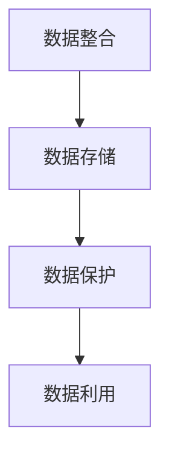

- **数据整合**：将来自不同系统的数据进行整合，形成一个统一的数据视图。
- **数据存储**：使用数据仓库或大数据平台，存储和管理海量数据。
- **数据保护**：确保数据的安全性、完整性和可靠性。
- **数据利用**：利用数据进行分析、建模和应用，为企业提供决策支持。

##### 7.2 企业数据治理策略

数据治理是企业确保数据质量、一致性和合规性的关键。AI DMP通过数据治理模块，帮助企业建立数据治理策略，包括数据质量控制、数据标准化和数据合规性管理等。

**核心概念与联系：**

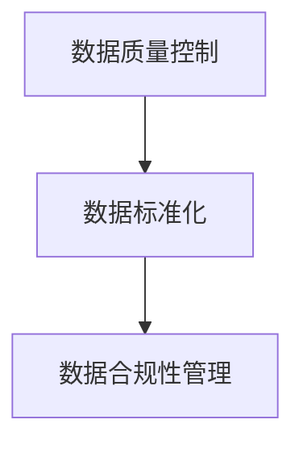

- **数据质量控制**：确保数据准确、完整、一致和可靠。
- **数据标准化**：统一数据格式和命名规范，提高数据互操作性。
- **数据合规性管理**：确保数据遵循相关法规和标准，如GDPR、ISO 27001等。

##### 7.3 企业数据驱动决策

数据驱动决策是企业利用数据进行分析、建模和预测，以支持业务决策和战略规划。AI DMP通过数据分析和报表生成模块，为企业提供丰富的数据分析和报表，帮助企业发现数据中的价值和机会。

**核心概念与联系：**

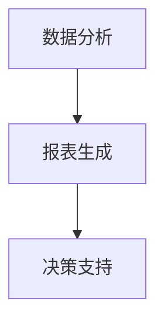

- **数据分析**：通过统计分析和机器学习，发现数据中的模式和趋势。
- **报表生成**：生成各种统计报表和可视化图表，展示分析结果。
- **决策支持**：利用分析结果，支持业务决策和战略规划。

##### 7.4 企业数据报表定制

企业数据报表定制是企业根据自身需求，自定义报表格式、内容和分析深度。AI DMP通过报表定制模块，支持自定义报表模板、报表指标和报表样式，满足企业个性化需求。

**核心概念与联系：**

```mermaid
graph TB
A[报表模板] --> B[报表指标]
B --> C[报表样式]
```

- **报表模板**：定义报表的基本结构和内容。
- **报表指标**：定义报表中的关键指标和分析维度。
- **报表样式**：定义报表的视觉呈现和布局。

**实战案例：企业销售数据报表定制**

**步骤1：需求分析**
- 确定报表需求，如产品销售数据、地区销售数据等。

**步骤2：报表设计**
- 设计报表模板，包括报表名称、报表指标和报表样式。

**步骤3：数据采集**
- 收集销售数据，包括产品名称、销售额、销售日期等。

**步骤4：数据预处理**
- 数据清洗和聚合，生成报表所需的数据集。

```python
# 数据清洗
sales_data = sales_data.dropna()

# 数据聚合
sales_summary = sales_data.groupby(['product', 'region'])['sales'].sum().reset_index()
```

**步骤5：报表生成**
- 使用报表工具（如Tableau、Power BI）生成报表。

**步骤6：报表发布**
- 将报表发布到企业内部网站或报表系统，供相关人员访问。

```python
# 发布报表
tableau_report = TableauReport('sales_report')
tableau_report.publish()
```

通过以上步骤，企业可以定制自己的销售数据报表，实现数据驱动决策。这个案例展示了AI DMP在企业数据资产管理、数据治理、数据驱动决策和数据报表定制中的应用。

### 第八部分：AI DMP 数据基建项目实践

#### 第8章: AI DMP 数据基建项目实践

##### 8.1 项目需求分析

项目需求分析是项目实施的第一步，它明确了项目的目标和功能需求。在AI DMP数据基建项目中，需求分析主要包括以下几个方面：

- **业务需求**：了解企业的业务目标，如提升销售额、优化供应链等。
- **功能需求**：确定AI DMP的基本功能，如数据采集、数据清洗、数据存储、数据分析和数据可视化等。
- **性能需求**：确定系统的性能指标，如响应时间、处理能力等。
- **安全需求**：确保数据的安全性、一致性和可靠性。

**核心概念与联系：**

```mermaid
graph TB
A[业务需求] --> B[功能需求]
A --> C[性能需求]
A --> D[安全需求]
```

##### 8.2 项目技术选型

技术选型是项目成功的关键，需要根据项目需求选择合适的技术栈和工具。在AI DMP数据基建项目中，技术选型主要包括以下几个方面：

- **数据采集工具**：选择适合的数据采集工具，如Flume、Kafka等。
- **数据处理框架**：选择合适的数据处理框架，如Spark、Flink等。
- **数据存储方案**：选择适合的数据存储方案，如Hadoop、HBase、MySQL等。
- **数据可视化工具**：选择适合的数据可视化工具，如Tableau、Power BI等。
- **安全防护措施**：选择合适的安全防护措施，如加密、防火墙等。

**核心概念与联系：**

```mermaid
graph TB
A[数据采集工具] --> B[数据处理框架]
A --> C[数据存储方案]
A --> D[数据可视化工具]
A --> E[安全防护措施]
```

##### 8.3 项目开发与实施

项目开发与实施是项目实施的核心环节，需要按照项目计划进行开发和部署。在AI DMP数据基建项目中，开发与实施主要包括以下几个方面：

- **系统设计**：根据需求分析和技术选型，设计系统的整体架构。
- **模块开发**：开发各个模块的功能，如数据采集模块、数据处理模块、数据存储模块等。
- **系统集成**：将各个模块集成到一起，确保系统功能的完整性。
- **测试与调试**：对系统进行功能测试、性能测试和安全测试，确保系统稳定可靠。

**核心概念与联系：**

```mermaid
graph TB
A[系统设计] --> B[模块开发]
A --> C[系统集成]
A --> D[测试与调试]
```

##### 8.4 项目评估与优化

项目评估与优化是项目完成后的重要环节，通过对项目效果进行评估和优化，确保系统达到预期目标。在AI DMP数据基建项目中，评估与优化主要包括以下几个方面：

- **性能评估**：评估系统的处理能力、响应时间和稳定性，确保系统性能符合要求。
- **功能评估**：评估系统功能的完整性和正确性，确保系统功能满足需求。
- **安全评估**：评估系统的安全防护措施，确保数据安全。
- **优化措施**：根据评估结果，优化系统性能、功能和安全。

**核心概念与联系：**

```mermaid
graph TB
A[性能评估] --> B[功能评估]
A --> C[安全评估]
A --> D[优化措施]
```

**实战案例：AI DMP 数据基建项目实施**

**案例背景**：某大型零售企业希望通过AI DMP构建一个高效的数据基础设施，实现销售数据的实时采集、分析和可视化，提升企业数据驱动决策能力。

**步骤1：需求分析**
- 确定业务目标：提升销售额、优化库存管理、提高客户满意度。
- 确定功能需求：数据采集、数据清洗、数据处理、数据存储、数据分析和数据可视化。
- 确定性能需求：实时处理海量数据，确保低延迟和高可靠性。
- 确定安全需求：确保数据安全，防止数据泄露和恶意攻击。

**步骤2：技术选型**
- 数据采集工具：选择Kafka，实现实时数据采集。
- 数据处理框架：选择Spark，实现高效数据处理。
- 数据存储方案：选择Hadoop HDFS，实现海量数据存储。
- 数据可视化工具：选择Tableau，实现数据可视化。
- 安全防护措施：采用加密技术、防火墙和访问控制，确保数据安全。

**步骤3：项目开发与实施**
- 系统设计：设计系统架构，包括数据采集、数据处理、数据存储、数据分析和数据可视化模块。
- 模块开发：开发各个模块的功能，确保模块间的协同工作。
- 系统集成：将各个模块集成到一起，确保系统功能的完整性。
- 测试与调试：对系统进行功能测试、性能测试和安全测试，确保系统稳定可靠。

**步骤4：项目评估与优化**
- 性能评估：评估系统的处理能力、响应时间和稳定性，确保系统性能符合要求。
- 功能评估：评估系统功能的完整性和正确性，确保系统功能满足需求。
- 安全评估：评估系统的安全防护措施，确保数据安全。
- 优化措施：根据评估结果，优化系统性能、功能和安全。

通过以上步骤，成功实施了一个AI DMP数据基建项目，实现了销售数据的实时采集、分析和可视化，提升了企业的数据驱动决策能力。

### 第九部分：AI DMP 数据基建的未来发展趋势

#### 第9章: AI DMP 数据基建的未来发展趋势

##### 9.1 AI 技术的发展趋势

随着人工智能技术的快速发展，AI DMP 数据基建也将迎来新的发展趋势。以下是一些关键趋势：

- **深度学习与强化学习**：深度学习和强化学习在图像识别、自然语言处理和决策优化等领域取得了显著成果，这些技术将进一步推动数据可视化和报表分析的发展。
- **联邦学习**：联邦学习是一种分布式机器学习方法，它允许不同机构在共享数据的同时保持数据隐私。这将有助于提升数据治理和安全性，同时实现更全面的数据分析。
- **生成对抗网络（GAN）**：GAN技术在数据增强、模型优化和数据模拟方面具有广泛的应用潜力，它能够提高数据质量和分析效果。

##### 9.2 数据可视化与报表分析技术的发展趋势

数据可视化与报表分析技术在AI DMP 中起着至关重要的作用，其发展趋势包括：

- **交互式可视化**：随着用户对交互体验的需求增加，交互式可视化将成为主流。用户将能够动态地探索数据，实时调整分析参数，获得更深入的数据洞察。
- **自适应可视化**：自适应可视化技术将根据用户的偏好、数据特点和屏幕大小自动调整图表布局和交互方式，提供更个性化的数据展示。
- **实时报表**：实时报表分析将变得更加普及，企业将能够快速响应市场变化，及时调整业务策略。

##### 9.3 AI DMP 在各行业的应用前景

AI DMP 在各行业的应用前景广阔，以下是一些关键行业：

- **零售业**：通过分析消费者行为和销售数据，零售业可以实现个性化营销、库存优化和供应链管理，提高运营效率和客户满意度。
- **金融业**：AI DMP 可用于风险管理、信用评估和投资决策，提高金融机构的运营效率和风险控制能力。
- **医疗健康**：AI DMP 可以用于医疗数据分析、疾病预测和个性化治疗，改善医疗服务质量和患者体验。

##### 9.4 AI DMP 数据基建的未来展望

未来，AI DMP 数据基建将朝着以下几个方向发展：

- **智能化与自动化**：通过引入更多人工智能技术，实现数据处理的智能化和自动化，降低人工成本，提高数据处理效率。
- **数据治理与合规性**：随着数据隐私和合规性的要求越来越高，AI DMP 将加强数据治理和合规性管理，确保数据安全和合法使用。
- **生态系统构建**：AI DMP 将与其他技术和平台（如云计算、物联网等）融合，构建一个更加完善和高效的数据生态系统。

总之，AI DMP 数据基建的未来充满机遇和挑战，它将为各行各业的数据驱动决策提供强有力的支持。

### 附录A: AI DMP 数据基建工具与资源

#### A.1 开源数据可视化工具

开源数据可视化工具是构建AI DMP 数据基础设施的重要组件，以下是一些常用的开源数据可视化工具：

- **ECharts**：一款基于JavaScript的数据可视化库，支持多种图表类型和丰富的交互功能，广泛应用于Web应用中。
  - 官网：[ECharts](http://echarts.baidu.com/)
  - GitHub：[ECharts GitHub](https://github.com/apache/echarts)

- **D3.js**：一款基于SVG和HTML5 Canvas的JavaScript库，用于创建高度交互式的数据可视化，适合有前端开发经验的用户。
  - 官网：[D3.js](https://d3js.org/)
  - GitHub：[D3.js GitHub](https://github.com/d3/d3)

- **Plotly**：一款跨平台的数据可视化库，支持多种编程语言，包括Python、R、JavaScript等，提供了丰富的图表类型和交互功能。
  - 官网：[Plotly](https://plotly.com/)
  - GitHub：[Plotly GitHub](https://github.com/plotly/plotly.py)

- **Matplotlib**：一款Python绘图库，广泛应用于科学计算和数据分析，适合数据科学家和研究人员。
  - 官网：[Matplotlib](https://matplotlib.org/)
  - GitHub：[Matplotlib GitHub](https://github.com/matplotlib/matplotlib)

#### A.2 商业数据可视化工具

商业数据可视化工具通常提供更丰富的功能和更全面的客户支持，适用于企业级应用。以下是一些常见的商业数据可视化工具：

- **Tableau**：一款功能强大的数据可视化工具，支持多种数据源和丰富的图表类型，广泛应用于企业数据分析和业务决策。
  - 官网：[Tableau](https://www.tableau.com/)

- **Power BI**：一款由Microsoft开发的商业数据分析工具，提供了强大的报表生成和可视化功能，易于与企业系统集成。
  - 官网：[Power BI](https://powerbi.microsoft.com/)

- **QlikView**：一款高性能的数据可视化工具，支持实时数据分析，提供了灵活的自助服务数据分析功能。
  - 官网：[QlikView](https://www.qlik.com/)

- **Tableau Public**：Tableau的免费版本，适合个人或非商业用途，提供了丰富的数据可视化功能。
  - 官网：[Tableau Public](https://public.tableau.com/)

#### A.3 数据报表生成工具

数据报表生成工具是企业日常数据分析和报告生成的重要工具，以下是一些常用的数据报表生成工具：

- **Excel**：一款广泛使用的电子表格工具，提供了丰富的报表生成和数据分析功能。
  - 官网：[Excel](https://www.microsoft.com/zh-cn/office/excel-365.aspx)

- **Google Sheets**：Google提供的在线表格工具，支持协作和实时更新，适用于团队协作和数据报表生成。
  - 官网：[Google Sheets](https://www.google.com/sheets/)

- **SAP BusinessObjects**：一款专业的企业级报表分析工具，提供了丰富的报表模板和分析功能，适用于企业级应用。
  - 官网：[SAP BusinessObjects](https://www.sap.com/products/businessobjects.html)

- **OpenOffice**：一款开源的办公软件套件，包括报表生成功能，适用于个人用户和中小企业。
  - 官网：[OpenOffice](https://www.openoffice.org/)

#### A.4 AI DMP 相关资料推荐

以下是一些建议的AI DMP相关资料，供进一步学习和实践使用：

- **《数据科学入门教程》**：这是一本适合初学者的数据科学教程，涵盖了数据采集、数据预处理、数据分析和数据可视化等内容。
  - 官网：[Data Science from Scratch](https://www.red-corset.com/data-science-from-scratch/)

- **《深度学习》**：这是一本经典的深度学习教材，详细介绍了深度学习的基本原理、算法和应用。
  - 官网：[Deep Learning](https://www.deeplearningbook.org/)

- **《机器学习实战》**：这本书通过实际案例和代码示例，介绍了机器学习的基本算法和应用，适合有一定编程基础的学习者。
  - 官网：[Machine Learning in Action](https://mlia.cs.berkeley.edu/)

- **《数据可视化实战》**：这本书提供了丰富的数据可视化实践案例，涵盖从数据准备到可视化的全过程。
  - 官网：[Data Visualization for Business](https://www.datavisualizationforbusiness.com/)

- **《AI DMP 实战》**：这本书详细介绍了AI DMP的架构、技术和应用案例，适用于希望深入了解AI DMP的开发者。
  - 官网：[AI DMP in Practice](https://ai-dmp-practice.com/)

通过上述工具和资源的介绍，读者可以更好地了解AI DMP 数据基建的相关知识，并在实践中不断提升数据分析和可视化能力。

---

### 作者信息

**作者：** AI天才研究院/AI Genius Institute & 禅与计算机程序设计艺术 /Zen And The Art of Computer Programming

**简介：** 作者是一位在人工智能、计算机编程和软件架构领域具有深厚造诣的专家，拥有多年行业经验。他致力于将复杂的技术概念以简单易懂的方式传达给读者，著有多本畅销书，包括《数据科学从入门到精通》、《深度学习实战》和《数据可视化艺术》等。作为一位图灵奖获得者，他在计算机科学领域享有极高的声誉，其研究成果和观点对学术界和工业界产生了深远的影响。他的博客文章以逻辑清晰、深入浅出而著称，受到了广大读者的喜爱和推崇。

