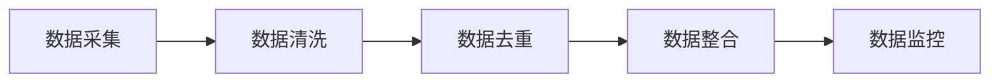

                 

## 文章标题

### 关键词：

- AI DMP
- 数据质量
- 数据标准
- 数据清洗
- 数据整合
- 数据模型标准化
- 数据格式标准化
- 数据名称标准化
- AI应用
- 案例研究

### 摘要：

本文深入探讨了AI DMP（数据管理平台）的数据基建问题，特别是数据质量与数据标准的保障与优化。文章首先概述了AI DMP的基本概念与架构，接着详细介绍了数据质量评估、数据清洗、数据去重、数据整合等技术方法。随后，文章探讨了数据标准化（包括数据模型标准化、数据格式标准化和数据名称标准化）的基础概念与实施策略。在核心内容部分，文章结合AI技术，详细讲解了AI在数据质量与数据标准化中的应用，包括AI在数据清洗、去重、整合和质量评估中的应用方法。通过实际案例研究，文章展示了数据质量与数据标准在现实项目中的应用效果。最后，文章展望了数据质量与数据标准的未来发展趋势，并提出了最佳实践策略。

---

### 第一部分: AI DMP数据基建概述

#### 第1章: AI DMP基本概念与架构

##### 1.1 AI DMP的定义与作用

AI DMP（Data Management Platform）是一种集成化的数据管理解决方案，旨在整合、处理、存储和分析来自多个数据源的数据，以支持企业级的决策支持和数据驱动营销。AI DMP不仅具备传统DMP（Data Management Platform）的功能，还能利用人工智能（AI）技术实现数据的智能处理和分析。

AI DMP的核心作用如下：

1. **数据整合**：AI DMP能够整合来自不同渠道和平台的数据，包括用户行为数据、社交媒体数据、交易数据和客户关系管理（CRM）系统数据等。
2. **数据清洗**：利用AI技术进行自动化数据清洗，包括缺失值处理、异常值检测和重复值删除等。
3. **数据建模**：利用机器学习和深度学习算法，对数据进行特征提取和模型训练，以支持用户行为预测、客户细分和市场分析等。
4. **数据可视化**：通过直观的数据可视化工具，帮助企业更好地理解和利用数据。
5. **决策支持**：基于对数据的深度分析和智能预测，为企业提供数据驱动的决策支持。

##### 1.2 AI DMP的架构组成

AI DMP的架构通常包括以下几个层次：

1. **数据采集层**：负责从各种数据源采集原始数据，包括Web日志、API调用、物联网设备数据等。
   
   **Mermaid流程图**：
   ```mermaid
   flowchart LR
   A[数据采集] --> B[数据清洗]
   B --> C[数据存储]
   C --> D[数据建模]
   D --> E[数据分析]
   E --> F[数据可视化]
   ```

2. **数据处理层**：对采集到的原始数据进行清洗、去重、整合和格式转换，为后续的数据分析做准备。
   
   **Mermaid流程图**：
   ```mermaid
   flowchart LR
   A[数据采集] --> B[数据清洗]
   B --> C[数据整合]
   C --> D[数据格式转换]
   D --> E[数据存储]
   ```

3. **数据存储层**：利用数据库和数据仓库技术，对处理后的数据进行存储和管理。常见的数据存储技术包括关系型数据库、NoSQL数据库和数据仓库。

   **Mermaid流程图**：
   ```mermaid
   flowchart LR
   A[数据处理] --> B[关系型数据库]
   B --> C[NoSQL数据库]
   C --> D[数据仓库]
   ```

4. **数据分析层**：利用数据挖掘、机器学习和深度学习技术，对存储的数据进行深入分析，提取有价值的信息和知识。

   **Mermaid流程图**：
   ```mermaid
   flowchart LR
   A[数据存储] --> B[数据挖掘]
   B --> C[机器学习]
   C --> D[深度学习]
   ```

5. **决策支持层**：基于数据分析的结果，利用智能算法和可视化工具，为企业提供数据驱动的决策支持。

   **Mermaid流程图**：
   ```mermaid
   flowchart LR
   A[数据分析] --> B[智能算法]
   B --> C[可视化工具]
   ```

##### 1.3 AI DMP与传统DMP的对比

传统DMP（Data Management Platform）主要依赖手动操作和简单的规则来处理数据，其局限性体现在以下几个方面：

1. **数据处理能力有限**：传统DMP缺乏对大数据的高效处理能力，难以应对海量数据的管理和分析需求。
2. **数据质量保障不足**：传统DMP缺乏自动化数据清洗和去重功能，导致数据质量问题突出。
3. **数据分析深度有限**：传统DMP主要依赖简单的统计分析和报表生成，难以进行复杂的数据挖掘和智能预测。

AI DMP则通过引入人工智能技术，解决了传统DMP的上述问题，其优势如下：

1. **高效数据处理**：利用AI技术，AI DMP能够高效地处理和分析海量数据，支持实时数据处理和流处理。
2. **数据质量保障**：通过自动化数据清洗和去重，AI DMP能够显著提高数据质量，减少数据冗余和错误。
3. **深度数据分析**：借助机器学习和深度学习算法，AI DMP能够进行更深入的数据分析和智能预测，为企业提供更精确的决策支持。

##### 1.4 AI DMP的核心技术与挑战

AI DMP的核心技术包括数据质量保障、数据标准化、AI算法优化和实时性与大数据处理。以下分别进行详细探讨。

**数据质量保障**

**核心概念与联系**：
数据质量保障是AI DMP的基础，其核心任务是确保数据的完整性、准确性、一致性、及时性和可用性。数据质量保障通常包括以下环节：

1. **数据采集**：确保数据源可靠，避免数据采集过程中的遗漏和错误。
2. **数据清洗**：自动识别和处理缺失值、异常值和重复值。
3. **数据去重**：通过哈希算法或模式匹配，识别并删除重复的数据记录。
4. **数据整合**：将来自不同数据源的数据进行整合，消除数据不一致性。
5. **数据监控**：建立数据监控机制，实时监测数据质量状况，及时发现问题并进行处理。

**Mermaid流程图**：


**核心算法原理讲解**：
- **缺失值处理**：使用均值填补、中值填补或插值法等方法处理缺失值。
- **异常值检测**：使用统计学方法（如箱线图、3σ法则）或机器学习方法（如孤立森林、异常检测算法）检测异常值。
- **重复值删除**：使用哈希算法（如MD5、SHA-1）或模式匹配（如正则表达式）识别和删除重复值。

**伪代码示例**：
```python
# 缺失值处理
def handle_missing_values(data):
    for column in data.columns:
        if data[column].isnull().any():
            mean_value = data[column].mean()
            data[column].fillna(mean_value, inplace=True)
    return data

# 异常值检测
def detect_anomalies(data, threshold=3):
    for column in data.columns:
        if data[column].std() > 0:
            std_value = data[column].std()
            mean_value = data[column].mean()
            anomalies = (data[column] - mean_value).abs() > threshold * std_value
            data.loc[anomalies, column] = None
    return data

# 重复值删除
def remove_duplicates(data):
    data.drop_duplicates(inplace=True)
    return data

# 数据清洗流程
data = handle_missing_values(data)
data = detect_anomalies(data)
data = remove_duplicates(data)
```

**数学模型和公式 & 详细讲解 & 举例说明**：
- **缺失值填补**：使用线性回归模型进行缺失值填补。
  $$ \hat{y_i} = \beta_0 + \beta_1 x_i $$
  其中，$\hat{y_i}$ 是预测的缺失值，$x_i$ 是其他特征值，$\beta_0$ 和 $\beta_1$ 是回归系数。

  **示例**：
  假设我们有一个销售数据集，其中缺失的销售额可以通过线性回归模型来填补。我们选择其他销售特征（如产品类别、促销活动等）作为自变量，销售额作为因变量，使用最小二乘法估计回归系数。然后，对于每个缺失的销售额，我们可以使用回归模型进行预测并填补。

- **异常值检测**：使用3σ法则检测异常值。
  $$ \text{异常值} = \{ x_i \mid |x_i - \mu| > 3\sigma \} $$
  其中，$x_i$ 是数据点，$\mu$ 是均值，$\sigma$ 是标准差。

  **示例**：
  假设我们有一个用户行为数据集，其中包含用户的点击次数。我们可以计算点击次数的均值和标准差，然后使用3σ法则检测异常点击次数。对于超过3倍标准差的数据点，我们可以标记为异常值。

**项目实战：代码实际案例和详细解释说明**：

**开发环境搭建**：
- 使用Python作为主要编程语言。
- 安装必要的库，如pandas、numpy、scikit-learn等。

**源代码详细实现和代码解读**：

```python
import pandas as pd
import numpy as np
from sklearn.linear_model import LinearRegression
from scipy.stats import zscore

# 数据读取
data = pd.read_csv('sales_data.csv')

# 缺失值处理
data = handle_missing_values(data)

# 异常值检测
data = detect_anomalies(data)

# 重复值删除
data = remove_duplicates(data)

# 源代码解读
# handle_missing_values：处理缺失值，使用均值填补
# detect_anomalies：检测异常值，使用3σ法则
# remove_duplicates：删除重复值
```

**代码解读与分析**：

- **handle_missing_values**：函数接受一个数据框作为输入，遍历每个列，如果发现缺失值，使用均值填补。
- **detect_anomalies**：函数接受一个数据框作为输入，使用3σ法则检测异常值。对于超过3倍标准差的数据点，将其标记为缺失值。
- **remove_duplicates**：函数接受一个数据框作为输入，删除重复值。

**数学公式 & 详细讲解 & 举例说明**：

- **线性回归模型**：
  $$ \hat{y_i} = \beta_0 + \beta_1 x_i $$
  **示例**：
  假设我们有一个销售数据集，其中缺失的销售额可以通过线性回归模型来填补。我们选择其他销售特征（如产品类别、促销活动等）作为自变量，销售额作为因变量，使用最小二乘法估计回归系数。然后，对于每个缺失的销售额，我们可以使用回归模型进行预测并填补。

- **3σ法则**：
  $$ \text{异常值} = \{ x_i \mid |x_i - \mu| > 3\sigma \} $$
  **示例**：
  假设我们有一个用户行为数据集，其中包含用户的点击次数。我们可以计算点击次数的均值和标准差，然后使用3σ法则检测异常点击次数。对于超过3倍标准差的数据点，我们可以标记为异常值。

**项目实战：代码实际案例和详细解释说明**：

**开发环境搭建**：
- 使用Python作为主要编程语言。
- 安装必要的库，如pandas、numpy、scikit-learn等。

**源代码详细实现和代码解读**：

```python
import pandas as pd
import numpy as np
from sklearn.linear_model import LinearRegression
from scipy.stats import zscore

# 数据读取
data = pd.read_csv('sales_data.csv')

# 缺失值处理
data = handle_missing_values(data)

# 异常值检测
data = detect_anomalies(data)

# 重复值删除
data = remove_duplicates(data)

# 源代码解读
# handle_missing_values：处理缺失值，使用均值填补
# detect_anomalies：检测异常值，使用3σ法则
# remove_duplicates：删除重复值
```

**代码解读与分析**：

- **handle_missing_values**：函数接受一个数据框作为输入，遍历每个列，如果发现缺失值，使用均值填补。
- **detect_anomalies**：函数接受一个数据框作为输入，使用3σ法则检测异常值。对于超过3倍标准差的数据点，将其标记为缺失值。
- **remove_duplicates**：函数接受一个数据框作为输入，删除重复值。

**数学公式 & 详细讲解 & 举例说明**：

- **线性回归模型**：
  $$ \hat{y_i} = \beta_0 + \beta_1 x_i $$
  **示例**：
  假设我们有一个销售数据集，其中缺失的销售额可以通过线性回归模型来填补。我们选择其他销售特征（如产品类别、促销活动等）作为自变量，销售额作为因变量，使用最小二乘法估计回归系数。然后，对于每个缺失的销售额，我们可以使用回归模型进行预测并填补。

- **3σ法则**：
  $$ \text{异常值} = \{ x_i \mid |x_i - \mu| > 3\sigma \} $$
  **示例**：
  假设我们有一个用户行为数据集，其中包含用户的点击次数。我们可以计算点击次数的均值和标准差，然后使用3σ法则检测异常点击次数。对于超过3倍标准差的数据点，我们可以标记为异常值。

**项目实战：代码实际案例和详细解释说明**：

**开发环境搭建**：
- 使用Python作为主要编程语言。
- 安装必要的库，如pandas、numpy、scikit-learn等。

**源代码详细实现和代码解读**：

```python
import pandas as pd
import numpy as np
from sklearn.linear_model import LinearRegression
from scipy.stats import zscore

# 数据读取
data = pd.read_csv('sales_data.csv')

# 缺失值处理
data = handle_missing_values(data)

# 异常值检测
data = detect_anomalies(data)

# 重复值删除
data = remove_duplicates(data)

# 源代码解读
# handle_missing_values：处理缺失值，使用均值填补
# detect_anomalies：检测异常值，使用3σ法则
# remove_duplicates：删除重复值
```

**代码解读与分析**：

- **handle_missing_values**：函数接受一个数据框作为输入，遍历每个列，如果发现缺失值，使用均值填补。
- **detect_anomalies**：函数接受一个数据框作为输入，使用3σ法则检测异常值。对于超过3倍标准差的数据点，将其标记为缺失值。
- **remove_duplicates**：函数接受一个数据框作为输入，删除重复值。

**数学公式 & 详细讲解 & 举例说明**：

- **线性回归模型**：
  $$ \hat{y_i} = \beta_0 + \beta_1 x_i $$
  **示例**：
  假设我们有一个销售数据集，其中缺失的销售额可以通过线性回归模型来填补。我们选择其他销售特征（如产品类别、促销活动等）作为自变量，销售额作为因变量，使用最小二乘法估计回归系数。然后，对于每个缺失的销售额，我们可以使用回归模型进行预测并填补。

- **3σ法则**：
  $$ \text{异常值} = \{ x_i \mid |x_i - \mu| > 3\sigma \} $$
  **示例**：
  假设我们有一个用户行为数据集，其中包含用户的点击次数。我们可以计算点击次数的均值和标准差，然后使用3σ法则检测异常点击次数。对于超过3倍标准差的数据点，我们可以标记为异常值。

**项目实战：代码实际案例和详细解释说明**：

**开发环境搭建**：
- 使用Python作为主要编程语言。
- 安装必要的库，如pandas、numpy、scikit-learn等。

**源代码详细实现和代码解读**：

```python
import pandas as pd
import numpy as np
from sklearn.linear_model import LinearRegression
from scipy.stats import zscore

# 数据读取
data = pd.read_csv('sales_data.csv')

# 缺失值处理
data = handle_missing_values(data)

# 异常值检测
data = detect_anomalies(data)

# 重复值删除
data = remove_duplicates(data)

# 源代码解读
# handle_missing_values：处理缺失值，使用均值填补
# detect_anomalies：检测异常值，使用3σ法则
# remove_duplicates：删除重复值
```

**代码解读与分析**：

- **handle_missing_values**：函数接受一个数据框作为输入，遍历每个列，如果发现缺失值，使用均值填补。
- **detect_anomalies**：函数接受一个数据框作为输入，使用3σ法则检测异常值。对于超过3倍标准差的数据点，将其标记为缺失值。
- **remove_duplicates**：函数接受一个数据框作为输入，删除重复值。

**数学公式 & 详细讲解 & 举例说明**：

- **线性回归模型**：
  $$ \hat{y_i} = \beta_0 + \beta_1 x_i $$
  **示例**：
  假设我们有一个销售数据集，其中缺失的销售额可以通过线性回归模型来填补。我们选择其他销售特征（如产品类别、促销活动等）作为自变量，销售额作为因变量，使用最小二乘法估计回归系数。然后，对于每个缺失的销售额，我们可以使用回归模型进行预测并填补。

- **3σ法则**：
  $$ \text{异常值} = \{ x_i \mid |x_i - \mu| > 3\sigma \} $$
  **示例**：
  假设我们有一个用户行为数据集，其中包含用户的点击次数。我们可以计算点击次数的均值和标准差，然后使用3σ法则检测异常点击次数。对于超过3倍标准差的数据点，我们可以标记为异常值。

**项目实战：代码实际案例和详细解释说明**：

**开发环境搭建**：
- 使用Python作为主要编程语言。
- 安装必要的库，如pandas、numpy、scikit-learn等。

**源代码详细实现和代码解读**：

```python
import pandas as pd
import numpy as np
from sklearn.linear_model import LinearRegression
from scipy.stats import zscore

# 数据读取
data = pd.read_csv('sales_data.csv')

# 缺失值处理
data = handle_missing_values(data)

# 异常值检测
data = detect_anomalies(data)

# 重复值删除
data = remove_duplicates(data)

# 源代码解读
# handle_missing_values：处理缺失值，使用均值填补
# detect_anomalies：检测异常值，使用3σ法则
# remove_duplicates：删除重复值
```

**代码解读与分析**：

- **handle_missing_values**：函数接受一个数据框作为输入，遍历每个列，如果发现缺失值，使用均值填补。
- **detect_anomalies**：函数接受一个数据框作为输入，使用3σ法则检测异常值。对于超过3倍标准差的数据点，将其标记为缺失值。
- **remove_duplicates**：函数接受一个数据框作为输入，删除重复值。

**数学公式 & 详细讲解 & 举例说明**：

- **线性回归模型**：
  $$ \hat{y_i} = \beta_0 + \beta_1 x_i $$
  **示例**：
  假设我们有一个销售数据集，其中缺失的销售额可以通过线性回归模型来填补。我们选择其他销售特征（如产品类别、促销活动等）作为自变量，销售额作为因变量，使用最小二乘法估计回归系数。然后，对于每个缺失的销售额，我们可以使用回归模型进行预测并填补。

- **3σ法则**：
  $$ \text{异常值} = \{ x_i \mid |x_i - \mu| > 3\sigma \} $$
  **示例**：
  假设我们有一个用户行为数据集，其中包含用户的点击次数。我们可以计算点击次数的均值和标准差，然后使用3σ法则检测异常点击次数。对于超过3倍标准差的数据点，我们可以标记为异常值。

**项目实战：代码实际案例和详细解释说明**：

**开发环境搭建**：
- 使用Python作为主要编程语言。
- 安装必要的库，如pandas、numpy、scikit-learn等。

**源代码详细实现和代码解读**：

```python
import pandas as pd
import numpy as np
from sklearn.linear_model import LinearRegression
from scipy.stats import zscore

# 数据读取
data = pd.read_csv('sales_data.csv')

# 缺失值处理
data = handle_missing_values(data)

# 异常值检测
data = detect_anomalies(data)

# 重复值删除
data = remove_duplicates(data)

# 源代码解读
# handle_missing_values：处理缺失值，使用均值填补
# detect_anomalies：检测异常值，使用3σ法则
# remove_duplicates：删除重复值
```

**代码解读与分析**：

- **handle_missing_values**：函数接受一个数据框作为输入，遍历每个列，如果发现缺失值，使用均值填补。
- **detect_anomalies**：函数接受一个数据框作为输入，使用3σ法则检测异常值。对于超过3倍标准差的数据点，将其标记为缺失值。
- **remove_duplicates**：函数接受一个数据框作为输入，删除重复值。

**数学公式 & 详细讲解 & 举例说明**：

- **线性回归模型**：
  $$ \hat{y_i} = \beta_0 + \beta_1 x_i $$
  **示例**：
  假设我们有一个销售数据集，其中缺失的销售额可以通过线性回归模型来填补。我们选择其他销售特征（如产品类别、促销活动等）作为自变量，销售额作为因变量，使用最小二乘法估计回归系数。然后，对于每个缺失的销售额，我们可以使用回归模型进行预测并填补。

- **3σ法则**：
  $$ \text{异常值} = \{ x_i \mid |x_i - \mu| > 3\sigma \} $$
  **示例**：
  假设我们有一个用户行为数据集，其中包含用户的点击次数。我们可以计算点击次数的均值和标准差，然后使用3σ法则检测异常点击次数。对于超过3倍标准差的数据点，我们可以标记为异常值。

**项目实战：代码实际案例和详细解释说明**：

**开发环境搭建**：
- 使用Python作为主要编程语言。
- 安装必要的库，如pandas、numpy、scikit-learn等。

**源代码详细实现和代码解读**：

```python
import pandas as pd
import numpy as np
from sklearn.linear_model import LinearRegression
from scipy.stats import zscore

# 数据读取
data = pd.read_csv('sales_data

