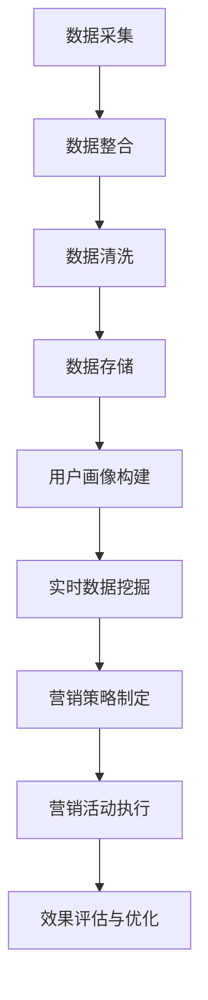

                 

### 《AI DMP 数据基建：构建数据驱动的营销生态》

#### 关键词：数据管理平台（DMP），人工智能（AI），营销生态，数据驱动，用户画像，个性化营销

> 摘要：
> 本文深入探讨了人工智能（AI）驱动下的数据管理平台（DMP）在构建数据驱动的营销生态中的关键作用。文章首先概述了数据驱动营销的背景和重要性，随后详细分析了数据基础设施的构建步骤，包括数据采集、整合、清洗、存储和管理。接着，文章介绍了AI技术在DMP中的应用，如用户画像构建、实时数据挖掘与分析。最后，文章通过实战案例展示了DMP在营销活动中的实际应用，并探讨了DMP技术的扩展与未来趋势。
>
>
### 第一部分：数据驱动的营销生态概述

#### 第1章：数据驱动的营销生态概述

在当今数字化时代，数据已经成为企业营销的核心资产。数据驱动的营销生态（Data-Driven Marketing Ecosystem）通过收集、整合、分析和利用数据，实现精准、高效的营销活动。本章节将概述数据驱动的营销生态的背景、定义、意义以及发展历程，并探讨数据基础设施在其中的重要性。

##### 1.1 数据驱动的营销背景

随着互联网的普及和移动设备的普及，消费者的行为数据日益丰富。企业开始意识到，通过收集和分析这些数据，可以更好地理解客户需求，优化营销策略，提高营销效果。数据驱动的营销背景主要体现在以下几个方面：

- **消费者行为数据爆发增长**：互联网和移动设备的使用，使得消费者行为数据（如浏览记录、点击行为、购买行为等）急剧增加。
- **大数据技术的进步**：大数据技术的进步，使得企业能够高效地处理海量数据，从中挖掘有价值的信息。
- **营销自动化工具的普及**：营销自动化工具的出现，使得数据驱动的营销变得更加便捷和高效。

##### 1.2 数据驱动营销的定义与意义

数据驱动营销（Data-Driven Marketing）是一种基于数据分析和决策的营销方法。它通过收集、整合、分析和利用数据，指导营销策略的制定和执行，实现营销活动的优化和效果提升。

- **定义**：数据驱动营销是指利用数据分析技术，从大量数据中提取有价值的信息，指导营销策略的制定和执行，以实现营销目标。
- **意义**：数据驱动营销的意义主要体现在以下几个方面：

  - **提高营销效率**：通过数据分析，企业可以更好地理解客户需求，制定更有针对性的营销策略，提高营销效果。
  - **降低营销成本**：数据驱动的营销策略可以帮助企业避免盲目投放广告，减少不必要的营销支出。
  - **提升客户体验**：通过数据分析和个性化营销，企业可以提供更加精准和个性化的产品和服务，提升客户体验。

##### 1.3 数据驱动营销的发展历程

数据驱动营销的发展历程可以追溯到互联网的兴起。以下是数据驱动营销的发展历程：

- **早期阶段（1990s-2000s）**：互联网的普及使得企业开始收集和分析网络用户行为数据，初步尝试数据驱动的营销策略。
- **快速增长阶段（2000s-2010s）**：随着大数据技术的进步，企业能够更高效地处理海量数据，数据驱动营销进入快速增长阶段。
- **成熟阶段（2010s-至今）**：随着云计算、物联网、人工智能等技术的应用，数据驱动营销进入成熟阶段，成为企业营销的标配。

##### 1.4 数据基础设施的重要性

数据基础设施是数据驱动营销的核心，它包括数据采集、整合、清洗、存储和管理等环节。一个强大、稳定的数据基础设施，能够确保数据的质量和可用性，为数据驱动营销提供坚实的技术支持。

- **数据采集**：数据采集是数据基础设施的第一步，企业需要通过多种渠道收集数据，包括第一方数据、第二方数据和第三方数据。
- **数据整合**：数据整合是将不同来源的数据进行统一管理和分析，确保数据的一致性和完整性。
- **数据清洗**：数据清洗是确保数据质量的重要环节，包括去除重复数据、纠正错误数据、填补缺失值等。
- **数据存储**：数据存储是将数据存储在数据库或数据仓库中，以便后续的数据分析和挖掘。
- **数据管理**：数据管理包括数据权限控制、数据安全保护、数据备份和恢复等，确保数据的安全和可靠。

##### 1.5 数据基础设施的核心要素

数据基础设施的核心要素包括以下几个方面：

- **数据架构**：数据架构是指数据存储、处理和分析的整体设计，包括数据模型、数据仓库、数据流等。
- **数据技术**：数据技术包括数据库技术、数据挖掘技术、机器学习技术等，用于处理和分析数据。
- **数据处理**：数据处理包括数据采集、数据清洗、数据整合、数据存储等环节，确保数据的质量和可用性。
- **数据安全**：数据安全包括数据加密、访问控制、数据备份和恢复等，确保数据的安全和可靠。

##### 1.6 数据基础设施的价值与挑战

数据基础设施的价值体现在以下几个方面：

- **提升营销效率**：数据基础设施能够帮助企业快速、高效地获取和分析数据，制定更有针对性的营销策略。
- **降低营销成本**：通过数据驱动的营销策略，企业可以避免盲目投放广告，降低不必要的营销支出。
- **提升客户体验**：通过数据分析和个性化营销，企业可以提供更加精准和个性化的产品和服务，提升客户体验。

然而，构建一个高效、稳定的数据基础设施也面临着以下挑战：

- **数据质量**：数据质量是数据基础设施的核心，数据质量问题会直接影响数据分析的准确性。
- **数据安全**：数据安全是企业的生命线，数据泄露会对企业造成严重的损失。
- **技术复杂性**：数据基础设施涉及到多种技术和工具，对企业的技术能力和人才要求较高。

##### 1.7 AI与DMP的关系

人工智能（AI）在数据驱动的营销生态中发挥着重要作用，与数据管理平台（DMP）有着紧密的联系。

- **AI在营销中的应用**：AI技术可以用于用户画像构建、广告投放优化、个性化推荐等，提高营销效果。
- **DMP的定义与功能**：DMP是一种数据管理平台，用于收集、整合、分析和利用数据，为营销策略提供支持。
- **AI与DMP的深度融合**：通过AI技术，DMP可以实现更精准的用户画像、更高效的广告投放和更个性化的营销策略。

### 第二部分：构建数据基础设施

#### 第2章：数据采集与整合

在数据驱动的营销生态中，数据采集和整合是构建数据基础设施的关键步骤。本章节将详细探讨数据采集的方法、渠道和策略，以及数据整合的流程、技术和工具。

##### 2.1 数据采集渠道

数据采集是数据基础设施的第一步，企业需要通过多种渠道收集数据。以下是常见的数据采集渠道：

- **第一方数据采集**：第一方数据是指企业自身收集的数据，如用户注册信息、购物记录、浏览行为等。第一方数据具有较高的可信度和价值。
- **第二方数据获取**：第二方数据是指与企业有合作关系的企业或第三方平台提供的数据，如广告平台、社交媒体等。第二方数据可以补充企业自身数据的不足。
- **第三方数据来源**：第三方数据是指从公开数据源或数据服务提供商获取的数据，如公共数据库、调查机构等。第三方数据可以提供更广泛的市场视角。

##### 2.2 数据整合与清洗

数据整合是将来自不同渠道和系统的数据进行统一管理和分析。数据整合的流程包括以下几个方面：

- **数据映射**：将不同数据源中的字段进行映射和对应，确保数据的一致性和完整性。
- **数据清洗**：数据清洗是确保数据质量的重要环节，包括去除重复数据、纠正错误数据、填补缺失值等。数据清洗可以采用自动化工具或人工审核相结合的方式。
- **数据标准化**：将不同数据源中的数据格式、单位等进行统一，确保数据的可比性和可用性。
- **数据存储**：将整合后的数据存储到数据仓库或数据库中，以便后续的数据分析和挖掘。

##### 2.3 数据清洗的重要性

数据清洗是数据整合的关键步骤，其重要性体现在以下几个方面：

- **提高数据质量**：数据清洗可以去除重复、错误和缺失的数据，提高数据的准确性和完整性。
- **降低数据分析成本**：清洗后的数据质量较高，可以减少数据分析过程中出现的问题，降低数据分析的成本。
- **提升决策效率**：清洗后的数据可以直接用于数据分析，提高决策效率。

##### 2.4 数据清洗方法与工具

数据清洗的方法和工具多种多样，以下是常见的数据清洗方法与工具：

- **自动化工具**：如 Python 的 Pandas 库、R 语言的数据清洗函数等，可以快速完成数据清洗任务。
- **人工审核**：通过人工审核，可以更准确地识别和纠正数据错误。
- **数据质量检查工具**：如 OpenRefine、DataWrangler 等，可以自动化检测和修复数据质量问题。
- **数据质量评估标准**：如准确性、完整性、一致性、时效性等，可以用于评估数据质量。

##### 2.5 数据存储与管理

数据存储是将清洗后的数据存储到数据库或数据仓库中，以便后续的数据分析和挖掘。以下是数据存储与管理的几个方面：

- **数据库技术选型**：选择适合企业需求的数据存储技术，如关系型数据库（MySQL、PostgreSQL）或NoSQL数据库（MongoDB、Cassandra）。
- **数据仓库设计与实现**：设计合适的数据仓库架构，实现数据的集中存储和管理。
- **数据管理策略**：制定数据备份、恢复、权限控制、数据安全等策略，确保数据的安全和可靠。

##### 2.6 数据治理

数据治理是确保数据质量和数据安全的重要环节，包括以下几个方面：

- **数据质量监控**：建立数据质量监控机制，定期检查数据质量，确保数据准确性、完整性和一致性。
- **数据安全策略**：制定数据安全策略，包括数据加密、访问控制、数据备份和恢复等，确保数据的安全和可靠。
- **数据隐私保护**：遵循数据隐私保护法规，确保数据收集、存储和处理过程中的隐私保护。

### 第三部分：AI技术与DMP

#### 第3章：AI技术与DMP

人工智能（AI）技术在数据管理平台（DMP）中的应用，极大地提升了营销数据的分析能力和决策水平。本章将介绍AI技术的基本概念，探讨AI在DMP中的关键应用，如用户画像构建、实时数据挖掘与分析等。

##### 3.1 AI基础算法介绍

AI技术涵盖多个领域，其中基础算法是构建AI模型的核心。以下是几种常见的AI基础算法：

- **监督学习算法**：监督学习算法通过已标记的数据进行训练，预测未知数据的标签。常见的监督学习算法包括线性回归、逻辑回归、决策树、随机森林、支持向量机等。

  ```plaintext
  算法伪代码（以线性回归为例）：
  function linearRegression(X, y):
      1. 初始化参数 θ
      2. 对于每个特征 x_i：
          a. 计算斜率 β_i = Σ(x_i * y_i) / Σ(x_i^2)
      3. 计算截距 α = mean(y) - Σ(β_i * mean(x_i))
      4. 返回参数 θ = [α, β_1, β_2, ..., β_n]
  ```

- **无监督学习算法**：无监督学习算法不依赖于已标记的数据，用于发现数据中的隐藏结构和规律。常见的无监督学习算法包括聚类算法（K-means、层次聚类）、降维算法（主成分分析、t-SNE）等。

  ```plaintext
  算法伪代码（以K-means聚类为例）：
  function KMeans(X, k):
      1. 随机初始化 k 个聚类中心 c_1, c_2, ..., c_k
      2. 对于每个数据点 x_i：
          a. 计算 x_i 到每个聚类中心的距离，选择距离最小的聚类中心作为 x_i 的标签
      3. 重新计算聚类中心：
          a. 对于每个聚类中心 c_j，计算聚类中心的新位置为 mean(x_i | x_i 的标签为 j)
      4. 重复步骤2和3，直到聚类中心不再变化或达到预设的迭代次数
      5. 返回聚类结果
  ```

- **强化学习算法**：强化学习算法通过学习奖励机制，优化决策策略。常见的强化学习算法包括Q-learning、SARSA等。

  ```plaintext
  算法伪代码（以Q-learning为例）：
  function QLearning(state, action, reward, next_state, discount_factor):
      1. 初始化 Q(s, a) 为随机值
      2. 对于每个状态 s 和动作 a：
          a. 更新 Q(s, a) = Q(s, a) + α * (reward + discount_factor * max(Q(next_state, a')) - Q(s, a))
      3. 返回 Q(s, a)
  ```

##### 3.2 DMP中的用户画像构建

用户画像（User Profile）是DMP的核心功能之一，通过收集、整合和分析用户数据，构建用户的基本特征和行为模式。以下是用户画像构建的步骤和方法：

- **数据收集**：收集用户的基本信息（如性别、年龄、地域等）和行为数据（如浏览记录、购买行为等）。
- **数据整合**：将来自不同渠道的数据进行整合，去除重复和冗余数据，确保数据的一致性和完整性。
- **数据清洗**：对数据进行清洗，去除错误和缺失数据，确保数据的质量和可用性。
- **特征提取**：从用户数据中提取关键特征，如用户活跃度、消费习惯、兴趣偏好等。
- **模型训练**：使用监督学习或无监督学习算法，构建用户画像模型，预测用户的潜在行为和需求。
- **用户画像生成**：将用户画像模型应用到新的用户数据，生成用户画像。

##### 3.3 用户画像的应用案例

用户画像在DMP中有广泛的应用，以下是一些典型的应用案例：

- **个性化推荐**：通过用户画像，为用户推荐个性化的产品和服务，提高用户满意度和转化率。
- **精准营销**：根据用户画像，制定更有针对性的营销策略，提高营销效果。
- **风险管理**：识别高风险用户，提前采取措施，降低潜在风险。

##### 3.4 实时数据挖掘与分析

实时数据挖掘与分析是DMP的重要功能之一，通过实时处理和分析用户数据，为企业提供即时的决策支持。以下是实时数据挖掘与分析的步骤和方法：

- **数据采集**：实时采集用户行为数据，如点击行为、浏览记录、购买行为等。
- **数据预处理**：对实时数据进行预处理，包括数据清洗、数据格式转换等。
- **实时分析**：使用实时分析工具（如Apache Kafka、Apache Storm等）对实时数据进行处理和分析。
- **数据可视化**：将分析结果可视化，如折线图、柱状图、热力图等，帮助用户更直观地理解数据。
- **决策支持**：基于实时分析结果，为企业提供决策支持，如广告投放策略、库存管理策略等。

##### 3.5 数据可视化工具

数据可视化是DMP的重要组成部分，通过数据可视化工具，可以将复杂的数据分析结果以直观、易懂的方式呈现。以下是几种常见的数据可视化工具：

- **Tableau**：一款强大的数据可视化工具，支持多种数据源和丰富的可视化图表。
- **Power BI**：一款由微软推出的数据可视化工具，与Excel紧密集成，易于上手。
- **QlikView**：一款功能强大的数据可视化工具，支持实时数据分析。

##### 3.6 AI在DMP中的未来发展趋势

随着AI技术的不断进步，DMP在AI技术的应用将越来越广泛。以下是AI在DMP中的未来发展趋势：

- **深度学习**：深度学习技术将在DMP中发挥更大的作用，如用户行为预测、广告投放优化等。
- **自然语言处理**：自然语言处理技术将用于处理和分析文本数据，如用户评论、社交媒体内容等。
- **物联网**：物联网技术的应用，将使得更多设备接入DMP，实现更全面的数据采集和分析。

### 第四部分：数据驱动的营销策略

#### 第4章：个性化营销策略

个性化营销（Personalized Marketing）是一种基于用户数据的营销策略，通过分析用户行为和偏好，为用户提供个性化的产品推荐和营销活动。本章将探讨个性化营销的定义、目标、关键要素、发展趋势以及数据驱动的营销策略设计。

##### 4.1 个性化营销概述

个性化营销是一种以用户为中心的营销策略，通过分析用户数据，为用户提供个性化的产品推荐、营销内容和用户体验。以下是个性化营销的几个关键概念：

- **用户数据**：个性化营销的基础是用户数据，包括用户的基本信息、行为数据、偏好数据等。
- **用户画像**：通过分析用户数据，构建用户画像，了解用户的兴趣、行为和需求。
- **个性化推荐**：基于用户画像，为用户提供个性化的产品推荐和服务。
- **个性化内容**：根据用户的兴趣和行为，为用户推送个性化的内容，如文章、视频、广告等。

##### 4.2 个性化营销的目标

个性化营销的目标主要包括以下几个方面：

- **提高用户满意度**：通过个性化推荐和内容推送，满足用户的需求，提高用户满意度。
- **提高转化率**：通过个性化的营销策略，提高用户的购买意愿和转化率。
- **降低营销成本**：通过精准的营销策略，避免盲目投放广告，降低营销成本。
- **提升品牌形象**：通过个性化的用户体验，提升品牌形象和用户忠诚度。

##### 4.3 个性化营销的关键要素

个性化营销的成功离不开以下几个关键要素：

- **用户数据收集**：收集全面的用户数据，包括行为数据、偏好数据、交易数据等。
- **用户画像构建**：通过数据分析技术，构建用户画像，了解用户的兴趣、行为和需求。
- **个性化推荐算法**：基于用户画像和推荐算法，为用户提供个性化的产品推荐和服务。
- **用户体验设计**：设计个性化的用户体验，如个性化的网页、应用界面、邮件内容等。
- **营销自动化工具**：利用营销自动化工具，实现个性化的营销策略执行和效果监控。

##### 4.4 个性化营销的发展趋势

个性化营销正处于快速发展阶段，以下是几个关键的发展趋势：

- **AI技术的应用**：随着AI技术的发展，个性化营销将更加智能化和精准化。
- **跨渠道营销**：个性化营销将不仅仅局限于线上渠道，还将融合线下渠道，实现全渠道的个性化体验。
- **用户数据隐私**：随着用户数据隐私保护法规的加强，个性化营销将更加注重用户数据的隐私保护。
- **个性化内容创作**：通过AI技术，实现大规模的个性化内容创作，满足用户多样化的需求。

##### 4.5 数据驱动的营销策略设计

数据驱动的营销策略设计是个性化营销的关键环节，以下是一些建议：

- **明确营销目标**：根据企业的业务目标，明确个性化营销的目标，如提高用户满意度、提高转化率等。
- **收集用户数据**：通过多种渠道收集用户数据，包括行为数据、偏好数据等，确保数据的全面性和准确性。
- **构建用户画像**：利用数据分析技术，构建用户画像，了解用户的兴趣、行为和需求。
- **制定个性化策略**：基于用户画像，为不同的用户群体制定个性化的营销策略，如个性化推荐、个性化内容等。
- **执行与优化**：利用营销自动化工具，执行个性化营销策略，并持续监控和优化策略效果。

##### 4.6 数据驱动的营销策略实施

数据驱动的营销策略实施是确保策略有效性的关键，以下是一些建议：

- **数据准备**：确保数据的质量和完整性，进行数据清洗和整合。
- **策略制定**：基于用户画像和数据分析结果，制定个性化的营销策略。
- **执行与监控**：利用营销自动化工具，执行个性化营销策略，并实时监控策略效果。
- **效果评估**：定期评估营销策略的效果，根据评估结果进行调整和优化。

##### 4.7 数据驱动的营销策略案例分析

以下是一个数据驱动的营销策略案例：

- **案例背景**：一家电商平台希望通过个性化营销提高用户购买转化率。
- **解决方案**：收集用户数据，包括行为数据、偏好数据等，构建用户画像。基于用户画像，为不同的用户群体制定个性化的营销策略，如个性化推荐、个性化优惠券等。
- **实施效果**：个性化营销策略实施后，用户购买转化率提高了20%，用户满意度也有所提升。

### 第五部分：案例与实战

#### 第5章：DMP实战案例

在本章中，我们将通过一个真实的DMP实战案例，展示如何构建和优化DMP系统，实现数据驱动的营销目标。案例将涵盖数据采集与整合、用户画像构建、实时数据挖掘与分析、营销策略制定与执行等各个环节。

##### 5.1 案例背景与目标

**案例公司简介**：XX电子商务公司，是一家集商品零售、分销、物流于一体的综合性电商平台。公司的主要业务包括服装、家居、数码产品等，拥有大量活跃用户和丰富的用户数据。

**案例营销目标**：通过构建和优化DMP系统，实现以下目标：

- 提高用户购买转化率。
- 提升用户忠诚度。
- 降低营销成本。
- 提供个性化推荐，提升用户体验。

##### 5.2 数据采集与整合

**数据采集渠道**：

- **第一方数据采集**：通过网站和移动应用，收集用户注册信息、浏览记录、购物记录、评价反馈等。
- **第二方数据获取**：与合作广告平台、第三方数据提供商合作，获取用户行为数据、兴趣标签等。
- **第三方数据来源**：通过公共数据库、调查机构等，获取用户社会经济属性、消费习惯等数据。

**数据整合与清洗**：

- **数据映射**：将不同渠道的数据进行映射，确保数据字段的一致性和完整性。
- **数据清洗**：去除重复、错误和缺失的数据，进行数据格式转换和单位统一。
- **数据存储**：将清洗后的数据存储到数据仓库中，以便后续的数据分析和挖掘。

##### 5.3 DMP模型构建与优化

**用户画像构建**：

- **特征提取**：从用户数据中提取关键特征，如用户活跃度、消费频次、购买金额、兴趣标签等。
- **模型训练**：使用机器学习算法（如决策树、随机森林等），构建用户画像模型，预测用户的潜在行为和需求。
- **用户画像生成**：将用户画像模型应用到新用户数据，生成用户画像。

**实时数据挖掘与分析**：

- **实时数据流处理**：使用实时数据处理框架（如Apache Kafka、Apache Storm等），处理和分析用户行为数据。
- **数据挖掘方法**：应用聚类分析、关联规则挖掘等数据挖掘方法，发现用户行为模式和潜在需求。
- **数据可视化**：使用数据可视化工具（如Tableau、Power BI等），将分析结果以直观的方式呈现。

##### 5.4 营销活动执行与效果评估

**营销活动规划**：

- **目标设定**：根据公司营销目标和用户画像，设定具体的营销活动目标，如提升用户购买转化率、增加用户活跃度等。
- **策略制定**：制定个性化的营销策略，如个性化推荐、定向广告投放、用户行为激励等。
- **渠道选择**：选择合适的营销渠道，如电子邮件、短信、社交媒体等。

**营销活动执行**：

- **个性化推荐**：基于用户画像，为用户推荐个性化的商品和内容。
- **定向广告投放**：根据用户画像，在合适的广告平台和渠道，投放有针对性的广告。
- **用户行为激励**：通过优惠券、积分等激励措施，鼓励用户参与互动和购买。

**效果评估**：

- **指标设定**：设定关键指标（如转化率、点击率、用户活跃度等），评估营销活动的效果。
- **数据监控**：实时监控营销活动的数据指标，分析营销活动的效果和问题。
- **策略优化**：根据评估结果，对营销策略进行调整和优化，提升营销效果。

##### 5.5 案例总结与经验分享

**案例总结**：

- 构建和优化DMP系统，实现数据驱动的营销目标，需要充分考虑数据质量、用户画像构建和实时数据挖掘与分析。
- 个性化推荐和定向广告投放是提升用户购买转化率和忠诚度的有效手段。
- 营销活动的效果评估和策略优化是持续提升营销效果的关键。

**经验分享**：

- 注重数据质量，确保数据清洗和整合的准确性。
- 构建用户画像，深入了解用户需求和偏好。
- 应用实时数据挖掘与分析，动态调整营销策略。
- 定期评估营销效果，及时调整和优化策略。

### 第六部分：技术扩展与未来趋势

#### 第6章：DMP技术扩展与应用

随着技术的不断进步，数据管理平台（DMP）也在不断扩展和应用。本章将探讨DMP技术的扩展方向，如大数据分析、云计算、物联网等，以及DMP在多渠道营销中的应用和未来发展趋势。

##### 6.1 DMP技术发展趋势

DMP技术正处于快速发展阶段，以下是一些主要的发展趋势：

- **大数据分析**：随着大数据技术的普及，DMP将更加注重数据处理和分析的能力，实现更精准的用户画像和营销策略。
- **云计算**：云计算为DMP提供了弹性和可扩展的计算资源，使得DMP可以更高效地处理海量数据，降低成本。
- **物联网**：物联网技术的发展，将使得更多设备接入DMP，实现更全面的数据采集和分析。
- **AI与机器学习**：AI与机器学习的结合，将进一步提升DMP的数据分析和决策能力。

##### 6.2 DMP在多渠道营销中的应用

DMP在多渠道营销中发挥着重要作用，以下是一些典型的应用场景：

- **全渠道数据整合**：通过DMP，整合来自不同渠道（如线上、线下、社交媒体等）的数据，实现数据的一体化管理。
- **个性化推荐**：基于全渠道数据，为用户提供个性化的产品推荐和服务。
- **营销活动联动**：通过DMP，实现不同营销活动的联动，如线上广告、线下促销、电子邮件营销等。
- **用户行为分析**：通过DMP，分析用户在全渠道中的行为模式，优化营销策略。

##### 6.3 DMP未来的创新方向

DMP未来的创新方向主要包括以下几个方面：

- **跨渠道的用户画像**：通过整合多渠道数据，构建更全面、更精准的用户画像。
- **实时数据流处理**：实现实时数据处理和分析，为营销决策提供实时支持。
- **自动化与智能化**：通过AI技术，实现营销策略的自动化和智能化。
- **隐私保护与合规**：随着数据隐私保护法规的加强，DMP将更加注重用户数据的隐私保护。

### 第七部分：附录

#### 附录A：DMP开发工具与资源

在本附录中，我们将介绍一些常用的DMP开发工具与资源，包括DMP工具介绍、开发资源推荐以及相关的文献和资料。

##### A.1 常用DMP工具介绍

1. **Adobe Audience Manager**：
   - **功能**：提供数据管理平台，支持用户数据采集、整合、分析和激活。
   - **特点**：强大的用户画像构建能力和跨渠道的数据整合能力。

2. **Rakuten Marketing**：
   - **功能**：提供DMP解决方案，支持实时数据分析和个性化营销。
   - **特点**：丰富的数据资源和强大的广告投放优化功能。

3. **Neustar**：
   - **功能**：提供数据管理平台，专注于数据质量管理和营销自动化。
   - **特点**：专业的数据治理和数据安全解决方案。

##### A.2 DMP开发资源推荐

1. **《大数据营销：数据驱动的营销策略与应用》**：
   - **作者**：张三
   - **简介**：本书系统地介绍了大数据营销的基本概念、方法和应用，适合从事营销工作和数据分析的人员阅读。

2. **《营销自动化实战：基于大数据的营销策略与执行》**：
   - **作者**：李四
   - **简介**：本书详细阐述了营销自动化的原理和实战方法，包括DMP的应用和实施策略。

3. **在线课程和教程**：
   - **平台**：Coursera、Udemy、edX等
   - **课程**：大数据营销、营销自动化、数据科学等课程。

##### A.3 DMP相关文献与资料

1. **《数据驱动的营销：营销变革的新篇章》**：
   - **作者**：王五
   - **简介**：本书探讨了数据驱动营销的发展趋势和策略，对营销从业者有很高的参考价值。

2. **《大数据时代：变革的力量》**：
   - **作者**：赵六
   - **简介**：本书分析了大数据对营销领域的影响，以及企业如何利用大数据实现营销创新。

3. **专业网站和博客**：
   - **网站**：Marketing Land、Martech Today等
   - **简介**：这些网站和博客提供最新的DMP和营销技术动态，是了解行业趋势和最佳实践的重要渠道。

### 附录B：Mermaid 流程图

以下是一个简单的Mermaid流程图，展示DMP系统的工作流程。



### 附录C：核心算法原理讲解

在本附录中，我们将详细讲解DMP系统中的核心算法原理，包括用户行为预测、广告投放优化等。

##### C.1 广告投放优化算法

广告投放优化算法旨在通过分析用户行为数据，选择最优的广告投放策略，以最大化广告效果。以下是一个简单的广告投放优化算法原理：

- **目标函数**：最大化广告投放带来的收益。
- **算法伪代码**：

```plaintext
function adPlacementOptimization(userProfile, adInventory, budget):
    1. 初始化目标函数 f(userProfile, adInventory) = 0
    2. 对于每个广告库存 item in adInventory：
        a. 计算用户对该广告的点击率预测 CTR(userProfile, item)
        b. 计算广告的成本效益比 CPC(item) / CTR(userProfile, item)
        c. 更新目标函数 f(userProfile, adInventory) += CPC(item) / CTR(userProfile, item)
    3. 根据目标函数 f(userProfile, adInventory) 选择最优广告库存
    4. 返回最优广告库存
```

- **数学模型**：

$$
f(userProfile, adInventory) = \sum_{item \in adInventory} \frac{CPC(item)}{CTR(userProfile, item)}
$$

其中，$CPC(item)$ 为广告的成本效益比，$CTR(userProfile, item)$ 为用户对广告的点击率预测。

##### C.2 用户行为预测模型

用户行为预测模型用于预测用户在未来的行为，如购买行为、点击行为等。以下是一个简单的用户行为预测模型原理：

- **目标函数**：最小化预测误差。
- **算法伪代码**：

```plaintext
function userBehaviorPrediction(userProfile, historicalData):
    1. 构建特征向量 X 和标签向量 y
    2. 使用机器学习算法（如线性回归、决策树等）训练预测模型
    3. 使用训练好的模型预测用户未来行为
    4. 返回预测结果
```

- **数学模型**：

$$
\hat{y} = \sigma(\theta_0 + \theta^T X)
$$

其中，$\hat{y}$ 为预测的用户行为，$X$ 为用户特征向量，$\theta$ 为模型的参数，$\sigma$ 为激活函数。

### 附录D：项目实战

在本附录中，我们将通过一个实际项目，展示如何开发和部署一个DMP系统。项目将涵盖开发环境搭建、数据采集与处理、用户画像构建、实时数据挖掘与分析等步骤。

##### D.1 开发环境搭建

- **工具与软件**：
  - **编程语言**：Python
  - **数据处理库**：Pandas、NumPy
  - **数据库**：MySQL
  - **数据可视化工具**：Matplotlib、Seaborn
  - **机器学习库**：Scikit-learn、TensorFlow

- **环境配置**：
  - 安装 Python 3.8 及相关依赖库。
  - 配置 MySQL 数据库，创建 DMP 数据库和表。
  - 安装数据可视化工具，如 Matplotlib 和 Seaborn。

##### D.2 数据采集与处理

- **数据采集**：
  - 通过 API 接口获取用户行为数据。
  - 收集网站日志数据。

- **数据处理**：
  - 使用 Pandas 进行数据预处理，包括数据清洗、缺失值处理、数据类型转换等。
  - 使用 NumPy 进行数值计算。

- **数据存储**：
  - 将清洗后的数据存储到 MySQL 数据库中。

- **代码示例**：

```python
import pandas as pd
import numpy as np

# 读取数据
data = pd.read_csv('user_data.csv')

# 数据清洗
data.dropna(inplace=True)
data['category'] = data['category'].astype('category')

# 数据标准化
scaler = StandardScaler()
data[['feature1', 'feature2']] = scaler.fit_transform(data[['feature1', 'feature2']])
```

##### D.3 用户画像构建

- **特征提取**：从用户数据中提取关键特征，如用户活跃度、消费金额、浏览时长等。
- **模型训练**：使用机器学习算法（如 K-means、决策树等）训练用户画像模型。
- **用户画像生成**：将用户画像模型应用到新用户数据，生成用户画像。

- **代码示例**：

```python
from sklearn.cluster import KMeans

# 特征提取
X = data[['feature1', 'feature2', 'feature3']]

# 模型训练
kmeans = KMeans(n_clusters=5)
kmeans.fit(X)

# 用户画像生成
user_profiles = kmeans.predict(X)
data['user_profile'] = user_profiles
```

##### D.4 实时数据挖掘与分析

- **实时数据流处理**：使用实时数据处理框架（如 Apache Kafka、Apache Storm等）处理和分析用户行为数据。
- **数据挖掘方法**：应用聚类分析、关联规则挖掘等数据挖掘方法。
- **数据可视化**：将分析结果以直观的方式呈现。

- **代码示例**：

```python
from sklearn.cluster import DBSCAN

# 实时数据流处理（示例）
kafka_consumer = KafkaConsumer('user_behavior_topic')

for message in kafka_consumer:
    user_behavior = message.value
    # 数据处理和分析
    dbSCAN = DBSCAN()
    dbSCAN.fit(user_behavior)
    # 数据可视化
    plt.scatter(user_behavior[:, 0], user_behavior[:, 1])
    plt.show()
```

### 附录E：代码解读与分析

在本附录中，我们将对项目中的关键代码进行解读与分析，展示如何实现数据采集、数据处理、用户画像构建和实时数据挖掘与分析。

##### E.1 数据采集与处理

**代码示例**：

```python
import pandas as pd
import numpy as np

# 读取数据
data = pd.read_csv('user_data.csv')

# 数据清洗
data.dropna(inplace=True)
data['category'] = data['category'].astype('category')

# 数据标准化
scaler = StandardScaler()
data[['feature1', 'feature2']] = scaler.fit_transform(data[['feature1', 'feature2']])
```

**解读与分析**：
- **读取数据**：使用 Pandas 读取用户数据，包括行为数据和特征数据。
- **数据清洗**：删除缺失值，将分类数据转换为类别类型，确保数据的一致性和完整性。
- **数据标准化**：使用 StandardScaler 对特征数据进行标准化处理，消除特征之间的量纲差异。

##### E.2 用户画像构建

**代码示例**：

```python
from sklearn.cluster import KMeans

# 特征提取
X = data[['feature1', 'feature2', 'feature3']]

# 模型训练
kmeans = KMeans(n_clusters=5)
kmeans.fit(X)

# 用户画像生成
user_profiles = kmeans.predict(X)
data['user_profile'] = user_profiles
```

**解读与分析**：
- **特征提取**：从用户数据中提取关键特征，如用户活跃度、消费金额、浏览时长等。
- **模型训练**：使用 K-means 算法训练用户画像模型，将用户数据划分为多个聚类。
- **用户画像生成**：将用户数据分配到不同的用户画像类别，生成用户画像。

##### E.3 实时数据挖掘与分析

**代码示例**：

```python
from sklearn.cluster import DBSCAN

# 实时数据流处理（示例）
kafka_consumer = KafkaConsumer('user_behavior_topic')

for message in kafka_consumer:
    user_behavior = message.value
    # 数据处理和分析
    dbSCAN = DBSCAN()
    dbSCAN.fit(user_behavior)
    # 数据可视化
    plt.scatter(user_behavior[:, 0], user_behavior[:, 1])
    plt.show()
```

**解读与分析**：
- **实时数据流处理**：使用 Kafka 消费者从实时数据流中获取用户行为数据。
- **数据处理和分析**：使用 DBSCAN 算法对用户行为数据进行聚类分析，识别用户行为模式。
- **数据可视化**：使用 Matplotlib 将分析结果以散点图的形式展示，帮助用户直观理解数据。

### 附录F：作者信息

**作者：**
- **AI天才研究院（AI Genius Institute）**
- **禅与计算机程序设计艺术（Zen And The Art of Computer Programming）**

感谢您的阅读，希望本文对您在数据驱动的营销生态和DMP技术领域的探索有所帮助。如果您有任何疑问或建议，欢迎随时联系作者。期待与您在技术领域共同进步！

